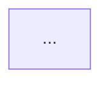

# Write Article

Skill for writing technical articles in the knowledge-base.
Don't use em dash —.
Make mermaid diagrams. Use `graph TD` or `flowchart TD` so diagrams stack vertically -- never `LR` (side by side). Diagrams should render one below the other, not next to each other. Wrap each mermaid block in a centered div so the diagram is centered on the page:

```md
<div style={{display: 'flex', justifyContent: 'center'}}>



</div>
```

For every concept add a paragraph and mermaid diagram that renders.
Make it easy to read for humans. 
Don't keep paragraph too shot but don't make it verbose as well. 
Include examples.
Make article exhaustive.
Article should be in 'problem' and solution format. It should clearly show what this solution is for. Thereby making sure that readers learn to apply knowledge to situations and not just know it.
For technology that u are writing about make sure that u provide the context that what problem it solved and why this technology was necessary. I say this cause then it will help reader decide that hey I can use it to solve x problem etc.
Write article based on human written sources instead of generating AI based non sense, make it  properly sourced and backed.