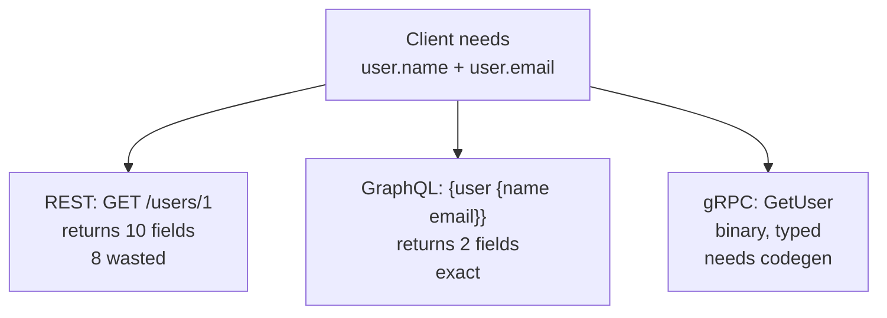
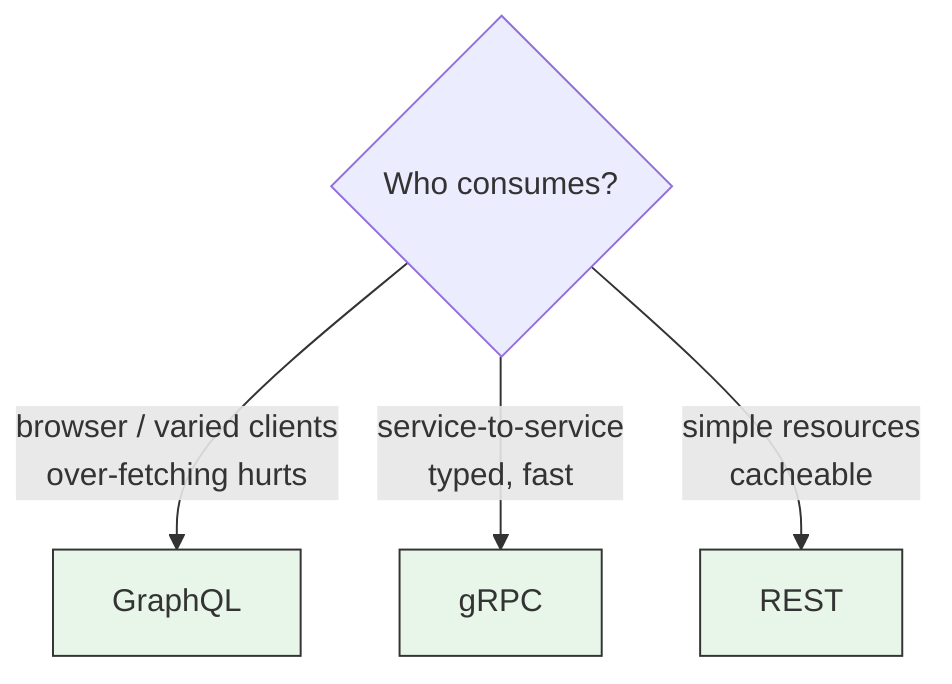
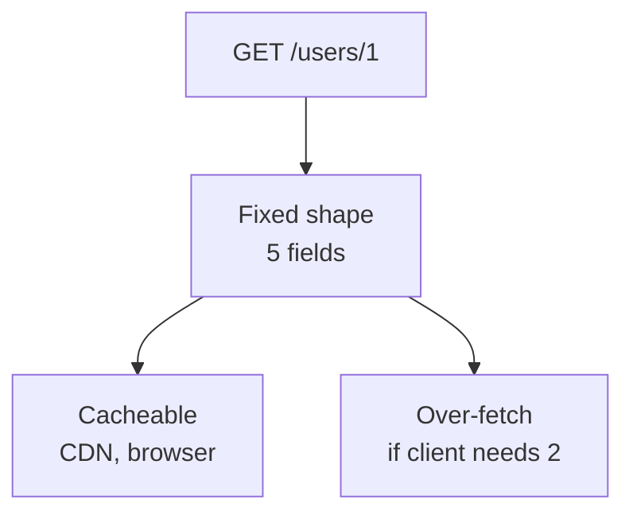
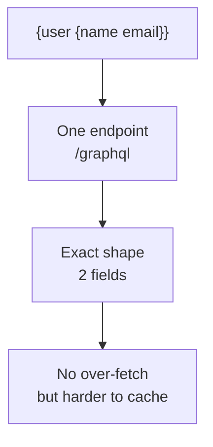
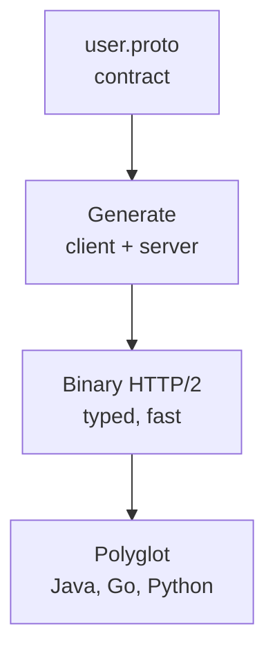
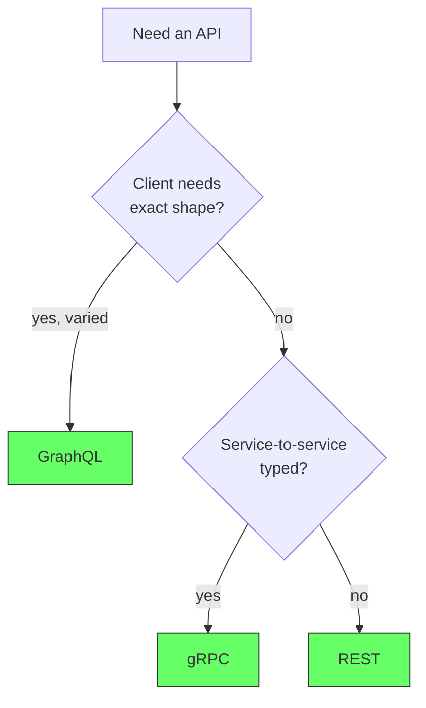

# API Design - REST, GraphQL, gRPC

## What is an API?

APIs are mechanisms that enable two software components to communicate with each other using a set of definitions and protocols. For example, the weather bureau's software system contains daily weather data. The weather app on your phone "talks" to this system via APIs and shows you daily weather updates on your phone.

## The problem: clients need data, but the wrong shape costs

A client asks for data. With the wrong API shape you get two costs at once: the client fetches data it doesn't need, and the server does work that no one asked for.

*   **REST** returns a fixed shape: `GET /users/1` returns 10 fields even if the client needs 2.
*   **GraphQL** lets the client ask for exactly 2 fields, but now the server must parse and resolve an arbitrary query.
*   **gRPC** is fast and typed, but needs code generation and struggles in browsers.

Picking the wrong one means over-fetching, under-fetching, or operational complexity you don't need.

<div style={{display: 'flex', justifyContent: 'center'}}>



</div>

## The solution: choose by how the client consumes

There is no best API. There is a best fit for a consumption pattern.

*   **REST** - resource-oriented, cacheable, simple. Use when clients need predictable resources.
*   **GraphQL** - client-specified shape, one endpoint. Use when clients are varied (web, mobile) and over-fetching hurts.
*   **gRPC** - contract-first, binary, streaming. Use when services talk to services and latency matters.

<div style={{display: 'flex', justifyContent: 'center'}}>



</div>

## REST - resource-oriented and cacheable

**What it is:** Each URL is a resource. HTTP methods are the verbs. The server and client are stateless.

```js
// Express REST - one endpoint per resource, fixed shape
app.get('/users/:id', (req, res) => {
  const user = db.users.find(u => u.id === req.params.id)
  res.json({ id: user.id, name: user.name, email: user.email, country: user.country, bio: user.bio }) // fixed 5 fields
})
// Client needs only name + email -> still gets 5 fields
```

**When it wins:**

*   Public APIs where caching matters (`GET /users/1` is cacheable by CDN, `GET` is idempotent).
*   Simple CRUD where the shape is stable.

**When it hurts:**

*   Mobile client needs 2 fields, web needs 10 -> either over-fetch or add `?fields=name,email` and reinvent GraphQL.

<div style={{display: 'flex', justifyContent: 'center'}}>



</div>

## GraphQL - client-specified shape

**What it is:** One endpoint `/graphql`, client sends a query describing the exact shape.

```js
// Apollo Server - client asks for exactly what it needs
const typeDefs = `
  type User { id: ID, name: String, email: String, bio: String }
  type Query { user(id: ID): User }
`
// Client query - only 2 fields, no over-fetch
// { user(id: 1) { name email } }
// Response: { data: { user: { name: "Alice", email: "a@b.com" } } }
```

**When it wins:**

*   Varied clients (web needs 10 fields, mobile needs 2) - one backend serves both without new endpoints.
*   Aggregating data from multiple services in one round trip.

**When it hurts:**

*   Caching is harder (POST to one endpoint, not GET).
*   Complexity: resolvers, N+1 without dataloader, schema governance.

<div style={{display: 'flex', justifyContent: 'center'}}>



</div>

## gRPC - contract-first and binary

**What it is:** Define the contract in `.proto`, generate client and server code, communicate over HTTP/2 binary.

```proto
// user.proto - contract, shared between services
service UserService {
  rpc GetUser (GetUserRequest) returns (User);
}
message GetUserRequest { int32 id = 1; }
message User { int32 id = 1; string name = 2; string email = 3; }
```
```js
// Server - typed, no JSON parsing
server.addService(UserService, {
  GetUser: (call, cb) => cb(null, db.users.find(u => u.id === call.request.id))
})
// Client - generated stub, binary over HTTP/2
client.GetUser({ id: 1 }, (err, user) => console.log(user.name))
```

**When it wins:**

*   Service-to-service, low latency, typed contracts, streaming (`stream User`).
*   Polyglot teams: generate Java, Go, Python clients from one `.proto`.

**When it hurts:**

*   Browsers need `grpc-web` proxy - not native.
*   Human debugging is harder (binary, not JSON).

<div style={{display: 'flex', justifyContent: 'center'}}>



</div>

## Choosing - REST vs GraphQL vs gRPC

| | REST | GraphQL | gRPC |
|---|---|---|---|
| **Shape** | Fixed per endpoint | Client-specified | Fixed per proto |
| **Transport** | HTTP/JSON, cacheable | HTTP/JSON, POST, hard to cache | HTTP/2 binary |
| **Best for** | Public, cacheable resources | Varied clients, no over-fetch | Service-to-service, typed |
| **Streaming** | No | Subscriptions (WebSocket) | Yes, native |
| **Tooling** | Simple | Resolver complexity | Codegen required |

<div style={{display: 'flex', justifyContent: 'center'}}>



</div>

## When to mix

Most systems use **REST for public, gRPC for internal, GraphQL for aggregation**:

```
Browser --REST--> API Gateway --gRPC--> Microservices
Mobile  --GraphQL--> BFF (backend for frontend) --gRPC--> Microservices
```

## References

- Fielding, *Architectural Styles and the Design of Network-based Software Architectures* (REST). https://www.ics.uci.edu/~fielding/pubs/dissertation/rest_arch_style.htm
- GraphQL Documentation. *Introduction*. https://graphql.org/learn/
- gRPC Documentation. *Introduction*. https://grpc.io/docs/what-is-grpc/introduction/
- Knowledge base. *Database Comparison* ../computer-science/database-comparison.md, *How to choose a database* ../software-engineering/sql-introduction.md#27-how-to-choose-a-database---the-decision-framework
- Supabase Functions as REST: `supabase/functions/run-sql` in this repo

