# API Versioning: evolve your API without breaking your clients

## TLDR

*   APIs must **change** and **stay stable** at the same time. Versioning is how you ship a breaking change without breaking customers who built against the old contract.
*   Version only when a change is **breaking** (remove/rename a field, change a type, make optional required, change a default). Additive changes (new fields, new endpoints, new enum values) ship in-place with no new version.
*   Run the **old version beside the new one** while consumers migrate. Retire the old version on a published schedule, and **monitor its traffic** so you retire it only when it is quiet.
*   Start with **`v1` from day one** so there is always a contract to fall back on.
*   **Never reuse a version number.** After v1 is retired and v2 is live, do not rename v2 to v1. It breaks every reference and confuses consumers; instead point new users at `latest`/current.
*   **Pick the strategy on day one**: URI path (`/v1/users`) is the default for public APIs; header/media-type for internal or hypermedia APIs; Stripe-style date-pinning when client stability matters most.
*   Never change what an **unversioned** request means: once a version is the default for clients that omit the version, that default must not drift. And when the version lives outside the URL (in a header or `Accept`), always send **`Vary`** so the CDN caches each version separately — without it, a cache keyed on URL alone serves version 1's body to version 2 clients.

## The problem: your API is a promise, and it must change

Your API is a contract. Hundreds of integrations are built against the current shape of `GET /users/1`: mobile apps parse fields by name, partner systems send parameters they were told were required, and a billing pipeline depends on the meaning of an enum value. Meanwhile your product team wants to rename`name` to `fullName`, split one endpoint into two, or change how dates are formatted.

Both things are true at the same time: the contract must stay stable, and the API must evolve. Versioning is the mechanism that lets you ship the change without breaking the promise. As Google puts it, "APIs are fundamentally contracts with users, and users often write code against APIs that is then launched into a production service with the expectation that it continues to work" ([Google, AIP-180 Backward Compatibility](https://google.aip.dev/180)).

<div style={{display: 'flex', justifyContent: 'center'}}>

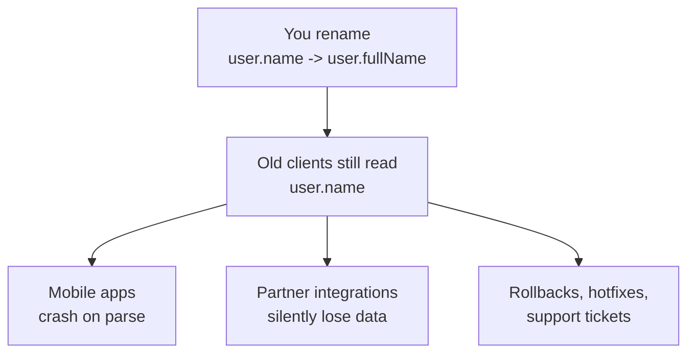

</div>

## Why "just change it" does not work

Most software has a single deploy target: you upgrade the database, the server, and the client together because you control all three. An API is different. The clients that consume it were written months or years ago by people you do not control, and they do not share your release cycle.

Stripe makes the reasoning explicit: with classic `v1` to `v2` jumps, "changes between versions being so big and so impactful for users that it is almost as painful as re-integrating from scratch. It is also not a clear win because there will be a class of users that are unwilling or unable to upgrade and get trapped on old API versions. Providers then have to make the difficult choice between retiring API versions and by extension cutting those users off, or maintaining the old versions forever at considerable cost" ([Stripe, APIs as Infrastructure](https://stripe.com/blog/api-versioning)).

The cost of breaking a client is not just the one deploy. A mobile app shipped to the store cannot be patched instantly. A partner integration is owned by another company's roadmap. Every breaking change you release without a migration path becomes dozens of support conversations, emergency releases, and burned trust.

<div style={{display: 'flex', justifyContent: 'center'}}>

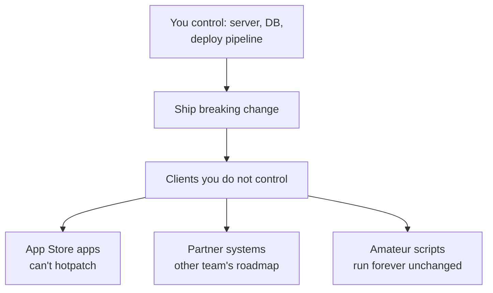

</div>

## The contract: what your clients actually rely on

Google's compatibility guide ([AIP-180](https://google.aip.dev/180)) breaks the contract down into three layers. Knowing which layer a change touches decides whether it is safe:

1. **Source compatibility.** Code written against the old version still compiles against the new version. Relevant mainly when you ship SDKs or typed client libraries.
2. **Wire compatibility.** A client written against the old version can still communicate correctly with the new server. The request and response shapes still match.
3. **Semantic compatibility.** Old code still receives what a reasonable developer would expect. This is subtle: a field that keeps its name and type but changes its *meaning* (say an `amount` that now includes tax) passes wire checks and breaks semantics.

The last layer is where most production incidents hide, because clients end up depending on measurable behavior that was never documented. Renaming a field is an obvious break. Changing the rounding of a price is not obvious, and it breaks just as hard.

<div style={{display: 'flex', justifyContent: 'center'}}>

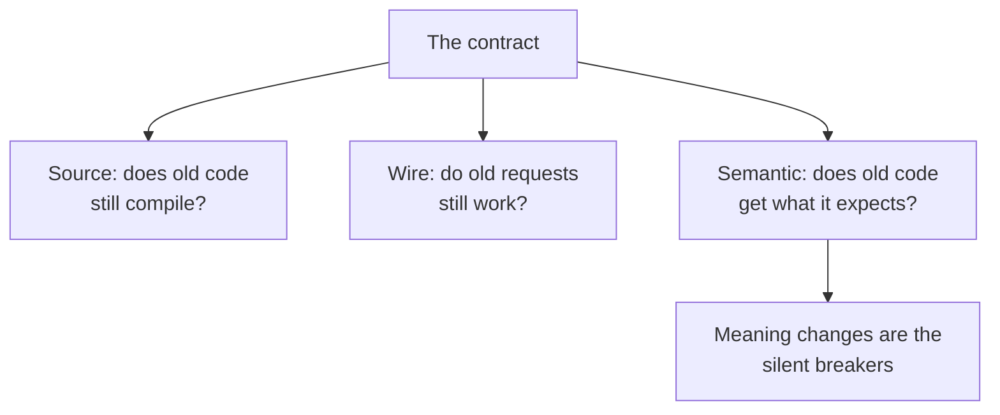

</div>

## Compatible changes vs breaking changes

Before choosing a versioning strategy, you need the rule that decides when a version is *needed at all*. The rule most large API providers converge on is simple: a change is breaking if an existing client must change its code to keep working, and additive if it does not.

**Additive changes are shipped without a new version.** GitHub publishes them to all supported versions at once ([GitHub, Breaking Changes](https://docs.github.com/en/rest/about-the-rest-api/breaking-changes)):

| Additive change | Example |
|---|---|
| New optional field in a response | `GET /users/1` starts returning `bio` |
| New endpoint | `POST /users/1/avatar` appears |
| New optional query/body parameter | `?include=orders` |
| New value in an existing enum | `status: "frozen"` becomes valid |
| Bug fix with no contract change | Correct rounding, same shape |

**Breaking changes require a new version.** GitHub's official list is a good checklist ([GitHub, Breaking Changes](https://docs.github.com/en/rest/about-the-rest-api/breaking-changes)):

| Breaking change | When |
|---|---|
| Remove an operation | Deleting `DELETE /users/1` |
| Remove or rename a parameter | `name` becomes `fullName` |
| Remove or rename a response field | Clients cannot find what they parse |
| Add a new required parameter | Old calls now fail validation |
| Make an optional parameter required | Same failure mode |
| Change the type of a parameter or field | `string` becomes `object` |
| Remove enum values | `status: "archived"` no longer accepted |
| Add a validation rule to a parameter | A previously valid value is now rejected |
| Change authentication or authorization | Tokens of one kind stop working |

Google adds the sneaky ones from its protocol buffer experience: renaming a component is semantically "remove and add", changing a default value is breaking, changing how absent/default fields are serialized is breaking, and changing the semantics of an existing field always requires a new version, even if the bytes look the same ([Google, AIP-180](https://google.aip.dev/180)).

<div style={{display: 'flex', justifyContent: 'center'}}>

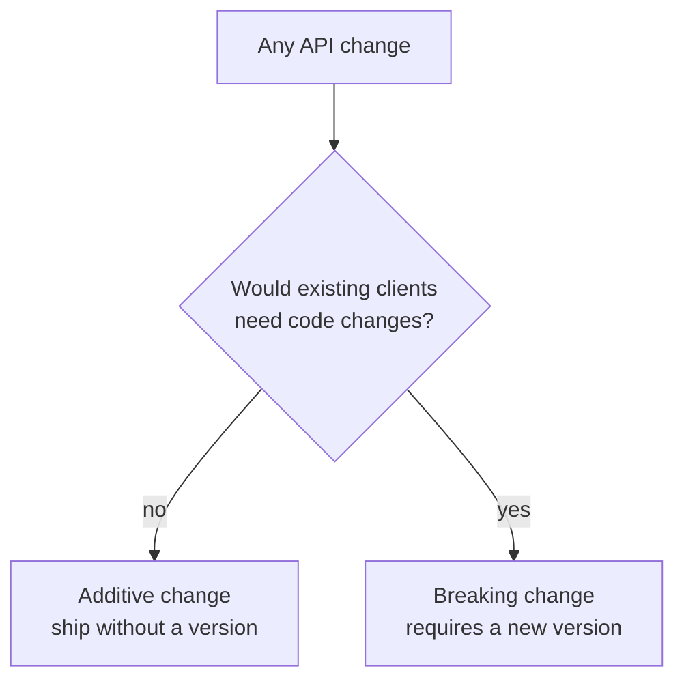

</div>

## Where to put the version: the five strategies

Once a change is breaking, you must label which contract the client is talking to. Five approaches exist, and each makes a different trade-off between visibility, caching, REST purity, and consumer effort ([Docsio, API Versioning](https://docsio.co/blog/api-versioning), [APIScout, API Versioning Strategies](https://apiscout.dev/guides/api-versioning-strategies-2026)):

<div style={{display: 'flex', justifyContent: 'center'}}>

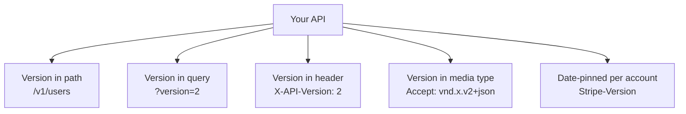

</div>

| Strategy | Version lives in | Visibility | Caching | REST-pure | Consumer effort |
|---|---|---|---|---|---|
| URI path | `/v1/users` | High | Excellent, separate cache keys | Low | Low |
| Query parameter | `?version=2` | Medium | Moderate, cache layers often ignore query strings | Medium | Low |
| Header | `X-API-Version: 2` | Low | Requires `Vary` | High | Medium |
| Media type | `Accept: application/vnd.x.v2+json` | Lowest | Requires `Vary: Accept` | Highest | High |
| Date-pinned | hidden, per-account | Low | Excellent, one URL | Medium | Lowest at upgrade time |

### 1. URI path versioning

The version is a prefix in the path: `GET /v1/users/1` and `GET /v2/users/1`. It is the most widely adopted strategy for public APIs because it is explicit, testable, and cache-friendly. Google encodes the major version as the first segment of the URI path so that "any API URL that you call will never rename or drop any of the fields you rely on" ([Google, Versioning APIs](https://cloud.google.com/blog/products/gcp/versioning-apis-at-google)). Twilio puts a date in the path (`/2010-04-01/Accounts/...`), and most API gateways and CDNs route on path prefixes natively with no configuration ([BSWEN, Comparison of API Versioning Strategies](https://docs.bswen.com/blog/2026-04-17-api-versioning-strategies/)).

```js
// Express: mount each version as its own router
app.use('/v1', v1Router)
app.use('/v2', v2Router)
```

| Pros | Cons |
|---|---|
| Version visible in the URL, logs, and bookmarks | The same logical resource has two URLs, which REST purists object to |
| CDNs cache `/v1/users` and `/v2/users` as separate keys, no extra headers | Every client must change every URL when migrating, painful at 100+ endpoints |
| Works in a browser, curl, and every API tool | Whole API moves at once, so one changed endpoint inflates a whole version |

The REST objection is real but mostly academic: the same resource now lives at two URLs. In practice the pragmatic wins dominate because the same reason you chose REST over HATEOAS is the reason URI versioning feels fine ([Docsio, API Versioning](https://docsio.co/blog/api-versioning)).

### 2. Query parameter versioning

The version is a query parameter: `GET /users/1?version=2`. Azure Resource Manager APIs use this style with a date value, `api-version=2024-01-01` ([Kappafy, API Versioning Decision Tree](https://kappafy.com/research/api-versioning-strategies.html)).

```js
app.get('/users/:id', (req, res) => {
  const version = req.query.version || '1'
  // serialize differently for each version
})
```

| Pros | Cons |
|---|---|
| Stable resource URLs | Easy to forget when copying a link, subtle version skew |
| Clients omitted the parameter can default safely | Some cache layers and proxies do not key on query strings |
| Trivial to read server side | Gets cluttered next to filters and pagination (`?version=2&sort=name&limit=20`) |

Most guides call this a poor long-term strategy and a fine escape hatch during a migration window; the caching problems surface exactly when you scale ([BSWEN, Comparison](https://docs.bswen.com/blog/2026-04-17-api-versioning-strategies/)). Google explicitly advises against hiding version identifiers in the standard `Accept`/`Content-Type` headers, but considers a dedicated version marker acceptable where the format warrants it ([Google, Which Version of Versioning](https://cloud.google.com/blog/products/api-management/api-design-which-version-of-versioning-is-right-for-you)).

### 3. Header versioning

The version travels in a request header such as `X-API-Version: 2` or `API-Version: 2024-01-01`, and the URL stays clean ([Docsio, API Versioning](https://docsio.co/blog/api-versioning)).

```
GET /users/1
X-API-Version: 2
```

| Pros | Cons |
|---|---|
| URLs are stable across versions; migration is one line in the client config | Cannot paste a URL into a browser and see the version |
| Supports per-request versioning, so a client can migrate endpoint by endpoint | Needs `Vary: X-API-Version` on responses or a CDN will serve v1 responses to v2 clients |
| Aligns with HTTP: the version is metadata, not the resource | Gateways must be able to inspect headers (Layer 7 routing) |

The decisive warning from every source: without `Vary`, a CDN that caches by URL may store a v1 response and serve it to a v2 client, a silent correctness bug that looks like your own bug until you find the cache. Set `Vary` to include every request header that changes the response shape ([Jsonic, JSON API Versioning](https://jsonic.io/guides/json-api-versioning)).

### 4. Media type versioning (content negotiation)

The client requests a specific representation through the `Accept` header with a vendor media type: `Accept: application/vnd.company.users.v2+json`. The server replies with the matching `Content-Type` and `Vary: Accept`. This is the strategy REST purists prefer because the URL identifies the resource and the `Accept` header negotiates its representation, exactly as HTTP designed it ([BSWEN, Comparison](https://docs.bswen.com/blog/2026-04-17-api-versioning-strategies/)). GitHub used this approach for years with `application/vnd.github.v3+json`.

```bash
curl https://api.example.com/users/1 \
  -H "Accept: application/vnd.example.users.v2+json"
```

| Pros | Cons |
|---|---|
| Correct use of HTTP content negotiation | Hard to test in a browser; every request needs a crafted header |
| Can version individual resources independently, avoiding whole-API version bloat | High consumer friction; SDK users and ad-hoc integrators both struggle |
| Works beautifully with hypermedia and HAL links | If the header is missing you silently get the wrong version |
| Server can answer `406 Not Acceptable` when a version is unsupported | Tooling, generators, and docs platforms support vendor media types inconsistently |

If you request a version you do not support, the correct response is `406 Not Acceptable` with a JSON body listing what you do support ([StackPractices, API Versioning](https://stackpractices.com/guides/complete-guide-api-versioning-strategies/)).

### 5. Date-pinned versioning (Stripe and GitHub)

Stripe takes a fundamentally different approach: the URL is always `/v1/`, and each *account* is pinned to the date-version that was current when it made its first request. A new date version such as `2017-05-24` ships whenever a breaking change lands, and old accounts keep receiving old behavior with no client changes. A developer can override per request with the `Stripe-Version` header, test the new version against the changelog, and then upgrade the account's pinned version in the dashboard ([Stripe, APIs as Infrastructure](https://stripe.com/blog/api-versioning)). In 2024 Stripe switched to semiannual named major releases (the first was called Acacia) with monthly purely-additive updates in between, so upgrades happen on a predictable schedule ([Stripe, Introducing a New API Release Process](https://stripe.com/blog/introducing-stripes-new-api-release-process)).

Internally Stripe keeps a single current implementation and layers *version change modules* on top: to answer a request for an older version it formats the response with the current code, then walks back through time applying each transformation, which keeps old versions cheap to maintain ([Stripe, APIs as Infrastructure](https://stripe.com/blog/api-versioning)).

GitHub now does something similar: breaking changes ship in dated API versions such as `2026-03-10`, additive changes go to all supported versions, the previous version stays supported for at least 24 more months, and once an old version closes, requests for it get `410 Gone` ([GitHub, API Versions](https://docs.github.com/rest/overview/api-versions)).

This model eliminates the worst part of versioning: forcing clients to migrate on your schedule. The catch is that you must invest in compatibility infrastructure and transformation layers ([APIScout, API Versioning Strategies](https://apiscout.dev/guides/api-versioning-strategies-2026)).

<div style={{display: 'flex', justifyContent: 'center'}}>

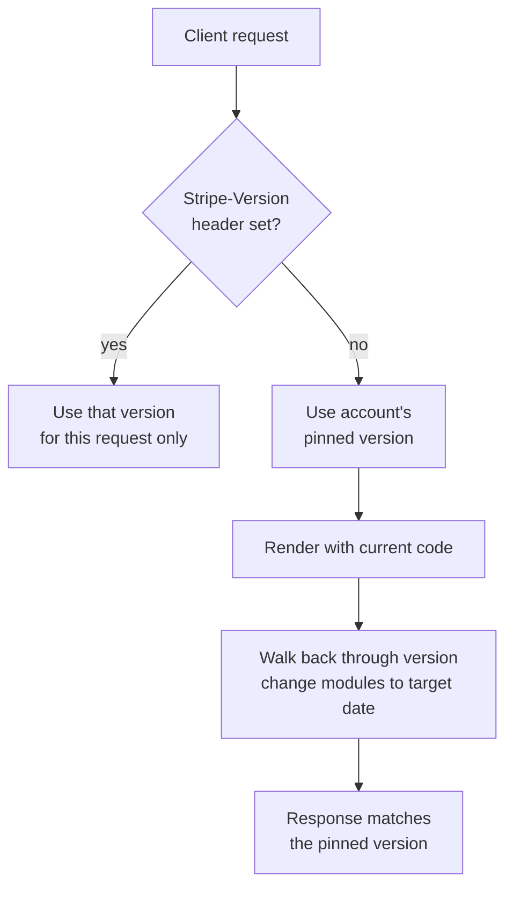

</div>

## Semantic versioning for APIs: expose the major, hide the rest

SemVer (MAJOR.MINOR.PATCH) maps cleanly onto API changes: MAJOR is a breaking change, MINOR is a new backward-compatible feature, PATCH is a bug fix with no contract change. But there is an important practical divergence for server APIs: *consumers never see your minor and patch releases*, because the server implements them the moment you deploy.

Google's rule is explicit: "unlike in traditional semantic versioning, Google APIs must not expose minor or patch version numbers. For example, Google APIs use `v1`, not `v1.0`, `v1.1`, or `v1.4.2`. From a user's perspective, major versions are updated in place with minor/patch equivalent changes, and users receive new functionality without migration" ([Google, AIP-185 API Versioning](https://google.aip.dev/185)).

| SemVer | Meaning for a library | Meaning for an HTTP API |
|---|---|---|
| MAJOR `v2` | Breaking change | Breaking change, new URL/header/version |
| MINOR | New backward-compatible feature | Ship silently inside `v2`, document in the changelog |
| PATCH | Bug fix | Ship silently, no contract change at all |

Practically this means: expose only the major in the URL (`/v1`, `/v2`) or the date in the date-pinned model, and communicate minor/patch level changes through an API changelog. Full dotted versions in URLs like `/v1.2.3/users` add operational complexity with zero benefit to clients ([Jsonic, JSON API Versioning](https://jsonic.io/guides/json-api-versioning)). Date-based naming (Stripe's `2024-06-20`, GitHub's `2026-03-10`) communicates the contract better than integers when you ship breaking changes often enough that `v47` would quickly become meaningless ([Docsio, API Versioning](https://docsio.co/blog/api-versioning)).

## The best version is no new version: additive design

Google recommends treating versioning as a last resort: "Your first thought should always be to try to find a backwards-compatible way of introducing an API change without versioning; versioning of either sort should only be attempted if that fails" ([Google, Which Version of Versioning](https://cloud.google.com/blog/products/api-management/api-design-which-version-of-versioning-is-right-for-you)).

Techniques that maximize the number of changes you can ship additively:

*   **Add, do not mutate.** A new field with a sensible default, a new endpoint, a new optional parameter. Old clients ignore what they do not expect.
*   **Deprecate in place, then remove never.** Mark a field `deprecated` in the schema, keep serving it, and only remove it in a future major version.
*   **Rename by addition.** Ship `fullName` while keeping `name`, then let `name` die in the next major.
*   **Prefer `PATCH` over `PUT` in the schema design.** Patch semantics allow partial, additive updates that older clients can ignore, on their way to future-proofing ([Google, Which Version of Versioning](https://cloud.google.com/blog/products/api-management/api-design-which-version-of-versioning-is-right-for-you)).

Stripe funnels every outgoing change through an API review process precisely to catch avoidable incompatibilities before release, because "even with our versioning system available, we do as much as we can to avoid using it" ([Stripe, APIs as Infrastructure](https://stripe.com/blog/api-versioning)).

<div style={{display: 'flex', justifyContent: 'center'}}>

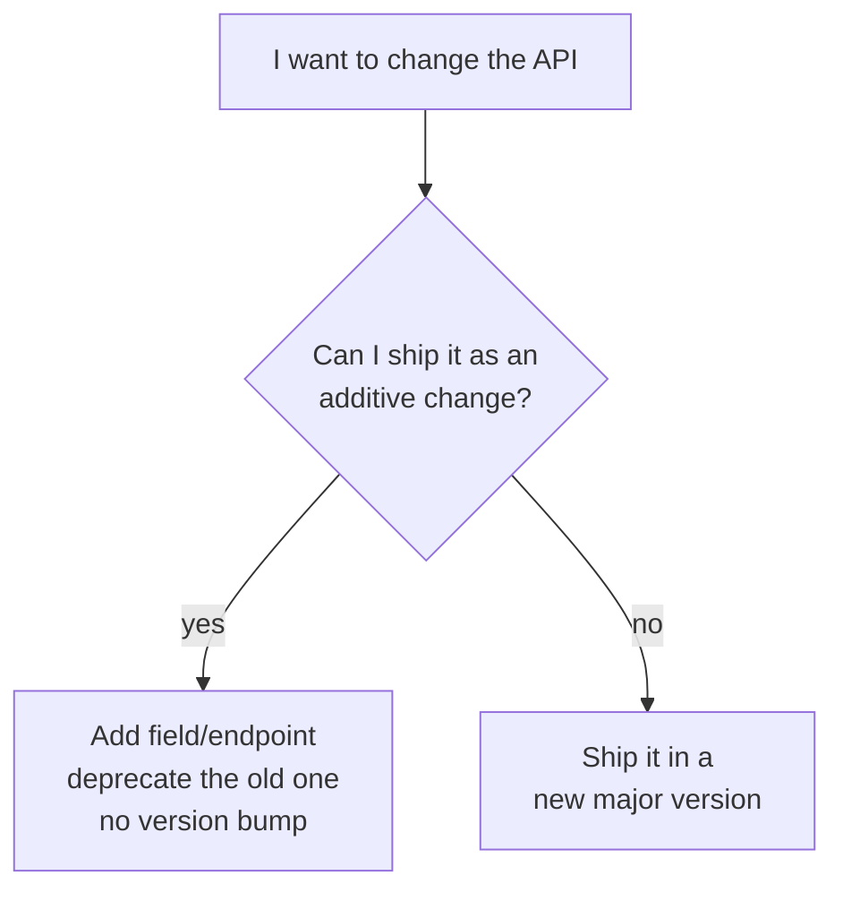

</div>

## The lifecycle: deprecate, announce, retire

A version is not immortal. Predictable retirement is what keeps an API honest, because every version you keep alive forever is engineering time diverted from new features ("instead of working on new features, engineering time is diverted to maintaining old code" ([Stripe, APIs as Infrastructure](https://stripe.com/blog/api-versioning))).

Deprecation happens in two stages, and the HTTP standards give you a header for each:

1. **Deprecation stage.** The version still works but is no longer recommended. Signal at runtime with the `Deprecation` header (RFC 9745), which carries a structured date, `Deprecation: @1767225600` ([RFC 9745, The Deprecation HTTP Response Header Field](https://www.rfc-editor.org/rfc/rfc9745)). Publish the change in a changelog and tell your consumers through the channels you have (email, dashboard, developer newsletter).
2. **Sunset stage.** The version has a hard removal date. Signal it with the `Sunset` header (RFC 8594), which carries an HTTP-date timestamp, `Sunset: Sat, 31 Dec 2027 23:59:59 GMT` ([RFC 8594, The Sunset HTTP Header Field](https://www.rfc-editor.org/rfc/rfc8594)). Pair it with `Link` headers: `rel="deprecation"` pointing to your migration docs and `rel="successor-version"` pointing to the replacement ([restguide.info, API Deprecation](https://www.restguide.info/api-deprecation)).

```js
// Express: annotate every v1 response while v1 is on the way out
app.use('/v1', (req, res, next) => {
  res.set('Deprecation', '@1767225600')                              // RFC 9745, epoch seconds
  res.set('Sunset', 'Sat, 31 Dec 2027 23:59:59 GMT')                 // RFC 8594, HTTP-date
  res.set('Link',
    '<https://api.example.com/v2/users>; rel="successor-version",' +
    '<https://docs.example.com/migration/v1-to-v2>; rel="deprecation"')
  next()
})

// After the sunset date passes: the version is gone, tell clients clearly
app.use('/v1', (req, res) => {
  res.status(410).json({
    error: 'version_retired',
    message: 'API v1 was retired on Sat, 31 Dec 2027 23:59:59 GMT',
    migration_guide: 'https://docs.example.com/migration/v1-to-v2'
  })
})
```

**How long should old versions live?** Nobody removes a version while it still has significant traffic, so monitor usage per version before retiring. Practical windows: at least 6 months for internal APIs and 12 to 24 months for public APIs ([StackPractices, API Versioning](https://stackpractices.com/guides/complete-guide-api-versioning-strategies/)); a minimum of 12 months for paid public APIs with a long tail ([Docsio, API Versioning](https://docsio.co/blog/api-versioning)); GitHub guarantees 24 months of support after a new version releases ([GitHub, API Versions](https://docs.github.com/rest/overview/api-versions)); and Stripe typically gives more than 12 months ([restguide.info, API Deprecation](https://www.restguide.info/api-deprecation)). GitHub's GraphQL API announces breaking changes at least three months out and applies them on the first day of a quarter, a predictable cadence integrators can plan around ([GitHub, GraphQL Breaking Changes](https://docs.github.com/en/graphql/overview/breaking-changes)).

<div style={{display: 'flex', justifyContent: 'center'}}>

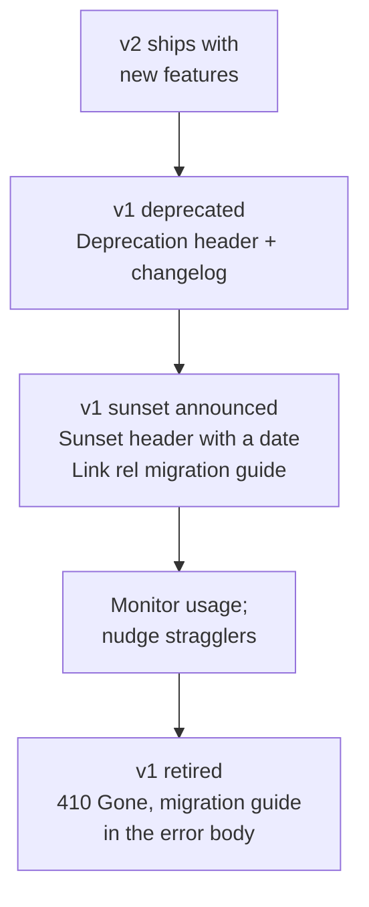

</div>

## The version number is permanent: do not reuse it

A natural question: once v1 is retired and everyone is on v2, why not just call v2 "v1" again and start over? The answer is no, not for any live public API. The version string becomes part of the contract itself, and real providers never recycle one because the number is stored and referenced everywhere your consumers live:

*   **Client code and configuration.** A consumer has the URL in their code, config, environment, and SDK. Renaming v2 to v1 breaks every one of those references and produces ambiguity: which "v1" is happening right now?
*   **Bookmarks, docs, logs, and dashboards.** Old support threads, screenshots, and monitoring dashboards name the version. Reusing a number makes all of that history point at the wrong contract.
*   **Immutable identifier principle.** Google's compatibility guidance generalizes to this: a *resource* must not change its name because clients store it, and the same holds for a version label ([Google, AIP-180](https://google.aip.dev/180)). Stripe, Google, and GitHub ship new versions without ever resetting to a reused number.

Rather than recycle, give new consumers a stable way to say "the newest supported thing." Expose an **unversioned base URL or a `latest` alias** that always resolves to the current version. Fresh integrators point at `https://api.example.com` (the current version) or `/latest`, while stragglers on v1 get a documented migration path. Once a version is live, treat the number as permanent.

<div style={{display: 'flex', justifyContent: 'center'}}>

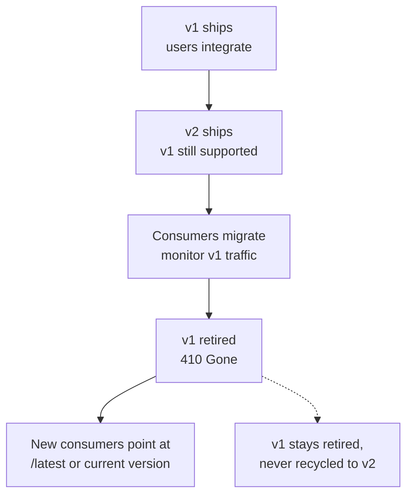

</div>

## Implementing versioning: share logic, version serialization

Whichever strategy you pick, the architecture advice is the same: share the business logic and data access across versions, and vary only the serialization. Google says it plainly, "we generally write a single backend that can handle both versions. All requests (regardless of version) are sent to the backend, and it uses the version in the path to decide which surface to return" ([Google, Versioning APIs](https://cloud.google.com/blog/products/gcp/versioning-apis-at-google)). duplicating database queries per version is how version bloat turns into a maintenance disaster.

```js
// v1 and v2 share one data layer, differ only in response shape
const v1 = Router()
v1.get('/users/:id', async (req, res) => {
  const user = await findUser(req.params.id)            // shared data access
  res.json({ id: user.id, name: user.name, email: user.email })
})

const v2 = Router()
v2.get('/users/:id', async (req, res) => {
  const user = await findUser(req.params.id)            // same data access
  res.json({ id: user.id, name: user.name, email: user.email, bio: user.bio })
})

app.use('/v1', v1)
app.use('/v2', v2)
```

For header-based versioning, the dispatch is a middleware that picks the right surface and answers `406 Not Acceptable` for unknown versions ([Jsonic, JSON API Versioning](https://jsonic.io/guides/json-api-versioning)):

```js
const SURFACES = { '1': v1, '2': v2 }

app.use('/users', (req, res, next) => {
  const version = req.headers['x-api-version'] || '1'          // sensible default for old clients
  const surface = SURFACES[version]
  if (!surface) {
    return res.status(406).json({                               // RFC-safe reject
      error: 'unsupported_version',
      supported: Object.keys(SURFACES)
    })
  }
  res.set('Vary', 'x-api-version')                              // protect the cache
  surface(req, res, next)
})
```

## The caching trap: Vary

On any strategy where the version is not in the URL, the browser/CDN sees the same URL return different bodies based on a request header. Without telling the cache about that header, the first response wins and everyone gets it.

```
# v1 client
GET /users/1    Accept: application/vnd.example.users.v1+json
# CDN caches this body under the URL /users/1

# v2 client, same URL
GET /users/1    Accept: application/vnd.example.users.v2+json
# CDN serves the CACHED v1 body. v2 never runs. Silent wrong data.

# Fix: tell the cache the Accept header changes the body
Vary: Accept
```

The same applies to a custom version header: respond with `Vary: X-API-Version` whenever the header influences the response ([Jsonic, JSON API Versioning](https://jsonic.io/guides/json-api-versioning), [ASOasis, REST API Versioning URL vs Header](https://asoasis.tech/articles/2026-04-21-0254-rest-api-versioning-url-vs-header/)). This is exactly why URI path versioning is so loved by caching: the version is inside the cache key already, so `Vary` is never needed.

<div style={{display: 'flex', justifyContent: 'center'}}>

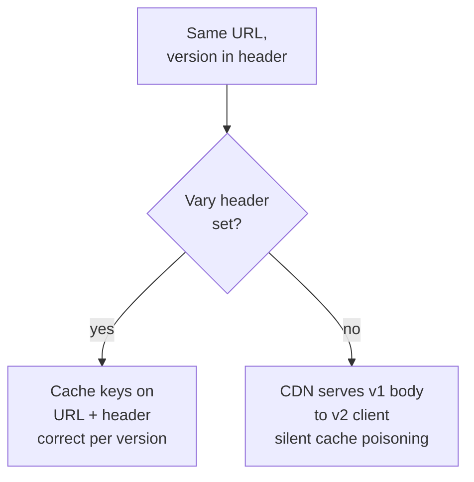

</div>

## Choosing the right strategy

There is no single best strategy; the right answer depends on who consumes your API, how many clients exist, and whether caching matters ([Kappafy, API Versioning Decision Tree](https://kappafy.com/research/api-versioning-strategies.html)). The industry consensus:

*   **Public API with external, unknown clients** → URI path versioning. Visible, cacheable, testable, works in every tool. It covers roughly 80% of cases ([Docsio, API Versioning](https://docsio.co/blog/api-versioning)).
*   **Internal API where you control all clients** → Header versioning gives clean URLs and lets each client migrate endpoint by endpoint.
*   **Hypermedia/HATEOAS API** → Media type versioning, because content negotiation is already doing real work and links can stay version-agnostic.
*   **Very high client-stability requirements with engineering headroom for compatibility layers** → Date-pinned versioning in the Stripe/GitHub mold.
*   **Query parameter versioning** → only as a short-lived migration escape hatch, not a permanent policy.

<div style={{display: 'flex', justifyContent: 'center'}}>

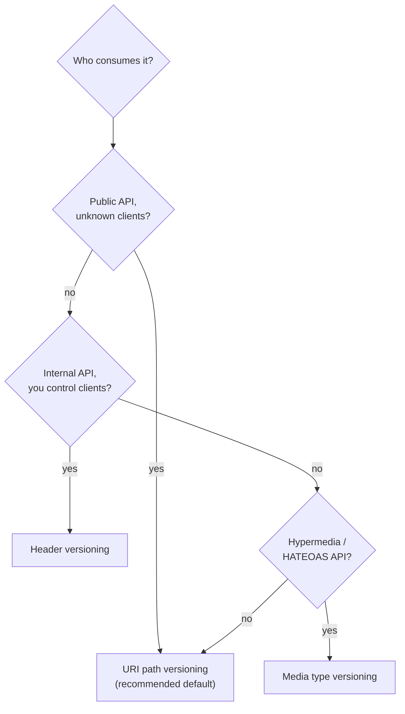

</div>

## Mistakes to avoid

*   **Not versioning from day one.** Retrofitting a version after clients are live is the most expensive path: everyone has hardcoded `https://api.example.com/users`.
*   **Silent defaults.** Return a sensible documented default when the version is missing, and never change what the default means. Changing behavior for unversioned requests is how old clients break without any version bump ([ASOasis, URL vs Header](https://asoasis.tech/articles/2026-04-21-0254-rest-api-versioning-url-vs-header/)).
*   **Bumping the version for every release.** If you release a new major more than about once a year, the problem is usually API design discipline ("if you are bumping more than once a year, the underlying issue is usually API design discipline rather than versioning policy" ([Docsio, API Versioning](https://docsio.co/blog/api-versioning))).
*   **Version sprawl.** Running five versions forever splits your attention and your traffic. Retire old versions on the published schedule.
*   **Forgetting `Vary` on header and media-type versioning.** Silent cache poisoning, described above.
*   **Skipping the `Sunset` and `Deprecation` headers.** Clients discover removal only when it breaks them, which is how you lose trust.
*   **Mixing strategies inconsistently.** Pick one, document it, and apply it everywhere; version-by-endpoint with different conventions confuses every consumer.
*   **Not testing old versions after deploying new ones.** A regression in v1 is invisible until a v1 client calls it, then it is an outage ([StackPractices, API Versioning](https://stackpractices.com/guides/complete-guide-api-versioning-strategies/)).

## When you do not need versioning at all

Versioning is a cost. There are two cases where experienced teams skip it:

*   **GraphQL APIs.** The schema itself is the contract, and it is designed to evolve: add fields, mark old ones `@deprecated`, keep new fields nullable. Old clients keep working because they only query what they asked for. GitHub runs its GraphQL API this way without GraphQL URL versions ([GitHub, GraphQL Breaking Changes](https://docs.github.com/en/graphql/overview/breaking-changes)). Unless a change is truly incompatible, you evolve the schema instead of versioning it ([StackPractices, API Versioning](https://stackpractices.com/guides/complete-guide-api-versioning-strategies/)).
*   **Internal APIs with client code you deploy yourself.** If the same team owns server and client and ships them together, the whole "breaking clients" failure mode does not exist, and a compatibility policy designed for external consumers is ceremony.

In every other case the question is not *whether* you version, but *which strategy you pick on day one*, because changing strategies later is far more painful than choosing the slightly imperfect one now.

## Interview questions

**Q: What is API versioning and why is it needed?**
Versioning labels and serves multiple coexisting contracts of an API so a provider can ship breaking changes without breaking existing clients. A client integration is code someone wrote against the current shape of the API; without a version label, any rename, type change, or semantic change silently breaks that code.

**Q: What is the difference between a backward-compatible and a breaking change?**
A change is backward-compatible (additive) if existing clients need no code changes: adding an optional field, a new endpoint, or a new enum value. It is breaking if existing clients must change code: removing or renaming fields or parameters, making optional required, changing types, changing defaults, or changing semantics of existing values.

**Q: What are the main versioning strategies for a REST API?**
URI path (`/v1/users`), query parameter (`?version=2`), header (`X-API-Version: 2`), media type (`Accept: application/vnd.company.v2+json`), and date-pinned per-account versioning in the Stripe and GitHub style.

**Q: Which strategy would you choose for a public API and why?**
URI path versioning, because the version is visible in the URL and logs, it is testable in a browser and curl, every version gets its own cache key so CDN caching works without `Vary`, and routing works natively in gateways and proxies. It is the most widely adopted approach for public APIs.

**Q: What is the `Vary` header and why does header-based versioning need it?**
`Vary` tells caches which request headers affect the response. When two versions share a URL and differ by header, a cache keyed on URL alone stores the first response and serves it to clients of the other version, which is silent cache poisoning. `Vary: Accept` or `Vary: X-API-Version` forces the cache to include the header in the key.

**Q: What status code should a server return for an unsupported version?**
`406 Not Acceptable` when the version is negotiated through the `Accept` header or a version header. `410 Gone` once a version has been retired, ideally with a migration guide in the body. `404` for a path that never existed.

**Q: How do `Deprecation` and `Sunset` headers work?**
`Deprecation` (RFC 9745) signals at runtime that a version is deprecated but still operational. `Sunset` (RFC 8594) advertises the exact date the version will stop responding, in HTTP-date format. `Link` headers with `rel="deprecation"` and `rel="successor-version"` point clients at migration docs and the replacement.

**Q: How does Stripe version its API and why?**
Stripe pins each account to the date-version that was current when the account made its first request, so old integrations keep receiving old behavior forever. Breaking changes land in new date versions, and developers test a new version per request with the `Stripe-Version` header before upgrading the account. This trades a compatibility infrastructure cost for eliminating forced migrations.

**Q: Is semantic versioning the right model for HTTP APIs?**
Partially. SemVer maps cleanly (major is breaking, minor is additive, patch is a bug fix), but clients never see your minor and patch releases because the server implements them at deploy time. Google's rule is to expose only the major version and roll minor/patch changes in place, communicating them through a changelog. Date-based naming is an alternative for APIs that ship breaking changes often.

**Q: Can a version be avoided entirely?**
Yes, with additive design: add fields, deprecate in place, never remove within a major. GraphQL bypasses HTTP versioning by making the schema itself evolvable. And if an API is internal and the same team deploys server and client together, versioning is usually unnecessary ceremony.

**Q: What happens to old versions and how long should you keep them?**
You deprecate, then sunset with a published date, track usage, and retire with `410 Gone`. Common windows: 6 months minimum for internal APIs, 12 to 24 months for public APIs, and GitHub guarantees its previous version for 24 months after a new one ships. Do not remove a version while it still has significant traffic.

## Sources

- Stable contract definition and the three compatibility types (source, wire, semantic): ([Google, AIP-180 Backward Compatibility](https://google.aip.dev/180)).
- Versioning rules, major-in-path, no minor/patch exposed, beta channels and dates: ([Google, AIP-185 API Versioning](https://google.aip.dev/185)) and ([Google, Versioning API Design Guide](https://cloud.google.com/apis/design/versioning)).
- Why Google pools the major version in the URI path: ([Google, Versioning APIs at Google](https://cloud.google.com/blog/products/gcp/versioning-apis-at-google)).
- Try to avoid versioning first; format vs entity versioning; header placement: ([Google, Which Version of Versioning is Right For You](https://cloud.google.com/blog/products/api-management/api-design-which-version-of-versioning-is-right-for-you)).
- Stripe's date-pinned versions, account pinning, and version change modules: ([Stripe, APIs as Infrastructure](https://stripe.com/blog/api-versioning)).
- Stripe's 2024 release process: semiannual named majors plus monthly additive: ([Stripe, Introducing a New API Release Process](https://stripe.com/blog/introducing-stripes-new-api-release-process)) and ([Stripe, Versioning API Reference](https://docs.stripe.com/api/versioning)).
- Why Stripe does not auto-upgrade versions: ([Brandur, Why Doesn't Stripe Automatically Upgrade API Versions](http://brandur.org/api-upgrades)).
- Stripe's deprecation principles and single-implementation plus transformations: ([Lethain, How Should Stripe Deprecate APIs](https://lethain.com/api-deprecation-strategy/)).
- GitHub's breaking vs additive change checklist, dated versions, 24-month support, `410 Gone`: ([GitHub, Breaking Changes](https://docs.github.com/en/rest/about-the-rest-api/breaking-changes)) and ([GitHub, API Versions](https://docs.github.com/rest/overview/api-versions)).
- GitHub GraphQL deprecation schedule (3 months notice, first day of a quarter): ([GitHub, GraphQL Breaking Changes](https://docs.github.com/en/graphql/overview/breaking-changes)).
- The `Sunset` header (RFC 8594), HTTP-date format, sunset link relation: ([RFC 8594](https://www.rfc-editor.org/rfc/rfc8594)).
- The `Deprecation` header (RFC 9745), structured field date, pairing with Sunset: ([RFC 9745](https://www.rfc-editor.org/rfc/rfc9745)).
- Strategy comparisons and trade-off tables: ([APIScout, API Versioning Strategies](https://apiscout.dev/guides/api-versioning-strategies-2026)), ([Docsio, API Versioning](https://docsio.co/blog/api-versioning)), ([BSWEN, Which API Versioning Strategy](https://docs.bswen.com/blog/2026-04-17-api-versioning-strategies/)), ([Kappafy, API Versioning Decision Tree](https://kappafy.com/research/api-versioning-strategies.html)), ([Jsonic, JSON API Versioning](https://jsonic.io/guides/json-api-versioning)), ([StackPractices, Complete Guide to API Versioning](https://stackpractices.com/guides/complete-guide-api-versioning-strategies/)).
- Deprecation windows and header middleware examples: ([restguide.info, REST API Deprecation](https://www.restguide.info/api-deprecation)), ([ASOasis, REST API Versioning URL vs Header](https://asoasis.tech/articles/2026-04-21-0254-rest-api-versioning-url-vs-header/)).
- Existing knowledge base article on resources, methods, and error status codes: ([REST APIs](./rest.md)).