# GraphQL vs REST - which API style and when

The API decision that shapes every full stack project. One endpoint that lets clients ask for exactly what they need, or resource endpoints that map to HTTP and caches. Both work, they trade off differently.

<div style={{display: 'flex', justifyContent: 'center'}}>

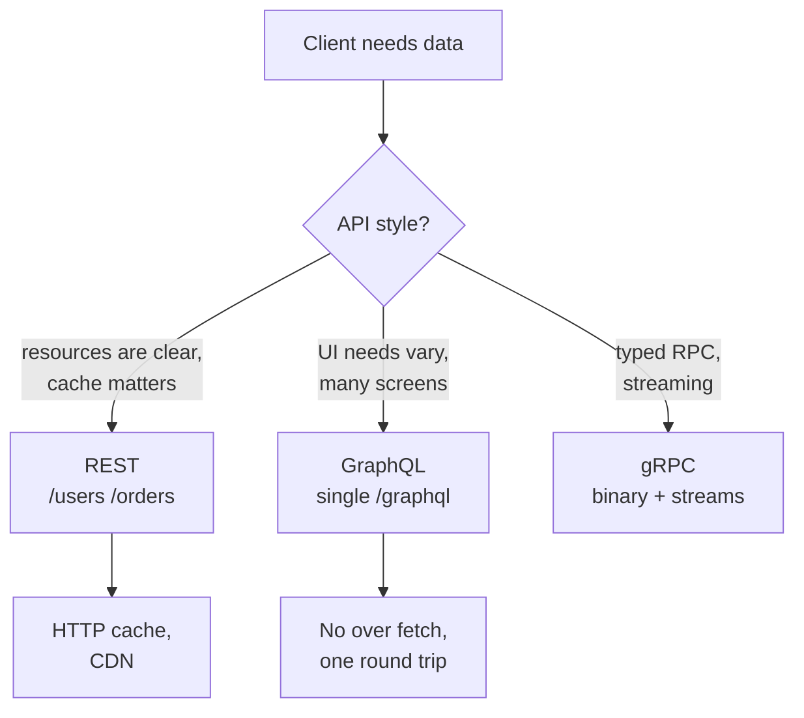

</div>

Sources: Fielding REST dissertation (2000), GraphQL spec (graphql.github.io), Apollo GraphQL docs, MDN HTTP, Supabase docs for PostgREST.

---

## 1. What REST is

### Problem

You need a predictable way for any HTTP client to create, read, update, and delete resources without custom SDKs.

### Solution

REST (Representational State Transfer) is an architectural style defined by Roy Fielding. Resources are nouns, HTTP verbs are actions, and the URL is the resource identity. Stateless, cacheable, layered.

```http
GET /users/1
# 200 { "id": 1, "name": "Sai" }

POST /users
Content-Type: application/json

{ "name": "Sai" }
# 201 Created  Location: /users/4

PATCH /users/1
Content-Type: application/json

{ "name": "S" }

DELETE /users/1
# 204 No Content

GET /users/1/orders?status=paid
# 200 [{ "id": 1, "amount": 100 }]
```

<div style={{display: 'flex', justifyContent: 'center'}}>

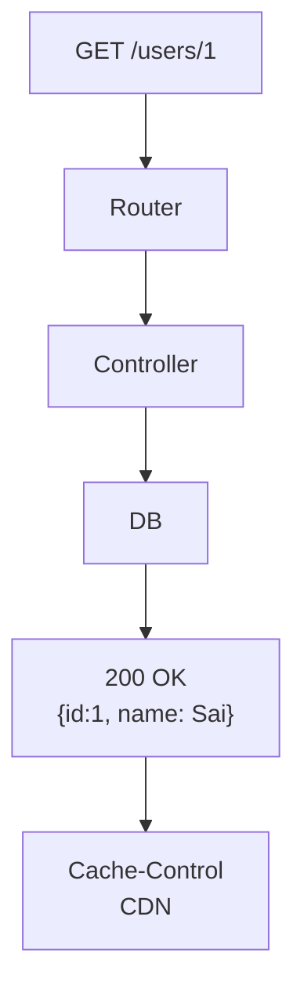

</div>

REST wins when your data is resource shaped and HTTP caching matters. GitHub, Stripe, Supabase PostgREST all use REST.

---

## 2. What GraphQL is

### Problem

A mobile screen needs `user.name` and last 2 orders, a web dashboard needs `user` with all orders and totals. With REST you either over fetch (big payload with fields you do not need) or under fetch (N requests for N resources).

### Solution

GraphQL is a query language and runtime from Facebook (2015). One endpoint `POST /graphql`, the client sends a query describing exactly which fields it wants. The server resolves the query against a typed schema.

```graphql
# Client asks for exactly what it needs
query {
  user(id: 1) {
    name
    orders(status: paid, limit: 2) {
      amount
    }
  }
}
# Response has no extra fields
```

The same query, line by line:

```graphql
query {              # operation: read (vs mutation or subscription)
  user(id: 1) {      # field `user` with argument id: 1 — like GET /users/1
    name             # scalar — return only name, not country or id
    orders(          # nested field — resolver fetches orders for that user
      status: paid   # argument: filter to paid only
      limit: 2       # argument: take 2 rows
    ) {
      amount         # scalar inside orders
    }
  }
}
```

Response mirrors the query shape exactly, nothing extra:

```json
{
  "data": {
    "user": {
      "name": "Alice",
      "orders": [{ "amount": 100 }, { "amount": 50 }]
    }
  }
}
```

In code prefer variables over inline args:

```graphql
# Named operation with a required ID variable (ID! means non-null)
query GetUser($id: ID!) {
  # Fetch user by the variable $id — like GET /users/:id
  user(id: $id) {
    name                          # scalar — return only name
    orders(status: paid, limit: 2) { # nested resolver — filtered orders
      amount                      # scalar inside orders
    }
  }
}
# variables sent alongside the query: { "id": 1 }
```

<div style={{display: 'flex', justifyContent: 'center'}}>

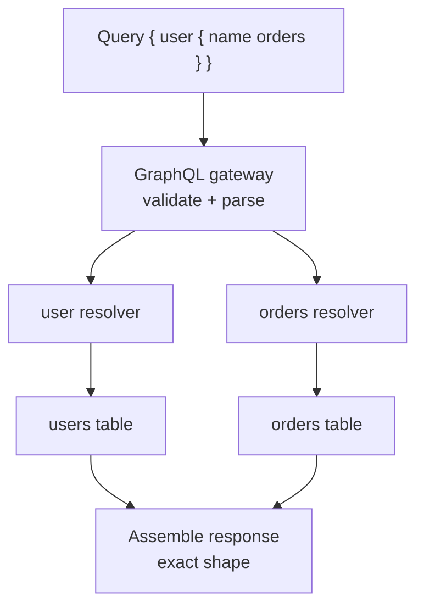

</div>

One round trip, no over fetching, strongly typed schema. GitHub GraphQL, Shopify, Supabase GraphQL wrap PostgREST via `pg_graphql`.

---

## 3. Resource vs query - the core difference

### Problem

REST thinks in resources, GraphQL thinks in graphs. This changes how you model.

### Solution

| REST | GraphQL |
|---|---|
| Many URLs, one per resource | One URL, many queries |
| Server defines shape | Client defines shape |
| `GET /users/1?fields=name,orders.amount` is a hack | Native field selection |

```js
// REST: 2 round trips or include param
const user = await fetch('/users/1').then((r) => r.json())
const orders = await fetch('/users/1/orders?limit=2').then((r) => r.json())

// GraphQL: 1 round trip
const { data } = await fetch('/graphql', {
  method: 'POST',
  headers: { 'Content-Type': 'application/json' },
  body: JSON.stringify({
    query: `
      query {
        user(id: 1) {
          name
          orders(limit: 2) { amount }
        }
      }
    `,
  }),
}).then((r) => r.json())
```

<div style={{display: 'flex', justifyContent: 'center'}}>

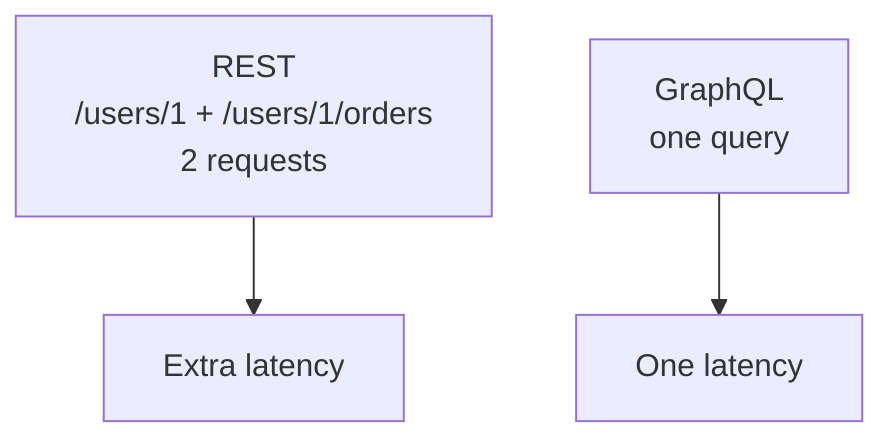

</div>

Use REST when resources map cleanly to HTTP. Use GraphQL when screens need different shapes of the same data.

---

## 4. Over-fetching and under-fetching

### Problem

`GET /users` that returns 20 fields when the client needs 2 wastes bandwidth. `GET /users/1` without orders forces a second `GET /orders?user_id=1`.

### Solution

GraphQL solves this natively. REST solves it with workarounds: sparse fieldsets (`?fields=`), `include` params, or an aggregation endpoint like `GET /dashboard`.

<div style={{display: 'flex', justifyContent: 'center'}}>

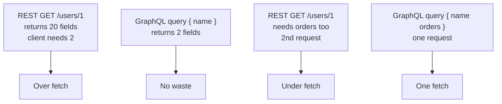

</div>

If your app has many screens with different data needs and bandwidth matters (mobile), GraphQL saves. If your resources are stable and clients are few, REST with `include` is enough.

---

## 5. Versioning

### Problem

You ship `v1`, then need to change `user.name` to `user.firstName + lastName`. How do you avoid breaking clients?

### Solution

REST versions via URL or header: `/v1/users` vs `/v2/users` or `Accept: application/vnd.api.v2+json`. Old and new run in parallel until clients migrate.

GraphQL avoids versioning by making the schema evolvable: add new fields, deprecate old ones, never remove.

```graphql
type User {
  name: String @deprecated(reason: "use firstName")
  firstName: String
  lastName: String
}
```

<div style={{display: 'flex', justifyContent: 'center'}}>

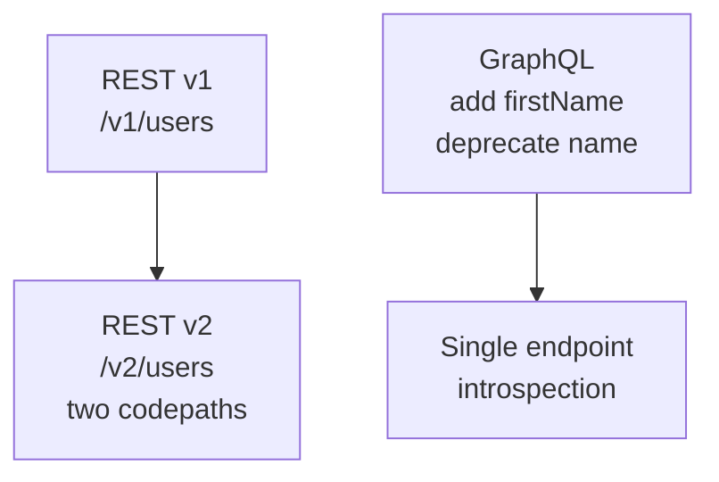

</div>

Versioning is a REST cost. GraphQL pays with schema discipline and tooling to track deprecations.

---

## 6. Caching

### Problem

You want `GET /users/1` cached at the CDN for 60 seconds. With GraphQL `POST /graphql` every query is different.

### Solution

REST gets HTTP caching for free. `Cache-Control: max-age=60` tells the browser and CDN to keep the response for 60 seconds without hitting origin. `ETag: "abc"` is a hash of the response — on the next request the client sends `If-None-Match: "abc"`, the server replies `304 Not Modified` with no body if nothing changed. `Last-Modified` works the same with a date. Because REST uses `GET /users/1` with a stable URL, a CDN like Cloudflare can cache it and serve thousands of requests from edge without touching your server. The same URL always means the same resource, so the cache key is trivial.

GraphQL `POST /graphql` breaks this. Every query is a different `POST` body, `POST` is not cacheable by HTTP or CDNs by default, and the body is not part of the cache key. You must build caching yourself: Apollo Client keeps a normalized cache keyed by `id` and `__typename` in the browser so `user(id:1)` read once is reused, or you use persisted queries where the client sends a hash and the server maps it to a `GET /graphql?extensions={"persistedQuery":{"hash":"abc123"}}` which is cacheable.

```http
# REST: cacheable — CDN and browser understand this
GET /users/1
Cache-Control: max-age=60          # keep 60s at CDN and browser
ETag: "abc"                        # hash of body — for If-None-Match
Last-Modified: Tue, 15 Jan 2025 10:00:00 GMT

# Second request — no body transfer if not modified
GET /users/1
If-None-Match: "abc"
# 304 Not Modified

# GraphQL: must do it yourself — POST is not cached by CDN
POST /graphql
Content-Type: application/json

{ "query": "query { user(id: 1) { name } }" }
# 200 every time — origin parses, no CDN hit
# workaround — turn the query into a GET via persisted query
GET /graphql?extensions={"persistedQuery":{"hash":"abc123"}}
# now CDN can cache because the URL is the key
```

In code:

```js
// Apollo normalized cache — second read comes from cache, no network
const { data } = useQuery(GET_USER, { variables: { id: 1 } })
// cache key: User:1 -> { name: "Alice" }

// Persisted query — hash replaces the full query string
fetch('/graphql?extensions={"persistedQuery":{"hash":"abc123"}}')
```

<div style={{display: 'flex', justifyContent: 'center'}}>

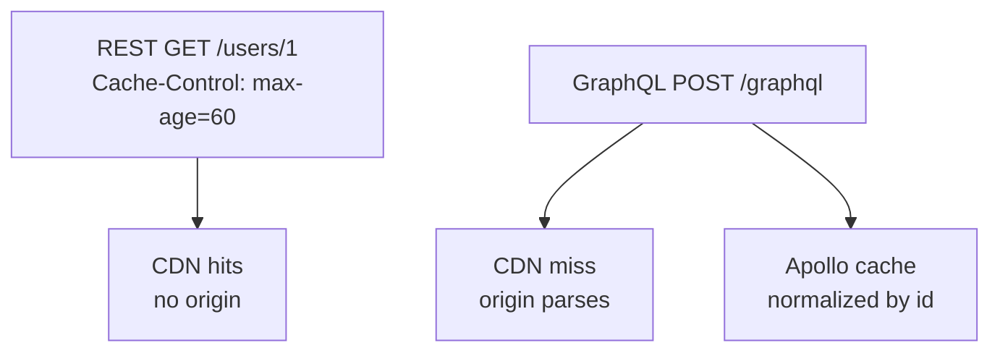

</div>

If HTTP/CDN caching is critical (public reads, heavy traffic), REST is simpler. If most queries are authenticated and per-user, caching matters less and GraphQL is fine.

---

## 7. Error handling

### Problem

How does a client know a request partially failed? In GraphQL a query can return some data and some errors in the same response.

### Solution

REST relies on HTTP status: `200 OK`, `201 Created`, `400 Bad Request`, `401 Unauthorized`, `404 Not Found`, `500`. One status per response.

GraphQL always returns `200 OK` at HTTP level, errors are in the `errors` array alongside `data`:

```json
{
  "data": {
    "user": { "name": "Sai" }
  },
  "errors": [
    {
      "message": "orders not authorized",
      "path": ["user", "orders"]
    }
  ]
}
```

<div style={{display: 'flex', justifyContent: 'center'}}>

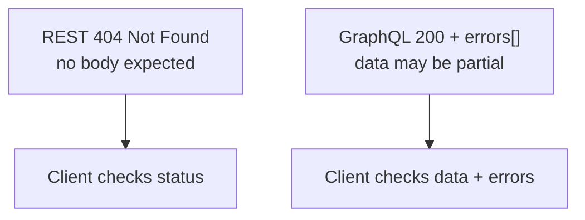

</div>

REST is simpler for HTTP tooling. GraphQL needs client logic to handle partial data. Pick one and be consistent, document it.

---

## 8. Type system and tooling

### Problem

REST payloads are JSON without a contract. You find a typo `amont` at runtime.

### Solution

REST can add a contract with OpenAPI/Swagger, but it is optional. GraphQL schema is the contract and is required. The schema defines types, and tooling generates TypeScript types, docs, and validation automatically.

```graphql
type Order {
  id: ID!
  amount: Int!
  status: String!
}
# generated TS
type Order = { id: string; amount: number; status: string }
```

<div style={{display: 'flex', justifyContent: 'center'}}>

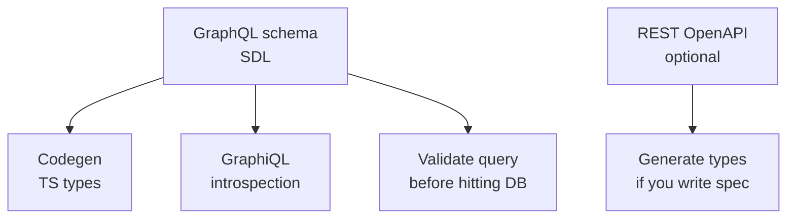

</div>

If type safety across frontend and backend matters and your team can maintain a schema, GraphQL helps. If you already generate OpenAPI, REST can be typed too.

---

## 9. Performance and the N+1

### Problem

A GraphQL query `{ users { orders { amount } } }` with 100 users can run 1 query for users + 100 queries for orders. This is the N+1, the most common GraphQL performance bug.

### Solution

REST avoids N+1 by defining the aggregation: `GET /users?include=orders` runs one join on the server. GraphQL needs a dataloader or join strategy in resolvers.

```js
// Bad: N+1 — one query per user
for (const u of users) {
  await db.query('SELECT * FROM orders WHERE user_id = $1', [u.id])
}

// Good: batch with dataloader — one query for all
const ordersByUser = await dataloader.loadMany(userIds)
// runs: SELECT * FROM orders WHERE user_id IN ($1, $2, ...)
```

<div style={{display: 'flex', justifyContent: 'center'}}>

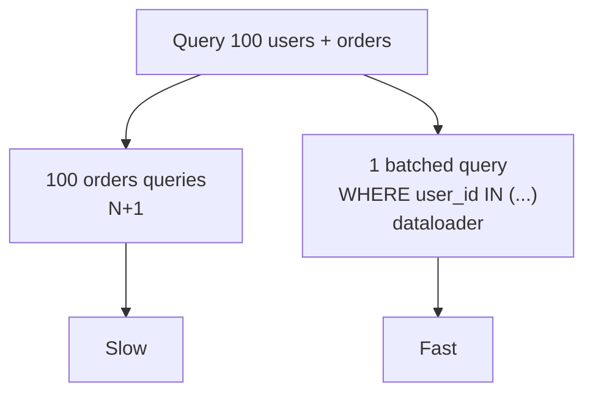

</div>

Both styles need indexes: `CREATE INDEX ON orders(user_id)` helps either. Measure with `EXPLAIN ANALYZE` as in `databases/sql-introduction.md`.

---

## 10. Security and rate limiting

### Problem

REST rate limiting is `100 req/min per IP` on an endpoint. GraphQL rate limiting by request count is broken because one query can be 1000x more expensive than another.

### Solution

REST limits by request count plus payload size. GraphQL limits by query complexity and depth. Set max depth, max complexity, and timeout. Always require authentication before parsing heavy queries. Persisted queries help.

```js
// Example: limit GraphQL complexity
createComplexityLimitRule(1000, {
  scalarCost: 1,
  objectCost: 2,
  depthCostFactor: 1.5,
})
```

<div style={{display: 'flex', justifyContent: 'center'}}>

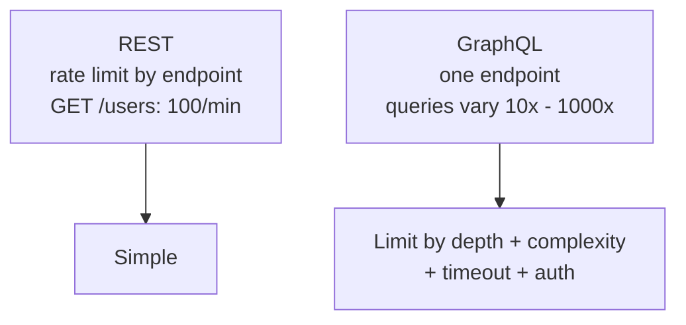

</div>

Public APIs with untrusted clients: REST is easier to secure. Internal or authenticated GraphQL is fine with complexity limits.

---

## 11. Real-time - subscriptions vs polling

### Problem

You need live order status without refreshing.

### Solution

REST polls `GET /orders/1` or uses webhooks/SSE/WebSockets as a separate system. GraphQL has subscriptions as part of the spec, usually over WebSocket.

```graphql
subscription {
  orderUpdated(id: 1) {
    status
  }
}
```

<div style={{display: 'flex', justifyContent: 'center'}}>

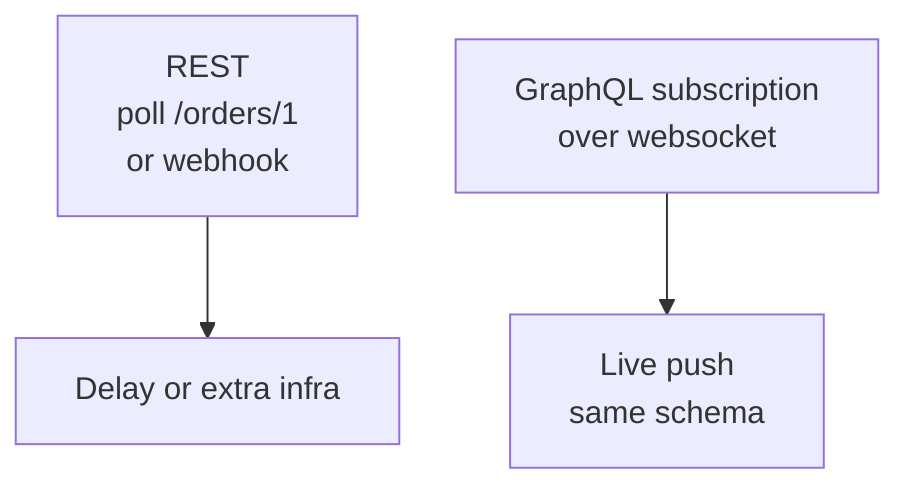

</div>

If real-time is core, GraphQL subscriptions keep one schema. Otherwise REST with webhooks/SSE is simpler.

---

## 12. File uploads and binary data

### Problem

GraphQL is JSON over HTTP, not ideal for multipart file uploads.

### Solution

REST does `POST /uploads` with `multipart/form-data` natively. GraphQL needs the `graphql-multipart-request-spec` or a separate REST upload endpoint, then pass the URL to GraphQL.

```http
POST /uploads
Content-Type: multipart/form-data; boundary=----FormBoundary

------FormBoundary
Content-Disposition: form-data; name="file"; filename="photo.jpg"

<binary>
------FormBoundary--
# 201 { "url": "https://cdn.example.com/photo.jpg" }
```

Hybrid is common: REST for uploads, GraphQL for data.

---

## 13. Mutations and idempotency

### Problem

`POST /orders` sent twice because of a retry creates two orders.

### Solution

REST uses idempotency keys: `Idempotency-Key: uuid` header, `PUT` is idempotent, `POST` with key is made idempotent. GraphQL mutations are just `POST` queries, so you must implement idempotency in the mutation itself.

```graphql
mutation CreateOrder($key: ID!, $amount: Int!) {
  createOrder(idempotencyKey: $key, amount: $amount) {
    id
  }
}
```

<div style={{display: 'flex', justifyContent: 'center'}}>

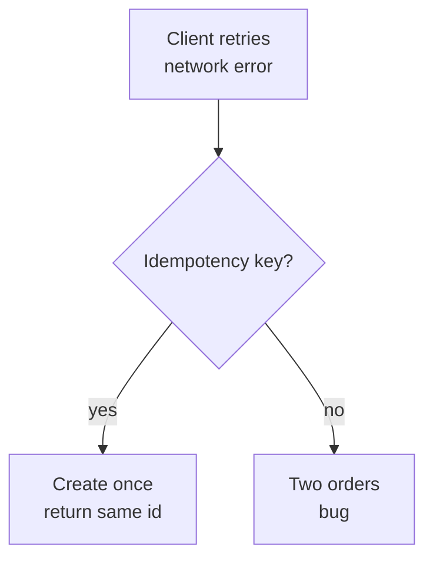

</div>

---

## 14. When to use which - the decision framework

<div style={{display: 'flex', justifyContent: 'center'}}>

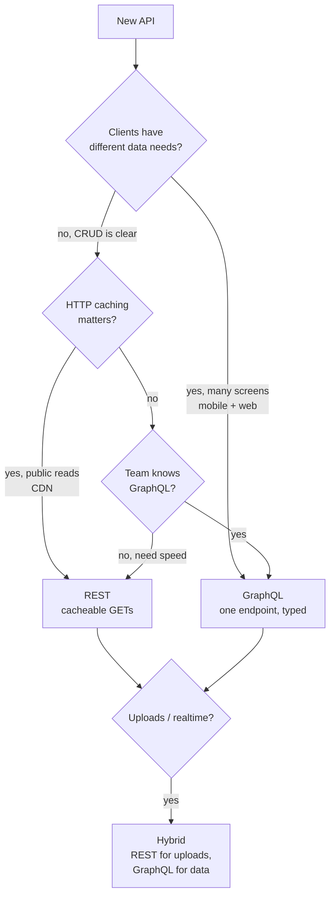

</div>

| Choose REST when | Choose GraphQL when |
|---|---|
| Resources are clear nouns, CRUD dominates | Screens need different shapes of same data |
| HTTP/CDN caching is critical | Over fetching or under fetching hurts (mobile) |
| Public API with many unknown clients | Internal or authenticated clients, typed frontend |
| Team is new to GraphQL, deadline is short | Team can own a schema and tooling (codegen, dataloader) |
| File uploads or webhooks are core | Real-time subscriptions in same schema matter |

Most full stack apps today: **REST for public/CRUD, GraphQL for the app's own frontend when the frontend owns the schema**. Many teams run both behind the same gateway.

---

## 15. Hybrid and migration

### Problem

You have REST. You want GraphQL without a big bang rewrite.

### Solution

Put GraphQL in front of your existing REST or DB. Resolve GraphQL fields by calling your REST services or directly querying Postgres (Supabase does this: `pg_graphql` turns Postgres into GraphQL without duplicating logic). Migrate one screen at a time, keep REST for uploads and webhooks.

<div style={{display: 'flex', justifyContent: 'center'}}>

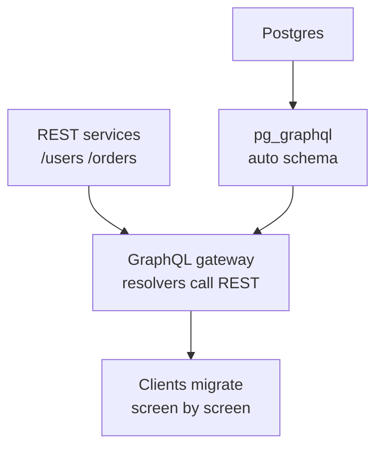

</div>

Start with a `BFF` (backend for frontend) GraphQL that aggregates your REST, not a full rewrite.

---

## 16. Side-by-side example - users and orders (same seed as databases/sql-introduction)

Seed: `users(1 Alice USA, 2 Bob USA, 3 Sai India)`, `orders(7 rows)`.

REST:

```http
GET /users/1
# 200 { "id": 1, "name": "Alice", "country": "USA" }

GET /users/1/orders?status=paid
# 200 [{ "id": 1, "amount": 100 }, { "id": 2, "amount": 50 }]

POST /orders
Content-Type: application/json

{ "user_id": 1, "amount": 150, "status": "paid" }
# 201 Created  Location: /orders/8
```

GraphQL:

```graphql
query {
  user(id: 1) {
    name
    orders(status: paid) {
      amount
    }
  }
}

mutation {
  createOrder(userId: 1, amount: 150) {
    id
    amount
  }
}

subscription {
  orderCreated(userId: 1) {
    id
    amount
  }
}
```

Trade off on this tiny data: REST is 2 round trips for user plus orders unless you add `GET /users/1?include=orders`. GraphQL is 1. At 1M orders, both need `CREATE INDEX ON orders(user_id, status)` and pagination `WHERE id > last_id` from `databases/sql-introduction.md`.

---

### Links

*   Fielding - Architectural Styles and the Design of Network-based Software Architectures (REST)
*   graphql.org/learn - GraphQL spec and best practices
*   apollographql.com/docs - Apollo Server and Client, dataloader, complexity
*   restfulapi.net, MDN HTTP - status codes, caching, methods
*   supabase.com/docs/guides/api - PostgREST (REST) and pg_graphql (GraphQL) on Postgres
*   ../databases/sql-introduction.md - SQL patterns both styles need (joins, pagination, indexing)

