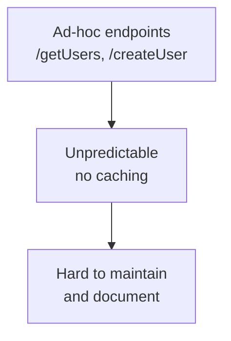
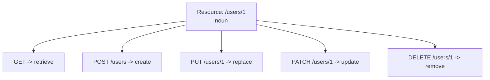
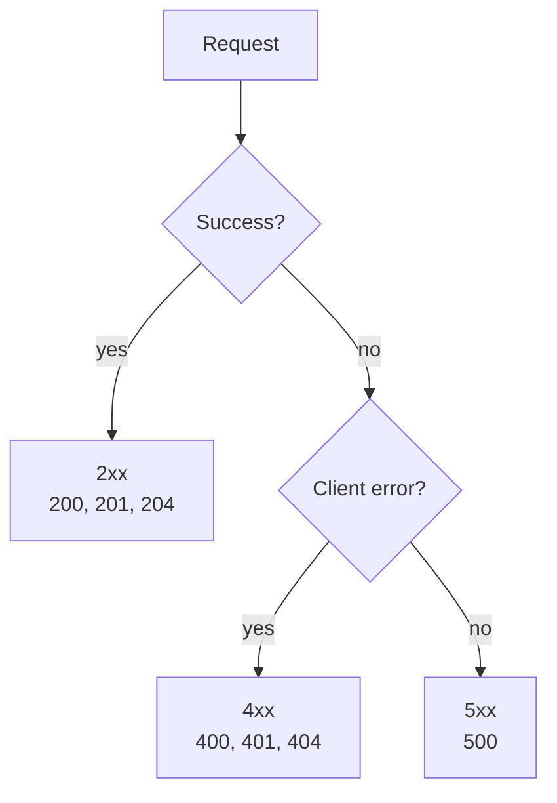
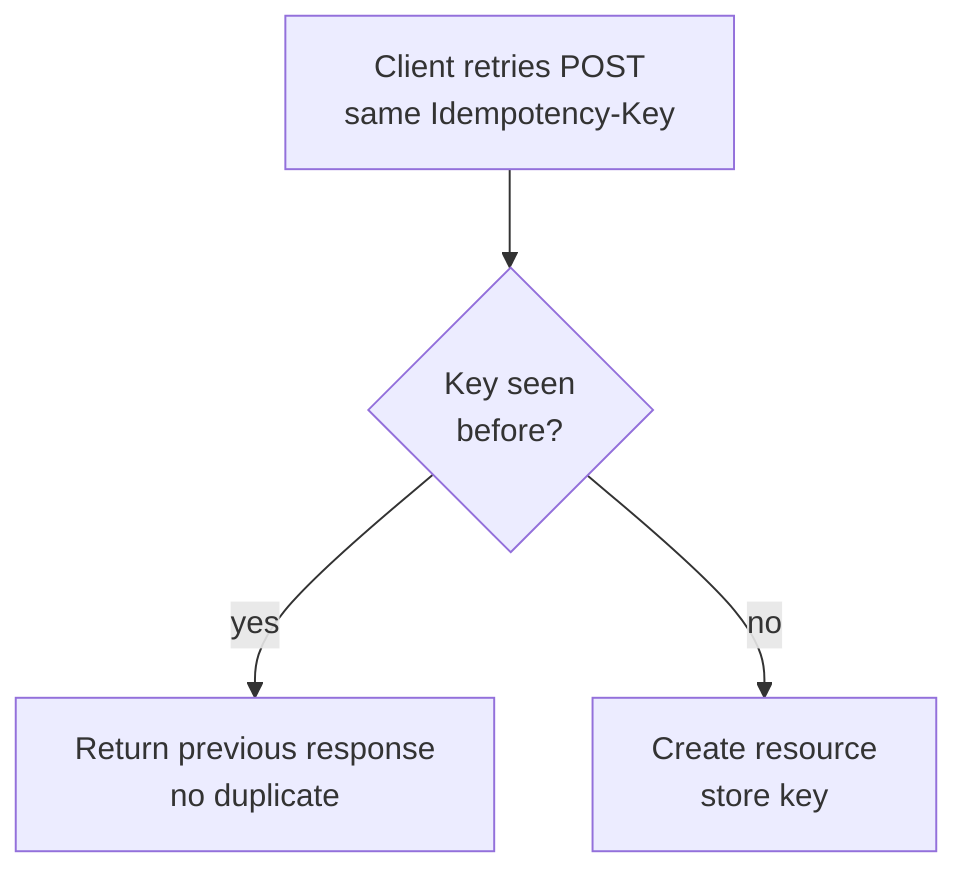

# REST APIs

## What is an API?

APIs are mechanisms that enable two software components to communicate with each other using a set of definitions and protocols. For example, the weather bureau's software system contains daily weather data. The weather app on your phone "talks" to this system via APIs and shows you daily weather updates on your phone.

## What is REST?

REST (Representational State Transfer) is an architectural style for APIs that uses HTTP as the application protocol. Each URL is a resource, HTTP methods are the verbs, and the server and client are stateless. Fielding defined it in 2000: a uniform interface, stateless communication, and cacheable responses.

## The problem: ad-hoc endpoints become unmaintainable

Without a style, every endpoint is invented differently:

```
GET /getUsers
POST /createUser
GET /get_user_orders?id=1
POST /updateUserName
```

Clients can't predict the URL, caching doesn't work, and `GET` is used to create data.

<div style={{display: 'flex', justifyContent: 'center'}}>



</div>

## The solution: resource-oriented URLs and HTTP semantics

REST fixes this with two rules: **resources are nouns, methods are verbs**.

| Method | Meaning | Safe | Idempotent | Cacheable |
|---|---|---|---|---|
| `GET` | Retrieve a resource | Yes | Yes | Yes |
| `POST` | Create a new resource | No | No | No |
| `PUT` | Replace a resource | No | Yes | No |
| `PATCH` | Partial update | No | No* | No |
| `DELETE` | Remove a resource | No | Yes | No |

* `PATCH` can be idempotent if you send `{"status": "paid"}` twice, but not if you send `{"amount": {"increment": 10}}`.

<div style={{display: 'flex', justifyContent: 'center'}}>



</div>

### Resource naming

*   Nouns, plural, lowercase, hyphens: `/users`, `/orders`, `/user-orders`.
*   Hierarchy via nesting: `/users/1/orders` (user 1's orders), `/users/1/orders/10`.
*   No verbs in the URL: `POST /users` not `POST /createUser`.

```js
// Good
GET /users/1
GET /users/1/orders
POST /users

// Bad
GET /getUser?id=1
POST /createUser
GET /get_user_orders?user_id=1
```

## Status codes - the contract for success and failure

Every REST response carries a status code. Clients decide what to do by the code, not by parsing the body.

| Code | Meaning | When to use |
|---|---|---|
| `200` | OK | `GET`/`PATCH` succeeded |
| `201` | Created | `POST` created a resource, return `Location: /users/1` |
| `204` | No Content | `DELETE` succeeded, no body |
| `400` | Bad Request | Validation failed, malformed JSON |
| `401` | Unauthorized | Missing or invalid auth token |
| `403` | Forbidden | Authenticated but not allowed (RBAC) |
| `404` | Not Found | Resource doesn't exist |
| `409` | Conflict | Duplicate unique key, version conflict |
| `429` | Too Many Requests | Rate limited |
| `500` | Internal Error | Server bug |

```js
// Express - correct status codes
app.post('/users', (req, res) => {
  if (!req.body.name) return res.status(400).json({ error: 'name required' })
  const user = db.users.insert(req.body)
  res.status(201).location(`/users/${user.id}`).json(user)
})

app.get('/users/:id', (req, res) => {
  const user = db.users.find(u => u.id === req.params.id)
  if (!user) return res.status(404).json({ error: 'user not found' })
  res.json(user)
})
```

<div style={{display: 'flex', justifyContent: 'center'}}>



</div>

## Idempotency - safe retries

A client retries a request because the network timed out. Was the resource created or not? Idempotency makes retries safe.

*   `GET`, `PUT`, `DELETE` are idempotent: calling them twice has the same effect as once.
*   `POST` is not: calling it twice creates two resources.

For `POST`, add an idempotency key:

```js
// Client sends a key
POST /orders
Idempotency-Key: 550e8400-e29b-41d4-a716-446655440000
{ "amount": 100 }

// Server stores the key + response, returns the same response on retry
app.post('/orders', (req, res) => {
  const key = req.headers['idempotency-key']
  if (store.has(key)) return res.status(200).json(store.get(key)) // replay
  const order = db.orders.insert(req.body)
  store.set(key, order)
  res.status(201).json(order)
})
```

<div style={{display: 'flex', justifyContent: 'center'}}>



</div>

## Pagination, filtering, and sorting

Never return an unbounded list. A table with 10M rows will kill the client and the DB.

**Pagination - cursor-based for big data:**

```js
// Request: GET /orders?limit=20&cursor=eyJpZCI6MTAwfQ
// Response: { data: [...], next_cursor: "eyJpZCI6MTIwfQ" }
app.get('/orders', (req, res) => {
  const { limit = 20, cursor } = req.query
  const rows = db.orders.find({ id: { $gt: decodeCursor(cursor) } }).limit(limit)
  res.json({ data: rows, next_cursor: encodeCursor(rows[rows.length - 1]?.id) })
})
```

Cursor-based pagination is stable: inserting a new row doesn't shift the page, unlike `OFFSET`.

**Filtering and sorting:**

```
GET /orders?status=paid&sort=amount:desc&limit=20
GET /users?country=USA&sort=name:asc
```

Every filter should map to a `WHERE` clause, every sort to an `ORDER BY`. If you expose `sort=amount:desc`, ensure there is an index on `amount`.

## Versioning - evolve without breaking clients

Clients depend on the shape. When you change it, old clients break unless you version.

*   **URL versioning** (most common): `/api/v1/users`, `/api/v2/users`. Old clients stay on `v1`.
*   **Header versioning:** `Accept: application/vnd.api+json;version=2`.
*   **No breaking changes:** Add fields, never remove or rename. `GET /users` can return `email` and later also `bio` without breaking old clients.

```js
// v1 returns 2 fields, v2 adds bio
app.get('/api/v1/users/:id', (req, res) => res.json({ id, name, email }))
app.get('/api/v2/users/:id', (req, res) => res.json({ id, name, email, bio }))
```

## Error handling - predictable shape

Every error should have the same shape so clients can parse it without sniffing strings:

```js
// Good - consistent shape
{
  "error": {
    "code": "VALIDATION_ERROR",
    "message": "amount must be > 0",
    "details": [{ "field": "amount", "issue": "must be positive" }]
  }
}

// Implementation
app.use((err, req, res, next) => {
  res.status(err.status || 500).json({ error: { code: err.code, message: err.message, details: err.details } })
})
```

## Caching - why REST wins here

`GET /users/1` is cacheable by CDN and browser because `GET` is safe and idempotent. The server sends `Cache-Control`, the CDN serves it without hitting the DB.

```
GET /users/1 -> 200 OK
Cache-Control: public, max-age=60
ETag: "abc123"

# Next request within 60s
GET /users/1
If-None-Match: "abc123" -> 304 Not Modified (no body)
```

`POST` to `/graphql` with a JSON body is not cacheable by default. This is why REST is preferred for public, read-heavy resources.

## When to choose REST

Use REST when:

*   Resources are predictable and cacheable (`GET /users/1`).
*   Clients are varied but need the same shape.
*   You want CDN/browser caching for free.

Consider GraphQL when clients need vastly different shapes, and gRPC when services talk to services with typed contracts and streaming. Those are separate articles.

## References

- Fielding, *Architectural Styles and the Design of Network-based Software Architectures* (REST). https://www.ics.uci.edu/~fielding/pubs/dissertation/rest_arch_style.htm
- MDN. *HTTP Methods*. https://developer.mozilla.org/en-US/docs/Web/HTTP/Methods
- MDN. *HTTP Status*. https://developer.mozilla.org/en-US/docs/Web/HTTP/Status
- Supabase Functions as REST example: `supabase/functions/run-sql` in this repo (POST with `Idempotency-Key` pattern)
- Knowledge base. *Database Comparison* ../computer-science/database-comparison.md

