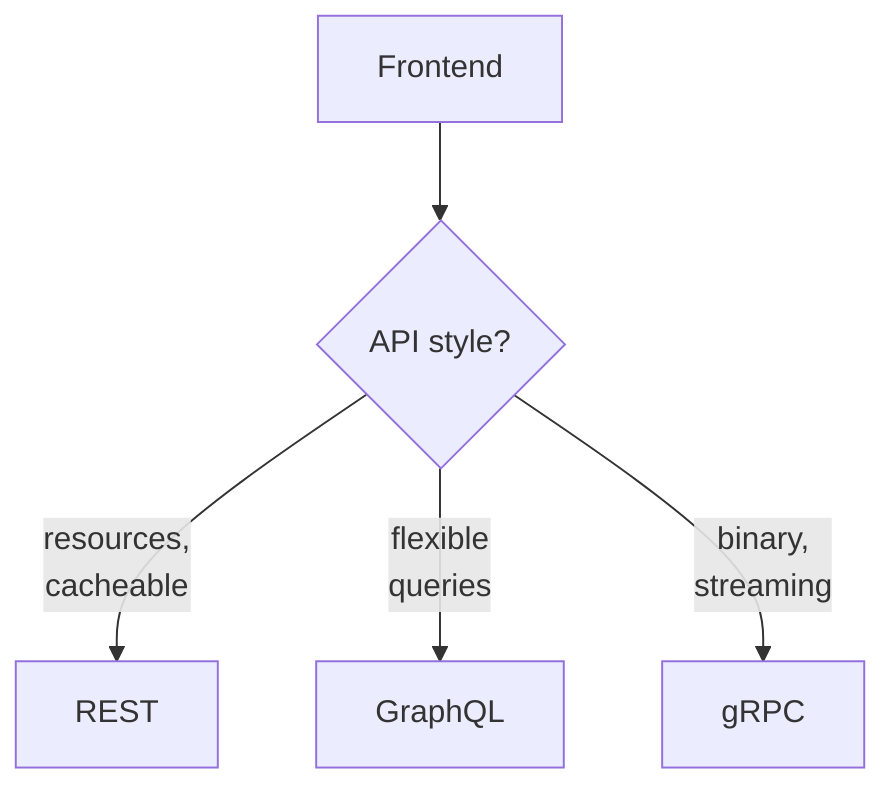

# APIs - Overview

How frontends talk to backends. REST, GraphQL, gRPC, and when to pick which.

*   [GraphQL vs REST](./graphql-vs-rest.md) - one endpoint vs resource endpoints, over-fetching, caching, and the decision framework.
*   More: gRPC, WebSockets, webhooks — coming next.

