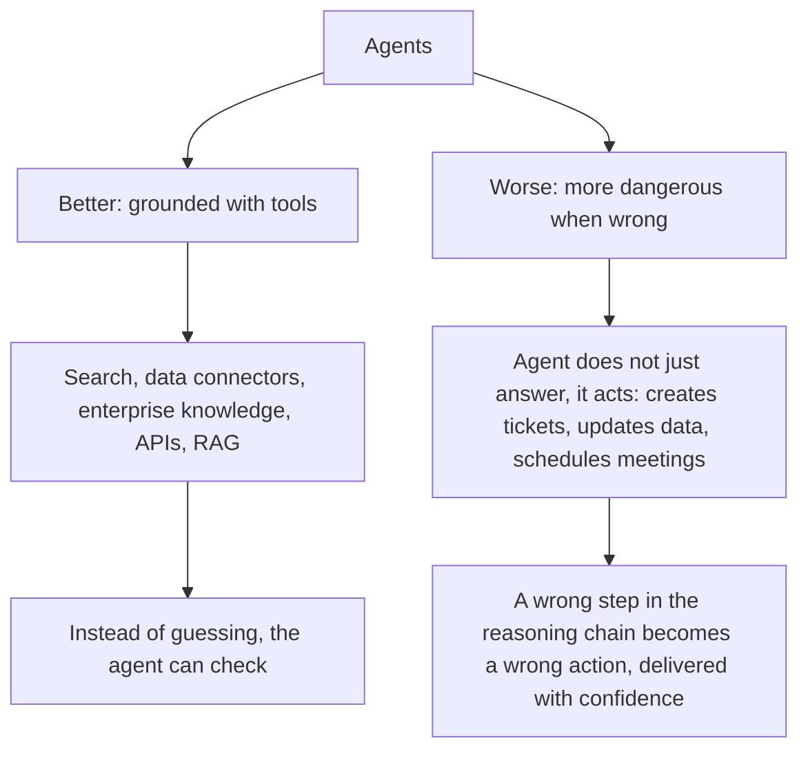
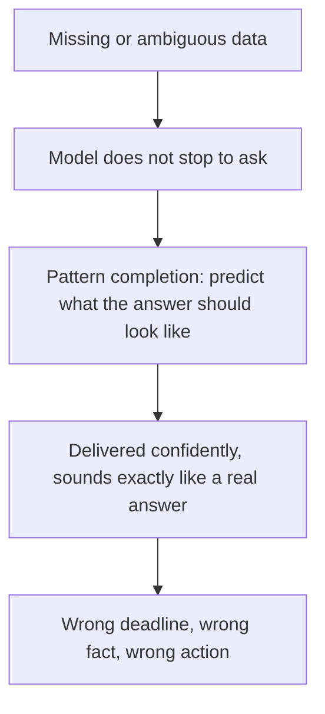
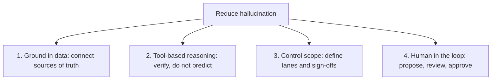

# AI Agent Hallucination

> This article is based on the YouTube video ["Understanding AI Agent Hallucination in AI Systems"](https://www.youtube.com/watch?v=bNRhppHct54). The transcript was lightly edited for readability. The content, structure, and analogies belong to the original creator.

## TL;DR

- **Hallucination** is the moment AI confidently gives you information that is totally incorrect, like a GPS steering you into a lake.
- Agents change the risk in both directions: grounded with tools (search, data connectors, RAG), they hallucinate *less*; but multi-step agents that *take actions* make wrong answers more *dangerous*.
- Why it still happens: models predict what a correct answer would sound like rather than verifying, they are trained to sound confident, and they improvise when data is missing.
- The four fixes: ground the agent in your data, use tool-based reasoning, control the agent's scope, and keep a human in the loop for important decisions.
- The close: hallucination is not just a technical problem, it is a design choice. The difference between an AI that drives you into the lake and one that gets you there is not the model, it is the design.

## The GPS that drove into the lake

There are stories of drivers following their GPS so faithfully that they ended up in a lake. The GPS directed them down a boat launch, and because they trusted the system more than their instincts, in they went.

We laugh at that story because it seems so ridiculous. Who would follow directions that blindly? But something similar happens with AI. We ask an AI assistant for help, maybe something complex like summarizing a sales contract or building a technical architecture. It gives us an answer with so much confidence that we assume it must be right. Sometimes it is. Other times it is a GPS pointing us straight into a lake.

That moment when AI confidently gives you information that is totally incorrect is called **hallucination**. And as AI systems evolve from simple chatbots into fully autonomous agents, hallucination becomes a different kind of conversation.

## Agents: better or worse?

Have agents made hallucinations better or worse? This is the question everyone is asking. When we move from basic LLMs to chatbots and then to agents, systems that plan, reason, use tools, and take action, the risk landscape truly changed. The real story has two sides.

**The good news:** agents do hallucinate less when grounded with tools. Search tools, data connectors, enterprise knowledge sources, APIs, and retrieval systems like RAG. When the agent can truly verify and check information, it reduces hallucination dramatically, because now instead of guessing, it can check. This is like giving your GPS satellite view and real-time traffic data instead of just a static map to go home after work.

At the same time, adding multi-step reasoning increases output and creates more opportunities for errors. Some advanced thinking models show higher hallucination rates, so it is something to watch out for.

**The challenging news:** agents hallucinate more dangerously and introduce more risk than before. Because the agent is not just answering questions, it might be creating a ticket, taking an action, updating a field, updating data that is used for something else, scheduling meetings. And if the reasoning chain of steps is off and the context is thin, the agent can take the wrong action and do so with complete confidence.

## Why hallucination still happens

Even the best models today still hallucinate, and in some cases the more capable the model, the more confidently it can be wrong. Three reasons:

**1. They generate plausible answers, not verified ones.** The model is not looking something up. It is predicting what a correct answer would sound like, and sometimes that prediction is not correct.

**2. They are trained to be confident.** Hesitation gets penalized, fluency gets rewarded. The model learns to sound sure even when it should not be. Some newer models are getting better at saying "I don't know", but it is still the exception, not the rule.

**3. They fill gaps.** When data is missing or ambiguous, the model does not stop and ask for clarification. It improvises, and that improvisation sounds exactly like a real answer.

A concrete example: an agent helps a procurement team validate a vendor contract date. The date is not in the correct data, so the agent makes one up on the fly, confidently. Now the team is working off a deadline that never existed. That is not a bug in the traditional sense. It is the model doing exactly what it was built to do: complete the pattern and fill the gap. The problem is that pattern completion and truth are not always the same thing.

## What to do about it

### 1. Ground the agent in data

The fastest way to reduce hallucination is to give the agent a reliable map. Imagine asking a consultant to audit your business without giving them access to your actual systems. They would still give you an answer, and they would be confident, but it would not be grounded in your reality. The fix is straightforward: connect the agent to your sources of truth, whether that is SharePoint, CRM systems, a contract repository, or APIs.

Think of it like the difference between a GPS running on a map from five years ago versus one with live data. The old map is not wrong about everything, but it does not know about the new road, the closed bridge, or the construction that has been blocking your route for months.

### 2. Use tool-based reasoning instead of pure text prediction

If you ask a colleague to calculate your quarterly burn rate, you want them to open a spreadsheet, not do it from memory. But an agent that is forced to just write an answer is doing it exactly from memory: predicting what the right answer looks like, not actually computing it.

The fix is to give the agent access to tools, so it can check reality before responding: calculators, APIs that query live data. A GPS that assumes a road is open will drive you straight into a detour. One that checks live traffic, road closures, and conditions before routing you is one you can trust. That is the difference between the agent that predicts and the one that verifies, and it is the shift that actually moves the needle on hallucination.

### 3. Control the scope

Hallucination grows when the agent does not know where its boundaries are. Think of somebody brilliant in their domain: they know everything about the city they live in, but you ask them about a place they visited ten years ago. They do not say "that is not my area". They answer with the same confidence they bring to everything else.

That is an agent without scope boundaries: highly capable inside its lane, genuinely dangerous when operating outside of it. So define the lanes. Be explicit about what the agent can do, what it cannot, where the data comes from, and which workflows need sign-off. The tighter the scope, the less room for the model to wander, and the fewer opportunities for confident wrong answers to slip through.

### 4. Add a human to the loop

Not everything should be fully automated, and honestly, not everything should be. For the highest-stakes decisions, the AI should be a fast, thorough first draft. The agent proposes, a human reviews, and a human gives the final approval.

If that sounds like a failure of the technology, it is not. It is good system design. And it matters beyond catching hallucinations: a human in the loop adds the judgment, context, and accountability that no model can replicate. Think of it like cruise control on a long highway drive. It handles the steady miles just fine, but you still want a driver in the seat for the on-ramp, the merge, and anything the road throws at you unexpectedly.

## The design choice

Agent hallucination is not just a technical problem. It is a design choice, and it does not happen automatically. Someone has to build it that way, and that someone is you.

The challenge: look at whatever agent or AI workflow you are running right now. Because the difference between an AI that drives you into that lake and one that truly gets you where you are going is not the model. It is the design choices you make.

## Source

- Video: [Understanding AI Agent Hallucination in AI Systems](https://www.youtube.com/watch?v=bNRhppHct54) (YouTube)
