# Agentic Engineering

**Agentic engineering** is the practice of building software where AI agents plan and execute multi-step work autonomously, using tools, against a goal you define. Unlike traditional software, where every behaviour is written in code, an agent decides *how* to reach the goal on its own.

That autonomy is exactly why agentic projects fail. A traditional program does exactly what you code. An agent does its best interpretation of what you asked for. If your request is vague, your agent will be vague - confidently.

## The problem: starting with prompts, not requirements

Most teams start an agentic project the wrong way round. They pick a prompt, wire up some tools, and let the agent run. The loop looks like this:

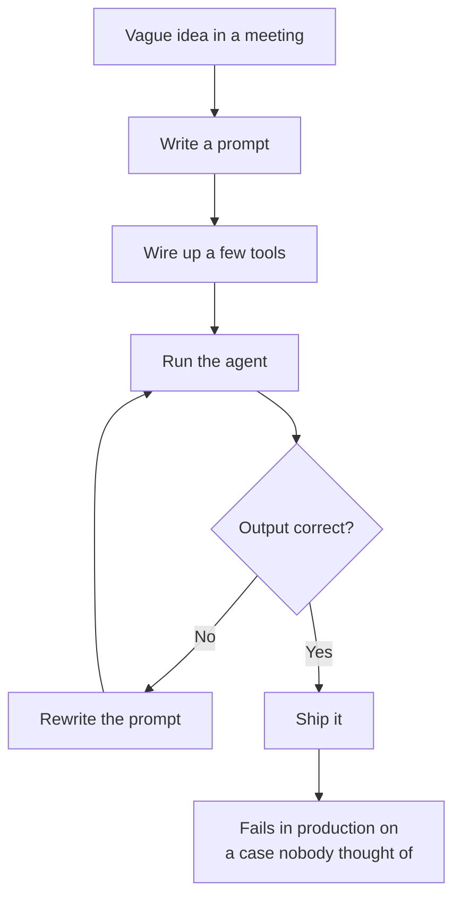

The prompt becomes the specification, and the specification is unreadable, untestable, and unverifiable. Every fix is another prompt tweak. Nobody can say what "done" means, so the agent is never truly done - and nobody can measure whether it is doing a good job.

The fix is to treat an agentic project like any other software project: **it starts with requirements**. Clear requirements for an agent are not a formality. They are the only thing that gives a non-deterministic, autonomous system a definition of success.

## The solution: requirements first

Before any prompt is written or any tool is chosen, answer three questions:

- **Scope** - what is in and what is out
- **Functional requirements** - what the agent must do
- **Non-functional requirements** - how well it must do it

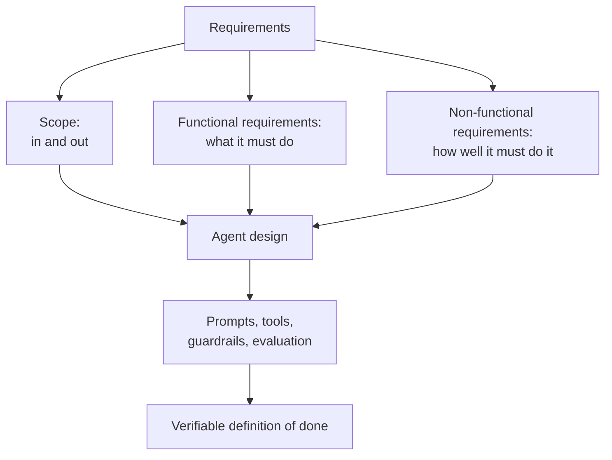

With these in place, every later decision becomes checkable. A prompt is good because it satisfies the functional requirements. A tool is justified because it is needed by a use case. An evaluation passes because it meets the non-functional requirements.

## Scope: what is in, what is out

Scope defines the boundary of the agent's work. It is the easiest requirement to skip and the most expensive to skip, because agents love to drift outside it.

A scope statement answers two questions:

- **In scope** - the tasks, inputs, and decisions the agent owns
- **Out of scope** - the tasks it must refuse, escalate, or leave untouched

Without an explicit out-of-scope list, an agent will happily "help" with things it was never meant to touch - deleting files, refactoring unrelated code, spending tokens on ideas the team rejected.

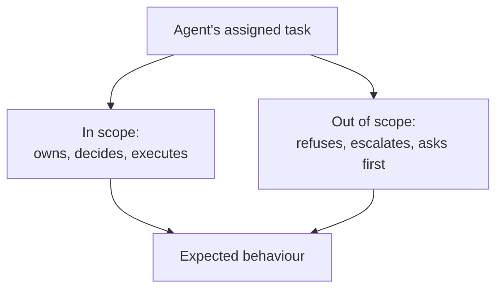

### Example

For a **code review agent**:

- **In scope:** review the diff of the current pull request, flag bugs, suggest fixes, verify the suggested fix against the test suite
- **Out of scope:** rewriting the whole file, changing the API design, committing to the branch, deploying to production

The out-of-scope list is what keeps the agent safe. If the scope says "review, don't rewrite", then any attempt to rewrite more than a few lines is a bug in the agent, not a feature.

## Functional requirements: what the agent must do

Functional requirements describe the behaviour the agent must deliver. For a human task, "review the PR" is enough. For an agent, it must be broken into verifiable statements of input, action, and output.

Good functional requirements for an agent include:

- **Triggers** - when does the agent start? On a new PR, on a message, on a schedule?
- **Inputs** - what does it read, and where does it come from?
- **Steps** - what sequence of actions and tool calls must it perform?
- **Outputs** - what must it produce, and in what format?
- **Acceptance criteria** - how do you know the output is correct?

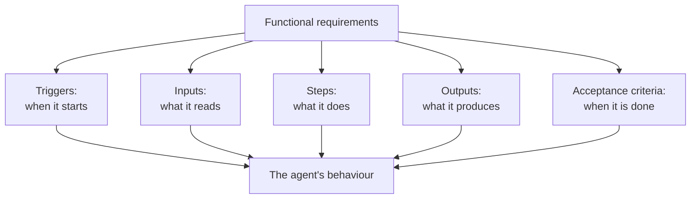

Functional requirements give the agent its **acceptance criteria** - a concrete definition of done. This is the difference between "review the PR" and "review the PR and report bugs with severity, suggested fix, and test results, and do not modify the code."

### Example

For the **code review agent**:

- **Trigger:** a pull request is opened or updated
- **Inputs:** the diff, the changed files, the repository context
- **Steps:** read the diff, check the test suite passes, look for bugs and violations of the repo's conventions
- **Outputs:** a review comment per issue, each with severity (critical, major, minor), a location, and a concrete suggestion
- **Acceptance criteria:** every critical issue is caught, no false positives in the modified files, no files are changed

Now the agent has something testable. You can build an evaluation that feeds it real PRs and checks whether it actually reports the injected bugs.

## Non-functional requirements: how well it must do it

Functional requirements say what the agent does. Non-functional requirements say how well, and they are the requirements most people forget when building agents. An agent that completes its task is useless if it costs more than the team's budget, takes too long, or cannot be audited.

The important quality attributes for agentic systems are:

- **Reliability** - how often must the agent complete the task correctly? What failure rate is acceptable?
- **Cost** - what is the budget per run? Which model fits the budget?
- **Latency** - how fast must it respond? Is this interactive or a background job?
- **Determinism** - must identical inputs produce identical outputs, or is variation acceptable?
- **Safety** - what actions are irreversible? What guardrails are mandatory?
- **Observability** - what must be logged and traceable so a bad output can be explained?
- **Security** - what data is the agent allowed to see and send to which models?

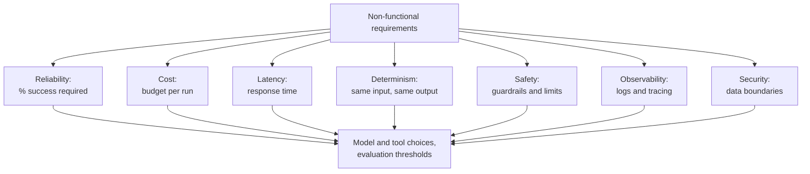

Non-functional requirements drive the hardest engineering decisions. They decide the model (a cheap fast model for simple turns, an expensive careful one for final decisions), the guardrails (approval gates before any destructive action), and the evaluation thresholds (90% success is fine, or 99.9% is mandatory).

### Example

For the **code review agent**:

- **Reliability:** catch 95% of injected critical bugs on a test set; zero false positives that block a merge
- **Cost:** under 2 cents per review, targeting a small model for most analysis
- **Latency:** under 30 seconds per review, non-interactive
- **Determinism:** stable for the same diff, so reviewers can trust and repeat a result
- **Safety:** read-only; never modify files, never commit, never run destructive commands
- **Observability:** full trace of every tool call and reasoning step, archived for audits
- **Security:** only diff contents are sent to the model, never credentials or secrets

## How requirements become the agent

Once requirements exist, the design falls out of them. Nothing in an agent should be arbitrary. Every part is traceable to a requirement:

- The **system prompt** encodes scope and non-negotiable rules ("never modify files")
- The **tools** are the minimum set needed to perform the steps
- The **guardrails** enforce safety and out-of-scope rules
- The **evaluation** checks the acceptance criteria against the non-functional thresholds

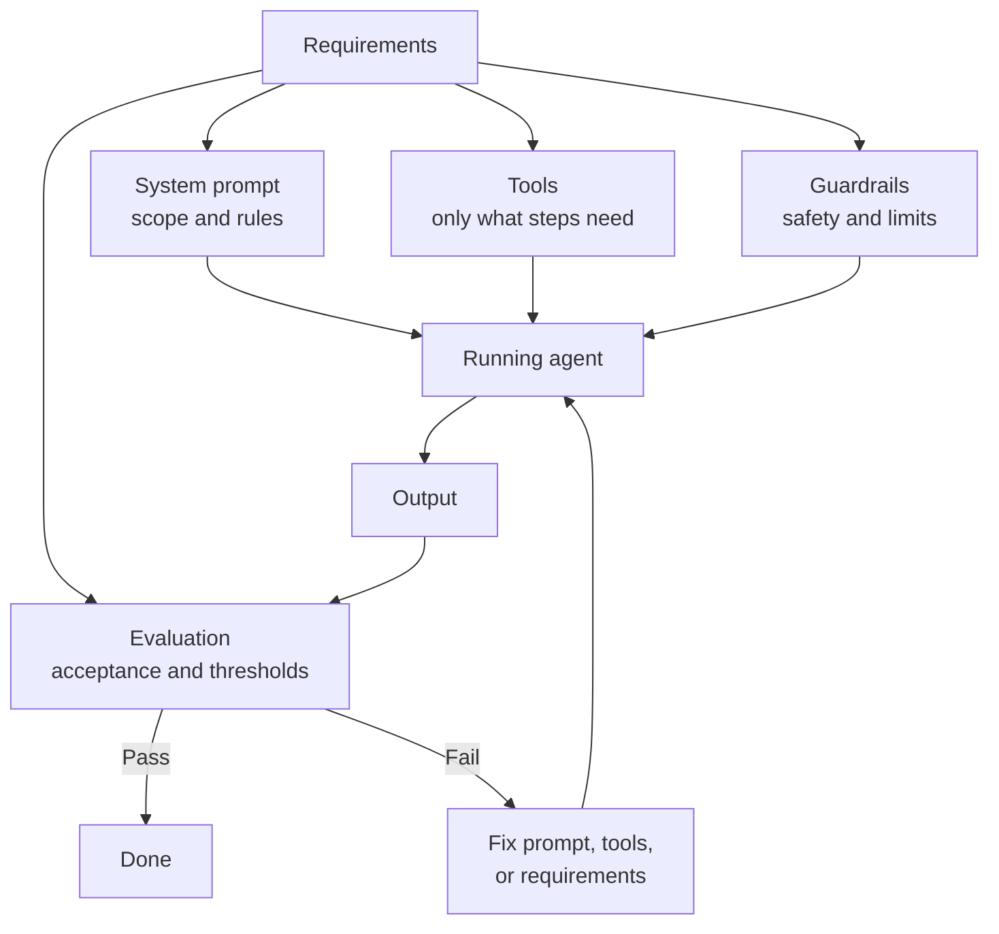

Notice the last loop. When evaluation fails, you first ask whether the prompt is wrong, then whether the tools are wrong - and only then whether the requirements themselves were wrong. Requirements are not sacred; they get updated too. But you can only update them deliberately if they exist in the first place.

## Subagents: explore and general

Within an agent, you can delegate work to **subagents** - smaller, specialised agents with a narrower scope. Each subagent is itself an agent that follows the observe-think-act loop, but its scope is tighter and its tools may be restricted. The two most common kinds are `@explore` and `@general`.

### Context isolation

Each subagent runs in **its own context window**. This is deliberate: it protects the main agent's context from pollution. Every token in a context window competes for the model's attention, so the longer the conversation grows, the more the main agent loses focus. If a research task dumped dozens of files, hundreds of search results, and pages of raw analysis into the main conversation, that noise would dilute the main agent's ability to reason about the task it is actually executing.

Subagents contain that noise. They do the messy, token-heavy work in their own context, chew it down to a conclusion, and return only a compact summary to the main agent. The main context stays lean, focused, and dominated by the task at hand - not by the detours it took to complete it.

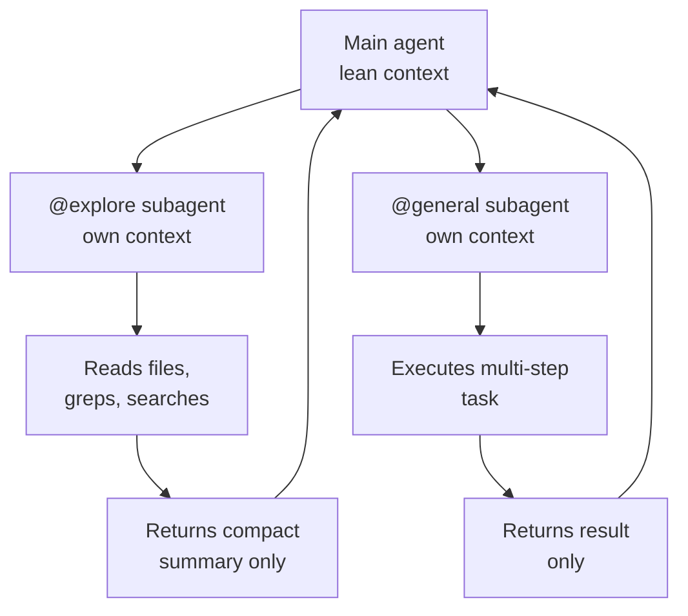

Context isolation is a scaling mechanism. Without it, the main agent's context is a single bucket that fills up as the session progresses, forcing summarisation and lossy compression. With it, each unit of work gets a fresh bucket, and the main agent's bucket only ever receives distilled results. This is why subagents also make **parallelism** safe: several subagents can burn through their own contexts at the same time without competing for the main agent's window.

`@explore` is a **read-only research agent** built for understanding a codebase. Give it a question like "how do API endpoints work?" or "which files implement the checkout flow?" and it searches file patterns, greps for keywords, and reads the relevant files, then reports back. It never modifies anything. Use it when you need context before you act - to understand the shape of a system, find where a piece of logic lives, or decide where a change belongs.

`@general` is a **task-execution agent** for open-ended work. It can research a complex question or carry out a multi-step task on its own, and it is especially useful for running several independent units of work in parallel. Use it when a job is well enough defined to be handed off wholesale - gather the details, then come back with the result.

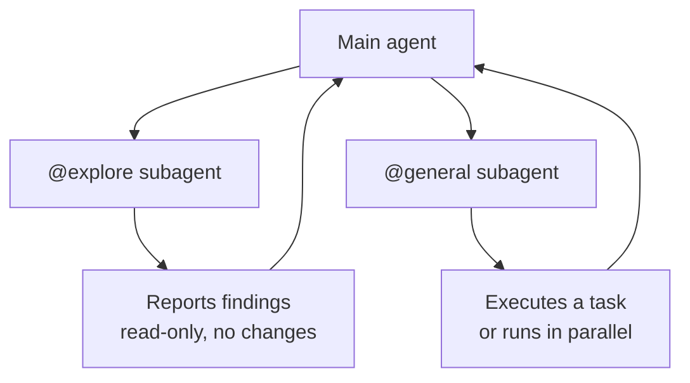

Subagents are not a separate discipline - they follow the same rules. Before you hand a subagent work, you define its scope (what it can and cannot touch), its functional requirements (what it must find or do), and its non-functional limits (no writes, bounded effort). The main agent writes the subagent's prompt the same way the team writes the main agent's prompt: from requirements, not vibes.

- Use `@explore` to answer "where is X?" without risking a change
- Use `@general` to hand off a bounded task, especially when several can run at once
- Define each subagent's scope and limits before letting it run

## The ceiling: parallel fleets and the review problem

There is a seductive version of this idea taken to its extreme. A team defines a queue of tasks, fires up a fleet of agents, and lets them run for **hours in parallel**. The humans do nothing but triage the finished work. Whatever a feature needs - scaffolding, plumbing, integration, tests - the agents do while the engineers sleep.

On paper it is pure efficiency. In practice it has a fatal flaw: hours of parallel compute is an eternity that produces an enormous amount of code, and nobody has developed the understanding needed to pass judgment on it.

### Building is how understanding is built

You cannot review code effectively if you did not build it, or at least watch it being built. The person who authored code carries its architecture, trade-offs, decision history, and edge cases in their head. A reviewer facing a finished blob of generated code has none of that. They see the final artifact, not the journey that produced it.

The gap is not a matter of skill. It is the difference between understanding built side-by-side as the code emerges and reverse-engineering a finished result in a hurry. Your confidence in code you watched being built is simply not available to someone landing on an unfamiliar wall of output.

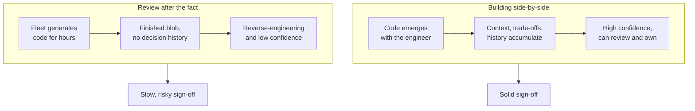

### Sign-off is the real bottleneck

Ownership does not disappear just because agents did the work. At the end, a human must take responsibility for the code - its behaviour, its security, its maintainability. And reviewing hours of generated output takes at least as long as building it took. Waiting two hours for the machines, then spending two days reviewing, is not a faster loop; it is a slower one with worse confidence.

The asymmetry is the point: **generation is cheap and fast, understanding is expensive and slow.** Every hour of unbounded agent runtime converts cheap compute into expensive human review time. If five agents run for ten hours, you have produced somewhere between days and weeks of human reading, and you have done it while actively preventing the humans from developing the context they need for that reading.

### Correct passes do not mean good design

Even with verification - generated tests, a green pipeline - you still know nothing about the quality of the design. A test suite can pass while the architecture is a tangle: duplicated logic, leaking abstractions, wrong boundaries, tight coupling. Verification answers "does it work?"; design answers "should it exist in this shape?" Agents optimise for the former because it is checkable. The latter needs judgement, taste, and ownership - exactly what a parallel fleet removes from the loop.

### The fix is bounded parallelism

The answer is not to abandon parallelism; it is to **bound** it. Decide per task what is safe to delegate wholesale and what must be built side-by-side with a human watching. The amount of code an agent may generate before a human reviews it is itself a non-functional requirement - write it down as a limit, and make the fleet a controlled tool rather than an unattended process.

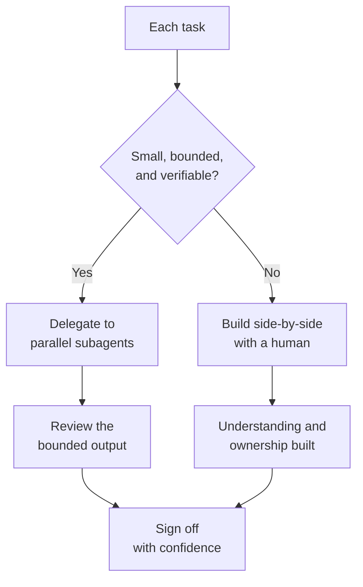

Every decision about how much work to offload and how much to keep is a scope and non-functional requirement. The requirement that no amount of agent output exceeds what a human can confidently review is as valid - and more important - than latency or cost.

## The factory trade-off

This is where the "AI factory" model runs into its softest spot. A factory promises this: you define the specification as tickets, agents work overnight, and by morning the tasks are done. For a CRUD application, you enumerate the pages, the fields, the validations as Linear tickets, and the fleet builds from that.

But notice what is actually being asked of you. **Code was always a specification** - a precise, executable description of what the computer should do. Writing tickets is providing the same specification in English instead of code. The factory has not removed the work of specifying; it has only removed the typing. And because the execution is now in the hands of an agent, a second job appears that never existed before: verifying that the agent understood the spec and executed it faithfully.

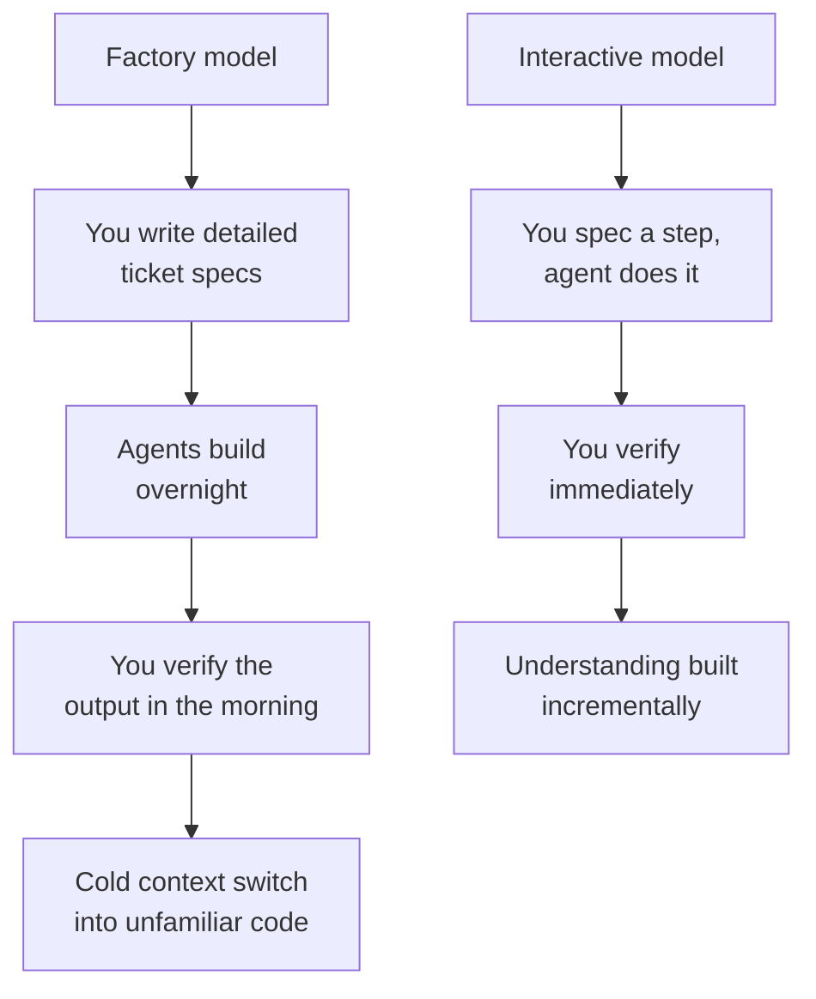

The overnight claim also does not survive arithmetic. If an agent took hours to write the code, what exactly took it that long? And whoever verifies the result still pays. "Done by morning" becomes "done by morning, then reviewed until the afternoon - and the reviewer starts cold, without the context the agent built up while writing it."

### Context switching is the hidden tax

There is an overhead most discussions ignore: the spec writer and the reviewer are often the same frustrated person. You must be fully engaged to write a good specification - pages, fields, edge cases, business rules. Then you disengage, let the agents run, and re-engage hours later to check work that has diverged from your spec in ways you have not seen coming.

That is not one job, it is three jobs with breaks in between: specify, wait, reverse-engineer. Every return to the code costs a context switch. The whole time, you are building less understanding than you would by writing the code or by working with an agent turn by turn, verifying each step as it happens.

### The irony: technical debt becomes review debt

We used to call it technical debt. Now the model hands you a fresh choice, and both options are bad:

- **Review the generated code** - then the time you "saved" by not writing it is spent understanding it, and you might not even save any.
- **Skip the review** - then you own a codebase you do not understand, and technical debt has simply been renamed review debt.

The second choice is worse than it sounds. When a scenario the spec never anticipated fails in production at 2 a.m., you need to fix it. But you did not write that code and you did not develop the understanding of it. The fix that takes an author fifteen minutes takes you hours - you are reverse-engineering an unfamiliar system under pressure. The debt is not an abstraction; it is concrete, and it is billed every time the system misbehaves.

The interactive alternative keeps the same loop but shrinks it. Work with an agent step by step: you spec, it does, you verify, repeat. Understanding accumulates as you go, review happens continuously instead of in one dreaded batch, and the spec can change cheaply because nothing has been built a hundred steps ago on top of a misunderstanding. You save the typing, but you keep the understanding.

The factory claim is only profitable if you assume the human's understanding was never worth anything. In a codebase you will have to operate, that assumption is the most expensive one you can make.

## Follow the incentives

There is one more reason agentic engineering feels so uniformly triumphant, and it has nothing to do with the technology: the people telling you about it have a vested interest in the answer. A large share of the AI engineering content you watch on YouTube is funded by AI companies. Channels like the famous AI engineering channel are sponsored - Anthropic is among the backers - and clear cases of conflict of interest are everywhere.

An oblivious viewer watches these channels thinking they are impartial, objective, and fun. The host is likeable, the advice feels practical, and the enthusiasm seems genuine. It rarely crosses the viewer's mind that the channel that at first glance looks like an independent educational resource is, in practice, an extension of a vendor's go-to-market machine.

The subtle part is that the disclosure is easy to miss. Sponsorship is usually announced in the first slides or the first seconds of the video - the exact part of the viewing experience people skip. "Anthropic" or "OpenAI" flashes past, and the rest of the hour unfolds without any reminder that the host's employer, funder, or sponsor is an interested party in everything that follows.

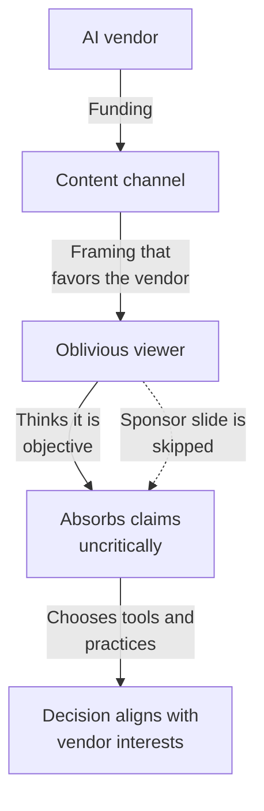

This is not a claim that the content is dishonest. It does not need to be. A channel funded by a model vendor will naturally gravitate toward the stories that flatter the vendor: agents are powerful, factories are inevitable, autonomy is the future. It will rarely feature guests arguing that most agent output should not be merged, that understanding is being destroyed by the very features being sold, or that the factory model is an accounting trick where the typing is removed but the review remains. Those stories do not sell subscriptions.

The bias is structural, not personal. To be a capable practitioner you need to read the incentives on every source the way you would read a requirements document:

- **Who funds this?** What does the funder sell, and does the content benefit them?
- **What is the claim?** Extract the concrete claim and separate testable facts from vibes.
- **What is left out?** Does it show failures, trade-offs, and the human cost, or only success stories?
- **Who profits if you believe it?** If the answer is the person telling you, discount it accordingly.

The same discipline applies to evaluating the discourse as to building the software. The scope of a claim matters - "agents can write code" and "agents can be trusted to write production code unattended" are different claims, and conflating them is a requirements failure. Every engineering decision at the end of this article is decided by the same question asked of your own codebase: what now, and on what evidence?

### The structural conflict of interest

There is a reason the agent story is being pushed this hard, and it is not the technology. Agent loops burn tokens. Every agent that runs for hours, every fleet that builds overnight, is consumption - and consumption is what the model vendors sell. The push toward autonomy, factories, and unattended parallel fleets is not engineering advice; it is a sales motion that happens to be measured in tokens. The vendors make more money the more you delegate and the less you verify.

This has happened before. Companies pushed microservices for years, and startups adopted them even where a modular monolith would have served, because the architectural literature of the era was written by people with no vested interest in cloud costs or operational complexity. The books preached cohesion and coupling in the abstract while ignoring that every extra service shipped a bill and a pager. Only later, when the escalations arrived, did the pendulum swing back.

The lesson generalises. Whenever you architect a system, the bottom line is that you have to listen to somebody impartial - somebody with **no conflict of interest**. A vendor telling you to use more of their product is not the right person to take advice from, no matter how well-produced their content is. The right advisor is the one whose answer does not change their revenue.

## The social layer that disappears

There was a story people used to tell about engineering leadership: directors shipping code without reading it. It was quoted as evidence that code could fly without review. But it ignored the detail that mattered most - those same teams had other people reading and arguing about the code. The director did not review, but someone did. When an escalation landed, there was a room of engineers who knew the system, had fought over its seams, and could explain why an edge case behaved the way it did. The review happened even when no single individual claimed credit for it.

That social layer is the real casualty of the unattended fleet. Let agents generate, let the ticket-writer merely approve, and nobody is reading, arguing about, or carrying ownership of the code. There is no chorus of engineers building shared context through disagreement. There is a single humming agent and a single approvals dialog. When the escalation arrives at 3 a.m., the person expected to respond has no memory of the code and no one to ask, because everyone else has the same absence of understanding.

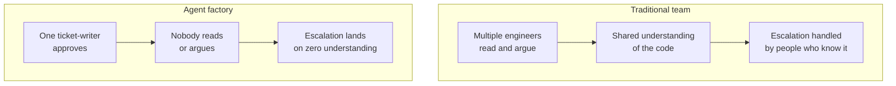

This is not an engineering cycle at all. It is a **slop cycle** - ship now, absorb the consequences later, and pay for them in the dark. Engineering has never been defined by the act of producing code. It has been defined by the distributed act of holding code accountable: reading it, questioning it, owning the failure modes. Remove that, and what remains is production without accountability.

### The cognitive load lands on one person

To win the ticket game at all, the ticket-writer has to be remarkably specific. The agent will do exactly what the ticket says, so everything that is not in the ticket - the edge cases, the ordering constraints, the design intent - must come from the writer's head. That means the engineering manager or lead absorbs the entire cognitive load of the feature, alone.

The old model spread the load across a team: multiple engineers carried pieces of the design, review spread understanding, and Q&A caught what any one person missed. The factory model concentrates it. One person must think everything, specify everything, then review everything - and their mistakes travel through the whole system undiluted, because nobody else ever looked at the output. Nobody is thinking about the system except the person who wrote the tickets, and that person was thinking alone.

## A worked example

Put it together with a **customer support triage agent** that classifies incoming tickets and drafts responses.

**Scope**

- **In scope:** classify ticket by category and severity, draft a reply, suggest an escalation
- **Out of scope:** sending the reply, granting refunds, changing ticket status, accessing customer accounts

**Functional requirements**

- **Trigger:** a new ticket arrives
- **Inputs:** ticket text, customer history summary, product docs
- **Steps:** read the ticket, match it against known categories, assess severity, retrieve relevant docs, draft a reply
- **Outputs:** category, severity, draft reply, escalation flag
- **Acceptance criteria:** every ticket gets a category and severity, the reply uses the correct product docs, nothing is sent without human approval

**Non-functional requirements**

- **Reliability:** 95% of categories correct, 90% of severities correct on a labelled test set
- **Cost:** under 1 cent per ticket, batched on a small model
- **Latency:** under 5 seconds per ticket
- **Determinism:** same ticket, same classification
- **Safety:** no external send; approval required for any action on a customer
- **Observability:** log category, severity, retrieved docs, and reasoning for every ticket
- **Security:** no PII beyond the ticket text is sent to the model

From these requirements, the team knows exactly what to build: a prompt that lists the categories and severity rules, a tool for the docs search, a read-only API for ticket context, an approval gate before any send, and an evaluation set of labelled tickets to test against. The requirements came first; the agent is just the implementation.

## Summary

Agentic engineering fails when the prompt is the specification. It works when the project starts like any engineering project: with requirements.

- **Scope** defines what the agent owns and what it must refuse
- **Functional requirements** define the triggers, steps, outputs, and acceptance criteria
- **Non-functional requirements** define reliability, cost, latency, safety, and observability

Every prompt, tool, guardrail, and evaluation should trace back to a requirement. When the agent misbehaves, you now have something concrete to improve - the prompt, the tools, or the requirements - instead of tweaking text and hoping.
