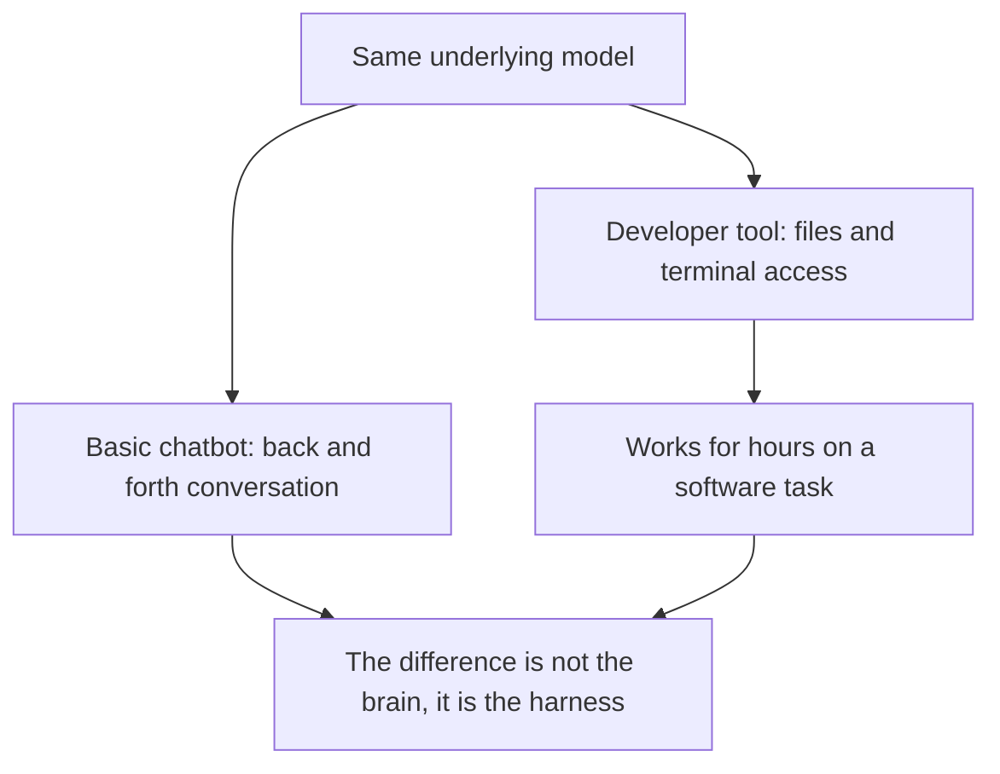
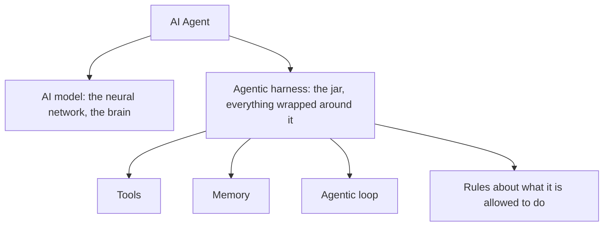
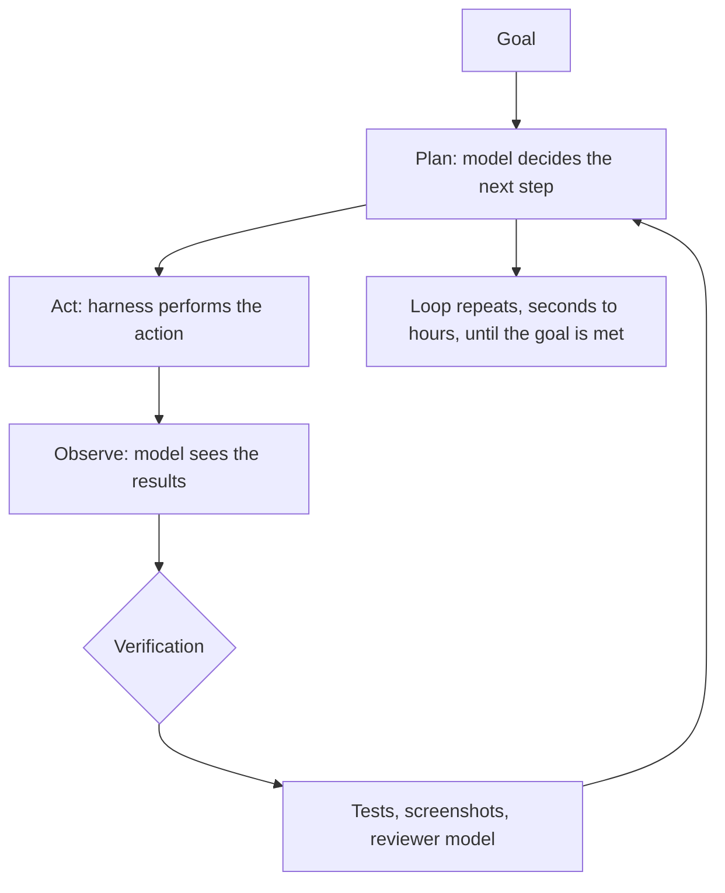
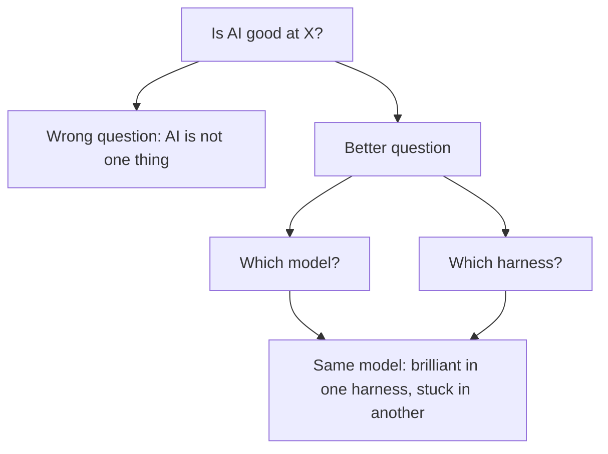

# AI Model vs Agentic Harness

> This article is based on the YouTube video ["AI Model vs Agentic Harness: What Actually Drives AI"](https://www.youtube.com/watch?v=ZELPNFXJ4_o) by IBM Technology. The transcript was lightly edited for readability. The content, structure, and analogies belong to the original creator.

## TL;DR

- Two AI products can feel completely different even when they run the **same underlying model**. The difference is not the brain, it is what is wrapped around it: the **agentic harness**.
- A model on its own is a **brain in a jar**: capable, but unable to open files, run code, or browse the web.
- An **AI agent = AI model + agentic harness**. The harness has three components: **tools**, **memory**, and the **agentic loop**.
- Tools let the model act in the world (files, code execution, computer use, and MCP for external services). Memory persists instructions (like `AGENTS.md`), compacts the context window, and searches instead of dumping everything. The loop cycles plan, act, observe, with continuous verification (tests, screenshots, reviewer models).
- Most recent capability gains have come from **harnesses getting better**, not just models. So the question "is AI good at X?" is incomplete: the real question is **which model plus which harness**, because the same model can be brilliant in one harness and stuck in another.

## Same model, different products

You might have noticed that two AI products can feel completely different even when they are running the same underlying model. The same model can be a basic back-and-forth chatbot, but put it inside a developer tool with access to files and a terminal, and it can suddenly work for hours on a software task.

So what accounts for the difference? It comes down to the **AI model** and the **agentic harness**.

## The model: a brain in a jar

Start with the AI model, because what that is, is pretty simple. We all know these models: ChatGPT, Claude, and so on. When we talk about a model, we really mean the actual artificial neural network.

What models cannot do on their own is reach out into the world. They cannot natively open a file, run a piece of code, or browse the web. On their own, these AI models are essentially a **brain in a jar**: capable, but trapped in the jar.

Now, benchmark gaps between the top labs have narrowed to within a few points of each other on most evals. So when one AI product clearly outperforms another, the brain itself, the AI model, usually is not the explanation. It is what is wrapped around the brain. And that wrapping has a name.

## The agentic harness

When you take a model and wrap it, the thing that wraps it is the **agentic harness**. If you think of an AI agent overall, it encompasses both of these things: an AI agent consists of the AI model and the agentic harness.

The tools the model uses, the way it remembers things, the loop it keeps running, the rules about what it is allowed to do: all of that lives inside the harness.

## Inside the harness: tools, memory, and the loop

### Tools

Through tools, the model can do things out in the world:

- **Files**: read and write to them.
- **Run code**: and that code might run in a sandbox as well.
- **Get information from the internet**.
- **Computer use**: the model can move a cursor around and operate any software, similar to the way a person would do it.

Many of these capabilities are built into the harness directly. For anything already on the machine, a harness usually gives the model access to the **command line**, so it can run whatever software is installed, which is the same way a developer would do it. And for connecting to external services that do not live on the machine, maybe a corporate database or a third-party app, there is a standard called **MCP, the Model Context Protocol**. A tool built for MCP can plug into any harness that supports it, without being rebuilt each time.

### Memory

Models have a fixed **context window**, which is basically their working memory, and once the conversation ends, that working memory is wiped clean. But the harness can help persist things.

- **Instruction files**: an `AGENTS.md` file sits in a project folder and gets loaded into the model's context at the start of every session. That is how the model knows the codebase's conventions or what libraries to use.
- **Compaction**: when the context window starts filling up mid-session, the harness runs a process that summarizes what happened earlier, so the important parts stay around while redundant tool outputs get pruned out.
- **Search instead of dumping**: rather than dumping an entire codebase into the context all at once, the harness lets the model perform a search, sometimes grep-like text search, sometimes semantic search or code indexes, and pull in only the pieces it needs.

### The agentic loop

This is where the harness and the model work together to achieve a goal:

1. The model decides on the next step to achieve the goal. That is the **plan** stage.
2. The harness takes that plan and actually performs the **action**.
3. The action produces results. The model **observes** them.
4. The loop repeats, around and around, sometimes for seconds, sometimes for hours.

In addition to this cycle, modern harnesses run **verification** continuously all the way through the loop. The model runs tests as it goes, maybe takes screenshots of what it has built, and sometimes even spins up a separate model to act as a reviewer. A model that double checks itself can run a lot longer without going off the rails.

Once a harness has all three of these running together, tools, memory, and the loop, the kinds of things AI can actually do start looking very different from anything a model can do on its own.

## Why this distinction matters

Once you can see the model and the harness as separate things, a lot of what has been going on in AI starts to make more sense. Most of the capability gains we have seen lately have come from the **harness getting better**: better tools, better memory handling, and smarter agentic loops with verification. Of course, with every new version, the models have improved as well.

So when somebody asks "is AI good at something?", like "is AI good at writing code?" or "is AI good as a customer support chatbot?", the more useful version of that question defines what we mean by AI, and specifically, we mean two things:

1. **Which AI model** are we going to use in this scenario?
2. If this is an agent, **which harness** are we going to use with that model?

Because the model can be brilliant in one harness and get stuck in another.

### The line between model and harness is fluid

The boundary is also moving. Capabilities that used to live entirely in the harness, like long-horizon planning or self-verification, are starting to be trained directly into the models. And things that used to be model behavior, like consistency over a long task, are increasingly shaped by harness conventions and project files.

Which brings us back to the brain in a jar. The brain itself, the AI model, continues to get smarter, there is no doubt about that. But it is not just the model getting smarter. It is also the jar: the agentic harness.

## Source

- Video: [AI Model vs Agentic Harness: What Actually Drives AI](https://www.youtube.com/watch?v=ZELPNFXJ4_o) by IBM Technology (YouTube)
