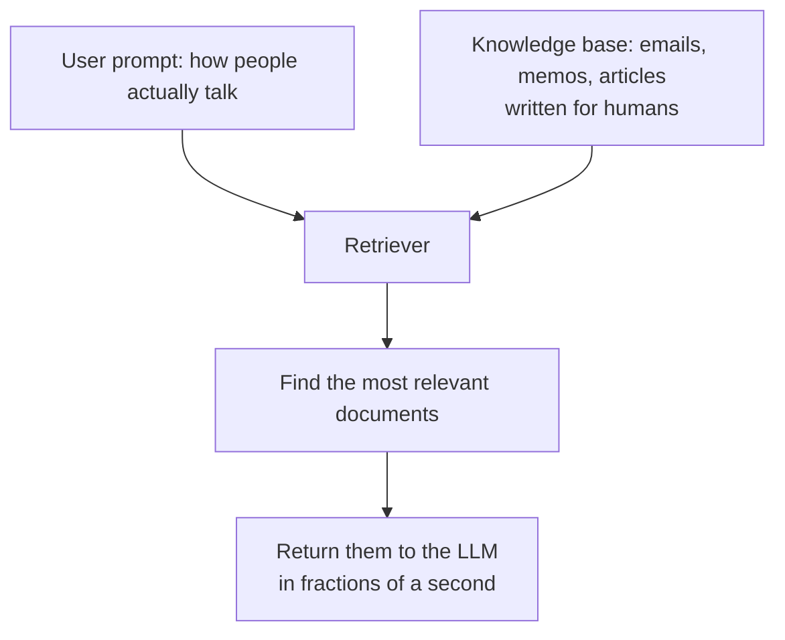
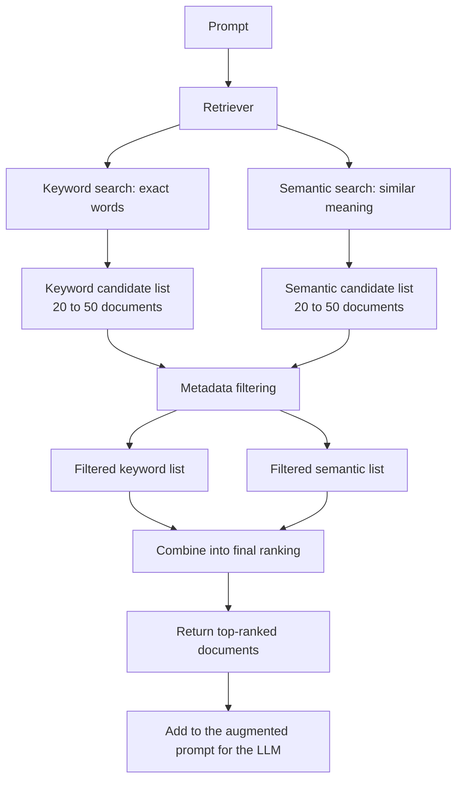
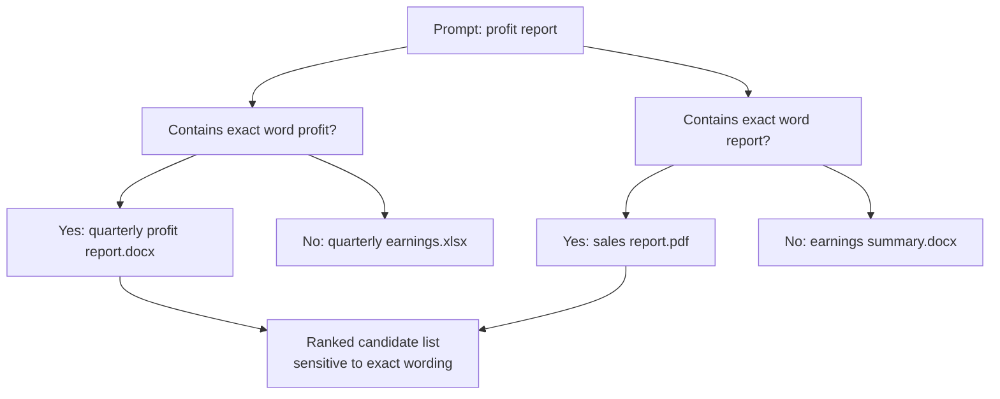
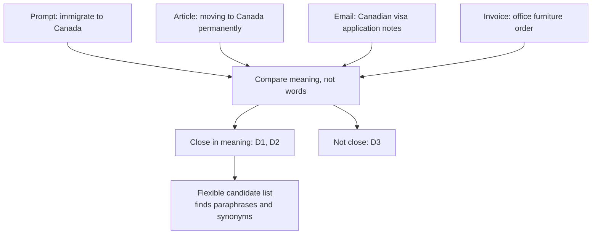
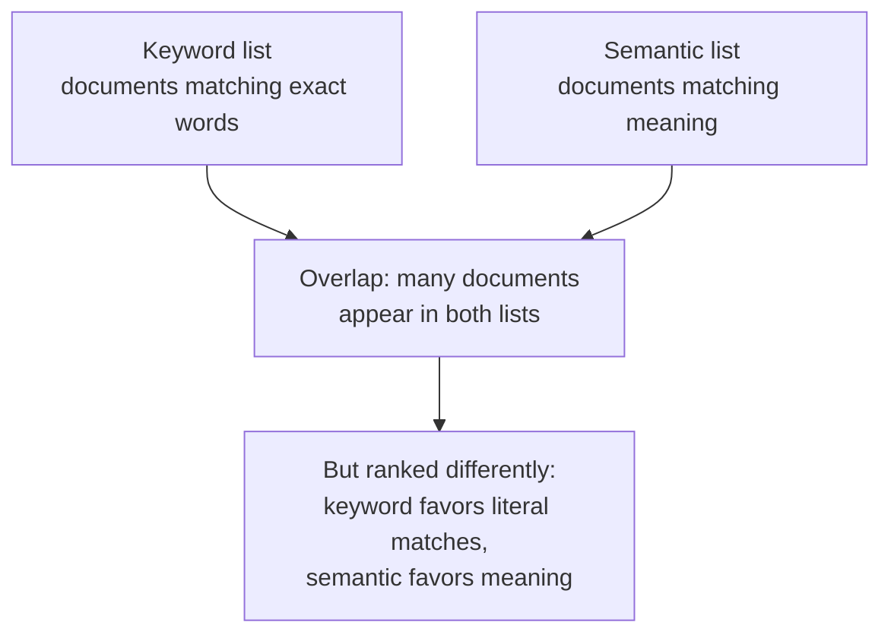
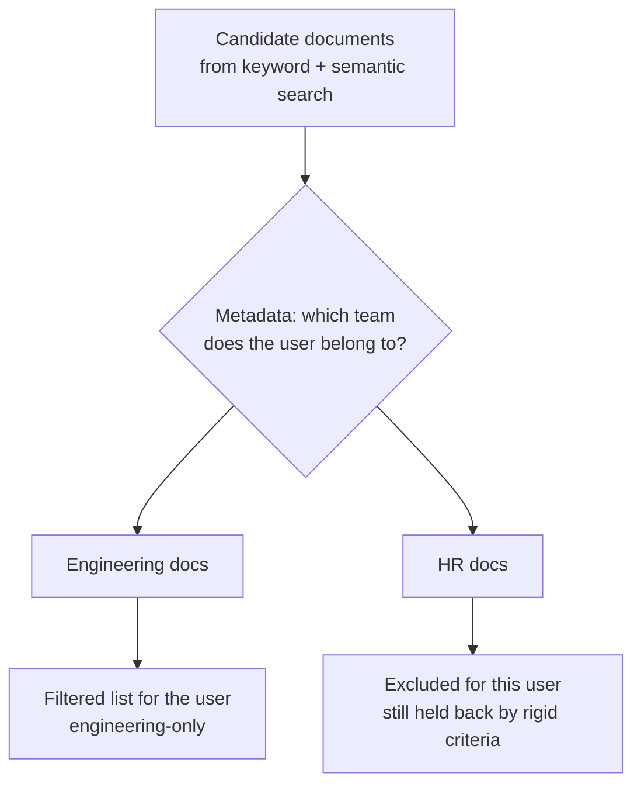
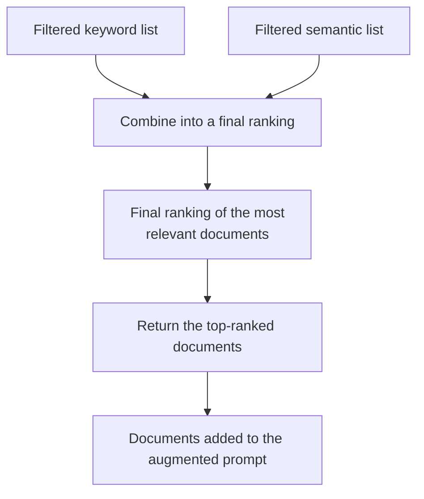
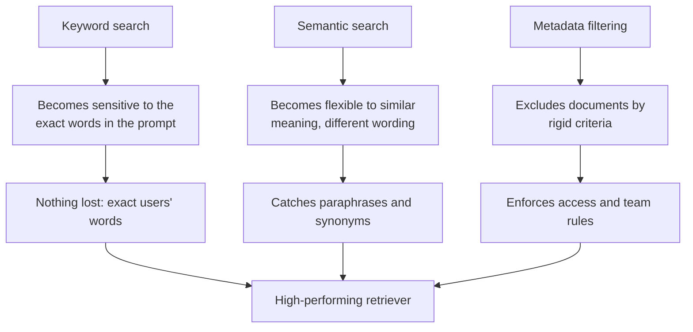
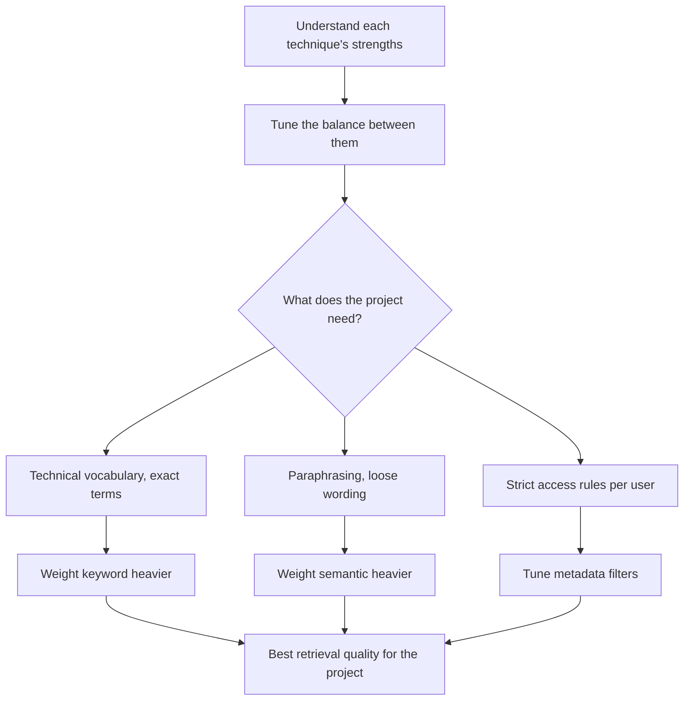

# Hybrid Search: How Retrievers Combine Keyword Search, Semantic Search, and Metadata Filtering

## TL;DR

- **The problem:** a retriever must return the most relevant documents for a messy, conversational prompt (people chat, they do not write SQL) from a knowledge base full of documents written for humans (emails, memos, journal articles, no uniform schema or vocabulary), all in fractions of a second. No single search technique can do that alone.
- **Keyword search** finds documents containing the exact words in the prompt. It is time-tested (decades old, modern implementations typically use BM25) and sensitive to the user's exact wording, but blind to meaning: a document that says "quarterly earnings" never matches a prompt that asks about a "profit report".
- **Semantic search** finds documents with a similar *meaning* to the prompt, so it catches paraphrases and synonyms keyword search misses, but it is less precise about exact wording and can pull in documents that are only thematically related or that drift from what the user wanted.
- **Metadata filtering** is not a similarity search at all: it applies rigid, all-or-nothing criteria on document attributes (like "only documents for the user's team") to include or exclude documents outright, something neither similarity-based technique can express.
- **The hybrid architecture:** the retriever runs keyword search and semantic search in parallel, each returning a candidate list (typically 20-50 documents), filters *both* lists down by metadata, then combines the two filtered lists into one final ranking and returns the top documents to the augmented prompt.
- **Overlap and ranking differences:** many documents appear in both candidate lists, but the two searches rank them differently, keyword favoring literal matches and semantic favoring meaning, so the lists are complementary evidence merged only at the final step.
- **Why hybrid:** each technique contributes a different strength, keyword gives sensitivity to exact words, semantic gives flexibility to similar meaning, metadata gives hard exclusion. Dropping any of the three removes a capability the other two cannot replace.
- **Tuning:** there is no universal default. Technical, vocabulary-heavy knowledge bases (legal or code) reward a heavier keyword weight, paraphrase-heavy customer-facing bases reward more semantic weight, and strict per-user access rules call for stronger metadata filters. The balance should always be tuned to the project's needs.

## 1. The problem: matching a messy question to messy documents

A retriever's job is easy to state and hard to execute. All it needs to do is find the documents in a knowledge base that can help a large language model answer a prompt. Stated that way, it sounds like a lookup. In practice it is two messy things colliding.

First, the users. People are not submitting well-structured SQL queries to a retrieval system. They are chatting with the LLM the way they talk to another person: incomplete phrasings, synonyms, questions that imply concepts without naming them. The retriever has to work with how people actually write, not with how queries would look if a machine designed them.

Second, the documents. A knowledge base can contain anything: personal emails, internal company memos, articles from a medical journal. Rich in information, but usually structured for a human reader, not for a computer to search through. There is no uniform schema, no clean metadata, no consistent vocabulary, and the same idea is expressed with completely different words from one document to the next.

The retriever has to take all of this messily structured information, find the pieces most relevant to the prompt, and return them in fractions of a second, because the whole point of RAG is that the LLM answers without making the user wait for a slow search.

Because neither the question nor the documents are structured for clean matching, the retriever cannot rely on a single search technique. It needs a handful of different strategies that see the documents in different ways and catch what the others miss.

## 2. The solution: a retriever architecture built from multiple searches

When a RAG system receives a prompt, it is first sent to the retriever. The retriever has access to the knowledge base, which you can think of as a bunch of text files sitting in a database. Its job is to quickly decide which documents are most relevant to the prompt, and return them so they can be passed to the LLM.

Most modern retrievers use two different search techniques as part of this process, plus a filtering step:

1. **Keyword search**, the traditional approach, looks for documents that contain the exact words found in the prompt.
2. **Semantic search** looks for documents that have a similar meaning to the prompt, even when the exact words do not appear.
3. **Metadata filtering** then trims both candidate lists using rigid criteria, and the two filtered lists are combined into a single final ranking.

The rest of this article walks through each piece of this diagram, starting with the two searches, then the metadata filter, then the combination step that gives the whole approach its name: **hybrid search**.

## 3. Keyword search: matching the exact words

Keyword search is the more traditional of the two techniques. It looks for documents that contain the exact words found in the prompt. The approach is time-tested and has powered information retrieval systems for decades, well before LLMs existed.

The strength of keyword search is that it is sensitive to the exact words the user included in the prompt. If the user asks about "PostgreSQL indexes", keyword search finds documents that actually contain those terms, which is precisely what you want when the vocabulary in the knowledge base matches the vocabulary of the question.

Its weakness is that it has no understanding of meaning. If the prompt says "profit report" and a document says "quarterly earnings", keyword search sees no match, because it compares literal words, not semantics. In practice, modern keyword search is usually implemented with ranking algorithms from the information retrieval field, of which BM25 is the current production standard ([Robertson and Zaragoza, 2009](https://dl.acm.org/doi/10.1561/1500000019)), building on the classic TF-IDF baseline. The technique has its own dedicated article: [Keyword Search: Matching the Words](./keyword-search.md).

Keyword search is precise about wording, but it only sees the words that are actually there. A question and a document can be about the same topic and still share almost no vocabulary.

## 4. Semantic search: matching the meaning

Semantic search works differently: it looks for documents that have a similar meaning to the prompt. This approach makes the retriever more flexible, because it can find documents that are relevant to the prompt even when they do not contain the exact words the user wrote.

Semantic search is grounded in the idea of comparing meaning rather than text. The internal mechanics of how that comparison works deserve their own deep dive, and are covered alongside embeddings and vector databases in the [retriever article](./retriever.md). For the mental model, what matters is the behavior: where keyword search asks "do the words match?", semantic search asks "is the meaning close?".

This catches exactly what keyword search misses. A user asking "how do I immigrate to Canada" finds an article about "moving to Canada permanently", even though the two share almost no words. But the flexibility is also the weakness: semantic search is less bound to the literal prompt, so it can pull in documents that are thematically related but not what the user wanted, and its notion of "close" depends on how meaning is represented.

Keyword search and semantic search are different lenses on the same knowledge base. One is exact and literal, the other is broad and meaning-based. Neither is sufficient on its own, which is why the retriever runs them together.

## 5. Two candidate lists, much overlap, different rankings

Each search technique returns a collection of documents. The transcript this article is based on cites a typical size of perhaps 20 to 50 documents each, a generous candidate pool meant to make sure nothing relevant is dropped too early.

Usually there will be many documents that appear in both lists, because a document on the right topic often matches both the exact words and the meaning. But the two lists almost never rank them in the same order: a document can rank high on keyword match and low on semantic match, or the reverse, precisely because the style of search is different.

The two lists are complementary evidence about relevance. One says "this uses the user's words", the other says "this is about the user's topic". Keeping both, and merging them only at the end, is what makes hybrid search strong.

## 6. Metadata filtering: hard rules neither search has

Now each list is filtered down based on metadata. Metadata filtering is not a similarity search. It does not rank documents by how well they match the prompt. Instead, it applies rigid criteria to include or exclude documents outright. This technique has its own dedicated article, [Metadata Filtering: The Retriever's Rigid Net](./metadata-filtering.md), which covers the spreadsheet-and-SQL mental model, the newspaper examples, and the full balance of advantages and limitations.

The example from the course is an engineering organization. Some documents in the knowledge base are relevant to members of the engineering team, and other documents are more relevant to people working in HR. The system knows which team the current user belongs to, and it applies a metadata filter at this point so that only the documents matching that user's department are allowed to move forward.

This kind of filtering is something neither keyword search nor semantic search can do, because it is not about text similarity at all. It is a hard constraint on document attributes, and it applies equally to both the keyword list and the semantic list. The grade of the user is a good example of the same idea at a different granularity: the same filter can restrict documents by which department a user belongs to, or by any other metadata attached to the documents.

## 7. Combining the lists: the final ranking, and the name "hybrid search"

Now the retriever has two filtered lists: one generated by keyword search and one by semantic search. These two lists are combined to create a final ranking of the most relevant documents. The retriever returns the top-ranked documents from this combined list, and at that point retrieval is complete: the documents are sent along to be added to the augmented prompt.

This style of search is called **hybrid search**, because it relies on multiple techniques to produce its final document ranking.

The combination step is where the two lenses become one decision. Instead of trusting a single technique to be right, the retriever lets each list contribute its evidence, then produces a single rank order of the documents it will actually hand to the LLM. This is the essence of hybrid search: multiple techniques in, one final ranking out.

## 8. Why each technique contributes to the whole

Each technique provides a benefit that contributes to the overall performance of the retriever. That is the entire reason the retriever runs all of them instead of picking one.

- **Keyword search** ensures the system is sensitive to the exact words the user included in the prompt. When the user names a specific term, the retriever does not lose it.
- **Semantic search** gives the system more flexibility to find documents whose meaning is similar to the prompt, even if they do not use the same words. When the user paraphrases, the retriever does not lose it.
- **Metadata filtering** allows the system to exclude documents based on rigid criteria in a way that neither of the other approaches allows. When a user should not even see certain documents, the retriever does not show them.

The three strengths are complementary rather than overlapping. Keyword covers literal wording, semantic covers meaning, and metadata covers enforcement. Dropping any of the three removes a capability the other two cannot replace.

## 9. Tuning the balance: one technique is not a default

Designing a high-performing retriever means understanding the relative strengths of each of these techniques and then tuning the balance between them to align with the needs of your project. There is no universal default because knowledge bases differ.

A legal or code knowledge base rewards a heavy weight on keyword search, because the exact terms matter and the language is technical and consistent. A support or customer-facing knowledge base with lots of paraphrasing rewards a heavier weight on semantic search. Metadata filtering is tuned separately, by deciding which attributes matter for which users and how strictly they should be applied.

This tuning is part of working with a retriever as a living component rather than a static one, and it connects to the broader point of monitoring and adjusting retrieval quality covered in the [retriever article](./retriever.md).

## 10. Summary

A retriever has to match messy human questions against documents written for humans, and no single technique can do it. The hybrid architecture solves this by stacking three complementary mechanisms. Keyword search finds the documents that use the exact words in the prompt, and it is time-tested but blind to meaning. Semantic search finds the documents whose meaning is similar to the prompt, catching paraphrases, but it is looser and can drift. Metadata filtering enforces rigid inclusion and exclusion rules that neither similarity-based search can express. The retriever runs the two searches in parallel, filters both candidate lists by metadata, combines them into a single final ranking, and returns the top documents to the augmented prompt. The name for this stack of techniques is hybrid search, and a high-performing retriever tunes the balance between its three ingredients to fit the project.

## Sources

- DeepLearning.AI, Building and Evaluating Advanced RAG course, module on the retriever. This article documents the supplied lecture transcript, which introduces the retriever architecture: keyword search, semantic search, metadata filtering, the 20 to 50 document candidate lists, the combination into a final ranking, and the naming of the result as hybrid search. The engineering/HR metadata example and the per-technique strengths follow the transcript directly.
- Robertson, S., and Zaragoza, H. (2009). *The Probabilistic Relevance Framework: BM25 and Beyond*. Foundation and Trends in Information Retrieval. Canonical reference for BM25, the standard ranking algorithm behind modern keyword (sparse) search. https://dl.acm.org/doi/10.1561/1500000019
- Lewis, P., et al. (2020). *Retrieval-Augmented Generation for Knowledge-Intensive NLP Tasks*. NeurIPS 2020. Frames RAG as an LLM augmented by a retriever over a knowledge source, the system this article's retriever sits inside. https://arxiv.org/abs/2005.11401
- Companion article on the same course module: [The Retriever: How RAG Finds the Right Documents](./retriever.md), which covers the retriever's role, the knowledge base and index, relevance ranking, and vector databases, plus the related [RAG](./rag.mdx) article.