# Keyword Search: Matching the Words

## TL;DR

- **The problem:** a retriever must decide which documents in a knowledge base are relevant to a prompt, and the oldest, simplest signal is whether a document shares words with the prompt. The technique is so effective that it kept powering databases and search engines for decades and remains a key component of modern RAG.
- **What it is:** keyword search retrieves documents based on how many words they share with the prompt. Each text is treated as a bag of words, order ignored, only which words appear and how often matters.
- **The representation:** prompt and documents become **sparse vectors**, one spot per word in the system's vocabulary (tens of thousands of spots), each counting how often that word appears, mostly zeros. Arranged as a **term-document matrix**, also called an inverted index, built once before any query.
- **Why a score is needed:** the inverted index only says which documents contain a given keyword. Because the prompt has several keywords and many documents will share at least one, "contains a keyword" cannot pick the best documents by itself. A score turns those yes/no facts into an ordered ranking, and the documents with the highest scores are retrieved.
- **Scoring evolution:** count which keywords appear, then count how many times (term frequency), normalize by document length to fix a long-document bias, then weight rare words using **inverse document frequency (IDF)** (log-scaled), producing the **TF-IDF** score.
- **BM25 is the modern default:** Best Matching 25, with three refinements over TF-IDF: term frequency saturation (diminishing returns for repeated keywords), diminishing document length penalties instead of TF-IDF's over-aggressive normalization, and two tunable hyperparameters (k1 and b) you tune to your data.
- **Strengths:** simple, performs well on its own, often sets a competitive baseline advanced techniques struggle to beat, and guarantees retrieved documents literally contain the prompt's keywords, which is vital for technical terminology and exact product names.
- **Weakness:** it depends on the query containing words that exactly match the document. A prompt that has the same meaning but different words will not match, which is exactly the gap semantic search exists to fill.

## 1. The problem: finding documents by shared words

Before there were embeddings and vector searches, there was a much more basic question: how does a system tell whether a document is relevant to a query? The simplest possible evidence is vocabulary. A document that talks about the same things the question talks about is far more likely to be useful than a document that does not.

Throughout this article we will work with one tiny **running example**: a knowledge base of four cooking documents. Its vocabulary has five words: make, pizza, oven, dough, and the. The prompt we score against is "make pizza oven", so the keywords are make, pizza, and oven. The whole point of the example is to see how, starting from that shared vocabulary, the system decides which documents are relevant and in what order.

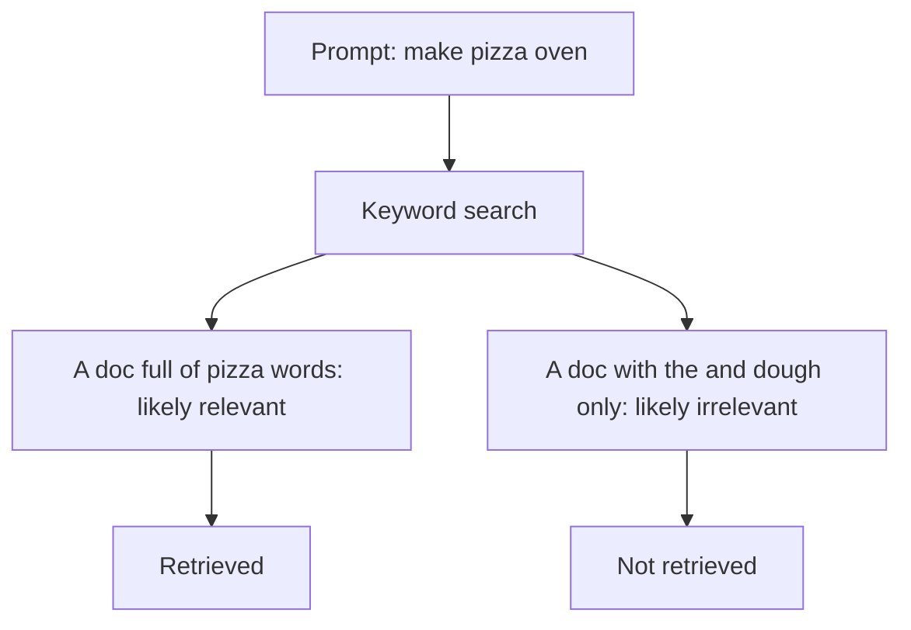

The problem this technique solves is the first and most basic one: find the documents that are on topic, where "on topic" is taken to mean "shares vocabulary with the question".

## 2. What keyword search is

**Keyword search** is a technique that retrieves documents based on whether they share words in common with the prompt. The idea is basically that documents that contain a lot of words from the prompt are more likely to be relevant.

Every word in the prompt is treated as a **keyword**. A document scores higher the more of those keywords it contains, because each shared word is treated as evidence of relevance.

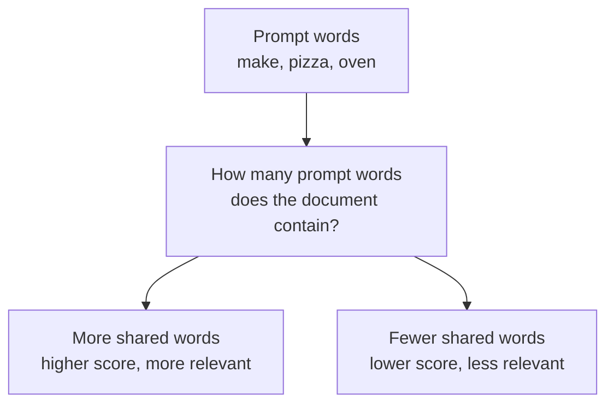

This is the entire idea reduced to one rule: match documents to prompts by how many words they have in common.

## 3. The bag of words and sparse vectors

For this matching to work mechanically, texts have to be converted into something computable. Both the prompt and each document are treated as a **bag of words**. The order of the words is totally ignored; all that matters is which words are in the text and how often.

The four documents of the running example, each shown with its word counts:

- **Doc A**: "make pizza pizza" → make: 1, pizza: 2
- **Doc B**: "pizza oven dough" → pizza: 1, oven: 1, dough: 1
- **Doc C**: "oven make pizza dough the" → oven: 1, make: 1, pizza: 1, dough: 1, the: 1
- **Doc D**: "the the dough dough" → the: 2, dough: 2

Since the system's vocabulary is exactly the five words make, pizza, oven, dough, and the, each document becomes a sequence of five counts, one per word in that fixed order (make, pizza, oven, dough, the). A count tells how often that word appears in that text.

Doc A is "make pizza pizza", so it holds (make: 1, pizza: 2, oven: 0, dough: 0, the: 0), written compactly as the vector [1, 2, 0, 0, 0]. Doc D is "the the dough dough", giving [0, 0, 0, 2, 2].

To see exactly where those numbers come from, align the document's words against the vocabulary and count how often each vocabulary slot is hit. Doc A, "make pizza pizza", works out like this:

| Vocabulary word | make | pizza | oven | dough | the |
|-----------------|------|-------|------|-------|-----|
| Count in Doc A | 1 | 2 | 0 | 0 | 0 |

"make" is hit once, "pizza" is hit twice (there are two of them), and "oven", "dough" and "the" are never mentioned, so they stay zero. The vector is just that row of counts: [1, 2, 0, 0, 0].

Stacking the same counting row for all four documents gives a grid where each row is a word and each column is a document, which is exactly the term-document matrix laid out next section:

| Word | Doc A | Doc B | Doc C | Doc D |
|------|-------|-------|-------|-------|
| make | 1 | 0 | 1 | 0 |
| pizza | 2 | 1 | 1 | 0 |
| oven | 0 | 1 | 1 | 0 |
| dough | 0 | 1 | 1 | 2 |
| the | 0 | 0 | 1 | 2 |

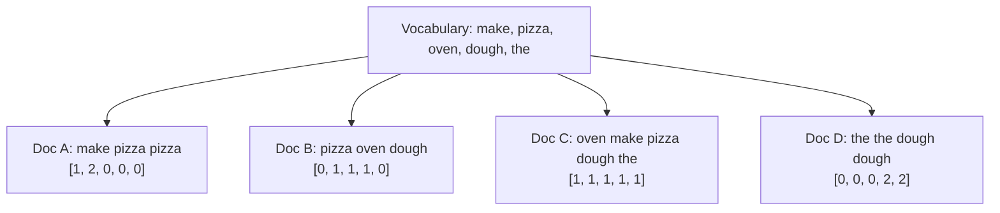

Most positions hold zeros for most documents, which is exactly why these are called **sparse vectors**. With a realistic vocabulary of tens of thousands of words, a short document has a handful of non-zero counts and a long tail of zeros. In the example the vectors look dense only because the vocabulary was shrunk to five words to keep it readable.

The prompt itself also becomes a vector over the same vocabulary: "make pizza oven" is [1, 1, 1, 0, 0]. Now both sides are in the same representation, and comparing them is a matter of matching positions.

## 4. The term-document matrix and the inverted index

To prepare the knowledge base for retrieval, a sparse vector is generated for each document. All of these vectors can be arranged in a grid, which is referred to as a **term-document matrix**: each column is a different document and each row is a different word. This is exactly the grid built at the end of Section 3, repeated here so it stands alone:

| Word | Doc A | Doc B | Doc C | Doc D |
|------|-------|-------|-------|-------|
| make | 1 | 0 | 1 | 0 |
| pizza | 2 | 1 | 1 | 0 |
| oven | 0 | 1 | 1 | 0 |
| dough | 0 | 1 | 1 | 2 |
| the | 0 | 0 | 1 | 2 |

This structure is also sometimes called an **inverted index**, because it makes it easy to start from a word and find every document that contains it. It is inverted because normally you start from a document and think of which words it contains, but here you start from a word and find which documents include that word.

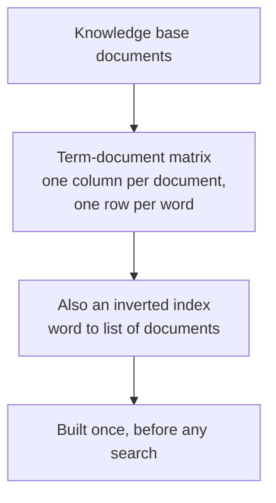

The key property of the inverted index is that it can be created once prior to processing any search. Building it is a one-time indexing cost, and afterwards every query can be answered by looking up rows instead of re-reading documents. To process the keyword "make", you take just its row, which already lists the documents in which it appears (Doc A and Doc C) and the count in each, without scanning any full text.

## 5. Scoring: the simplest approach

Before scoring, it is worth being explicit about *why* scoring is needed at all. The inverted index answers a yes/no question on the level of a single word: it can tell you quickly which documents contain "make" and which contain "pizza". But the prompt has three keywords, and a document can share one, two, or all three of them. Many documents will share keywords with the prompt, so "contains a keyword" is not enough to pick the best ones. The retriever needs to turn those yes/no facts into an ordering, which is what a score does: each document gets a number measuring how strongly it matches the prompt, and the documents with the highest numbers are retrieved. The rest of this article is about how that number gets better and better.

When a prompt is sent to the retriever, a sparse vector is quickly generated for it. For the running example, the prompt "make pizza oven" has three keywords: make, pizza, and oven. Now that each document and the prompt have a sparse vector, you are ready to start scoring and ranking.

The simplest approach is to award documents points when they contain words in the prompt. Start with the first keyword "make", find its row in the index, go across that row, and award one point to every document that contains at least one copy of the keyword. Then repeat for the other keywords.

If a document contains the keyword, it scores a point. Three keywords means the highest possible score is three. Applying this to the running example:

| Doc | make | pizza | oven | Total |
|-----|------|-------|------|-------|
| A | 1 | 1 | 0 | 2 |
| B | 0 | 1 | 1 | 2 |
| C | 1 | 1 | 1 | 3 |
| D | 0 | 0 | 0 | 0 |

Doc C is the obvious winner with a perfect three out of three: it is the only document containing all three keywords. Docs A and B tie at two, and Doc D gets zero because it shares no words with the prompt at all.

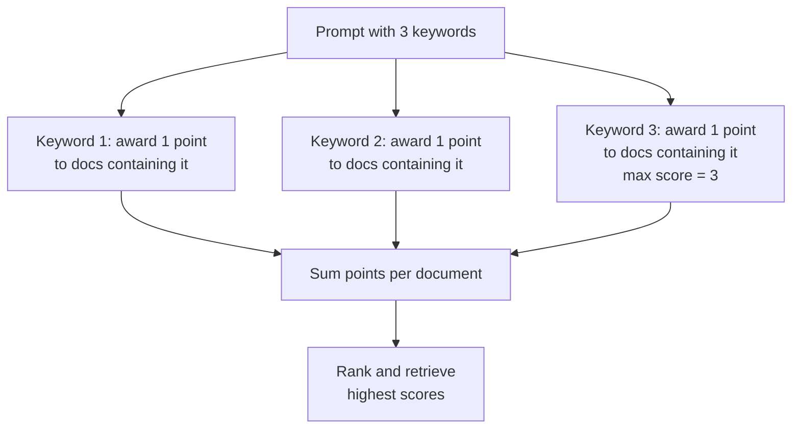

This is scoring in its purest form: presence in the prompt, presence in the document, one point each, and the totals decide the ranking.

## 6. First fix: capture how often a keyword appears

The simple scoring approach has a shortcoming: it does not capture whether a document contains keywords multiple times, which likely indicates greater relevance. A document about pizza that mentions "pizza" ten times is a better match than one that mentions it once.

A simple fix is to increase a document's score every time it contains a keyword, not just the first time. Now you can find the row of each keyword in the matrix and award each document the number of points in its column, so a document scores its full term frequency, not just a flat one.

Rerunning the example, the score is now the actual count:

| Doc | make | pizza | oven | Total |
|-----|------|-------|------|-------|
| A | 1 | 2 | 0 | 3 |
| B | 0 | 1 | 1 | 2 |
| C | 1 | 1 | 1 | 3 |
| D | 0 | 0 | 0 | 0 |

The important change is Doc A: it now ties Doc C at three, because it contains the keyword "pizza" twice while its competitor contains it once. The extra mention is treated as real evidence of relevance.

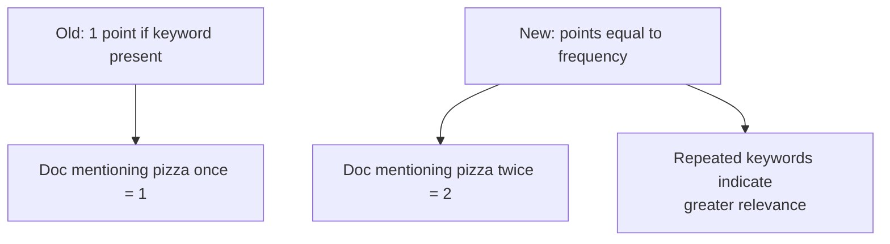

Counting occurrences captures how central the keyword is to the document, which is stronger evidence than mere presence.

## 7. Second fix: normalize by document length

Counting occurrences introduces a new problem: longer documents may contain the keywords many times simply because they are longer. A 10,000-word document is likely to use the word "pizza" more often than a 200-word recipe, even if the recipe is exactly on topic.

To correct for this, you can divide each document's score by the number of words in that document. This normalized score levels the playing field: it rewards documents in which keywords make up a greater share of the total text, and de-emphasizes long documents that contain many keywords only because they are so long.

In the running example, the documents have lengths 3, 3, 5, and 4 (the number of words in Doc A, B, C, D). Dividing each raw score (3, 2, 3, 0) by its length:

| Doc | Raw score | Length | Normalized score |
|-----|-----------|--------|------------------|
| A | 3 | 3 | 1.00 |
| B | 2 | 3 | 0.67 |
| C | 3 | 5 | 0.60 |
| D | 0 | 4 | 0.00 |

Doc A now stands alone at the top. Doc C earned the same raw three points as Doc A, but it spent those points across a five-word document, so its keywords make up a smaller share of its text. The normalization pulls it below Doc A.

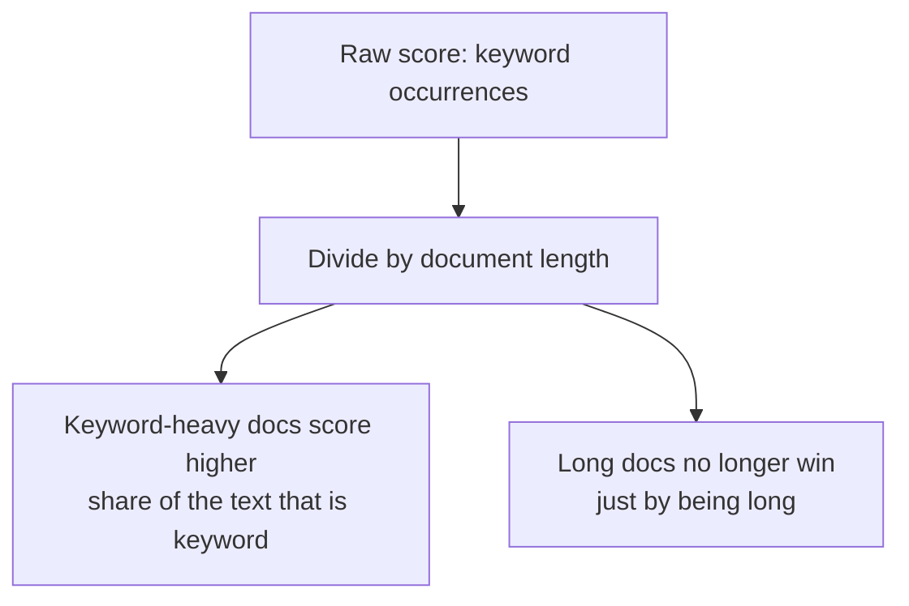

Dividing by length changes the question from "how many keywords?" to "what fraction of the text are keywords?", which is far closer to how a human judges relevance.

## 8. Third fix: weigh rare words with IDF (and get TF-IDF)

The normalized approach is pretty good, but it awards points for all keywords equally, whether they are filler words like "the" or informative words like "oven", whose presence is a much better indication of relevance. A document using the word "oven" is telling you a lot; a document using the word "the" tells you nothing.

To correct for this you can weight terms using a measure called **inverse document frequency**, or **IDF**. For each word in the system's vocabulary, you count how many documents it appears in, then divide by the total number of documents. If your knowledge base has 100 documents and the word "pizza" appears in five of them, it has a document frequency of 5/100, or 0.05. A common word like "the" might appear in all 100 documents, giving a document frequency of 100/100, or 1.

Since you want to reward rare words, you flip the fraction upside down, or invert it, and then take the logarithm so that rare words are rewarded but not to an extreme. The result is an IDF value for each word that captures how rare it is across the knowledge base.

Working through it on the running example (N = 4 documents), first count how many documents contain each word (document frequency, df):

| Word | Appears in | df | IDF = N/df | ln(IDF) |
|------|-----------|-----|-----------|---------|
| make | A, C | 2 | 2.0 | 0.69 |
| pizza | A, B, C | 3 | 1.33 | 0.29 |
| oven | B, C | 2 | 2.0 | 0.69 |
| dough | B, C, D | 3 | 1.33 | 0.29 |
| the | C, D | 2 | 2.0 | 0.69 |

"make" and "oven" appear in only two of the four documents, so they are treated as rarer and more informative, carrying a weight of 0.69. "pizza" appears in three of four, so it is common and carries only 0.29. These weights are called the **IDF** of each word.

To use these weights in scoring, first the values in the inverted index are updated, multiplying the numbers in each row by that word's IDF. The resultant matrix is a **term-frequency inverse-document-frequency matrix**, or **TF-IDF matrix**.

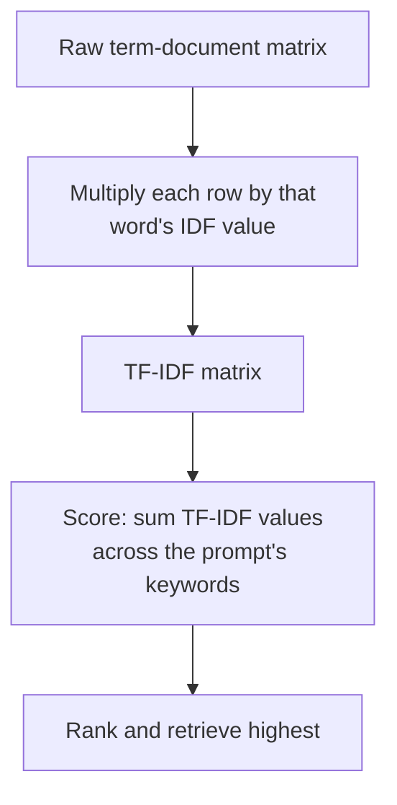

To score documents, you use the same approach as before: for each keyword in the prompt, go across its row and award each document the TF-IDF score it has in that row. For the prompt "make pizza oven":

| Doc | make (0.69) | pizza (0.29) | oven (0.69) | TF-IDF total |
|-----|------------|--------------|-------------|--------------|
| A | 0.69 | 2 x 0.29 = 0.58 | 0 | 1.27 |
| B | 0 | 0.29 | 0.69 | 0.98 |
| C | 0.69 | 0.29 | 0.69 | 1.67 |
| D | 0 | 0 | 0 | 0.00 |

Doc C wins by the largest gap yet. Its edge comes entirely from rarity: it contains both "make" and "oven", the two rare keywords, while Doc A contains only one of them plus lots of copies of the common word "pizza". Rare words are worth more, and that is what lets Doc C pull far ahead.

The TF-IDF scores produced by this approach are a standard baseline for the performance of keyword retrieval. The highest-scoring documents will frequently use the keywords, and in particular will feature many keywords that are rare across the entire knowledge base.

## 9. From TF-IDF to BM25

While TF-IDF remains a classic keyword search algorithm, the algorithm used in most retrievers is called **Best Matching 25**, or BM25. It is called that because it was the 25th variant in a series of scoring functions proposed by its creators. BM25 makes a few improvements upon TF-IDF.

The BM25 formula generates a relevance score for a single keyword for a particular document. Summing these scores across all keywords generates a total relevance score for a single document, which can then be used for ranking. The scoring works very similarly to TF-IDF, with a few key additions.

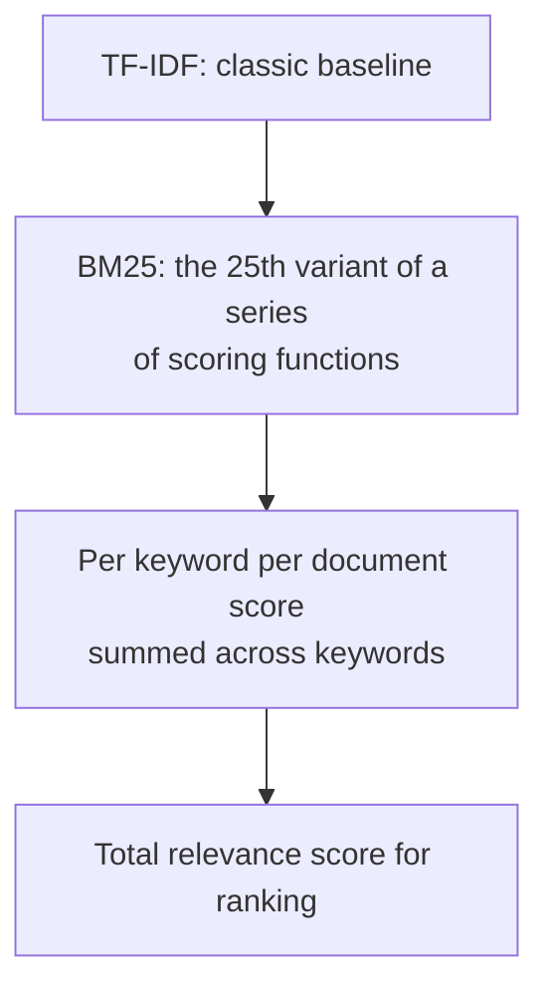

BM25 does not abandon the ideas behind TF-IDF. It refines three specific behaviors, and each refinement exists to fix a TF-IDF quirk.

## 10. BM25 refinement 1: term frequency saturation

First, documents score diminishing returns as they include more instances of a keyword. The idea is that a document that includes the keyword "pizza" twenty times is not actually twice as relevant as one that includes it ten times. After a certain point, additional mentions add very little evidence.

This behavior of discounting additional instances of a keyword is referred to as **term frequency saturation**. TF-IDF rewarded every occurrence linearly; BM25 recognizes that the first occurrences mean the most.

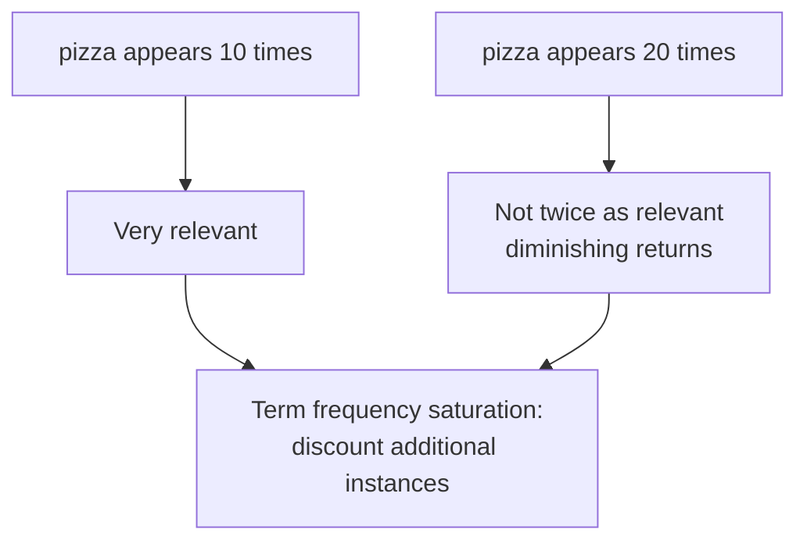

The effect shows up clearly in the running example. Using the common default parameters k1 = 1.2 and b = 0.75, with an average document length of (3 + 3 + 5 + 4) / 4 = 3.75, the BM25 scores for the prompt "make pizza oven" are:

| Doc | make | pizza | oven | BM25 total |
|-----|------|-------|------|------------|
| A | 0.75 | 0.42 | 0 | 1.17 |
| B | 0 | 0.31 | 0.75 | 1.06 |
| C | 0.61 | 0.25 | 0.61 | 1.47 |
| D | 0 | 0 | 0 | 0.00 |

Look at the "pizza" column. Doc A contains "pizza" twice, Doc B contains it once, yet A scores 0.42 and B scores 0.31: the second copy adds only 0.11. If scoring were linear (TF-IDF style), the second copy would add the full 0.31 again. Saturation keeps the first mention dominant.

## 11. BM25 refinement 2: softer document length normalization

Second, longer documents are still penalized, as they are in TF-IDF, but in BM25 these penalties are also diminishing. Penalizing long documents is important, but TF-IDF can do so too aggressively, in a way that overly discounts longer documents.

BM25 applies diminishing additional penalties as documents grow in length. The result is that long documents still score highly as long as they have a fairly high frequency of the keywords. This process of adjusting scores based on document length is called **document length normalization**.

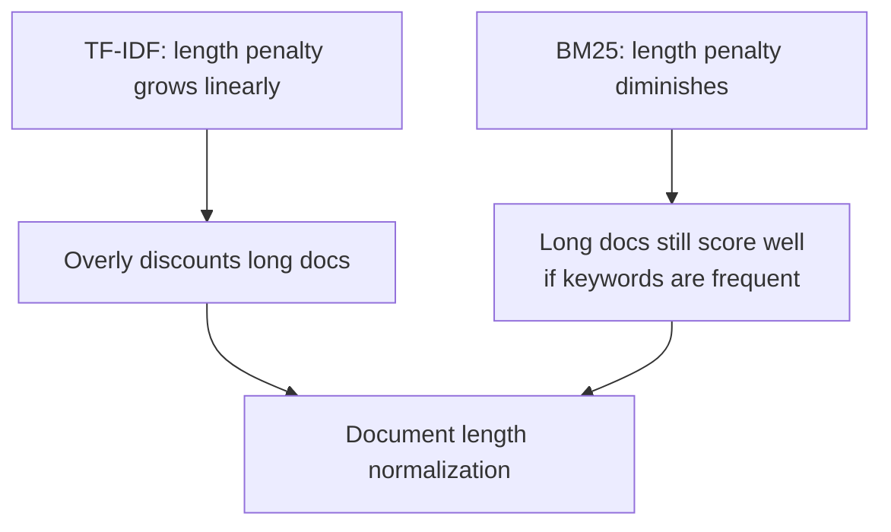

The running example shows the softer penalty in action. Doc C is the longest document at five words, while Doc A is three. Under the pure TF-IDF normalization of Section 7, Doc A beat Doc C because it divided by length. Under BM25, Doc C still comes out on top, because its length penalty is milder: the length factor softens, not cancels, the effect, so a longer document with all three keywords remains the winner.

## 12. BM25 refinement 3: two tunable hyperparameters

BM25 also differs from TF-IDF in that it includes two tunable hyperparameters, called **k1** and **b** in the standard formulation. These allow you to control the degree of term frequency saturation and document length normalization, or in other words, how rapidly documents stop being rewarded for repeated keywords and penalized for increased length.

In a production retriever, you would tune these hyperparameters to land on an overall scoring system that best fits the data in your knowledge base. Different collections have different vocabulary distributions, so the right amount of saturation and length normalization depends on the corpus.

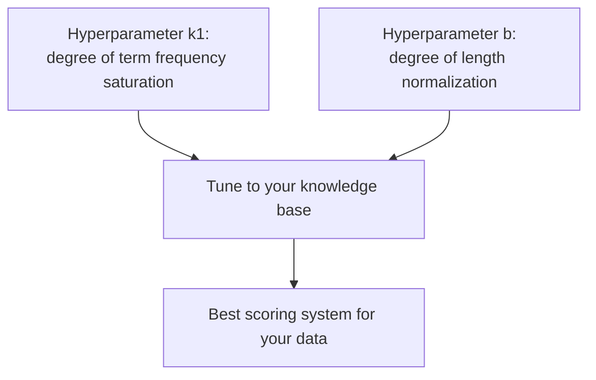

In the running example, k1 = 1.2 and b = 0.75 produced the ranking Doc C > Doc A > Doc B > Doc D. Those defaults are not the only valid choice. A higher k1 would slow saturation, so a document like Doc A with a repeated keyword ("pizza") would climb relative to Doc C. A lower k1 would speed saturation up and drive Doc A down again. Similarly, a higher b would strengthen the length penalty and hurt the long Doc C, while a lower b would help it. In production you would tune both against your own knowledge base until the ranking matches what you consider relevant.

## 13. Why BM25 is the standard

In a production retriever, the standard keyword search algorithm is BM25. It tends to:

- **Perform significantly better** than TF-IDF at finding relevant documents.
- Be **roughly equivalent** to TF-IDF in the computational resources it requires, so the gains cost nothing extra.
- Be **much more flexible**, because its hyperparameters can be tuned to your dataset.

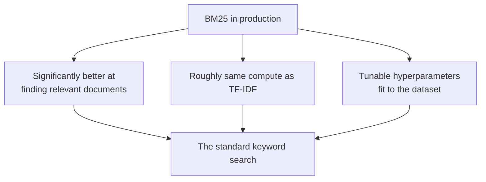

BM25 is the most commonly used keyword search algorithm and has withstood the test of time for decades since its invention. It strikes a good balance between complexity and performance in real-world applications, which is why TF-IDF is the classic baseline and BM25 is the production choice.

## 14. The strengths of keyword search

The core idea of keyword search is that you match documents to prompts based on how frequently keywords from the prompt appear in each document. As part of this process, prompts and documents are converted to sparse vectors that count how often each word in the vocabulary appears, and TF-IDF or BM25 are just different approaches for processing these sparse vectors to score and then rank documents, accounting for keyword rarity, term frequency, and document length.

Its primary strength is **simplicity**. It is a relatively straightforward approach that works well in practice, often performing quite well on its own and frequently setting a competitive benchmark that more advanced techniques may struggle to surpass. Keyword search is the baseline the fancier techniques have to beat.

It also **guarantees that retrieved documents contain the keywords from the user's prompt**. Especially when you expect users to use technical terminology or exact product names, this kind of exact keyword matching is particularly important. If the user asks about a product by name, a retriever that cannot force that name to appear has failed.

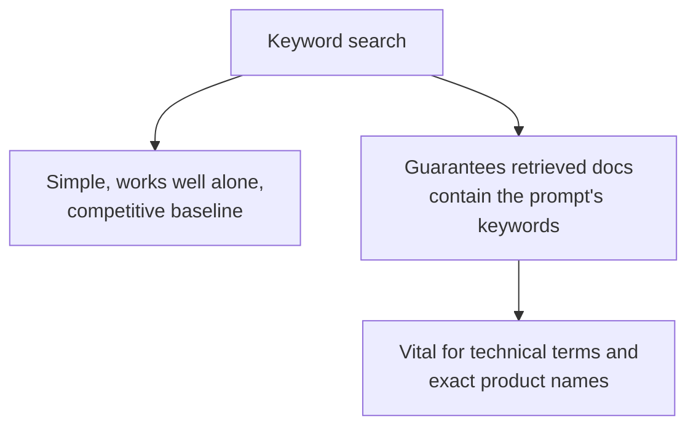

These strengths are what keep keyword search inside modern RAG pipelines: it is cheap, reliable, and unforgiving about exact wording, all of which a retriever needs.

## 15. The weakness: meaning without matching words

Despite its strengths, keyword search has a fundamental weakness: it depends on the query containing keywords that exactly match the words in the document. If a user sends a prompt that has a similar meaning to a document but just does not include the right words, keyword search will not be able to find that match.

A user asking "how do I immigrate to Canada?" will not match an article about "moving to Canada permanently" if the words do not overlap. The retriever translates meaning reliably only when the vocabulary is shared.

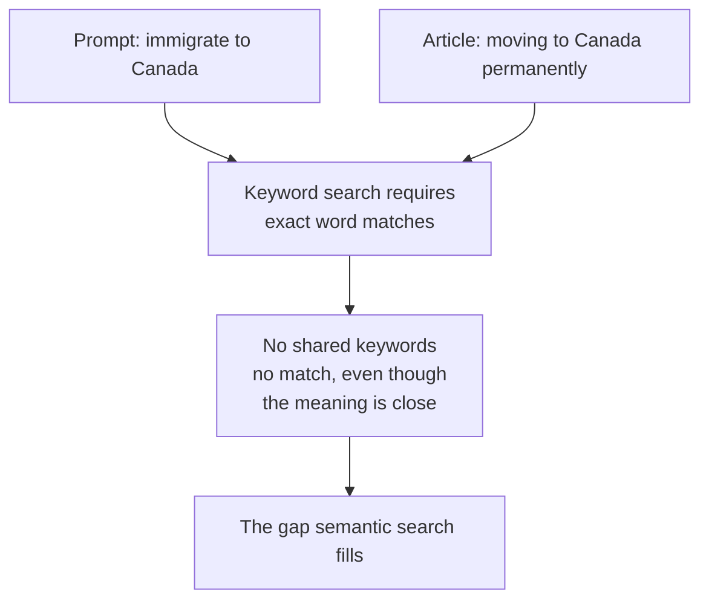

This gap, a similar meaning that shares no words, is exactly the problem the next technique in the module addresses, and together they form the complement that [hybrid search](./hybrid-search.md) combines into a single ranking.

## 16. Summary

Keyword search answers the first and most basic retrieval question: are the documents and the prompt about the same topic, judged by shared vocabulary? Texts become bags of words, then sparse vectors counting every occurrence, arranged into a term-document matrix or inverted index built once before any query. Scoring starts by counting keyword presence, then occurrence frequency, then a length normalization, and finally a rarity weighting via IDF, producing the classic TF-IDF baseline. Modern retrievers use BM25 instead, which adds term frequency saturation, softer document length normalization, and two tunable hyperparameters. BM25 performs better than TF-IDF at equal compute cost and is flexible enough to be tuned to any knowledge base. The strengths of keyword search are real: simplicity, a strong standalone baseline, and a guarantee that retrieved documents literally contain the user's words, which matters for technical terminology and product names. Its weakness is equally real: it is blind to meaning, so a prompt and a document that agree on topic but disagree on vocabulary will not match, which is precisely the problem semantic search sets out to solve.

## Sources

- DeepLearning.AI, Building and Evaluating Advanced RAG course, module on the retriever. This article documents the supplied lecture transcripts on keyword search. The bag-of-words framing, sparse vectors, term-document matrix and inverted index, the step-by-step scoring evolution (presence, frequency, length normalization, IDF, TF-IDF), the BM25 refinements, and the enumerated strengths and weaknesses all come from the transcripts.
- Robertson, S., and Zaragoza, H. (2009). *The Probabilistic Relevance Framework: BM25 and Beyond*. Foundation and Trends in Information Retrieval. Canonical source for the BM25 scoring function and its k1 and b hyperparameters. https://dl.acm.org/doi/10.1561/1500000019
- Companion architecture article from the same module: [Hybrid Search](./hybrid-search.md), which positions keyword search alongside semantic search and metadata filtering in the retriever pipeline, and the prior [Metadata Filtering](./metadata-filtering.md) deep dive.
- Companion retriever overview: [The Retriever: How RAG Finds the Right Documents](./retriever.md).