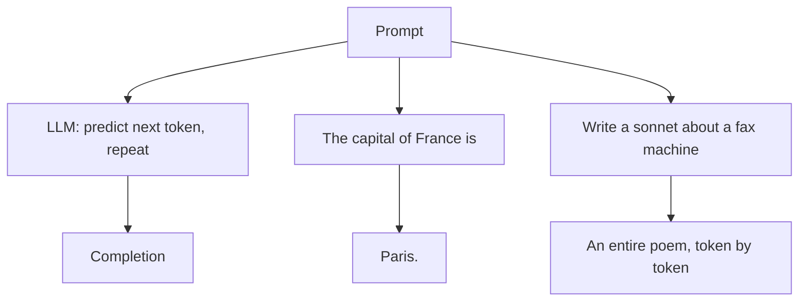
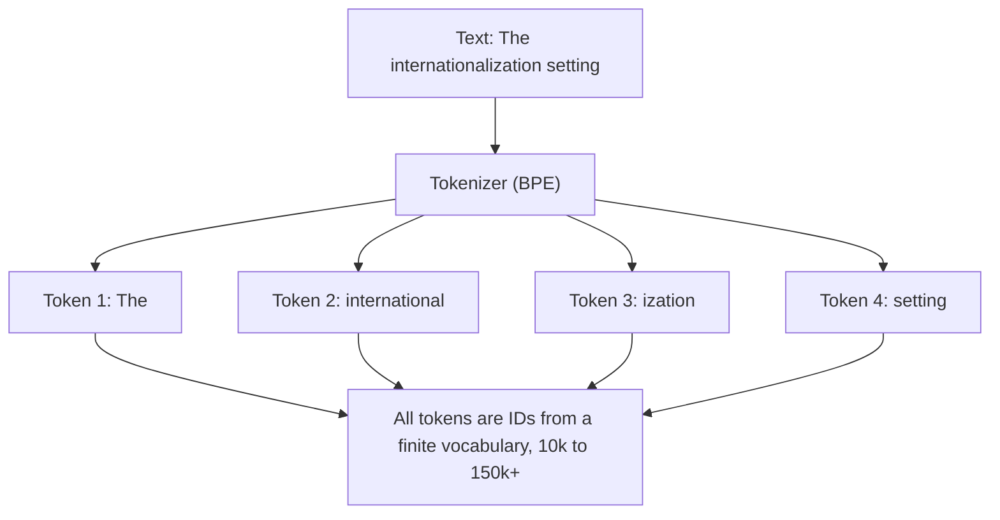
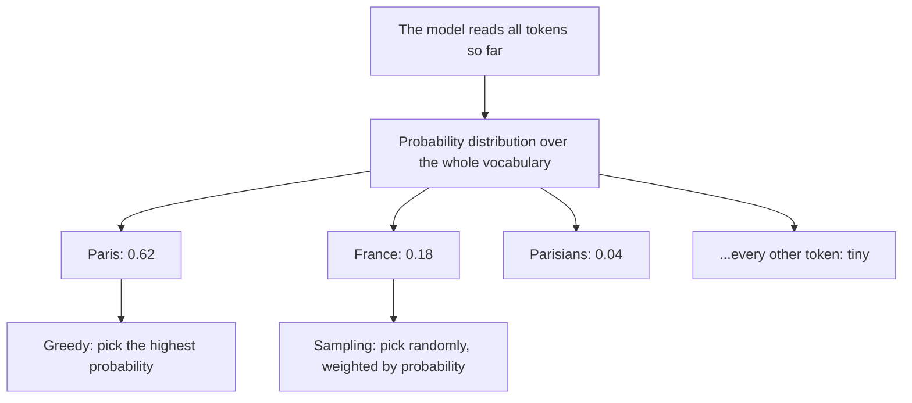
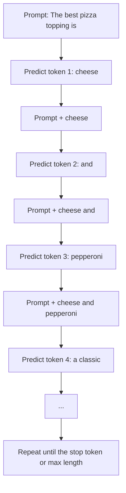
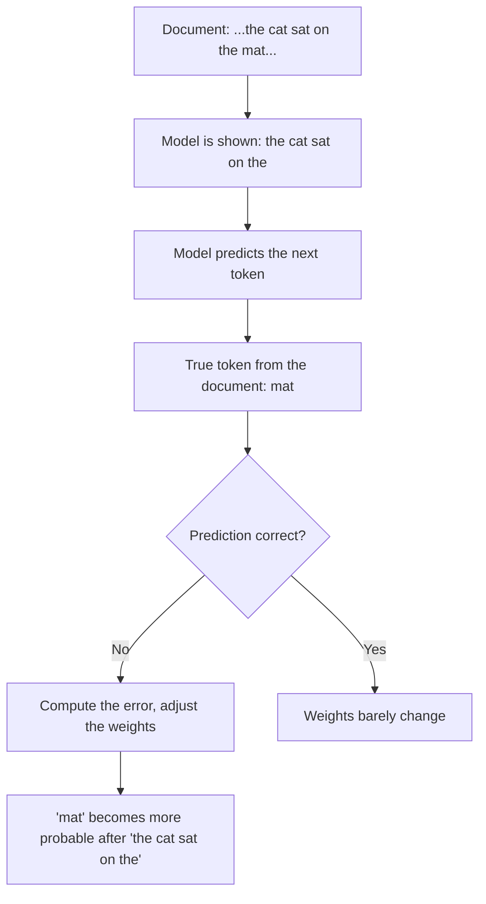
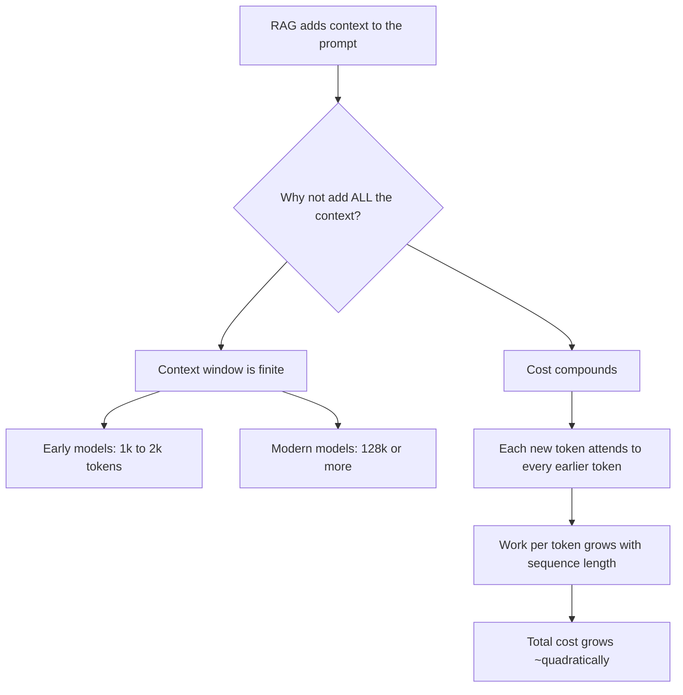
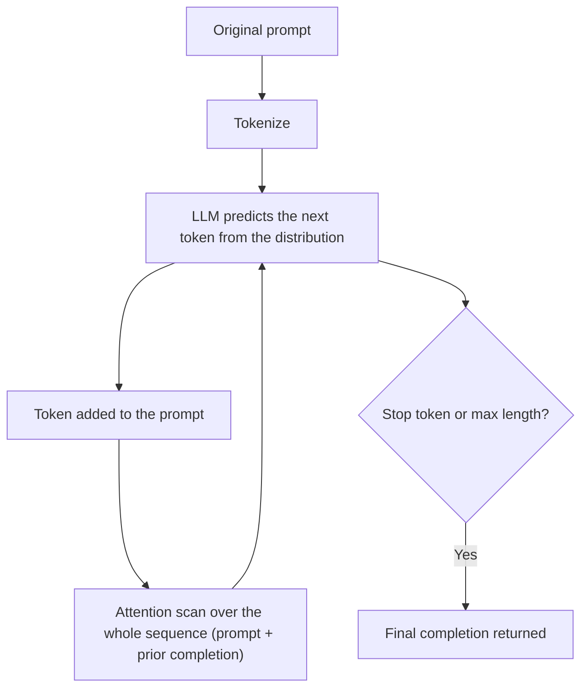

# LLM Completions

## TL;DR

- **A completion is the final text an LLM returns for a prompt.** It is the whole generated response, produced token by token, and it is what every API returns (`choices[0].text` in `/v1/completions`, `choices[0].message.content` in `/v1/chat/completions`).
- **Completion vs. the tokens in between: they are not the same thing.** During generation the model repeatedly predicts a next token, appends it to the sequence, and predicts again. Those intermediate sequences are the working mechanism, not completions. A *completion* exists only when generation stops (an end-of-sequence token is picked or a max length is hit), and it is the accumulated result the API hands back.
- **The model has no concept of truth.** At each step it produces a probability distribution over a finite token vocabulary (roughly 10k to 150k+ tokens) and picks the next likely one. "Paris" for "The capital of France is" is a probable continuation, not a verified fact.
- **Generation is autoregressive and self-influencing.** Every predicted token is added to the prompt, and the next prediction conditions on the entire sequence including previously generated tokens.
- **Training sets those probabilities.** The model is shown incomplete text, predicts the next token, compares against the true next token, and adjusts its weights to make the correct token more probable. Confidence never meant verification, which is why hallucination happens.
- **Context is finite and costly.** RAG adds context through the prompt, but you cannot add unlimited amounts: the context window is bounded (early models ~1k to 2k tokens), and every new token requires an attention scan over the whole sequence, so cost grows roughly quadratically with prompt length.

## 1. What is a completion

A **completion** is the text the LLM produces in response to an input. The input is the **prompt**; the output is the **completion**.

The HTTP APIs of the major providers make this name literal. OpenAI's original `/v1/completions` endpoint takes a `prompt` string and returns the continuation in `choices[0].text` ([OpenAI completions API reference](https://platform.openai.com/docs/api-reference/completions)). The endpoint that powers almost every modern chatbot, `/v1/chat/completions`, works differently on the surface: you send a list of `messages` (system, user, assistant turns) and get back the assistant's `choices[0].message.content` ([OpenAI chat completions guide](https://platform.openai.com/docs/guides/text-generation)). Underneath, both are the same machine doing the same operation: the conversation history is the prompt, and the assistant message is its completion.

A completion can be as short as one token or as long as the model's limit. Ask "The capital of France is" and the completion may be "Paris." Ask "Write a sonnet about a fax machine" and the completion is a whole poem. Same mechanism, larger output.

The key property of a completion is that it is entirely conditioned on what came before it. There is no uploading of a separate plan, no parallel drafting. Everything after the first token exists because the tokens before it made it likely.

## 2. Tokens: the finite dictionary the model works with

An LLM does not see characters or words. Before anything reaches the network, the text is converted into a sequence of integer IDs called **tokens** by a **tokenizer**.

The model's vocabulary is finite and fixed. GPT-2 used 50,257 tokens ([Radford et al., 2019](https://openai.com/research/language-unsupervised)), GPT-3 kept 50,257 ([Brown et al., 2020](https://arxiv.org/abs/2005.14165)), LLaMA used 32,000 ([Touvron et al., 2023](https://arxiv.org/abs/2302.13971)), and newer models such as LLaMA 3 push past 128,000. Ten thousand to a hundred thousand plus, as rough orders of magnitude. Every word, punctuation mark, number and language the model handles must be representable in that fixed list.

Tokens are sub-word units, usually built with **byte pair encoding (BPE)**, a compression-style algorithm that starts from single characters and repeatedly merges the most frequent neighboring pair ([Sennrich et al., 2016](https://arxiv.org/abs/1508.07909), [Hugging Face tokenizer summary](https://huggingface.co/docs/transformers/en/tokenizer_summary)). The result is that common words become a single token, while rare or compound words are split into pieces. "The" is likely one token. "Internationalization" has no single token in most vocabularies, so it becomes several pieces, roughly "international" and "ization". This is how a model forms compound and unseen words: it does not invent new dictionary entries, it combines the finite pieces it already has.

Tokenizers are trained on the kind of data they must encode, so different data types use different converters. Text uses BPE and SentencePiece ([Kudo and Richardson, 2018](https://arxiv.org/abs/1808.06226)). Images are cut into patches that act as tokens, the trick at the heart of the Vision Transformer ([Dosovitskiy et al., 2020](https://arxiv.org/abs/2010.11929)). Audio is compressed into discrete code tokens, as in the EnCodec model that powers music generation over tokens ([Défossez et al., 2022](https://arxiv.org/abs/2210.13438), [MusicLM](https://arxiv.org/abs/2301.11325)). Whatever the modality, the invariant is the same: the model consumes a finite alphabet of token IDs, and everything else is a problem of choosing which token comes next.

## 3. No truth, only probability

Here is the property that surprises everyone: **the model has no concept of truth.**

At every step, the model produces a probability distribution over the entire vocabulary: for each of its hundred thousand or more tokens, a number saying how likely that token is to come next, given every token that came before. It then selects a token according to that distribution. Greedy decoding picks the most probable token. Sampling makes the choice random but weighted, so probable tokens are still common, with a temperature parameter controlling how flat and random the distribution becomes ([Hugging Face generation strategies guide](https://huggingface.co/docs/transformers/en/generation_strategies)).

The intuition gap is the important part. A human chooses a word because it is *true* or because it matches the *intent* of the sentence, and we can tell the difference between a sentence that is true and one that merely sounds right. The model has access to nothing like that. It was only ever trained on how tokens follow tokens. "Paris" wins for "The capital of France is" not because the model verified a fact, but because that continuation has an enormous probability in the distribution it learned from documents.

Because only probability dictates the choice, **there are many potential completions for any prompt**. "The capital of France is" could continue as "Paris." but also as "one of the most visited cities in the world." depending on which token wins each draw. A code prompt like `def add(a, b):` continues most plausibly as `return a + b`, but nothing stops the distribution from producing a longer, more defensive body. This is why the same prompt can give different answers across calls, and why the model is a generator, not a database ([RAG, why the LLM is not a database](./rag.mdx)).

This is also the answer to "why does it sometimes refuse and other times comply" not because it changed its mind, but because the distribution, across all the prompt's conditioning, shifted. Truth never entered the decision.

## 4. Autoregression and self-influence

The model generates one token at a time, in a loop. This is called **autoregressive** generation: the model's own previous outputs become part of its input for the next step.

The loop looks like this. Start with the prompt. Predict token 1 and append it. Now feed prompt plus token 1 back in. Predict token 2 and append. Repeat until the model produces a special end-of-sequence token, or until the configured maximum length stops it. The Keras/Transformers summary of GPT's decoder makes the mechanism precise: with attention masking, each position can only attend to the tokens before it, so token *n* is produced using tokens 0 through *n-1* ([Alammar, The Illustrated GPT-2](https://jalammar.github.io/illustrated-gpt2/)).

The self-influence part is the subtle consequence. Because the model's input at step *n* contains the token it generated at step *n-1*, the machine shapes its own future. One slightly unlucky early token can change everything downstream, for good or for bad. A single misspelled or wrongly chosen word in the middle of a long completion nudges every following prediction. This is also why you cannot "fix" the middle of an answer without regenerating everything after it. The completion is one long causal chain, not a set of independent sentences.

Industry implementations lean on this same property in a storage trick called the **KV cache**. Because token *n* reads every earlier token, the provider caches the computed keys and values of the early tokens so they do not need to be recomputed, and the cache grows with the sequence length ([PagedAttention, SOSP 2023](https://arxiv.org/abs/2309.06180)). Autoregression is not only a conceptual description, it is a concrete cost structure the hosting platform must manage per token.

## 5. Training: how the probabilities get set

The probabilities in the distribution are not handed to the model. They are learned, and the learning task is the same task the model performs at inference: predict the next token.

During training, the model is fed real documents, one token at a time. For each position it is shown the tokens that came before, asked to predict the next token, and then **revealed the true next token** from the document. The difference between its guess and the truth becomes the error. The weights of the network are nudged so that the true token becomes more probable under that context, in the standard next-token objective called cross-entropy loss described in the GPT-2 and GPT-3 papers ([Radford et al., 2019](https://openai.com/research/language-unsupervised), [Brown et al., 2020](https://arxiv.org/abs/2005.14165)).

The terse version of the recipe, from the GPT-2 paper: "we trained... to predict the next token using a standard language modeling objective." No labels saying "this is true" or "this is a fact", just millions of text fragments where the correct answer is simply whatever the text actually continues with. From that humble task, the model develops the ability to imitate reasoning, code, style and encyclopedic memory, because all of it shows up as next-token statistics. The knowledge that lives in the weights is compressed statistics about token sequences, not facts ([Lewis et al., 2020](https://arxiv.org/abs/2005.11401)).

This is why the model's confidence has nothing to do with reality. During training, "the most likely token" and "the true token" almost always coincide, because the training data is legal, factual text. But at inference, the most likely token can be wrong, and the model had no signal to distinguish. That gap is where hallucinations are born, which is the next section.

## 6. Hallucination: when probability beats truth

When the distribution picks an improbable or wrong token, and the sentence still reads with full confidence, you get a **hallucination**: an output that is confidently stated and factually wrong. It is not a random malfunction. It is the trained behavior firing as designed, pattern completion without verification, because the model cannot tell the difference between a correct fact and a fact-shaped string of tokens ([AI Agent Hallucination](./agent-hallucination.mdx), [Ji et al., 2023](https://arxiv.org/abs/2202.03629)).

A concrete example: a procurement assistant is asked for the vendor contract's signature date. The data does not contain the date. The most probable continuation of the prompt, conditioned on everything the assistant has seen, is a plausible date, so it writes one with authority, and now a team schedules around a deadline that never existed. Nothing in the training made "write nothing" more probable than "invent a date", because inventing was never labeled as an error, only predicting the wrong token during training was.

The practical consequence: a completion must be treated as a highly skilled guess. When correctness matters, the output needs grounding and verification rather than acceptance on the model's assurance.

## 7. Context, compute and cost: the price of every token

RAG works by inserting retrieved documents into the prompt, so the model generates answers conditioned on context instead of memory ([RAG, adding context via the prompt](./rag.mdx)). The reasonable question follows immediately: if context is so useful, why not stuff in everything we have?

There are two hard reasons.

**Reason 1: the context window is finite.** The model can only attend to a fixed window of tokens. Early models were severely limited, GPT-2 at 1024 tokens and GPT-3 at 2048 ([Brown et al., 2020](https://arxiv.org/abs/2005.14165)). Modern flagship models raise the ceiling into the hundreds of thousands, LLaMA 3.1 supports 128K with RoPE long-context ([Grattafiori et al., 2024](https://arxiv.org/abs/2407.21783)), but finite it remains. Past the window, tokens are simply not seen.

**Reason 2: every token is expensive to process, and the cost compounds.** Before the model can generate a new token, it must run attention across the entire sequence so far, the whole prompt *and* all previously generated completion tokens. This is the self-attention mechanism at the core of the transformer ([Vaswani et al., 2017](https://arxiv.org/abs/1706.03762); the mechanism is explained accessibly in [The Illustrated Transformer](https://jalammar.github.io/illustrated-transformer/)).

Because attention touches every earlier token, the work for token *n* grows with *n*, which makes total cost grow quadratically with the sequence length, the O(n^2) scaling noted in the original transformer paper. A long prompt makes each of its many output tokens slower, and a bigger context eats more memory in the KV cache ([PagedAttention, SOSP 2023](https://arxiv.org/abs/2309.06180)). Your input token count is billed, but the hidden cost is sharper: the more context you add, the more computing each generated word needs.

This is the tension every RAG design lives in. More context makes answers more grounded, but every extra sentence slows generation, inflates memory, and raises cost. The engineering answer is not "maximal context", it is selective retrieval: include only the passages most relevant to the question and leave the rest out. Reading a good chunk of the right file beats reading every file ([RAG, keeping the prompt lean](./rag.mdx)).

## 8. What a completion means for how you use LLMs

Zooming out, everything useful about working with LLMs falls out of the completion model.

- **Treat the model as a continuator, not an oracle.** It never checks anything. Its output is a next-token guess, so verify anything that matters and give it tools and context that supply the truth ([RAG](./rag.mdx), [AI Agent Hallucination](./agent-hallucination.mdx)).
- **Manage the chain of self-influence.** The completion is one long causal sequence. A precise, well-formed prompt steers the early tokens, and the early tokens steer everything after them.
- **Keep context lean.** Every token you add increases per-token compute and memory, and total cost grows roughly quadratically. Retrieve selectively, not maximally.
- **Expect variance.** Multiple potential completions exist for any prompt, which is a feature (creativity, drafting) and a hazard (nondeterminism) depending on what you are building.

A completion is a deceptively simple core: read everything so far, score the dictionary, pick the next token, repeat. Out of that loop come fluency, memory, reasoning-like behavior, hallucinations, and your API bill. Understanding the loop tells you both why the output is usually great and where it goes wrong, and it is the single most useful mental model for working with any LLM-based system.

## 9. Summary

- A **completion** is the text an LLM produces for a prompt, generated one token at a time.
- Tokens come from a **finite vocabulary**, roughly 10k to 150k in current models, with sub-word units for compound words and dedicated tokenizers for text, images and audio.
- The model has **no concept of truth**, only a probability distribution over the next token, which is why there are many potential completions for one prompt.
- Generation is **autoregressive and self-influencing**: each token becomes part of the input for the next, so early mistakes cascade.
- Training is the same task as inference, predicting the next token against real documents and adjusting weights, which is why confidence never meant verification, and hallucination happens when the most probable token is wrong.
- RAG adds context through the prompt, but context is **finite and costly**: every new token pays for an attention scan over the whole sequence, so cost grows fast with prompt length.

### Sources

*   Ashish Vaswani et al. — [Attention Is All You Need](https://arxiv.org/abs/1706.03762), NeurIPS 2017 — introduced the transformer and self-attention, including the O(n^2) scaling of attention with sequence length.
*   Jay Alammar — [The Illustrated Transformer](https://jalammar.github.io/illustrated-transformer/) — human-readable walkthrough of attention and how tokens attend to earlier tokens.
*   Jay Alammar — [The Illustrated GPT-2](https://jalammar.github.io/illustrated-gpt2/) — the autoregressive, masked decoder loop; each token attends only to preceding tokens.
*   Alec Radford et al. — [Language Models are Unsupervised Multitask Learners (GPT-2)](https://openai.com/research/language-unsupervised), 2019 — next-token prediction objective and the 50,257-token byte-pair encoding vocabulary.
*   Tom B. Brown et al. — [Language Models are Few-Shot Learners (GPT-3)](https://arxiv.org/abs/2005.14165), 2020 — next-token training at scale, 2048-token context window, and the finding that scaling alone enables few-shot behavior.
*   Hugo Touvron et al. — [LLaMA: Open and Efficient Foundation Language Models](https://arxiv.org/abs/2302.13971), 2023 — a 32,000-token SentencePiece BPE vocabulary, an example of vocabulary size variance across models.
*   Abhimanyu Grattafiori et al. — [The Llama 3 Herd of Models](https://arxiv.org/abs/2407.21783), 2024 — 128K-token context via RoPE long context and a 128,256-token vocabulary, showing how far the frontier has pushed.
*   Rico Sennrich et al. — [Neural Machine Translation of Rare Words with Subword Units](https://arxiv.org/abs/1508.07909), 2016 — introduced byte pair encoding for splitting rare and compound words into subword tokens.
*   Taku Kudo and John Richardson — [SentencePiece](https://arxiv.org/abs/1808.06226), 2018 — a tokenizer framework trained on raw text corpora, used by many open models.
*   Hugging Face — [Summary of the tokenizers](https://huggingface.co/docs/transformers/en/tokenizer_summary) — how subword tokenization and BPE work. 
*   Hugging Face — [Generation strategies](https://huggingface.co/docs/transformers/en/generation_strategies) — greedy decoding, sampling and temperature.
*   Alexey Dosovitskiy et al. — [An Image is Worth 16x16 Words: Transformers for Image Recognition at Scale](https://arxiv.org/abs/2010.11929), 2020 — images as sequences of patch tokens, an example of a non-text tokenizer.
*   Alexandre Défossez et al. — [High Fidelity Neural Audio Compression](https://arxiv.org/abs/2210.13438), 2022 — discrete audio code tokens, another non-text tokenizer.
*   Andrea Agostinelli et al. — [MusicLM: Generating Music From Text](https://arxiv.org/abs/2301.11325), 2023 — music generated from discrete audio tokens.
*   Patrick Lewis et al. — [Retrieval-Augmented Generation for Knowledge-Intensive NLP Tasks](https://arxiv.org/abs/2005.11401), NeurIPS 2020 — the RAG pattern and why parametric memory needs external context.
*   Ziwei Ji et al. — [Survey of Hallucination in Natural Language Generation](https://arxiv.org/abs/2202.03629), 2023 — the classical taxonomy of why models generate confident falsehoods.
*   Woosuk Kwon et al. — [Efficient Memory Management for LLM Serving with PagedAttention](https://arxiv.org/abs/2309.06180), SOSP 2023 — the KV cache grows with sequence length, making every token's memory cost visible.
*   OpenAI — [Text generation guide](https://platform.openai.com/docs/guides/text-generation) and [completions API reference](https://platform.openai.com/docs/api-reference/completions) — practical naming of prompts and completions in the API.
*   Knowledge base internal — [Retrieval-Augmented Generation (RAG)](./rag.mdx) and [AI Agent Hallucination](./agent-hallucination.mdx) — the deterministic rulebook comparison, context injection and hallucination risk.