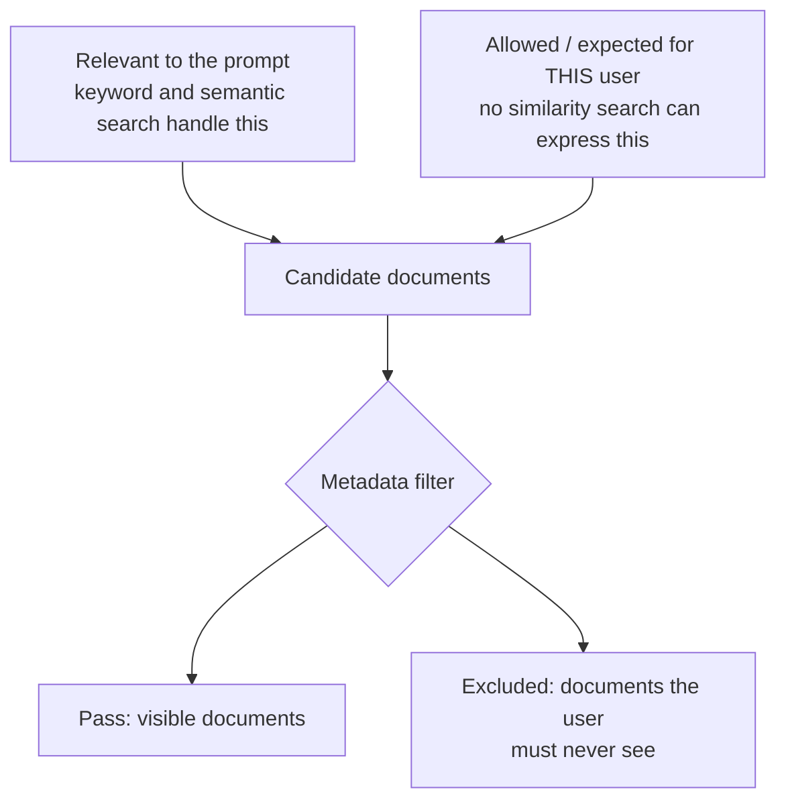
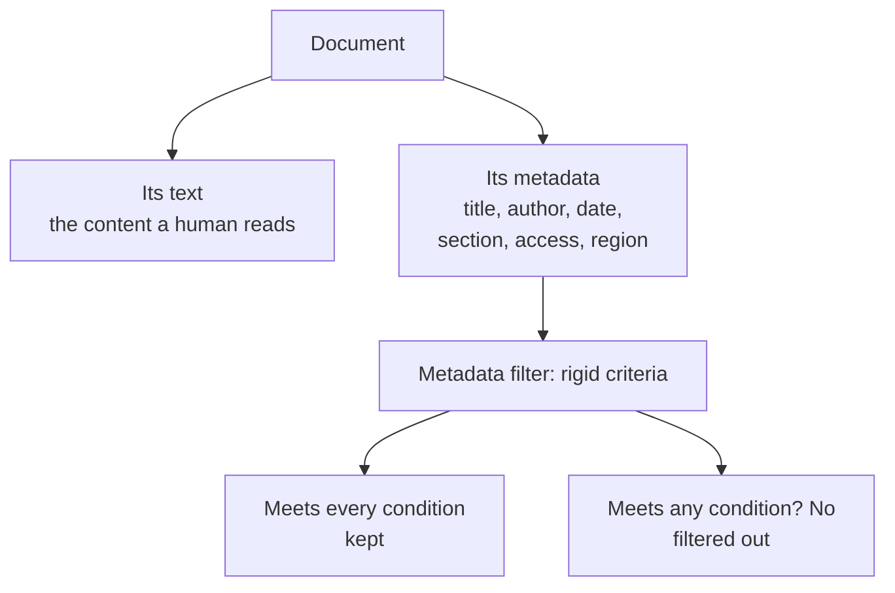
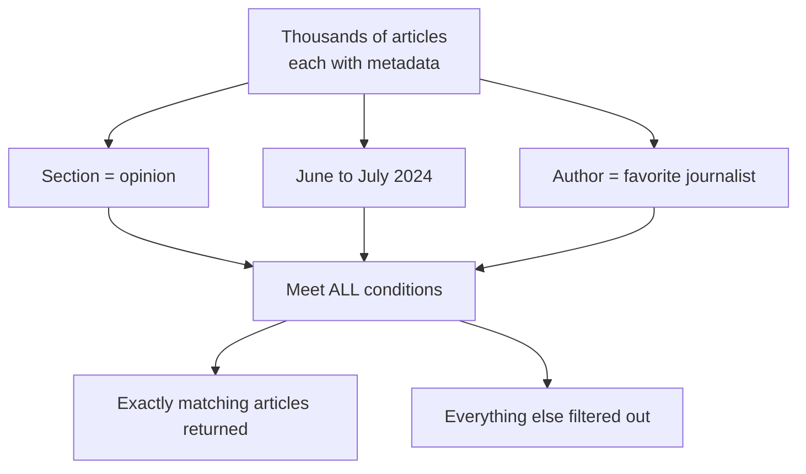
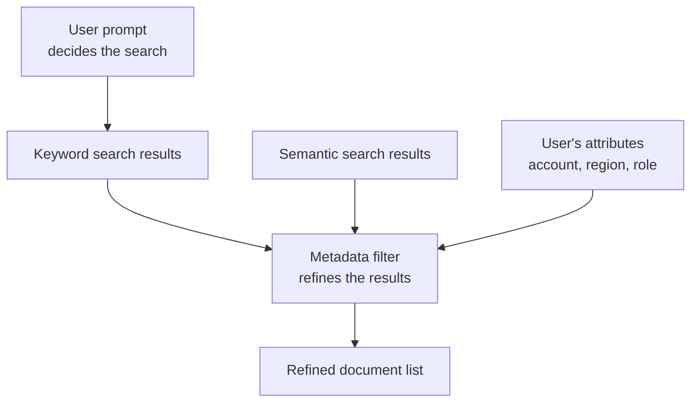
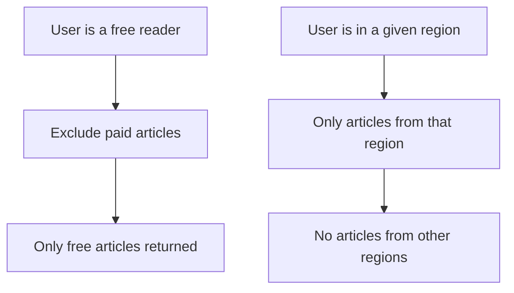
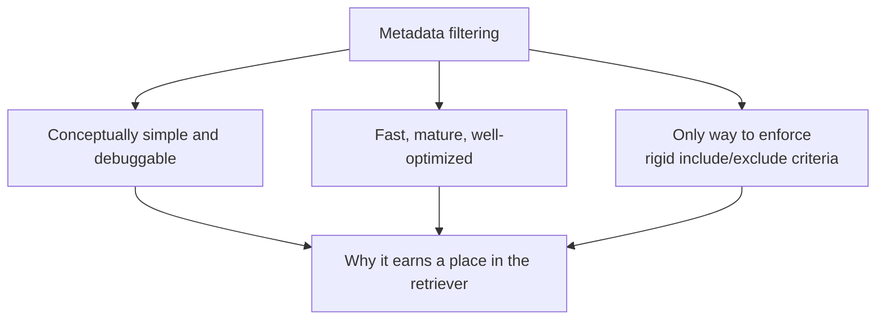
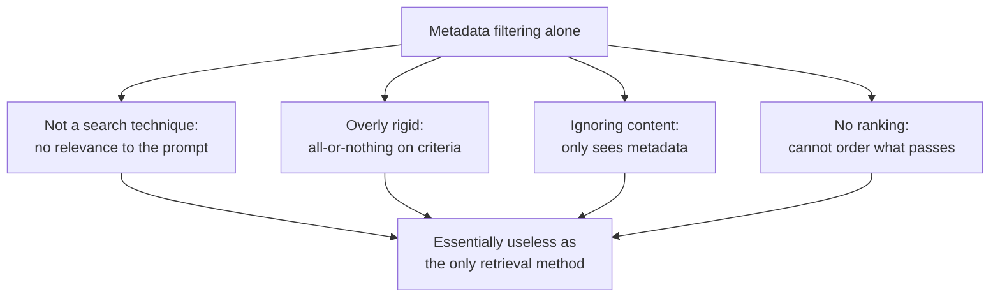

# Metadata Filtering: The Retriever's Rigid Net

## TL;DR

- **The problem:** retrievers must only surface documents a given user is allowed and expected to see (a paid article should not reach a free reader, an HR document should not reach everyone), and no similarity-based search can express a hard "must not be included" decision on its own.
- **What it is:** metadata filtering uses rigid, all-or-nothing criteria on a document's metadata (title, author, creation date, article section, access privileges, region, and so on) to narrow down what a retriever returns. The keyword is *rigid*: there is no fuzzy scoring, a document either meets every condition or it is dropped.
- **The mental model:** it is exactly a spreadsheet filter or a SQL WHERE clause. One condition gives a coarse slice (all of today's articles); stacking conditions with an AND combination gives a precise slice (opinion articles by a given author between June and July 2024), and only documents meeting every condition are returned.
- **It is not retrieval, it refines it:** inside a RAG system metadata filtering does not perform the search, it narrows down the results returned by the other techniques (keyword and semantic search), and this is its proper role, including in the hybrid pipeline.
- **Where the filters come from:** usually not from the prompt's wording but from attributes of the user making the request (signed in as a paid subscriber or not, which region they are in), detected at request time. The prompt decides what to search for; the user's attributes decide what is allowed through.
- **Advantages:** conceptually simple and easy to debug, fast/mature/well-optimized because it is a decades-old database operation, and uniquely able to enforce rigid include/exclude criteria, which is the capability neither keyword nor semantic search has.
- **Limitations:** it is not really a search technique (no concept of relevance to the prompt), it is overly rigid (no partial credit), it ignores document content entirely, and it cannot rank whatever passes the filter. A retriever built exclusively on metadata filtering would be essentially useless.
- **Bottom line:** use it as a refinement stage paired with content-based search, never as the retrieval technique itself.

## 1. The problem: some documents a user must never see

A retriever's job is to return the documents that help the LLM answer a prompt. But "relevant to the prompt" is never the whole story. Many documents are simply not supposed to reach certain users. An article behind a paywall should not appear for a free reader. An HR document should not appear for someone outside HR. A regional story should not appear in a search done from another region.

None of the similarity-based techniques in the retriever can express this. Keyword search and semantic search decide relevance by comparing text, and a paid article can be highly relevant to a free reader's question. What is missing is a way to say "regardless of relevance, this user is not allowed to see this document" and enforce it mechanically. That is the problem metadata filtering solves.

Most modern retrievers combine both kinds of selection: similarity for what is relevant, and metadata, applied as rigid filters, for what is allowed.

## 2. What metadata filtering is

**Metadata filtering** uses rigid criteria to narrow down the documents returned by a retriever, based on the document's metadata. Metadata is information attached to a document but separate from its text: its title, author, creation date, access privileges, publication section, region, and so forth.

The key word is **rigid**. The criteria are not fuzzy scoring, they are hard conditions. A document either satisfies the criteria or it does not, and if it does not, it is removed from consideration entirely.

This is why metadata filtering is "the most straightforward and likely the most familiar technique used inside of a retriever": it is the same mental model as filtering a table in a spreadsheet. You pick a strict set of criteria to determine which members of a larger collection of data you want to use.

## 3. A concrete example: the newspaper archive

The example from the course is a newspaper. Suppose you work at a paper and want to build a retriever over articles written across the paper's history. The knowledge base holds thousands of articles, each tagged with metadata: its title, the date it was published, its author, and which section of the newspaper it appeared in.

The full text of each article lives somewhere in the knowledge base, but for this kind of search the system can return articles purely based on the metadata. Querying this kind of index looks a lot like writing a SQL query.

- Filter on a single piece of metadata and you can find every article published on a given day, or every article written by a particular author.
- Filter on multiple pieces of metadata and the queries get more specific, for example finding all of the articles written for the opinion section between June and July of 2024 by your favorite journalist.

Only articles that meet every condition are returned. The rest are filtered out.

One filter gives a coarse slice ("all of today's articles"). Stacking filters with an AND combination gives a precise slice ("opinion articles by this author in this window"), and that decisive narrowing is the power of the technique.

## 4. Metadata filtering is not retrieval, it refines it

Inside a typical RAG system, you will not use metadata filtering to perform retrieval. You use it to help narrow down the results returned by the other retrieval techniques. It is a refinement stage, not a search stage.

There is also a second, subtle point about where the filters come from. The filters themselves usually are not determined by what the user said in the prompt. They are determined by other attributes of the user making the request: who they are, what they have access to, and where they are.

The prompt decides what to search for; the user's attributes decide what is allowed through. These are two different inputs feeding two different stages, and confusing them leads to systems that leak documents or hide relevant ones.

## 5. Two newspaper examples of user-driven filters

The course gives two variations of the newspaper example, both driven by the user's attributes rather than the prompt's wording.

**Access privileges.** Some articles are published freely on the open internet, and others can only be accessed by paid subscribers. Each article carries a piece of metadata storing whether it is free or paid. When a user searches, the system detects whether they are signed in as a paid subscriber. If not, a metadata filter is set to exclude paid articles from the search results.

**Region.** The paper prints articles in many regions of the world, and each article carries metadata storing the region where it was published. When a reader queries the system, the system detects the region they are located in and only returns articles from that region.

In both cases the criteria that shape the filter come from the user account or location, learned at request time, and applied before or alongside the text-based search.

## 6. Advantages: why metadata filtering earns a place

Metadata filtering brings three specific advantages.

**Conceptually simple.** It is easy to understand how the system works and easy to debug. When a document is missing from results, the filter criteria are plain to read: "section is opinion and date is in this window". There is no black box.

**Fast, mature, and well-optimized.** Filtering on structured metadata is a decades-old database operation, heavily optimized. Databases, vector stores, and search engines all index metadata efficiently. This kind of structured query is exactly what relational databases were built for.

**Uniquely able to enforce rigid criteria.** Most importantly, it is the only approach that lets the system decide whether documents are retrieved based on rigid criteria. If you want to strictly define what kinds of documents should or should not be included in retrieval, metadata filtering is the only approach that gives that behavior. Neither keyword nor semantic similarity can make a binary "must not be included" decision on document attributes.

The third advantage is really the one that matters most: rigidity is a capability the similarity-based techniques simply do not have, and every real RAG system needs some of it.

## 7. Limitations: why metadata filtering alone is useless

Metadata filtering also has significant limitations, and they are severe enough that the course states a retriever built exclusively on metadata filtering would be essentially useless.

**It is not really a search technique.** It is a tool for refining the results of the other techniques. It has no concept of "relevance to the prompt".

**It is overly rigid.** A document either matches the metadata criteria exactly or it is gone. There is no partial credit, no "close enough". This makes it useless for finding documents by their content.

**It ignores a document's content entirely.** The filter sees title, author, date, section, and access level, but never the article's actual words or meaning. Two articles with identical metadata are indistinguishable to it.

**It cannot rank.** Once documents have passed the filter, metadata filtering has no way to order them by relevance. It can only keep or drop; it cannot say which kept documents are better.

So metadata filtering needs a partner that can judge content relevance. That is the job the other techniques provide: [keyword search](./keyword-search.md) for word-level relevance and semantic search for meaning-level relevance. In the [hybrid pipeline](./hybrid-search.md), the metadata filter runs alongside them and narrows their results.

## 8. Summary

Metadata filtering is the simplest and most familiar technique inside a retriever, and it solves a problem no similarity-based search can: enforcing rigid, all-or-nothing criteria over a document's metadata so certain documents are included or excluded for certain users. It works like a spreadsheet filter or a SQL query, supports stacking multiple conditions, and its filters are driven by user attributes such as access level and region. It is simple, fast, and uniquely able to enforce hard include/exclude rules. But it is not a search technique: it cannot judge content, it is rigid, and it cannot rank, so a retriever built on metadata filtering alone would be essentially useless. In a RAG system it earns its place as a refinement stage over the results of other retrieval techniques, which is exactly the role it plays in hybrid search.

## Sources

- DeepLearning.AI, Building and Evaluating Advanced RAG course, module on the retriever. This article documents the supplied lecture transcript on metadata filtering. The newspaper archive example, the SQL-like querying framing, the access-privilege and region examples, and the enumerated advantages and limitations all come from the transcript.
- Companion architecture article from the same module: [Hybrid Search](./hybrid-search.md), which positions metadata filtering alongside keyword and semantic search in the retriever pipeline.
- Companion retriever overview: [The Retriever: How RAG Finds the Right Documents](./retriever.md).