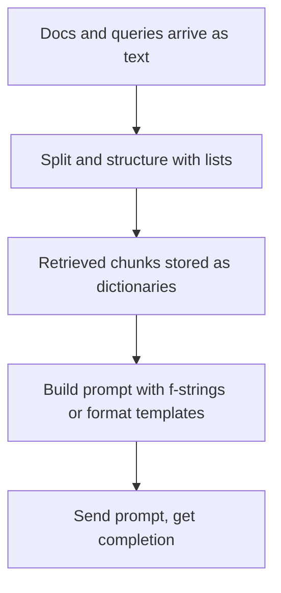
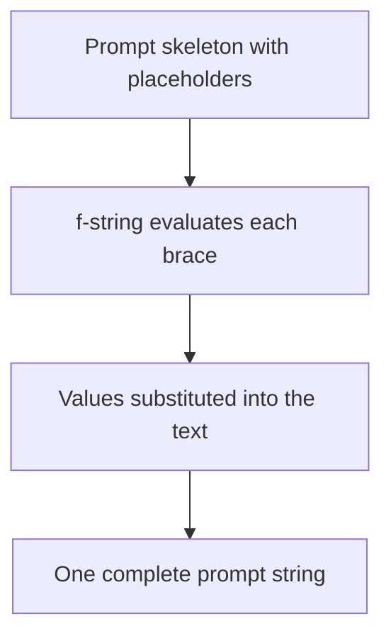
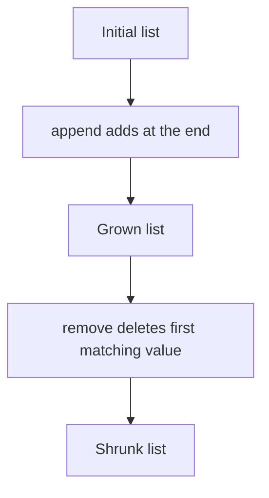
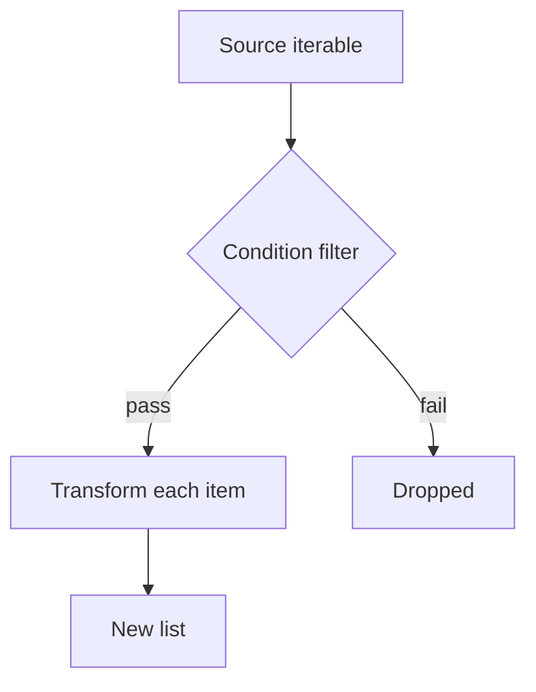
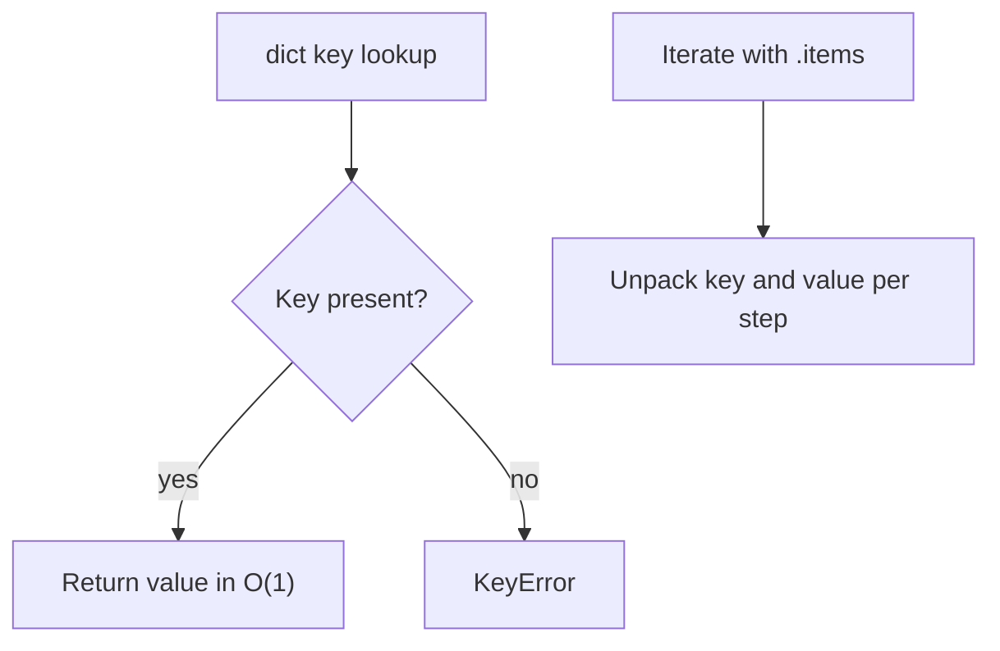
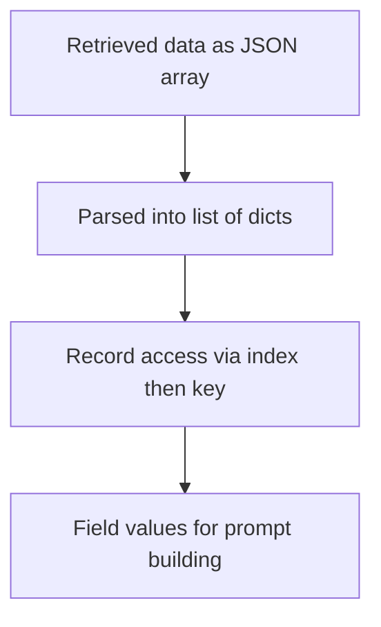
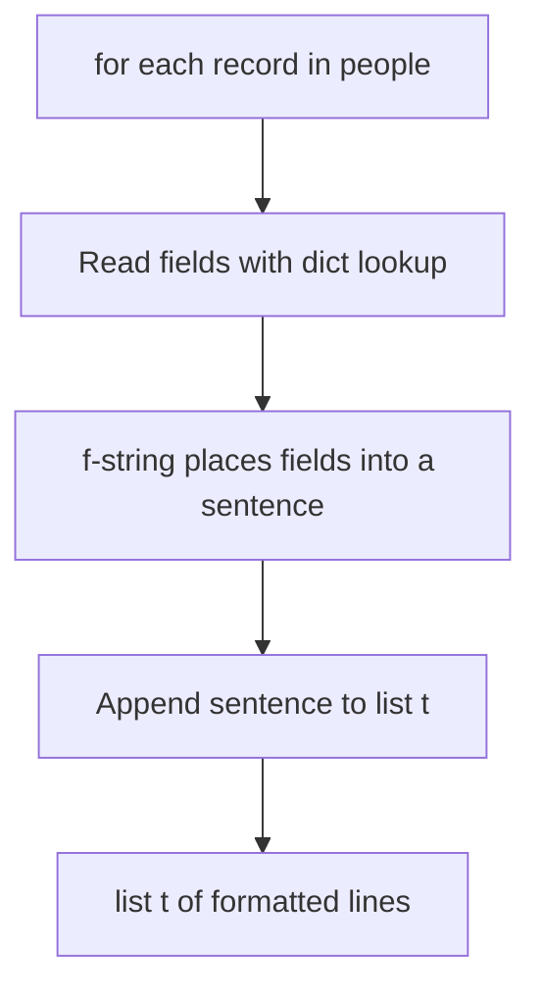
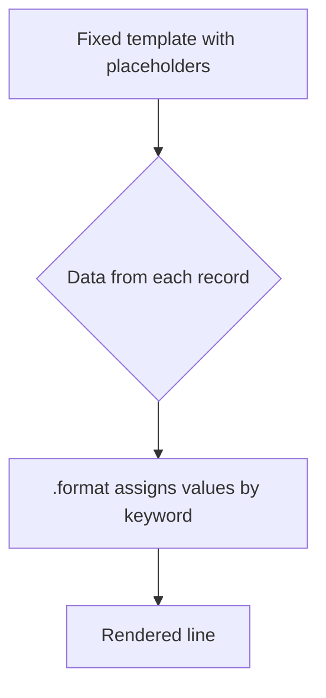
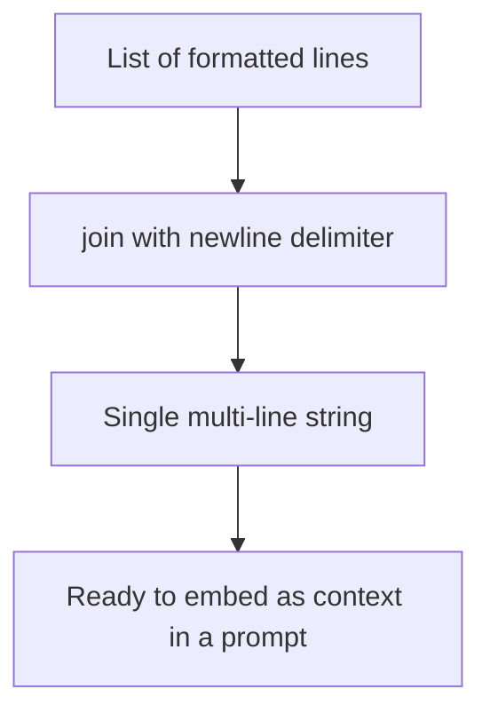
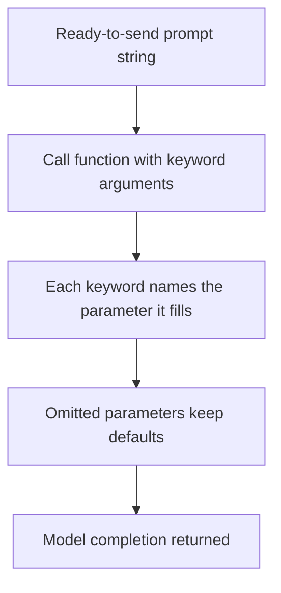

# Python Refresher for RAG and LLM Development

## TL;DR

- LLM and RAG work is mostly moving data around: instructions, documents, and model output all live in strings, lists, and dictionaries.
- **f-strings** embed variables directly into text and are the quickest way to build a prompt from stored values: `f"Name: {p['name']}"`.
- **Lists** hold ordered collections; `append` addss, `remove` deletes by value.
- **List comprehensions** build new lists from a loop in one expression: `[x * x for x in range(10) if x % 2 == 0]`.
- **Dictionaries** map keys to values and are how JSON records arrive in your code; a list of them behaves like a table of records.
- `.format()` templates separate the prompt layout from the data, which is useful when a prompt structure stays fixed but the values change.
- `.join()` concatenates a list of strings with a delimiter, converting a list of sentences into one formatted block of text.
- **Keyword arguments** (`f(param=value)`) name which parameter a value fills, so calls with several settings stay readable and order independent, e.g. `generate_with_single_input(prompt="...")`.

## 1. The problem: LLM apps are mostly data plumbing

When you build a RAG or LLM application, the hard part is rarely the model itself. The work sits around it: documents come in as text, get split, get turned into embeddings, and then at query time the retrieved chunks have to be wrapped into a well formed prompt before the model can answer.

That means every RAG pipeline is a series of ordinary Python operations. Strings must be combined into prompts, retrieved records must be looked up by field, results must be collected into lists and flattened into text. This ungraded lab is a refresher on exactly those building blocks: strings, f-strings, lists, list comprehensions, and dictionaries, with the explicit goal of writing code that produces clean prompts for an LLM. The course this lab belongs to is DeepLearning.AI's *Building and Evaluating Advanced RAG*, which assumes you can already move data between Python structures fluently.

<div style={{display: 'flex', justifyContent: 'center'}}>



</div>

The diagram above is the shape of almost every RAG pipeline you will build: text in, structure it, then turn the structure back into a prompt. The rest of this article covers the Python tools used for each step.

## 2. Strings and f-strings

A **string** is a sequence of characters. The simplest way to make text that depends on other values is an **f-string**: a string prefixed with `f`, where anything between `{ }` is evaluated and inserted.

```python
name = "John"
age = 30
greeting = f"Hello, {name}. You are {age} years old."
print(greeting)   # Hello, John. You are 30 years old.
```

The braces are not literal text. They run Python: `f"{2 + 2}"` prints `4`, and `f"{p['name'].upper()}"` reads the name and converts it to uppercase before inserting. This is exactly what makes prompts easy to build: you write the fixed sentence, and `{expression}` fills in the moving parts.

<div style={{display: 'flex', justifyContent: 'center'}}>



</div>

**Quoting gotcha.** Keys in a dictionary are strings, so `person['name']` needs quotes around `name`. Inside an f-string you already used braces, and the dictionary access goes inside those braces: `f"Name: {person_info_dict['name']}"`. In this case the key uses single quotes (`'name'`) so it does not collide with the double quotes wrapping the f-string. Mix this up and the parser cannot tell where one string ends and the next begins.

## 3. Lists: ordered, mutable collections

A **list** holds an ordered sequence of items and can change in place. Two common mutations are `append`, which adds to the end, and `remove`, which deletes the first item matching a value.

```python
l1 = ['RAG', 'is', 'awesome']
print(l1)                  # ['RAG', 'is', 'awesome']

l1.append('!')
print(l1)                  # ['RAG', 'is', 'awesome', '!']

l1.remove('awesome')
print(l1)                  # ['RAG', 'is', '!']
```

Because lists are mutable, `append` and `remove` change the list itself and return nothing; you do not reassign the variable. `remove` scans for the value by equality, so it is fine for small lists but is O(n); if you know the position, `del l1[i]` or `l1.pop(i)` is faster.

<div style={{display: 'flex', justifyContent: 'center'}}>



</div>

## 4. List comprehensions: declarative lists

A **list comprehension** builds a new list from a loop in a single expression, in the shape `[expression for item in iterable]`. The same computation without it needs a `for` loop and an `append`.

```python
squares = [x ** 2 for x in range(10)]
print(squares)   # [0, 1, 4, 9, 16, 25, 36, 49, 64, 81]

# The same thing with a plain for loop:
squares_for_loop = []
for x in range(10):
    squares_for_loop.append(x ** 2)
```

You can add a condition on the right: `[expression for item in iterable if condition]`. Only items that pass the condition produce an output.

```python
even_squares = [x ** 2 for x in range(10) if x % 2 == 0]
print(even_squares)   # [0, 4, 16, 36, 64]

# Equivalent for loop:
even_squares_for_loop = []
for x in range(10):
    if x % 2 == 0:
        even_squares_for_loop.append(x ** 2)
print(even_squares_for_loop)   # [0, 4, 16, 36, 64]
```

<div style={{display: 'flex', justifyContent: 'center'}}>



</div>

Comprehensions read like a sentence: "squares of x, for each x in range(10), if x is even". For one line of code they replace a loop plus `append`, which is why they appear everywhere in data processing code, including notebooks for LLM pipelines.

## 5. Dictionaries: named fields

A **dictionary** maps keys to values. Keys are usually strings, and you look up a value with `dict[key]`.

```python
person = {
    'name': 'Alice',
    'age': 25,
    'city': 'New York'
}

print(person['name'])      # Alice

person['email'] = 'alice@example.com'   # add a new key
print(person)              # {'name': 'Alice', 'age': 25, 'city': 'New York', 'email': 'alice@example.com'}
```

Creation order is preserved in Python 3.7 and later, and key lookup is O(1), unlike a list scan. Iterating a dictionary in a `for` loop yields its keys by default, so to get both names and values you use `.items()`.

```python
for key, value in person.items():
    print(f"Key: {key}\tValue: {value}")
```

<div style={{display: 'flex', justifyContent: 'center'}}>



</div>

A bare `for val in person:` gives keys, not values, which is a common source of confusion for developers coming from other languages. Use `person.values()` for values and `person.items()` for both.

## 6. Lists of dictionaries: records

Real data almost never arrives as single values. It arrives as a **list of dictionaries**, where each dictionary is one record and every record uses the same keys. This is exactly the shape of a JSON array, and it is what the lab explicitly calls out as the structure that comes up again and again in the course.

```python
people = [
    {"name": "Alice Johnson", "age": 28, "email": "alice.johnson@example.com", "location": "New York, NY"},
    {"name": "Michael Smith", "age": 34, "email": "michael.smith@example.com", "location": "Los Angeles, CA"},
    {"name": "Emily Davis", "age": 22, "email": "emily.davis@example.com", "location": "Austin, TX"}
]
```

Access an individual field with two steps: index the list, then index the dictionary.

```python
people[0]["name"]         # Alice Johnson
len(people)               # 3 (number of records)
```

<div style={{display: 'flex', justifyContent: 'center'}}>



</div>

This shape maps one to one onto database rows and onto the chunk records you get back from a vector store during retrieval, so it is the data structure you will spend most of your RAG code working through.

## 7. Building dynamic prompts with f-strings

The practical payoff of the refresher is putting the pieces together: loop over a list of dictionaries, and for each record make one formatted string describing it.

```python
t = []
for person_info_dict in people:
    layout_string = f"Name: {person_info_dict['name']}, Age: {person_info_dict['age']}, E-mail: {person_info_dict['email']}, Location: {person_info_dict['location']}"
    t.append(layout_string)

print(t)
```

Each iteration reads the four fields out of the current record and writes them into one sentence. The f-string turns a row of structured data into text a language model can read, which is the essence of turning retrieved context into a prompt.

<div style={{display: 'flex', justifyContent: 'center'}}>



</div>

Keep the quoting rule from section 2 in mind here: `person_info_dict['name']` uses single quotes for the key because the f-string itself is delimited with double quotes.

## 8. Prompt templates with .format()

An f-string is inline. If the same prompt layout must be reused many times, the alternative is a **template string** with `{name}` placeholders and the `.format()` method, which fills the placeholders from keyword arguments.

```python
template = "Name: {name}, Age: {age}, E-mail: {email}, Location: {location}"
t = []
for person_info_dict in people:
    layout_string = template.format(
        name=person_info_dict['name'],
        age=person_info_dict['age'],
        email=person_info_dict['email'],
        location=person_info_dict['location']
    )
    t.append(layout_string)
print(t)
```

The layout now lives in one place, separate from the data, and placeholder fill happens explicitly by name. This matters in production prompts, where you want the prompt skeleton reviewed and tested once rather than re typed inside every loop.

<div style={{display: 'flex', justifyContent: 'center'}}>



</div>

Choose f-strings when the prompt is short and built in place, and `.format()` templates when the structure is fixed and reused across many records or many calls.

## 9. Joining a list into one block with .join()

A list of formatted lines is not yet a prompt. The final step turns the list back into a single string with `"\n".join(t)`, which concatenates every element of `t` separated by the newline character.

```python
formatted_string = "\n".join(t)
print(formatted_string)
```

The string before `.join` is the delimiter placed *between* elements, not around them, so `"\n".join(t)` produces one line per person.

<div style={{display: 'flex', justifyContent: 'center'}}>



</div>

For retrieval this is the last mile: you have a list of chunk records, you render each into a readable line, and `join` folds them into one context block that goes into the model prompt. The whole lab is that four step pipeline from section 1, applied to real Python records.

## 10. Calling functions with keyword arguments

Once the prompt string is built, the next step in any RAG pipeline is handing it to a model. Calls like the ones from this course's lab code show a pattern that looks odd at first:

```python
output = generate_with_single_input(
    prompt="What is the capital of France?"
)
```

`prompt=` is not a variable assignment and `prompt` is not a variable. It is a **keyword argument**: it names the *parameter* of the function being called and supplies the value for it, filling the spot that the function's definition reserved.

```python
def generate_with_single_input(prompt):   # the function reserves a parameter named prompt
    ...                                   # uses prompt internally

question = "What is the capital of France?"
output = generate_with_single_input(prompt=question)   # same, value now held in a variable
```

The value after the `=` can be a literal string, as in the first snippet, or any expression that evaluates to one, such as the variable `question` in the second. Either way the parameter name belongs to the function, not to your code.

Why call it this way instead of just passing the string in order? Model calls take several settings, not one. A helper like `generate_with_single_input` typically also accepts a model name, a temperature, a token limit, and so on. Keyword arguments make those calls readable and robust:

```python
output = generate_with_single_input(
    prompt=my_prompt,
    model="gpt-4o",
    temperature=0.2
)
```

Every value is labeled, the order of the arguments no longer matters, and any setting you omit keeps its default. Without keywords you would have to remember both the number and the order of every parameter the function accepts, which is exactly the kind of detail you do not want to juggle while assembling a retrieval pipeline.

<div style={{display: 'flex', justifyContent: 'center'}}>



</div>

The pattern generalizes to every LLM SDK and framework you will use. Older style calls pass arguments positionally and hope the order is right; keyword arguments say explicitly which string is the prompt, which number is the temperature, and so on. When you read `generate_with_single_input(prompt="What is the capital of France?")`, read it as "call this function with the prompt set to that string".

## 11. Summary

This refresher covers the small set of Python tools a RAG developer actually uses every day. F-strings and `.format()` templates are how prompts are assembled from data. Lists and list comprehensions are how collections of items are stored and transformed. Dictionaries, and specifically lists of dictionaries, are how structured records arrive from APIs, databases, and retrieval. `.join()` flattens a list of rendered lines into the final prompt text, and keyword arguments are how that text is handed to a model in a readable, order independent call. Each tool solves one concrete problem in the pipeline, and recognizing which one applies at each step is the skill the lab is trying to build.

## Sources

- DeepLearning.AI, Building and Evaluating Advanced RAG, Ungraded Lab 1: A Brief Python Refresher. The lab this article documents; quotes and code patterns follow the notebook exactly.
- Python documentation, f-strings: https://docs.python.org/3/reference/lexical_analysis.html#f-strings
- Python documentation, list comprehensions: https://docs.python.org/3/tutorial/datastructures.html#list-comprehensions
- Python documentation, dictionaries: https://docs.python.org/3/tutorial/datastructures.html#dictionaries
- Python documentation, str.format: https://docs.python.org/3/library/stdtypes.html#str.format
- Python documentation, str.join: https://docs.python.org/3/library/stdtypes.html#str.join