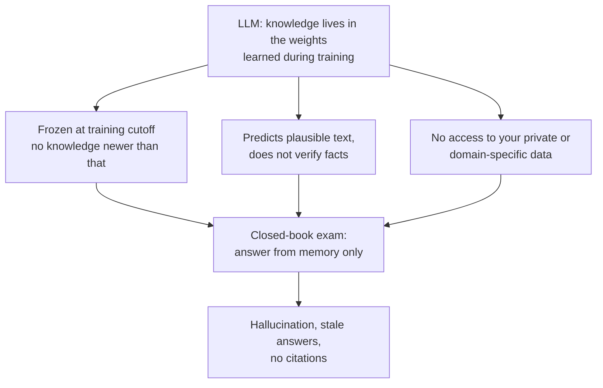
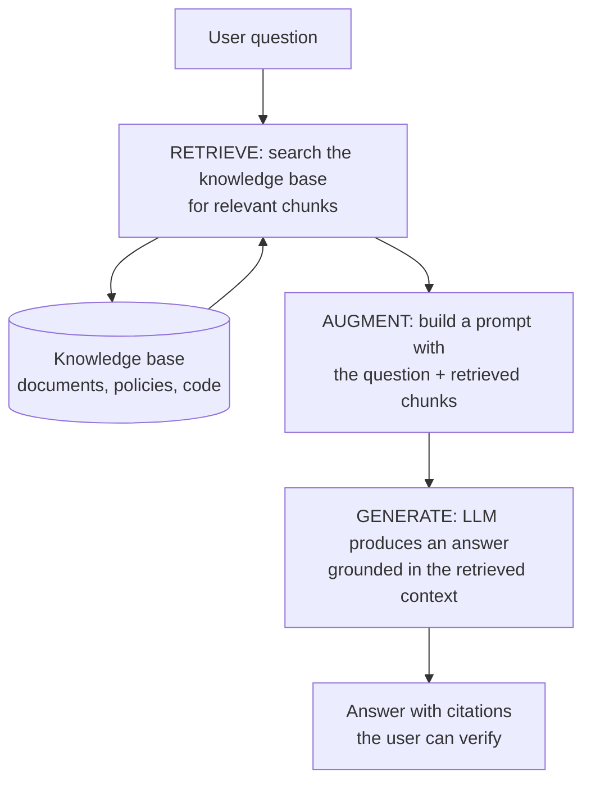
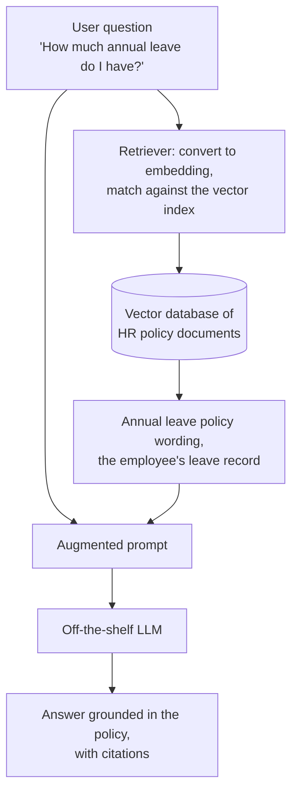
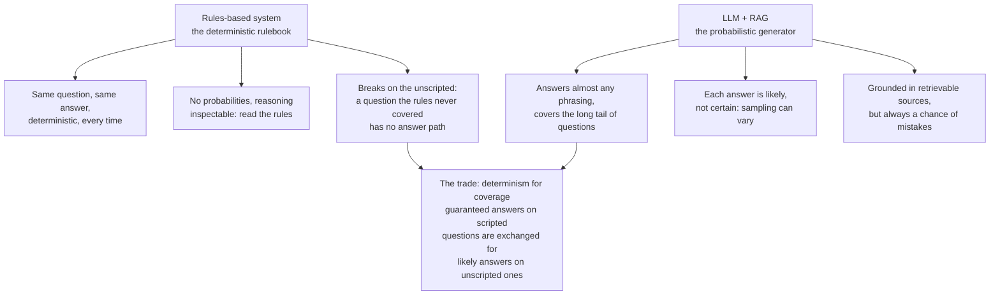
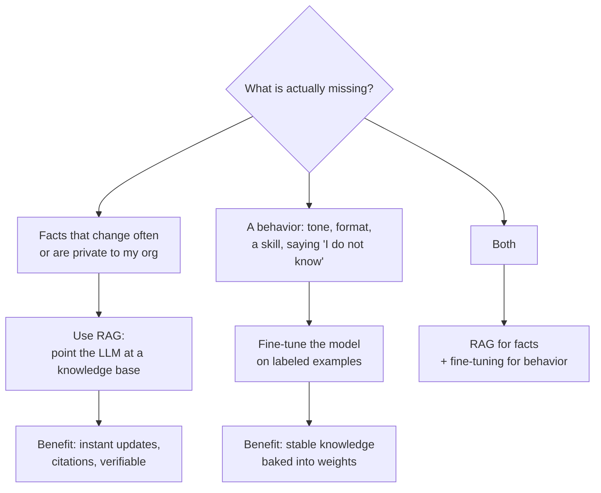
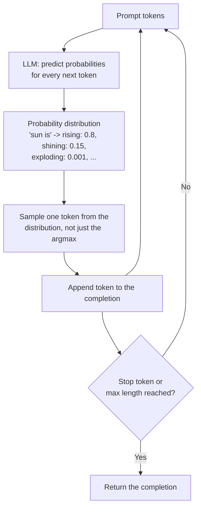
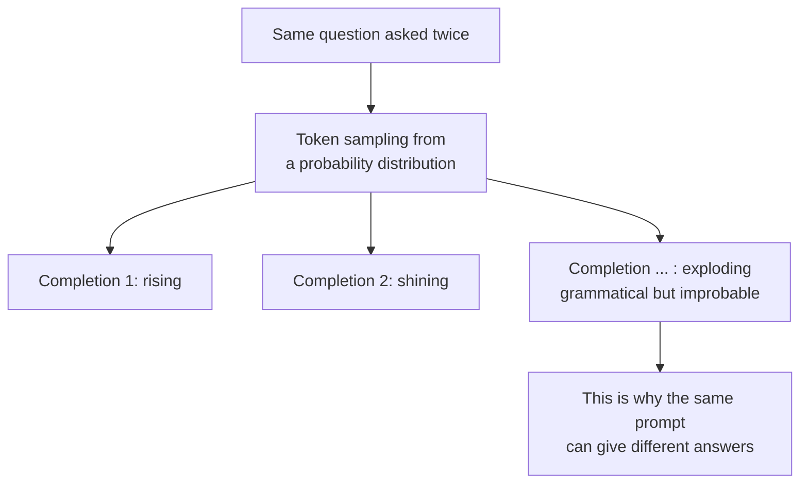
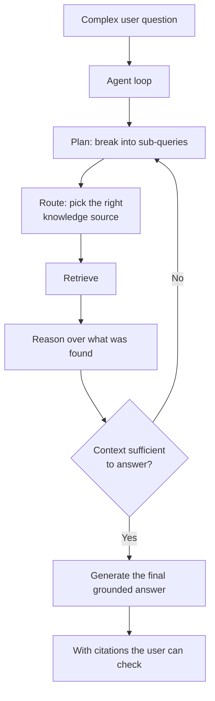
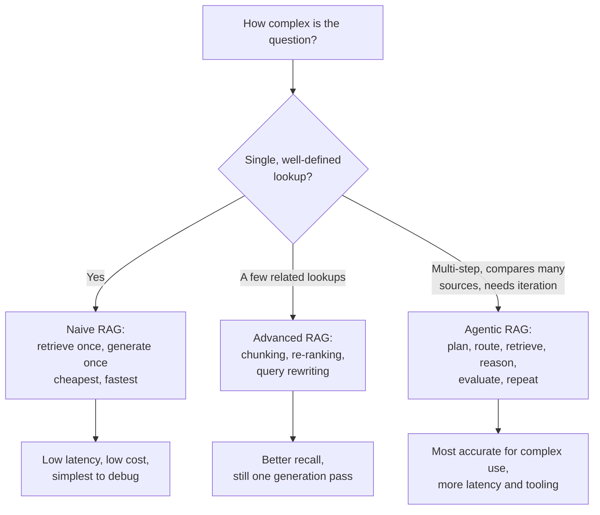

# Retrieval-Augmented Generation (RAG)

Generative AI has the potential to "transform almost everything", as Andrew Ng famously said, drawing a comparison between AI and electricity ([Stanford GSB Insights, 2017](https://www.gsb.stanford.edu/insights/andrew-ng-why-ai-new-electricity)). But there is a catch: the electricity is useless if the power plant refuses to learn anything new. A large language model (LLM) only knows what it was trained on, and that knowledge freezes the day training ends. Retrieval-Augmented Generation (RAG) is the pattern that plugs an LLM into a knowledge base it was never trained on, letting it answer from sources it can see and you can verify.

## TL;DR

- **The problem:** An LLM stores its knowledge in the weights learned during training. That knowledge is static, stops at a training cutoff, and produces confident but unverifiable answers with no citations.
- **The solution:** RAG gives the model access to an external knowledge base without retraining. Retrieval pulls relevant documents, the prompt is augmented with them, and the LLM generates an answer grounded in that context. It is the difference between an open-book and a closed-book exam.
- **What it replaces (the accuracy baseline):** before LLMs you built rules-based systems, deterministic if-then logic we call the "deterministic rulebook". Same question, same answer, always, but only for questions a human scripted in advance.
- **Why trade that accuracy away?** RAG is "sufficiently accurate", not guaranteed, but it covers the unscripted long tail, cites its sources, and updates instantly. Retraining is expensive and slow, while a knowledge base can be refreshed any time.
- **When not to trade accuracy:** keep a rules-based system when the question space is small and the answer must be identical every time; fine-tune when the model must learn your *style and behavior* (not just facts), or when the knowledge is stable.
- **What every RAG system contains:** a knowledge base, a retriever (often semantic search over embeddings), and the off-the-shelf LLM generator that reasons over the retrieved text.
- **Why retrieved text matters:** the LLM is not a database. It is a next-token predictor, a "fancy autocomplete", that samples from a probability distribution. Give it the right context and it generates from that context, with citations.
- **Going further:** when one retrieval pass is not enough, Agentic RAG wraps the retriever in an agent loop that plans, queries again, and evaluates its own results.

## 1. The problem: LLMs only know what they trained on

LLMs are trained on vast volumes of text. The knowledge from that text gets compressed into the billions of parameters of the neural network, which is why the RAG paper calls such models "pre-trained parametric memory" ([Lewis et al., NeurIPS 2020](https://arxiv.org/abs/2005.11401)). Ask the model "what is the capital of France?" and it can answer, because that fact lives in its weights.

But that arrangement has three painful consequences:

1. **Frozen knowledge.** LLM training data is static and has a knowledge cutoff. Anything that happens after training simply does not exist for the model, and the older the model gets, the more it drifts from reality ([AWS, What is RAG](https://aws.amazon.com/what-is/retrieval-augmented-generation/), [IBM, What is RAG](https://www.ibm.com/think/topics/retrieval-augmented-generation)).
2. **Unverifiable answers.** The model predicts what a plausible answer sounds like; it does not check facts. This produces hallucinations, confidently stated information that is factually wrong, because pattern completion and truth are not the same thing ([see AI Agent Hallucination](./agent-hallucination.mdx)).
3. **No data you own.** Anything private internal data was never in the training set, so the model is blind to your company's actual policies, codebase, or documents.

Think of the model as an overeager employee: it will answer every question with absolute confidence, even when it has no idea what it is talking about ([AWS, What is RAG](https://aws.amazon.com/what-is/retrieval-augmented-generation/), [IBM Research, What is RAG](https://research.ibm.com/blog/retrieval-augmented-generation-RAG)).

<div style={{display: 'flex', justifyContent: 'center'}}>



</div>

Where does the factual limitation come from mechanically? It comes from how LLMs generate text, which is worth understanding before we add retrieval on top. A model does not "look up" an answer. It takes your prompt, converts it into tokens, and predicts the next token based on a learned probability distribution over its entire vocabulary ([OpenAI, Understanding and counting tokens](https://help.openai.com/en/articles/4936856-what-are-tokens-and-how-to-count-them)). As one popular saying goes: at their core, LLMs are "fancy autocomplete". We will unpack this in [Section 6](#6-why-the-llm-needs-your-text-a-fancy-autocomplete).

## 2. The solution: RAG, the open-book exam

Retrieval-Augmented Generation is an architecture that connects the LLM to external knowledge so it can reference information outside its training data before generating a response ([AWS, What is RAG](https://aws.amazon.com/what-is/retrieval-augmented-generation/)). The name tells you exactly what happens:

- **Retrieve** relevant information from a knowledge base.
- **Augment** the user's question with that retrieved information.
- **Generate** an answer using both.

The RAG framework was introduced in 2020 by Meta researchers in the paper *Retrieval-Augmented Generation for Knowledge-Intensive NLP Tasks*. They combined a pre-trained seq2seq language model (the parametric memory) with a dense vector index of Wikipedia (the non-parametric memory) and showed it set state-of-the-art results on three open-domain question-answering tasks, while producing "more specific, diverse and factual" language than a model that used only its parameters ([Lewis et al., NeurIPS 2020](https://arxiv.org/abs/2005.11401)).

IBM Research describes the difference as an open-book exam: "you are asking the model to respond to a question by browsing through the content in a book, as opposed to trying to remember facts from memory" ([IBM Research, What is RAG](https://research.ibm.com/blog/retrieval-augmented-generation-RAG)). A closed-book LLM answers from memory and guesses when the memory is empty. An open-book-RAG model is handed the relevant pages and told: answer using these.

<div style={{display: 'flex', justifyContent: 'center'}}>



</div>

The value of this is that you do not need to touch the model at all. You pair an off-the-shelf LLM with your own knowledge store, and the knowledge store, not the model, is what you update when the world changes ([AWS, What is RAG](https://aws.amazon.com/what-is/retrieval-augmented-generation/), [IBM, What is RAG](https://www.ibm.com/think/topics/retrieval-augmented-generation)).

## 3. Two jobs: the retriever finds, the generator reasons

Inside a RAG system the work is split between two very different components:

**The retriever.** An algorithm that searches the knowledge base for content relevant to the question. In an open-domain consumer setting the sources can be indexed documents from the internet; in an enterprise setting they are a narrow set of company-approved documents, chosen for security and reliability ([IBM Research, What is RAG](https://research.ibm.com/blog/retrieval-augmented-generation-RAG)). The retriever's whole job is to find the right chunks and hand them to the generator.

**The generator.** The LLM itself, usually an off-the-shelf pre-trained model such as GPT, Claude, or Llama ([IBM, What is RAG](https://www.ibm.com/think/topics/retrieval-augmented-generation)). It receives the augmented prompt, works with the retrieved information as its source of truth, and produces the final answer.

You can think of it as a librarian and a writer. The librarian (retriever) finds the relevant passages. The writer (the LLM) reads them and writes the answer, weaving new facts in from its training when appropriate.

```mermaid
graph TD
  Q["User question"] --> R["RETRIEVER:<br/>finds relevant passages"]
  R --> F["Fast, narrow source of truth<br/>returns top-K chunks"]
  F --> W["GENERATOR (LLM):<br/>the reasoner"]
  W --> T["training knowledge<br/>language, style, common sense"]
  W --> A["Answer = retrieved facts<br/>explained in fluent language"]
  A --> C["Citations let the human<br/>dig deeper and verify"]
```

<div style={{display: 'flex', justifyContent: 'center'}}>



</div>

IBM's internal customer-care chatbot is a concrete example of the division of labor. An employee asks whether she can take vacation in half-day increments and whether she has enough vacation to finish the year. The retriever pulls her HR files to find her remaining days and searches the company policy to confirm half-day vacations are allowed. Those facts are injected into her query, and the LLM generates a concise, personalized answer with links to its sources ([IBM Research, What is RAG](https://research.ibm.com/blog/retrieval-augmented-generation-RAG)).

## 4. The augmented prompt: question plus retrieved context

The full RAG flow has five stages: the user submits a prompt, the retrieval model queries the knowledge base, relevant information is returned, the system engineers an augmented prompt with that added context, and the LLM generates the output ([IBM, What is RAG](https://www.ibm.com/think/topics/retrieval-augmented-generation)).

The "augmentation" step is the heart of the pattern. A RAG system does not silently change the model; it changes what the model is allowed to see. The three essential ingredients of the augmented prompt are:

1. **The original question**, as the user asked it.
2. **The retrieved information**, the top chunks the retriever judged most relevant.
3. **An instruction** that says, in effect, "answer the question using this context, and cite it".

<div style={{display: 'flex', justifyContent: 'center'}}>



</div>

Scenario from AWS fits this exactly: an employee asks "How much annual leave do I have?", the system retrieves the annual-leave policy document *and* the employee's past leave record, both because their vector similarity to the question is high, and the LLM answers from that context ([AWS, What is RAG](https://aws.amazon.com/what-is/retrieval-augmented-generation/)).

Two design constraints shape how retrieval works in practice. First, LLMs have a `context window`, a hard limit on the tokens they can process, so a document is split into `chunks` before embedding. If chunks are too large they become too general; if too small they lose semantic coherence. Chunk size is one of the most important knobs in a RAG pipeline ([IBM, What is RAG](https://www.ibm.com/think/topics/retrieval-augmented-generation)). Second, the knowledge base must be re-indexed as documents change, so the system stays current ([AWS, What is RAG](https://aws.amazon.com/what-is/retrieval-augmented-generation/)).

RAG is, in fact, the most common pattern of a broader practice called context engineering: designing what goes into the context window and how it is structured ([see Prompt, Context & Harness Engineering](./engineering.md#context-engineering)).

## 5. Why trade accuracy? RAG instead of retraining

Here is the honest version of the promise: RAG gives you answers that are *sufficiently accurate*, not ones that are guaranteed to be 100% correct. Retrieval can return a wrong or out-of-context chunk, the model can summarize it incorrectly, and the whole system depends on the quality of the data it is fed ([TechTarget, What is RAG](https://www.techtarget.com/searchenterpriseai/definition/retrieval-augmented-generation)). There is always a chance of mistakes.

But to see exactly what is being traded, look at what came before.

### The old baseline: the "deterministic rulebook"

Before LLMs, most "intelligent" systems were rules-based. A rules-based system represents domain knowledge as explicit rules and applies reasoning over them; the classic form is an expert system built from `if-then` rules: `if the item was bought within 30 days, then a return is allowed` ([Wikipedia, Rule-based system](https://en.wikipedia.org/wiki/Rule-based_system)). There is nothing probabilistic about it. Feed it the same input and it follows the same rules and emits the same output, every single time. Let us give that whole family a name for contrast with the probabilistic LLM: the **deterministic rulebook**.

The chatbot flavor of the rulebook was a scripted decision tree. A conversation agent confirmed the customer's intent, fetched the requested information, and delivered an answer from a one-size-fits-all script. That handled straightforward queries fine, but scripting an answer for every question a customer might come up with took a long time, and the moment a question fell outside the script, the agent had no ability to improvise ([IBM Research, What is RAG](https://research.ibm.com/blog/retrieval-augmented-generation-RAG)).

The property that made the rulebook valuable was the guarantee: same question, same answer, and the reasoning was inspectable by reading the rules. Updating the system meant editing the rules by hand. An LLM gives up that guarantee, because a model is not deterministic the way an ordinary function is ([see The AI Application Stack](../software-engineering/ai-application-stack.md)); it samples from a probability distribution ([Section 6](#6-why-the-llm-needs-your-text-a-fancy-autocomplete)). So the trade in this section is really **determinism for coverage**: you stop hand-writing every branch of every possible question, and in return you accept answers that are "sufficiently accurate" rather than guaranteed, because the system can now handle the questions nobody scripted.

<div style={{display: 'flex', justifyContent: 'center'}}>



</div>

So why trade that accuracy away? Because the alternatives are worse for most real-world needs:

**Retraining is costly and slow.** Retraining or fine-tuning a foundation model on new data is computationally and financially expensive, and when your knowledge changes often, retraining every time is impractical. RAG achieves the same domain relevance by pointing the model at an updated knowledge base, no parameter changes required ([AWS, What is RAG](https://aws.amazon.com/what-is/retrieval-augmented-generation/), [IBM, What is RAG](https://www.ibm.com/think/topics/retrieval-augmented-generation)).

**Knowledge changes fast.** If changes happen quickly, a retrain-then-redeploy cycle cannot keep up, because the updated model needs retraining, re-testing, and re-deployment. With RAG you just update the documents and re-index. That is why RAG can connect an LLM to live feeds, news, internal wikis, or a constantly changing codebase ([AWS, What is RAG](https://aws.amazon.com/what-is/retrieval-augmented-generation/)).

**Verifiability beats memory.** RAG answers come with sources. The output can carry citations, and a human who wants to investigate further can open the underlying document. Trust goes up when every claim points back to a page a person can read ([IBM Research, What is RAG](https://research.ibm.com/blog/retrieval-augmented-generation-RAG), [AWS, What is RAG](https://aws.amazon.com/what-is/retrieval-augmented-generation/)).

**It reduces hallucinations.** Anchoring the LLM in external, verifiable facts gives it fewer opportunities to pull stale or fabricated information from its parameters ([IBM Research, What is RAG](https://research.ibm.com/blog/retrieval-augmented-generation-RAG)). It reduces the risk; it does not eliminate it.

### When NOT to trade accuracy: fine-tune instead

Fine-tuning trains the model on domain-specific data, baking style and behavior into its weights. RAG only changes what it reads at answer time ([IBM, What is RAG](https://www.ibm.com/think/topics/retrieval-augmented-generation), [IBM, RAG vs fine-tuning](https://www.ibm.com/think/topics/rag-vs-fine-tuning)). Reach for fine-tuning when:

- The question space is **small and fixed**, and the answer must be **identical every time**: here the deterministic rulebook still wins. When consistency is a hard requirement, a rules-based system is not a compromise, it is the right tool.
- The knowledge is **stable** and will not need updating.
- The goal is **behavior**: match a tone, follow a format, or learn a skill, not recall facts.
- You want lower **latency**: RAG adds a retrieval step, and retrieval over a large knowledge base costs time ([TechTarget, What is RAG](https://www.techtarget.com/searchenterpriseai/definition/retrieval-augmented-generation)).
- You need the model to **say "I don't know"**, a behavior that has to be trained in, not retrieved.

The two are not exclusive. RAG can change what the model knows; fine-tuning changes how the model behaves, and many production systems use both ([IBM, What is RAG](https://www.ibm.com/think/topics/retrieval-augmented-generation)).

<div style={{display: 'flex', justifyContent: 'center'}}>



</div>

This is the accuracy trade-off made explicit: with RAG you accept that each answer is probably right and provably sourced, instead of certain-but-opaque, and the retrain-round trip is the price you avoid paying.

## 6. Why the LLM needs your text: a "fancy autocomplete"

To understand why retrieval changes what the model outputs, you need to know what the model actually does. All an LLM does is predict the next token that should appear in a text. It is not reading an encyclopedia; it is completing a sentence, which is why LLMs are sometimes jokingly called fancy autocomplete ([IBM Research, What is RAG](https://research.ibm.com/blog/retrieval-augmented-generation-RAG) frames the same idea: the model knows how words relate statistically, not what they mean).

Give it a prompt, and it produces a completion. A single prompt can have many possible completions:

```
Prompt: What a beautiful day, the sun is _______

Completion 1: What a beautiful day, the sun is rising.
Completion 2: What a beautiful day, the sun is shining.
Completion 3: What a beautiful day, the sun is exploding.
```

The third completion is grammatically fine but statistically improbable. Humans have an intuitive sense of what words are commonly used together, and the model has the same sense, learned as a neural network trained on enormous amounts of text. That sense is a probability distribution over what comes next.

### Tokens: the model's alphabet

Text does not enter the model as words. When a prompt is sent to an LLM it is divided into tokens, which can represent a single character, part of a word, a whole word, or punctuation ([OpenAI, Understanding and counting tokens](https://help.openai.com/en/articles/4936856-what-are-tokens-and-how-to-count-them)). An appetizer, for example, might be one token or several, and a leading space can change how a word is tokenized.

Models carry a large vocabulary of these tokens, on the order of tens of thousands, and common words and compound words get their own token instead of being assembled character by character. The model's job, given the tokens so far, is to predict the next token. Rough estimates for English text: 1 token is about 4 characters, and 100 tokens is about 75 words ([OpenAI, Understanding and counting tokens](https://help.openai.com/en/articles/4936856-what-are-tokens-and-how-to-count-them)).

### The generation loop: predict, sample, append, repeat

Generation is an iterative loop:

1. The prompt becomes tokens.
2. The model assigns a probability to every token in its vocabulary as the next one.
3. The model chooses one token, not always the most probable, but sampled from that distribution.
4. That token is appended to what has been generated so far.
5. The whole thing, prompt plus completion-so-far, is fed back and the model predicts the next token again.
6. The loop stops when the model produces a stop token (or hits a length limit).

<div style={{display: 'flex', justifyContent: 'center'}}>



</div>

### Why the same question gets different answers

That sampling step is the source of the model's non-determinism. If two tokens are both plausible, the model does not always pick the top one; it draws from the distribution, so if a token has 80% probability, it wins roughly 80 out of 100 draws, not always. Small changes in phrasing, or just luck in the draw, produce different completions for the same question. The `temperature` setting controls how aggressively the model samples: near zero it becomes close to deterministic (greedy), and higher values make the output more varied ([see Human Judgment & Verification](./human-judgment-and-verification.md), which covers sampling-based generation and why non-determinism is fundamental).

Now the RAG insight is obvious: if the model merely continues the text in the most statistically plausible way, then whatever text you give it determines what it completes. Give it no context and it completes from training memory. Give it a question *plus* the relevant policy, and the most probable continuation becomes an answer grounded in that policy. You are steering the next-token prediction by adding the right context.

<div style={{display: 'flex', justifyContent: 'center'}}>



</div>


## 7. Agentic RAG: when one retrieval pass is not enough

Plain RAG is a single round trip: retrieve once, generate once. That works when a straightforward lookup answers the question, but many real questions need more than one query. A question like "what is our data retention policy for customer records in the EU?" may require pulling several documents, comparing them, and combining results.

**Agentic RAG** adds AI agents to that pipeline, agents that can plan queries, call tools, and loop between retrieval and reasoning ([IBM, What is Agentic RAG](https://www.ibm.com/think/topics/agentic-rag)). Instead of a fixed static query, the system can:

- **Route**: decide which knowledge source to search based on the question.
- **Plan**: break a complex question into sub-queries and search for each.
- **ReAct**: interleave reasoning with retrieval steps, so the model decides what to look up next based on what it already found.
- **Evaluate and iterate**: check whether the retrieved context is enough, and if not, retrieve again.

Anthropic describes the same idea from the agent's point of view: agents maintain lightweight identifiers such as file paths and queries instead of pre-loaded context, and retrieve "just in time" at runtime, discovering relevant context incrementally through exploration; each retrieval informs the next decision. They recommend a hybrid of some data loaded up front for speed, plus further autonomous exploration when the agent judges it necessary ([Anthropic, Effective context engineering for AI agents](https://www.anthropic.com/engineering/effective-context-engineering-for-ai-agents)).

<div style={{display: 'flex', justifyContent: 'center'}}>



</div>

Agentic RAG sits one step beyond the model-and-harness split: the harness that drives the loop, manages tools like search and file access, and supplies memory is what turns a single-shot model into the navigate-and-retrieve agent ([see AI Model vs Agentic Harness](./ai-model-vs-agentic-harness.mdx)). The trade-offs are real: agents add latency, cost more tokens, and introduce new failure modes, because an unreliable agent can chase the wrong knowledge or loop without converging ([IBM, What is Agentic RAG](https://www.ibm.com/think/topics/agentic-rag), [see AI Agent Hallucination](./agent-hallucination.mdx)).

### Choosing a RAG level

<div style={{display: 'flex', justifyContent: 'center'}}>



</div>

Start with plain RAG. Add query rewriting and re-ranking when recall is poor. Graduate to the agent loop only when the questions genuinely require planning across multiple sources.

## 8. When to use RAG: a checklist

Use RAG when:

- The facts your users need live **outside** the model's training data: private docs, policies, code, live feeds.
- The knowledge **changes frequently**, faster than a retrain-and-deploy cycle could keep pace with.
- Users need **citations** they can open and verify, or trust is non-negotiable.
- You want to serve different users or domains with **one model** and different knowledge bases.
- The cost of retraining is not justified by the value of freezing knowledge into weights.

Do not use RAG (or pair it with fine-tuning) when:

- The answer must come from **stable, well-known** knowledge and style matters more than facts.
- Latency and cost dominate, and a single lookup is not part of the workflow.
- The domain needs behaviors (`say "I don't know"`) that no amount of retrieval will teach.

Whatever you build, remember what the model is: a next-token predictor that samples from a probability distribution ([Section 6](#6-why-the-llm-needs-your-text-a-fancy-autocomplete)). RAG does not make it omniscient; it points it at a knowledge base you can update and verify. The accuracy of the answer is capped by the accuracy of the retrieval, so invest in the quality of the knowledge base and the retriever, and keep the citations in the loop, because that is where human verification begins.

For the bigger picture of where the value in RAG and the harness actually sits, see [Where the Value Actually Sits](../perspectives/where-the-value-actually-sits.md).

## Sources

- RAG paper: Lewis, P., et al. (2020). *Retrieval-Augmented Generation for Knowledge-Intensive NLP Tasks*. NeurIPS 2020. arXiv:2005.11401. Introduces RAG, parametric + non-parametric memory, vocabulary of the framework. https://arxiv.org/abs/2005.11401
- AWS. *What is RAG (Retrieval-Augmented Generation)?* Definition of RAG, the four-stage workflow, benefits (cost, current info, trust, control), semantic search as the retrieval engine, and update of external data. https://aws.amazon.com/what-is/retrieval-augmented-generation/
- IBM Think, Ivan Belcic. *What is retrieval augmented generation (RAG)?* Five-stage process, four components (knowledge base, retriever, integration layer, generator), benefits vs fine-tuning, context window and chunking, hallucination reduction. https://www.ibm.com/think/topics/retrieval-augmented-generation
- IBM Research, Kim Martineau (2023). *What is retrieval-augmented generation?* The open-book/closed-book exam analogy, two phases, hallucination reduction, reduced retraining cost, and the pre-LLM chatbot era of manual dialogue flow and one-size-fits-all scripts. https://research.ibm.com/blog/retrieval-augmented-generation-RAG
- Wikipedia, Rule-based system. Definition of a rules-based system as domain knowledge represented in rules with reasoning applied; if-then production rules and expert systems as the classic form. https://en.wikipedia.org/wiki/Rule-based_system
- TechTarget, Alexander S. Gillis. *What is retrieval-augmented generation (RAG) in AI?* Benefits and limitations (data quality dependency, latency), RAG vs semantic search, and history. https://www.techtarget.com/searchenterpriseai/definition/retrieval-augmented-generation
- OpenAI. *Understanding and counting tokens.* Tokens can be characters, parts of words, whole words, or punctuation; English estimates: 1 token is about 4 characters, 100 tokens about 75 words. https://help.openai.com/en/articles/4936856-what-are-tokens-and-how-to-count-them
- Stanford GSB Insights, Shana Lynch (2017). *Andrew Ng: Why AI Is the New Electricity.* Source for the opening quote, "AI is the new electricity". https://www.gsb.stanford.edu/insights/andrew-ng-why-ai-new-electricity
- IBM Think, Ivan Belcic and Cole Stryker. *What is Agentic RAG?* Definition of agentic RAG, agent building blocks (routing, query planning, ReAct, plan-and-execute), and trade-offs of cost/latency. https://www.ibm.com/think/topics/agentic-rag
- Anthropic Applied AI team (2025). *Effective context engineering for AI agents.* Agentic retrieval: agents maintain lightweight references and retrieve just-in-time, with progressive disclosure and iteration. https://www.anthropic.com/engineering/effective-context-engineering-for-ai-agents
