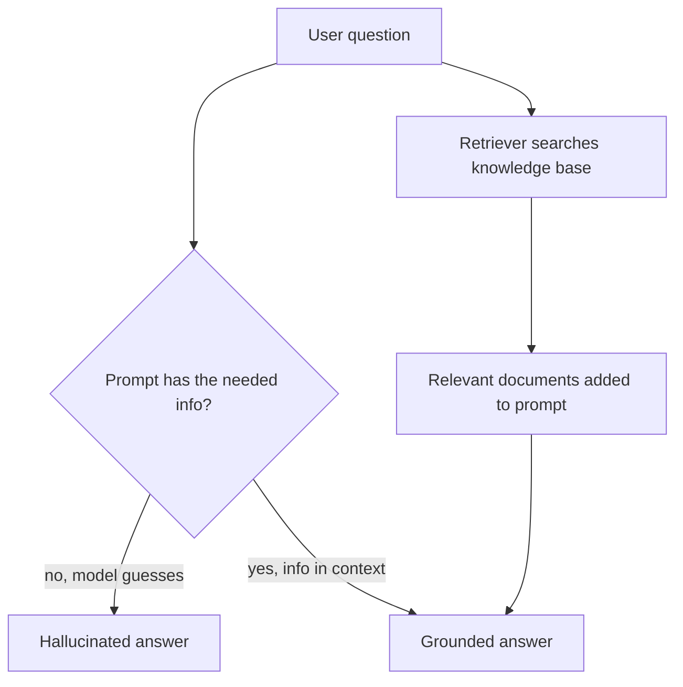
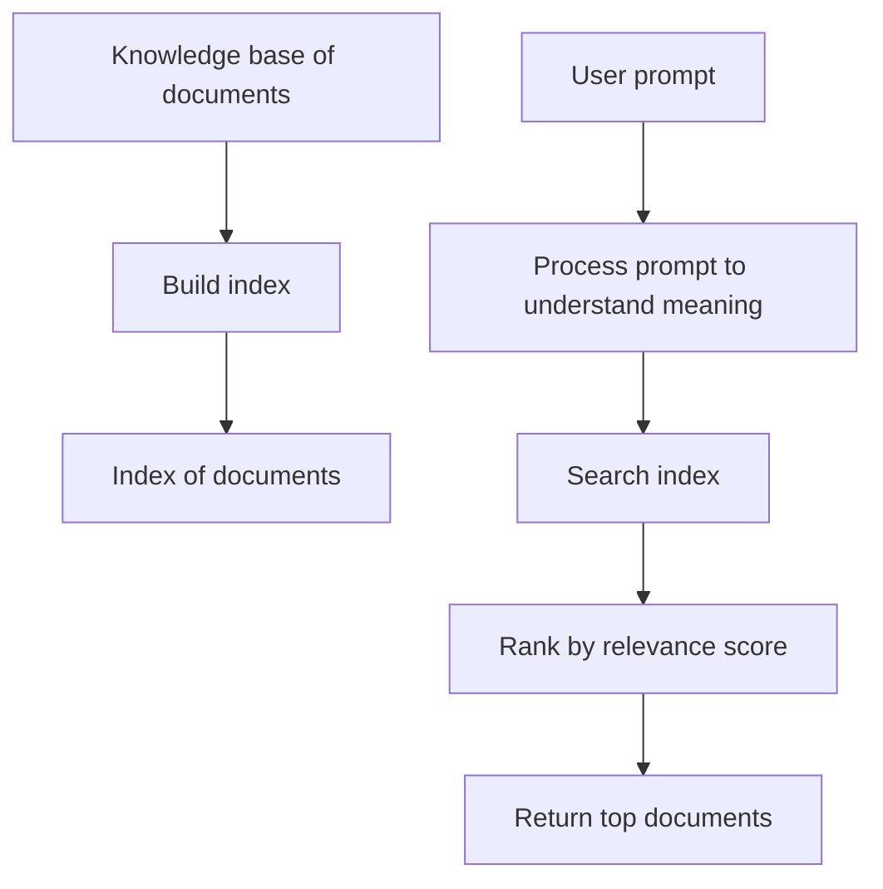
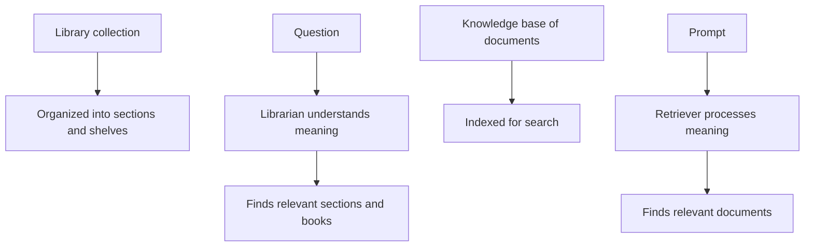
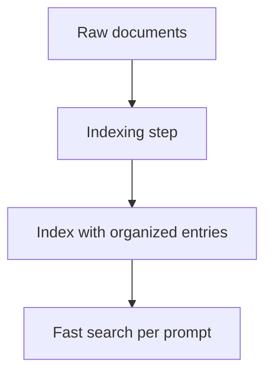
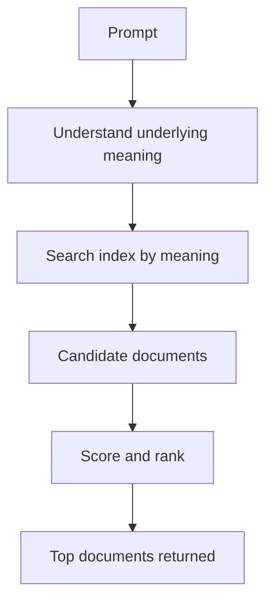
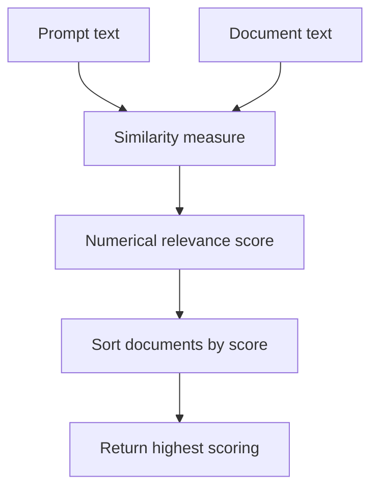
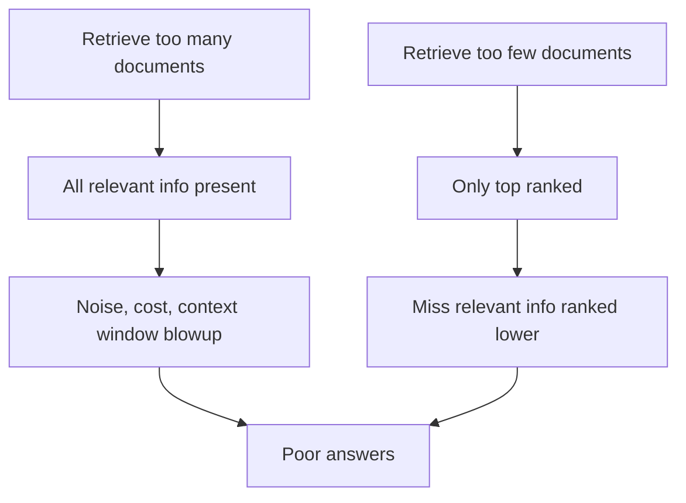
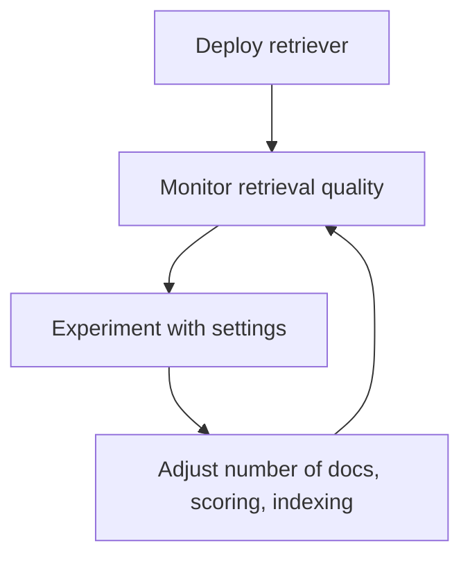
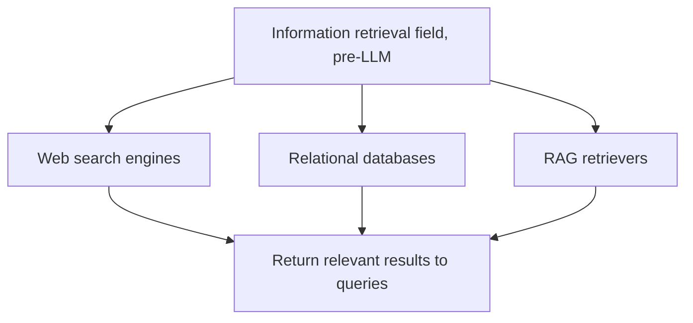
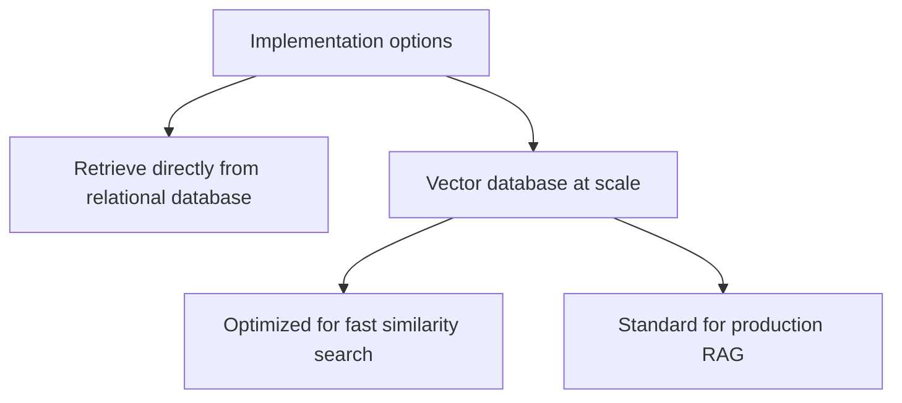

# The Retriever: How RAG Finds the Right Documents

## TL;DR

- **The problem:** an LLM only knows what it was trained on. You need to give it useful, relevant information it never saw, without also flooding its context window with noise.
- **The retriever** is the RAG component that finds the right documents for a prompt. It keeps a knowledge base of documents, builds an index over them, understands the meaning of the prompt, searches the index, and returns the most relevant documents.
- **Relevance is a number.** Each document gets a score quantifying how similar its text is to the prompt text; the highest scoring documents are returned.
- **The key trade-off:** return too many documents and you waste context window and cost; return too few and you miss relevant information ranked 2nd, 3rd, or 4th. A good retriever must both return relevant documents *and* withhold irrelevant ones.
- **Retrieval is not new.** Web search engines and relational databases do the same job; the information retrieval field predates LLMs by decades.
- **How it is built:** technically you can retrieve from a relational database, but in production, most retrievers sit on top of a **vector database**, a specialized database optimized for rapidly finding the documents that most closely match a prompt.

## 1. The problem: the LLM does not know your data

A large language model contains everything it learned during training, compressed into its weights. That knowledge stops at the training cutoff, and anything that is private, internal, or simply newer than the training data does not exist for the model. If you ask it a question that depends on information it never saw, it guesses, which is how hallucinations happen.

The purpose of the retriever should therefore be clear: it provides useful information to the LLM that was potentially not available when the model was trained. Without a retriever, the model answers from memory; with one, it answers from the documents you actually own.

The diagram shows the fork every RAG system faces: information must be injected before the model answers, or the answer is built from the model's memory alone.

## 2. What a retriever does

A retriever is the component of a RAG system that finds relevant documents. Breaking it down, it does three things:

1. It maintains a **knowledge base** of documents, and creates an **index** of those documents that keeps them organized and easy to search.
2. It **processes the prompt** to understand its underlying meaning.
3. It searches the index using that understanding, **ranks** documents by relevance, and returns the most relevant ones.

Understanding a retriever is easiest through an analogy, because you have used one your whole life: a library.

## 3. The library analogy

Imagine you want to answer the question "How can I make New York-style pizza at home?" and you visit a library. The library holds a large collection of books on many topics. To help you browse, the books are organized into sections and shelves based on characteristics of their topics, genre, authors, and so forth. When you share your question with the librarian, they can find the sections, or even the exact books, most relevant to your question.

Every part of that scene maps onto a retriever:

- Where the library has a **collection of books**, a retriever has a **knowledge base of documents**.
- Where the library **organizes books into sections and shelves**, a retriever **creates an index** of its documents that keeps them organized and easy to search.
- Where the **librarian understands the meaning of your question** and knows to look in the sections on cooking, Italian cuisine, or New York, the retriever **interprets the meaning of your prompt** to identify the right documents.
- Where the librarian **hands you the relevant books**, the retriever **returns the documents from the knowledge base** it determines are most relevant to the prompt.

The single most important idea in the analogy is that the librarian does **not** match your question to keywords. The librarian understands the *meaning* of "New York-style pizza" well enough to look in Italian cuisine and cooking sections. The retriever needs the same ability: understanding meaning, not just matching words.

## 4. The knowledge base and its index

Before anything can be retrieved, the documents have to be organized. A **knowledge base** is the collection of documents the system will search over. An **index** is the organized structure the retriever builds over that collection to make searching fast and effective.

The shape of the index matters because retrieval happens per prompt. Every search scans organized structures, not a pile of raw text. Without an index, finding relevant documents would mean examining every document for every question, which is too slow to be useful.

Just as library shelves turn a wall of unsorted books into a navigable collection, the index turns a pile of documents into something the retriever can search quickly.

## 5. How a retriever understands a query

The retriever does not search by exact words. It first processes the prompt to understand its underlying meaning, then uses that understanding to search the index. This is why the library analogy is not decorative: the "meaning understanding" step is a real component of the system, not an optional extra.

Different approaches to this meaning understanding exist, and the course this article came from covers them in depth. What matters for the mental model is that the retriever matches a question to documents by *what they are about*, not by which words they share.

## 6. Ranking: every document gets a relevance score

When the retriever completes its search, it ranks the documents in the knowledge base by how relevant they are to the prompt. Each document receives a **numerical score** quantifying its relevance. Usually this is some measure of the **similarity between the text of the prompt and the text of the document**. The documents with the highest scores are returned.

Scores are what make retrieval into a ranking problem rather than a yes/no problem. A document is almost never exactly relevant or exactly irrelevant; it has a degree of relevance, and the score captures that degree.

There are a variety of approaches to calculating these similarity scores. The choice matters, because the score decides both the quality of what is returned and what is left out.

## 7. The trade-off: too much context vs too little

This is the central tension of retrieval, and the point where a retriever is easy to misuse.

A well-designed retriever should return relevant documents, but it also needs to withhold irrelevant ones. Consider what happens at both extremes:

- **Return everything.** If you ask for information about making New York-style pizza and the retriever responds with all the documents in the knowledge base, you technically have every relevant document, but it is lost in a mountain of irrelevant information. As covered in the LLM completions article, this also means costly prompts or even entirely exhausting the LLM's context window.
- **Return only the single highest ranked document.** You might miss valuable relevant information sitting in the documents ranked 2nd, 3rd, or 4th.

In a perfect world, the retriever perfectly ranks the documents and chooses the exact right number of them to return. In practice, the retriever will sometimes rank some relevant documents too low and some irrelevant documents too high, making it hard to confidently decide how many to return.

## 8. Monitoring and tuning a retriever

Because retrieval quality is not guaranteed, a retriever is not a set-and-forget component. To optimize its performance you need to monitor it over time and experiment with different settings. The number of documents to return, the scoring approach, and the indexing strategy are all knobs to tune, and different knowledge bases respond to different settings.

The loop in the diagram is the practical reality of working with retrievers: measure how the system answers, change the retrieval settings, and measure again.

## 9. Retrieval is everywhere

Nothing in the retriever is new to LLMs. Many familiar pieces of software perform very similar tasks:

- A **web search engine** retrieves web pages that are relevant to a web search.
- A **relational database** retrieves rows and tables that match a SQL query.

The broader field of **information retrieval** was already mature when large language models were first developed, and ideas from that field underlie the way retrievers and RAG systems are designed. When you tune a retriever, you are practicing an engineering discipline that predates LLMs by decades.

This heritage matters because it means the tools, evaluation methods, and pitfalls of retrieval were studied long before RAG made the term popular. When in doubt, you can lean on that accumulated experience.

## 10. How retrievers are built: relational databases to vector databases

In theory there are lots of ways to implement the retriever in a RAG system. Since most companies already have their data in traditional relational databases, it would be nice to keep the data there and figure out a way to retrieve from that database to power a RAG system. These approaches exist and are viable.

While they are not strictly necessary, at scale most retrievers are built on top of a **vector database**: a specialized type of database optimized for rapidly finding the documents in your knowledge base that most closely match a prompt. The word "vector" refers to the representation used to measure the similarity from section 6: documents and prompts are turned into numeric vectors, and finding the closest match becomes a fast vector search.

Relational retrieval is a valid start, especially when the data already lives in a relational database. As the knowledge base grows and latency matters, a vector database becomes the typical choice.

## 11. Summary

The retriever is the part of a RAG system that supplies the LLM with information it was not trained on. It mirrors a library: a knowledge base of documents, an index to keep them organized, understanding of what the prompt means, and a ranked return of the most relevant documents based on numerical similarity scores. Its defining tension is that returning too much floods the context window while returning too little loses relevant information, so it must be monitored and tuned. Retrieval is an old discipline, visible in search engines and relational databases, and at production scale it typically runs on vector databases.

## Sources

- DeepLearning.AI, Building and Evaluating Advanced RAG course, module on the retriever. This article documents the lecture transcript supplied by the author; the library analogy, the relevance scoring explanation, and the vector database discussion follow it directly.
- Foundation of the retrieval idea: Lewis et al., "Retrieval-Augmented Generation for Knowledge-Intensive NLP Tasks", NeurIPS 2020, which frames LLMs as parametric memory augmented by a retriever: https://arxiv.org/abs/2005.11401
- AWS, "What is RAG", on using relevant information from an external source to ground answers: https://aws.amazon.com/what-is/retrieval-augmented-generation/