# The Evolving Developer: How AI Reshapes Software Engineering

Inspired by Jason Ku (Software Engineer at Meta) on how software engineering has changed since AI. Labs say code generation is faster than ever. Shipping has not gotten faster at the same rate. This article explains the paradox, where the bottleneck moved, and how developers must evolve to stay valuable.

---

## The paradox: faster coding, same shipping

The paradox is simple. Model vendors report dramatic gains in generation speed and code quality. Teams adopt AI for coding and see personal productivity rise. Companies do not ship features 10 times faster.

The confusion comes from equating **coding** with **shipping**. Coding is writing implementation. Shipping is delivering verified, tested, integrated, and operated value to users. Coding got faster. Shipping did not, because shipping was never just coding.

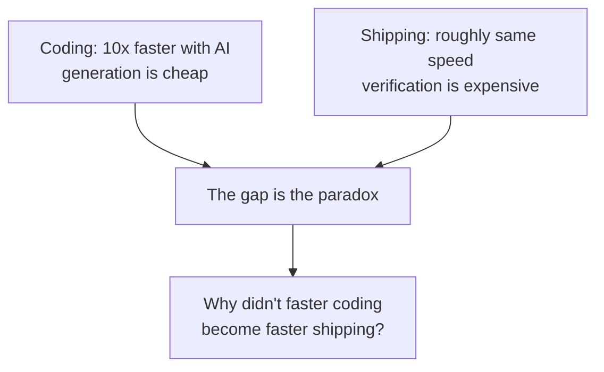

The answer is that software development is a chain, and AI made one link fast while the other links stayed slow.

---

## The SDLC as a chain

Classical software development is a chain of phases that feed each other. AI touches each phase differently.

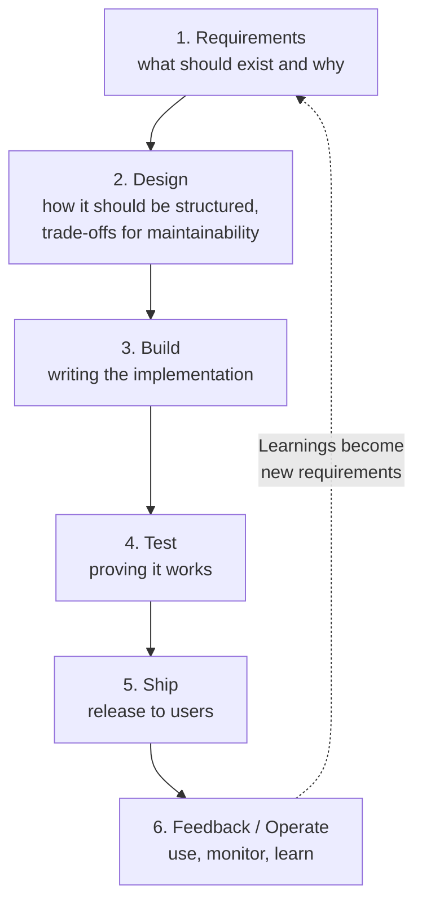

| Phase | Core question | Who owns it |
|-------|---------------|-------------|
| Requirements | What problem are we solving and for whom | Humans talking to users |
| Design | How should it be structured to last | Humans choosing trade-offs |
| Build | Write the code | Now largely AI-assisted |
| Test | Does it do what we intended | Humans defining correctness, AI generating cases |
| Ship | Is it safe and ready for users | Humans accountable |
| Feedback | What did we learn in production | Humans plus AI analysis |

**Problem:** treating these six phases as one thing called "coding". **Solution:** name the phase you are delegating, and keep human ownership where judgment is the product.

---

## The bottleneck has shifted

When one link in a chain gets faster, the chain does not get faster. It piles work in front of the next slowest link. This is the Theory of Constraints: any improvement not at the constraint is an illusion. DORA 2024 found the same pattern for AI specifically: generated code piled up in constrained review and integration stages, making lead times longer, not shorter.

Before AI, build was often the constraint. After AI, build is fast, so the constraint moves downstream to **review and verification**.

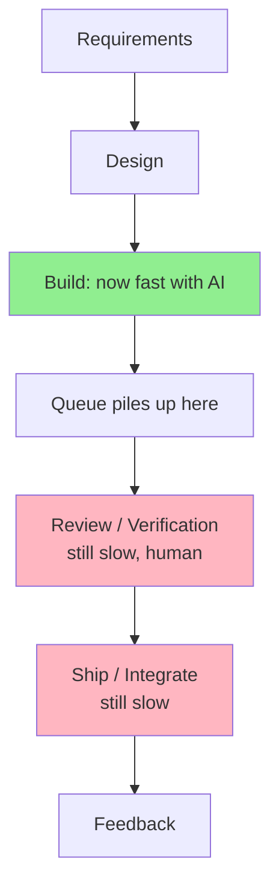

**Problem:** you generate faster than you can verify. Humans cannot read at the speed models write. Every hour of generation becomes hours of review.

**Solution:** bound generation. Decide up front how much code may be produced before a human reviews it. That bound is itself a requirement, not an afterthought. Startups ship faster today not because they code faster, but because they have condensed the chain: small cross functional teams, fewer handoffs, and tight feedback loops. The layers are thinner, so faster build actually reaches the user.

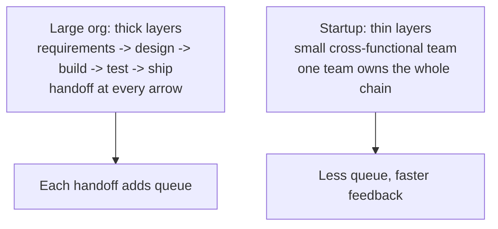

> Faster build without faster verification does not give you faster shipping. It gives you a longer review queue.

---

## Shipping is not coding

Shipping means the code has been tested, verified, integrated, and is safe to operate. Coding means a file was written.

In a company there are layers: product requirements, design review, build, code review, QA, release approval, monitoring, on call. If only the build layer was sped up, the average time through the layers barely changes. This is why the felt experience inside big companies is "we have AI but we do not ship 10 times faster", while the felt experience in a two person startup is "we shipped in a weekend". The startup removed layers. The enterprise kept them.

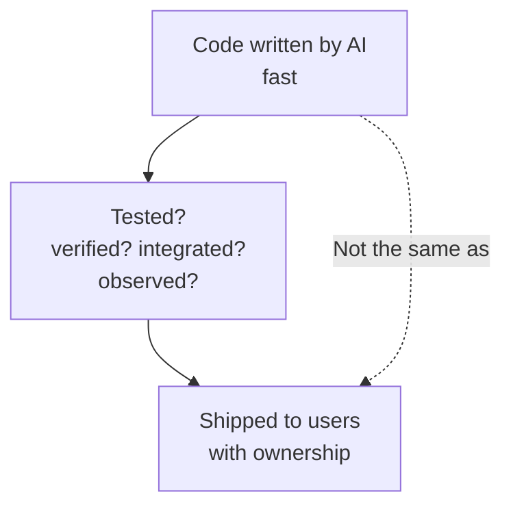

**Takeaway:** measure shipping lead time, not coding velocity. If your constraint is review or release cadence, pointing more AI at build will not move the metric.

---

## Design still decides the future

Even with perfect generation, design has not been automated away. Design is where you decide **trade-offs** that determine maintainability over years: module boundaries, coupling, state ownership, data consistency, failure modes, and how the system evolves.

AI can explore options and generate diagrams. A human must choose the direction and own the consequences.

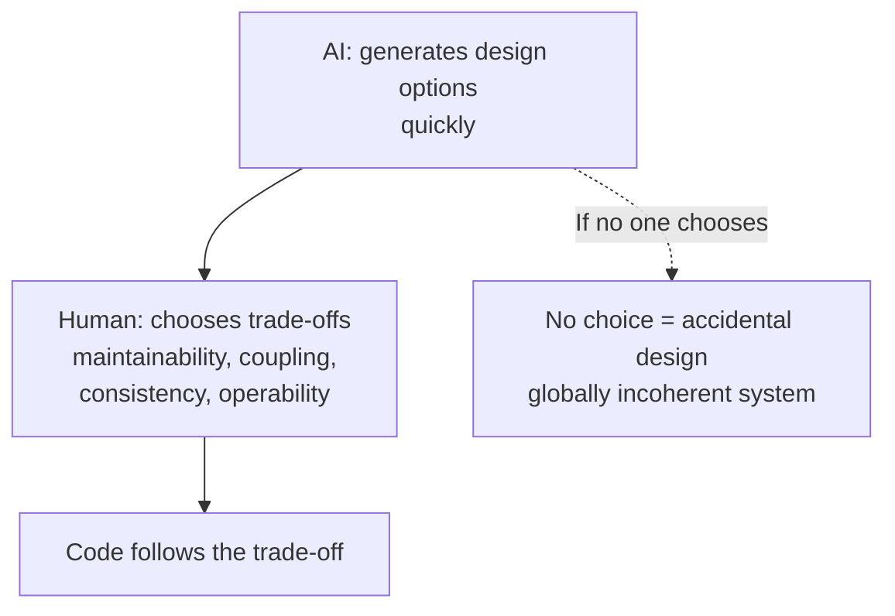

**Problem:** delegating design to a prompt ("build me an e-commerce site") delegates dozens of hidden decisions: cache strategy, database, payment and inventory modelling, session handling, refund semantics. The model picks defaults that are not wrong, just not yours. The pain surfaces later in test, ship, and operate.

**Solution:** keep requirements and design human-led. Use AI to summarise diffs, challenge assumptions, and surface risks. Do not let it silently decide the shape.

---

## Testing: AI helps, but you need understanding

AI has made real progress in test generation. You can generate unit, integration, and end to end tests, including black box tests that treat the system as an opaque behaviour. This is genuine leverage.

The catch is that testing itself requires understanding. To decide what "correct" means, what edge cases matter, and what risk you accept, you must understand the feature at some depth. Generated tests are also non-deterministic output from a non-deterministic system. If you use a non-deterministic tester to check non-deterministic generation, errors compound.

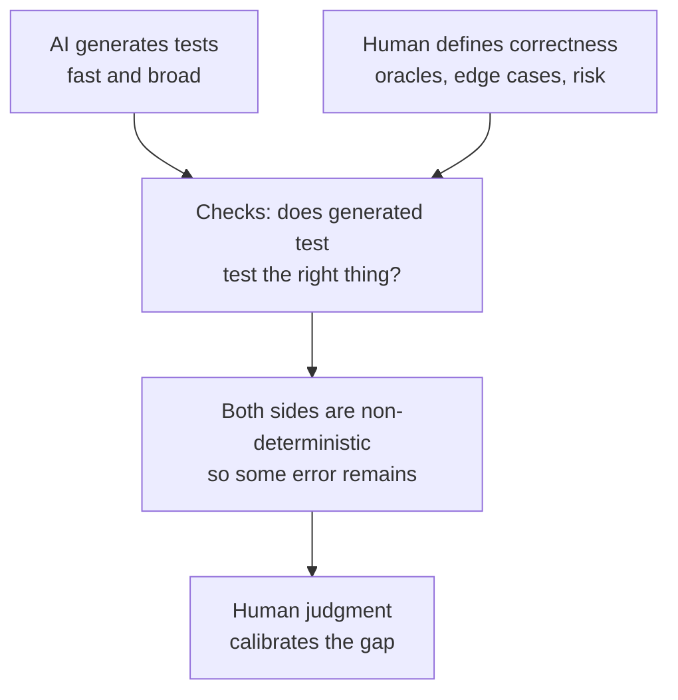

**Problem:** no amount of generated tests replaces the need for a human who knows what correct means. **Solution:** let AI draft tests, but review generated tests as carefully as production code. Calibrate automated judges against human grades (see engineering practices), and never treat a green suite as proof of good design. A suite can pass while the architecture is a tangle.

---

## The "almost right" problem

Modern code models are **almost right**. Almost is not a compliment. It is the most demanding correctness level for a reviewer.

When a system is almost right, failures are not obvious. They hide in one wrong conditional, a subtle coupling, a missing permission check, a misplaced transaction boundary. Finding them requires knowing what wrong patterns look like.

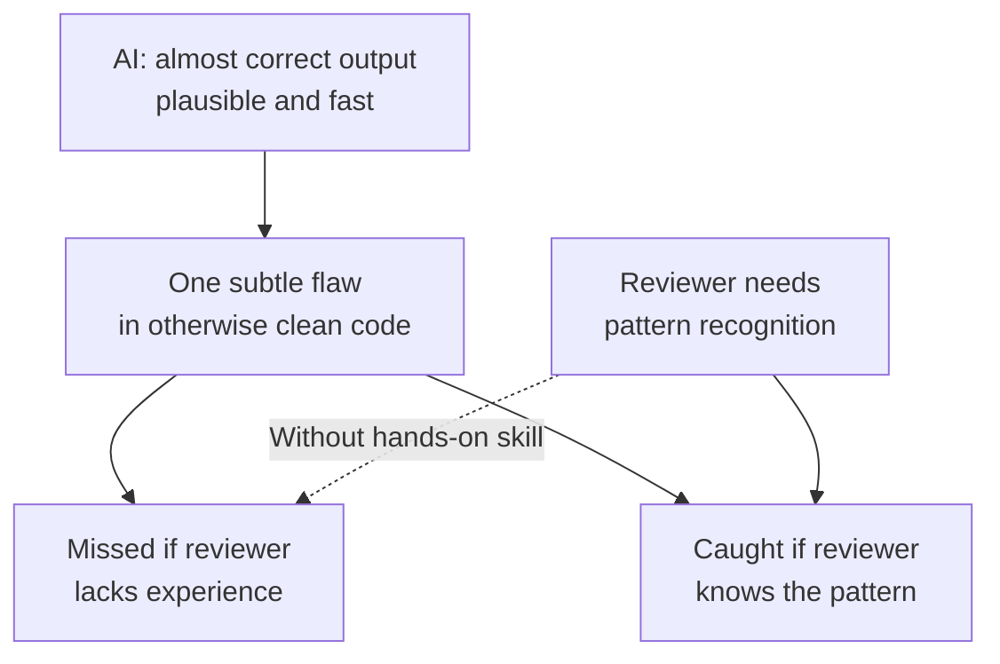

This answers the common question: why do we need trained engineers to review if anyone can prompt? Because **you cannot spot a wrong pattern you have never learned to write**. An untrained reviewer sees code that looks fine. An experienced engineer sees the coupling, the leaking abstraction, the wrong aggregate boundary, or the transaction that will violate consistency under concurrency.

AI does not remove the need for expertise. It moves expertise from *writing* to *recognising*. And recognition still needs years of doing.

---

## What developers actually do now

The role is shifting, not disappearing:

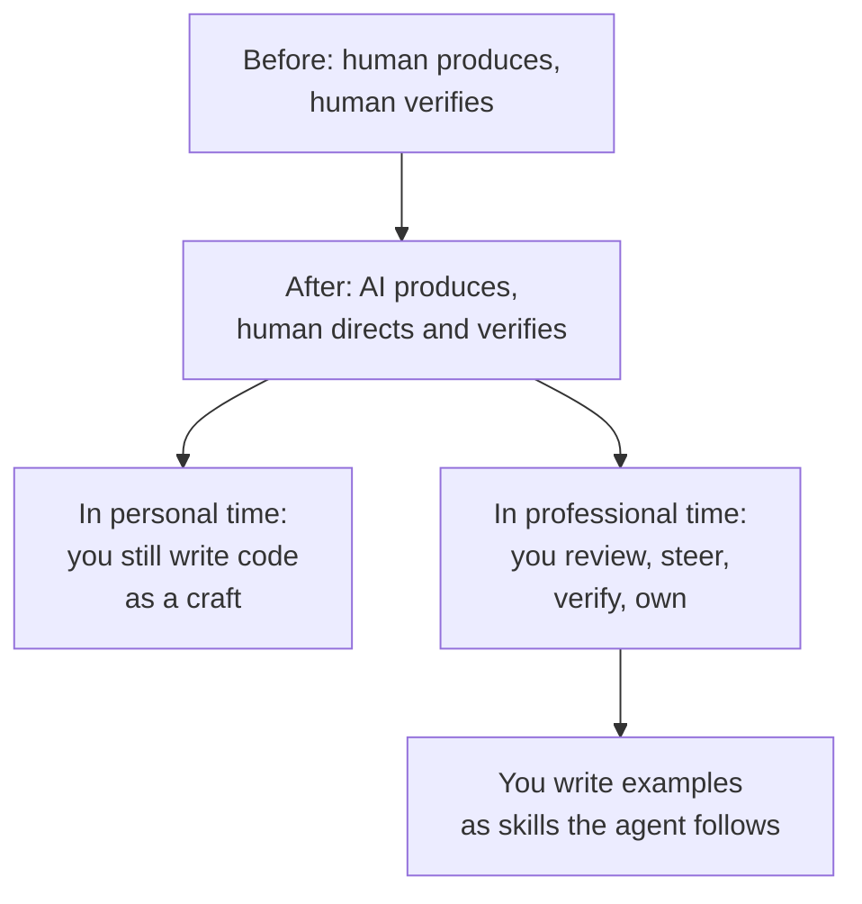

In professional work, you spend more time **reviewing, verifying, and steering**. In personal time, you keep your hands on the keyboard, because craft preserves judgment. You do not need to write every production line by hand. You do need to write enough to keep your pattern library fresh.

The concrete artifact for steering is the **skill file**: `AGENTS.md`, `SKILL.md`, `CLAUDE.md`, or equivalents. These are not prompts. They are curated examples of how you want the system to behave: conventions, boundaries, preferred patterns, out of scope lists, and acceptance criteria. The agent follows them. You maintain them like code.

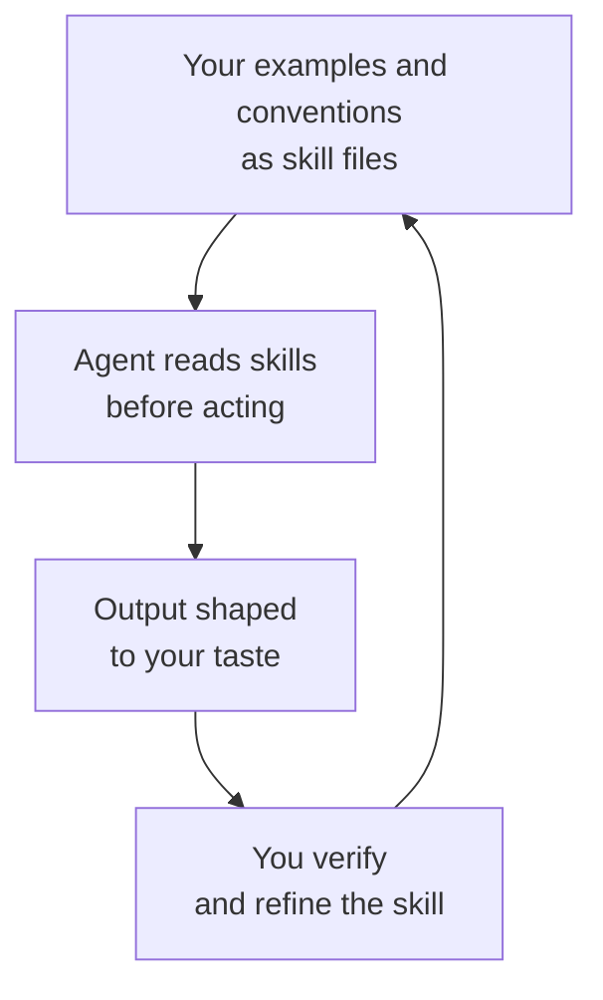

**Problem:** skill atrophy. If you never write, you stop being able to verify. **Solution:** deliberately practice. Build something end to end yourself every month, even if your day job is review. The verification skill decays faster than you expect.

See also: [Human Judgment & Verification](./human-judgment-and-verification.md) on the thinking vs grunt work split, and [Software 3.0](./software-3-0.md) on "you can outsource thinking, but not understanding".

---

## Developers must be product-minded

When the technical layers were thick, a developer could live inside one silo: given a spec, build a component, test it, hand it off. Business context was optional.

Condensed layers expose that setup. If one tech lead with AI can do the work of three or four developers, the justification for siloed headcount collapses, offshore or onshore. This matches what many teams already observed: offshore arrangements that were purely spec-in, code-out struggled because the team had the spec but not the **customer context**. They built what was asked, not what was needed.

Now the leverage forces a different shape: developers who know what the product is, what value it brings, who the user is, and how that value improves.

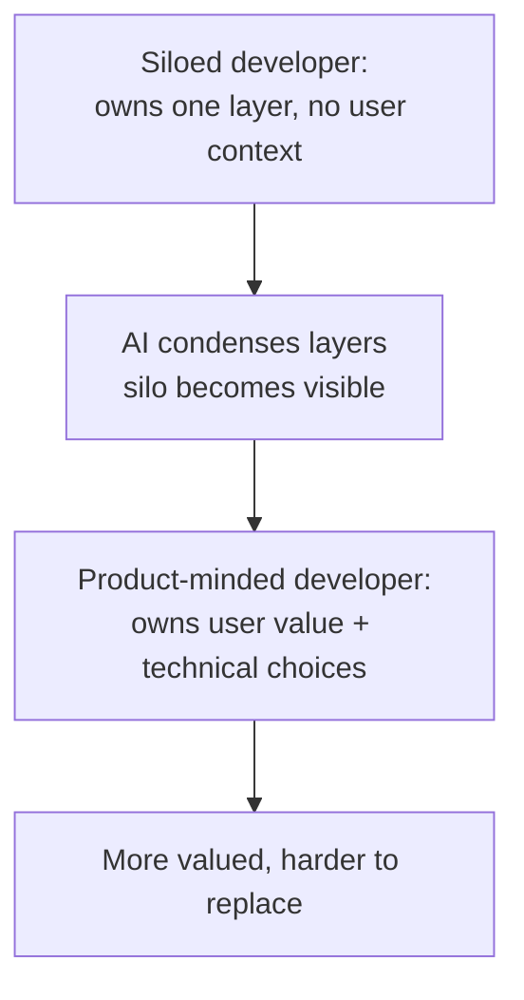

Even before AI, the developers companies valued most were product-minded: they could connect a technical decision to a user outcome. AI just makes that trait decisive. The remaining technical work is still real, but it is framed by product questions: who is this for, what constraint are we solving, what is the cheapest reliable way to deliver it, what does the user notice.

---

## Insights have a shelf life: why shipping still wins

There is a subtle and encouraging point. **Insights expire.** What is a differentiated insight today is common knowledge next quarter. Startups deal in insights, and learning is how they find them. Learning is not just studying architecture. It is the loop of talking to users, finding a problem they care about, solving it better, shipping, and learning again.

This is why technical condensation matters. When the cost of the build layer drops, the scarce resource becomes **connection to the user**. The teams that sit closest to the problem, ship fastest, and incorporate feedback fastest have the only durable edge: fresher insight.

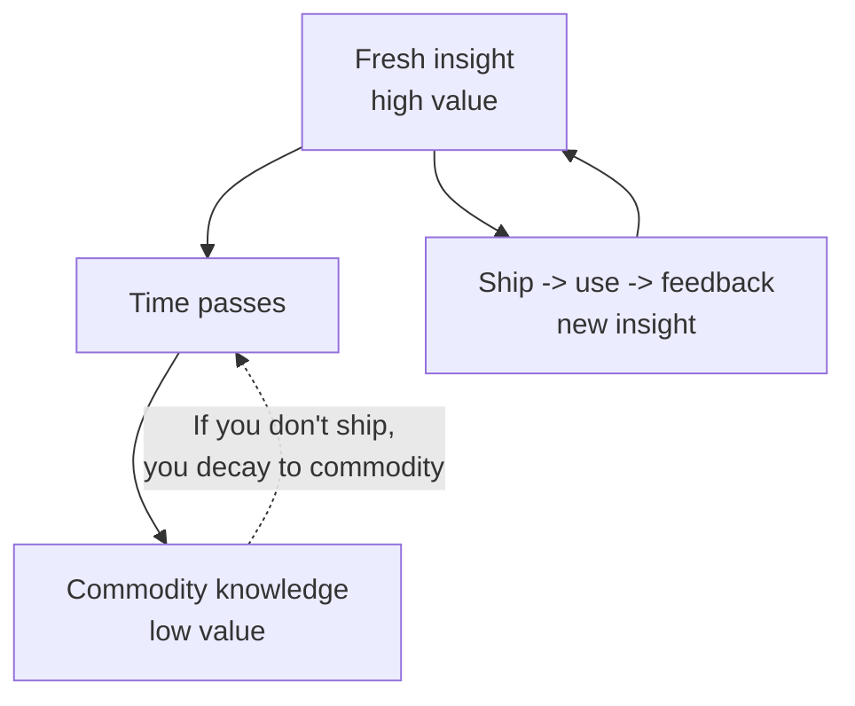

Earlier, technical complexity kept many engineers far from users by necessity. Now that complexity is condensed, staying far from users is a choice, and an expensive one.

Two second order effects follow:

**Where AI genuinely helps early in the chain** is in production insight: logs, traces, metrics, and incidents are rich, concrete context. AI is excellent at triage and pattern finding there. That insight complements user conversations; it does not replace them. Talking to users remains the only source of positioning and unstated constraints.

**Venture dynamics shift.** When one developer can do the work of several, early teams need less capital to reach meaningful revenue. Bootstrapped teams reaching 5 to 10 million in revenue without venture money are not an anomaly; they are what cheaper building predicts. Founders need less money, so they offer less equity, so venture investors find that traditional software verticals need them less. The rational response is to push capital toward the layer that *does* still need massive funding: AI infrastructure itself. Whether this fully plays out is uncertain, but the direction is plausible.

---

## Why SaaS is not dying

A common claim is that if anyone can generate software, no one will pay for software. Jason Ku pushes back with an analogy: many people *can* fix their car at home. Tools are available. They still pay someone else, because fixing a car costs cognitive load and physical effort. The trade is not about capability, but about focus.

The same applies to software.

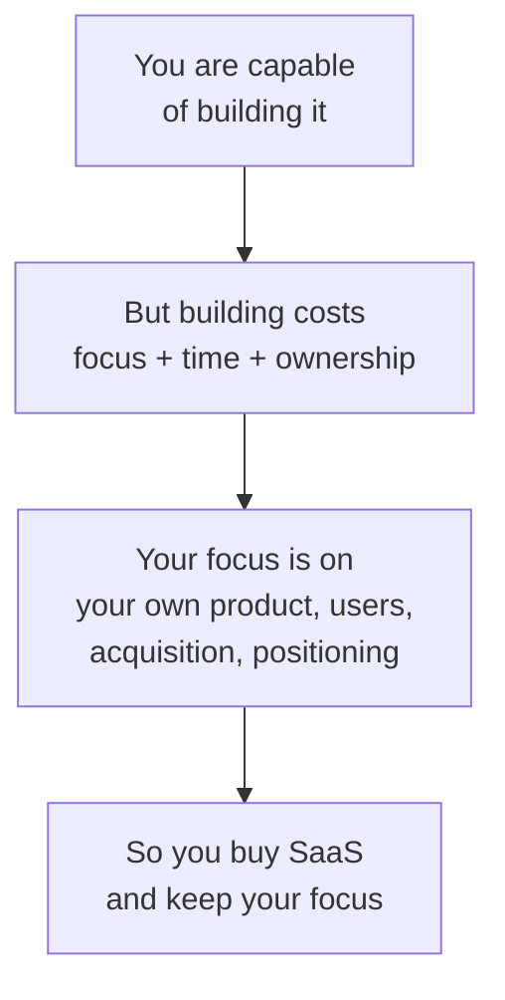

Even if you could generate a competitor to a SaaS you use, running it well means owning correctness, security, maintenance, and evolution. That is the very work AI has not made free: verification, design trade-offs, and operation. Companies buy SaaS not because they cannot build, but because building distracts from what only they can do for their customers.

---

## Putting it together: how to work now

### The recipe

1. **Name the constraint before you add AI.** If review is slow, point AI at summarising diffs, generating tests, and triaging logs, not just generating more code.
2. **Keep requirements human.** Gather context from users first; use AI to organise, challenge, and stress-test, not to invent what users want.
3. **Keep design human.** Let AI explore options, but a person chooses trade-offs and owns maintainability.
4. **Bound generation.** Set a limit on how much code may be produced before a human reviews it, and enforce it like any non-functional requirement.
5. **Verify like an engineer.** Treat AI output as junior contributor work: fast and useful, never merged without understanding.
6. **Practice the craft.** Write real code in personal time, even in one module. That practice is what preserves your ability to catch "almost right" flaws at work.
7. **Capture taste as skills.** Maintain `AGENTS.md` / `SKILL.md` files with concrete examples, conventions, and out of scope rules. The agent follows them, you verify them, you improve them.
8. **Become product-minded.** Know the user, the value proposition, and how your technical choices change that value. No silo survives condensed layers.
9. **Ship to learn.** Insights have a shelf life. The loop is ship, operate, analyse with AI, talk to users, and ship again.

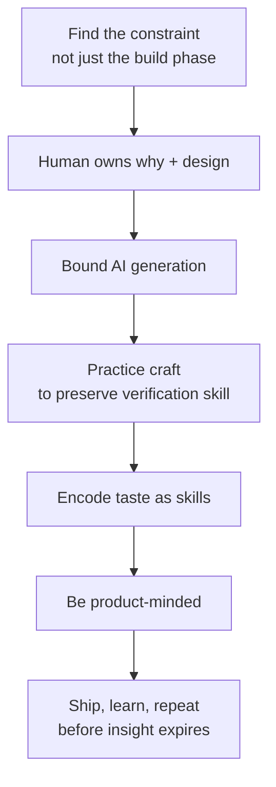

### When to do what

| Situation | What to do | Why |
|-----------|------------|-----|
| You want faster shipping | Find the bottleneck first (usually review or release) and apply AI there | Faster build alone lengthens the queue |
| You must decide architecture or trade-offs | Human decides, AI explores | Maintainability is a judgment call |
| You need tests | AI drafts, human defines correctness and reviews the tests | Generated tests need verification too |
| AI output looks correct | Verify it anyway | "Almost right" is the dangerous mode |
| You feel your review skill decaying | Write code by hand in personal time | Verification needs hands-on pattern knowledge |
| Agent output ignores conventions | Add examples to skill files and re-verify | Skills are the executable form of taste |
| You are far from users | Move closer: talk to them, ship, gather feedback | Insights expire; proximity is the edge |
| You debate building vs buying SaaS | Buy unless the SaaS is your core value | Building costs focus, not just code |

---

## Sources

- Jason Ku, Software Engineer at Meta. *How software engineering has changed since AI* (video talk). The paradox of faster generation without faster shipping, the SDLC walkthrough (requirements, design, build, test, ship, feedback), the shift of the bottleneck to review/verification, design trade-offs for maintainability, the "almost right" verification burden, startups condensing layers, small cross functional teams, the offshore silo point, product-minded developers, writing skills and examples for agents, SaaS not dying (car repair analogy), and the need to prevent skill atrophy by writing code as a craft.
- Andrej Karpathy. *Software 3.0* talk. Vibe coding, "you can automate what you can verify", you can outsource thinking but not understanding, jagged intelligence. Summarised in [Software 3.0](./software-3-0.md).
- Knowledge base. [Human Judgment & Verification](./human-judgment-and-verification.md). Every task splits into judgment (human) and grunt work (AI); non-determinism demands verification.
- Knowledge base. [Agentic Engineering](./agentic-engineering.md). Requirements first, scope in/out, verification, bounded parallelism, and the review/understanding problem with fleet generation.
- Knowledge base. [AI in the Software Development Lifecycle](../software-engineering/ai-in-the-sdlc.md). Over-delegation vs under-delegation, Theory of Constraints, requirements danger when AI has no user context.
- Goldratt, *The Goal* / *The Phoenix Project* framing of Theory of Constraints. "Any improvement not at the constraint is an illusion."
- DORA, *Accelerate State of DevOps Report 2024*. AI coding tools without addressing constraints piled code in review/integration and increased lead times.
- Steve Blank. *Customer Development: Get out of the building.* Requirements come from user conversations, not from model generation.

