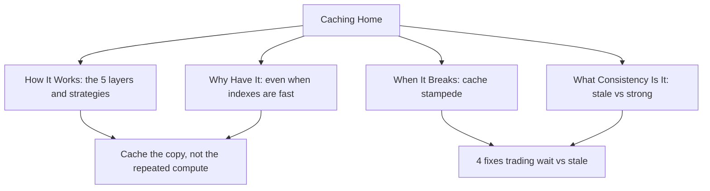

# Caching

> A cache is a faster copy placed closer to the reader. The moment you add one, you accept that the copy can differ from the source of truth. All of caching is choosing where the copy sits and how you keep it good enough.

## The Problem This Section Solves

A database read is not free. Even when it is fast, it is fast for one request; a million requests multiply that cost, and the database is a shared, contended resource that also has to serve writes. Caching exists to remove the repeated work, so the database only does real work on real changes. The rest of the section is about where the copy sits and what to do when the copy goes wrong.

## Read These In Order

-   [The 5 Layers and Strategies](./how-it-works.md) - the fundamentals article: how caching works, the 5 layers, and the write and invalidation strategies
-   [Why the Cache - even when indexes are fast](./why-cache.md) - the index speeds up the lookup, the cache removes the repeated work, and reading from Redis is cheaper than reading from the database, in both money and time
-   [Cache Stampede](./cache-stampede.md) - when the cache expires and the database falls over, and the 4 fixes that trade wait versus stale
-   [Stale is Eventual](./stale-is-eventual.md) - why serving stale is bounded eventual consistency
-   [Strong vs Eventual Cache](./strong-vs-eventual-cache.md) - the two flavours: lock for strong, stale for eventual

## The Shape of the Section

