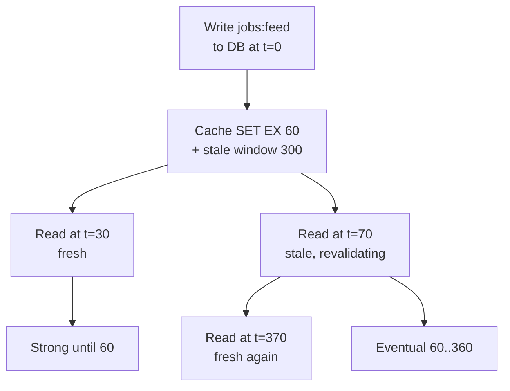
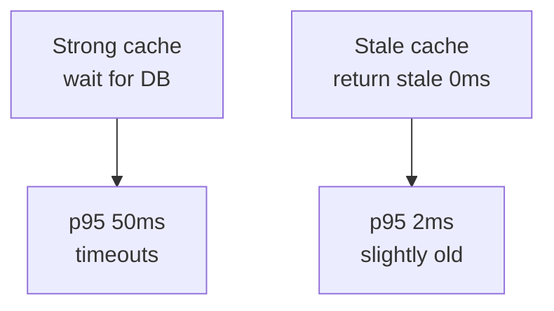
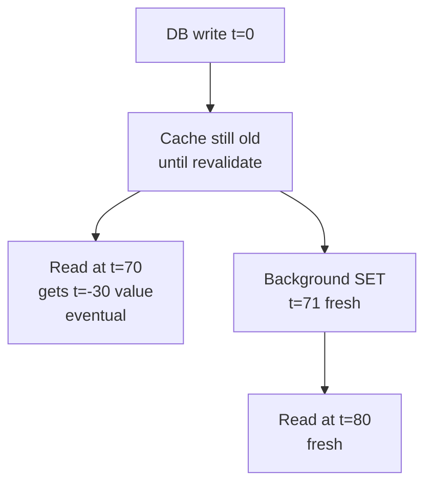
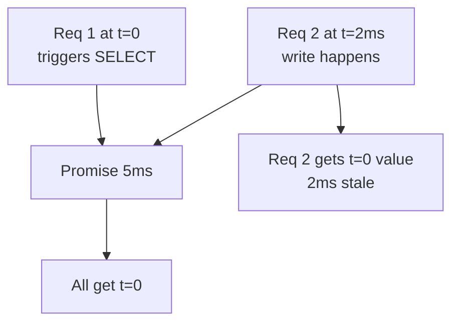
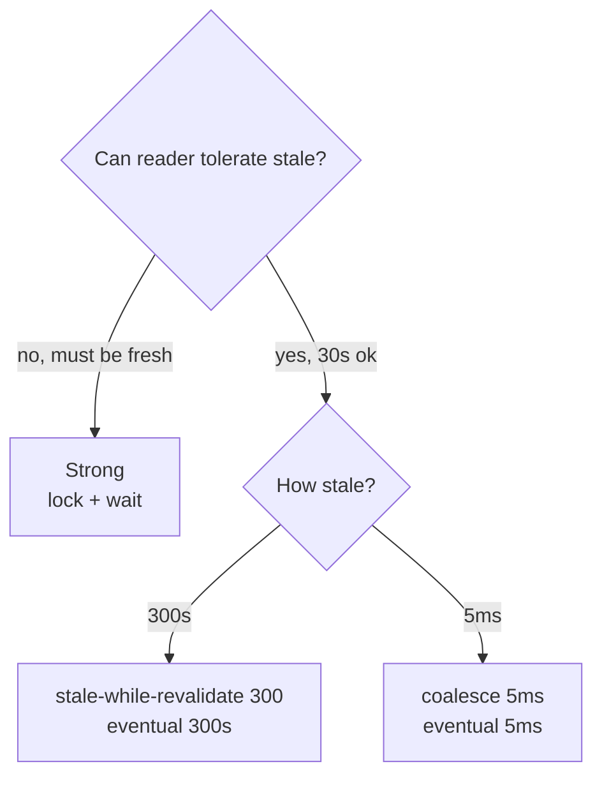

# Stale is Eventual - the cache consistency nuance

Serving stale is not a bug in the cache. It is the cache choosing eventual consistency on purpose, with a bounded window you set.

<div style={{display: 'flex', justifyContent: 'center'}}>



</div>

Sources: Werner Vogels (Dynamo eventual), Kleppmann DDIA ch5, Yu & Vahdat bounded staleness, MDN `stale-while-revalidate`, Cloudflare, RFC 5861.

---

## What problem serving stale solved and why it was necessary

### Problem it solved

Strong cache (never serve stale, always wait for DB) protects freshness but kills availability. On stampede, 1000 clients wait 50ms for the lock, p95 spikes, timeouts cascade.

### Why stale was necessary

Production needs availability and low latency even when the DB is slow. `stale-while-revalidate` returns stale in `0ms` and revalidates in background. The writer still goes to DB (strong), readers get a slightly old view that converges after `max-age + stale window`. That is bounded eventual consistency.

<div style={{display: 'flex', justifyContent: 'center'}}>



</div>

---

## 1. The DB is strong, the cache is eventual

### Problem

You write `jobs:feed` to Postgres. Postgres is strong — the next `SELECT` sees the write. But `GET jobs:feed` from Redis may still return the old JSON for 60s.

### Solution

Two stores, two models. DB is strong, cache is eventual bounded by `max-age`. This is intentional, not a bug. You pick the bound: `max-age=60, stale-while-revalidate=300` =Reads can be `300s` behind writes, then converge. PACELC says: even without partition, you trade latency vs consistency.

```http
Cache-Control: max-age=60, stale-while-revalidate=300
# 0..60 strong, 60..360 eventual bounded, 360+ miss
```

<div style={{display: 'flex', justifyContent: 'center'}}>



</div>

If you need strong reads, bypass cache or use `must-revalidate`. For QuickHire feed, 30s stale is fine, so eventual is the right trade.

---

## 2. Coalescing is also eventual, just a tiny window

### Problem

`inflight Map` coalesces 100 parallel `GET jobs:feed` into 1 `SELECT`. The 100 clients all get the same result, even though a write happened 5ms after the first `SELECT` started.

### Solution

Coalescing window is `5ms`, not `300s`, but it is still eventual. All 100 reads share one DB round trip. With 10 instances, window is still `5ms` per instance, so 10 DB queries, not 1000.

```js
// 100 parallel GETs share one promise for 5ms
if (inflight.has('jobs:feed')) return inflight.get('jobs:feed')
```

<div style={{display: 'flex', justifyContent: 'center'}}>



</div>

This is why the article says `coalescing per instance → 100→1, 10 instances →10`. Smaller window, same model.

---

## 3. How to decide the bound

<div style={{display: 'flex', justifyContent: 'center'}}>



</div>

| Need | Use | Window | Consistency |
|---|---|---|---|
| `GET /jobs/1` detail, must be fresh | Mutex lock, wait | 0 | Strong |
| `GET /jobs` feed, 30s ok | `stale-while-revalidate 300` | 300s | Bounded eventual |
| 100 parallel hits | `inflight` coalesce | 5ms | Bounded eventual (tiny) |

---

### Links

*   Vogels - Eventually Consistent (Dynamo), Kleppmann DDIA ch5 - replication and eventual
*   MDN `Cache-Control: stale-while-revalidate`, RFC 5861
*   Cloudflare - stale-while-revalidate, Yu & Vahdat - bounded staleness
*   ./cache-stampede.md - full stampede fixes
*   ../api/rest.md - `Cache-Control` directives
