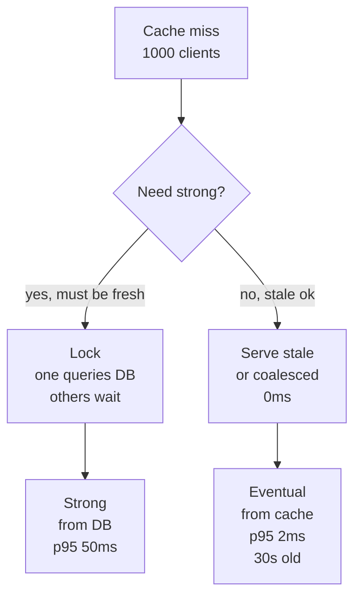
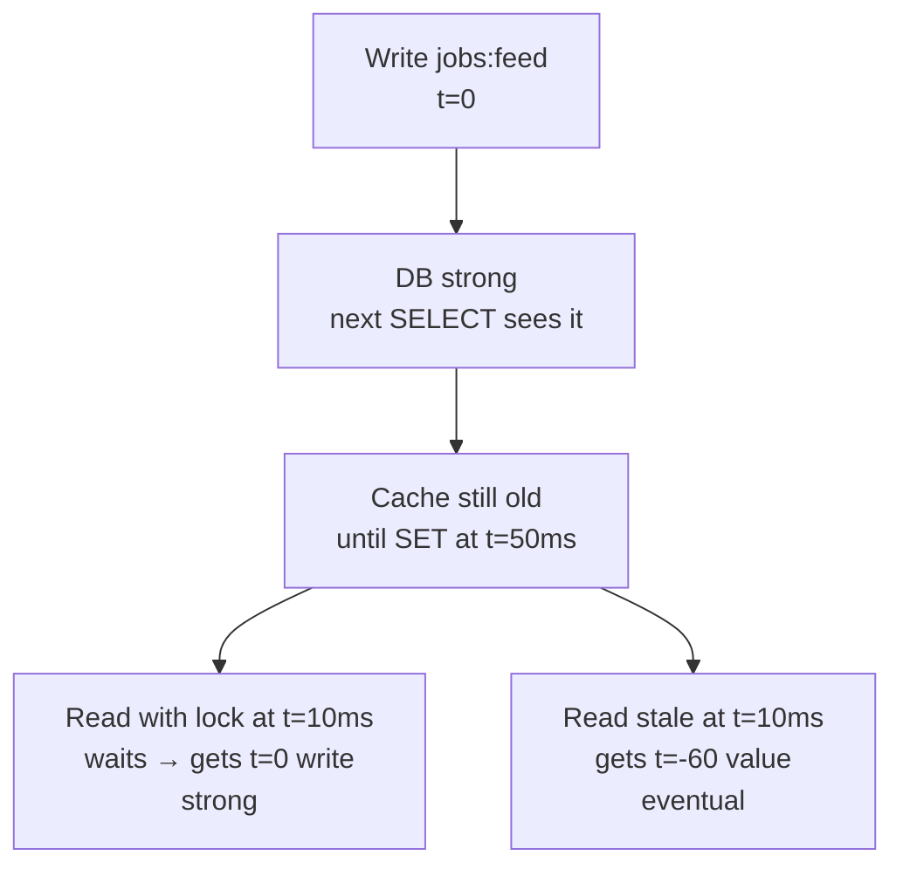
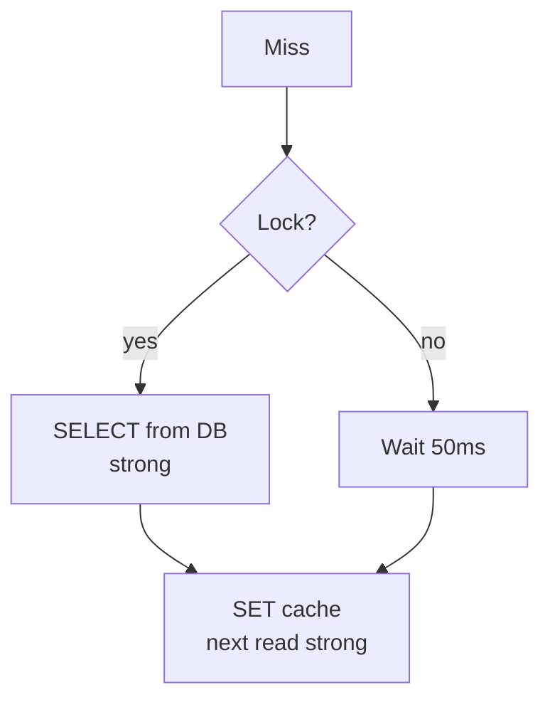
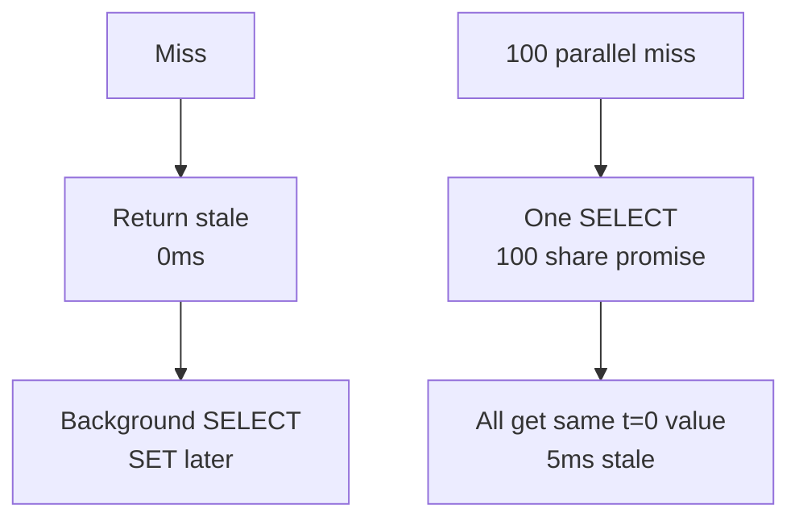
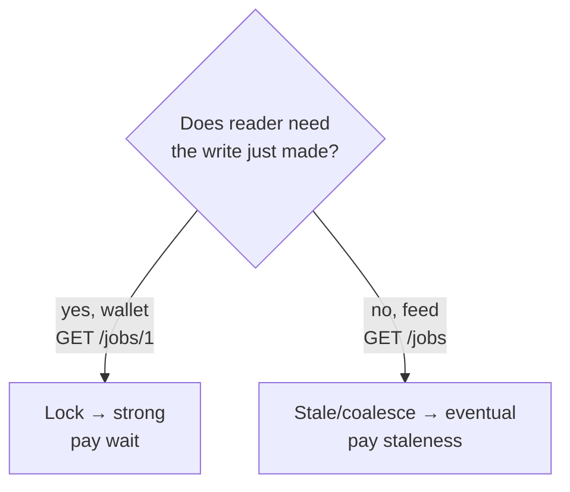

# Strong vs Eventual Cache - the two flavours

There are only two ways to handle concurrent reads on a miss. Lock and wait for strong data from the source of truth, or return stale quickly and be eventual. This is not cache specific. It is the same PACELC trade that appears in every replicated system: even without a partition, you choose latency or consistency.

This pattern shows up in cache stampede, but also in DB replicas, CDN, and read-through caches. Lock optimizes for freshness, stale optimizes for speed.

<div style={{display: 'flex', justifyContent: 'center'}}>



</div>

Sources: Kleppmann DDIA ch5 (replication = eventual), Vogels 2008 Eventually Consistent (Dynamo, stale reads are eventual), Abadi PACELC 2010 (Else choose Latency or Consistency), Redis `SET NX EX` docs (lock returns OK), Cloudflare and RFC 5861 `stale-while-revalidate`, MDN `Cache-Control`. Checked: Vogels and PACELC do call serving stale bounded eventual, not strong.

---

## What problem each flavour solved and why it was necessary

### Lock - strong

**Problem it solved:** Clients need the freshest value. `GET /jobs/1` after a write must see the write.

**Why necessary:** The DB is the source of truth. Lock ensures only one `SELECT` runs, its result is written to cache, and every waiter reads that fresh value. No stale window. Used when money, auth, or inventory is involved.

### Stale - eventual

**Problem it solved:** Clients need low latency and availability, not freshness. `GET /jobs` feed can be 30s old.

**Why necessary:** Waiting for the lock hurts p95 and creates a retry herd. Serving stale returns in `0ms` and revalidates in background. The cache converges after `max-age + stale window` — bounded eventual consistency.

<div style={{display: 'flex', justifyContent: 'center'}}>



</div>

---

## 1. Flavour 1 - lock is strong

### Problem

You cannot serve stale. Job detail, wallet balance.

### Solution

`SET NX EX` lock. One builds from DB, others wait and retry with backoff. Result is strong because it comes from DB.

```js
const locked = await redis.set('jobs:1:lock', uuid, 'NX', 'EX', 5) // NX = only if not exists, EX = auto-expire
if (locked) {
  const data = await db.query('SELECT * FROM jobs WHERE id=$1', [1]) // strong
  await redis.set('jobs:1', JSON.stringify(data), 'EX', 60)
  await redis.del('jobs:1:lock')
  return data
} else {
  await sleep(50) // wait, then retry
}
```

<div style={{display: 'flex', justifyContent: 'center'}}>



</div>

Cost is wait. p95 includes the `50ms`. Benefit is every read after `SET` is fresh.

---

## 2. Flavour 2 - stale or coalesced is eventual

### Problem

You can tolerate stale. Feed, listing, profile.

### Solution

Return stale immediately, or share the in-flight promise. No wait.

```js
// stale-while-revalidate
let entry = await redis.get('jobs:feed:stale') // keeps stale 300s after logical expiry
if (entry && entry.expiresAt < Date.now()) {
  refreshInBackground() // revalidate, don't block
  return entry.data // 30s old, 0ms
}

// coalescing — 100 parallel share one SELECT for 5ms
if (inflight.has('jobs:feed')) return inflight.get('jobs:feed')
```

<div style={{display: 'flex', justifyContent: 'center'}}>



</div>

Cost is staleness. Benefit is p95 stays `2ms`.

---

## When to pick which

<div style={{display: 'flex', justifyContent: 'center'}}>



</div>

| Need | Flavour | Reads from | Consistency | p95 |
|---|---|---|---|---|
| Must be fresh | Lock | DB | Strong | `50ms` wait |
| Can be 30s old | Stale/cache/inflight | Cache | Eventual bounded `30s` or `5ms` | `2ms` |

This is the trade: **consistency vs latency**. PACELC (Abadi 2010) says Else (no partition) you still choose Latency or Consistency. Lock pays latency for strong, stale pays staleness for low latency. Verified against Vogels and DDIA: bounded staleness is the textbook example of eventual consistency.

General rule: if the read must see the write you just did, wait with lock. If the reader can be 30s or 5ms behind, serve stale and converge in background. You optimize for fresh or for speed, not both.

---

### Links

*   ./cache-stampede.md - 4 fixes in detail
*   ./stale-is-eventual.md - bounded staleness windows
*   Vogels 2008 - Eventually Consistent (allthingsdistributed.com)
*   Abadi 2010 - PACELC (dbmsmusings, Wikipedia PACELC) — Else choose Latency or Consistency
*   Kleppmann DDIA ch5 - replication and eventual consistency
*   Redis `SET NX EX` docs - `SET resource-name anystring NX EX` lock
*   MDN `Cache-Control`, RFC 5861 `stale-while-revalidate`, Cloudflare SWR
