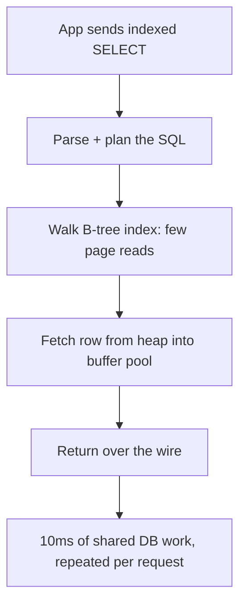
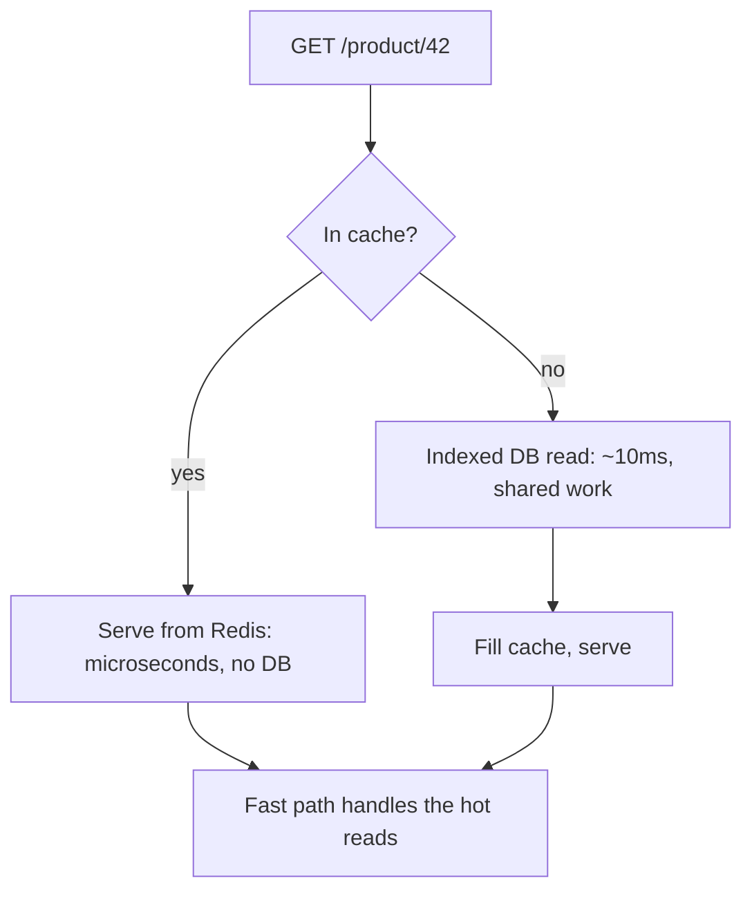
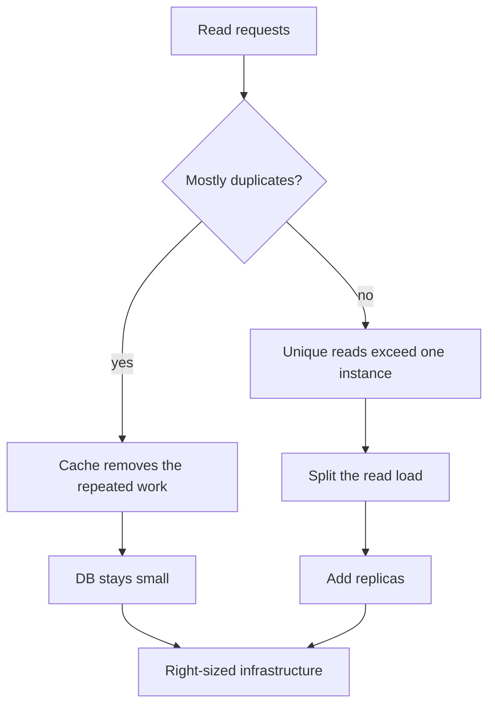

# Why Do We Need a Cache - Even When Indexes Are Fast

> "If the query is indexed, the database can find the row fast. Do we even need a cache?" Yes. An index makes a single lookup fast. A cache removes the lookup entirely. That difference is the whole point.

## The Problem: The Index Only Speeds Up the Lookup

The argument sounds reasonable: "I added an index, so my `SELECT` is 100x faster. The database read is no longer the bottleneck, so caching is unnecessary."

The mistake is in what an index optimizes. An index turns a full table scan into a B-tree lookup, which is `O(log n)` row finding instead of `O(n)`. That is real and important. But finding the row is only a slice of what a database read actually costs. Even on a fully indexed query, every read still pays for:

-   SQL parsing and planning before the query runs
-   Walking the B-tree index, touching multiple pages in memory or on disk
-   Fetching the row from the heap and reading it into the buffer pool
-   Contending for the same connection pool, locks, CPU, and disk as every other query
-   A network round trip back to the application

So an indexed read that "takes 10ms" is 10ms of shared work executed against a contended resource on every single request. The index removed the full scan; it did not remove the read.

## The Real Cost Is Repetition, Not Single-Read Latency

One 10ms read is nothing. A million 10ms reads are 10,000 seconds of database work per hour. A single client hitting the database looks cheap; a traffic spike does not. The hottest rows are read thousands of times a second and change a few times a day, which means the same index, the same pages, and the same CPU are recomputing the same answer over and over.

An index does not change this. It makes each repetition cheaper, but the repetition itself is still billed to the database. Caching is what removes the repetition: compute the answer once, keep it where it is cheap to read, and serve that copy on the hot path. The database only does real work on real changes. As AWS puts it, caching "can improve read latency, read throughput, user experience, and overall efficiency, as well as reduce costs" ([AWS Well-Architected, PERF03-BP05](https://docs.aws.amazon.com/wellarchitected/latest/performance-efficiency-pillar/perf_data_access_patterns_caching.html)).

## The Time Argument: Remove the Process, Not Just the Disk

Even the best case is still repeated overhead. The dramatic 10,000x gap between memory and disk ([Jeff Dean and Peter Norvig, Latency Numbers Every Programmer Should Know](http://norvig.com/21-days.html)) applies to the cold path, when the row has to come off disk. Hot rows may already sit in the database's own RAM buffer pool, so that read is memory-resident too. The remaining difference is not physics but process. An indexed read still parses and plans the SQL, takes a connection, acquires locks, serializes, and ships the row over the network. A Redis read skips all of that and serves from RAM in sub-millisecond time. A disk-bound indexed lookup, meanwhile, still lands in double-digit milliseconds, because disk retrieval "plus the added query processing times generally will put your query response times in double-digit millisecond speeds" ([AWS Database Caching](https://aws.amazon.com/caching/database-caching/)).

If the application needs a sub-100ms response time SLA, the arithmetic does not leave room for a database round trip on every request, indexed or not. The cache is what keeps the fast path in RAM.

## The Money Argument: Preserve Database Cycles for Writes

Scale has a price. Growing the database by buying a larger instance or adding read replicas is expensive, and it scales the wrong thing: it pays for capacity to serve the same repeated answer. Caching uses cheap RAM to absorb read traffic, and in read-heavy workloads with a power-law access pattern (a few hot rows get most of the hits) a cache commonly absorbs 80% to 90% of read traffic. That lets the primary database only handle writes and real changes, which is exactly where its capacity is scarce. It stays small, which is the cheapest operational outcome.

It is also a correctness win. Database CPU and connection slots spent on repeated `SELECT`s are the same CPU and slots the `INSERT` and `UPDATE` traffic needs. Offloading reads protects write latency, which a cache cannot be wrong about.

## Index and Cache Are Different Layers, Not Rivals

The confusion comes from treating the index and the cache as two answers to the same question. They are answers to different questions:

-   The index answers: "when I do have to read the database, how do I find the rows fast?"
-   The cache answers: "how often does the application actually need to touch the database at all?"

A useful rule of thumb: add an index when a query must still hit the database and is slow. Add a cache when a query is fast but runs far more often than the data changes. The popular product page is the standard example: thousands of users request the same trending product at the same moment. The index makes each of those requests as fast as a database read can be. The cache makes the database not feel the spike at all, the "thundering herd" never reaches it.

## When You Do Not Need a Cache

Be honest about the thresholds. Skip the cache when:

-   Total read QPS is well under what a single instance sustains for your workload. The number depends on row size, query complexity, hardware, and connection pooling: simple row lookups on a tuned instance may do a few thousand QPS, while heavy scans do far less. Measure your own ceiling, do not assume a universal number
-   Data changes so fast that the cache invalidates every few seconds, making every read a miss plus a refill
-   The dataset is tiny enough to live entirely in the database buffer pool, where the database is already serving from RAM

## When the Cache Has No Work Left: Scaling the Database

The cache removes duplicated work. It does nothing for unique work. If traffic is 1000 requests per second and every request targets a different row, the cache hit rate collapses to zero because there is no repeat read to absorb. Get 1000 unique reads per second against an instance that can serve 1000 per second, and the database saturates regardless of how well the cache is tuned. That saturation is the permission to invest in the database.

The decision rule is a split, not a hierarchy:

-   **Cache** solves the access pattern where many requests repeat a few hot rows.
-   **Replicas** solve the access pattern where many unique rows each get read once, because the read volume exceeds one node.

Each tool is the answer to a different question, and both get turned on together when both problems exist. Replicas also buy a second benefit the cache cannot: they move reads off the primary, which keeps write latency stable, and they give the system a failover node. But the trigger for adding them is the same one as in the 1000 unique reads example: unique-read throughput against the remaining instance capacity.

## The Solution in One Line

The index makes the database read fast. The Redis read is faster, and it costs less money and less shared database capacity. That is why the cache is not optional, it is the cheapest correct way to serve the hot read path. The database earns its keep doing what needs doing once.