# Database Consistency & Availability Comparison

How different databases trade off consistency, availability, and performance and when to pick which.

## Theoretical Frameworks

### CAP Theorem

In a distributed system, you can only guarantee two of three:

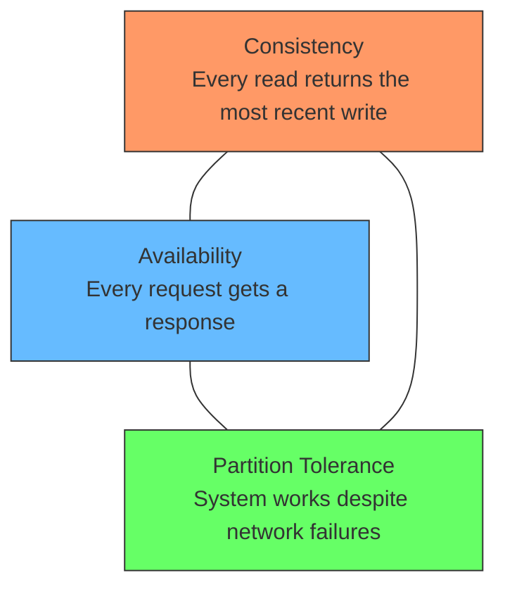

In practice, **partition tolerance is mandatory** networks fail. So the real choice is:

- **CP** sacrifice availability during partitions (return errors rather than stale data)
- **AP** sacrifice consistency during partitions (return stale data rather than errors)

### PACELC

Even when there's no partition, there's a tradeoff between latency and consistency. PACELC extends CAP by asking: when the network is healthy, do you optimize for speed or correctness?

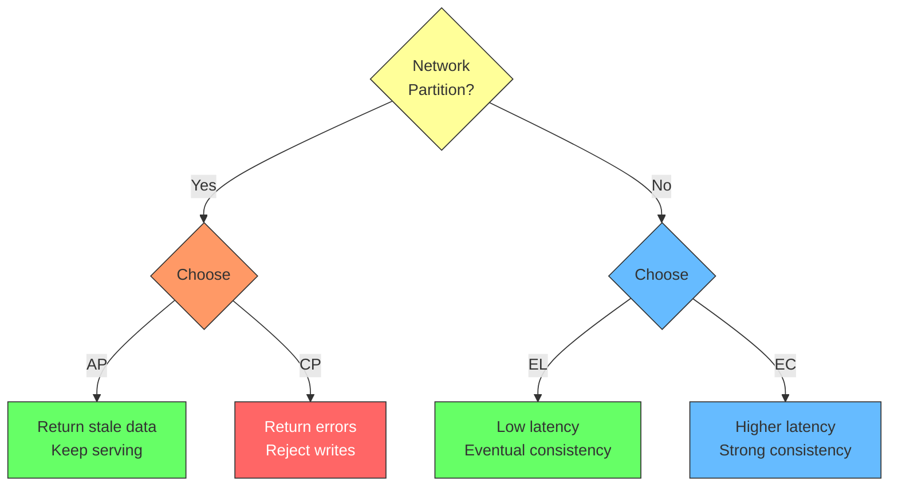

This explains why some databases are fast but eventually consistent, while others are slow but strongly consistent. PostgreSQL prioritizes EC (strong consistency even when healthy), while Cassandra prioritizes EL (speed when healthy).

## Database Profiles

### PostgreSQL The Reliable Classic

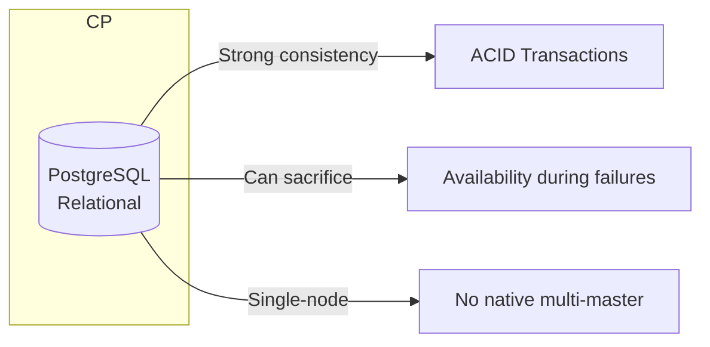

**Classification**: CP

**Consistency model**: Strong. Full ACID compliance. Every transaction moves the database from one valid state to another, with partial failures rolled back and concurrent operations isolated from each other.

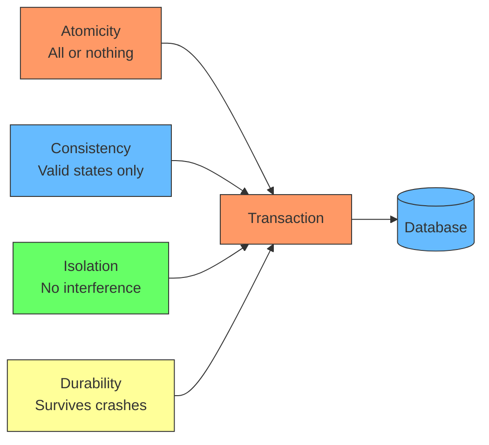

Each letter of ACID guarantees something specific: Atomicity ensures partial failures roll back completely. Consistency ensures every transaction leaves the database in a valid state. Isolation ensures concurrent transactions don't interfere with each other. Durability ensures committed data survives crashes via WAL.

Every transaction sees a consistent snapshot. Uses MVCC (Multi-Version Concurrency Control) for concurrency: readers never block writers, writers never block readers. Each transaction sees data as it existed at `BEGIN` time. Old row versions are cleaned up by VACUUM.

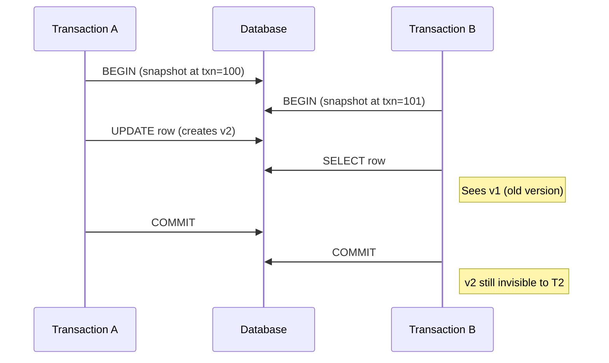

Each row has hidden columns: `xmin` (transaction that created it) and `xmax` (transaction that deleted/updated it). PostgreSQL checks these to determine visibility for each transaction's snapshot.

→ See [PostgreSQL MVCC Deep Dive](./postgresql-mvcc.md) for architecture, visibility rules, WAL, and VACUUM internals.

**Availability**: Single primary, streaming replicas for read scaling. If the primary dies, manual or automated failover (Patroni, repmgr). Not multi-master.

**Strengths**:
- Decades of battle-tested reliability
- Rich SQL, complex queries, joins, CTEs
- Extensible (PostGIS, pgvector, custom types)
- Predictable behavior under load

**Weaknesses**:
- Write scaling limited to one primary
- Failover is not instantaneous
- Not designed for geo-distributed writes

**Use cases**: Financial systems, ERP, anything requiring strict consistency and complex queries.

### Cassandra The Availability Champion

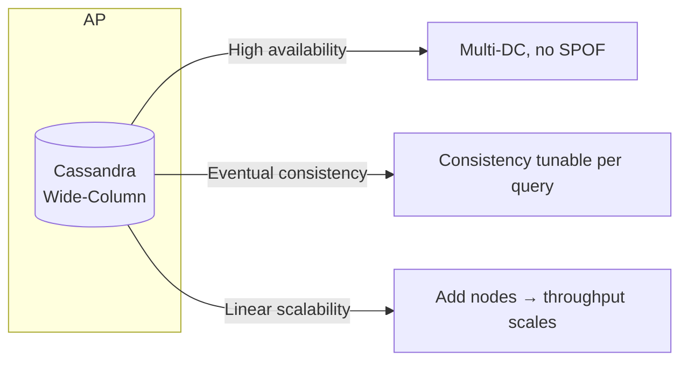

**Classification**: AP (tunable to CP per-query)

**Consistency model**: Eventual by default. Tunable per query with `ONE`, `QUORUM`, `ALL`. Using `QUORUM` with replication factor 3 gives strong consistency for reads and writes. You control the consistency level per query, not per database.

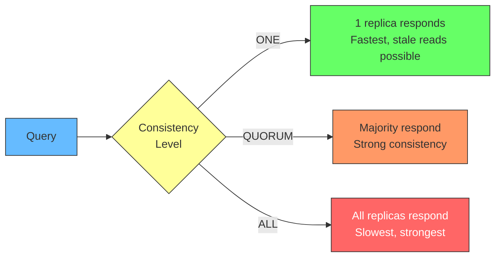

With `QUORUM` and replication factor 3, you need 2 of 3 replicas to acknowledge. This guarantees overlap between read and write quorums, ensuring strong consistency when needed.

**Availability**: Zero single points of failure. Masterless architecture every node can accept reads and writes. Data is replicated across nodes and data centers.

**Strengths**:
- Linear horizontal scalability (add nodes, throughput increases)
- Multi-datacenter replication built-in
- Tunable consistency per query
- Excellent write throughput

**Weaknesses**:
- No joins, no complex transactions (lightweight transactions exist but are slow)
- Query-first data modeling you design tables around your queries, not relationships
- Read-before-write complexity for updates
- Operational complexity (repair, compaction, tombstones)

**Use cases**: IoT telemetry, time-series data, write-heavy workloads, multi-region applications.

### MongoDB The Flexible Middle Ground

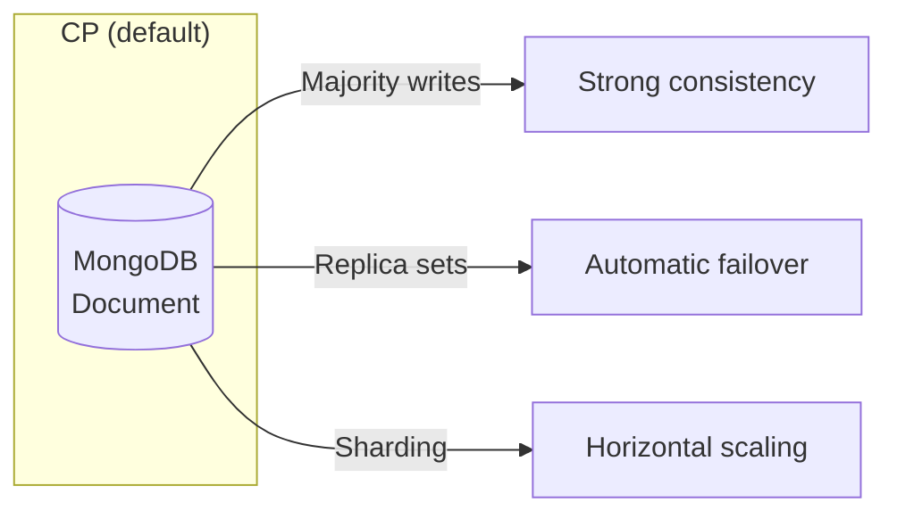

**Classification**: CP (configurable)

**Consistency model**: Strong with `writeConcern: "majority"` and `readConcern: "majority"`. Default settings provide strong consistency. Can be tuned down to eventual for performance. MongoDB gives you fine-grained control over consistency per operation.

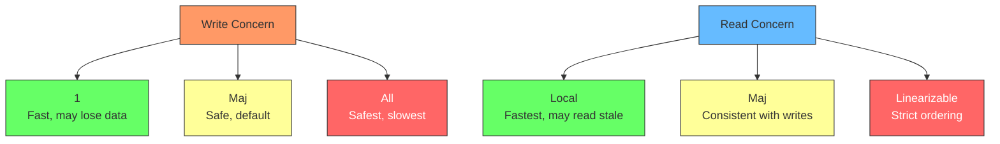

The combination of write concern and read concern determines your consistency level. `majority` for both gives you strong consistency. Using `local` read concern with `1` write concern gives you eventual consistency but faster operations.

**Availability**: Replica sets (3+ nodes) with automatic failover. Primary election via Raft consensus. Cross-region replica sets possible.

**Strengths**:
- Flexible document model (JSON/BSON)
- Rich query language with aggregations
- Horizontal scaling via sharding
- Good developer experience

**Weaknesses**:
- No multi-document ACID transactions until v4.0 (now available but with overhead)
- Joins ($lookup) are expensive
- Memory overhead (working set should fit in RAM)
- Schema flexibility can lead to data quality issues

**Use cases**: Content management, catalogs, user profiles, applications with evolving schemas.

### DynamoDB The Serverless Workhorse

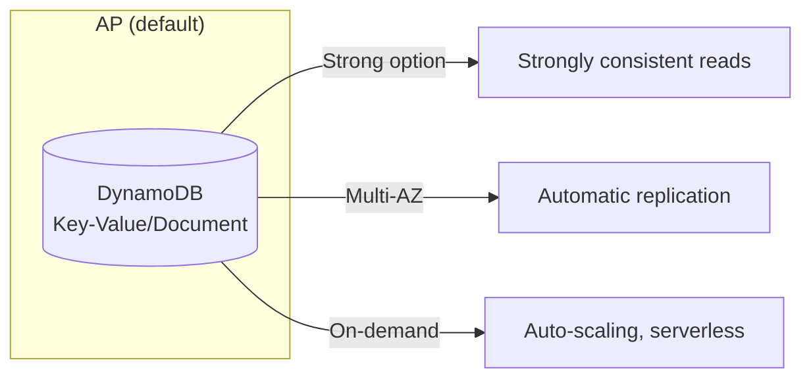

**Classification**: AP (tunable per-request)

**Consistency model**: Eventual by default. Strongly consistent reads available per-request at 2x read capacity cost. Transactions supported across multiple items with ACID guarantees. You choose consistency per read, not per database.

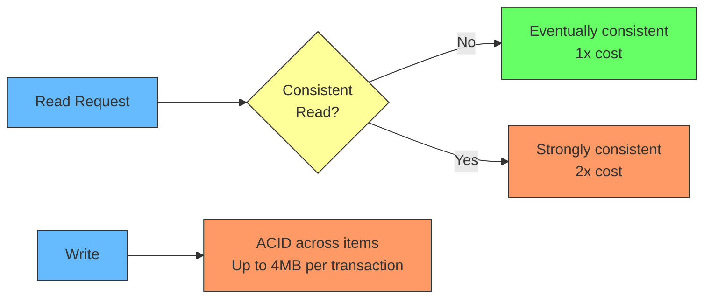

DynamoDB replicates data across 3 AZs automatically. Eventual consistency gives you the best performance, while strong consistency ensures you read the latest write at the cost of higher latency and capacity units.

**Availability**: Multi-AZ by default. Data replicated across 3 AZs. Automatic failover, no manual intervention.

**Strengths**:
- Fully managed, serverless no operations
- Single-digit millisecond latency at any scale
- DAX (in-memory cache) for microsecond reads
- Global Tables for multi-region

**Weaknesses**:
- Query flexibility limited (no joins, limited filtering)
- Hot partition problems with poor key design
- Cost can spiral without capacity planning
- Vendor lock-in (AWS proprietary)

**Use cases**: Serverless applications, gaming leaderboards, session management, high-throughput low-latency workloads.

### CockroachDB The Distributed SQL Newcomer

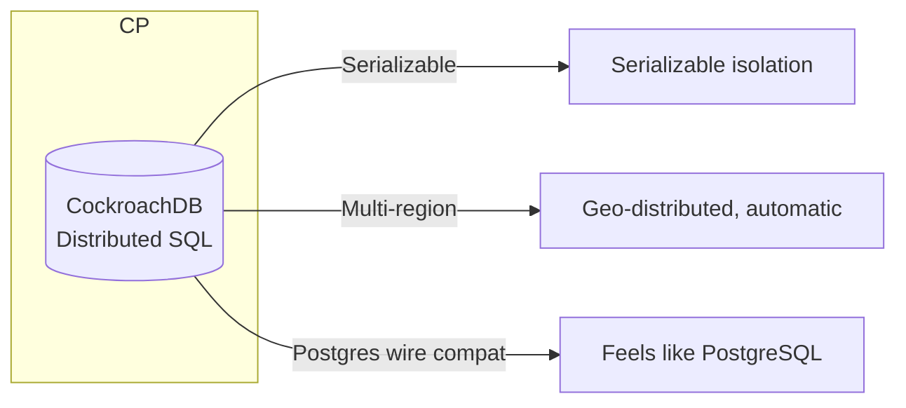

**Classification**: CP

**Consistency model**: Serializable isolation (the strongest level). Consensus-based replication (Raft) ensures every write is consistent across all nodes. This is the gold standard for correctness: transactions behave as if they ran one at a time, even though they run concurrently.

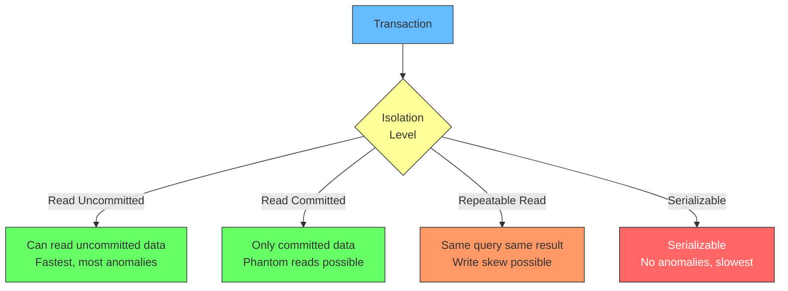

CockroachDB uses Raft consensus to replicate data across nodes. Every write goes through a leader that ensures all replicas agree before committing. This gives you serializable isolation without the manual sharding complexity.

**Availability**: Automatic replication across nodes/regions. Survives region-level failures. Automatic rebalancing when nodes are added/removed.

**Strengths**:
- PostgreSQL wire protocol compatibility
- Serializable isolation by default
- Geo-partitioning data stays in region for latency/compliance
- Distributed transactions that "just work"

**Weaknesses**:
- Higher latency than single-node databases (consensus overhead)
- Smaller ecosystem than PostgreSQL
- Operational complexity in multi-region setups
- Licensing (BSL, not fully open source)

**Use cases**: Global applications requiring strong consistency, multi-region financial systems, applications migrating from PostgreSQL that need horizontal scaling.

### Redis The Speed Demon

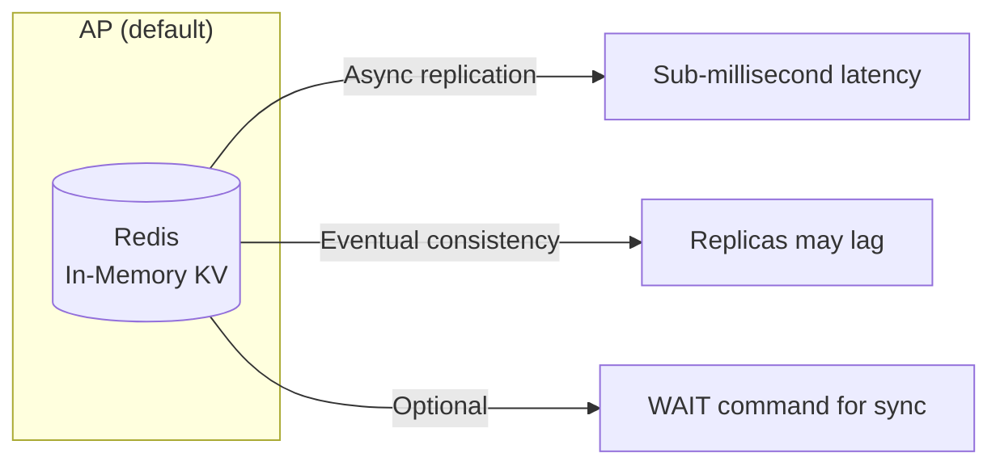

**Classification**: AP (default), CP with `WAIT`

**Consistency model**: Eventual by default with async replication to replicas. Can force synchronous consistency with `WAIT` command (blocks until N replicas acknowledge). Redis Cluster provides eventual consistency across slots. The tradeoff is clear: async for speed, sync for safety.

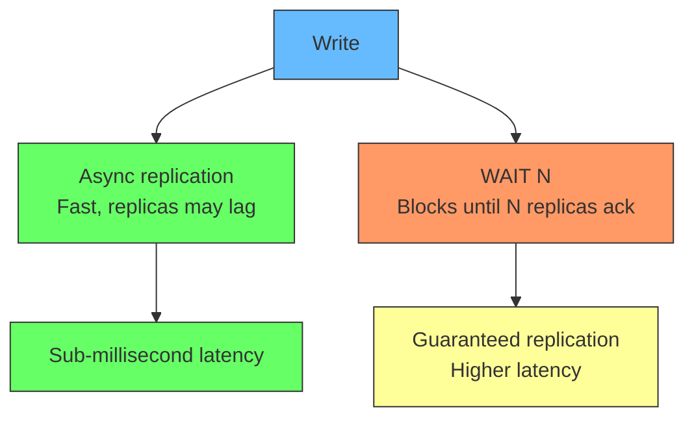

Without `WAIT`, a write returns immediately after the primary acknowledges. If the primary crashes before replicating, data is lost. With `WAIT 1`, the write blocks until at least one replica acknowledges, reducing data loss risk at the cost of higher latency.

**Availability**: Sentinel for automatic failover. Redis Cluster shards data across nodes. If a leader dies, a replica is promoted.

**Strengths**:
- Sub-millisecond latency (in-memory)
- Rich data structures (lists, sets, sorted sets, streams, HyperLogLog)
- Pub/Sub for messaging
- Lua scripting for atomic operations

**Weaknesses**:
- Dataset size limited by RAM
- Persistence (RDB/AOF) has tradeoffs data loss window with RDB
- Redis Cluster operational complexity
- Single-threaded command execution (but fast)

**Use cases**: Caching, session storage, rate limiting, leaderboards, real-time analytics, message queues.

## Comparison Matrix

| | PostgreSQL | Cassandra | MongoDB | DynamoDB | CockroachDB | Redis |
|---|---|---|---|---|---|---|
| **Type** | Relational | Wide-column | Document | KV/Document | Distributed SQL | In-memory KV |
| **CAP** | CP | AP | CP | AP | CP | AP |
| **Consistency** | Strong (ACID) | Tunable | Strong (majority) | Tunable | Serializable | Eventual |
| **Latency** | ms | ms | ms | ms | ms (cross-region higher) | μs |
| **Write scaling** | Single primary | Horizontal | Replica sets (limited) | Horizontal | Horizontal | Single leader |
| **Query language** | SQL | CQL | MQL | API calls | SQL | Commands |
| **Joins** | Yes | No | Limited ($lookup) | No | Yes | No |
| **Transactions** | Full ACID | Lightweight (slow) | Multi-document | Across items | Distributed ACID | Lua scripts |
| **Managed option** | RDS, Aurora | Astra DB | Atlas | DynamoDB (native) | CockroachDB Cloud | ElastiCache, Redis Cloud |

## When to Use What

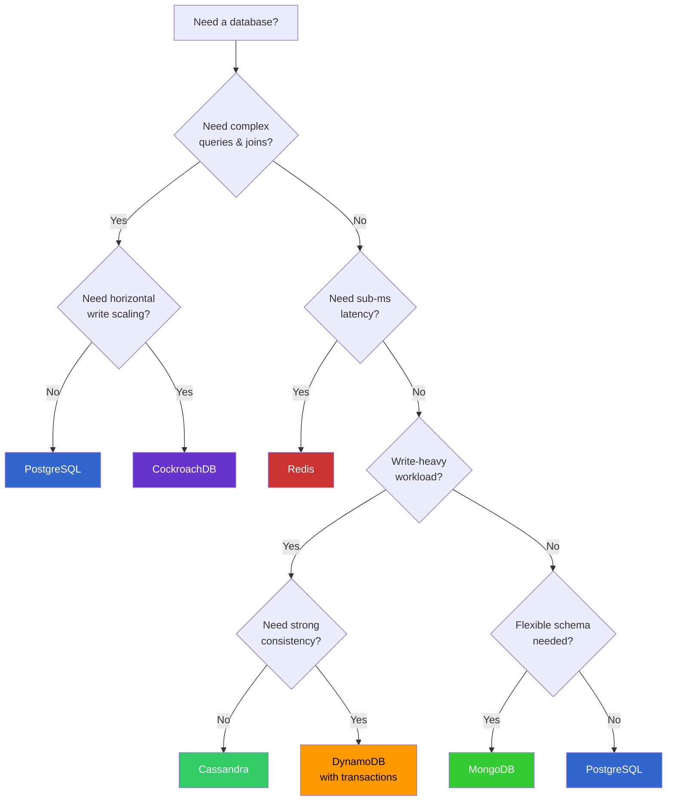

## Real-World Scenarios

| Scenario | Primary | Why |
|----------|---------|-----|
| Banking transactions | PostgreSQL / CockroachDB | Need ACID, strong consistency, complex queries |
| IoT sensor data | Cassandra | Write-heavy, time-series, multi-region, eventual consistency is fine |
| User sessions | Redis | Sub-ms reads, TTL support, ephemeral data |
| Product catalog | MongoDB | Flexible schema, nested documents, evolving attributes |
| Global e-commerce | CockroachDB | Multi-region, strong consistency, SQL compatibility |
| Serverless API backend | DynamoDB | Auto-scaling, no operations, predictable latency |
| Real-time leaderboard | Redis | Sorted sets, O(log N) rank queries, sub-ms updates |

## Key Takeaway

There is no "best" database only tradeoffs. The right choice depends on:

1. **Consistency requirements** Can you tolerate stale reads? (AP) Or must every read be current? (CP)
2. **Availability requirements** Can the system go down during failures? (CP) Or must it always respond? (AP)
3. **Latency requirements** Do you need μs response times? (Redis) Or is ms acceptable? (others)
4. **Query complexity** Do you need joins and aggregations? (SQL databases) Or is key-value enough?
5. **Scale profile** Write-heavy? Read-heavy? Balanced? Geo-distributed?

Pick the database that matches your constraints, not the one with the most GitHub stars.
