# Database Indexing

Why databases need indexes, how different index structures work, and how to choose the right one for your workload.

## The Problem: Full Table Scans Are Expensive

Without indexes, every `SELECT` query must scan every row in the table to find matching records. This is called a **full table scan**. On a table with 10 million rows, a simple `SELECT * FROM orders WHERE customer_id = 42` would read all 10 million rows, compare each `customer_id` to 42, and return the matches.

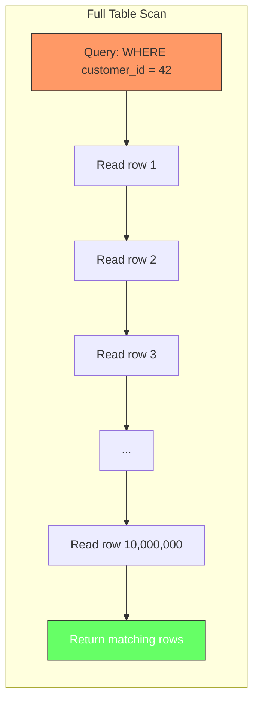

This works, but it scales linearly with table size. A table twice as large takes twice as long. At some point, queries become too slow to be useful. The solution is an **index**: a data structure that lets the database find rows without scanning the entire table.

## What an Index Actually Is

An index is a separate data structure stored alongside the table data. It contains a copy of the indexed column(s) and a pointer back to the original row. Think of it like the index at the back of a textbook: instead of reading every page to find mentions of "B-tree," you look it up in the index and go directly to the relevant pages.

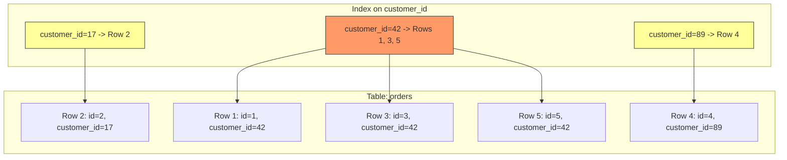

The database can now find all rows where `customer_id = 42` by reading just the index entry, which points directly to rows 1, 3, and 5. No full table scan needed.

## B-Tree Indexes: The Default Choice

B+ tree indexes (commonly called "B-tree indexes") are the most common index type in relational databases. They maintain data in a sorted order and support equality lookups, range queries, prefix matches, and `ORDER BY` operations efficiently.

### How a B-Tree Works

Most databases actually implement a variant called **B+ tree** (often just called "B-tree" as shorthand). In a B+ tree, there are two types of nodes:

- **Internal nodes** (root and intermediate): Contain **separator keys** that act as boundaries for routing. A node with keys `[30, 60]` means it has three child pointers: one for values less than 30, one for values between 30 and 60, and one for values greater than or equal to 60. The separator keys do NOT store actual rows; they only guide the search downward.
- **Leaf nodes**: Contain the actual indexed values and pointers back to the table rows. Leaf nodes are linked together in a doubly-linked list (a B+ tree feature), which is what makes range scans and `ORDER BY` efficient without backtracking up the tree.

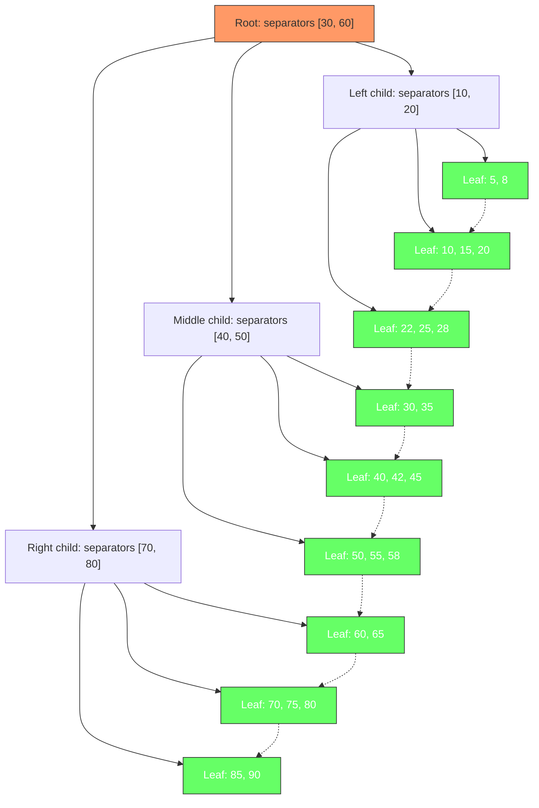

To find `customer_id = 42`, the database starts at the root. The root has separator keys `[30, 60]`. Since 42 is greater than or equal to 30 and less than 60, it follows the middle pointer. The middle child has separators `[40, 50]`. Since 42 is greater than or equal to 40 and less than 50, it follows that pointer down to the leaf containing 42. The database reads one leaf page instead of scanning the entire table. This takes O(log n) time instead of O(n).

### When to Use B-Tree Indexes

B-tree indexes are the right choice for most queries:

- **Equality lookups**: `WHERE id = 42`
- **Range queries**: `WHERE created_at BETWEEN '2024-01-01' AND '2024-12-31'`
- **Sorting**: `ORDER BY name`
- **Prefix matches**: `WHERE name LIKE 'John%'`
- **Multi-column indexes**: `WHERE status = 'active' AND created_at > '2024-01-01'`

```sql
-- Create a B-tree index on a single column
CREATE INDEX idx_orders_customer_id ON orders(customer_id);

-- Create a multi-column index
CREATE INDEX idx_orders_status_created ON orders(status, created_at);

-- This query uses the multi-column index effectively
SELECT * FROM orders
WHERE status = 'active'
AND created_at > '2024-01-01'
ORDER BY created_at;
```

### Selectivity: When Indexes Help and When They Do Not

Not all indexes are equally useful. **Selectivity** measures how many distinct values a column has relative to the total number of rows. A highly selective column (many distinct values, each matching a small fraction of rows) benefits greatly from an index. A low-selectivity column (few distinct values, each matching a large fraction of rows) may not benefit at all.

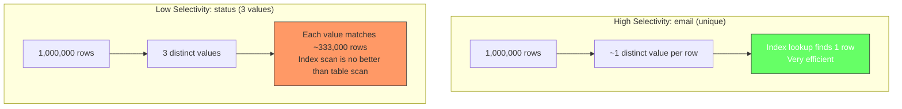

```sql
-- High selectivity: email is unique, index is very useful
CREATE INDEX idx_users_email ON users(email);
SELECT * FROM users WHERE email = 'alice@example.com';
-- Index scan: finds 1 row in O(log n)

-- Low selectivity: status has only 3 values, index is rarely useful
CREATE INDEX idx_users_status ON users(status);
SELECT * FROM users WHERE status = 'active';
-- Returns ~333,000 rows out of 1,000,000
-- PostgreSQL will likely ignore this index and do a sequential scan
```

The general rule: if a query returns more than about 5-10% of the table rows, PostgreSQL will often skip the index and do a full table scan instead. Scanning a large fraction of the table through an index requires many random I/O operations (jumping between index pages and table pages), while a sequential scan reads the table linearly, which is faster for bulk access.

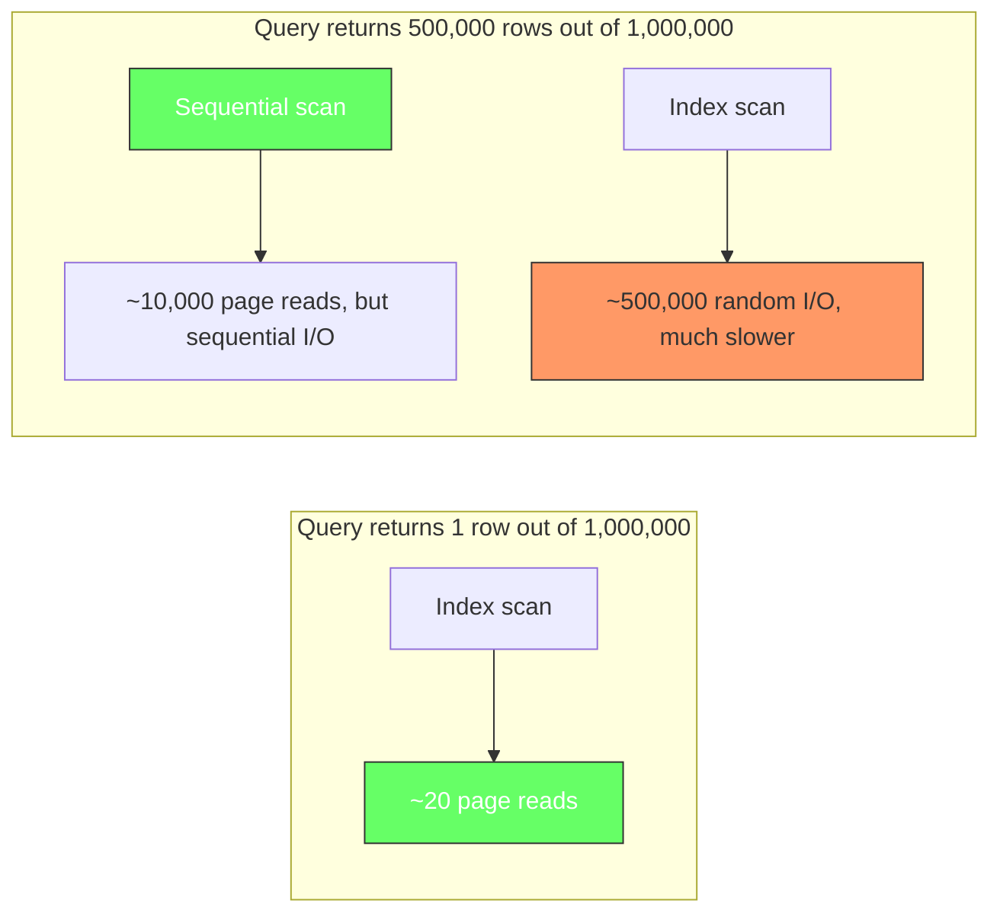

```sql
-- PostgreSQL optimizer decides automatically
EXPLAIN ANALYZE SELECT * FROM users WHERE status = 'active';
-- Output: Seq Scan on users  (cost=0.00..16534.00 rows=333333 width=...)
-- Note: no "Index Scan" even though we have an index on status

-- Same index, but with a selective filter:
EXPLAIN ANALYZE SELECT * FROM users WHERE status = 'active' AND email = 'alice@example.com';
-- Output: Index Scan using idx_users_email on users  (cost=0.42..8.44 rows=1 width=...)
-- The email filter is selective enough to use the index
```

### Composite Indexes: Column Order Matters

A composite index covers multiple columns in a single index structure. The order of columns determines which queries can use the index effectively. The B-tree sorts first by the leftmost column, then by the next column, and so on.

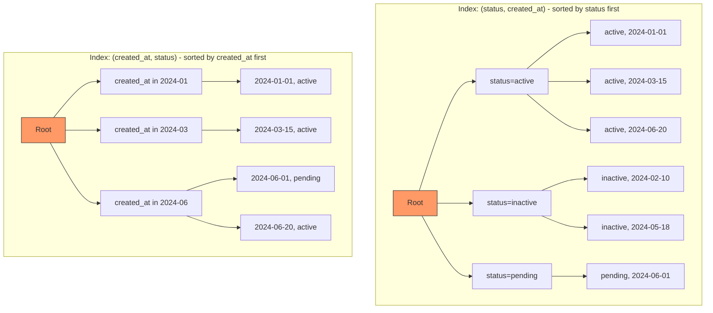

```sql
-- Uses the index: filters on status (leftmost column)
SELECT * FROM orders WHERE status = 'active';

-- Uses the index: filters on both columns in order
SELECT * FROM orders WHERE status = 'active' AND created_at > '2024-01-01';

-- Uses the index: range on second column works after equality on first
SELECT * FROM orders WHERE status = 'active' AND created_at > '2024-01-01';

-- Does NOT use the index: skips status, goes straight to created_at
SELECT * FROM orders WHERE created_at > '2024-01-01';

-- Uses the index: the optimizer can reorder AND conditions
SELECT * FROM orders WHERE created_at > '2024-01-01' AND status = 'active';
```

### The Leftmost Prefix Rule

Multi-column B-tree indexes follow a leftmost prefix rule. The index on `(status, created_at)` can serve queries that filter on `status` alone, or `status + created_at`, but NOT queries that filter only on `created_at`. This is because the B-tree is sorted by `status` first. Without specifying `status`, the database cannot use the sorted order of `created_at`.

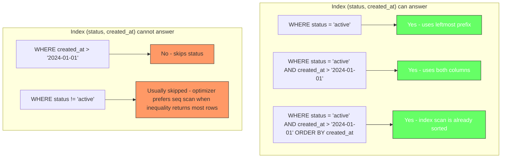

This is the most common indexing mistake. If your query filters on column B but not column A, a multi-column index `(A, B)` will not help.

Note that `!=` CAN technically use a B-tree index, but the optimizer often skips it. If `status != 'active'` returns 90% of the table, scanning most rows through an index (random I/O) is slower than a sequential scan (linear I/O). The index is technically usable, but the optimizer decides it is not worth it.

### Choosing Composite Index Column Order

The general guidelines for ordering columns in a composite index:

1. **Equality columns first**: Columns used in `=` or `IN` conditions should come before range columns.
2. **Range columns last**: Columns used in `>`, `<`, `BETWEEN`, or `LIKE` conditions should come last, because the range stops the sort order.
3. **Consider selectivity**: Among equality columns, put the most selective one first to narrow down the result set faster.
4. **Consider sort order**: If you need `ORDER BY`, include those columns in the index to avoid a separate sort step.

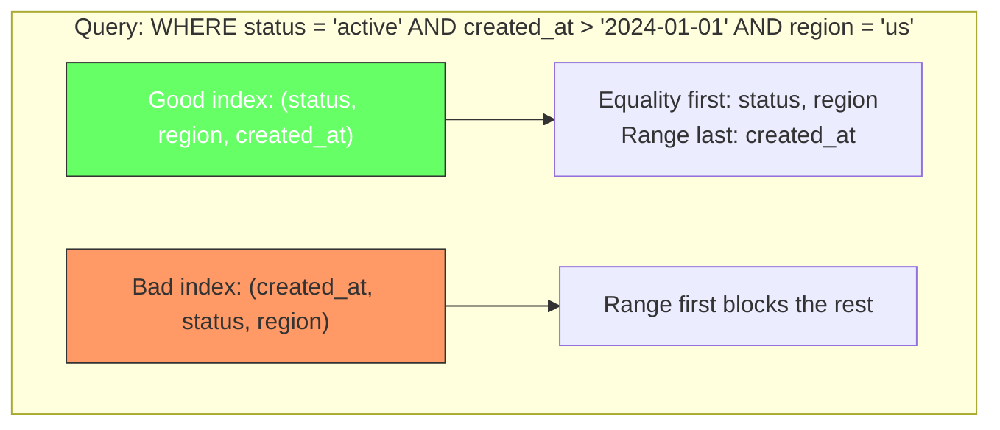

```sql
-- Query: find active orders in the US from the last 30 days
SELECT * FROM orders
WHERE status = 'active'
AND region = 'us'
AND created_at > '2024-06-01';

-- Good: equality columns first, range last
CREATE INDEX idx_orders_good ON orders(status, region, created_at);

-- Bad: range column first, blocks status and region
CREATE INDEX idx_orders_bad ON orders(created_at, status, region);
```

## Hash Indexes: Fast Equality, Nothing Else

Hash indexes use a hash function to map keys to fixed-size buckets. They are extremely fast for exact equality lookups but cannot support range queries, sorting, or prefix matches.

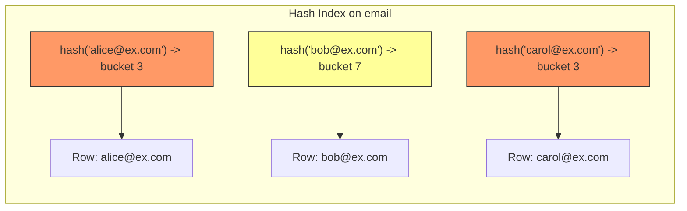

```sql
-- Hash index is perfect for this
SELECT * FROM users WHERE email = 'alice@example.com';

-- Hash index CANNOT help with this (range query)
SELECT * FROM users WHERE email > 'a' AND email < 'm';

-- Hash index CANNOT help with this (prefix match)
SELECT * FROM users WHERE email LIKE 'alice%';
```

In PostgreSQL, hash indexes were historically not WAL-logged and could not survive crashes. As of PostgreSQL 10, they are WAL-logged and crash-safe, but they remain rarely used in practice because B-tree indexes are fast enough for equality lookups and support more query types.

## GiST Indexes: Geometry, Ranges, and Full-Text Search

GiST (Generalized Search Tree) indexes support complex data types that do not fit neatly into B-tree comparisons. They are designed for geometric data, range types, full-text search, and nearest-neighbor queries.

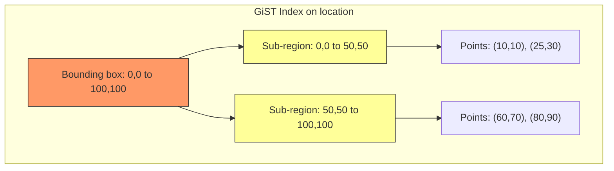

GiST indexes work by decomposing the search space into overlapping bounding boxes. They are perfect for:

- **Geometric queries**: "Find all points within 5 miles of this location"
- **Range queries on custom types**: "Find overlapping time ranges"
- **Full-text search**: "Find documents containing these words"
- **Nearest-neighbor search**: "Find the 10 closest results"

```sql
-- Install the PostGIS extension for geometric queries
CREATE EXTENSION IF NOT EXISTS postgis;

-- Find all locations within 5 miles
SELECT * FROM locations
WHERE ST_DWithin(
    location::geography,
    ST_MakePoint(-73.99, 40.73)::geography,
    8047 -- 5 miles in meters
);

-- Create a GiST index for this query
CREATE INDEX idx_locations_geo ON locations USING GIST(location);
```

## GIN Indexes: Arrays, JSONB, and Full-Text Search

GIN (Generalized Inverted Index) indexes map a single key to multiple rows. They are the opposite of B-tree, where each value maps to one row. GIN is ideal for data where one row contains many values, like arrays, JSONB documents, or full-text search vectors.

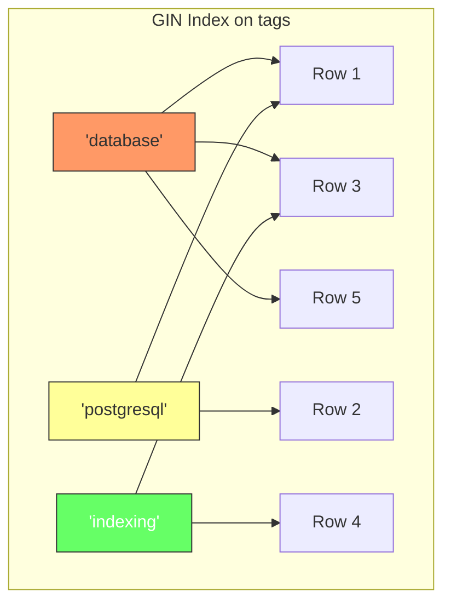

```sql
-- Find all posts tagged with 'database'
SELECT * FROM posts WHERE tags @> ARRAY['database'];

-- Find all posts where JSONB contains a key
SELECT * FROM posts WHERE metadata @> '{"category": "tech"}';

-- Create a GIN index for array containment
CREATE INDEX idx_posts_tags ON posts USING GIN(tags);

-- Create a GIN index for JSONB containment
CREATE INDEX idx_posts_metadata ON posts USING GIN(metadata);
```

GIN indexes are slower to update than B-tree indexes because they must update the inverted index for every new value. But they are extremely fast for containment queries on complex data types.

## Partial Indexes: Index Only What Matters

A partial index includes only rows that match a WHERE condition. This is useful when you frequently query for a specific subset of data, like "all active users" or "orders from the last 30 days."

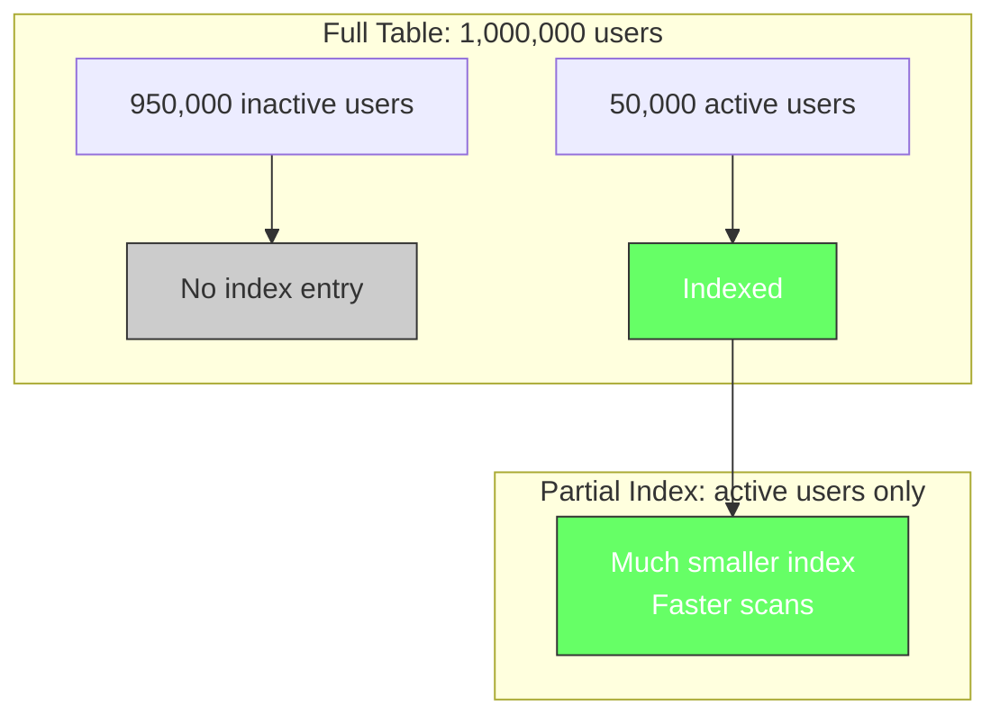

```sql
-- Partial index: only active users
CREATE INDEX idx_users_active ON users(email) WHERE status = 'active';

-- This query uses the partial index
SELECT * FROM users WHERE status = 'active' AND email = 'alice@example.com';

-- This query does NOT use it (missing status = 'active')
SELECT * FROM users WHERE email = 'alice@example.com';
```

Partial indexes save disk space and improve write performance because the index is smaller. They are especially useful for queries that filter on a low-cardinality value (like status = 'active') within a high-cardinality column (like email).

## Covering Indexes: Avoid Table Lookups

A covering index includes all columns needed by a query, so the database can answer the query entirely from the index without reading the table data. This eliminates the need to look up each row in the table heap.

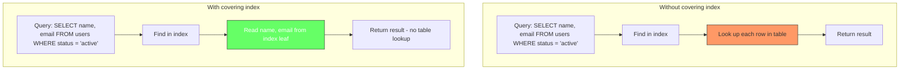

```sql
-- Create a covering index (PostgreSQL does not have INCLUDE syntax until v11)
-- Before v11, use a composite index:
CREATE INDEX idx_users_covering ON users(status, name, email);

-- This query can be answered entirely from the index
SELECT name, email FROM users WHERE status = 'active';

-- PostgreSQL 11+ supports INCLUDE for covering indexes:
CREATE INDEX idx_users_covering ON users(status) INCLUDE (name, email);
```

The `INCLUDE` syntax is cleaner because the extra columns are not sorted in the index. They are stored in the leaf pages but not in the intermediate pages, making the index smaller than a composite index with the same columns.

## Indexes and the Write Path

Every index you add slows down writes. When you `INSERT`, `UPDATE`, or `DELETE` a row, every index on that table must also be updated. An index that is not being used is not just wasting disk space; it is actively slowing down every write operation.

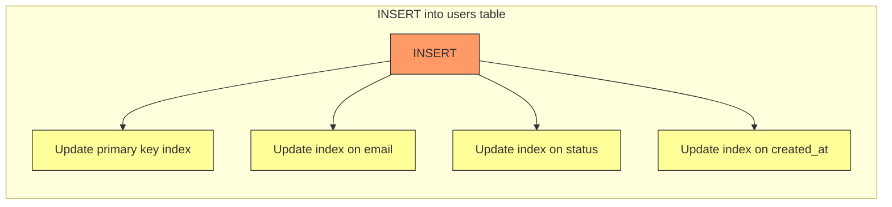

The general rule: do not create an index unless you know it will be used. Review your indexes regularly and drop the ones that are not being queried.

## How to Verify Your Indexes Are Being Used

PostgreSQL provides the `EXPLAIN ANALYZE` command to show how a query will be executed, including which indexes it will use.

```sql
-- Check if the index is used
EXPLAIN ANALYZE
SELECT * FROM orders WHERE customer_id = 42;

-- Output might look like:
-- Index Scan using idx_orders_customer_id on orders
--   (cost=0.29..8.31 rows=3 width=...)
--   Index Cond: (customer_id = 42)
--   Planning Time: 0.050 ms
--   Execution Time: 0.080 ms

-- Without the index (full table scan):
-- Seq Scan on orders
--   (cost=0.00..165340.00 rows=3 width=...)
--   Filter: (customer_id = 42)
--   Rows Removed by Filter: 9999997
--   Planning Time: 0.050 ms
--   Execution Time: 12000.000 ms
```

The difference is dramatic. The index scan takes 0.080 ms while the full table scan takes 12 seconds. That is the power of indexing.

## Common Indexing Mistakes

### Creating Too Many Indexes

Every index slows down writes. A table with 10 indexes will have 10 times more work to do on every `INSERT`. Only create indexes for queries that actually need them.

### Indexing the Wrong Columns

An index on `last_name` is useless if your queries always filter on `email`. Think about your query patterns before creating indexes. Use `EXPLAIN ANALYZE` to verify.

### Not Considering Column Order in Multi-Column Indexes

The leftmost prefix rule means `(A, B)` is not the same as `(B, A)`. A query that filters on `B` alone cannot use an index on `(A, B)`.

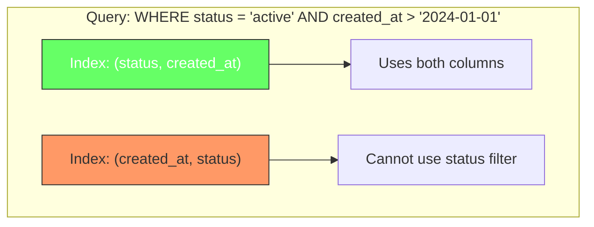

### Assuming Indexes Help with LIKE Queries

A B-tree index on `name` helps with `LIKE 'John%'` (prefix match) but not with `LIKE '%John%'` (contains match). For contains queries, use a GIN index with `pg_trgm`:

```sql
-- Enable trigram extension
CREATE EXTENSION IF NOT EXISTS pg_trgm;

-- Create a GIN index for LIKE '%...%' queries
CREATE INDEX idx_users_name_trgm ON users USING GIN(name gin_trgm_ops);

-- Now this query uses the index
SELECT * FROM users WHERE name LIKE '%John%';
```

## Monitoring Index Usage

PostgreSQL tracks index usage statistics in `pg_stat_user_indexes`. You can find unused indexes by querying this view.

```sql
-- Find indexes that have never been used
SELECT
    schemaname,
    tablename,
    indexname,
    pg_size_pretty(pg_relation_size(indexrelid)) AS index_size
FROM pg_stat_user_indexes
WHERE idx_scan = 0
ORDER BY pg_relation_size(indexrelid) DESC;

-- Find indexes with low usage
SELECT
    schemaname,
    tablename,
    indexname,
    idx_scan AS times_used,
    pg_size_pretty(pg_relation_size(indexrelid)) AS index_size
FROM pg_stat_user_indexes
WHERE idx_scan < 100
ORDER BY pg_relation_size(indexrelid) DESC;
```

Drop unused indexes to improve write performance and reduce disk usage. But be cautious: an index might be unused today but critical for a future query or a periodic report.

## Summary

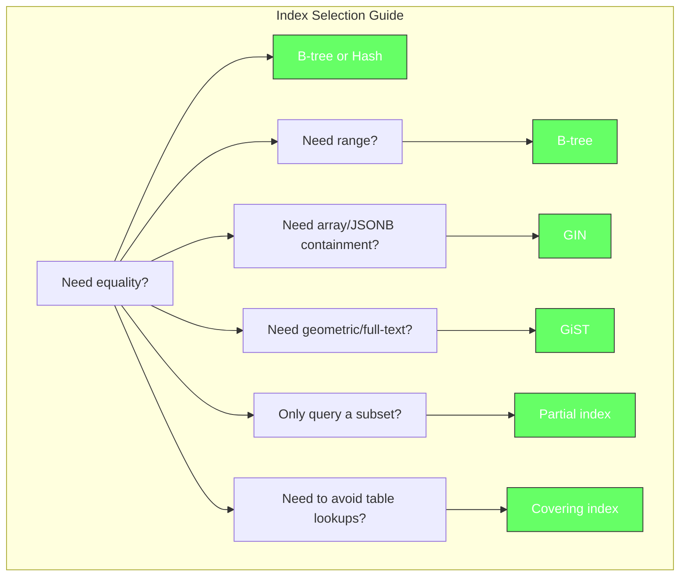

| Index Type | Best For | Limitations |
|---|---|---|
| B-tree | Equality, range, sort, prefix | Not ideal for contains queries |
| Hash | Equality only | No range/sort support |
| GiST | Geometry, ranges, full-text | Slower updates |
| GIN | Arrays, JSONB, full-text | Slow updates, larger storage |
| Partial | Queries on a subset of rows | Must match WHERE condition |
| Covering | Queries answerable from index | Extra storage for included columns |

The right index can turn a 12-second query into a sub-millisecond one. The wrong index wastes disk space and slows down every write. Start with B-tree, measure with `EXPLAIN ANALYZE`, and adjust based on your actual query patterns.
