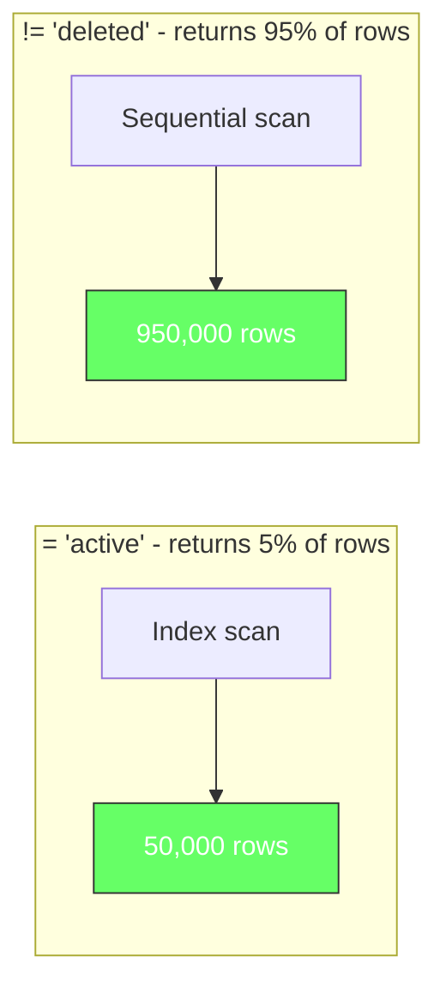
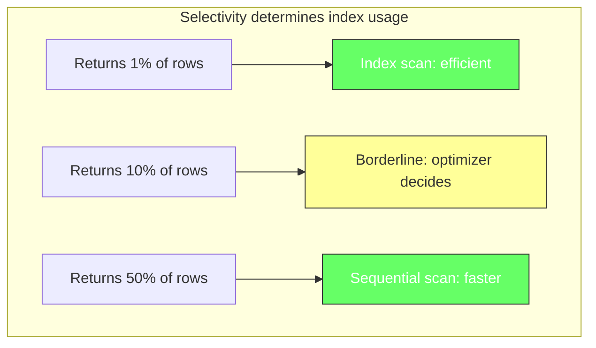
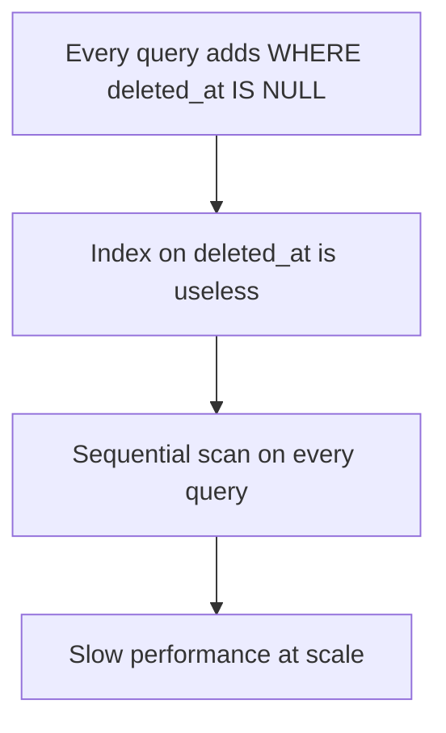
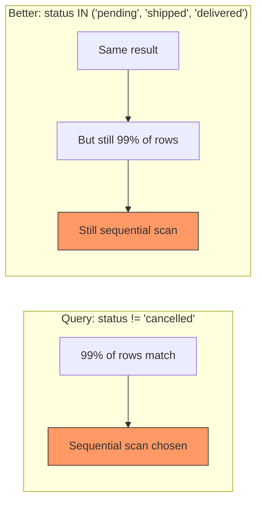

# The "Not Equal" Index Anti-Pattern

Why `!=` queries bypass your indexes, and how to rewrite them for performance.

## The Problem

You have an index on `status`. You write a query with `WHERE status != 'deleted'`. The index exists, the column is indexed, but the query is slow. You run `EXPLAIN ANALYZE` and see a sequential scan instead of an index scan. What went wrong?

Nothing went wrong. The database made the right decision. But it is a decision most developers do not expect.

## How Indexes Work With Not-Equal

B-tree indexes are designed to find rows efficiently when you know what you are looking for. Equality (`=`) narrows to one value. Range (`>`, `<`, `BETWEEN`) narrows to a contiguous range. Even `LIKE 'prefix%'` works because it maps to a prefix range.

But `!=` is different. It asks for everything EXCEPT one value. If `deleted` is 1% of your data, `status != 'deleted'` returns 99% of the table. The index technically CAN find those rows, but scanning 99% of the table through an index requires random I/O (jumping between index pages and table pages). A sequential scan reads the table linearly, which is faster for bulk access.



```sql
-- This uses the index efficiently
SELECT * FROM orders WHERE status = 'active';
-- Index scan: finds 50,000 rows in O(log n)

-- This often skips the index
SELECT * FROM orders WHERE status != 'deleted';
-- Sequential scan: 950,000 rows, but faster than random I/O through index
```

## The Crossover Point

The optimizer decides based on selectivity. If a query returns more than roughly 5-10% of the table, a sequential scan is usually faster. This is not a hard rule, it is a heuristic based on the cost of random I/O vs sequential I/O.



```sql
-- status has 3 values: 'active' (60%), 'pending' (30%), 'deleted' (10%)

-- != 'deleted' returns 90% of rows - sequential scan
SELECT * FROM orders WHERE status != 'deleted';

-- != 'pending' returns 70% of rows - sequential scan
SELECT * FROM orders WHERE status != 'pending';

-- = 'active' returns 60% of rows - borderline, likely sequential
SELECT * FROM orders WHERE status = 'active';

-- = 'deleted' returns 10% of rows - index scan
SELECT * FROM orders WHERE status = 'deleted';
```

## Common Code Smells

### Smell 1: Filtering Out Invalid Rows

The most common pattern. You have a `deleted_at` or `is_deleted` column and you filter it out in every query.



```sql
-- Smell: filtering out soft-deleted rows everywhere
SELECT * FROM users WHERE deleted_at IS NULL AND status = 'active';
SELECT * FROM orders WHERE deleted_at IS NULL AND customer_id = 42;
SELECT * FROM posts WHERE deleted_at IS NULL AND created_at > '2024-01-01';
```

**Fix**: Use partial indexes to exclude deleted rows upfront.

```sql
-- Partial index only includes non-deleted rows
CREATE INDEX idx_users_active ON users(status) WHERE deleted_at IS NULL;
CREATE INDEX idx_orders_customer ON orders(customer_id) WHERE deleted_at IS NULL;
CREATE INDEX idx_posts_recent ON posts(created_at) WHERE deleted_at IS NULL;
```

### Smell 2: Excluding a Rare Status

You want to find all orders that are not cancelled. But cancelled orders are 1% of the data.



```sql
-- This is slow (99% of rows)
SELECT * FROM orders WHERE status != 'cancelled';

-- Rewriting as IN does not help (same result set)
SELECT * FROM orders WHERE status IN ('pending', 'shipped', 'delivered');

-- The real fix: partial index for the common case
CREATE INDEX idx_orders_active ON orders(customer_id) WHERE status != 'cancelled';
```

### Smell 3: Checking for NULL

`IS NOT NULL` behaves similarly to `!=`. If most rows have a value, the index is often skipped.

```sql
-- If 95% of emails are not NULL, this often skips the index
SELECT * FROM users WHERE email IS NOT NULL;

-- If 5% of emails are NULL, this uses the index
SELECT * FROM users WHERE email IS NULL;
```

## How to Diagnose

Always run `EXPLAIN ANALYZE` to see what the optimizer actually does.

```sql
-- Check if your query uses the index
EXPLAIN ANALYZE SELECT * FROM orders WHERE status != 'deleted';

-- Output example:
-- Seq Scan on orders  (cost=0.00..16534.00 rows=950000 width=...)
--   Filter: (status <> 'deleted')
--   Rows Removed by Filter: 50000
--   Planning Time: 0.050 ms
--   Execution Time: 1200.000 ms

-- Compare with the selective version:
EXPLAIN ANALYZE SELECT * FROM orders WHERE status = 'deleted';

-- Output example:
-- Index Scan using idx_orders_status on orders  (cost=0.42..8.44 rows=50000 width=...)
--   Index Cond: (status = 'deleted')
--   Planning Time: 0.050 ms
--   Execution Time: 45.000 ms
```

## The Rule of Thumb

| Query Pattern | Likely Index Usage |
|---|---|
| `= 'value'` | Index scan (if value is selective) |
| `> 'value'`, `< 'value'` | Index scan (range) |
| `BETWEEN a AND b` | Index scan (range) |
| `LIKE 'prefix%'` | Index scan (prefix range) |
| `!= 'value'` | Sequential scan (returns most rows) |
| `IS NOT NULL` | Sequential scan (if most rows are not NULL) |
| `IN (list)` | Depends on selectivity of the list |

## Summary

B-tree indexes are optimized for finding what IS there, not what IS NOT there. `!=` asks for everything except one value, which often returns a large fraction of the table. The optimizer correctly chooses a sequential scan over random I/O through an index.

The fix is not to force index usage. The fix is to restructure your data model so the common case is fast. Partial indexes exclude rare cases upfront. Filtering on positive conditions (`status = 'active'`) is almost always better than negative conditions (`status != 'deleted'`).
