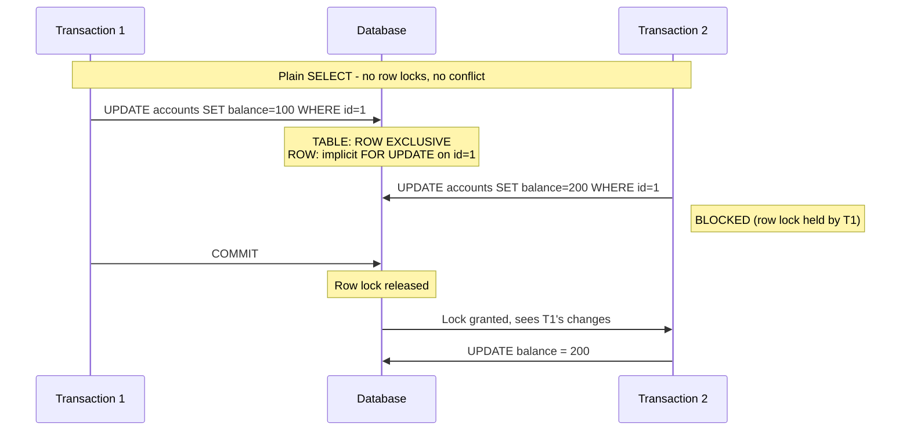
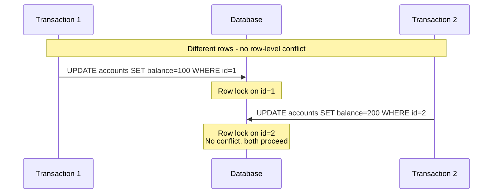
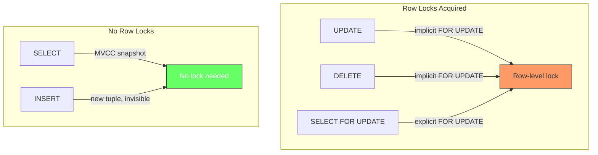
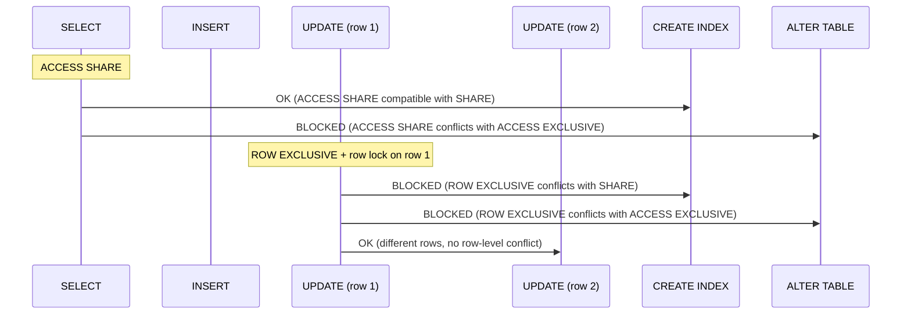

# PostgreSQL Table and Row Locks

Why reader locks and writer locks are fundamentally different, and why this matters in practice.

## The Core Difference

`SELECT` and `INSERT`/`UPDATE`/`DELETE` all acquire **table-level locks**, but they are different modes with different conflict rules. The difference is not about protecting rows from each other — that is handled by MVCC and row-level locks. It is about what each operation needs to guarantee about the table structure. The table-level lock is the same for all writes (`ROW EXCLUSIVE`). The difference at the row level is what matters between `UPDATE`/`DELETE` and `INSERT`.

## Critical: ROW EXCLUSIVE and FOR UPDATE Are Not the Same Thing

This is the most common point of confusion. Despite both containing "exclusive", they operate at completely different levels:

| | `ROW EXCLUSIVE` | `FOR UPDATE` |
|---|---|---|
| **Level** | Table | Row |
| **Type** | Table-level lock mode | Row-level lock |
| **Who acquires it** | `INSERT`, `UPDATE`, `DELETE` | `UPDATE`, `DELETE` (implicit), `SELECT ... FOR UPDATE` (explicit) |
| **What it protects** | Table schema and index consistency | A specific row from concurrent modification |
| **Conflicts with** | `SHARE` (CREATE INDEX) and above | Another `FOR UPDATE` on the same row |

They are separate mechanisms in PostgreSQL's lock manager. A table-level `ROW EXCLUSIVE` lock and a row-level `FOR UPDATE` lock coexist independently — one does not imply the other, and they are stored in different hash tables.

So when someone says "UPDATE acquires an exclusive lock", they could mean either:
- **Table level**: `ROW EXCLUSIVE` — meaning "no `CREATE INDEX` or `ALTER TABLE` while I'm writing"
- **Row level**: implicit `FOR UPDATE` — meaning "no other transaction can modify this specific row"

These are not the same thing, and they serve different purposes. Keep them separate in your mental model.

## Lock Personalities: Stories to Remember

- **ACCESS SHARE** — `SELECT` says: *"Anyone can work, just don't ALTER or DROP the table."* Blocks only `ACCESS EXCLUSIVE` (ALTER TABLE, DROP TABLE).
- **ROW EXCLUSIVE** — `INSERT`/`UPDATE`/`DELETE` says: *"Readers welcome, other writers welcome on different rows. But `CREATE INDEX`? Wait — you might miss my new rows."* Blocks `SHARE` (CREATE INDEX) and above.
- **FOR UPDATE (row)** — `UPDATE`/`DELETE` (implicit) or `SELECT FOR UPDATE` (explicit) says: *"This specific row is mine. Everyone else must wait to modify it."* Blocks only another `FOR UPDATE` on the same row.
- **SHARE** — `CREATE INDEX` says: *"I'm scanning every row to build an index. Writers must pause, but readers can proceed."* Blocks `ROW EXCLUSIVE` (writes) but not `ACCESS SHARE` (reads).
- **ACCESS EXCLUSIVE** — `ALTER TABLE`/`DROP TABLE` says: *"Everyone out. No reads, no writes, no index builds."* Blocks everything.

## Table-Level: ACCESS SHARE vs ROW EXCLUSIVE

Both are table-level locks. Both protect against schema changes. But at different strengths.

### What This Means in Practice

```sql
-- SELECT blocks: nothing except ALTER TABLE / DROP TABLE
SELECT * FROM accounts WHERE id = 1;
-- This runs fine alongside:
--   INSERT INTO accounts ...
--   UPDATE accounts SET ...
--   DELETE FROM accounts ...
--   CREATE INDEX ... (yes, index builds proceed during reads)

-- UPDATE blocks: CREATE INDEX and ALTER TABLE
UPDATE accounts SET balance = 100 WHERE id = 1;
-- This blocks:
--   CREATE INDEX ... (must wait for UPDATE to finish)
--   ALTER TABLE ... (must wait for UPDATE to finish)
-- This does NOT block:
--   SELECT ...
--   INSERT ...
--   UPDATE on a different row
```

The asymmetry is important: reads allow index builds, but writes do not. The reason is fundamental: `CREATE INDEX` reads every row in the table to build the index structure. If a concurrent write modifies a row during the index build, the index would miss that row or include stale data. So `CREATE INDEX` uses a `SHARE` lock, which conflicts with `ROW EXCLUSIVE`.

Reads do not have this problem because MVCC gives each reader a consistent snapshot, so the index build and the read can proceed independently.

## Row-Level: Who Gets Row Locks

The table-level lock is just the first layer. The second layer is row-level locks, and this is where `UPDATE`/`DELETE` diverge from `INSERT`.

**SELECT** acquires no row locks by default. It uses MVCC snapshots to see a consistent view of the data without locking anything. This is the entire point of MVCC: reads do not block writes, and writes do not block reads. You have to explicitly request row locks with `FOR UPDATE`, `FOR SHARE`, or `FOR KEY SHARE`.

**INSERT** acquires no row locks either. The new row it creates is not visible to other transactions until it commits (because the row's `xmin` is the inserting transaction's ID, which is not in any other transaction's snapshot). No lock is needed because no other transaction can see or modify the row yet.

**UPDATE** acquires an implicit `FOR UPDATE` row lock on every row it matches. This prevents two transactions from updating the same row simultaneously. Without this, two concurrent `UPDATE`s on the same row would both read the old value, the second would silently overwrite the first, and the first transaction's change would be lost.

**DELETE** also acquires an implicit `FOR UPDATE` row lock on every row it matches. Same logic: if two transactions try to delete the same row, only one can proceed.





### Why INSERT Does Not Need Row Locks

`INSERT` is special. It does not modify an existing row, so there is no existing row to lock. The new row's `xmin` is set to the inserting transaction's ID, making it invisible to all other transactions until commit. No other transaction can attempt to modify this row because it does not exist in their snapshot.

The only edge case is unique constraint violations. If two transactions insert the same key simultaneously, one will fail with a unique violation when it tries to commit. But this is detected by the unique index, not by row locks. PostgreSQL uses a key-level lock (a form of predicate lock) for unique index checks, not a row lock.



## The Conflict Matrix in Practice

The compatibility matrix is cleaner when you focus on just these operations:

| Operation | Table Lock | `SELECT` | `INSERT` | `UPDATE`/`DELETE` | `CREATE INDEX` | `ALTER TABLE` |
|---|---|---|---|---|---|---|
| `SELECT` | ACCESS SHARE | yes | yes | yes | yes | no |
| `INSERT` | ROW EXCLUSIVE | yes | yes | yes | **no** | no |
| `UPDATE`/`DELETE` | ROW EXCLUSIVE | yes | yes | yes | **no** | no |

But at the row level, `UPDATE`/`DELETE` conflict with each other:

| Row-Level | `SELECT` | `INSERT` | `UPDATE`/`DELETE` |
|---|---|---|---|
| `SELECT` | yes | yes | yes |
| `INSERT` | yes | yes | yes |
| `UPDATE`/`DELETE` | yes | yes | **no** (same row only) |

## Why This Distinction Matters

### Long-Running SELECT Blocks DDL, Not Writes

A `SELECT` that runs for 5 minutes holds `ACCESS SHARE`. This blocks `ALTER TABLE` (needs `ACCESS EXCLUSIVE`) but does not block `INSERT`/`UPDATE`/`DELETE`. So production traffic continues, but schema migrations must wait.

### Long-Running Write Blocks Index Builds

An `UPDATE` transaction that runs for 5 minutes holds `ROW EXCLUSIVE`. This blocks `CREATE INDEX` (needs `SHARE`) but does not block `SELECT`. Reads continue, but index builds queue up behind the write.

### INSERT Never Blocks Anything at the Row Level

Unlike `UPDATE`/`DELETE`, `INSERT` does not acquire row locks. This means `INSERT` never blocks any other operation at the row level. The only contention point for `INSERT` is at the table level (`ROW EXCLUSIVE`) and that only conflicts with `SHARE` and above. This is why high-volume insert workloads (logging, event ingestion) can sustain throughput without causing row-level contention.

### UPDATE and DELETE Block Each Other on the Same Row

When two transactions target the same row, one must wait. The implicit `FOR UPDATE` row lock serializes access. This is the only scenario where `UPDATE`/`DELETE` block each other. Different rows, no conflict.



### Practical Rule of Thumb

| If you see... | The blocker is likely... | And it affects... |
|---|---|---|
| `ALTER TABLE` hanging | Any `SELECT` (holds `ACCESS SHARE`) | Schema changes |
| `CREATE INDEX` hanging | Any `UPDATE`/`DELETE` (holds `ROW EXCLUSIVE`) | Index builds |
| `UPDATE` on row X hanging | Another `UPDATE` on row X (holds implicit `FOR UPDATE`) | Same-row writes |
| `SELECT` hanging | `VACUUM FULL` or `ALTER TABLE` (holds `ACCESS EXCLUSIVE`) | Reads (rare) |

## Summary

| Aspect | SELECT | INSERT | UPDATE / DELETE | CREATE INDEX |
|---|---|---|---|---|
| Table lock | `ACCESS SHARE` | `ROW EXCLUSIVE` | `ROW EXCLUSIVE` | `SHARE` |
| Blocks `ALTER TABLE`? | Yes | Yes | Yes | Yes |
| Blocks `CREATE INDEX`? | No | Yes | Yes | N/A |
| Blocks other DML? | No | No | No (table level) | Blocks writes only |
| Row locks? | No (unless `FOR UPDATE`) | No | Yes (implicit `FOR UPDATE`) | No |
| Blocks same-row writes? | No | No | Yes | No |
| Why? | MVCC snapshot | New row is invisible | Prevent lost updates | Needs consistent read of all rows |

 `CREATE INDEX` uses `SHARE` — it blocks writes (`ROW EXCLUSIVE`) but allows reads (`ACCESS SHARE`). It does not block itself (only one index build at a time). `CREATE INDEX CONCURRENTLY` uses the weaker `SHARE UPDATE EXCLUSIVE` and does not block DML at all.

The design is intentional: readers protect only against destructive schema changes. Writers protect against both schema changes and index builds (which would produce inconsistent indexes if writes ran concurrently). And row-level locks exist only where there is a risk of lost updates — on existing rows being modified.


