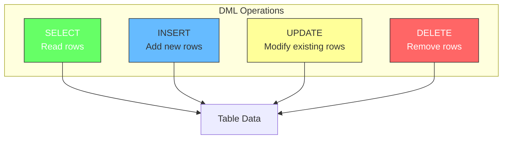
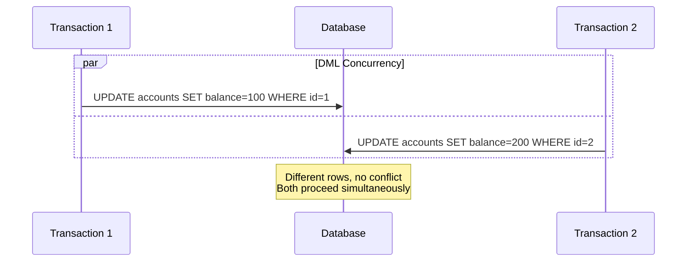
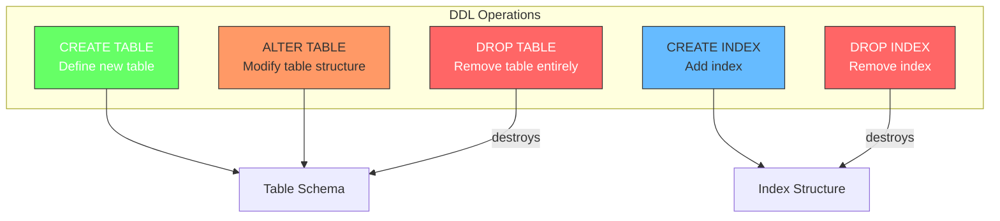
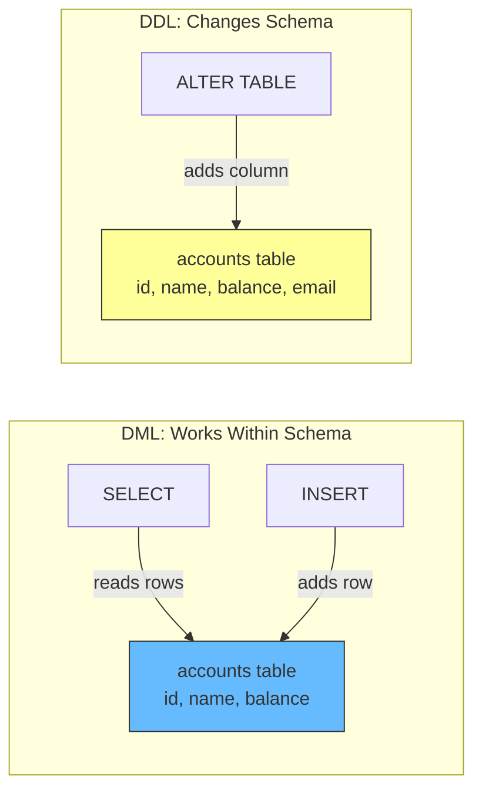
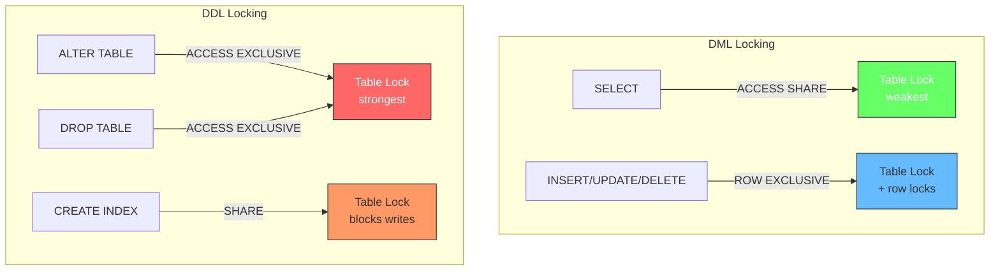
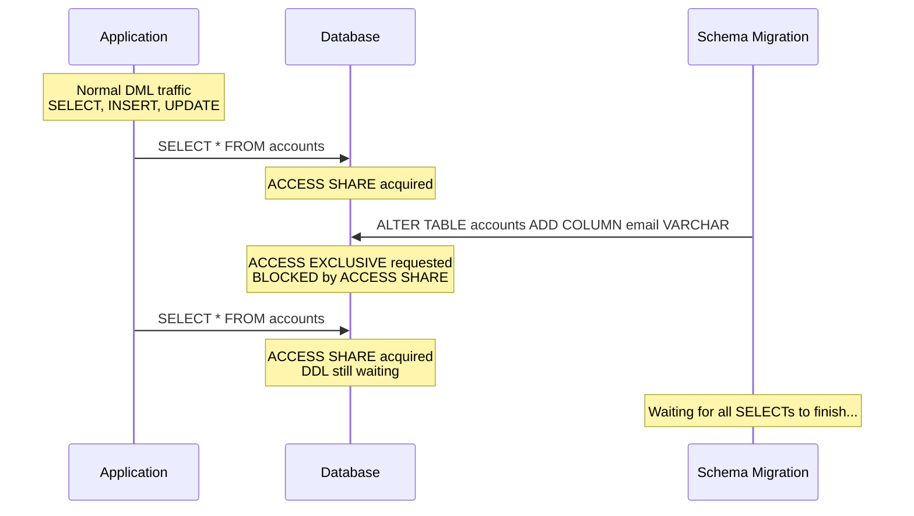
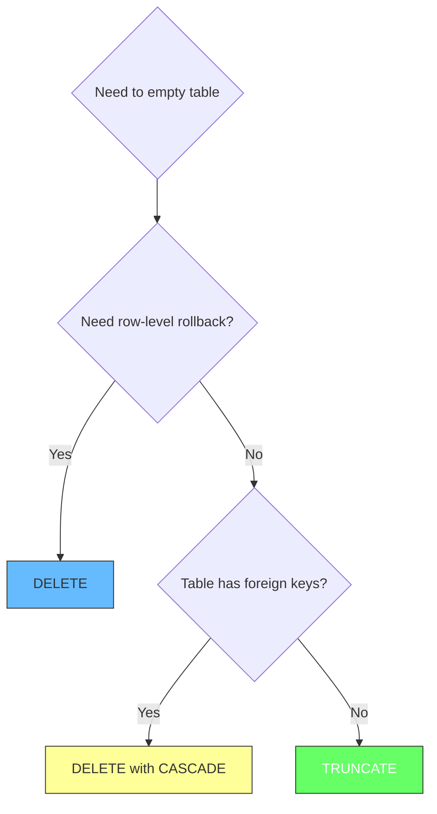
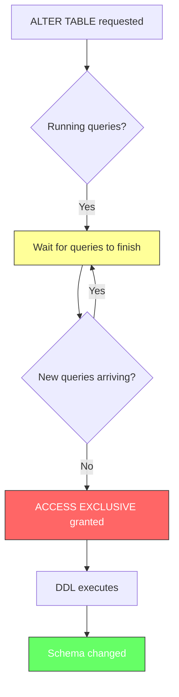
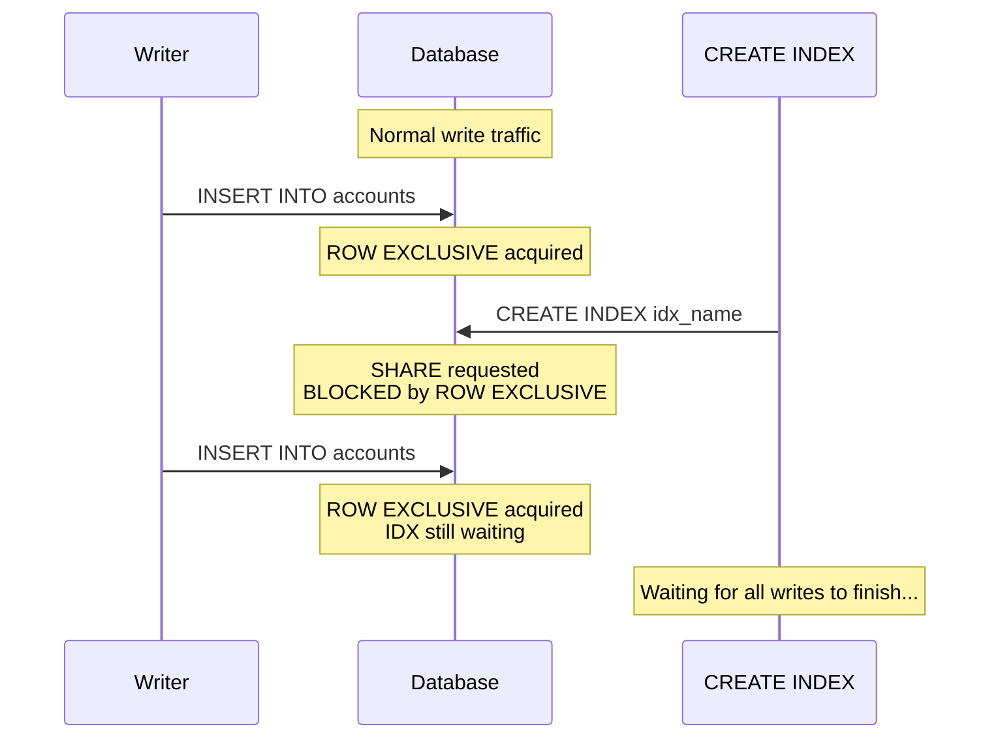
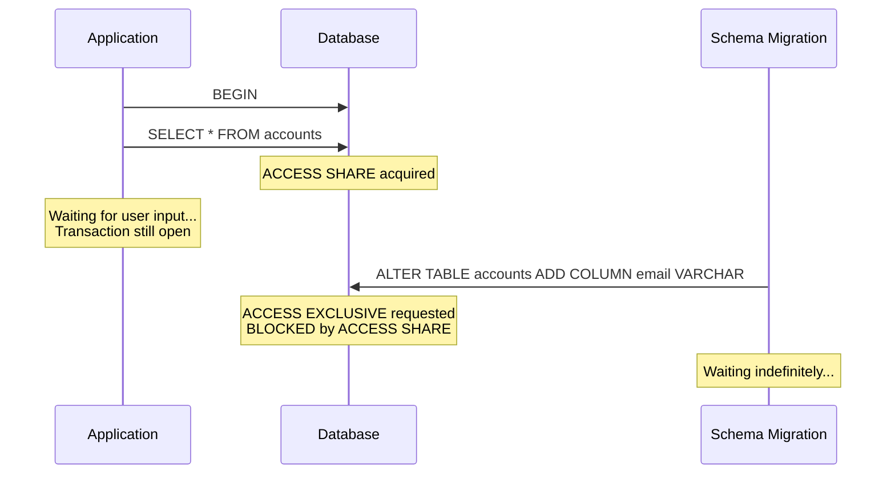

# DDL vs DML: Two Sides of SQL

Every SQL statement falls into one of two categories: statements that define what your data looks like, and statements that manipulate the data itself. Understanding this distinction explains why some queries block others, why schema changes are dangerous in production, and how PostgreSQL locks different operations.

## DML: Data Manipulation Language

DML statements read and modify the actual data stored in tables. These are the queries your application runs thousands of times per second: SELECT, INSERT, UPDATE, DELETE. DML operations work at the row level, reading and writing individual tuples.



DML statements are designed for high concurrency. SELECT uses MVCC snapshots to read without blocking writers. INSERT, UPDATE, and DELETE acquire row-level locks on the specific rows they modify, allowing other transactions to work on different rows simultaneously. This is why a busy OLTP database can handle thousands of DML operations per second on the same table.



The key property of DML is that it does not change the table structure. It works within the existing schema: reading rows, adding rows, modifying rows, or removing rows. The columns, data types, and constraints remain the same.

## DDL: Data Definition Language

DDL statements define and modify the structure of database objects: tables, indexes, schemas, constraints. These are the statements that create, alter, and drop the containers that hold your data. DDL operations work at the schema level, not the row level.



DDL statements are infrequent but high-impact. You do not CREATE TABLE every second, but when you do, it defines the structure that every subsequent query depends on. ALTER TABLE might run once a month during a schema migration, but it changes the blueprint that all application code uses.



DDL statements change the contract between the database and the application. Adding a column changes what data the table can hold. Dropping a column removes data. Changing a data type might invalidate existing data. This is why DDL requires stronger locking than DML.

## Locking: The Critical Difference

DML and DDL have different locking behavior because they affect different things. DML locks rows, DDL locks tables. This difference explains why schema changes can disrupt production workloads.



DML statements acquire locks that are compatible with other DML. SELECT gets ACCESS SHARE, which only conflicts with ACCESS EXCLUSIVE. INSERT, UPDATE, DELETE get ROW EXCLUSIVE, which does not conflict with SELECT or other DML on different rows. This is why thousands of DML operations can run concurrently on the same table.

DDL statements acquire locks that conflict with everything. ALTER TABLE and DROP TABLE get ACCESS EXCLUSIVE, which blocks every other operation including SELECT. CREATE INDEX gets SHARE, which blocks all writes. This is why DDL operations can bring a production database to a halt.



This is why DDL on popular tables is dangerous in production. A single ALTER TABLE must wait for every running query to finish before it can acquire ACCESS EXCLUSIVE. While waiting, new queries keep arriving and acquiring ACCESS SHARE, pushing the DDL further back. The DDL can wait indefinitely if queries never stop.

## DML Operations in Detail

### SELECT

SELECT reads data without modifying anything. It acquires ACCESS SHARE on the table (preventing DDL) and uses an MVCC snapshot to read consistent data (not blocking other DML). SELECT is the most concurrent operation in PostgreSQL.

ACCESS SHARE protects SELECT from DDL. Without it, a SELECT could be reading a table while ALTER TABLE drops a column mid-query. When SELECT grabs ACCESS SHARE, DDL cannot acquire ACCESS EXCLUSIVE until the SELECT finishes. So the flow is: SELECT grabs ACCESS SHARE, DDL requests ACCESS EXCLUSIVE, DDL must wait, SELECT finishes, DDL proceeds. The lock is not about preventing blocking. It is about protecting the reader from schema changes happening mid-read.

```sql
-- Basic read (ACCESS SHARE, MVCC snapshot)
SELECT * FROM accounts WHERE balance > 1000;

-- Read with aggregation (ACCESS SHARE, MVCC snapshot)
SELECT name, AVG(balance) FROM accounts GROUP BY name HAVING AVG(balance) > 500;

-- Read with join (ACCESS SHARE, MVCC snapshot)
SELECT a.name, o.amount
FROM accounts a
JOIN orders o ON a.id = o.account_id
WHERE o.created_at > '2024-01-01';

-- Read with subquery (ACCESS SHARE, MVCC snapshot)
SELECT * FROM accounts
WHERE balance > (SELECT AVG(balance) FROM accounts);
```

SELECT can also acquire row-level locks using FOR UPDATE, FOR SHARE, or FOR KEY SHARE. These variants are used when you need to read a row and then modify it based on what you read, preventing other transactions from modifying the same row between your read and write.

```sql
-- Lock rows for update (ACCESS SHARE + ROW-level exclusive lock)
SELECT * FROM accounts WHERE id = 1 FOR UPDATE;

-- Lock rows for share (ACCESS SHARE + ROW-level share lock)
SELECT * FROM accounts WHERE id = 1 FOR SHARE;

-- Lock rows for key share (ACCESS SHARE + ROW-level key share lock, weakest)
SELECT * FROM accounts WHERE id = 1 FOR KEY SHARE;

-- Lock only existing rows, skip locked ones (ACCESS SHARE + ROW-level exclusive, SKIP LOCKED)
SELECT * FROM accounts WHERE id = 1 FOR UPDATE SKIP LOCKED;

-- Lock rows in order to prevent deadlocks (ACCESS SHARE + ROW-level exclusive)
SELECT * FROM accounts WHERE id IN (1, 2) ORDER BY id FOR UPDATE;
```

### INSERT

INSERT adds new rows to a table. It acquires ROW EXCLUSIVE on the table and creates new tuple versions with the inserting transaction's xmin. INSERT does not conflict with SELECT or other INSERT operations. It only conflicts with SHARE and higher locks (used by CREATE INDEX).

```sql
-- Single row insert (ROW EXCLUSIVE on table, new tuple with xmin)
INSERT INTO accounts (name, balance) VALUES ('Alice', 500);

-- Multiple rows insert (ROW EXCLUSIVE on table, new tuples with xmin)
INSERT INTO accounts (name, balance) VALUES
    ('Bob', 300),
    ('Charlie', 700),
    ('Diana', 1000);

-- Insert with returning clause (ROW EXCLUSIVE, returns generated id)
INSERT INTO accounts (name, balance) VALUES ('Eve', 250) RETURNING id;

-- Insert from another table (ROW EXCLUSIVE on target, ACCESS SHARE on source)
INSERT INTO archived_accounts (name, balance)
SELECT name, balance FROM accounts WHERE balance < 100;

-- Insert with on conflict handling / upsert (ROW EXCLUSIVE, may update instead)
INSERT INTO accounts (name, balance) VALUES ('Alice', 500)
ON CONFLICT (name) DO UPDATE SET balance = EXCLUDED.balance;

-- Insert with on conflict do nothing (ROW EXCLUSIVE, silently skips duplicates)
INSERT INTO accounts (name, balance) VALUES ('Alice', 500)
ON CONFLICT (name) DO NOTHING;
```

### UPDATE

UPDATE modifies existing rows. It acquires ROW EXCLUSIVE on the table and an implicit FOR UPDATE row lock on the matching rows. UPDATE creates a new tuple version (the updated row) and marks the old version as deleted by setting xmax. This is where MVCC and locking intersect: MVCC handles the snapshot consistency, locks prevent two transactions from updating the same row simultaneously.

```sql
-- Simple update (ROW EXCLUSIVE + implicit FOR UPDATE on matched rows)
UPDATE accounts SET balance = balance - 100 WHERE id = 1;

-- Update with condition (ROW EXCLUSIVE + implicit FOR UPDATE on matched rows)
UPDATE accounts SET balance = balance * 1.05 WHERE balance < 1000;

-- Update multiple columns (ROW EXCLUSIVE + implicit FOR UPDATE on matched rows)
UPDATE accounts SET name = 'Alice Smith', balance = 600 WHERE id = 1;

-- Update with returning clause (ROW EXCLUSIVE + implicit FOR UPDATE, returns modified rows)
UPDATE accounts SET balance = balance - 100 WHERE id = 1 RETURNING *;

-- Update from another table / join update (ROW EXCLUSIVE + implicit FOR UPDATE on matched rows)
UPDATE accounts a SET balance = a.balance - o.amount
FROM orders o WHERE a.id = o.account_id AND o.id = 100;

-- Update with subquery (ROW EXCLUSIVE + implicit FOR UPDATE on matched rows)
UPDATE accounts SET balance = balance * 1.1
WHERE id IN (SELECT account_id FROM orders WHERE amount > 500);

-- Update with CTE (ROW EXCLUSIVE + implicit FOR UPDATE on matched rows)
WITH high_balance AS (
    SELECT id FROM accounts WHERE balance > 1000
)
UPDATE accounts SET balance = balance - 100
WHERE id IN (SELECT id FROM high_balance);
```

### DELETE

DELETE removes rows from a table. It acquires ROW EXCLUSIVE on the table and an implicit FOR UPDATE row lock on the matching rows. DELETE marks the row as deleted by setting xmax, but the row stays in the heap until VACUUM cleans it up. The row becomes a dead tuple.

```sql
-- Simple delete (ROW EXCLUSIVE + implicit FOR UPDATE on matched rows)
DELETE FROM accounts WHERE id = 1;

-- Delete with condition (ROW EXCLUSIVE + implicit FOR UPDATE on matched rows)
DELETE FROM accounts WHERE balance < 0;

-- Delete with returning clause (ROW EXCLUSIVE + implicit FOR UPDATE, returns deleted rows)
DELETE FROM accounts WHERE balance < 0 RETURNING *;

-- Delete with subquery (ROW EXCLUSIVE + implicit FOR UPDATE on matched rows)
DELETE FROM accounts WHERE id IN (SELECT account_id FROM closed_accounts);

-- Delete with join (ROW EXCLUSIVE + implicit FOR UPDATE on matched rows)
DELETE FROM accounts a USING orders o
WHERE a.id = o.account_id AND o.id = 100;

-- Delete all rows (ROW EXCLUSIVE + implicit FOR UPDATE on all rows)
DELETE FROM accounts;

-- Delete with limit, PostgreSQL 12+ (ROW EXCLUSIVE + implicit FOR UPDATE on matched rows)
DELETE FROM accounts WHERE balance < 0 LIMIT 100;
```

## DDL Operations in Detail

### CREATE TABLE

CREATE TABLE defines a new table structure. It creates the heap file, page headers, and system catalog entries. This is a DDL operation that requires exclusive access to the system catalog but does not lock existing tables.

```sql
-- Basic table creation (ACCESS EXCLUSIVE on new table, no lock on existing tables)
CREATE TABLE accounts (
    id SERIAL PRIMARY KEY,
    name VARCHAR(100) NOT NULL,
    balance NUMERIC(10, 2) DEFAULT 0
);

-- Table with constraints (ACCESS EXCLUSIVE on new table)
CREATE TABLE orders (
    id SERIAL PRIMARY KEY,
    account_id INTEGER NOT NULL REFERENCES accounts(id),
    amount NUMERIC(10, 2) CHECK (amount > 0),
    created_at TIMESTAMP DEFAULT CURRENT_TIMESTAMP
);

-- Table with unique constraint (ACCESS EXCLUSIVE on new table)
CREATE TABLE users (
    id SERIAL PRIMARY KEY,
    email VARCHAR(255) UNIQUE NOT NULL,
    username VARCHAR(50) UNIQUE NOT NULL
);

-- Create table only if it does not exist (ACCESS EXCLUSIVE on new table)
CREATE TABLE IF NOT EXISTS accounts (
    id SERIAL PRIMARY KEY,
    name VARCHAR(100) NOT NULL
);

-- Create table from another table, copy structure (ACCESS EXCLUSIVE on new table)
CREATE TABLE accounts_backup (LIKE accounts INCLUDING ALL);

-- Create table from query results (ACCESS EXCLUSIVE on new table + ACCESS SHARE on source)
CREATE TABLE high_balance_accounts AS
SELECT * FROM accounts WHERE balance > 1000;
```

### ALTER TABLE

ALTER TABLE modifies an existing table structure: adding columns, dropping columns, changing data types, adding constraints. Most ALTER TABLE variants acquire ACCESS EXCLUSIVE, blocking all other operations. Some operations like ADD COLUMN without a default are instant in PostgreSQL 11+ (no table rewrite).

```sql
-- Add a column (ACCESS EXCLUSIVE, instant in PG 11+ if no default)
ALTER TABLE accounts ADD COLUMN email VARCHAR(255);

-- Add a column with default (ACCESS EXCLUSIVE, instant in PG 11+)
ALTER TABLE accounts ADD COLUMN status VARCHAR(20) DEFAULT 'active';

-- Drop a column (ACCESS EXCLUSIVE)
ALTER TABLE accounts DROP COLUMN email;

-- Rename a column (ACCESS EXCLUSIVE)
ALTER TABLE accounts RENAME COLUMN name TO full_name;

-- Change data type (ACCESS EXCLUSIVE, may require table rewrite)
ALTER TABLE accounts ALTER COLUMN balance TYPE NUMERIC(12, 2);

-- Add a constraint (ACCESS EXCLUSIVE, scans table for existing violations)
ALTER TABLE accounts ADD CONSTRAINT positive_balance CHECK (balance >= 0);

-- Drop a constraint (ACCESS EXCLUSIVE)
ALTER TABLE accounts DROP CONSTRAINT positive_balance;

-- Add not null constraint (ACCESS EXCLUSIVE, scans table for NULLs)
ALTER TABLE accounts ALTER COLUMN name SET NOT NULL;

-- Drop not null constraint (ACCESS EXCLUSIVE)
ALTER TABLE accounts ALTER COLUMN name DROP NOT NULL;

-- Set default value (ACCESS EXCLUSIVE, existing rows unaffected)
ALTER TABLE accounts ALTER COLUMN balance SET DEFAULT 0;

-- Drop default value (ACCESS EXCLUSIVE)
ALTER TABLE accounts ALTER COLUMN balance DROP DEFAULT;

-- Rename table (ACCESS EXCLUSIVE)
ALTER TABLE accounts RENAME TO customer_accounts;

-- Set table to read-only (ACCESS EXCLUSIVE)
ALTER TABLE accounts SET (read_only = true);
```

### DROP TABLE

DROP TABLE removes a table entirely: the heap file, all indexes, and the system catalog entry. It acquires ACCESS EXCLUSIVE. All data in the table is lost. This is irreversible without backups.

```sql
-- Drop table (ACCESS EXCLUSIVE on table, fails if not exists)
DROP TABLE accounts;

-- Drop table only if it exists (ACCESS EXCLUSIVE on table)
DROP TABLE IF EXISTS accounts;

-- Drop table and all dependent objects (ACCESS EXCLUSIVE on table + dependents)
DROP TABLE accounts CASCADE;

-- Drop multiple tables at once (ACCESS EXCLUSIVE on each table)
DROP TABLE accounts, orders, users;
```

### CREATE INDEX

CREATE INDEX builds an index on a table. It acquires SHARE on the table, blocking all writes (INSERT, UPDATE, DELETE) but allowing reads. The index build reads all existing rows and constructs the index structure. On large tables, this can take minutes during which no writes can happen.

```sql
-- B-tree index (SHARE on table, blocks writes during build)
CREATE INDEX idx_accounts_name ON accounts (name);

-- Unique index (SHARE on table, blocks writes, checks uniqueness)
CREATE UNIQUE INDEX idx_accounts_email ON accounts (email);

-- Composite index (SHARE on table, blocks writes during build)
CREATE INDEX idx_orders_account_date ON orders (account_id, created_at);

-- Partial index (SHARE on table, blocks writes during build)
CREATE INDEX idx_accounts_active ON accounts (name) WHERE balance > 0;

-- Index with specific sort order (SHARE on table, blocks writes during build)
CREATE INDEX idx_accounts_balance_desc ON accounts (balance DESC);

-- GIN index for arrays, full-text, JSONB (SHARE on table, blocks writes)
CREATE INDEX idx_products_tags ON products USING GIN (tags);

-- GiST index for geometric data (SHARE on table, blocks writes)
CREATE INDEX idx_locations_coords ON locations USING GIST (coordinates);
```

### CREATE INDEX CONCURRENTLY

CREATE INDEX CONCURRENTLY builds an index without blocking writes. It acquires SHARE UPDATE EXCLUSIVE instead of SHARE. The index build happens in multiple passes while allowing concurrent DML. This takes longer than regular CREATE INDEX but is safe for production tables.

```sql
-- Build index without blocking writes (SHARE UPDATE EXCLUSIVE on table)
CREATE INDEX CONCURRENTLY idx_accounts_name ON accounts (name);

-- Build unique index without blocking writes (SHARE UPDATE EXCLUSIVE on table)
CREATE INDEX CONCURRENTLY idx_accounts_email ON accounts (email);
```

### DROP INDEX

DROP INDEX removes an index. It acquires ACCESS EXCLUSIVE on the index. The index file is deleted and the system catalog entry is removed.

```sql
-- Drop index (ACCESS EXCLUSIVE on the index)
DROP INDEX idx_accounts_name;

-- Drop index only if it exists (ACCESS EXCLUSIVE on the index)
DROP INDEX IF EXISTS idx_accounts_name;

-- Drop index on a specific schema (ACCESS EXCLUSIVE on the index)
DROP INDEX IF EXISTS myschema.idx_accounts_name;
```

### TRUNCATE

TRUNCATE removes all rows from a table. It is classified as DDL because it acquires ACCESS EXCLUSIVE on the table and does not generate per-row WAL. It is much faster than DELETE for emptying tables. By default, TRUNCATE resets auto-increment counters. Use CONTINUE IDENTITY to preserve current sequence values.

The key difference between DELETE and TRUNCATE: DELETE is DML (row-level locks, generates WAL, can be rolled back row by row). TRUNCATE is DDL (table-level lock, minimal WAL, faster but blocks everything). Use DELETE when you need fine-grained control or want to rollback specific rows. Use TRUNCATE when you want to empty a table quickly and do not need row-level rollback.

```sql
-- Empty table (ACCESS EXCLUSIVE on table, resets auto-increment by default)
TRUNCATE accounts;

-- Empty table, preserve auto-increment values (ACCESS EXCLUSIVE on table)
TRUNCATE accounts CONTINUE IDENTITY;

-- Empty table and dependent tables (ACCESS EXCLUSIVE on table + dependents)
TRUNCATE accounts CASCADE;
```



### COMMENT

COMMENT adds or removes metadata comments on database objects. It acquires SHARE UPDATE EXCLUSIVE and is safe to run in production.

```sql
-- Add comment to table (SHARE UPDATE EXCLUSIVE)
COMMENT ON TABLE accounts IS 'Customer account balances';

-- Add comment to column (SHARE UPDATE EXCLUSIVE)
COMMENT ON COLUMN accounts.balance IS 'Current balance in USD';

-- Remove comment (SHARE UPDATE EXCLUSIVE)
COMMENT ON TABLE accounts IS NULL;
```


## When DDL Meets DML: Real-World Scenarios

### Schema Migration on a Busy Table

Running ALTER TABLE on a table with active traffic is the most common DDL/DML conflict. The ALTER must wait for all running queries to finish. While waiting, new queries pile on. The solution is to run DDL during low-traffic periods or use online schema migration tools.



### Index Build During Writes

CREATE INDEX blocks all writes to the table. On a table with heavy INSERT/UPDATE traffic, this means the writes queue up behind the index build. CREATE INDEX CONCURRENTLY avoids this but takes roughly twice as long to complete.



### VACUUM and DML

VACUUM acquires SHARE UPDATE EXCLUSIVE, which does not conflict with normal DML. This is why VACUUM can run in the background without blocking queries. But VACUUM FULL acquires ACCESS EXCLUSIVE, blocking everything. Never use VACUUM FULL in production.

```sql
-- Safe: does not block DML (SHARE UPDATE EXCLUSIVE)
VACUUM accounts;

-- Dangerous: blocks all operations (ACCESS EXCLUSIVE)
VACUUM FULL accounts;
```

### Long-Running Transaction Blocks DDL

If a transaction starts and holds a connection for minutes (for example, waiting for user input), it holds ACCESS SHARE on every table it reads. Any DDL on those tables will wait until the transaction commits or rolls back. This is why you should never hold transactions open while waiting for user input.



## Summary

| Property | DML | DDL |
|---|---|---|
| Purpose | Read and modify data | Define and modify structure |
| Statements | SELECT, INSERT, UPDATE, DELETE | CREATE, ALTER, DROP, TRUNCATE |
| Lock level | Row-level and weak table locks | Strong table locks |
| Concurrency | High (many DML can run simultaneously) | Low (DDL blocks everything) |
| Frequency | Thousands per second | Occasional (migrations) |
| MVCC | Uses snapshots for consistent reads | Does not use MVCC |
| Reversible | Yes (INSERT can be DELETEd) | Often no (DROP TABLE is permanent) |
| WAL impact | Generates WAL per row | Minimal WAL (especially TRUNCATE) |

DML is the daily traffic that keeps your application running. DDL is the occasional structural change that defines what that traffic looks like. Understanding the difference explains why schema changes require caution, why index builds need planning, and why PostgreSQL's locking model treats them so differently.

## Further Reading

- [PostgreSQL Concurrency Control: Locks, MVCC, and Write Performance](./postgresql-locks)
- [PostgreSQL Inner Workings: MVCC & Architecture](./postgresql-mvcc)
- [PostgreSQL Documentation: Explicit Locking](https://www.postgresql.org/docs/current/explicit-locking.html)
- [PostgreSQL Documentation: SQL Commands](https://www.postgresql.org/docs/current/sql-commands.html)
