# PostgreSQL Concurrency Control: Locks, MVCC, and Write Performance

How PostgreSQL coordinates concurrent access, why MVCC exists, and where write-heavy workloads hit limits.

> **Why locks matter:** Even with MVCC giving readers non-blocking snapshots, two writers hitting the same row simultaneously would silently overwrite each other without coordination. Locks are the mechanism that serializes conflicting writes and prevents data loss.

> **Why MVCC exists:** Traditional locking forces readers to wait for writers and writers to wait for readers. Under heavy concurrency, this creates a bottleneck where transactions queue up, killing throughput. MVCC solves this by giving each transaction a consistent snapshot of the database at the moment it starts, so readers never block writers and writers never block readers.

## Why Locks Exist

Even with MVCC, PostgreSQL still needs locks. MVCC handles read/write concurrency without blocking, but write/write concurrency still requires coordination. If two transactions try to modify the same row simultaneously, one must wait. Locks are the mechanism that enforces this ordering. Without locks, two concurrent updates could overwrite each other, losing data.

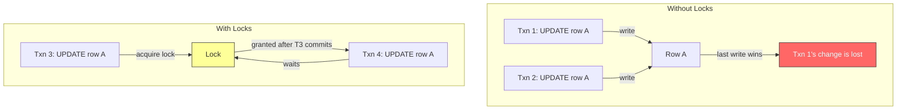

PostgreSQL uses a lock manager that tracks every lock held by every transaction. The lock manager stores lock information in a shared hash table in memory. When a transaction requests a lock, the lock manager checks if it conflicts with any existing lock. If it does, the transaction waits. If it does not, the lock is granted immediately. This is fast because the hash table lookup is O(1).

## What is Concurrency

Concurrency means multiple operations are in progress at the same time, overlapping in their execution. In a database, concurrency happens when multiple transactions read and write data simultaneously. The challenge is maintaining correctness: each transaction should see a consistent view of the data, and no transaction should lose its changes to another.

**Example:** Alice sends $100 to Bob, and at the same time Charlie sends $50 to Bob. Both transactions need to read and update Bob's balance. Without concurrency, the second transfer waits for the first to finish. With concurrency, both run simultaneously, but the database must ensure Bob's final balance is correct regardless of which transaction commits first.

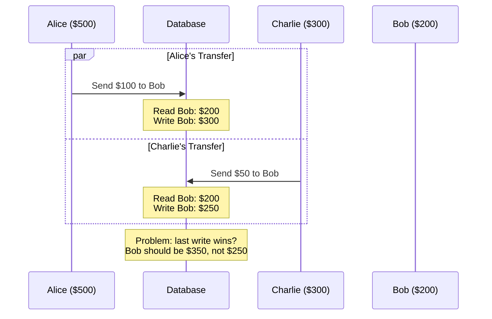

Without concurrency, transactions execute one after another. Alice's transfer finishes first (Bob becomes $300), then Charlie's transfer reads $300 and writes $350. With concurrency, both transactions read Bob's balance at $200 simultaneously. Alice writes $300, Charlie writes $250. The last write wins, and $100 disappears. The database must prevent this using locks or MVCC to ensure Bob ends up with $350.

Concurrency is not parallelism. Parallelism is multiple operations executing on different CPU cores at the exact same instant. Concurrency is multiple operations making progress during overlapping time periods, potentially interleaving on a single core. A database can handle concurrency with a single CPU core by switching between transactions, but parallelism requires multiple cores.

## Traditional Locking vs MVCC

Traditional reader-writer locks create a two-way bottleneck. When a reader holds a shared lock, the writer must wait. When a writer holds an exclusive lock, readers must wait. Under heavy concurrency with long-running queries, this means every transaction is queueing up behind every other transaction, killing throughput.

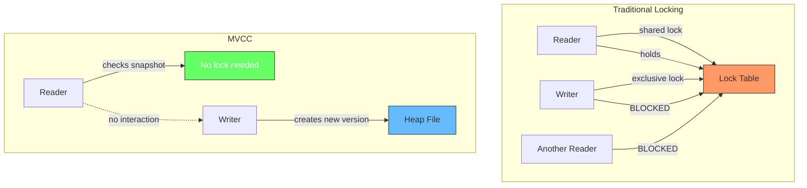

MVCC eliminates this by giving each transaction a consistent snapshot at the moment it starts. Readers check xmin/xmax visibility rules against their snapshot, requiring no locks. Writers create new row versions and lock only the specific row they modify. Other transactions reading the same row see the old version from their snapshot, completely unaffected by the write. The only contention that exists is between two writers trying to modify the same row simultaneously. In that case, the first writer to acquire the row lock wins and the second waits. But reads are completely non-blocking.

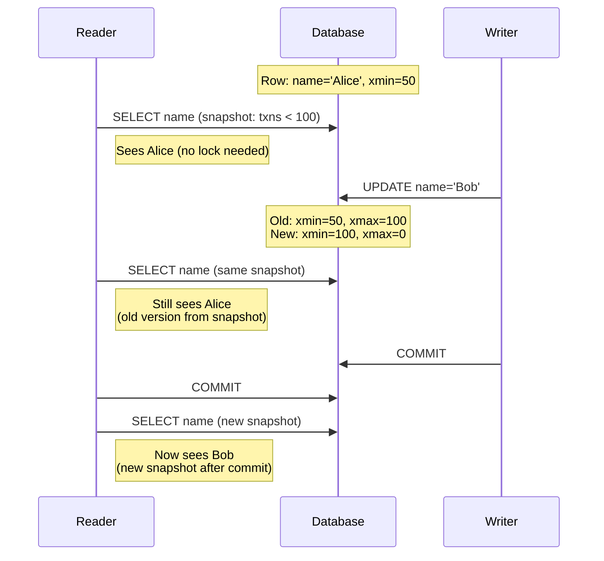

In the diagram, when the writer updates Alice to Bob, the old row version gets `xmax=100` (the writer's transaction ID), marking it as deleted by that transaction. The new row version gets `xmin=100` (created by the same transaction) and `xmax=0` (still live). The reader's snapshot was taken before txn 100 committed, so it still sees the old version where `xmax=100` was not yet committed. After the reader takes a new snapshot (after committing), it sees the new version where `xmin=100` is committed.

This is why PostgreSQL handles high-concurrency workloads so well. A long-running analytical query reading millions of rows does not block a transaction inserting new rows, and vice versa.

## Lock Modes: Shared vs Exclusive

PostgreSQL has two fundamental lock modes that form the basis of all locking behavior.

**Shared locks** (also called read locks) allow multiple transactions to hold them simultaneously. Any number of readers can hold a shared lock on the same resource at the same time. Shared locks prevent writes: while any transaction holds a shared lock on a row, no other transaction can acquire an exclusive lock on that row.

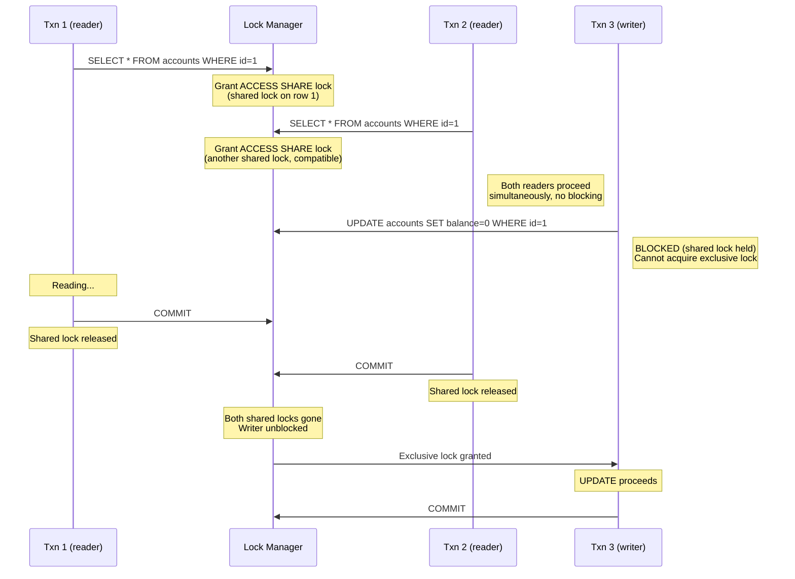

Three transactions operate on the same row. T1 and T2 are readers that acquire shared locks. Both proceed concurrently without blocking each other. T3 is a writer that needs an exclusive lock, but it must wait until both readers release their shared locks. Once T1 and T2 commit (releasing their locks), T3's exclusive lock is granted and the UPDATE proceeds. This is the reader-writer pattern: readers never block readers, but writers must wait for all readers to finish.

> **Why not use shared locks for writing?** A shared lock allows multiple holders simultaneously. If two writers both acquired shared locks on the same row, they could both write at the same time, and the last write would silently overwrite the first. That is the exact data loss problem locks exist to prevent. An exclusive lock ensures only one writer holds it at a time, serializing the writes and preserving data integrity.

**Exclusive locks** (also called write locks) allow only one holder. When a transaction holds an exclusive lock on a resource, no other transaction can hold any lock (shared or exclusive) on that same resource. Exclusive locks prevent both reads and writes from other transactions.

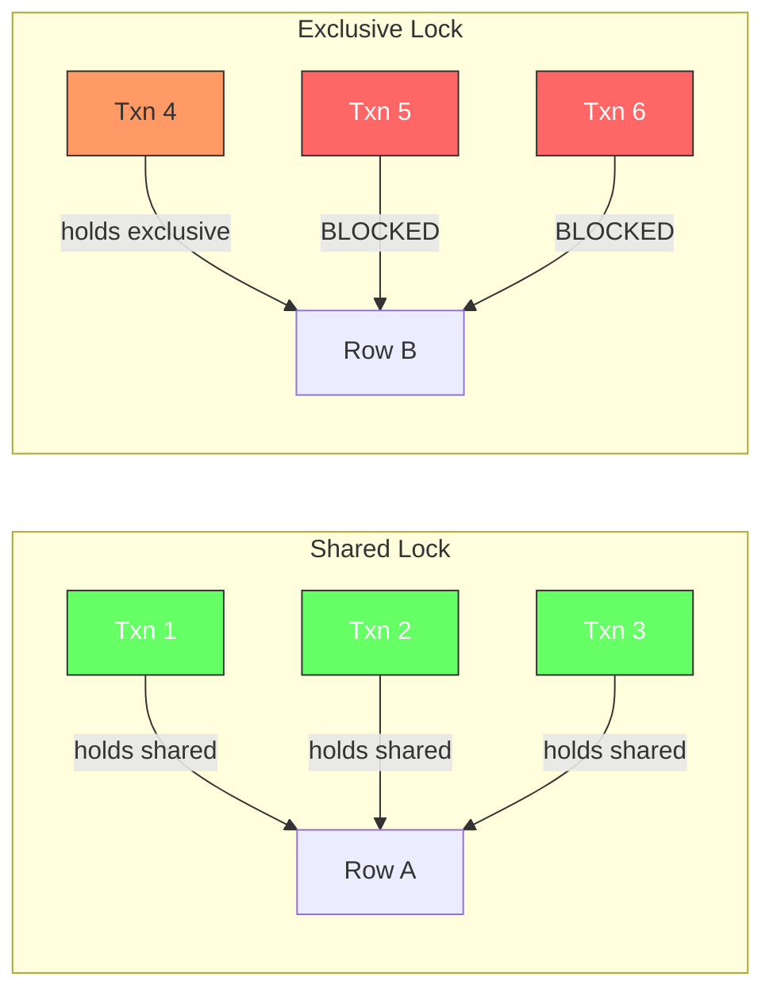

The key rule is simple: shared is compatible with shared, exclusive is compatible with nothing. Two shared locks can coexist. An exclusive lock cannot coexist with any other lock (shared or exclusive) on the same resource. This is the foundation of the reader-writer lock pattern used throughout PostgreSQL.

## Lock Compatibility Matrix

The full compatibility matrix shows which lock modes can be held simultaneously on the same resource. Understanding this matrix is essential for debugging lock contention.

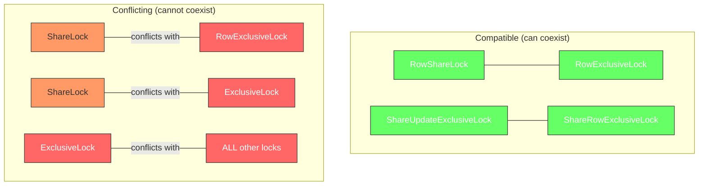

Here is the full compatibility table for the most common modes. A "yes" means the two locks can be held simultaneously on the same resource. A "no" means they conflict and one must wait.

| Requested / Held | ACCESS SHARE | ROW SHARE | ROW EXCLUSIVE | SHARE | SHARE ROW EXCLUSIVE | EXCLUSIVE |
|---|---|---|---|---|---|---|
| ACCESS SHARE | yes | yes | yes | yes | yes | no |
| ROW SHARE | yes | yes | yes | no | no | no |
| ROW EXCLUSIVE | yes | yes | no | no | no | no |
| SHARE | yes | no | no | no | no | no |
| SHARE ROW EXCLUSIVE | yes | no | no | no | no | no |
| EXCLUSIVE | no | no | no | no | no | no |

The pattern is clear: as locks become more restrictive (moving right and down in the table), they conflict with more modes. ACCESS SHARE is the weakest lock and conflicts with nothing. EXCLUSIVE is the strongest and conflicts with everything.

## Table-Level Locks

PostgreSQL applies table-level locks for DDL operations (ALTER TABLE, DROP TABLE, etc.) and some DML operations. These locks protect the table structure, not individual rows.

```mermaid
graph TD
    subgraph "Table Lock Modes (weakest to strongest)"
        A[ACCESS SHARE<br/>SELECT acquires this]
        B[ROW SHARE<br/>SELECT FOR UPDATE/SHARE]
        C[ROW EXCLUSIVE<br/>INSERT, UPDATE, DELETE]
        D[SHARE UPDATE EXCLUSIVE<br/>VACUUM, CREATE INDEX CONCURRENTLY]
        E[SHARE<br/>CREATE INDEX]
        F[SHARE ROW EXCLUSIVE<br/>CREATE TRIGGER, some ALTER TABLE]
        G[EXCLUSIVE<br/>REFRESH MATERIALIZED VIEW CONCURRENTLY]
        H[ACCESS EXCLUSIVE<br/>DROP TABLE, ALTER TABLE, VACUUM FULL]
    end

    A --> B --> C --> D --> E --> F --> G --> H

    style A fill:#6f6,stroke:#333,color:#fff
    style B fill:#6bf,stroke:#333
    style C fill:#ff9,stroke:#333
    style D fill:#f96,stroke:#333
    style E fill:#f66,stroke:#333,color:#fff
    style F fill:#f66,stroke:#333,color:#fff
    style G fill:#f66,stroke:#333,color:#fff
    style H fill:#f66,stroke:#333,color:#fff
```

**ACCESS SHARE** is acquired by SELECT queries. It only conflicts with ACCESS EXCLUSIVE (the strongest lock). This is why SELECT never blocks INSERT/UPDATE/DELETE, and vice versa, at the table level.

**ACCESS EXCLUSIVE** is the strongest lock. It conflicts with every other lock mode, including ACCESS SHARE. It is acquired by DROP TABLE, ALTER TABLE, VACUUM FULL, and REINDEX. While this lock is held, no other transaction can even read the table. This is why DDL operations can block all queries on a table.

**SHARE UPDATE EXCLUSIVE** is used by VACUUM and CREATE INDEX CONCURRENTLY. It prevents concurrent VACUUM and concurrent index builds, but does not block normal reads or writes. This is a targeted lock that protects maintenance operations from interfering with each other.

## Row-Level Locks

Row-level locks are what MVCC-aware transactions use. When you run SELECT FOR UPDATE or UPDATE/DELETE, PostgreSQL acquires a row-level lock on the specific rows being modified. These locks are stored in a separate lock table from table-level locks.

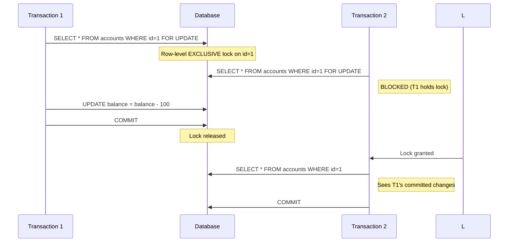

PostgreSQL has four row-level lock modes:

**FOR UPDATE** acquires an EXCLUSIVE row lock. Other transactions cannot modify or lock this row until the lock is released. This is the strongest row-level lock.

**FOR NO KEY UPDATE** is similar to FOR UPDATE but weaker. It does not conflict with FOR KEY SHARE. Use this when you are updating non-key columns and do not need to prevent foreign key checks from other transactions.

**FOR SHARE** acquires a SHARE row lock. Multiple transactions can hold this lock simultaneously. No transaction can modify the row while any transaction holds a SHARE lock.

**FOR KEY SHARE** is the weakest row lock. It only conflicts with FOR UPDATE and FOR NO KEY UPDATE. It is used internally for foreign key checks: when you insert a row with a foreign key, PostgreSQL acquires KEY SHARE on the referenced row to prevent it from being deleted while the reference exists.

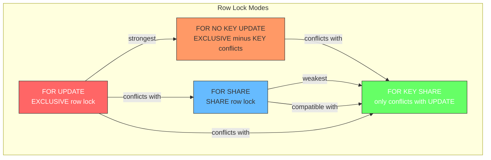

## SQL Statements and Their Locks

Every SQL statement acquires locks automatically. Understanding which locks each statement takes helps predict contention and debug blocking issues.

### DML Statements (Data Manipulation)

```sql
SELECT * FROM accounts;
```
Acquires **ACCESS SHARE** on the table. This is the weakest lock. It only conflicts with ACCESS EXCLUSIVE (DROP TABLE, ALTER TABLE). SELECT never blocks writes and writes never block SELECT at the table level.

```sql
SELECT * FROM accounts WHERE id = 1 FOR UPDATE;
```
Acquires **ROW EXCLUSIVE** on the table and **FOR UPDATE** (row-level exclusive) on the matching rows. Other transactions cannot modify or lock these rows until you commit. Use this when you need to read a row and then update it based on what you read.

```sql
SELECT * FROM accounts WHERE id = 1 FOR SHARE;
```
Acquires **ROW SHARE** on the table and **FOR SHARE** (row-level share) on the matching rows. Multiple transactions can hold this lock simultaneously. No transaction can modify these rows while any transaction holds a FOR SHARE lock.

```sql
SELECT * FROM accounts WHERE id = 1 FOR KEY SHARE;
```
Acquires **ROW SHARE** on the table and **FOR KEY SHARE** on the matching rows. This is the weakest row lock. It only conflicts with FOR UPDATE and FOR NO KEY UPDATE. PostgreSQL uses this internally for foreign key checks.

```sql
INSERT INTO accounts (name, balance) VALUES ('Alice', 100);
```
Acquires **ROW EXCLUSIVE** on the table. This lock does not conflict with SELECT or other INSERT/UPDATE/DELETE operations. It only conflicts with SHARE and higher locks (used by CREATE INDEX, VACUUM FULL).

```sql
UPDATE accounts SET balance = balance - 100 WHERE id = 1;
```
Acquires **ROW EXCLUSIVE** on the table and an implicit **FOR UPDATE** row lock on the matching rows. The row lock prevents other transactions from modifying the same row until this transaction commits.

```sql
DELETE FROM accounts WHERE id = 1;
```
Acquires **ROW EXCLUSIVE** on the table and an implicit **FOR UPDATE** row lock on the matching rows. Same locking behavior as UPDATE.

### DDL Statements (Data Definition)

```sql
CREATE INDEX idx_name ON accounts (name);
```
Acquires **SHARE** on the table. This conflicts with INSERT/UPDATE/DELETE (ROW EXCLUSIVE) but not with SELECT. While the index is being built, no writes can happen to the table.

```sql
CREATE INDEX CONCURRENTLY idx_name ON accounts (name);
```
Acquires **SHARE UPDATE EXCLUSIVE** on the table. This is weaker than SHARE. It allows concurrent reads and writes while the index is being built. This is the preferred way to index production tables.

```sql
ALTER TABLE accounts ADD COLUMN email VARCHAR(255);
```
Acquires **ACCESS EXCLUSIVE** on the table. This conflicts with every other lock, including SELECT. While this runs, no other transaction can even read the table. This is why DDL on large tables can be disruptive.

```sql
DROP TABLE accounts;
```
Acquires **ACCESS EXCLUSIVE** on the table. Same as ALTER TABLE. No other transaction can access the table until the drop completes.

```sql
VACUUM accounts;
```
Acquires **SHARE UPDATE EXCLUSIVE** on the table. This prevents concurrent VACUUM and concurrent index builds, but does not block normal reads or writes.

```sql
VACUUM FULL accounts;
```
Acquires **ACCESS EXCLUSIVE** on the table. This is the only VACUUM that blocks all other operations. It rewrites the entire table to reclaim space, which is why it is rarely used in production.

### Summary Table

| SQL Statement | Table Lock | Row Lock |
|---|---|---|
| SELECT | ACCESS SHARE | None |
| SELECT FOR UPDATE | ROW EXCLUSIVE | FOR UPDATE |
| SELECT FOR SHARE | ROW SHARE | FOR SHARE |
| SELECT FOR KEY SHARE | ROW SHARE | FOR KEY SHARE |
| INSERT | ROW EXCLUSIVE | None |
| UPDATE | ROW EXCLUSIVE | FOR UPDATE (implicit) |
| DELETE | ROW EXCLUSIVE | FOR UPDATE (implicit) |
| CREATE INDEX | SHARE | None |
| CREATE INDEX CONCURRENTLY | SHARE UPDATE EXCLUSIVE | None |
| ALTER TABLE | ACCESS EXCLUSIVE | None |
| DROP TABLE | ACCESS EXCLUSIVE | None |
| VACUUM | SHARE UPDATE EXCLUSIVE | None |
| VACUUM FULL | ACCESS EXCLUSIVE | None |

## Lock Manager Internals

The lock manager is a subsystem that lives in shared memory. It maintains a hash table mapping (resource, transaction ID) pairs to lock mode information. When a transaction requests a lock, the lock manager looks up the resource in the hash table, checks for conflicts with existing locks, and either grants the lock immediately or puts the transaction in a wait queue.

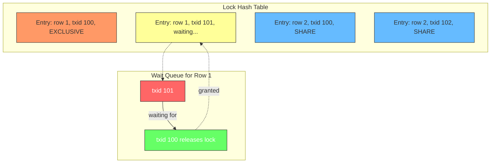

Each entry in the hash table tracks the lock mode, the transaction ID holding (or waiting for) the lock, and whether the lock is granted or waiting. The lock manager also tracks the total number of locks held by each transaction, which is important for deadlock detection. If a transaction acquires too many locks (more than `max_locks_per_transaction`), it gets an error.

You can inspect current locks using the `pg_locks` system view:

```sql
SELECT pid, locktype, relation::regclass, mode, granted
FROM pg_locks
WHERE relation = 'accounts'::regclass;
```

This shows every lock on the `accounts` table, which transaction holds it, and whether it is granted or waiting. This is the first tool to use when debugging lock contention.

## Deadlocks

A deadlock occurs when two transactions are each waiting for a lock that the other holds. Neither can proceed, and they are stuck forever without intervention.

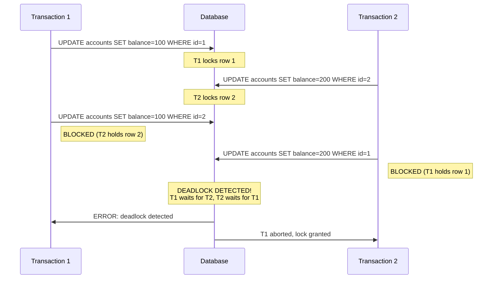

PostgreSQL detects deadlocks automatically using a timeout-based approach. Every time a transaction waits for a lock, PostgreSQL checks if a deadlock exists by traversing the wait-for graph (a directed graph where edges represent "waiting for" relationships). If a cycle is found, PostgreSQL aborts one of the transactions (the one that would be cheapest to roll back) and returns an error.

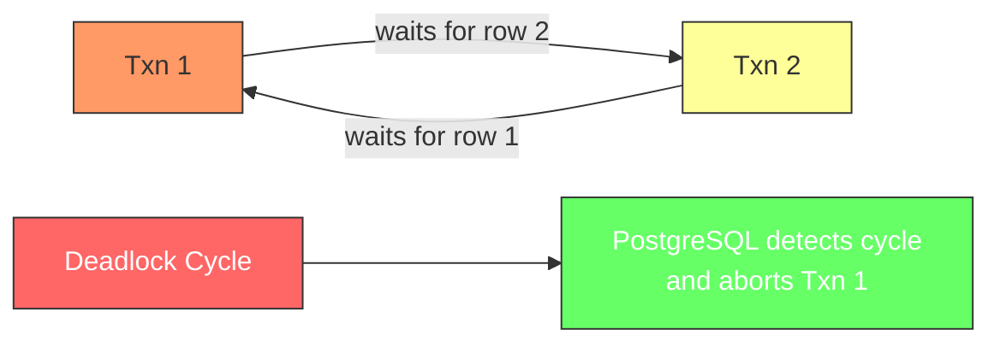

The `deadlock_timeout` parameter controls how often PostgreSQL checks for deadlocks (default: 1 second). If a transaction waits longer than this, a deadlock check is triggered. To avoid deadlocks, always acquire locks in the same order. If transaction A locks row 1 then row 2, transaction B should also lock row 1 then row 2. This eliminates cycles in the wait-for graph.

## Advisory Locks

Advisory locks are locks that the application manages explicitly. They are not tied to any database row or table. Instead, the application chooses an arbitrary integer (or two integers) as a lock key and acquires/releases locks on that key. Advisory locks are useful for application-level coordination: preventing duplicate jobs, implementing distributed locks, or protecting non-database resources.

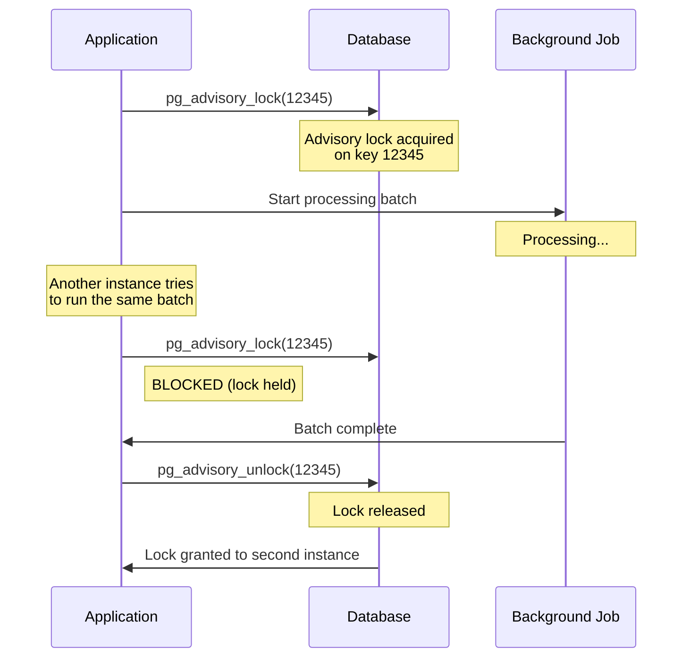

PostgreSQL supports two types of advisory locks. **Session-level locks** are held until explicitly released or the session ends. They are acquired with `pg_advisory_lock(key)` and released with `pg_advisory_unlock(key)`. **Transaction-level locks** are held until the transaction commits or rolls back. They are acquired with `pg_advisory_xact_lock(key)` and do not need explicit release.

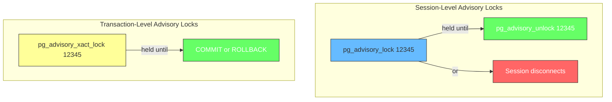

Advisory locks do not conflict with table-level or row-level locks. They are an independent locking mechanism. Two transactions can hold advisory locks on the same key only if they use compatible modes (shared vs exclusive). Advisory locks are stored in a separate hash table from regular locks.

## Locks and MVCC: When They Interact

MVCC and locks are complementary, not competing. MVCC handles read/write concurrency without locks. Locks handle write/write concurrency and operations that need stronger guarantees.

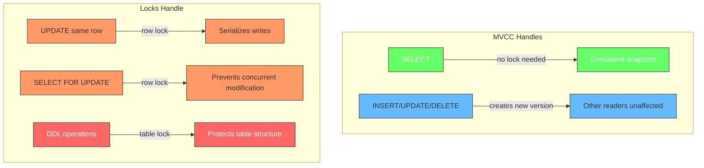

The key insight is that MVCC makes reads non-blocking, but writes to the same row still need coordination. If two transactions update the same row, the first one to acquire the row lock wins. The second waits. Once the first commits, the second sees the new version and applies its change. MVCC ensures the second transaction's snapshot is consistent, but the row lock ensures the actual modification is serialized.

Even with MVCC, long-running transactions can cause problems. If transaction A holds a row lock for 30 seconds while processing, every other transaction trying to modify that row is blocked for 30 seconds. MVCC helps readers see old versions, but it cannot help writers that need the same row. This is why keeping transactions short is always good practice, regardless of MVCC.

## Lock Monitoring

PostgreSQL provides several views and functions for monitoring locks.

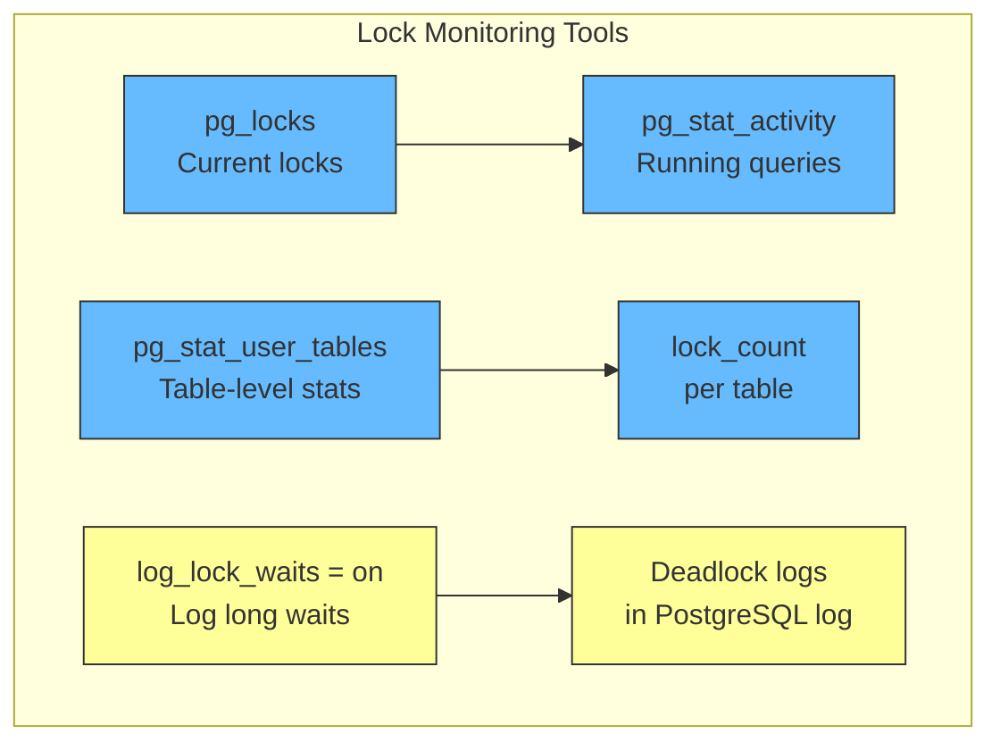

The most useful queries for debugging lock issues:

```sql
-- Find all locks with waiting transactions
SELECT blocked.pid AS blocked_pid,
       blocked.query AS blocked_query,
       blocking.pid AS blocking_pid,
       blocking.query AS blocking_query
FROM pg_locks blocked_locks
JOIN pg_stat_activity blocked ON blocked.pid = blocked_locks.pid
JOIN pg_locks blocking_locks ON blocking_locks.locktype = blocked_locks.locktype
  AND blocking_locks.relation = blocked_locks.relation
  AND blocking_locks.pid != blocked_locks.pid
JOIN pg_stat_activity blocking ON blocking.pid = blocking_locks.pid
WHERE NOT blocked_locks.granted;
```

This query finds transactions that are waiting for locks and identifies which transactions are blocking them. It is the first query to run when you see a query hanging. You can also set `log_lock_waits = on` and `deadlock_timeout = 1s` to log lock waits and deadlocks to the PostgreSQL log for post-mortem analysis.

## Write-Heavy Workloads: Where PostgreSQL Struggles

PostgreSQL is not bad for writes, but it has real limitations under heavy write throughput. The statement "PostgreSQL is not good for write-heavy workloads" is partially correct but oversimplified.

**1. MVCC overhead creates write amplification**

Every UPDATE creates a new row version. The old version stays in the heap until VACUUM cleans it up. Under heavy writes, dead tuples accumulate faster than VACUUM can reclaim them, causing table bloat. This means more disk I/O, more WAL, and slower scans.

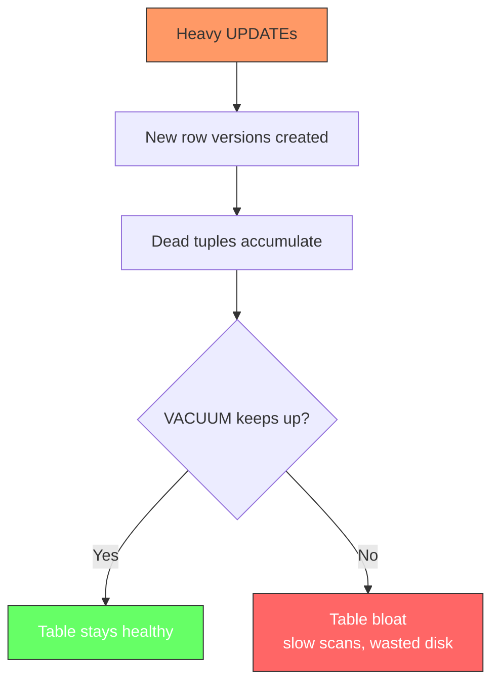

**2. Single-writer per page**

PostgreSQL uses buffer content locks. Two transactions writing to the same 8KB page serialize at the page level, even if they modify different rows on that page. High-concurrency writes to the same table create lock contention at the page level.

**3. Index maintenance**

Every write updates every index on the table. A table with 10 indexes means 10x the write work. This is why write-heavy schemas often minimize indexes.

**4. WAL amplification**

Every write generates WAL records. With synchronous replication, the primary waits for standbys to confirm WAL receipt before committing. This adds latency to every write.

**5. No horizontal write scaling**

PostgreSQL scales reads (add more replicas) but writes stay on one primary. You cannot distribute writes across multiple nodes without external tools like Citus. Databases like Cassandra or DynamoDB distribute writes across many nodes by design.

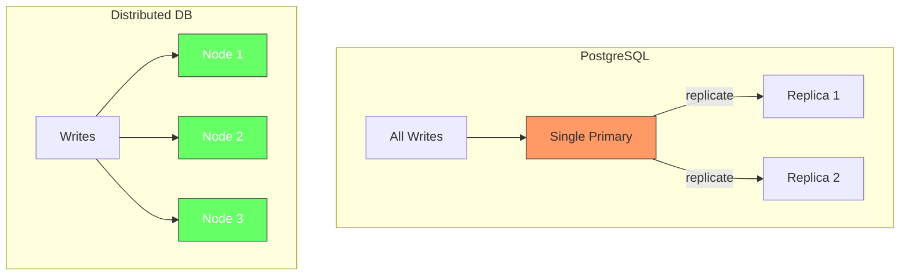

**Where PostgreSQL is fine:** Write-heavy workloads on a single node with fast NVMe storage perform well. Tuning autovacuum, shared_buffers, and WAL settings helps significantly. Partitioning large tables reduces contention.

**Where it struggles:** Write throughput exceeding what one node can handle. Workloads requiring thousands of concurrent writers to the same table. Environments where VACUUM cannot keep up with dead tuple generation.

The honest answer: PostgreSQL handles writes well on a single node, but it does not scale writes horizontally like purpose-built distributed databases. The limitation is architectural, not a performance flaw.

## Key Takeaways

| Concept | What It Does |
|---------|--------------|
| Shared Lock | Read lock; multiple holders allowed; blocks writes |
| Exclusive Lock | Write lock; single holder; blocks all other locks |
| Table-Level Locks | Protect table structure; used by DDL and maintenance |
| Row-Level Locks | Protect individual rows; used by FOR UPDATE/SHARE |
| Lock Manager | Hash table in shared memory; O(1) lock lookups |
| Deadlocks | Cycles in wait-for graph; auto-detected and resolved |
| Advisory Locks | Application-managed; not tied to rows or tables |
| MVCC + Locks | MVCC handles read/write; locks handle write/write |

## Further Reading

- [PostgreSQL Documentation: Explicit Locking](https://www.postgresql.org/docs/current/explicit-locking.html)
- [PostgreSQL Documentation: Monitor Locks](https://www.postgresql.org/docs/current/monitor-locks.html)
- [PostgreSQL Documentation: pg_locks](https://www.postgresql.org/docs/current/view-pg-locks.html)
