# PostgreSQL Inner Workings: MVCC & Architecture

Deep dive into how PostgreSQL handles concurrency, storage, and queries.

## Process Model

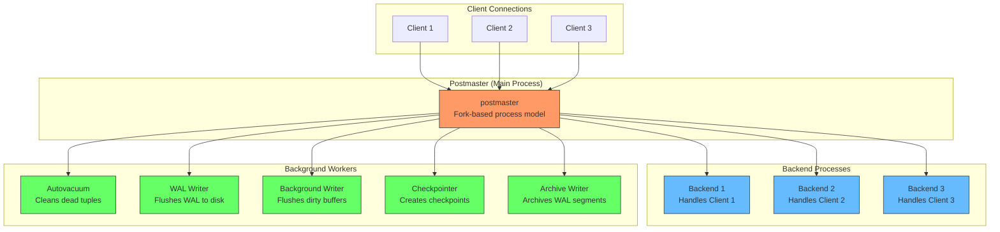

- **Postmaster**: main process, forks a new backend per connection
- **Backends**: one per client, handles queries, runs in parallel
- **Background workers**: autovacuum, WAL writer, background writer, checkpointer

## Memory Architecture

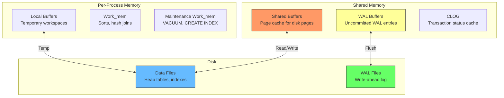

- **Shared Buffers**: main cache, ~25% of RAM by default
- **WAL Buffers**: holds unwritten WAL, flushed on commit
- **Work_mem**: per-operation memory for sorts/hashes (can cause OOM if too high)

## Heap Storage & Row Versions

Data is stored in **heap files**: 8KB pages containing rows.

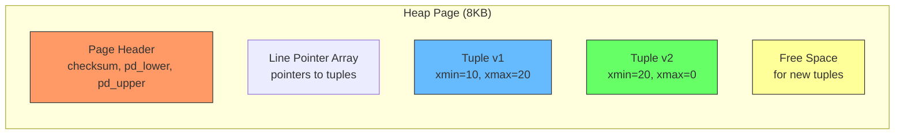

Each row (tuple) has hidden columns:
- **xmin**: transaction ID that created this version
- **xmax**: transaction ID that deleted/updated it (0 if active)

## MVCC Deep Dive

### The Problem: Concurrent Access

Without MVCC, reads block writes and writes block reads. The traditional approach uses a reader-writer lock: readers acquire a [shared lock](./postgresql-locks), writers acquire an [exclusive lock](./postgresql-locks). A writer must wait for every reader to finish, and readers must wait for writers to release their locks. Under heavy concurrency, this creates a bottleneck where transactions queue up waiting for each other, killing throughput.

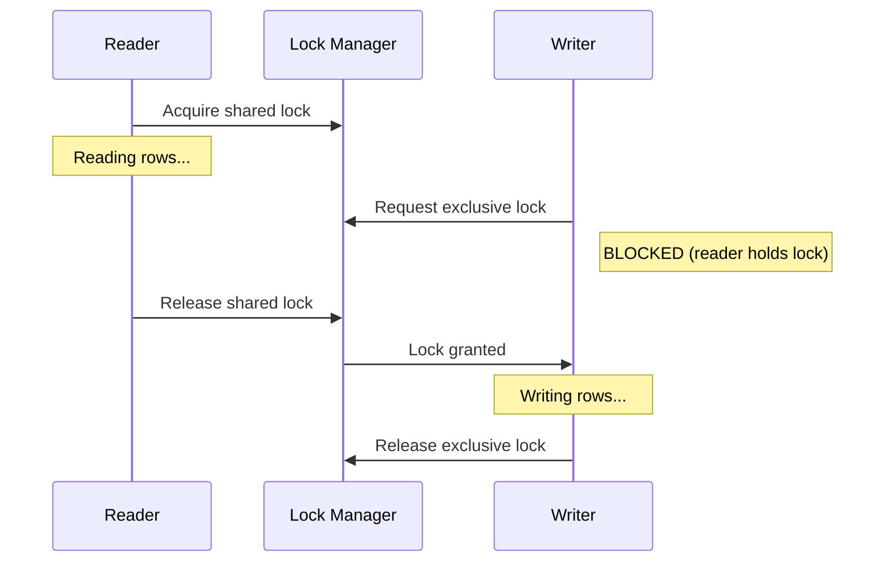

This blocking behavior is tolerable for low-concurrency systems, but modern applications need hundreds or thousands of concurrent connections. If a report query takes 30 seconds to scan a large table, every write operation to that table is blocked for the entire duration. MVCC solves this by eliminating the need for readers and writers to coordinate through locks.

### MVCC Solution: Snapshots

MVCC solves the locking problem by giving each transaction a consistent snapshot of the database at the moment it starts. Instead of locking rows to prevent other transactions from reading them, PostgreSQL keeps multiple versions of each row. When you run `BEGIN`, PostgreSQL records which transactions are currently active. Any row created by a committed transaction before your `BEGIN` is visible to you. Any row created by an active or uncommitted transaction is invisible. This means your transaction sees a frozen-in-time view of the database, even while other transactions are modifying it concurrently.

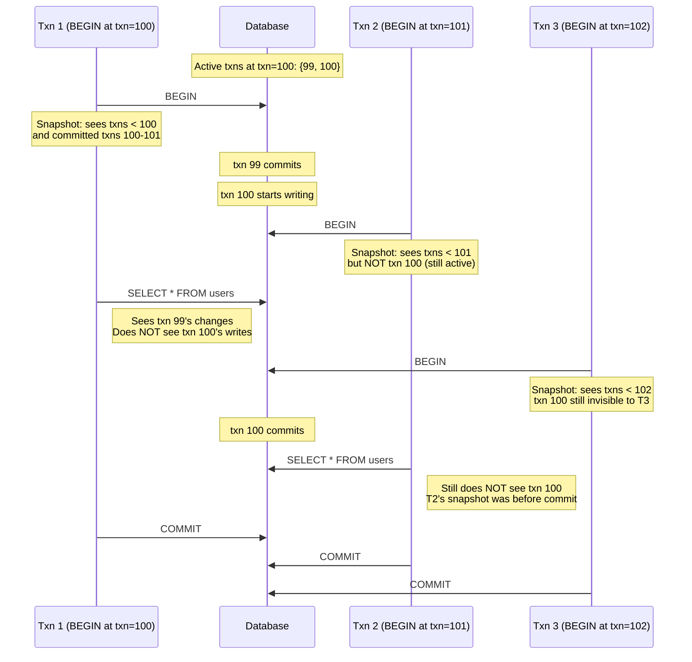

Each snapshot captures three things: the current transaction ID counter (the next ID to be assigned), a list of transaction IDs that were still in progress when the snapshot was taken, and the last committed transaction ID. Any transaction that committed before your snapshot is visible. Any transaction that was still running when your snapshot was taken is invisible, even if it commits later. This is what gives you snapshot isolation: your transaction sees a frozen-in-time view that never changes, regardless of what other transactions do concurrently.

### SnapshotData: What a Snapshot Actually Contains

When PostgreSQL takes a snapshot, it fills a `SnapshotData` struct with three critical fields. Understanding these fields makes the visibility rules much clearer.

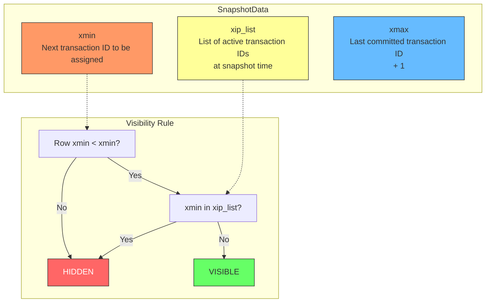

**xmin** is the "next txid" value at the time of the snapshot. Any transaction ID less than xmin has already completed (either committed or aborted). **xip_list** is the list of transaction IDs that were still in progress when the snapshot was taken. These are the "grey zone" transactions: they might commit later, but their changes are invisible to this snapshot. **xmax** is set to xmin at creation time, but it gets updated as new transactions commit. It tells you the upper bound of committed transactions. If a row's `xmin` is less than the snapshot's `xmin` and not in `xip_list`, it was definitely committed before the snapshot and is visible.

### Transaction ID Comparison: The Modulo Problem

Transaction IDs are 32-bit unsigned integers that wrap around at approximately 4.2 billion. This means you cannot simply compare two transaction IDs with `<` or `>` in the usual sense. PostgreSQL uses a special comparison function that accounts for wraparound. The rule is: if the difference between two transaction IDs is less than 2^31 (about 2.1 billion), the newer one is "greater." Otherwise, the one with the smaller numeric value is actually newer because a wraparound occurred.

```mermaid
graph LR
    subgraph "32-bit Transaction IDs"
        A[100] -->|normal increment| B[200] -->|normal increment| C[300]
        D[4294967290] -->|wraps to| E[5] -->|normal increment| F[10]
    end

    subgraph "Comparison Rule"
        G[diff = 200 - 100 = 100] -->|less than 2^31| H[200 is newer]
        I[diff = 5 - 4294967290] -->|modular arithmetic| J[5 is newer (wraparound)]
    end

    style A fill:#6bf,stroke:#333
    style B fill:#6bf,stroke:#333
    style C fill:#6bf,stroke:#333
    style D fill:#f96,stroke:#333
    style E fill:#f96,stroke:#333
    style F fill:#f96,stroke:#333
    style H fill:#6f6,stroke:#333
    style J fill:#6f6,stroke:#333
```

This wraparound is why VACUUM must periodically "freeze" old row versions by replacing their `xmin` with a special frozen transaction ID (2). Without freezing, old rows would become invisible after wraparound because their transaction IDs would appear to be in the future. The freezing threshold is configurable, but PostgreSQL will force a VACUUM when the database approaches the dangerous zone to prevent data loss.

### CLOG: Tracking Transaction Status

PostgreSQL needs to quickly answer the question: "Is transaction X committed, aborted, or still in progress?" This is where the Commit Log (CLOG) comes in. CLOG is a separate data structure stored in shared memory (and backed by files on disk) that tracks the status of every transaction.

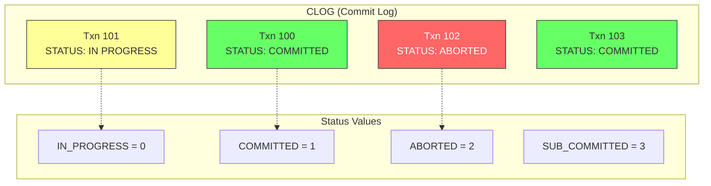

CLOG is organized into 8KB pages, each tracking the status of 2048 transactions. When a transaction commits, PostgreSQL writes `COMMITTED` to CLOG. When it aborts, it writes `ABORTED`. During visibility checks, PostgreSQL looks up the row's `xmin` in CLOG to determine if the creating transaction was committed. CLOG pages are cached in shared memory for fast access, so this lookup is very cheap. Without CLOG, PostgreSQL would have to scan WAL records to determine transaction status, which would be prohibitively slow.

### Visibility Rules

When transaction T reads a row with `xmin=X, xmax=Y`, PostgreSQL must determine whether this row version should be visible to T. The visibility rules are the core of MVCC. Every row has two hidden system columns: `xmin` stores the transaction ID that inserted (or updated to create) this row version, and `xmax` stores the transaction ID that deleted or updated it (0 if the row is still live). When T reads a row, it checks whether the creating transaction (`xmin`) was committed before T started, and whether the deleting transaction (`xmax`) was committed before T started. If `xmin` committed before T and `xmax` has not committed (or is 0), the row is visible. Otherwise it is hidden.

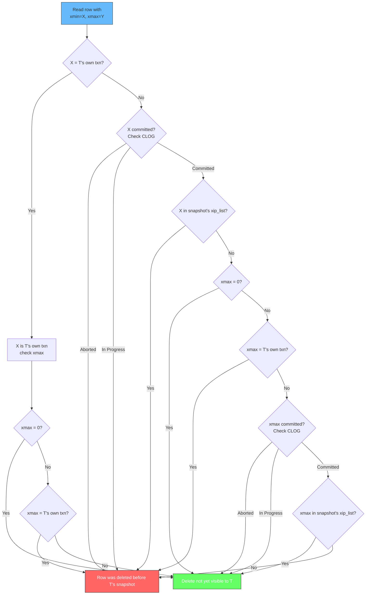

The key insight is that visibility is determined by the relationship between transaction IDs and the reader's snapshot. A row is visible if: (1) its `xmin` is a committed transaction that existed before the snapshot, and (2) either `xmax` is 0 (row was never deleted), or `xmax` is an uncommitted transaction, or `xmax` committed after the snapshot was taken. This ensures that each transaction only sees data that was committed before it started, giving you snapshot isolation without locking.

### Update Chains: How Row Versions Link Together

When you UPDATE a row, PostgreSQL does not modify the existing row in place. Instead, it marks the old version as deleted (setting `xmax`) and creates a new version with a new `xmin`. The old version stays in the heap until VACUUM cleans it up. This creates a chain of row versions linked by their transaction IDs.

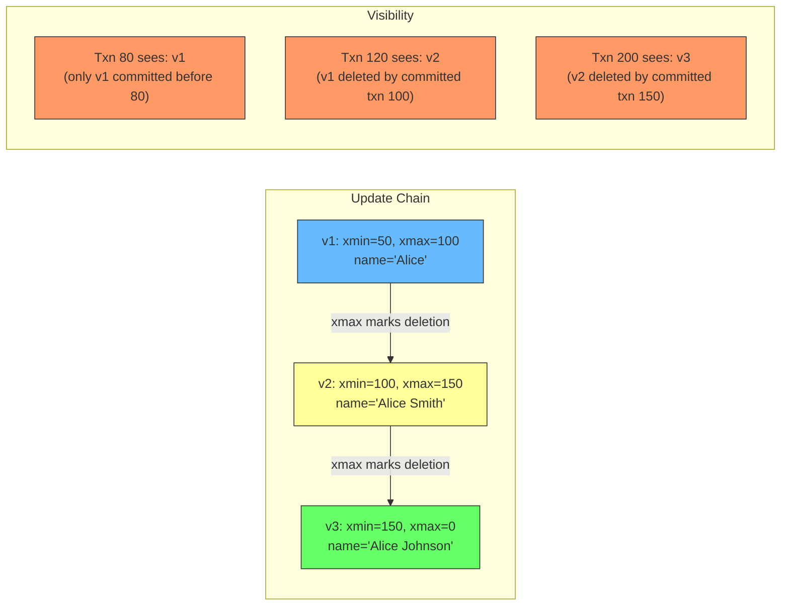

This chain is why PostgreSQL can show different versions of the same row to different transactions simultaneously. Transaction T1 (started before txn 100) still sees v1. Transaction T2 (started after txn 100 committed) sees v2. Transaction T3 (started after txn 150 committed) sees v3. Each transaction walks the chain until it finds a version that matches its snapshot's visibility rules. Indexes point to the latest version, so PostgreSQL may need to follow the chain backward to find older versions visible to a particular snapshot. This is called "hot chains" when updates stay on the same page, and it is why keeping transactions short helps performance: long chains mean more work to find the right version.

### Indexes and Visibility Chains

Indexes in PostgreSQL store pointers to the latest version of each row. When a query uses an index to find a row, it lands on the most recent version first. If that version is not visible to the current snapshot (because it was created after the snapshot), PostgreSQL follows the update chain backward through older versions until it finds one that is visible. This process is called "index scanning with visibility checks."

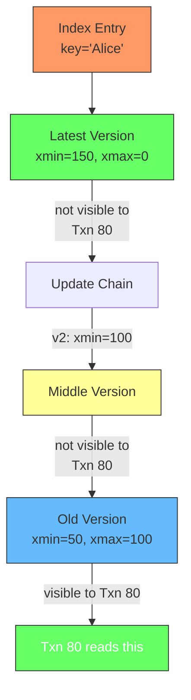

This is why frequently updated tables with many long-running transactions can see degraded index performance: each index scan may need to walk a long chain of dead versions before finding the visible one. The Visibility Map helps here: when a page has only visible tuples (all old versions have been cleaned by VACUUM), PostgreSQL can skip the visibility check entirely for that page.

### Example: Two Transactions

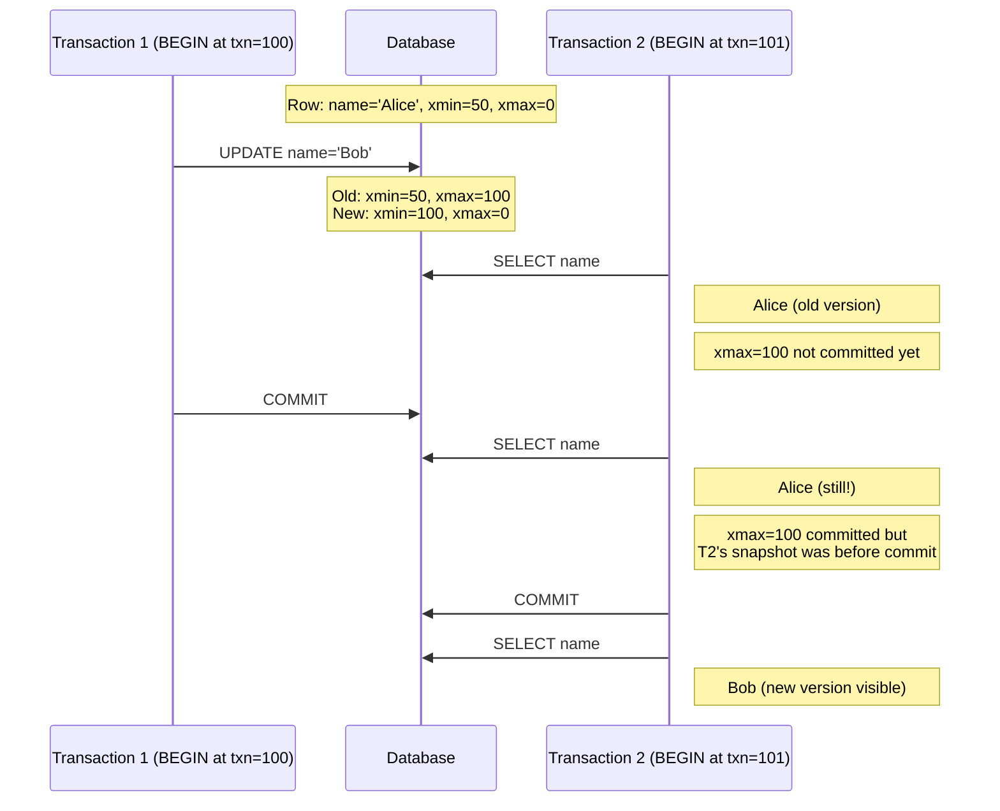

### Isolation Levels: READ COMMITTED vs SERIALIZABLE

PostgreSQL supports two main isolation levels that change how MVCC snapshots work. The difference is when the snapshot is taken. In READ COMMITTED (the default), a new snapshot is taken at the start of each individual SQL statement within a transaction. In SERIALIZABLE, a single snapshot is taken at the start of the transaction and reused for every statement.

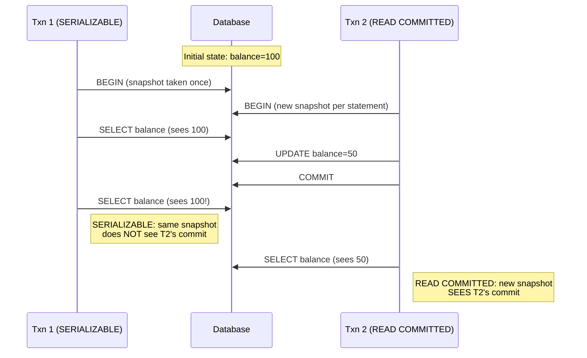

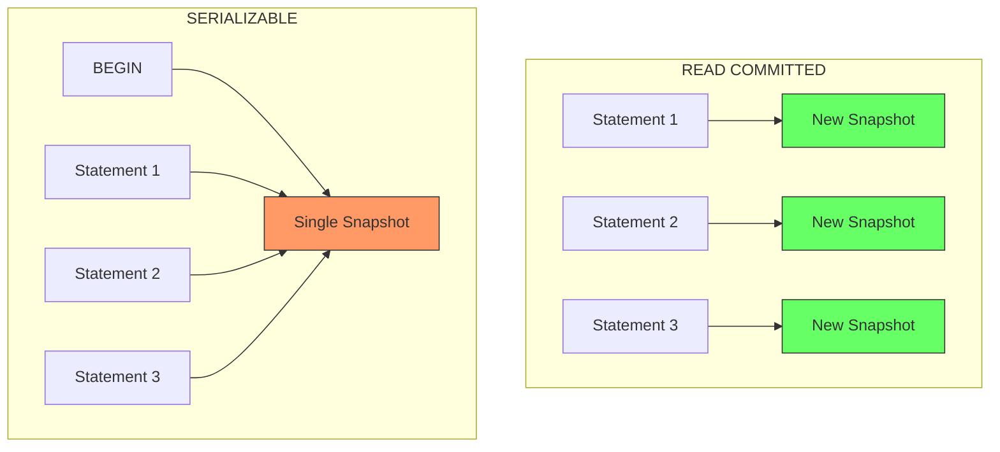

READ COMMITTED is the default because it balances consistency with concurrency. Each statement sees the latest committed data at the time it starts, so you do not read stale data from the beginning of a long transaction. SERIALIZABLE uses predicate locks to detect dangerous patterns (read-write dependencies between transactions) and aborts one of them to prevent anomalies. The tradeoff is that SERIALIZABLE can cause more serialization failures, which your application must handle with retries.

### Predicate Locks: How SERIALIZABLE Prevents Anomalies

SERIALIZABLE adds predicate locks on top of MVCC. These locks do not block reads or writes. Instead, they track which data each transaction has read and which ranges of keys it has written. PostgreSQL uses a "SIREAD" lock (Serializable Isolation Read lock) that records the data a transaction has touched. If two transactions create a dependency cycle (T1 reads what T2 writes, and T2 reads what T1 writes), one of them is aborted.

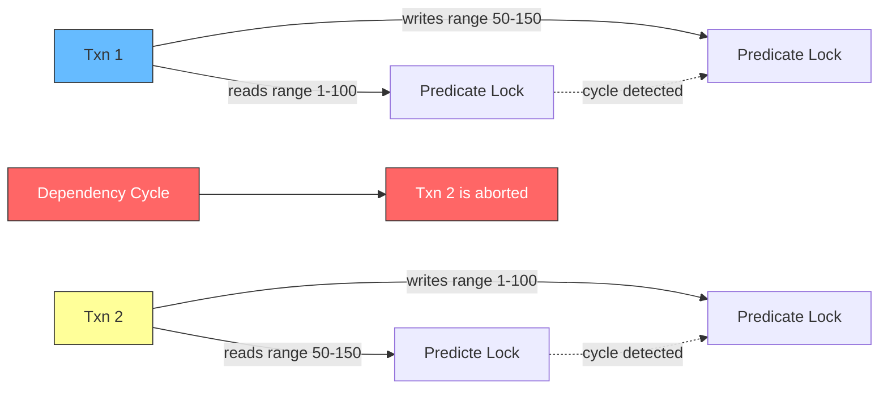

Predicate locks are tracked in shared memory using a lock queue. The overhead is low because the locks do not block anything, they only record information. When a transaction commits, PostgreSQL checks if any dangerous patterns were detected. If so, the transaction is rolled back with a serialization error. Your application should catch this error and retry the transaction. This is the "optimistic concurrency control" approach: assume everything will work, and abort if a conflict is detected.

## Why Reads Don't Block Writes

The traditional locking approach requires readers to acquire shared locks and writers to acquire exclusive locks (see [PostgreSQL Locking](./postgresql-locks) for the full lock mode breakdown). A writer must wait for all readers to finish before it can modify a row, and readers must wait for writers to release their locks. MVCC eliminates this contention entirely. Readers never acquire any locks on data rows. They simply check the `xmin`/`xmax` visibility rules against their snapshot. Writers only lock the specific row they are modifying, and they create a new version of that row rather than overwriting the old one. Other transactions reading the same row see the old version from their snapshot, completely unaffected by the write happening concurrently.

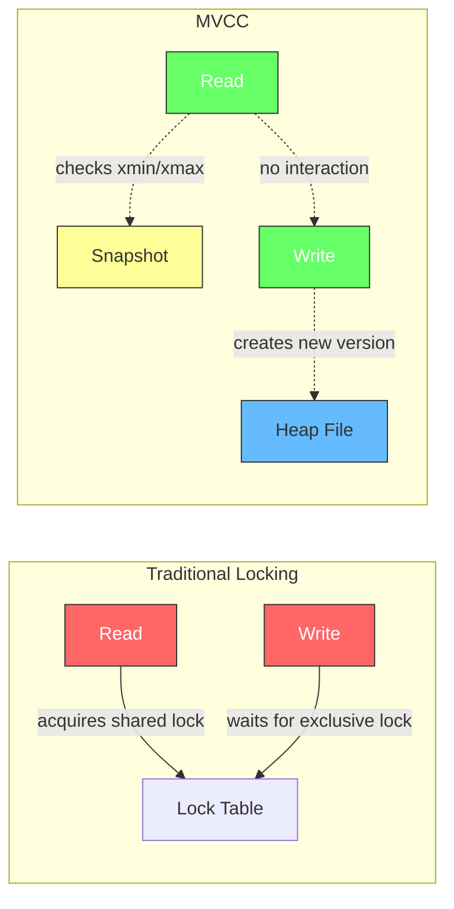

This is why PostgreSQL handles high-concurrency workloads so well. A long-running analytical query reading millions of rows does not block a transaction inserting new rows, and vice versa. The only contention that exists is between two writers trying to modify the same row simultaneously. In that case, the first writer to lock the row wins, and the second one waits. Once the first commits or rolls back, the second can proceed. But reads are completely non-blocking, which is a massive performance advantage for mixed read-write workloads.

## WAL: Write-Ahead Logging

WAL is PostgreSQL's guarantee that committed data survives crashes. The fundamental rule is simple: before any change is written to the actual data files on disk, the change must first be written to a sequential log file called the WAL. This means if the database crashes mid-write, PostgreSQL can replay the WAL to bring the data files to a consistent state. Without WAL, a crash during a write could leave the data files in a half-updated, corrupted state. With WAL, every change is recorded durably before it touches the data files, so recovery is always possible.

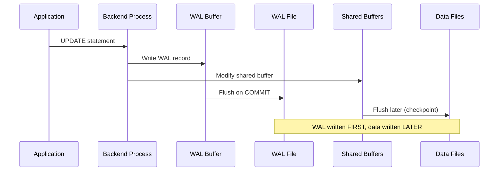

The WAL serves three critical purposes. Crash recovery: if PostgreSQL stops unexpectedly, the restart process replays WAL records from the last checkpoint to restore the database to a consistent state. Replication: WAL records can be streamed to standby servers in real time, keeping them in sync with the primary. Backup and point-in-time recovery: you can take a base backup and then replay WAL records to restore the database to any point in time, down to a specific transaction. WAL records are written sequentially, which is much faster than random writes to data files, so the performance overhead is minimal despite the durability guarantee.

## VACUUM: Reclaiming Space

When a row is updated or deleted in PostgreSQL, the old row version is not immediately removed. It is marked as obsolete by setting its `xmax` to the deleting transaction's ID. These dead tuples accumulate over time, wasting disk space and slowing down scans. VACUUM is PostgreSQL's background process that reclaims this space. It scans through tables, identifies dead tuples that are no longer visible to any active transaction, and marks their space as available for reuse. VACUUM does not move data around or compact pages. It simply updates the page's free space map so that new rows can be inserted into the reclaimed space.

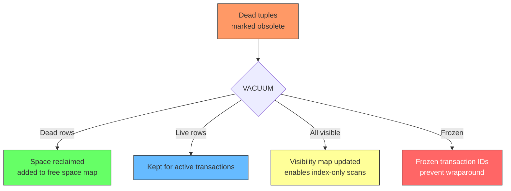

Autovacuum runs automatically in the background based on configurable thresholds. When the number of dead tuples in a table exceeds a threshold, autovacuum kicks in and cleans them up. Lazy VACUUM is the standard mode that marks dead tuples for reuse without compacting pages. Aggressive VACUUM runs when transaction ID wraparound is approaching and must freeze old row versions to prevent data loss. The visibility map tracks which pages have only visible tuples, enabling index-only scans where PostgreSQL can answer a query using only the index without visiting the heap at all.

### Transaction ID Wraparound

Transaction IDs are 32-bit (~4 billion). PostgreSQL must freeze old `xmin` values before they wrap around, or data becomes invisible.

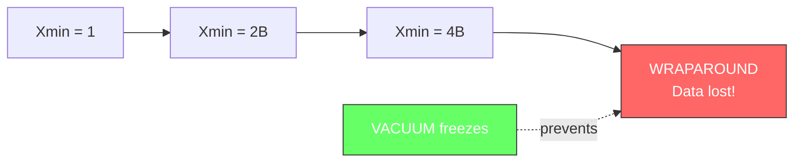

## Query Pipeline

When you submit a SQL query, PostgreSQL processes it through a five-stage pipeline. Each stage transforms the query into a more optimized form until it becomes executable code that pulls rows from tables. Understanding this pipeline helps you write better queries and understand why the optimizer makes certain choices.

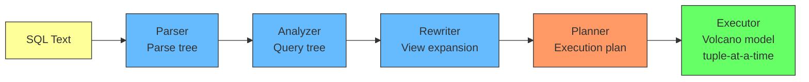

The Parser checks syntax and produces a parse tree, which is a raw structural representation of the SQL statement. The Analyzer performs semantic analysis: it resolves table and column names against the system catalog, checks types, and produces a query tree. The Rewriter applies rules to the query tree, most commonly expanding views into their underlying queries. The Planner is the cost-based optimizer. It generates multiple possible execution plans, estimates the cost of each using table statistics, and picks the cheapest one. The Executor runs the chosen plan using a volcano model where each operator pulls tuples from its child operators one at a time. This pull-based execution is memory efficient because only one row needs to be in memory at a time for each operator.

## Key Takeaways

| Concept | What It Does |
|---------|--------------|
| MVCC | Readers never block writers; each sees a consistent snapshot |
| xmin/xmax | Hidden columns tracking row version visibility |
| WAL | All changes logged before hitting disk; enables crash recovery |
| VACUUM | Cleans dead tuples, prevents bloat and wraparound |
| Shared Buffers | Main page cache; ~25% of RAM |
| Query Pipeline | Parse → Analyze → Rewrite → Plan → Execute |

## Further Reading

- [PostgreSQL Locking: Shared, Exclusive, and Everything Between](./postgresql-locks)
- [PostgreSQL Documentation: MVCC](https://www.postgresql.org/docs/current/mvcc.html)
- [PostgreSQL Documentation: VACUUM](https://www.postgresql.org/docs/current/routine-vacuuming.html)
- [PostgreSQL Internals](https://www.interdb.jp/pg/)
