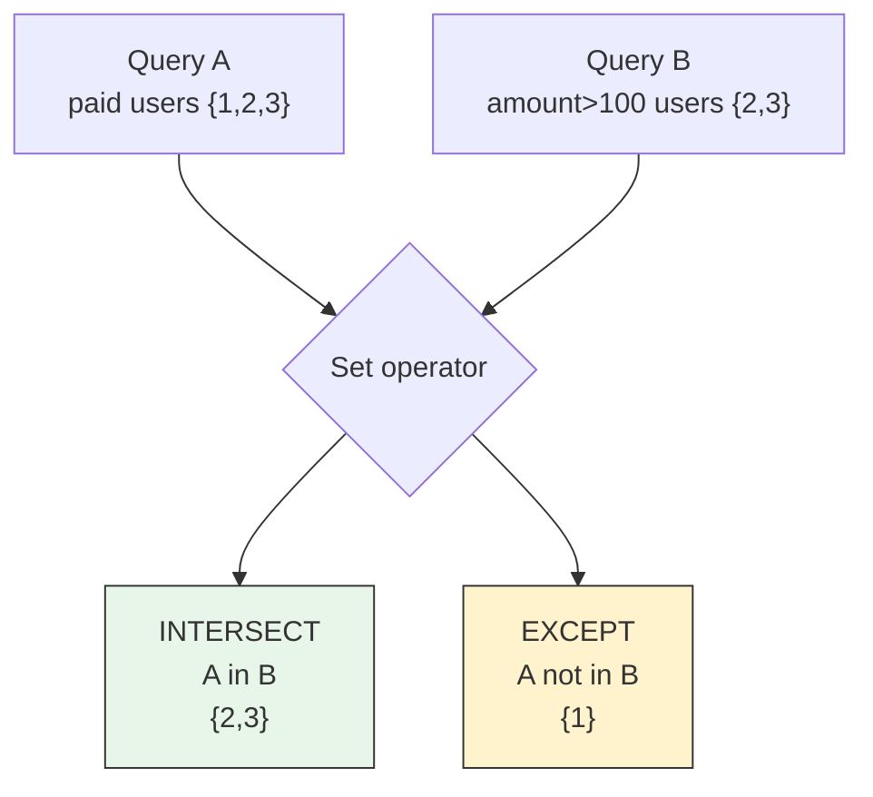
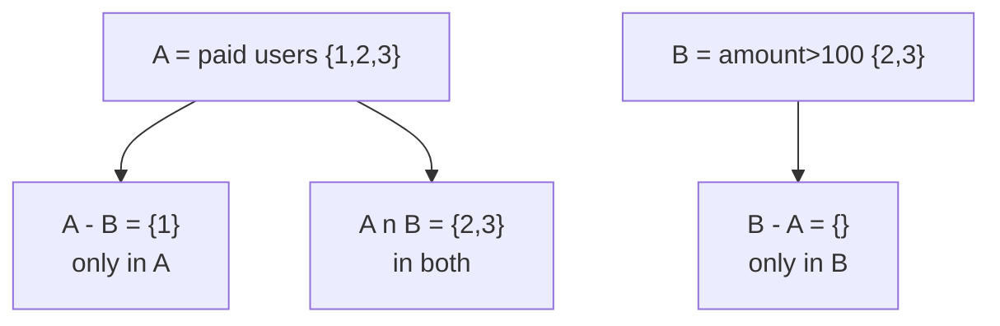
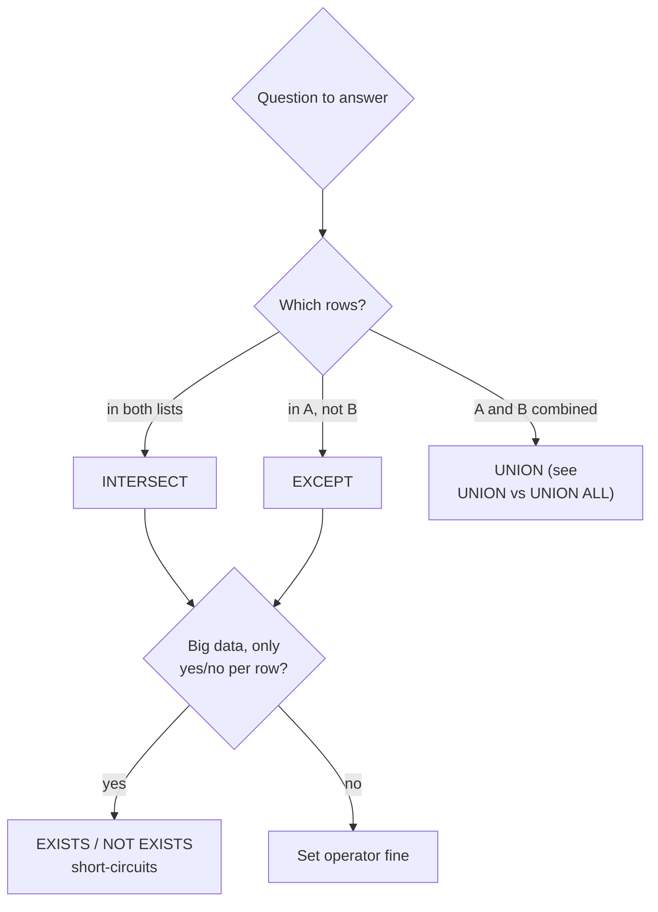

# INTERSECT and EXCEPT

## TLDR

- `INTERSECT` returns rows that appear in **both** queries; `EXCEPT` returns rows in the **first** query but not the second. Both are SQL set operators alongside `UNION` ([PostgreSQL, Combining Queries](https://www.postgresql.org/docs/current/queries-union.html)).
- Both eliminate duplicate rows by default, like `UNION` does. Use `INTERSECT ALL` / `EXCEPT ALL` to keep duplicates and skip that dedup work.
- They are the idiomatic way to answer membership questions in SQL: "which users are in both lists?" or "which users are in A but not B?" — without `IN (subquery)`, `EXISTS`, or application-side set math.
- Same rules as `UNION`: both queries need the same number of columns with compatible types, column names come from the first query.
- **Decision when both work:** prefer `EXISTS`/`NOT EXISTS` on large data when you only need a yes/no per row — the set operators materialize full result sets, while `EXISTS` can stop at the first match.

## The Problem

SQL answers "give me the rows that match" easily, but two questions come up constantly in analytics and data validation:

- "Which records are in both of these lists?" — e.g. users who bought AND subscribed, products available in both stores, IDs that appear in the staging table and the production table.
- "Which records are in one list but not the other?" — e.g. staging records that did not sync to production, users who paid but never activated, orders flagged for review but not yet handled.

Without a set operator, every one of these is either app code (fetch both lists and compare with loops or `Set` operations) or a join/subquery with `DISTINCT` gymnastics. `INTERSECT` and `EXCEPT` express the intent directly in SQL.

```sql
-- Seed for every example - same as supabase/sql/seed.sql
create table users (id int primary key, name text, country text);
create table orders (id int primary key, user_id int, amount numeric, status text);
insert into users values (1,'Alice','USA'), (2,'Bob','USA'), (3,'Sai','India');
insert into orders values
  (1,1,100,'paid'), (2,1,50,'paid'), (3,1,20,'pending'),
  (4,2,200,'paid'), (5,2,30,'cancelled'),
  (6,3,300,'paid'), (7,3,10,'paid');
```

<div style={{display: 'flex', justifyContent: 'center'}}>



</div>

## INTERSECT: Rows in Both

`INTERSECT` returns the rows that exist in both queries. Duplicates are eliminated unless `INTERSECT ALL` is used.

```sql
-- Users who have a paid order AND an order over 100
SELECT user_id FROM orders WHERE status='paid'   -- {1, 2, 3}
INTERSECT
SELECT user_id FROM orders WHERE amount > 100;   -- {2, 3}
-- user_id: 2, 3
```

## EXCEPT: Rows in the First but Not the Second

`EXCEPT` returns the rows from the first query (the left side) that do `NOT` appear in the second. Ordering of the legs matters — flip them and you get a different answer.

```sql
-- Users with a paid order but no order over 100
SELECT user_id FROM orders WHERE status='paid'   -- {1, 2, 3}
EXCEPT
SELECT user_id FROM orders WHERE amount > 100;   -- {2, 3}
-- user_id: 1

-- Flip the legs: users with a big order but no paid order -> empty
SELECT user_id FROM orders WHERE amount > 100    -- {2, 3}
EXCEPT
SELECT user_id FROM orders WHERE status='paid';  -- {1, 2, 3}
-- user_id: (none)
```

<div style={{display: 'flex', justifyContent: 'center'}}>



</div>

## `ALL` Variants: Keep Duplicates, Skip Dedup

Like `UNION`, the `ALL` variants keep duplicates and skip the dedup pass. The semantics are precise ([PostgreSQL, SELECT - INTERSECT/EXCEPT](https://www.postgresql.org/docs/current/sql-select.html)):

- `INTERSECT ALL`: a row appearing `m` times on the left and `n` times on the right appears `min(m, n)` times.
- `EXCEPT ALL`: a row appearing `m` times on the left and `n` times on the right appears `max(m - n, 0)` times.

```sql
-- Rows: order 4 (2, 200) and order 6 (3, 300) appear in both legs
SELECT user_id, amount FROM orders WHERE status='paid'
INTERSECT ALL
SELECT user_id, amount FROM orders WHERE amount > 100;
-- (2,200), (3,300) -- one copy each (min(1,1))
```

In practice `INTERSECT ALL`/`EXCEPT ALL` are rare — you usually want the distinct set. Just know they exist and are cheaper than the deduping forms.

## Rules and Gotchas

1. **Union compatibility.** Same number of columns, compatible types at each position. Column names come from the first query — same as `UNION` ([PostgreSQL, Combining Queries](https://www.postgresql.org/docs/current/queries-union.html)).
2. **No inherent ordering.** Add `ORDER BY` before paginating, as with `UNION`.
3. **Precedence when mixing.** `INTERSECT` binds tighter than `UNION` and `EXCEPT`, and `UNION`/`EXCEPT` evaluate left to right. `A UNION B INTERSECT C` means `A UNION (B INTERSECT C)`. Use parentheses when you mix more than one operator ([PostgreSQL, Combining Queries](https://www.postgresql.org/docs/current/queries-union.html)).
4. **`EXCEPT` is not commutative.** The left leg decides what survives. Always double-check which side has your "source of truth" rows.

## When to Use Which

Use set operators when the question is literally set membership and the queries are independent slices. Prefer them when you want the database to do the dedup and you need the full combined result as a table, feed, or export.

On large data, consider `EXISTS` / `NOT EXISTS` instead when you only need to *test* each row: `EXISTS` short-circuits at the first match, while `INTERSECT`/`EXCEPT` materialize and compare full result sets. Same answer, less work (see [Subquery vs JOIN performance](./sql-introduction.md)).

```sql
-- Same result as EXCEPT, but can stop early per user
SELECT u.id FROM users u
WHERE NOT EXISTS (
  SELECT 1 FROM orders o
  WHERE o.user_id = u.id AND o.amount > 100
) AND EXISTS (
  SELECT 1 FROM orders o WHERE o.user_id = u.id AND o.status = 'paid'
);
```

<div style={{display: 'flex', justifyContent: 'center'}}>



</div>

## 3 Common Use Cases

### Data reconciliation

Verify a sync or migration by comparing IDs across tables:

```sql
-- Staging rows that did not make it to production
SELECT sku FROM staging_products
EXCEPT
SELECT sku FROM products;
```

### Finding gaps in behavior

Users who did one thing but not the other:

```sql
SELECT user_id FROM orders WHERE status = 'paid'
INTERSECT
SELECT user_id FROM subscriptions WHERE status = 'active';
```

### Tagged / labeled record sets

Intersect two interest lists to find common members, e.g. `user_ids` in both marketing segments:

```sql
SELECT user_id FROM email_campaign_a
INTERSECT
SELECT user_id FROM email_campaign_b;
```

## Interview Answers

### What is the difference between INTERSECT and EXCEPT?

`INTERSECT` returns rows in both result sets; `EXCEPT` returns rows in the first result set but not the second. Both eliminate duplicates by default and require union-compatible inputs — same column count and compatible types.

### When would you use EXCEPT instead of NOT EXISTS / NOT IN?

When you want to compare full row sets and get the resulting rows — e.g. validating a data sync ("staging rows missing from production"). `EXCEPT` also sidesteps the `NOT IN` NULL trap: with `NOT IN (SELECT ...)`, a single `NULL` in the subquery makes the whole predicate unknown, whereas `EXCEPT` treats `NULL`s as regular values during comparison.

### What do INTERSECT ALL and EXCEPT ALL do?

They keep duplicates: `INTERSECT ALL` emits `min(m, n)` copies of a row, `EXCEPT ALL` emits `max(m - n, 0)` copies ([PostgreSQL, SELECT - INTERSECT/EXCEPT](https://www.postgresql.org/docs/current/sql-select.html)).

## Sources

- Definitions of `UNION`/`INTERSECT`/`EXCEPT`, `ALL` vs dedup behavior, union compatibility, and precedence of the three operators ([PostgreSQL, Combining Queries](https://www.postgresql.org/docs/current/queries-union.html)).
- Precise duplicate semantics for `INTERSECT ALL` (`min(m, n)`) and `EXCEPT ALL` (`max(m - n, 0)`), and `DISTINCT`/`ALL` defaults ([PostgreSQL, SELECT](https://www.postgresql.org/docs/current/sql-select.html)).