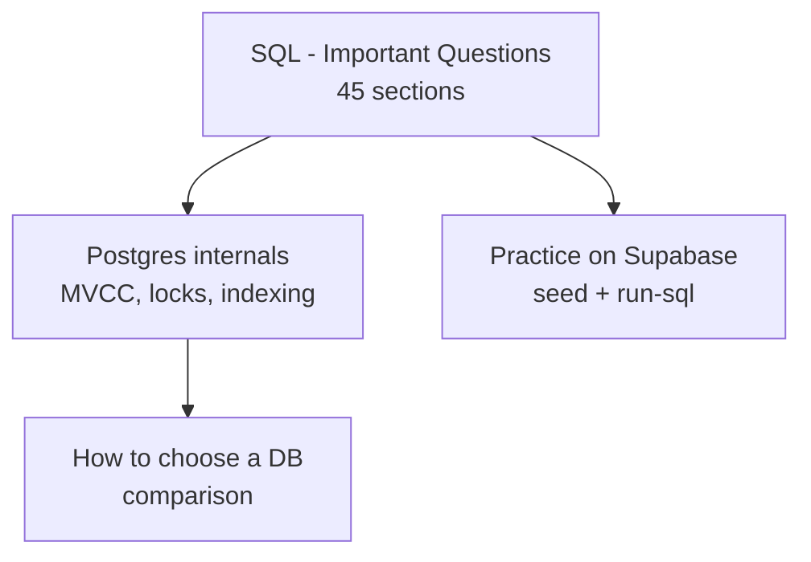

# Databases - Overview

SQL, Postgres internals, and how to choose a database. Start here.

*   [SQL - Important Questions](./sql-introduction.md) - 45 sections, runnable in Supabase. The interview and on-the-job guide.
*   [Database Comparison](./database-comparison.md) - Postgres, MongoDB, Cassandra, DynamoDB, CockroachDB, Redis when to use which.
*   [Postgres MVCC](./postgresql-mvcc.md) - how Postgres handles concurrent transactions without blocking reads.
*   [Postgres Locks](./postgresql-locks.md) - row vs table locks, `FOR UPDATE`, deadlocks.
*   [DDL vs DML](./ddl-vs-dml.md) - what counts as structure vs data.

