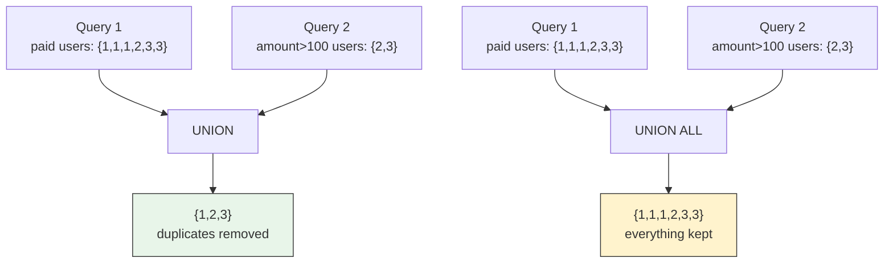
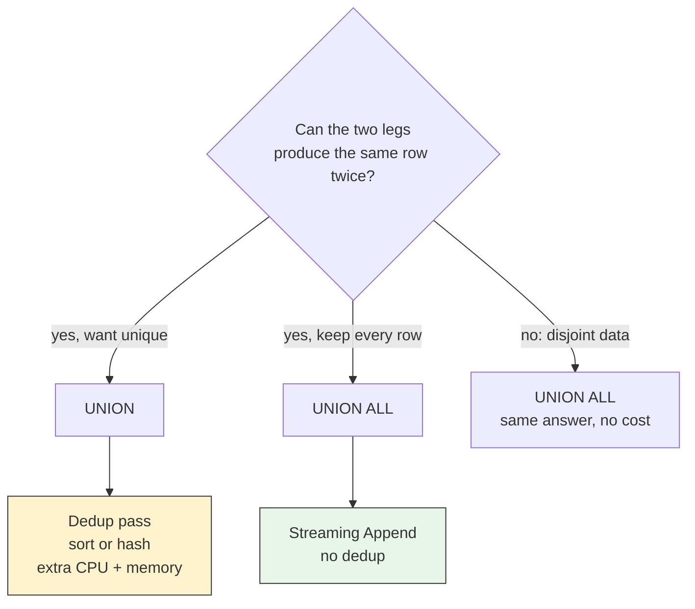
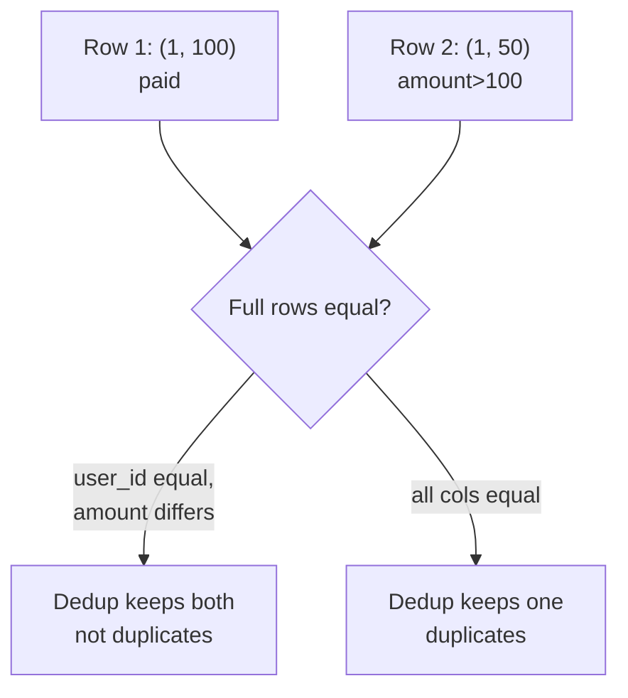
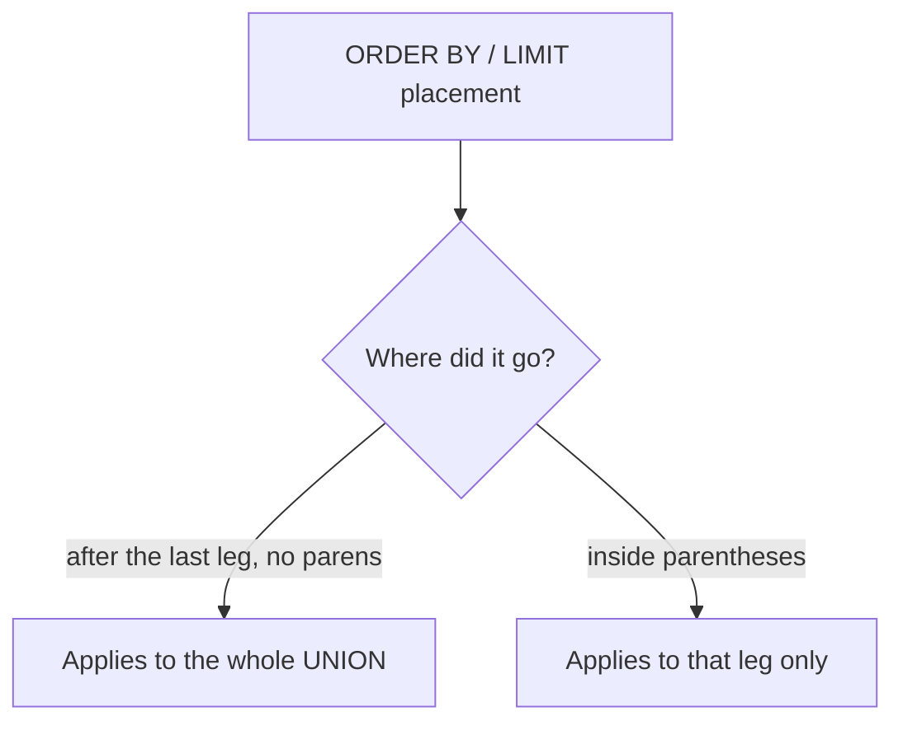
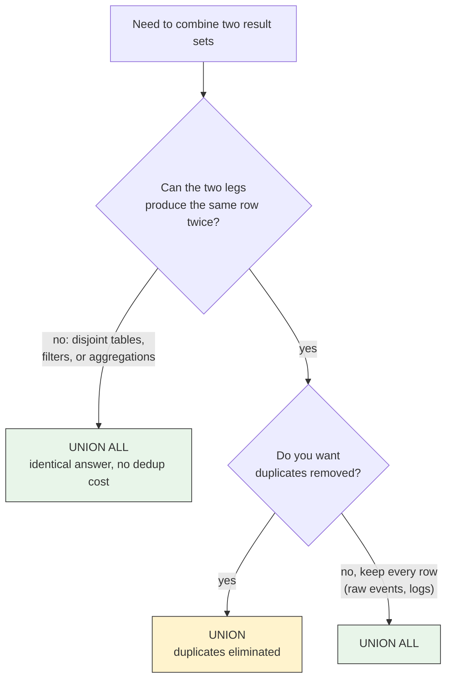

# UNION vs UNION ALL

## TLDR

- `UNION ALL` appends the rows of two queries as-is. `UNION` appends them and then removes duplicate rows, exactly like `SELECT DISTINCT` does ([PostgreSQL, Combining Queries](https://www.postgresql.org/docs/current/queries-union.html)).
- Deduplication is not free: `UNION` has to sort or hash every row to detect duplicates, while `UNION ALL` just streams one result after the other. On big data that is often the difference between milliseconds and seconds.
- Both require the two queries to return the same number of columns with compatible types, and the resulting column names come from the first query.
- `ORDER BY`/`LIMIT` after a `UNION` applies to the whole combined result, not to the last query. To sort or limit an individual leg, wrap it in parentheses.
- Default rule of thumb: use `UNION ALL` unless you actually need duplicates removed, because most real `UNION`s operate on disjoint data where there is nothing to dedupe. Recursive CTEs use `UNION ALL` almost always.

## The Problem

SQL gives you one result set per query. But a huge fraction of real reporting needs are "give me the combined view of several slices of data in a single page, chart, or export":

- A dashboard that shows both current week revenue and the same week last year in one chart.
- An admin page that lists `cancelled` orders and `refunded` orders as one feed.
- Loading historical `orders` from an archive table plus `orders` from the live table so a customer sees their full purchase history.

```sql
-- Seed for every example - same as supabase/sql/seed.sql
create table users (id int primary key, name text, country text);
create table orders (id int primary key, user_id int, amount numeric, status text);
insert into users values (1,'Alice','USA'), (2,'Bob','USA'), (3,'Sai','India');
insert into orders values
  (1,1,100,'paid'), (2,1,50,'paid'), (3,1,20,'pending'),
  (4,2,200,'paid'), (5,2,30,'cancelled'),
  (6,3,300,'paid'), (7,3,10,'paid');
```

Without a set operation you have two options, both bad: run two queries and stitch the arrays in application code (two round trips, two places to paginate, two places to get wrong), or write one giant `WHERE status IN ('cancelled','refunded')` that only works when both slices come from the same table.

The problem `UNION` solves: combine the result of two (completely different) queries into one result set in the database, so the app gets a single paginated, sortable answer.

## The Solution: Two Keywords, One Purpose

`UNION` and `UNION ALL` both append the result of the second query to the result of the first. The only difference is duplicate removal:

- `UNION` removes duplicate rows from the combined result (this is the default behavior, which is why `UNION DISTINCT` is redundant).
- `UNION ALL` keeps every row, duplicates included ([PostgreSQL, Combining Queries](https://www.postgresql.org/docs/current/queries-union.html)).

```sql
-- UNION: dedupes. user 1 shows up in both queries, so it appears once.
SELECT user_id FROM orders WHERE status='paid'
UNION
SELECT user_id FROM orders WHERE amount > 100;
-- user_id: 1, 2, 3
-- (ORDER BY NOT guaranteed - add ORDER BY user_id for stable output)

-- UNION ALL: keeps duplicates. user 1 appears once per matching query.
SELECT user_id FROM orders WHERE status='paid'
UNION ALL
SELECT user_id FROM orders WHERE amount > 100;
-- user_id: 1, 1, 1, 2, 3, 3
```

Let us verify against the seed. Paid orders belong to user 1 (orders 1, 2), user 2 (order 4), user 3 (orders 6, 7) => `{1, 2, 3}`. Orders with `amount > 100` are order 4 (200, user 2) and order 6 (300, user 3) => `{2, 3}`. So `UNION` gives `{1, 2, 3}` and `UNION ALL` gives `{1, 1, 1, 2, 3, 3}`.

<div style={{display: 'flex', justifyContent: 'center'}}>



</div>

## Why `UNION` Costs More

The one sentence that decides everything in production: **duplicate removal requires the database to compare every row against every other row.** `UNION ALL` is a straight pipe, a simple `Append` node in the plan. `UNION` adds a dedup pass (PostgreSQL uses a hash or a sort over the combined result), which costs CPU, memory, and time proportional to the combined row count.

That is the whole practical difference: **if the two legs cannot produce duplicate rows, `UNION` and `UNION ALL` return identical results, so `UNION` is pure waste.**

```sql
EXPLAIN SELECT user_id FROM orders WHERE status='paid'
UNION ALL
SELECT user_id FROM orders WHERE amount > 100;
--  Append
--    -> Seq Scan on orders
--    -> Seq Scan on orders
```

The PostgreSQL documentation states `UNION ALL` "is usually significantly quicker than `UNION`; use `ALL` when you can" ([PostgreSQL, SELECT - UNION Clause](https://www.postgresql.org/docs/current/sql-select.html)).

<div style={{display: 'flex', justifyContent: 'center'}}>



</div>

### What columns does the dedup actually compare?

The dedup key is the **entire output row** — every column in the `SELECT` list, treated as one composite value. Two rows are "duplicates" only when every selected column matches. Change any single column and the row is kept.

```sql
-- user_id matches on the 100-row, but amounts differ -> both rows kept
SELECT user_id, amount FROM orders WHERE status='paid'
UNION
SELECT user_id, amount FROM orders WHERE amount > 100;
-- keep: (1,100) (1,50) (2,200) (3,300) (3,10)
-- even though user 1 and user 3 appear twice, no full row repeats,
-- so NOTHING is collapsed

-- same idea, user_id only -> duplicates now exist -> collapsed
SELECT user_id FROM orders WHERE status='paid'
UNION
SELECT user_id FROM orders WHERE amount > 100;
-- (1) (2) (3) -- one row per user
```

<div style={{display: 'flex', justifyContent: 'center'}}>



</div>

This is the most common misunderstanding about `UNION`: people expect it to collapse anything where a shared key (like a foreign key) matches. It does not. Same `user_id`, different `name`? Both come out. The columns you `SELECT` define the dedup key, so adding a column to a `UNION` query silently changes how much it collapses.

So: the dedup key is your `SELECT` list, nothing more. If you need "distinct on just the user", select just the user. If you need "distinct on the whole record", select all the columns.

## The Only Two Rules

1. **Same number of columns, compatible types at each position.** `numeric` + `int` promotes to `numeric`; `int` vs `text` fails unless you cast explicitly ([PostgreSQL, Combining Queries](https://www.postgresql.org/docs/current/queries-union.html), [PostgreSQL, UNION/CASE Type Conversion](https://www.postgresql.org/docs/current/typeconv-union.html)).
2. **Column names come from the first query.** The second query's column names are ignored; the first leg decides what the client sees.

```sql
-- OK: same count, compatible types (numeric vs int -> numeric)
SELECT amount FROM orders WHERE status='paid'
UNION ALL
SELECT amount FROM orders WHERE amount > 100;

-- ERROR: cannot combine integer amount with text name
SELECT amount FROM orders WHERE status='paid'
UNION ALL
SELECT name FROM users;

-- Result column is called "who", from the first query
SELECT user_id AS who FROM orders WHERE status='paid'
UNION ALL
SELECT user_id AS anything FROM orders WHERE amount > 100;
-- Client sees: who
```

## `ORDER BY` and `LIMIT`: The One Gotcha

`ORDER BY`/`LIMIT` written *after* the union apply to the **whole combined result**. To sort or limit one individual leg before it is combined, wrap that leg in parentheses. Also, a `UNION` result has no inherent order — always add `ORDER BY` before paginating ([PostgreSQL, Combining Queries](https://www.postgresql.org/docs/current/queries-union.html)).

```sql
-- Right: sort the combined feed
SELECT user_id, amount FROM orders WHERE status='paid'
UNION ALL
SELECT user_id, amount FROM orders WHERE amount > 100
ORDER BY amount DESC LIMIT 3;

-- To cap only the second leg, wrap it in parentheses
SELECT user_id, amount FROM orders WHERE status='paid'
UNION ALL
(SELECT user_id, amount FROM orders WHERE amount > 100
 ORDER BY amount DESC LIMIT 2);
```

<div style={{display: 'flex', justifyContent: 'center'}}>



</div>

## Related Operators: `INTERSECT` and `EXCEPT`

`UNION` is one of three SQL set operators. The other two share its syntax and `ALL`/`DISTINCT` rules but answer different questions: `INTERSECT` returns rows in both queries, `EXCEPT` returns rows in the first but not the second. For the difference, when to use which, and `INTERSECT ALL`/`EXCEPT ALL` duplicate semantics, see [INTERSECT and EXCEPT](./intersect-except.md).

## Decision Framework

**Use `UNION ALL` when:**

- The two legs are disjoint: different tables, non-overlapping date ranges, mutually exclusive `WHERE` filters, or aggregated rows that cannot collide.
- You are stacking raw events, logs, or audit rows where duplicates are real information.
- You are building recursive CTEs (the natural iterative shape, see [SQL - Important Questions, Recursive CTEs](./sql-introduction.md)).

**Use `UNION` when:**

- You genuinely want a distinct set of values across two sources — e.g. "list every tag used in posts OR comments" — and duplicates between the sources should collapse.
- The combined result is small enough that the sort/hash is irrelevant.

<div style={{display: 'flex', justifyContent: 'center'}}>



</div>

## Pitfalls Checklist

1. **Dedup cost spikes on overlap.** If data will grow and legs overlap, `UNION` on a hot endpoint is a landmine; make legs disjoint and use `UNION ALL`.
2. **The dedup key is your `SELECT` list.** Adding a column changes how much `UNION` collapses — a silent behavioral change.
3. **`ORDER BY`/`LIMIT` after the last leg applies to the whole union**, not the last leg. Parenthesize a leg to give it its own limit.
4. **Column types must line up per position.** Cast mismatched legs before combining.
5. **No guaranteed order.** Always add `ORDER BY` before paginating.

## Interview Answers

### What is the difference between UNION and UNION ALL?

`UNION ALL` just appends the two result sets and keeps every row. `UNION` appends and then removes duplicate rows, like `SELECT DISTINCT`. The dedup in `UNION` costs a sort or hash over the combined result, so `UNION ALL` is usually significantly faster ([PostgreSQL, SELECT - UNION Clause](https://www.postgresql.org/docs/current/sql-select.html)).

### Which one should you use by default?

`UNION ALL`, unless you specifically need duplicates removed. If the two legs are disjoint, `UNION` and `UNION ALL` produce identical output, so `UNION` pays for a dedup pass that changes nothing.

### What columns does UNION deduplicate on?

All of them. Two rows are duplicates only if every column in the output matches. Select just the shared key to dedupe on it; select more columns and collisions become rarer.

### What is the difference between INTERSECT and EXCEPT?

`INTERSECT` returns rows present in both queries; `EXCEPT` returns rows in the first query but not the second. Both eliminate duplicates unlike their `ALL` variants ([see INTERSECT and EXCEPT](./intersect-except.md)).

## Sources

- `UNION` appends results and eliminates duplicates (like `DISTINCT`) unless `UNION ALL` is used, with the `LIMIT`-after-last-leg gotcha ([PostgreSQL, Combining Queries](https://www.postgresql.org/docs/current/queries-union.html)).
- "UNION ALL is usually significantly quicker than UNION; use ALL when you can", union compatibility (same column count, compatible types), `ORDER BY` on union results, and `DISTINCT`/`ALL` defaults for set operations ([PostgreSQL, SELECT](https://www.postgresql.org/docs/current/sql-select.html)).
- Type resolution when `UNION`, `CASE`, and related constructs combine columns ([PostgreSQL, UNION/CASE Type Conversion](https://www.postgresql.org/docs/current/typeconv-union.html)).
- Recursive CTE evaluation and why `UNION ALL` is the usual choice there ([PostgreSQL, WITH Queries](https://www.postgresql.org/docs/current/queries-with.html)).
- `GROUPING SETS`/`ROLLUP`/`CUBE` implemented as `UNION ALL` between per-grouping-set subqueries ([PostgreSQL, SELECT - GROUP BY](https://www.postgresql.org/docs/current/sql-select.html)).