# Views: Stored Queries That Act Like Tables

A View is a named, stored `SELECT` that you query like a table. The database does not store rows for a regular View — it stores the query text and re-runs it every time you `SELECT` from the View ([PostgreSQL, CREATE VIEW](https://www.postgresql.org/docs/current/sql-createview.html)). That one idea solves copy-paste queries, leaky table internals, and ad-hoc access control without duplicating data.

```sql
-- Seed for every example — same as supabase/sql/seed.sql
create table users (id int primary key, name text, country text);
create table orders (id int primary key, user_id int, amount numeric, status text);
insert into users values (1,'Alice','USA'), (2,'Bob','USA'), (3,'Sai','India');
insert into orders values
  (1,1,100,'paid'), (2,1,50,'paid'), (3,1,20,'pending'),
  (4,2,200,'paid'), (5,2,30,'cancelled'),
  (6,3,300,'paid'), (7,3,10,'paid');
```

## 1. The Problem

You have a 4-join, 2-filter query that computes `paid_orders` with a customer name. Five reports, two services, and an analyst all need it. Without a View you have three bad options: copy-paste the SQL into five places (drift), hide it in application code (only one app benefits, analysts still write raw SQL), or create a physical table you keep in sync (extra ETL and stale data).

You also need to hide columns (no one outside finance should see `cost`), keep old table names working after a schema refactor, and give a read-only user access to a subset of rows — all without changing every query.

### What breaks without Views

<div style={{display: 'flex', justifyContent: 'center'}}>

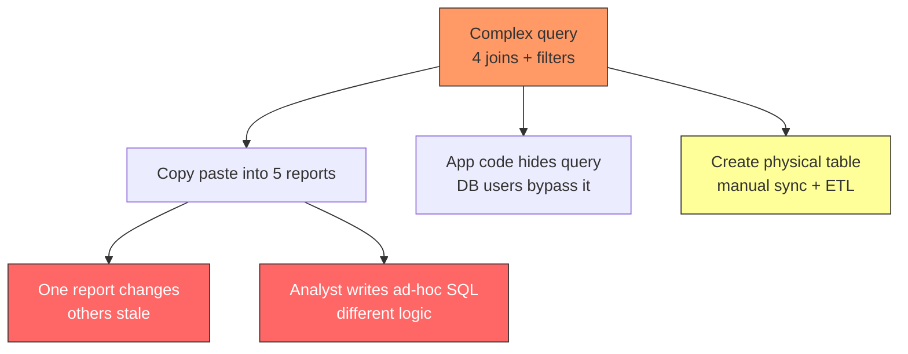

</div>

## 2. The Solution: CREATE VIEW

`CREATE VIEW` names a query ([PostgreSQL, CREATE VIEW](https://www.postgresql.org/docs/current/sql-createview.html)). You use the name like a table in `SELECT`, `JOIN`, `WHERE`, or even inside another View.

```sql
CREATE VIEW paid_orders AS
SELECT o.id, o.amount, o.status, u.name AS user_name, u.country, o.created_at
FROM orders o JOIN users u ON u.id = o.user_id
WHERE o.status = 'paid';

-- Query it like a table
SELECT user_name, SUM(amount) AS total
FROM paid_orders
GROUP BY user_name;

-- Join a view like a table
SELECT p.user_name, p.amount
FROM paid_orders p
JOIN users u ON u.name = p.user_name
WHERE u.country = 'USA';
```

The View has no rows on disk. It is a stored query text in `pg_class` / `pg_rewrite`. Every `SELECT` from the View re-runs the underlying query with whatever `WHERE`/`JOIN` you added ([PostgreSQL, Rules and Views](https://www.postgresql.org/docs/current/rules-views.html)).

### How a View sits between callers and tables

<div style={{display: 'flex', justifyContent: 'center'}}>

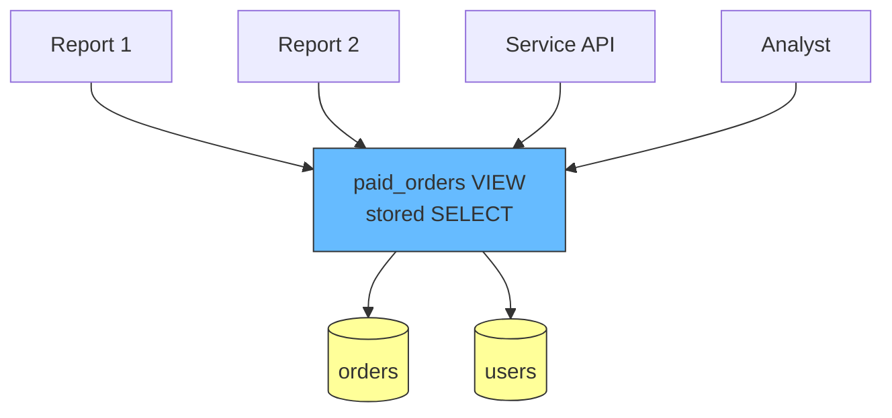

</div>

This solves the copy-paste problem: fix the logic once in the View, every caller gets the fix.

## 3. Under the Hood: View Expansion in the Rewriter

Postgres executes SQL through `Parse -> Analyze -> Rewrite -> Plan -> Execute`. The `Rewriter` stage expands Views into their defining queries before planning ([see Query Pipeline in Postgres MVCC](./postgresql-mvcc.md#query-pipeline)).

<div style={{display: 'flex', justifyContent: 'center'}}>

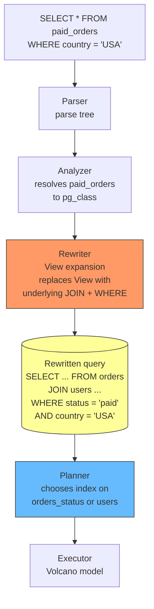

</div>

Because expansion happens before planning, the planner can push your outer `WHERE country = 'USA'` into the View and use indexes on the base tables. A View is not a black box — it is rewritten, then optimized as one query ([PostgreSQL, The Rule System](https://www.postgresql.org/docs/current/rules-views.html)). That is why a View can be as fast as the raw query, and why it benefits from the same `EXPLAIN` and indexing you already have.

Test it:

```sql
EXPLAIN SELECT * FROM paid_orders WHERE country = 'USA';
-- Look for: Seq Scan or Index Scan on users/orders, plus
-- Filter: status = 'paid' — proof the View predicate merged
```

If you see `Subquery Scan on paid_orders`, your Postgres version still shows the View name as an alias, but the cost and scans underneath are on base tables.

## 4. Why We Need Views — 6 Concrete Reasons

### 4.1 DRY: One definition, many consumers

**Problem:** Five reports copy the same 30-line query. One report fixes a bug, four stay wrong.

**Solution:** A View is the single source of truth. Change `CREATE OR REPLACE VIEW` once, all five reports get the fix next run without a deploy.

```sql
CREATE OR REPLACE VIEW paid_orders AS
SELECT o.id, o.amount, u.name AS user_name, u.country
FROM orders o JOIN users u ON u.id = o.user_id
WHERE o.status = 'paid' AND o.amount > 0;
-- Every SELECT * FROM paid_orders now includes amount > 0
```

<div style={{display: 'flex', justifyContent: 'center'}}>

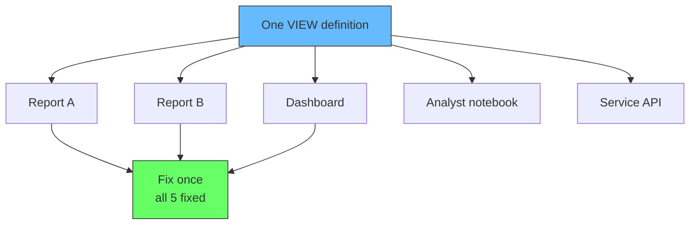

</div>

### 4.2 Abstraction: Hide table internals

**Problem:** You want to rename `orders` to `store_orders`, split `users` into `users` + `profiles`, or change `amount` from `numeric` to `cents int`. Every raw query breaks.

**Solution:** Keep a View with the old name/shape. Callers keep querying the View while you migrate tables underneath ([PostgreSQL, CREATE VIEW](https://www.postgresql.org/docs/current/sql-createview.html) — Views survive `ALTER TABLE ... RENAME` of columns via dependency tracking).

```sql
-- Old code expects SELECT user_name, amount FROM paid_orders
-- You refactor base tables but keep the View stable
ALTER TABLE orders RENAME TO store_orders;
CREATE OR REPLACE VIEW paid_orders AS
SELECT o.id, (o.amount_cents / 100.0) AS amount, u.name AS user_name
FROM store_orders o JOIN users u ON u.id = o.user_id
WHERE o.status = 'paid';
-- Zero caller changes
```

The classic case is splitting a bloated table. If you need to restructure your database — like splitting a single `Users` table into `User_Credentials` and `User_Profiles` — any legacy app pointing to the old table will immediately break ([Grace Valerie, SQL Views for Data Analysis](https://medium.com/@gracevalerie1/sql-views-for-data-analysis-a5c6127fbfb6)). To prevent this, create a View named `Users` that joins the two new tables together ([Quora, Benefits of Using Views](https://www.quora.com/What-are-the-benefits-of-using-views-instead-of-tables-in-an-RDBMS-like-MySQL-PostgreSQL-or-Oracle-Are-there-any-drawbacks-to-using-views-extensively)):

```sql
-- Before: one monolithic table
-- CREATE TABLE Users (id, email, password_hash, name, avatar, bio);

-- After: split into two
CREATE TABLE User_Credentials (id int PRIMARY KEY, email text, password_hash text);
CREATE TABLE User_Profiles (user_id int REFERENCES User_Credentials(id), name text, avatar text, bio text);

-- Legacy View: old name, new shape underneath
CREATE VIEW Users AS
SELECT c.id, c.email, c.password_hash, p.name, p.avatar, p.bio
FROM User_Credentials c JOIN User_Profiles p ON p.user_id = c.id;

-- Legacy app still does: SELECT * FROM Users WHERE id = 1;
-- Zero code changes, two clean tables underneath
```

This is the database equivalent of an API — the View is the contract, the tables are the implementation ([PostgreSQL, Dependency Tracking](https://www.postgresql.org/docs/current/ddl-depend.html) records View dependencies in `pg_depend` so `DROP TABLE` fails if a View still needs it).

### 4.3 Security: Expose rows and columns selectively

**Problem:** An analyst role should see `paid_orders` but not `cost` or `cancelled` rows, and should never `SELECT * FROM orders`.

**Solution:** Grant `SELECT ON paid_orders`, revoke `SELECT ON orders`. The View filters rows and projects columns. Postgres checks the View owner's permissions, not the caller's, for the base tables when `security_barrier` is off, so combine with `security_barrier` for row-level security correctness ([PostgreSQL, CREATE VIEW security_barrier](https://www.postgresql.org/docs/current/sql-createview.html)).

```sql
CREATE VIEW paid_orders_public AS
SELECT id, amount, user_name, country
FROM paid_orders; -- no cost, no pending/cancelled

REVOKE ALL ON orders FROM analyst_role;
GRANT SELECT ON paid_orders_public TO analyst_role;
```

<div style={{display: 'flex', justifyContent: 'center'}}>

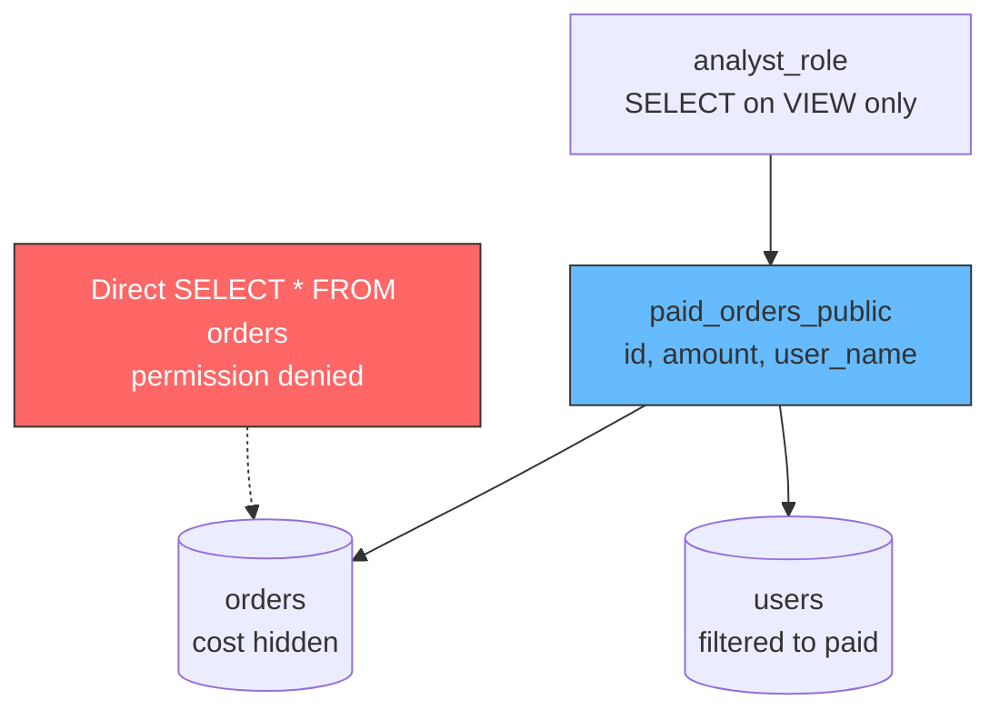

</div>

For true row-level hiding (`WHERE country = 'USA'` must not be bypassed by a crafted `WHERE` that leaks rows), use `security_barrier` so the View predicate runs first ([PostgreSQL, security_barrier](https://www.postgresql.org/docs/current/sql-createview.html)):

```sql
CREATE VIEW usa_paid_orders WITH (security_barrier = true) AS
SELECT * FROM paid_orders WHERE country = 'USA';
-- Planner will not push a attacker-controlled predicate before the barrier
```

You might want an employee or a third-party application to see some data from a table, but not all of it — like masking employee salaries or SSNs ([Learning SQL, From A to SQL: A Comprehensive Overview of Views](https://medium.com/learning-sql/from-a-to-sql-a-comprehensive-overview-of-views-dbcc97548080), [YouTube, SQL Views Tutorial](https://www.youtube.com/watch?v=nEAAtj8jbBI&t=8)). Views solve this with two mechanisms:

**Row/Column filtering:** Build a View that only selects safe columns or filters out sensitive rows:

```sql
CREATE VIEW employee_safe AS
SELECT id, name, department
FROM employees; -- salary, ssn, performance_rating hidden

CREATE VIEW employees_by_region AS
SELECT id, name, department, salary
FROM employees WHERE region = current_setting('app.region');
-- HR in US sees only US salaries, not global
```

**Restricted access:** Grant the user permission to query the View while completely blocking their access to the underlying physical tables:

```sql
REVOKE ALL ON employees FROM hr_analyst;
GRANT SELECT ON employee_safe TO hr_analyst;
-- hr_analyst cannot SELECT * FROM employees directly
-- can only see what the View exposes
```

This is the standard approach for GDPR/PCI compliance — sensitive columns stay in the base table, the View is the safe public surface, and permissions enforce the boundary ([PostgreSQL, CREATE VIEW](https://www.postgresql.org/docs/current/sql-createview.html)).

### 4.4 Backward compatibility after schema changes

**Problem:** You split `name` into `first_name` + `last_name` or move `country` to a `profiles` table. Old dashboards still query `name` and `country`.

**Solution:** A View reconstructs the old shape. Keep both shapes live during migration.

```sql
CREATE VIEW users_legacy AS
SELECT id, first_name || ' ' || last_name AS name, p.country
FROM users_v2 u JOIN profiles p ON p.user_id = u.id;
```

### 4.5 Simplify complex logic for consumers

**Problem:** Reporting needs `JOIN` + `GROUP BY` + `Window` every time (e.g., total per user + rank). Non-SQL callers should not write that.

**Solution:** A View encapsulates the complexity. Consumers `SELECT * FROM user_totals WHERE rank <= 3`.

```sql
CREATE VIEW user_totals AS
SELECT user_name, SUM(amount) AS total,
       RANK() OVER (ORDER BY SUM(amount) DESC) AS rnk
FROM paid_orders
GROUP BY user_name;

SELECT * FROM user_totals WHERE rnk = 1; -- top spender
```

### 4.6 Permission boundary and dependency tracking

Views appear in `information_schema.views` and `pg_depend`. You can `DROP VIEW IF EXISTS`, `CREATE OR REPLACE VIEW`, and query `pg_get_viewdef('paid_orders'::regclass)` to audit what data a role can reach ([PostgreSQL, information_schema.views](https://www.postgresql.org/docs/current/infoschema-views.html)).

## 5. Managing Views: Replace, Drop, Dependencies

```sql
-- Replace without dropping dependents
CREATE OR REPLACE VIEW paid_orders AS
SELECT ... -- new definition must output same column names/types
-- If you need to change columns, use DROP + CREATE

-- Drop
DROP VIEW IF EXISTS paid_orders;

-- Dependents block careless drops
DROP TABLE orders; -- ERROR: cannot drop table orders because other objects depend on it
                   -- HINT: Use DROP ... CASCADE
DROP TABLE orders CASCADE; -- drops paid_orders too — use with care

-- Inspect
SELECT pg_get_viewdef('paid_orders'::regclass);
SELECT * FROM information_schema.views WHERE table_name = 'paid_orders';
```

<div style={{display: 'flex', justifyContent: 'center'}}>

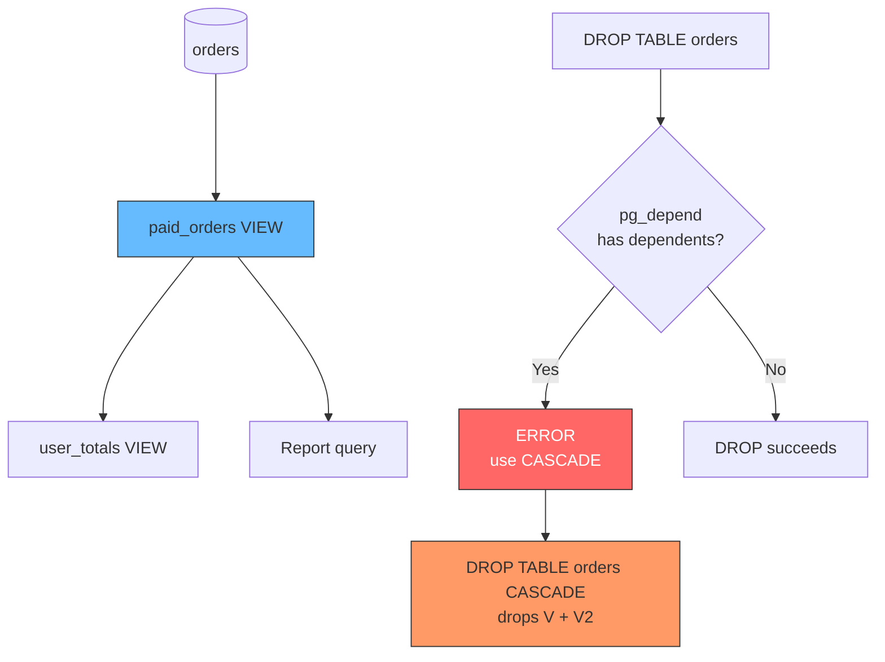

</div>

Postgres tracks dependencies so renames propagate where possible and drops warn you ([PostgreSQL, Dependency Tracking](https://www.postgresql.org/docs/current/ddl-depend.html)).

## 6. Updatable Views, WITH CHECK OPTION, and security_barrier

Not all Views are read-only. A View is automatically updatable when it selects from a single table without `GROUP BY`, `DISTINCT`, `Window`, or `JOIN` ([PostgreSQL, Updatable Views](https://www.postgresql.org/docs/current/rules-views.html#RULES-VIEWS-UPDATE)). Otherwise you need `INSTEAD OF` triggers (or PostgreSQL `RULE`s) to define how `INSERT`/`UPDATE` maps to base tables.

### 6.1 Simple updatable View

```sql
CREATE VIEW usa_users AS
SELECT id, name, country FROM users WHERE country = 'USA';

-- All of these rewrite to operations on users
INSERT INTO usa_users VALUES (4, 'Mina', 'USA');
UPDATE usa_users SET name = 'Mina K' WHERE id = 4;
DELETE FROM usa_users WHERE id = 4;
```

<div style={{display: 'flex', justifyContent: 'center'}}>

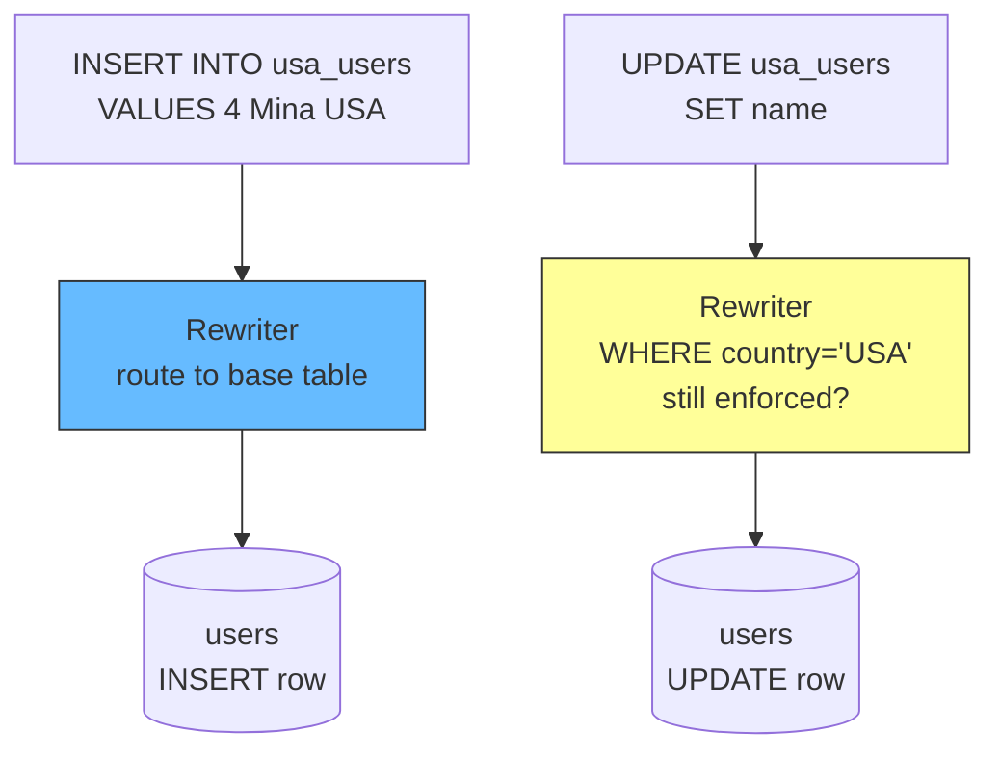

</div>

Without `WITH CHECK OPTION`, that last `UPDATE` or `INSERT` succeeds even if the new row violates the View predicate, and the row immediately disappears from the View — a silent bug.

### 6.2 WITH CHECK OPTION: Prevent invisible writes

`WITH CHECK OPTION` rejects writes that would produce rows not visible through the View ([PostgreSQL, CREATE VIEW WITH CHECK OPTION](https://www.postgresql.org/docs/current/sql-createview.html)).

```sql
CREATE VIEW usa_users AS
SELECT id, name, country FROM users WHERE country = 'USA'
WITH CHECK OPTION;

INSERT INTO usa_users VALUES (5, 'Ravi', 'India');
-- ERROR: new row violates check option for view "usa_users"
-- The DB blocks the write because country != 'USA' would be invisible

-- Local vs Cascaded (Postgres uses CASCADED by default)
-- WITH CASCADED CHECK OPTION — checks this View and all underlying Views
-- WITH LOCAL CHECK OPTION — checks only this View
```

Use `WITH CHECK OPTION` whenever you expose a View for writes. Otherwise callers can launder rows into tables through the wrong View.

### 6.3 security_barrier for safe predicate ordering

Without `security_barrier`, the optimizer may push a user-supplied `WHERE` (e.g., `WHERE expensive_function(secret)`) before the View's `WHERE country = 'USA'`, leaking timing or error side-channels ([PostgreSQL, security_barrier](https://www.postgresql.org/docs/current/sql-createview.html)). Set `security_barrier = true` on Views that enforce access control so their predicate is evaluated first, at the cost of some optimization.

## 7. Views vs CTEs vs Subqueries — When to Pick What

A View, a CTE (`WITH ...`), and a subquery all encapsulate logic. The difference is lifetime and optimization.

| Construct | Lifetime | Stored on disk? | Can be indexed? | Who sees it? | Typical use |
|---|---|---|---|---|---|
| View | Persistent, named globally | Query text only | No (use Mat. View) | Every session/role | Shared contract, 5+ consumers |
| CTE | One query only | No | No | That query only | Break a 100-line query into steps |
| Subquery | One query only | No | No | That query only | Inline filter/aggregation |
| Materialized View | Persistent, refreshed | Rows stored | Yes | Every session | Fast reads over expensive aggregation |

```sql
-- CTE: one-query, not stored
WITH paid AS (
  SELECT u.name AS user_name, o.amount
  FROM orders o JOIN users u ON u.id = o.user_id
  WHERE o.status = 'paid'
)
SELECT user_name, SUM(amount) FROM paid GROUP BY user_name;

-- Subquery: one-query, inline
SELECT user_name, SUM(amount) FROM (
  SELECT u.name AS user_name, o.amount
  FROM orders o JOIN users u ON u.id = o.user_id
  WHERE o.status = 'paid'
) s GROUP BY user_name;

-- View: stored, reused, supports GRANT
SELECT user_name, SUM(amount) FROM paid_orders GROUP BY user_name;
```

<div style={{display: 'flex', justifyContent: 'center'}}>

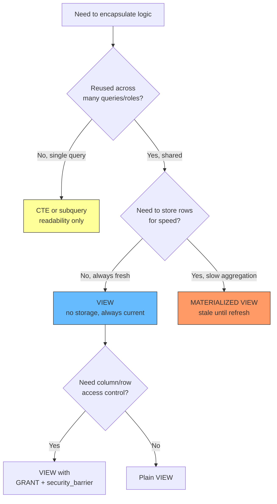

</div>

Rule of thumb: 1 to 2 consumers and a query that changes often — use a CTE. 3+ consumers, a stable contract, or need for `GRANT` — use a View. Need sub-second reads over a 10-second aggregation — use a Materialized View.

## 8. Materialized Views — When Fresh Is Too Slow

A regular View is always fresh but never faster than its query. A Materialized View stores the result rows and must be refreshed ([PostgreSQL, CREATE MATERIALIZED VIEW](https://www.postgresql.org/docs/current/sql-creatematerializedview.html)).

```sql
CREATE MATERIALIZED VIEW monthly_revenue AS
SELECT DATE_TRUNC('month', created_at) AS month, SUM(amount) AS total
FROM orders WHERE status = 'paid'
GROUP BY month
WITH NO DATA; -- create structure without scanning

-- Reads are instant — just a table scan
SELECT * FROM monthly_revenue WHERE month = '2026-09-01';

-- Stale until you refresh
REFRESH MATERIALIZED VIEW monthly_revenue;            -- blocks reads, ACCESS EXCLUSIVE
REFRESH MATERIALIZED VIEW CONCURRENTLY monthly_revenue; -- allows reads, needs unique index
```

<div style={{display: 'flex', justifyContent: 'center'}}>

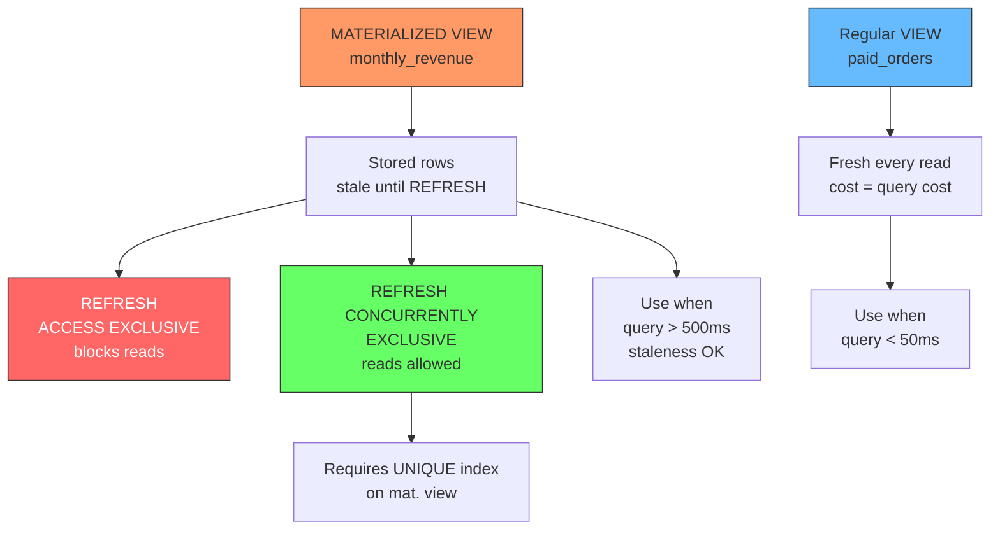

</div>

Locking matters. `REFRESH MATERIALIZED VIEW` takes `ACCESS EXCLUSIVE` on the mat. view and blocks even `SELECT` ([see Table-Level Locks](./postgresql-locks.md#table-level-locks)). `REFRESH CONCURRENTLY` takes `EXCLUSIVE` instead, so `SELECT` can run concurrently — but it requires a `UNIQUE` index on the mat. view to track diffs ([PostgreSQL, REFRESH MATERIALIZED VIEW](https://www.postgresql.org/docs/current/sql-refreshmaterializedview.html)).

```sql
-- Required for CONCURRENTLY
CREATE UNIQUE INDEX ON monthly_revenue (month);
REFRESH MATERIALIZED VIEW CONCURRENTLY monthly_revenue;
-- Also: CONCURRENTLY is slower and uses more disk, but does not block readers
```

You can also index a materialized view like a table — something you cannot do for a regular View:

```sql
CREATE INDEX ON monthly_revenue (total DESC);
```

When to pick which:

- **View** — query is fast (under ~50 ms), data must be current to the second, or writes go through the View.
- **Materialized View** — query is slow (multi-second `GROUP BY` over millions of rows), staleness of minutes or hours is acceptable, and you can tolerate refresh cost.
- **Neither** — result changes thousands of times per second or needs sub-second freshness at high throughput. Use application-level caching (Redis) or a normalized table updated incrementally instead (see [Caching: How It Works](../caching/how-it-works.md) and [Why The Cache](../caching/why-cache.md)).

## 9. Pitfalls: Where Views Hurt

### 9.1 Views are not indexes — they hide slowness

A View over `SELECT * FROM orders WHERE status = 'paid'` without an index on `status` is still a sequential scan. Wrapping it in a View does not create an index or cache. Check `EXPLAIN` after every new View and add the same indexes you would for the raw query ([Use The Index, Luke, Views](https://use-the-index-luke.com/sql/views)).

### 9.2 Predicate pushdown can fail

Most `WHERE` predicates push into the View and use base-table indexes, but `security_barrier` Views, Views with `OFFSET`/`LIMIT`, or Views with `GROUP BY` may prevent pushdown and force a full materialization of the View first. If `EXPLAIN` shows a large `Subquery Scan` or `Materialize` with high rows, rewrite the View to allow pushdown or use a Materialized View instead.

### 9.3 Nested Views become opaque

`view_a` selects from `view_b` which selects from `view_c`. Debugging takes minutes because `EXPLAIN` nests three expansions and `pg_depend` chains hide which base table is slow. Keep nesting to 1 level. If you need two, consider a CTE inside the View or a Materialized View.

<div style={{display: 'flex', justifyContent: 'center'}}>

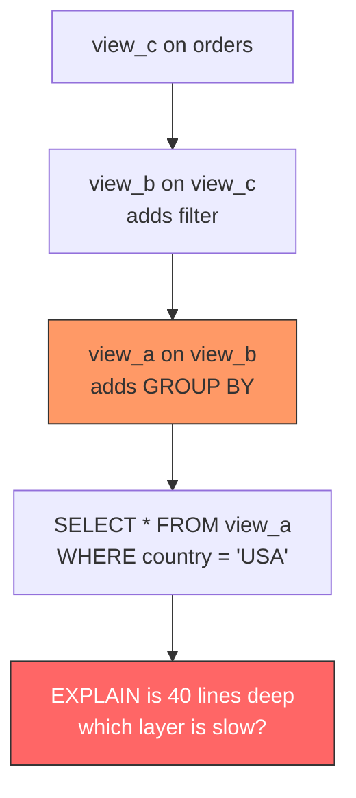

</div>

### 9.4 Permissions need thought

`GRANT SELECT ON paid_orders` without `GRANT` on `orders` still lets the caller read through the View if the View owner has access — that is intentional. For defense in depth, grant only on the View, revoke on base tables, and use `security_barrier` where row filtering is a security boundary, not just convenience.

### 9.5 Schema changes can break Views

`DROP COLUMN` on a base table fails if a View depends on it (good). `ALTER TABLE ... RENAME COLUMN` may auto-update the View via `pg_depend`, but changing column types in `CREATE OR REPLACE VIEW` requires dropping and recreating if the output shape changes. Use `pg_get_viewdef` and `information_schema.views` to audit before DDL.

## 10. Checklist: When to Use (and Not Use) a View

<div style={{display: 'flex', justifyContent: 'center'}}>

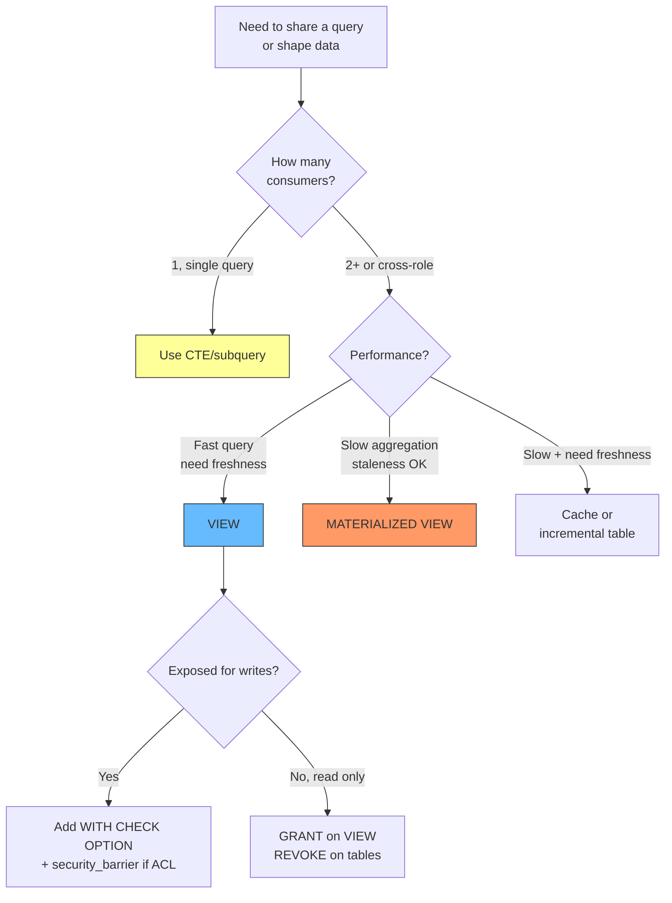

</div>

**Use a View when:** a query is reused by 3+ consumers, you need a stable API over tables that will evolve, you need column or row access control, or you need backward compatibility after a refactor.

**Do not use a View when:** the query is single-use (use a CTE), you need an index on the result (use a Materialized View with an index), the View would nest 2+ deep (keep it flat), or freshness plus heavy aggregation both matter (use incremental updates or a cache instead of refreshing a huge mat. view).

**Also avoid:** using Views to paper over missing indexes — fix the index first; using `SELECT *` in View definitions when callers depend on column order — list columns explicitly.

## 11. Runnable Examples

All examples run on the seed at the top. Try these in Supabase `psql` or a local Postgres (the in-page playground is `SELECT`-only, so `CREATE VIEW` must run in `psql`).

```sql
-- 1. Create and query a view
CREATE VIEW paid_orders AS
SELECT o.id, o.amount, u.name AS user_name, u.country
FROM orders o JOIN users u ON u.id = o.user_id
WHERE o.status = 'paid';

SELECT user_name, COUNT(*) AS orders, SUM(amount) AS total
FROM paid_orders GROUP BY user_name ORDER BY total DESC;

-- 2. Updatable view with check option
CREATE VIEW usa_users WITH (security_barrier = true) AS
SELECT id, name, country FROM users WHERE country = 'USA'
WITH CHECK OPTION;
-- INSERT INTO usa_users VALUES (4,'A','India'); -- fails

-- 3. Materialized view with concurrent refresh
CREATE MATERIALIZED VIEW revenue_by_user AS
SELECT u.name AS user_name, SUM(o.amount) AS total
FROM orders o JOIN users u ON u.id = o.user_id
WHERE o.status = 'paid' GROUP BY u.name;
CREATE UNIQUE INDEX ON revenue_by_user (user_name);
REFRESH MATERIALIZED VIEW CONCURRENTLY revenue_by_user;
SELECT * FROM revenue_by_user WHERE total > 200;
```

## 12. Interview Questions — What Interviewers Actually Ask

Views are a common topic in SQL interviews. Here are the questions interviewers ask and the exact answers they expect.

### What is a View and why use it?

A View is a named, stored `SELECT` statement. You query it like a table, but it holds no rows — the database re-runs the underlying query on every `SELECT` from the View ([PostgreSQL, CREATE VIEW](https://www.postgresql.org/docs/current/sql-createview.html)).

**Why use one?** DRY (fix logic once, not five places), abstraction (rename tables without breaking callers), security (expose only certain columns/rows), and backward compatibility (keep old shape while migrating schema).

**Interview tip:** Mention "stored query, not stored rows" — that is what distinguishes a View from a physical table or Materialized View.

### What is the difference between a View and a Materialized View?

| | View | Materialized View |
|---|---|---|
| Rows stored | No (query re-runs) | Yes (rows on disk) |
| Freshness | Always current | Stale until `REFRESH` |
| Indexable | No | Yes |
| Refresh needed | No | Yes |

A View is always fresh but never faster than its query. A Materialized View is instant to read but must be refreshed, and `REFRESH CONCURRENTLY` requires a unique index ([PostgreSQL, REFRESH MATERIALIZED VIEW](https://www.postgresql.org/docs/current/sql-refreshmaterializedview.html)). Use a View when the query is fast and freshness matters. Use a Materialized View when the query is slow and staleness of minutes or hours is acceptable.

### Can you INSERT, UPDATE, or DELETE through a View?

It depends. A View is automatically updatable when it selects from a single table without `GROUP BY`, `DISTINCT`, `Window`, or `JOIN` ([PostgreSQL, Updatable Views](https://www.postgresql.org/docs/current/rules-views.html#RULES-VIEWS-UPDATE)). If the View meets those criteria, writes through it rewrite to the base table. If not, you need `INSTEAD OF` triggers.

**Interview follow-up: "What does WITH CHECK OPTION do?"**

Without it, an `INSERT` or `UPDATE` through a View can produce rows that violate the View's `WHERE` clause — those rows vanish from the View immediately (a silent bug). `WITH CHECK OPTION` rejects writes that would produce rows not visible through the View ([PostgreSQL, WITH CHECK OPTION](https://www.postgresql.org/docs/current/sql-createview.html)).

```sql
CREATE VIEW usa_users AS
SELECT id, name, country FROM users WHERE country = 'USA'
WITH CHECK OPTION;

INSERT INTO usa_users VALUES (5, 'Ravi', 'India');
-- ERROR: new row violates check option
```

### What is the difference between WITH CASCADED CHECK OPTION and WITH LOCAL CHECK OPTION?

`CASCADED` (the default) checks the View's own predicate and every underlying View it selects from. `LOCAL` checks only the View's own predicate. If a View selects from another View, `CASCADED` ensures the inner View's filter is also enforced.

Most code uses `CASCADED` by default. Use `LOCAL` when you intentionally want to allow writes that bypass inner View predicates (rare, and interviewers expect you to explain why).

### What is security_barrier and when do you need it?

Without `security_barrier`, the Postgres optimizer may push a user-supplied `WHERE` clause (e.g., `WHERE password = 'guess'`) **before** the View's own `WHERE` clause. This leaks timing or error side-channels that let an attacker infer data outside the View's scope ([PostgreSQL, security_barrier](https://www.postgresql.org/docs/current/sql-createview.html)).

`security_barrier = true` forces the View's predicate to evaluate first, blocking predicate pushdown. Use it when the View enforces access control (row-level security), not just convenience. The tradeoff: some optimizations are disabled.

```sql
CREATE VIEW usa_users WITH (security_barrier = true) AS
SELECT id, name, country FROM users WHERE country = 'USA';
```

### Can you create an index on a View?

No. A regular View is a stored query, not a materialized result — there are no rows to index. To speed up a View, index the base tables instead, or use a Materialized View and create an index on the Materialized View.

**Interview follow-up: "How does the query planner handle Views?"**

The Postgres Rewriter expands the View into its underlying query before the Planner runs ([see Query Pipeline](./postgresql-mvcc.md#query-pipeline)). The Planner then optimizes the expanded query as if you had written it inline. `WHERE` predicates from your outer query push into the View, and the same indexes on base tables apply.

### What happens if you DROP TABLE orders when a View depends on it?

Postgres blocks the drop. The dependency is recorded in `pg_depend` and the error tells you which View depends on the table ([PostgreSQL, Dependency Tracking](https://www.postgresql.org/docs/current/ddl-depend.html)):

```
ERROR: cannot drop table orders because other objects depend on it
HINT: Use DROP ... CASCADE to drop the dependent objects too
```

`DROP TABLE orders CASCADE` drops the View too. Use `DROP VIEW` first if you want control.

### What is the difference between a View, a CTE, and a Subquery?

All three encapsulate query logic. The difference is lifetime and scope:

- **View** — persistent, named globally, visible to all sessions, supports `GRANT`/`REVOKE`. Best when 3+ consumers reuse the logic or you need access control.
- **CTE** (`WITH ...`) — one-query scope, not stored. Best for readability inside a single query.
- **Subquery** — inline, one-query scope. Best for single-use filters or aggregations.

If a query is reused by multiple callers or needs permissions, use a View. If it is a one-off readability improvement, use a CTE.

### Does a View improve performance?

No. A View is a stored query — it re-runs on every `SELECT`. Wrapping a slow query in a View does not cache anything. If the underlying query is slow, the View is slow.

**Interview answer:** "A View does not improve performance by itself. It improves maintainability. Performance comes from indexing the base tables, rewriting the query, or using a Materialized View for expensive aggregations."

Run `EXPLAIN` on the View to verify. If the output shows the same plan as the raw query, the View has zero overhead.

### Can a View reference another View?

Yes, Postgres allows nested Views. But nesting 2+ levels deep makes debugging painful — `EXPLAIN` output chains multiple expansions and `pg_depend` traces become opaque. Keep nesting to 1 level. If you find yourself nesting 2+, rewrite the inner View as a CTE inside the outer View, or flatten into a single View.

### What lock does REFRESH MATERIALIZED VIEW take?

`REFRESH MATERIALIZED VIEW` takes `ACCESS EXCLUSIVE` on the mat. view — it blocks even `SELECT` during the refresh. `REFRESH MATERIALIZED VIEW CONCURRENTLY` takes `EXCLUSIVE` instead, so reads can continue concurrently. But `CONCURRENTLY` requires a `UNIQUE` index on the mat. view ([PostgreSQL, REFRESH MATERIALIZED VIEW](https://www.postgresql.org/docs/current/sql-refreshmaterializedview.html), [see Table-Level Locks](./postgresql-locks.md#table-level-locks)).

```sql
-- Blocking: no reads during refresh
REFRESH MATERIALIZED VIEW monthly_revenue;

-- Non-blocking: reads allowed, needs UNIQUE index
CREATE UNIQUE INDEX ON monthly_revenue (month);
REFRESH MATERIALIZED VIEW CONCURRENTLY monthly_revenue;
```

### How do you inspect a View's definition?

```sql
-- Get the stored SELECT
SELECT pg_get_viewdef('paid_orders'::regclass);

-- Check if it exists in information_schema
SELECT table_name, view_definition
FROM information_schema.views
WHERE table_name = 'paid_orders';

-- List View dependencies
SELECT dependent_ns.nspname AS schema, dependent_view.relname AS view
FROM pg_depend
JOIN pg_rewrite ON pg_depend.objid = pg_rewrite.oid
JOIN pg_class dependent_view ON pg_rewrite.ev_class = dependent_view.oid
JOIN pg_namespace dependent_ns ON dependent_view.relnamespace = dependent_ns.oid
JOIN pg_class source_table ON pg_depend.refobjid = source_table.oid
WHERE source_table.relname = 'orders'
  AND pg_depend.deptype = 'n';
```

## Sources

- View storage and syntax: stored query, no rows — `CREATE VIEW` names a query, queried like a table ([PostgreSQL, CREATE VIEW](https://www.postgresql.org/docs/current/sql-createview.html)).
- View expansion and rule system: Rewriter expands Views before planning, Views are implemented as rules ([PostgreSQL, Rules and Views](https://www.postgresql.org/docs/current/rules-views.html)).
- Updatable Views and `WITH CHECK OPTION` type: automatically updatable Views, cascaded vs local check option ([PostgreSQL, CREATE VIEW WITH CHECK OPTION](https://www.postgresql.org/docs/current/sql-createview.html)).
- `security_barrier` ordering guarantee: barrier prevents predicate pushdown that would bypass row filtering ([PostgreSQL, CREATE VIEW security_barrier](https://www.postgresql.org/docs/current/sql-createview.html)).
- Materialized Views storage, `WITH NO DATA`, and `CONCURRENTLY` requiring a unique index, and indexability: ([PostgreSQL, CREATE MATERIALIZED VIEW](https://www.postgresql.org/docs/current/sql-creatematerializedview.html)) and ([PostgreSQL, REFRESH MATERIALIZED VIEW](https://www.postgresql.org/docs/current/sql-refreshmaterializedview.html)).
- Dependency tracking in `pg_depend` and `pg_get_viewdef` / `information_schema.views`: ([PostgreSQL, Dependency Tracking](https://www.postgresql.org/docs/current/ddl-depend.html)) and ([PostgreSQL, information_schema.views](https://www.postgresql.org/docs/current/infoschema-views.html)).
- Table lock modes for `REFRESH MATERIALIZED VIEW` vs `CONCURRENTLY` (`ACCESS EXCLUSIVE` vs `EXCLUSIVE`) ([see Postgres Locks](./postgresql-locks.md#table-lock-modes-weakest-to-strongest)).
- Query pipeline and Rewriter stage for View expansion ([see Postgres MVCC — Query Pipeline](./postgresql-mvcc.md#query-pipeline)).
- General performance note that Views do not imply caching or indexing, analyze `EXPLAIN` first ([Use The Index, Luke, Views](https://use-the-index-luke.com/sql/views)).

