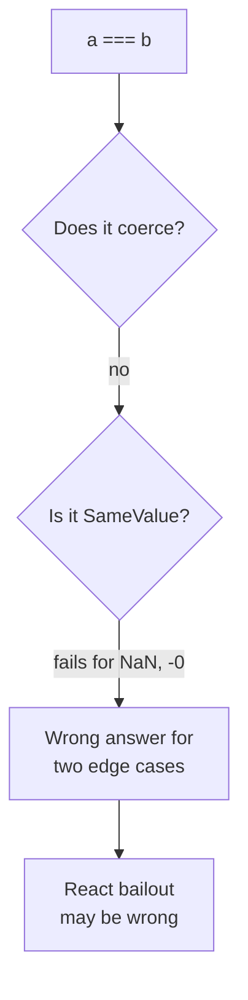
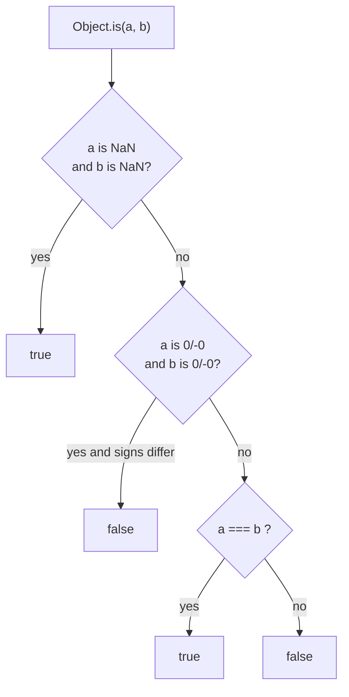
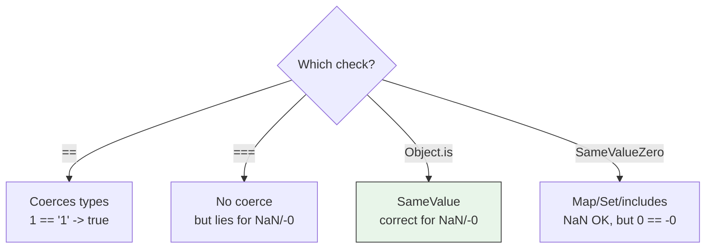
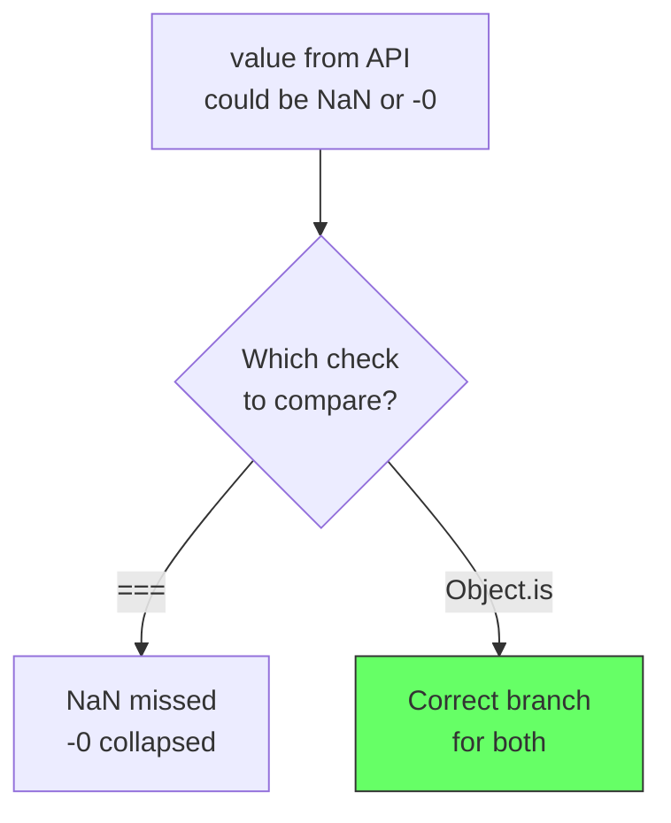
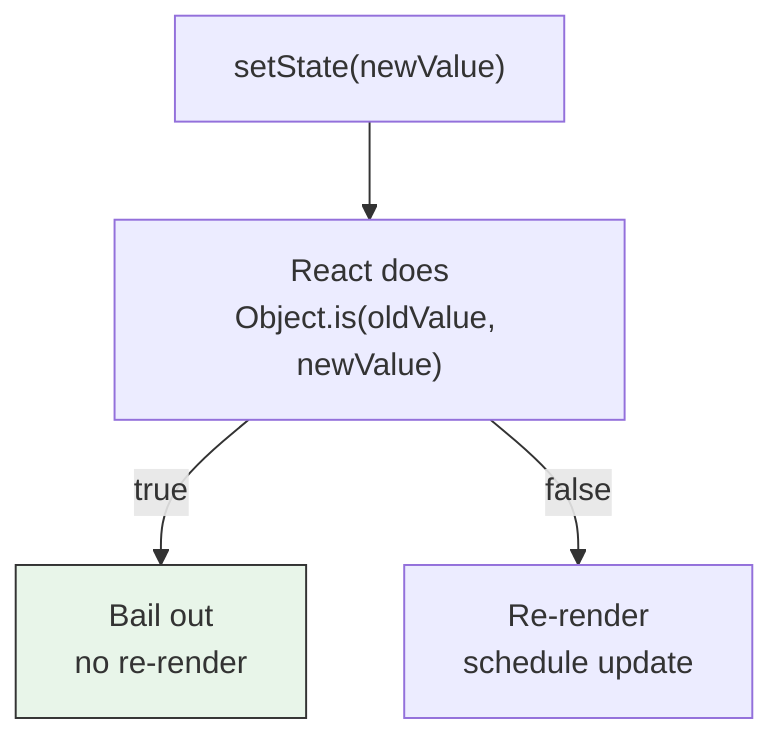
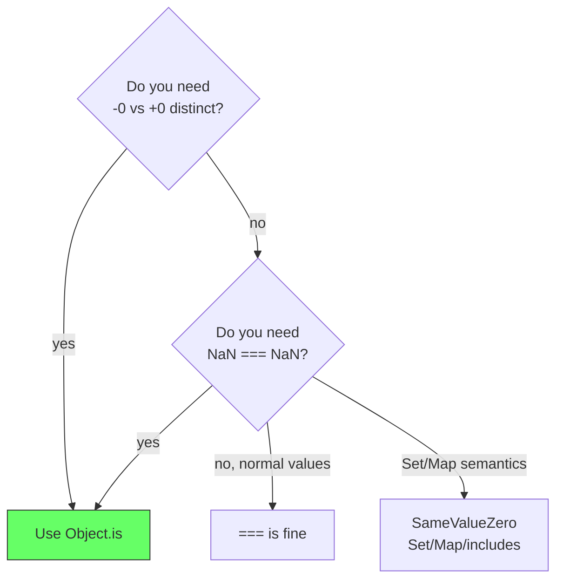
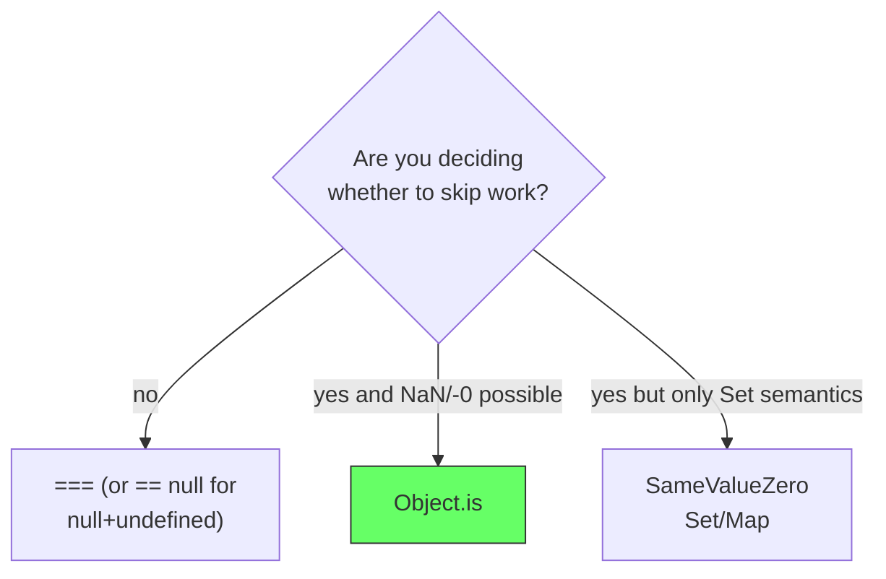

# JavaScript: Object.is - The SameValue Comparison

## The problem: `===` lies about two values

JavaScript has two obvious equality operators, but both give wrong answers for the two rarest values in the language.

`==` coerces types, so it says `1 == "1"` is `true`. `===` fixes that by checking type and value with no coercion. Yet `===` still fails twice:

```js
NaN === NaN   // false - but they are the same "not a number"
0 === -0      // true  - but they are different zeros
```

Both are specified in IEEE 754. `NaN` is not equal to itself by design, and `+0` and `-0` are distinct values that `===` collapses. Most code never notices. React does, because React decides whether to re-render by comparing old and new values, and a missed distinction wastes a render or skips one it should have done.

<div style={{display: 'flex', justifyContent: 'center'}}>



</div>

## The solution: `Object.is` is SameValue

`Object.is(a, b)` implements the **SameValue** algorithm from the spec. It is like `===` but correct for the two edge cases:

```js
Object.is(NaN, NaN) // true  - SameValue says NaN equals NaN
Object.is(0, -0)    // false - SameValue says +0 and -0 differ
Object.is(5, 5)     // true
Object.is(5, "5")   // false - no coercion, like ===
```

It is not a new idea. It is the comparison JavaScript always needed for precise bailouts.

<div style={{display: 'flex', justifyContent: 'center'}}>



</div>

## How all four comparisons differ

JavaScript actually defines four sameness checks. The one-liner to say in an interview is:

```js
==              // loose equality - coerces
===             // strict equality - no coerce, but NaN !== NaN, 0 === -0
Object.is       // SameValue - no coerce, NaN === NaN, 0 !== -0
SameValueZero   // like Object.is but 0 === -0 - used by Set/Map/includes
```

| `a` | `b` | `==` | `===` | `Object.is` | `SameValueZero` (`Set`/`Map`) |
|---|---|---|---|---|---|
| `NaN` | `NaN` | `false` | `false` | `true` | `true` |
| `0` | `-0` | `true` | `true` | `false` | `true` |
| `1` | `"1"` | `true` | `false` | `false` | `false` |
| `{} ` | `{} ` | `false` | `false` | `false` | `false` |

Objects are always compared by reference, never by content. `Object.is({}, {})` is `false` because they are two different objects.

<div style={{display: 'flex', justifyContent: 'center'}}>



</div>

## Example 1: the two edge cases that matter

```js
// NaN: the only value not equal to itself with ===
console.log(NaN === NaN);       // false
console.log(Object.is(NaN, NaN)); // true

// -0 vs +0: different signs, same magnitude
console.log(0 === -0);          // true
console.log(Object.is(0, -0));  // false

// Where -0 actually shows up
console.log(1 / 0);   // Infinity
console.log(1 / -0);  // -Infinity  <-- different result, so distinction matters
console.log(Object.is(1 / 0, 1 / -0)); // false

// Normal values behave like ===
console.log(Object.is(42, 42));     // true
console.log(Object.is(42, "42"));   // false
console.log(Object.is(null, null)); // true
console.log(Object.is(undefined, undefined)); // true
```

If your code divides, uses `Math` with signed zero, or stores `NaN` as a sentinel for missing data, `Object.is` is the only correct `===`-like check.

<div style={{display: 'flex', justifyContent: 'center'}}>



</div>

## Example 2: why React uses `Object.is` internally

React bails out of renders and effect re-runs by comparing old and new values with `Object.is`. The docs name it directly.

```jsx
// React's bailout in useState
const [count, setCount] = useState(0);
setCount(0); // React does Object.is(0, 0) -> true, so it skips the re-render
setCount(NaN); setCount(NaN); // Object.is(NaN, NaN) -> true, second call bails out correctly
```

Where React relies on it:

*   **`useState` bailout** - `Object.is(prevState, nextState)` decides whether to re-render. With `===`, setting `NaN` to `NaN` would re-render forever.
*   **`React.memo` props check** - `memo` does a shallow `Object.is` on each prop.
*   **`useMemo` / `useEffect` dependency check** - `Object.is(prevDep, nextDep)` decides whether to recompute or re-run.
*   **`Context.Provider value` check** - `Object.is(prevValue, nextValue)` decides whether to notify `useContext` consumers. That is why `value={{ count }}` notifies on every render, `value={0}` does not, and `useMemo(() => ({count}), [count])` is the fix.

```jsx
// Context identity pitfall - same count, new object -> Object.is fails
<CountContext.Provider value={{ count }}> // new object every render
// Object.is({count:0}, {count:0}) -> false, all consumers re-render

const value = useMemo(() => ({ count }), [count]);
<CountContext.Provider value={value}> // stable when count same
// Object.is(prev, next) -> true when count hasn't changed, skip
```

<div style={{display: 'flex', justifyContent: 'center'}}>



</div>

### Try it live - interactive comparison and React bailout

Compare all four checks and why `===` would break React's bailout. Edit the custom values, then try the NaN bailout.

<div style={{display: 'flex', justifyContent: 'center', marginBottom: '12px'}}>
  <a href="https://stackblitz.com/github/labeebahmad201/knowledge-base/tree/main/demos/stackblitz-object-is" target="_blank" style={{padding: '8px 16px', background: '#1269ff', color: 'white', borderRadius: '6px', textDecoration: 'none', fontWeight: 600}}>Open in StackBlitz →</a>
</div>

<iframe
  src="https://stackblitz.com/github/labeebahmad201/knowledge-base/tree/main/demos/stackblitz-object-is?embed=1&file=src/App.tsx&view=preview&hideExplorer=1&ctl=1"
  style={{width: '100%', height: '620px', border: '1px solid var(--ifm-color-emphasis-300)', borderRadius: '8px'}}
  title="Object.is - SameValue Demo"
  loading="lazy"
  sandbox="allow-scripts allow-same-origin allow-popups allow-forms"
></iframe>

> Local: `cd demos/stackblitz-object-is && npm install && npm run dev`

```js
// With ===, these would be bugs
let prev = NaN;
Object.is(prev, NaN) // true  -> correct: no update for same NaN
prev === NaN          // false -> wrong: would re-render forever

let a = 0, b = -0;
Object.is(a, b) // false -> correct: +0 and -0 are treated differently
a === b         // true  -> wrong: would miss a sign change
```

For almost all business logic the difference is invisible. For a framework that must decide skips millions of times, it is the only precise choice.

## Where to use which

Use `Object.is` when you need a precise bailout or a `Set`-like deduplication that distinguishes `-0`.

```js
// Manual bailout without React
function setValue(next) {
  if (Object.is(value, next)) return; // no work
  value = next;
  render();
}

// Deduplicate including NaN, and keep -0 distinct
const seen = [];
function add(x) {
  if (!seen.some(y => Object.is(y, x))) seen.push(x);
}
add(NaN); add(NaN); // one entry
add(0); add(-0);    // two entries
```

Use `SameValueZero` when you want `Set`/`Map`/`Array.prototype.includes` behavior. `Set` uses `SameValueZero` internally, so `Set` treats `NaN === NaN` as true but `0 === -0` as true. `Object.is` keeps them distinct.

```js
new Set([NaN, NaN]).size // 1
new Set([0, -0]).size    // 1 - Set merges them, Object.is would not
[NaN].includes(NaN)      // true - includes uses SameValueZero
Object.is(NaN, NaN)      // true - SameValue
```

<div style={{display: 'flex', justifyContent: 'center'}}>



</div>

## Pitfalls

`Object.is` is not deep equality. For objects it checks reference, not content, just like `===`.

```js
Object.is({a:1}, {a:1}) // false - two objects
Object.is([1,2], [1,2]) // false

const a = {x:1};
Object.is(a, a) // true - same reference
```

If you need deep equality, use a library or write a recursive check. `Object.is` is only the leaf comparator.

## The decision in one line

Use `===` for everyday code. Use `Object.is` when you are writing a **bailout** that must be correct for `NaN` and `-0`, which is why React chose it for `useState`, `memo`, dependency arrays, and Context value checks.

<div style={{display: 'flex', justifyContent: 'center'}}>



</div>

## References

- MDN. *Object.is*. https://developer.mozilla.org/en-US/docs/Web/JavaScript/Reference/Global_Objects/Object/is. The SameValue algorithm, polyfill, and NaN/-0 examples.
- MDN. *Equality comparisons and sameness*. https://developer.mozilla.org/en-US/docs/Web/JavaScript/Equality_comparisons_and_sameness. The four algorithms: `==`, `===`, `SameValue`, `SameValueZero`.
- ECMA-262. *SameValue*. https://tc39.es/ecma262/#sec-samevalue. The spec definition used by `Object.is`.
- React Documentation. *useState - bailout*. https://react.dev/reference/react/useState. React bails out when `Object.is(prevState, nextState)` is true.
- React Documentation. *React.memo*. https://react.dev/reference/react/memo. Shallow `Object.is` comparison on props.
- Kent C. Dodds. *Why React uses Object.is*. Notes on why `NaN` and `-0` distinctions matter for render bailouts.

