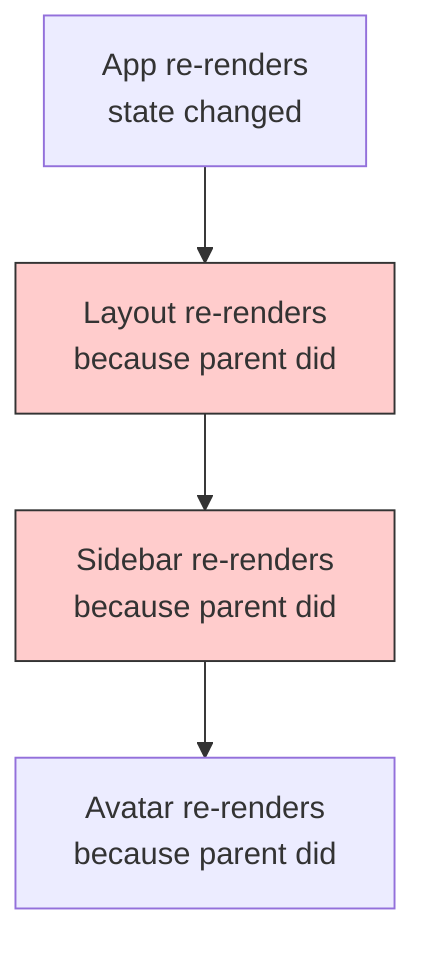
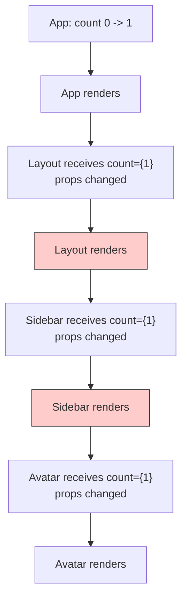
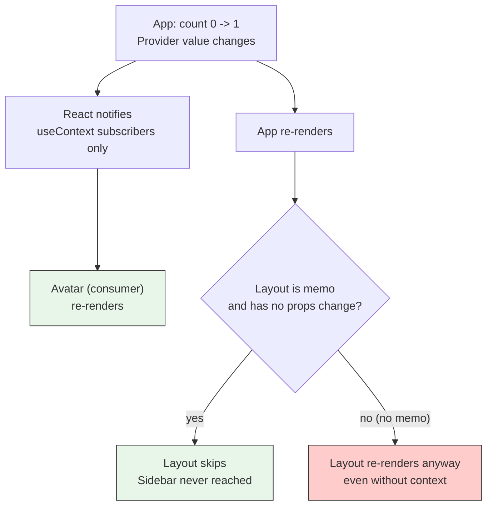
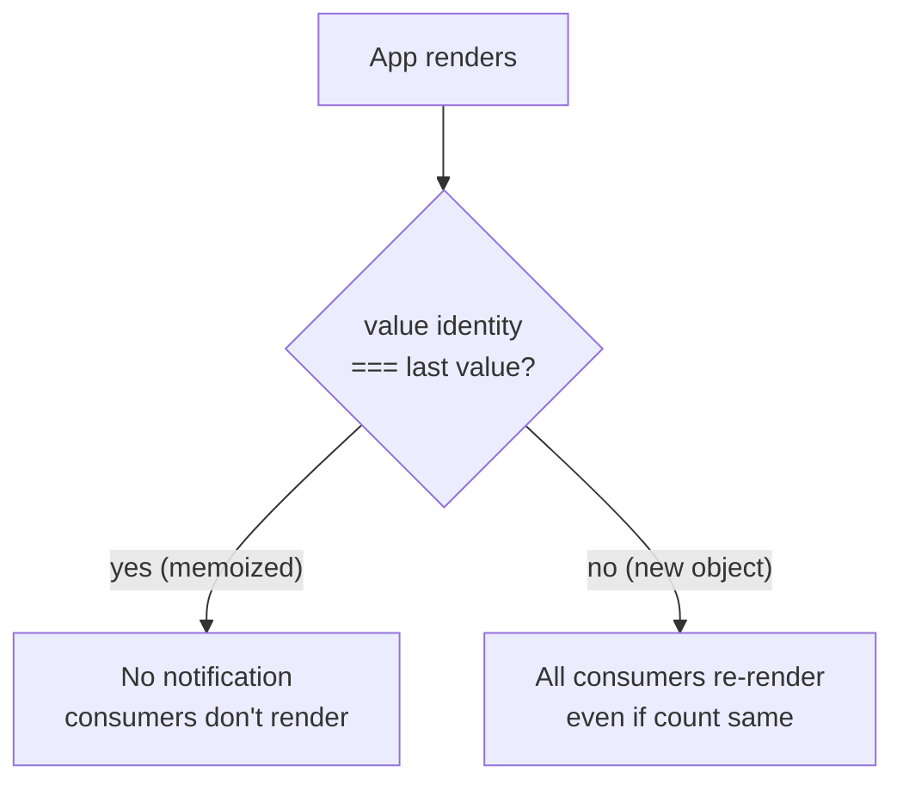
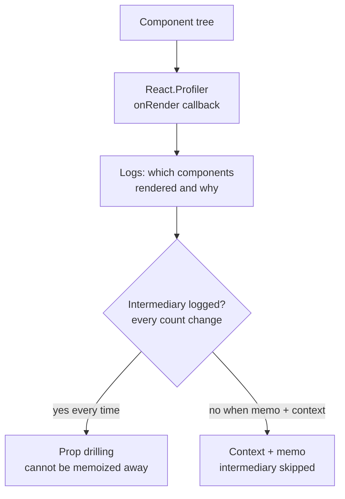
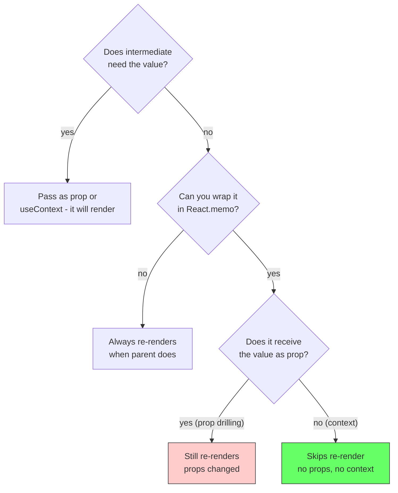

# React Re-renders: Prop Drilling vs Context

## The problem: every parent re-render re-renders its children

In React, a component is a function. When its state changes, React calls the function again to get the new UI. That is a re-render. By default, when a parent re-renders, React also re-renders all of its children, and those children re-render their children. This happens even if the child's props did not change.

This default is why sharing state through the tree has a cost. The shape of that sharing decides whether intermediate components do useless work.

<div style={{display: 'flex', justifyContent: 'center'}}>



</div>

The question for any sharing pattern is: when `count` changes at the top, which intermediaries can skip?

## Prop drilling: intermediaries must re-render

Prop drilling threads the value through every level. The value is a prop, so each intermediate receives a new prop when the value changes. React sees a new prop and must re-render.

```jsx
function App() {
  const [count, setCount] = useState(0);
  return <Layout count={count} />;
}

function Layout({ count }) {
  console.log('render Layout');
  return <Sidebar count={count} />;
}

function Sidebar({ count }) {
  console.log('render Sidebar');
  return <Avatar count={count} />;
}

function Avatar({ count }) {
  console.log('render Avatar');
  return <div>{count}</div>;
}
```

Clicking `+1` in `App` sets a new `count`. `Layout` receives `count={1}` where it had `count={0}`. Its props changed, so it re-renders. `Sidebar` and `Avatar` do the same. Each console logs on every click, even though only `Avatar` uses the value.

<div style={{display: 'flex', justifyContent: 'center'}}>



</div>

`React.memo` does not help here. `memo` skips a re-render only when props are shallow-equal. Since `count` changed, props are not equal, so `memo(Layout)` still renders. The intermediary cannot opt out because it is part of the drilling contract.

### Try it live - prop drilling re-renders

Watch the console and the `renders:` counters. Every intermediary increments on every `+1`.

<div style={{display: 'flex', justifyContent: 'center', marginBottom: '12px'}}>
  <a href="https://stackblitz.com/github/labeebahmad201/knowledge-base/tree/main/demos/stackblitz-rerenders-prop-drilling" target="_blank" style={{padding: '8px 16px', background: '#1269ff', color: 'white', borderRadius: '6px', textDecoration: 'none', fontWeight: 600}}>Open in StackBlitz →</a>
</div>

<iframe
  src="https://stackblitz.com/github/labeebahmad201/knowledge-base/tree/main/demos/stackblitz-rerenders-prop-drilling?embed=1&file=src/App.tsx&view=preview&hideExplorer=1&ctl=1"
  style={{width: '100%', height: '550px', border: '1px solid var(--ifm-color-emphasis-300)', borderRadius: '8px'}}
  title="Prop Drilling Re-renders Demo"
  loading="lazy"
  sandbox="allow-scripts allow-same-origin allow-popups allow-forms"
></iframe>

> Local: `cd demos/stackblitz-rerenders-prop-drilling && npm install && npm run dev`

## Context: intermediaries can skip when memoized

Context teleports the value. `App` publishes it, `Avatar` reads it with `useContext`. `Layout` and `Sidebar` receive no props and read no context. They are not part of the data flow.

```jsx
const CountContext = createContext(0);

function App() {
  const [count, setCount] = useState(0);
  return (
    <CountContext.Provider value={count}>
      <Layout />
    </CountContext.Provider>
  );
}

const Layout = memo(function Layout() {
  console.log('render Layout');
  return <Sidebar />;
});

const Sidebar = memo(function Sidebar() {
  console.log('render Sidebar');
  return <Avatar />;
});

function Avatar() {
  const count = useContext(CountContext);
  console.log('render Avatar');
  return <div>{count}</div>;
}
```

Two details matter at once:

1.  When `count` changes, `App` re-renders and `CountContext.Provider` gets `value={1}`. React notifies only `useContext(CountContext)` subscribers. That is `Avatar`. `Layout` and `Sidebar` are not subscribers.
2.  Without `memo`, `Layout` would still re-render because its parent `App` re-rendered. This is the default parent-causes-child rule. With `memo`, React sees `Layout` received no new props and skips it. Since `Layout` skips, `Sidebar` is never even reached.

<div style={{display: 'flex', justifyContent: 'center'}}>



</div>

This is why Context and prop drilling look the same without `memo`, but different with it. Prop drilling gives the intermediate a new prop, so `memo` cannot skip. Context gives it no prop, so `memo` can skip. The pipe lets intermediaries stay outside the update path.

If `CountContext` holds an object `value={{ count }}`, the identity changes every render even when `count` did not. Then all consumers re-render on every `App` render. The fix is `useMemo`:

```jsx
const value = useMemo(() => ({ count }), [count]);
<CountContext.Provider value={value}>
```

<div style={{display: 'flex', justifyContent: 'center'}}>



</div>

### Try it live - context with memo skips intermediaries

This demo has three layers: `Layout` memo'd, `Sidebar` memo'd, `Avatar` is the consumer, plus an unmemoized version for comparison. Click `+1` and watch: only `App` + `Avatar` increment; memo'd intermediaries stay at 1.

<div style={{display: 'flex', justifyContent: 'center', marginBottom: '12px'}}>
  <a href="https://stackblitz.com/github/labeebahmad201/knowledge-base/tree/main/demos/stackblitz-rerenders-context" target="_blank" style={{padding: '8px 16px', background: '#1269ff', color: 'white', borderRadius: '6px', textDecoration: 'none', fontWeight: 600}}>Open in StackBlitz →</a>
</div>

<iframe
  src="https://stackblitz.com/github/labeebahmad201/knowledge-base/tree/main/demos/stackblitz-rerenders-context?embed=1&file=src/App.tsx&view=preview&hideExplorer=1&ctl=1"
  style={{width: '100%', height: '600px', border: '1px solid var(--ifm-color-emphasis-300)', borderRadius: '8px'}}
  title="Context Re-renders Demo"
  loading="lazy"
  sandbox="allow-scripts allow-same-origin allow-popups allow-forms"
></iframe>

> Local: `cd demos/stackblitz-rerenders-context && npm install && npm run dev`

## How to verify which pattern re-renders

Use `React.Profiler` or a simple `useRef` counter. The demos use the counter pattern from the React docs on profiling:

```jsx
function useRenderCount(name) {
  const ref = useRef(0);
  ref.current += 1;
  console.log(`render ${name} #${ref.current}`);
  return ref.current;
}
```

In DevTools, enable `Highlight updates when components render` to see flashes. For precise counts, wrap the tree in `<Profiler onRender={...}>`.

<div style={{display: 'flex', justifyContent: 'center'}}>



</div>

## The decision in one line

Prop drilling forces every intermediate to receive the new value as a prop, so `React.memo` cannot prevent its re-render when the value changes. Context plus `React.memo` lets intermediaries receive no props and read no context, so they can skip. Use `useMemo` on the Provider value when it is an object, or split contexts so a change in one does not notify consumers of the other.

<div style={{display: 'flex', justifyContent: 'center'}}>



</div>

## References

- React Documentation. *Passing Data Deeply with Context - Before you use context*. https://react.dev/learn/passing-data-deeply-with-context#before-you-use-context. When to prefer props or children over context.
- React Documentation. *createContext* and *useContext*. https://react.dev/reference/react/createContext and https://react.dev/reference/react/useContext. Provider value identity is checked with `Object.is`; `useContext` subscribers re-render on value change.
- React Documentation. *React.memo*. https://react.dev/reference/react/memo. How `memo` skips re-renders when props are shallow-equal.
- React Documentation. *Profiler*. https://react.dev/reference/react/Profiler. Measuring which components render and why.
- Kent C. Dodds. *How to use React Context effectively*. https://kentcdodds.com/blog/how-to-use-react-context-effectively. Context is a transport mechanism; optimizing it requires splitting contexts and memoizing Provider values.

