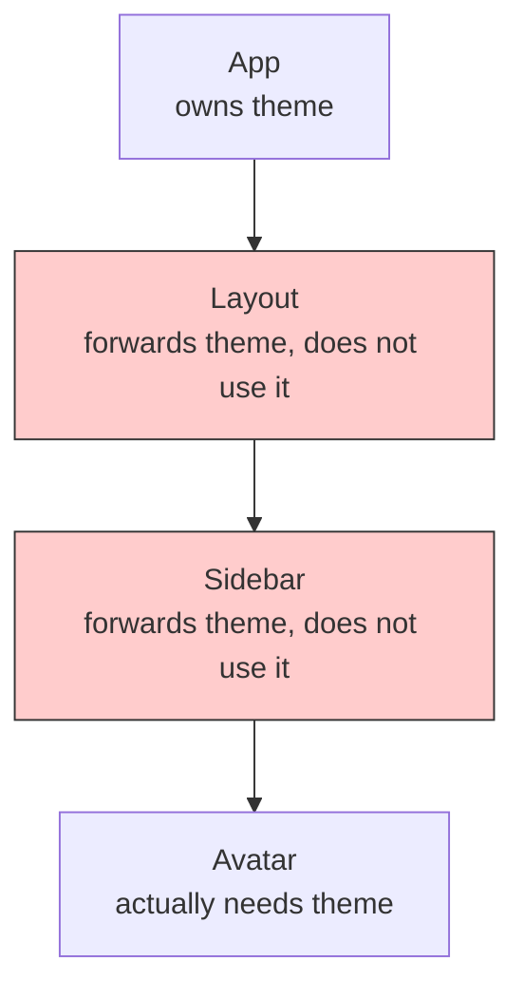
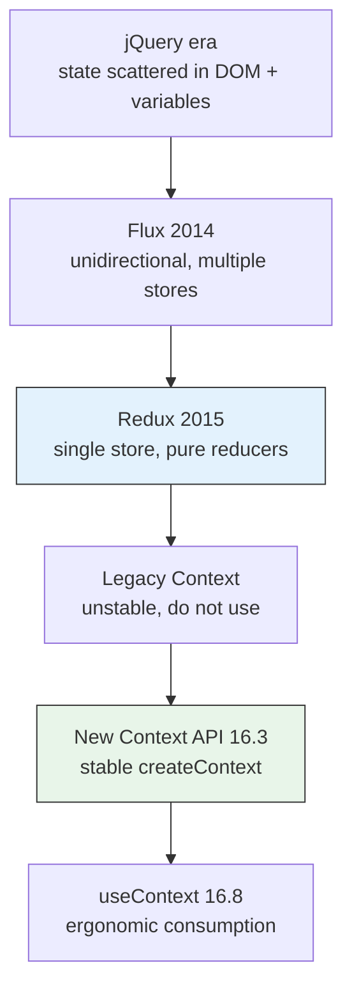
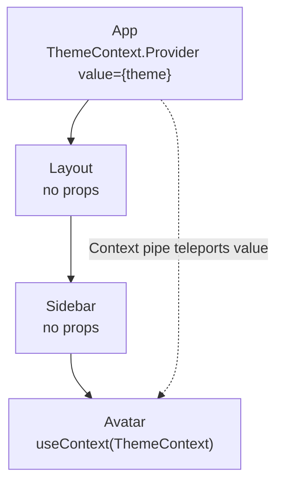
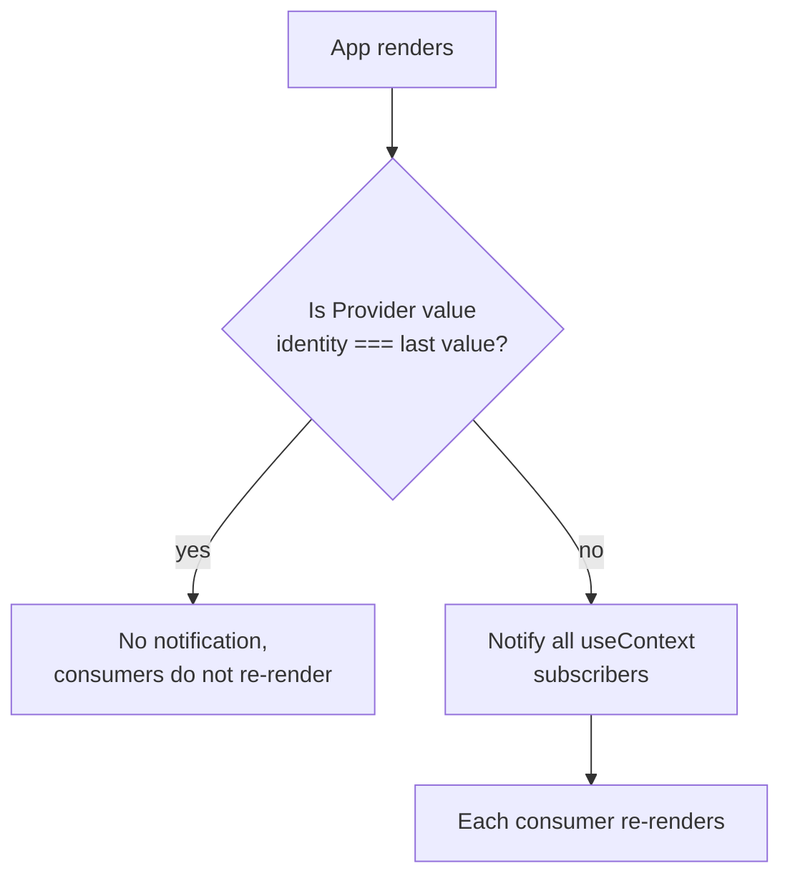
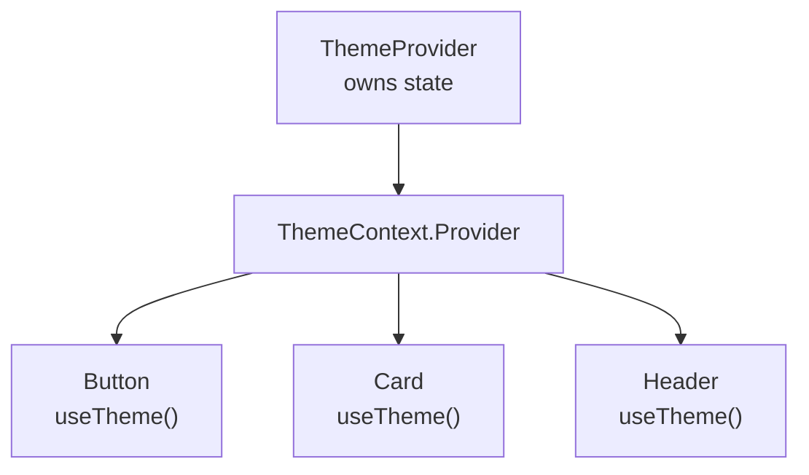
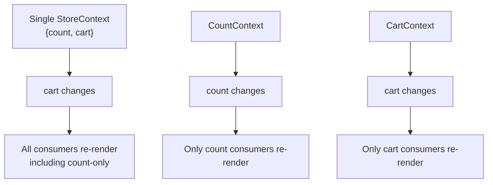
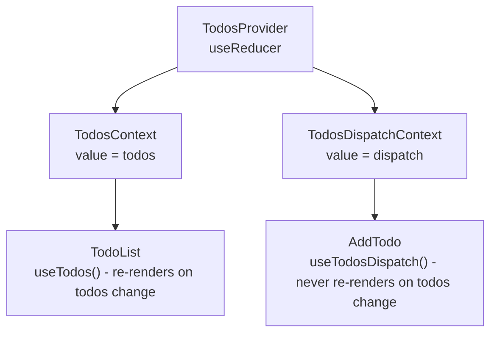
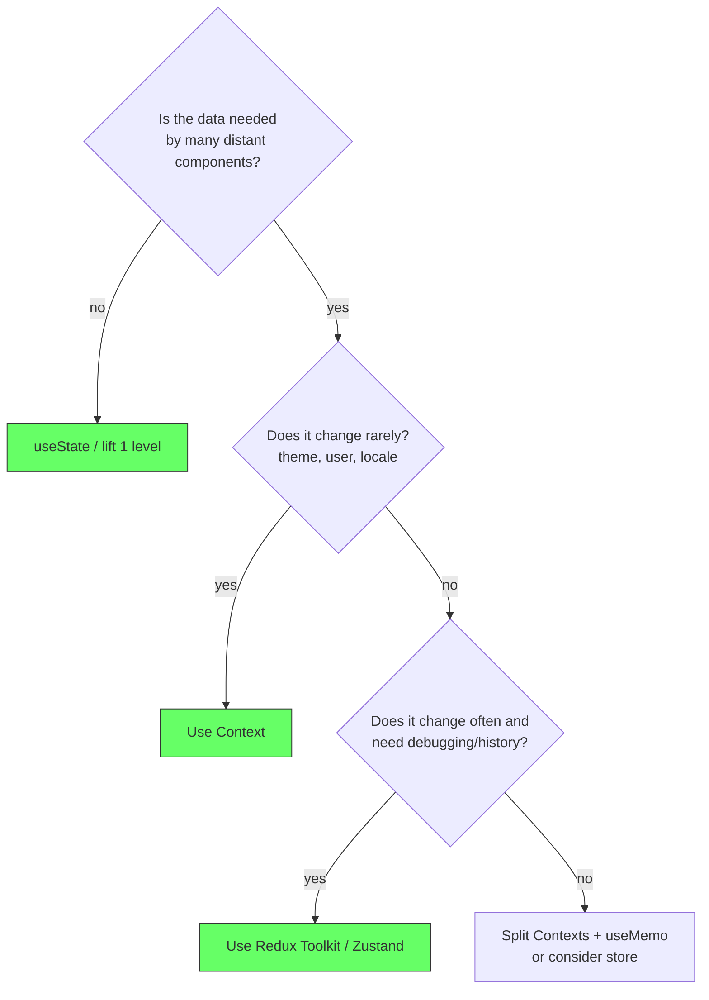

# React: Context API

## The problem: prop drilling

React passes data down through props. That works when a parent renders a direct child. It breaks when deep components need the same data. The data must be threaded through every intermediate component, even if those components do not use it at all.

This is called prop drilling. A theme, a current user, or a locale lives at the top of the tree in `App`, but an `Avatar` five levels deep needs it. Every component in the middle must accept and forward the prop. Adding or renaming the prop touches many files for no behavioral reason.

```jsx
function App() {
  const [theme, setTheme] = useState('light');
  return <Layout theme={theme} setTheme={setTheme} />;
}

function Layout({ theme, setTheme }) {
  // Layout does not use theme, it just forwards it
  return <Sidebar theme={theme} setTheme={setTheme} />;
}

function Sidebar({ theme, setTheme }) {
  // Sidebar also just forwards it
  return <Avatar theme={theme} />;
}

function Avatar({ theme }) {
  return <div className={theme}>User</div>;
}
```

Two costs appear at once. The code becomes verbose and brittle, and refactoring the shape of the data requires changes along the whole chain. The intermediate components are coupled to data they do not care about.

<div style={{display: 'flex', justifyContent: 'center'}}>



</div>

State itself is not a React concept. As discussed in the Why-First framework, state is data that represents the current condition of a system at a point in time. It predates React by decades, from finite state machines to desktop apps to jQuery pages where state was kept in variables and synced to the DOM by hand. React made the sync declarative: `UI = f(state)`. Prop drilling is the problem of how to share that `state` when the producer and consumer are far apart in the tree.

## The historical context: Redux came first

Redux was released in 2015 to fix a different pain: unpredictable shared mutable state. Flux had proposed unidirectional flow, but Redux simplified it to a single store, read-only state, and pure reducers. It solved time-travel debugging and predictable updates for complex, frequently changing shared state.

React had a Legacy Context before 2015, but it was undocumented and the docs warned not to use it. Libraries like `react-redux` used it internally via a hack. There was no stable, built-in way in React to avoid prop drilling for simple, rarely changing values without pulling in Redux, which was overkill for a `theme` or `user`.

The new Context API was released in React 16.3 in March 2018, with the ergonomic `useContext` hook following in React 16.8 in February 2019. The React documentation was explicit: Context is not a state manager. It is a dependency injection mechanism for the component tree. In fact, `react-redux` itself is built on top of Context. Its `<Provider>` is a Context provider and `useSelector` reads that Context with an optimized subscription.

<div style={{display: 'flex', justifyContent: 'center'}}>



</div>

## The solution: a pipe through the tree

Context provides a pipe. A `Provider` at the top publishes a value, and any component below can read it with `useContext` without intermediate forwarding. React handles the teleporting.

The API is three parts:

1.  `createContext(defaultValue)` creates the pipe.
2.  `<Context.Provider value={...}>` publishes the current value.
3.  `useContext(Context)` subscribes to it.

```jsx
import { createContext, useContext, useState } from 'react';

// 1. Create the pipe
const ThemeContext = createContext('light');

function App() {
  const [theme, setTheme] = useState('light');
  // 2. Publish - all descendants can read
  return (
    <ThemeContext.Provider value={{ theme, setTheme }}>
      <Layout />
    </ThemeContext.Provider>
  );
}

function Layout() {
  // No props needed
  return <Sidebar />;
}

function Sidebar() {
  return <Avatar />;
}

function Avatar() {
  // 3. Consume directly
  const { theme } = useContext(ThemeContext);
  return <div className={theme}>User</div>;
}
```

`Layout` and `Sidebar` are now decoupled from `theme`. Changing the shape of the context value touches only producer and consumers.

<div style={{display: 'flex', justifyContent: 'center'}}>



</div>

## How it works: provider, consumer, and identity

A Provider holds a `value` prop. React stores that value and notifies all `useContext` subscribers when the identity of `value` changes. Identity is checked with `Object.is`. That detail matters for performance.

If you create a new object on every render, the identity changes on every render, even when the contents are the same:

```jsx
// Bad: new object every render -> all consumers re-render every time App renders
<ThemeContext.Provider value={{ theme, setTheme }}>
```

If `theme` rarely changes, memoize the value so identity is stable:

```jsx
const value = useMemo(() => ({ theme, setTheme }), [theme]);
<ThemeContext.Provider value={value}>
```

`useContext` always reads the nearest Provider above it in the tree. If there is no Provider, it returns the `defaultValue` passed to `createContext`. That default is useful for testing or for a component rendered outside any provider.

<div style={{display: 'flex', justifyContent: 'center'}}>



</div>

## Example 1: Theme - the canonical use case

Theme is global, read often, written rarely. It is the exact pain Context was designed for.

```jsx
import { createContext, useContext, useState, useMemo } from 'react';

const ThemeContext = createContext({ theme: 'light', toggle: () => {} });

export function ThemeProvider({ children }) {
  const [theme, setTheme] = useState('light');
  const toggle = () => setTheme(t => t === 'light' ? 'dark' : 'light');
  const value = useMemo(() => ({ theme, toggle }), [theme]);

  return (
    <ThemeContext.Provider value={value}>
      <div className={theme}>{children}</div>
    </ThemeContext.Provider>
  );
}

export function useTheme() {
  return useContext(ThemeContext);
}

// Usage anywhere, no prop drilling
function Button() {
  const { theme, toggle } = useTheme();
  return <button onClick={toggle}>Current: {theme}</button>;
}

function App() {
  return (
    <ThemeProvider>
      <Button />
    </ThemeProvider>
  );
}
```

Wrapping the logic in `ThemeProvider` and a custom `useTheme` hook is the idiomatic pattern. Consumers never import the raw context, and the provider encapsulates the state logic.

<div style={{display: 'flex', justifyContent: 'center'}}>



</div>

### Try it live - editable StackBlitz

The code above is runnable. Edit `ThemeContext` directly in the browser, no local setup needed. If you fork it, your changes are saved.

<div style={{display: 'flex', justifyContent: 'center', marginBottom: '12px'}}>
  <a href="https://stackblitz.com/github/labeebahmad201/knowledge-base/tree/main/demos/stackblitz-context-theme" target="_blank" style={{padding: '8px 16px', background: '#1269ff', color: 'white', borderRadius: '6px', textDecoration: 'none', fontWeight: 600}}>Open in StackBlitz →</a>
</div>

<iframe
  src="https://stackblitz.com/github/labeebahmad201/knowledge-base/tree/main/demos/stackblitz-context-theme?embed=1&file=src/App.tsx&view=preview&hideExplorer=1&ctl=1"
  style={{width: '100%', height: '500px', border: '1px solid var(--ifm-color-emphasis-300)', borderRadius: '8px'}}
  title="Context API - Theme Demo (StackBlitz)"
  loading="lazy"
  sandbox="allow-scripts allow-same-origin allow-popups allow-forms"
></iframe>

> Local preview without StackBlitz: `cd demos/stackblitz-context-theme && npm install && npm run dev` then open `http://localhost:5173`. StackBlitz embed loads from `main` after you push, so push first if the iframe shows 404. Fix for previous error `labeebahmad201knowledge-basetreemainscratch... is invalid` was that `/scratch` is gitignored — moved demo to `/demos` so GitHub import works.

## Example 2: Authenticated user - another rare-change global

Current user is set once after login and rarely changes. Passing `user` through every layout component is wasted threading.

```jsx
import { createContext, useContext } from 'react';

const UserContext = createContext(null);

export function UserProvider({ user, children }) {
  return (
    <UserContext.Provider value={user}>
      {children}
    </UserContext.Provider>
  );
}

export function useUser() {
  const ctx = useContext(UserContext);
  if (ctx === undefined) throw new Error('useUser must be inside UserProvider');
  return ctx;
}

function Avatar() {
  const user = useUser();
  return ;
}

function Greeting() {
  const user = useUser();
  return <h1>Hi, {user.name}</h1>;
}
```

No intermediate component mentions `user`. If auth logic changes, only `UserProvider` and the consumers change.

## Example 3: When Context is the wrong tool - high-frequency state

Context has no selectors or bailout. When the Provider value changes, *all* consumers re-render, even if they only use a part of the value that did not change.

This makes it a poor fit for rapidly changing shared state like a counter, text input, or cart that updates on every keystroke or click. The docs warn about this directly: Context is not optimized for high-frequency updates.

```jsx
// Anti-pattern: high-frequency value in a single context
const StoreContext = createContext();

function StoreProvider({ children }) {
  const [count, setCount] = useState(0);
  const [cart, setCart] = useState([]);

  // Any change to count OR cart re-renders ALL consumers
  return (
    <StoreContext.Provider value={{ count, setCount, cart, setCart }}>
      {children}
    </StoreContext.Provider>
  );
}

function CountBadge() {
  // This re-renders when cart changes, even though it only uses count
  const { count } = useContext(StoreContext);
  return <span>{count}</span>;
}
```

For this shape, a selective subscription model like Redux Toolkit's `useSelector` or Zustand is correct. Only components where the selected slice changed re-render:

```jsx
// Redux: selective subscription
const count = useSelector(state => state.counter.value);
// CountBadge re-renders ONLY when count changes, not when cart changes
```

If you must use Context for somewhat frequent state, split contexts so updates are isolated:

```jsx
const CountContext = createContext(0);
const CartContext = createContext([]);

// Updating count only notifies CountContext consumers
```

<div style={{display: 'flex', justifyContent: 'center'}}>



</div>

## Pattern: Context + useReducer for local shared state

When state logic is complex but still local to a subtree and updated infrequently, pairing Context with `useReducer` gives Redux-like reducer purity without a global store. The React docs suggest this pattern for passing dispatch down.

```jsx
import { createContext, useContext, useReducer } from 'react';

const TodosContext = createContext(null);
const TodosDispatchContext = createContext(null);

function todosReducer(todos, action) {
  switch (action.type) {
    case 'added': return [...todos, action.todo];
    case 'removed': return todos.filter(t => t.id !== action.id);
    default: return todos;
  }
}

export function TodosProvider({ children }) {
  const [todos, dispatch] = useReducer(todosReducer, []);
  return (
    <TodosContext.Provider value={todos}>
      <TodosDispatchContext.Provider value={dispatch}>
        {children}
      </TodosDispatchContext.Provider>
    </TodosContext.Provider>
  );
}

export function useTodos() { return useContext(TodosContext); }
export function useTodosDispatch() { return useContext(TodosDispatchContext); }

function AddTodo() {
  const dispatch = useTodosDispatch();
  return <button onClick={() => dispatch({ type: 'added', todo: { id: 1, text: 'Learn Context' } })}>Add</button>;
}
```

Splitting state and dispatch into two contexts prevents components that only dispatch actions from re-rendering when state changes.

<div style={{display: 'flex', justifyContent: 'center'}}>



</div>

## The decision in one line

Use Context when data is global, mostly read, and rarely written: `theme`, `locale`, `currentUser`, `router`. Do not use it as a general state manager for high-frequency, frequently written shared state: `cart`, `filters`, `form input`, `realtime data`. Split contexts to isolate renders, memoize provider values, and reach for Redux Toolkit or Zustand when you need selective subscriptions, middleware, and DevTools.

<div style={{display: 'flex', justifyContent: 'center'}}>



</div>

## References

- React Documentation. *createContext*. https://react.dev/reference/react/createContext. The definition, defaultValue, and Provider contract.
- React Documentation. *useContext*. https://react.dev/reference/react/useContext. How to read a context value, the Provider lookup, and that the component re-renders on context change.
- React Documentation. *Passing Data Deeply with Context*. https://react.dev/learn/passing-data-deeply-with-context. The prop drilling problem, when to use context, and the theme example.
- React Documentation. *Scaling Up with Reducer and Context*. https://react.dev/learn/scaling-up-with-reducer-and-context. The `useReducer` plus Context pattern and splitting state/dispatch contexts.
- React Documentation. *Context - Before You Use Context*. https://react.dev/learn/passing-data-deeply-with-context#before-you-use-context. The warning that Context is not a state management tool and is not optimized for high-frequency updates.
- Abramov, Dan and Clark, Andrew. *Redux Documentation. Motivation*. https://redux.js.org/understanding/thinking-in-redux/motivation. Why a single store and pure reducers were introduced after Flux.
- React Redux Documentation. *React-Redux Provider*. https://react-redux.js.org/api/provider. Why Redux itself is implemented on top of Context.

