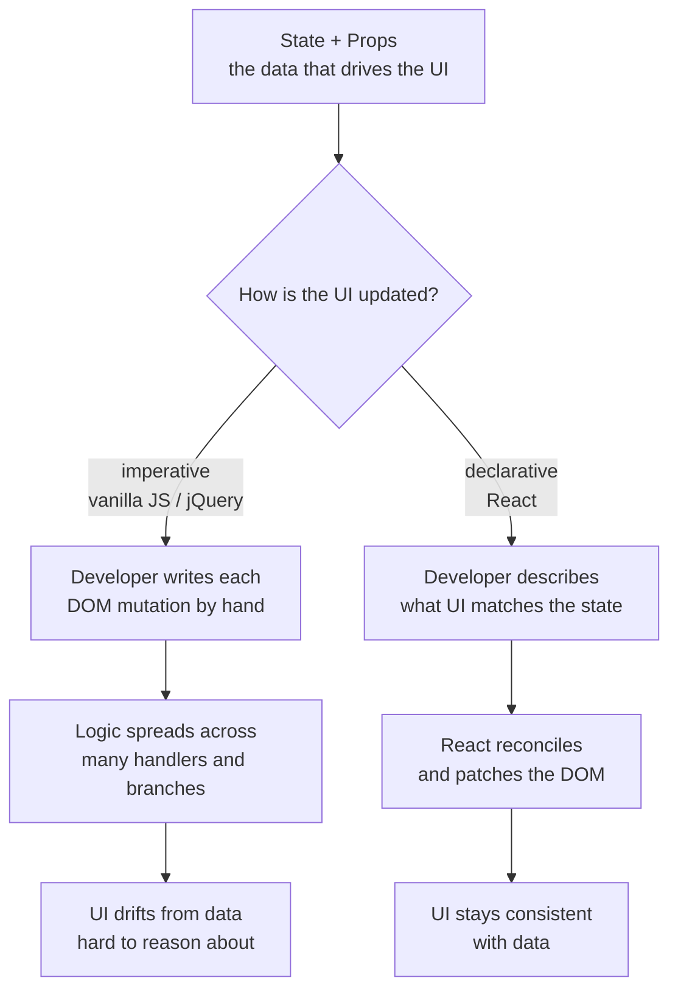
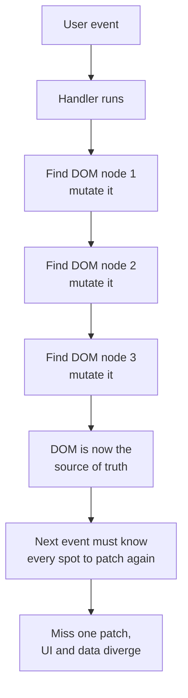
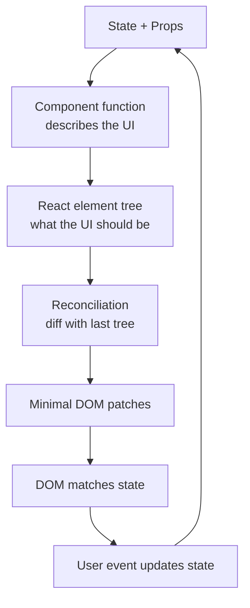
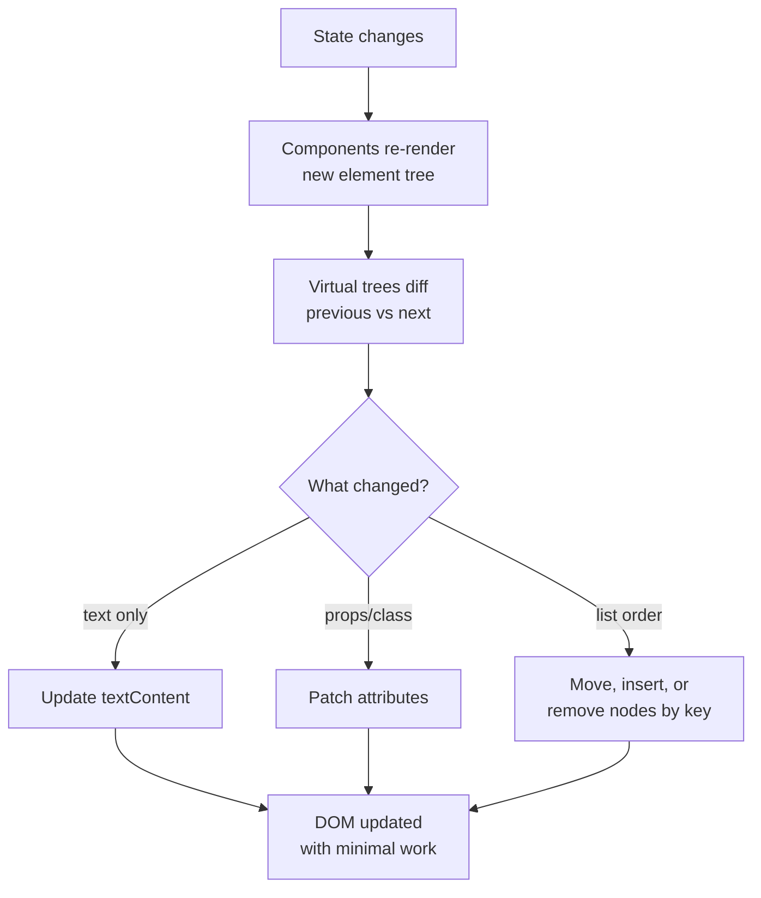
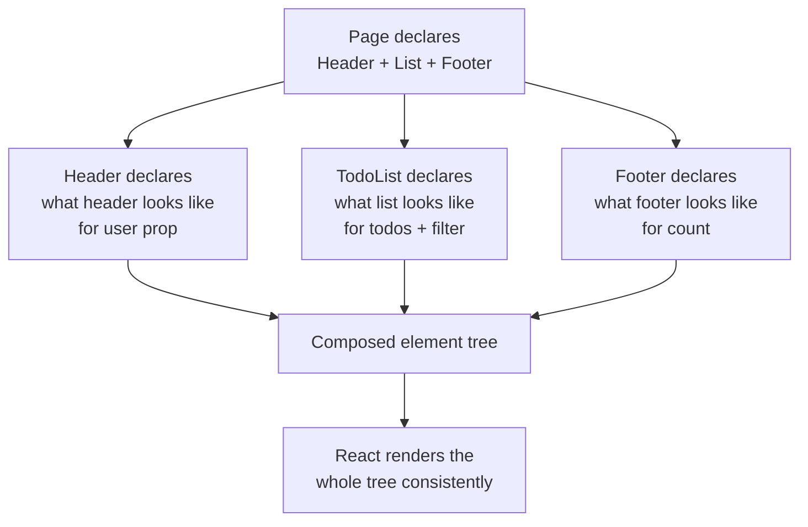
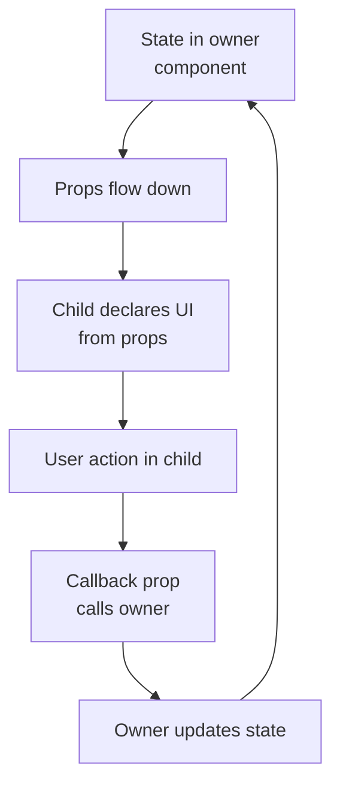
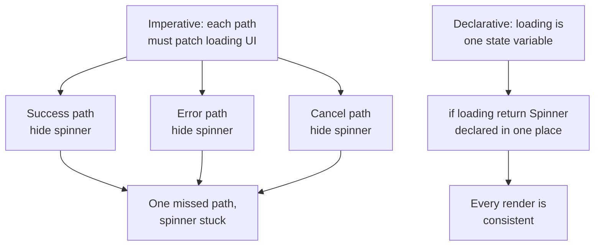
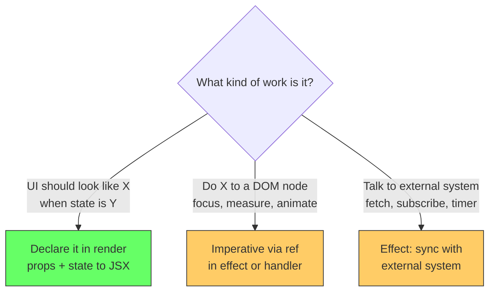

# React: Declarative vs Imperative

## The problem: keeping the UI consistent as state grows

Every interactive UI has the same core job: keep what the user sees in sync with what the data says. As the application grows, that job gets harder. State lives in many places, user actions can fire in any order, and the DOM has to reflect every change correctly.

With vanilla JavaScript or jQuery, the developer is responsible for every DOM transition. You query an element, change its text, add or remove a class, insert or delete a node. Each interaction needs its own set of manual updates, and each update has to remember every DOM spot that might be affected. When the app is small this works. When state and UI complexity grow, the logic spreads across handlers, branches multiply, and it becomes easy to leave the DOM in a state that no longer matches the data.

React was built for that exact scaling problem. It is a JavaScript library for building user interfaces by composing reusable components and rendering them declaratively based on state and props. You describe what the UI should look like for a given state, and React handles updating the DOM. That single shift, from telling the browser how to update to describing what to show, is what makes large applications easier to maintain, test, and evolve.

<div style={{display: 'flex', justifyContent: 'center'}}>



</div>

## What imperative means: you tell the browser how to update

Imperative code describes step by step how to get from the current DOM to the next DOM. You own the sequence: find the node, read its current value, mutate it, handle the reverse mutation later. The DOM is the source of truth you keep patching.

**Vanilla JavaScript example, a counter:**

```js
// HTML: <span id="count">0</span> <button id="btn">Increment</button>

let count = 0;
const countEl = document.getElementById('count');
const btn = document.getElementById('btn');

btn.addEventListener('click', () => {
  count = count + 1;
  // Every state change must manually update every affected DOM node
  countEl.textContent = count;
  if (count >= 10) {
    countEl.classList.add('limit');
    btn.disabled = true;
  }
});
```

Every new rule, disabled state, styling, derived text, is another line in the handler that mutates the DOM. Add a reset button, add another handler that must undo the same mutations in reverse.

**jQuery simplifies the same model but does not replace it:**

```js
let count = 0;

$('#btn').on('click', () => {
  count++;
  $('#count').text(count);
  if (count >= 10) {
    $('#count').addClass('limit');
    $('#btn').prop('disabled', true);
  }
});

$('#reset').on('click', () => {
  count = 0;
  $('#count').text(count).removeClass('limit');
  $('#btn').prop('disabled', false);
});
```

jQuery removes verbose `getElementById` and normalizes browser quirks, but the pattern is still imperative. Each handler imperatively patches the DOM. The React documentation describes this directly: jQuery era code is a sequence of DOM manipulations triggered by events, and application state is often implicit in the DOM itself.

The cost becomes visible in a realistic list. Consider filtering a todo list:

```js
function renderTodos(todos, filter) {
  const list = document.getElementById('list');
  list.innerHTML = '';
  todos
    .filter(t => filter === 'all' || t.status === filter)
    .forEach(t => {
      const li = document.createElement('li');
      li.textContent = t.text;
      if (t.done) li.classList.add('done');
      list.appendChild(li);
    });
  document.getElementById('empty').style.display =
    list.children.length === 0 ? 'block' : 'none';
  document.getElementById('count').textContent =
    `${list.children.length} items`;
}
```

Every render is a manual teardown and rebuild, plus separate updates for empty state and count. Change the filter, add a todo, toggle one, each code path must call the same sequence and keep auxiliary UI in sync. Miss one spot and the count or empty message goes stale.

<div style={{display: 'flex', justifyContent: 'center'}}>



</div>

Imperative updates are precise but scattered. The how lives in many places. Reasoning about what the UI shows requires mentally replaying every handler that might have run.

## What declarative means: you describe what the UI should be

Declarative code describes what the UI should look like for a given state. You do not write the DOM transition. You return a description of the UI, and the library figures out how to get there.

**The same counter in React:**

```jsx
function Counter() {
  const [count, setCount] = useState(0);

  return (
    <>
      <span className={count >= 10 ? 'limit' : ''}>{count}</span>
      <button
        disabled={count >= 10}
        onClick={() => setCount(c => c + 1)}
      >
        Increment
      </button>
    </>
  );
}
```

There is no `getElementById`, no `textContent =`, no `classList.add` to undo later. The component declares: for this `count`, this is the text, this is the class, this is whether the button is disabled. When `count` changes, React re-renders the component and applies the minimal DOM changes.

The todo list becomes a pure function of data:

```jsx
function TodoList({ todos, filter }) {
  const filtered = todos.filter(t => filter === 'all' || t.status === filter);

  if (filtered.length === 0) return <p>No items</p>;

  return (
    <>
      <p>{filtered.length} items</p>
      <ul>
        {filtered.map(t => (
          <li key={t.id} className={t.done ? 'done' : ''}>{t.text}</li>
        ))}
      </ul>
    </>
  );
}
```

No manual `innerHTML` clearing, no separate element for count that might go stale. The derived values, filtered list, count text, empty state, are computed during render and declared in the output. One source of truth drives every piece of UI.

<div style={{display: 'flex', justifyContent: 'center'}}>



</div>

This is the definition the React docs use: React lets you describe the UI as a function of state, and React ensures the DOM matches that description after every update. You think about states, not transitions.

## How React makes declarative work

Declaring what the UI should be only works if someone else handles the how reliably. React does that with three combined mechanisms: reconciliation, component composition, and one-way data flow.

### Reconciliation: minimal DOM changes without manual work

On every state change React re-renders components to produce a new element tree, compares it with the previous tree, and computes the smallest set of DOM operations needed. This diff and patch cycle is called reconciliation. The developer never writes insert, remove, or reorder logic for typical state driven UI.

```jsx
// Changing filter from 'all' to 'active' re-renders, React diffs the lists
// and only removes, inserts, or reorders the <li> nodes that actually changed
function App() {
  const [filter, setFilter] = useState('all');
  return (
    <>
      <FilterBar value={filter} onChange={setFilter} />
      <TodoList todos={todos} filter={filter} />
    </>
  );
}
```

The declarative return value stays simple, even as diffing handles keys, ordering, and mounting or unmounting branches.

<div style={{display: 'flex', justifyContent: 'center'}}>



</div>

### Component composition: build complex UI from simple declarations

Declarative UI scales because components compose. Each component declares a small piece of UI for its own props and state, and parents compose them without knowing how children update the DOM.

```jsx
function Page({ user, todos, filter }) {
  return (
    <Layout>
      <Header user={user} />
      <TodoList todos={todos} filter={filter} />
      <Footer count={todos.length} />
    </Layout>
  );
}
```

Each component owns its declaration. `Header` decides what a user header looks like, `TodoList` decides what a filtered list looks like. No parent handler has to coordinate their internal DOM nodes. Composition keeps the declarative description local and testable.

<div style={{display: 'flex', justifyContent: 'center'}}>



</div>

### One-way data flow: state flows down, events flow up

React pairs the declarative view with one-way data flow. State lives in a component and flows down as props. Children do not mutate parent state directly, they call callbacks. This makes the direction of change predictable: an event updates state in one place, data flows down, the UI re-declares itself.

```jsx
function App() {
  const [todos, setTodos] = useState(initialTodos);
  const addTodo = text => setTodos(t => [...t, { id: Date.now(), text, done: false }]);

  return <TodoList todos={todos} onAdd={addTodo} />;
}

function TodoList({ todos, onAdd }) {
  return (
    <>
      <AddForm onAdd={onAdd} />
      <ul>{todos.map(t => <li key={t.id}>{t.text}</li>)}</ul>
    </>
  );
}
```

Vanilla and jQuery code often keeps state implicitly in the DOM and in scattered variables, so tracing where a change came from is hard. One-way flow makes the data origin explicit, which makes large declarative trees debuggable.

<div style={{display: 'flex', justifyContent: 'center'}}>



</div>

## Imperative vs declarative side by side

The real difference shows when behavior accumulates. A single interaction is easy in either style. Five interacting states are where imperative code spreads and declarative code stays centralized.

| Aspect | Imperative: vanilla / jQuery | Declarative: React |
| --- | --- | --- |
| Source of truth | DOM plus scattered variables | State and props |
| How UI updates | Developer writes each DOM mutation | Developer declares UI for state, React patches DOM |
| Adding a feature | Add mutations in every handler that affects the UI | Add a state variable and declare its effect on UI once |
| Consistency risk | Forgetting one DOM update leaves UI stale | Re-render recomputes every derived value from current state |
| Reasoning | Replay all handlers that might have run | Look at one render function for one state |

**Example, adding a loading state:**

Imperative, you must remember to disable every button, show a spinner, and re-enable on success and on error, in each code path:

```js
btn.disabled = true;
spinner.style.display = 'block';
fetch('/api/todos')
  .then(r => r.json())
  .then(data => {
    btn.disabled = false;
    spinner.style.display = 'none';
    renderTodos(data, filter);
  })
  .catch(() => {
    btn.disabled = false;
    spinner.style.display = 'none';
    showError();
  });
```

Declarative, the loading state is one variable and every piece of UI derives from it:

```jsx
function Todos() {
  const [todos, setTodos] = useState([]);
  const [loading, setLoading] = useState(false);
  const [error, setError] = useState(null);

  if (loading) return <Spinner />;
  if (error) return <Error message={error} />;
  return <TodoList todos={todos} />;
}
```

No branch forgets to hide the spinner, because there are no branches that hide the spinner. The UI is a direct function of `loading` and `error`.

<div style={{display: 'flex', justifyContent: 'center'}}>



</div>

## When imperative is still the right tool, even in React

Declarative covers state driven UI. Some work is inherently imperative: moving focus, measuring a node, triggering an animation, integrating a non React library. React does not forbid imperative code, it isolates it.

The escape hatch is `ref`. A ref holds a direct handle to a DOM node without making it part of the declarative render output:

```jsx
function SearchInput() {
  const inputRef = useRef(null);

  useEffect(() => {
    // Imperative: focus is a browser action, not a render output
    inputRef.current.focus();
  }, []);

  return <input ref={inputRef} placeholder="Search" />;
}
```

Other cases: `useImperativeHandle` to expose a limited imperative API from a child, or calling a third party chart or map library inside `useEffect`. The rule stays the same: render stays declarative and pure, imperative work lives in effects and event handlers, never in the render body.

<div style={{display: 'flex', justifyContent: 'center'}}>



</div>

## The decision in one line

Use imperative updates when you must control a single DOM transition directly. Use React's declarative model, describe what the UI should look like for a given state and props and let reconciliation handle the patches, when the UI must stay consistent as state grows and many pieces of UI derive from the same data.

## References

- React Documentation. *Describing the UI*. https://react.dev/learn/describing-the-ui. Declarative rendering, components as functions of props and state.
- React Documentation. *Reacting to Input with State*. https://react.dev/learn/reacting-to-input-with-state. Declarative vs imperative update model and why declarative state leads to consistent UI.
- React Documentation. *Thinking in React*. https://react.dev/learn/thinking-in-react. Building UI by composing declarative components and one-way data flow.
- React Documentation. *Manipulating the DOM with Refs*. https://react.dev/learn/manipulating-the-dom-with-refs. When imperative DOM access via refs is appropriate.
- React Documentation. *Reconciliation*. https://react.dev/learn/preserving-and-resetting-state and https://legacy.reactjs.org/docs/reconciliation.html. How React diffs element trees and applies minimal DOM updates.
- jQuery Documentation. *jQuery API*. https://api.jquery.com/. Imperative DOM manipulation model that simplifies vanilla JS but retains step by step mutations.
- MDN Web Docs. *Document Object Model (DOM)*. https://developer.mozilla.org/en-US/docs/Web/API/Document_Object_Model. How vanilla JavaScript imperatively queries and mutates the DOM.

