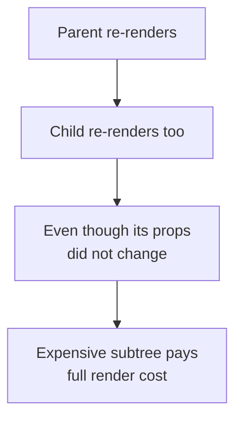
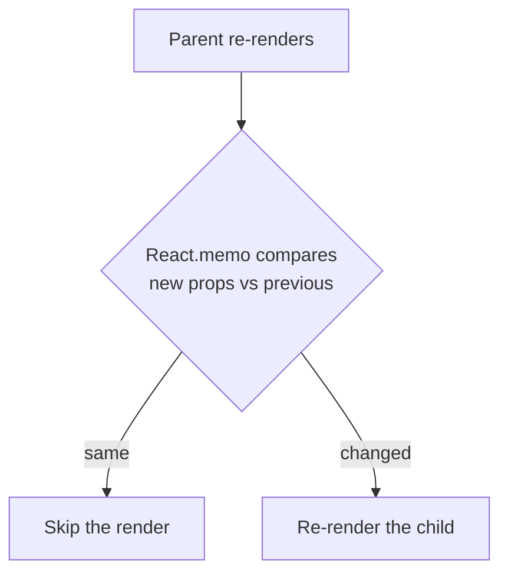
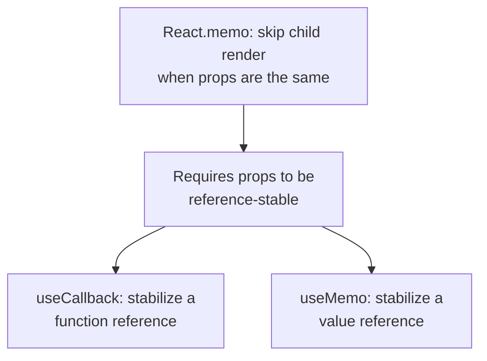
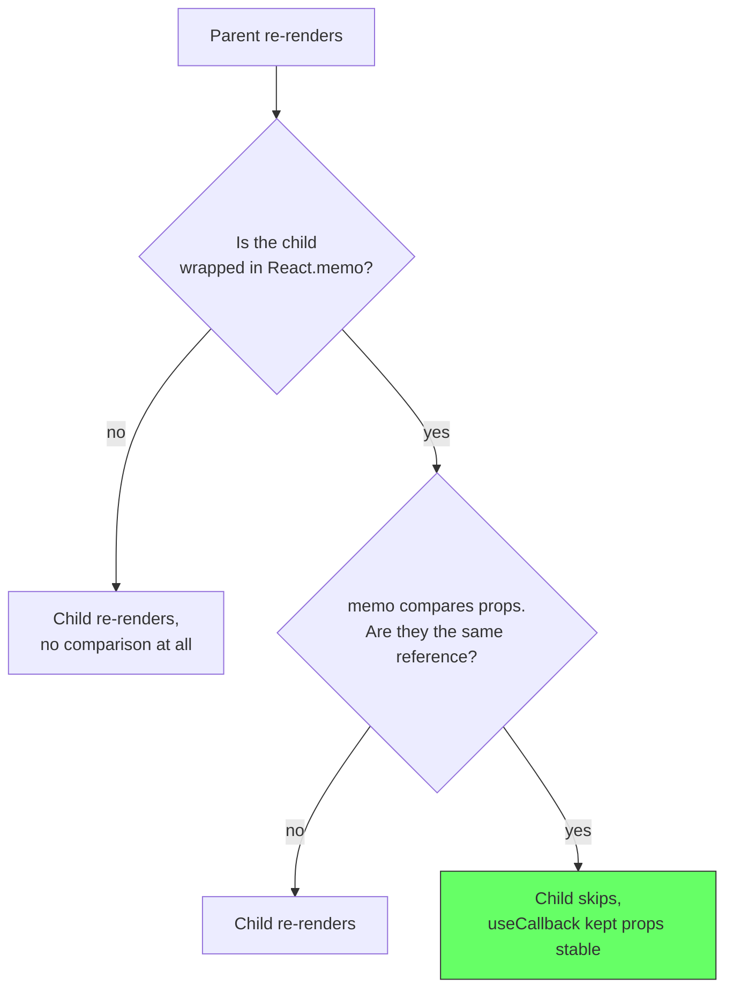
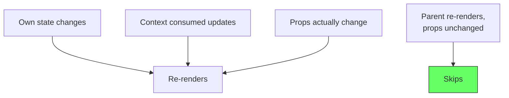
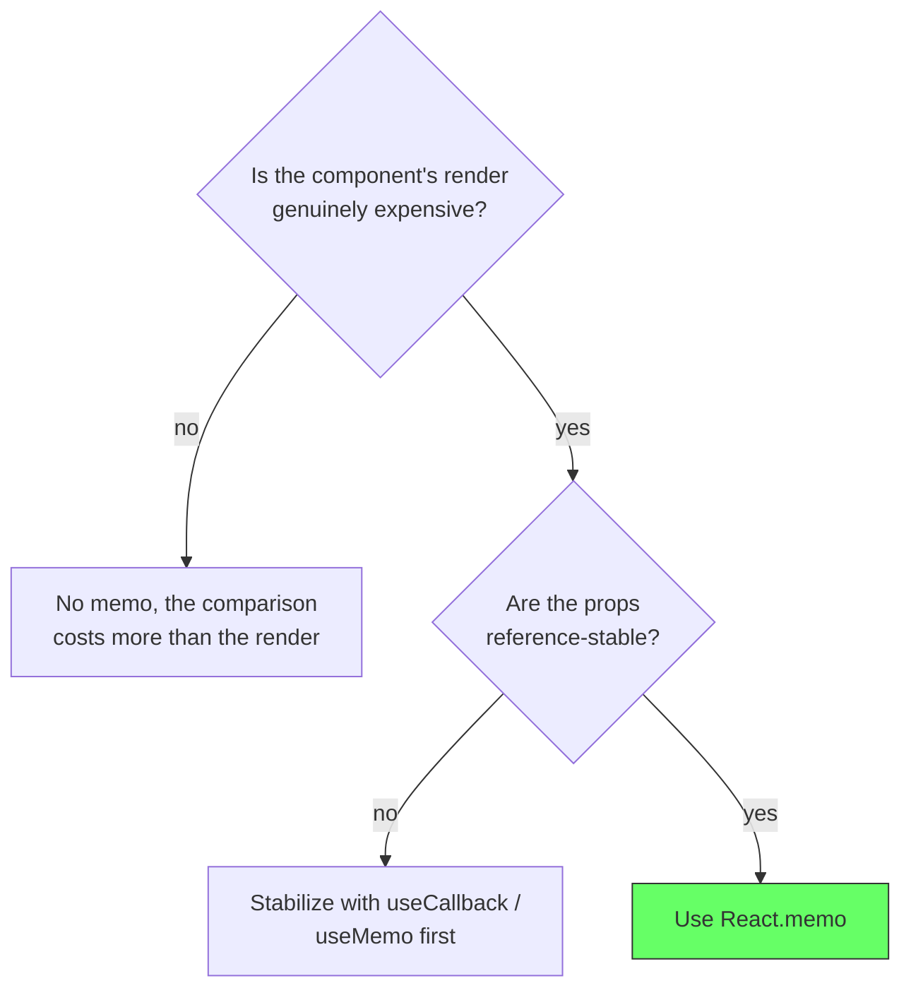

# React: React.memo

## The problem: children re-render even when nothing changed

In React, a component re-render cascades by default. When a parent re-renders, every child re-renders too, whether its props changed or not. For most apps this is the right default: props comparison costs something, and most renders are cheap.

But a component with an expensive render, a big list, a chart, or a deep subtree pays the full cost every time its parent so much as ticks. The child did not change, yet it re-renders anyway.

```jsx
function Parent() {
  const [count, setCount] = useState(0);
  return (
    <div>
      <ExpensiveChart />  {/* re-renders every time count changes */}
      <button onClick={() => setCount(count + 1)}>Increment</button>
    </div>
  );
}
```

Every click on the button re-renders `Parent`, and `ExpensiveChart` re-renders along with it, even though nothing it needs changed.

**Render ≠ DOM update. Child's function runs again, but React diffs the returned JSX. If output is same, no DOM mutation. Still costs CPU for the function + diff.**

<div style={{display: 'flex', justifyContent: 'center'}}>



</div>

## The solution: opt out of default re-renders

`React.memo` wraps a component so React compares the new props with the previous ones before rendering. If they are the same, the child skips its render entirely.

```jsx
import {memo} from 'react';

const ExpensiveChart = memo(function ExpensiveChart() {
  return <svg>...</svg>;
});
```

Now `ExpensiveChart` re-renders only when its props actually change. Every parent re-render that leaves the props alone is skipped, and the expensive subtree stops paying for unrelated state updates.

The comparison is shallow `Object.is` per prop, as in `shallowEqual`. A prop that is a new array or a new inline function on every render counts as a change, and the memo is bypassed.

<div style={{display: 'flex', justifyContent: 'center'}}>



</div>

### Try it live - without vs with memo

Parent holds `count`. Both charts receive no props. Click `+1` and watch renders.

<div style={{display: 'flex', justifyContent: 'center', marginBottom: '12px'}}>
  <a href="https://stackblitz.com/github/labeebahmad201/knowledge-base/tree/main/demos/stackblitz-react-memo-basic" target="_blank" style={{padding: '8px 16px', background: '#1269ff', color: 'white', borderRadius: '6px', textDecoration: 'none', fontWeight: 600}}>Open in StackBlitz →</a>
</div>

<iframe
  src="https://stackblitz.com/github/labeebahmad201/knowledge-base/tree/main/demos/stackblitz-react-memo-basic?embed=1&file=src/App.tsx&view=preview&hideExplorer=1&ctl=1"
  style={{width: '100%', height: '520px', border: '1px solid var(--ifm-color-emphasis-300)', borderRadius: '8px'}}
  title="React.memo Basic Demo"
  loading="lazy"
  sandbox="allow-scripts allow-same-origin allow-popups allow-forms"
></iframe>

> Local: `cd demos/stackblitz-react-memo-basic && npm install && npm run dev`

## memo only helps when props are reference-stable

This is where `memo` connects to `useCallback` and `useMemo`. The comparison is by reference, so any prop that is recreated each render defeats the memo. A parent passing an inline function or inline object makes `React.memo` useless, because the props are always different.

```jsx
<Child onClick={() => handle()} />  {/* new reference every render, memo never skips */}
```

The fix is the companion hooks: `useCallback` to stabilize a function, `useMemo` to stabilize a value. `memo`, `useCallback`, and `useMemo` are one system. `memo` stops the child from re-rendering, and the two hooks keep the props stable so the memo actually hits.

<div style={{display: 'flex', justifyContent: 'center'}}>



</div>

### Try it live - stable vs inline props

Both children are `memo`. Left gets `onClick={() => {}}` and `{id}` inline, right gets `useCallback`/`useMemo`. Click **Parent tick** (`count` only) - right skips, left re-renders. Change `id` - both re-render.

<div style={{display: 'flex', justifyContent: 'center', marginBottom: '12px'}}>
  <a href="https://stackblitz.com/github/labeebahmad201/knowledge-base/tree/main/demos/stackblitz-react-memo-stable" target="_blank" style={{padding: '8px 16px', background: '#1269ff', color: 'white', borderRadius: '6px', textDecoration: 'none', fontWeight: 600}}>Open in StackBlitz →</a>
</div>

<iframe
  src="https://stackblitz.com/github/labeebahmad201/knowledge-base/tree/main/demos/stackblitz-react-memo-stable?embed=1&file=src/App.tsx&view=preview&hideExplorer=1&ctl=1"
  style={{width: '100%', height: '580px', border: '1px solid var(--ifm-color-emphasis-300)', borderRadius: '8px'}}
  title="React.memo Stable Props Demo"
  loading="lazy"
  sandbox="allow-scripts allow-same-origin allow-popups allow-forms"
></iframe>

> Local: `cd demos/stackblitz-react-memo-stable && npm install && npm run dev`

## The key fact: without memo, re-renders happen by default

The default React behavior is no comparison at all. When a parent re-renders, every child re-renders too, unconditionally. `React.memo` is what introduces the props comparison as an alternative to blind re-rendering, not `useCallback`.

That means `useCallback` alone does not prevent a child from re-rendering. If a child is not wrapped in `React.memo`, passing it a stable function changes nothing, the child still re-renders on every parent render because no comparison runs. `useCallback` only pays off when a receiver compares the reference, and the component-level receiver is `React.memo`.

<div style={{display: 'flex', justifyContent: 'center'}}>



</div>

The chain: default re-render cascade is what you are fighting, `React.memo` is what introduces the comparison, and `useCallback` is what makes that comparison pass. Missing any piece defeats the optimization.

## What memo does not block

`React.memo` only skips re-renders triggered by a parent. The component still re-renders when:

- its own state changes with `useState` or `useReducer`
- a context it consumes updates
- the props genuinely change

React's own documentation is explicit: `memo` prevents re-rendering caused by context or prop changes only when the memoized component itself is unaffected. It is a guard against cascading parent renders, not a universal freeze.

<div style={{display: 'flex', justifyContent: 'center'}}>



</div>

## When it hurts

`memo` is not free. Every render now runs a props comparison, and for a cheap component that is more overhead than the renders it skips. The React team's guidance is to reach for it only when a component renders frequently and is expensive enough that skipping is a real win.

The performance pitfall to watch: memoizing a component while passing it freshly created props. The memo never hits, the comparison runs anyway, and the app is slower than it would be without the memo. That is why the three tools travel together: `memo` without `useCallback` on the props is often worse than neither.

<div style={{display: 'flex', justifyContent: 'center'}}>



</div>

## The decision in one line

Use `React.memo` when a component re-renders often, is expensive to render, and its props stay reference-stable. Without reference-stable props, pair it with `useCallback` and `useMemo`, or the memo compares forever and skips nothing.

## References

- React Documentation. *memo*. https://react.dev/reference/react/memo. The definition, the `Object.is` comparison, and what renders it does and does not block.
- React Documentation. *useCallback*. https://react.dev/reference/react/useCallback. The companion hook that keeps function props stable so `memo` can hit.
- React Documentation. *useMemo*. https://react.dev/reference/react/useMemo. The companion hook that keeps value props stable.
- Knowledge base. *React: useMemo*. reactjs-use-memo.md. Caching computed values to stabilize references.
- Knowledge base. *React: useCallback*. reactjs-use-callback.md. Caching function references so memoized children skip renders.
