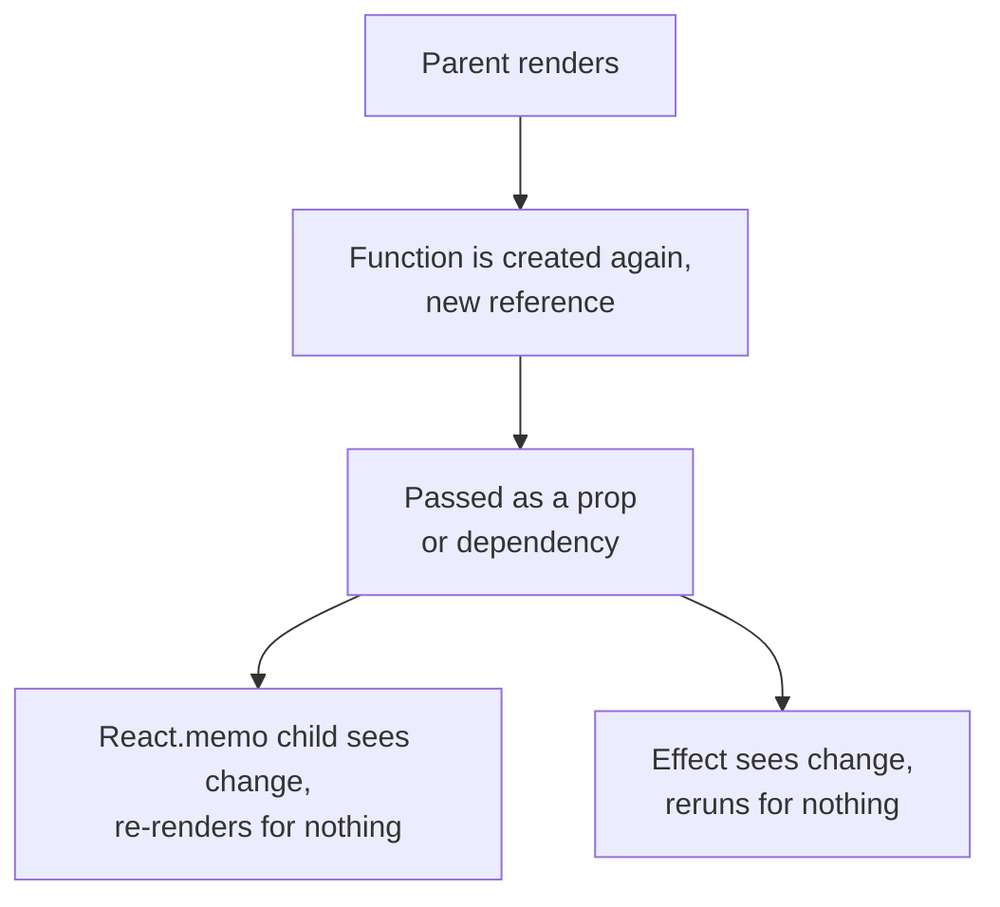
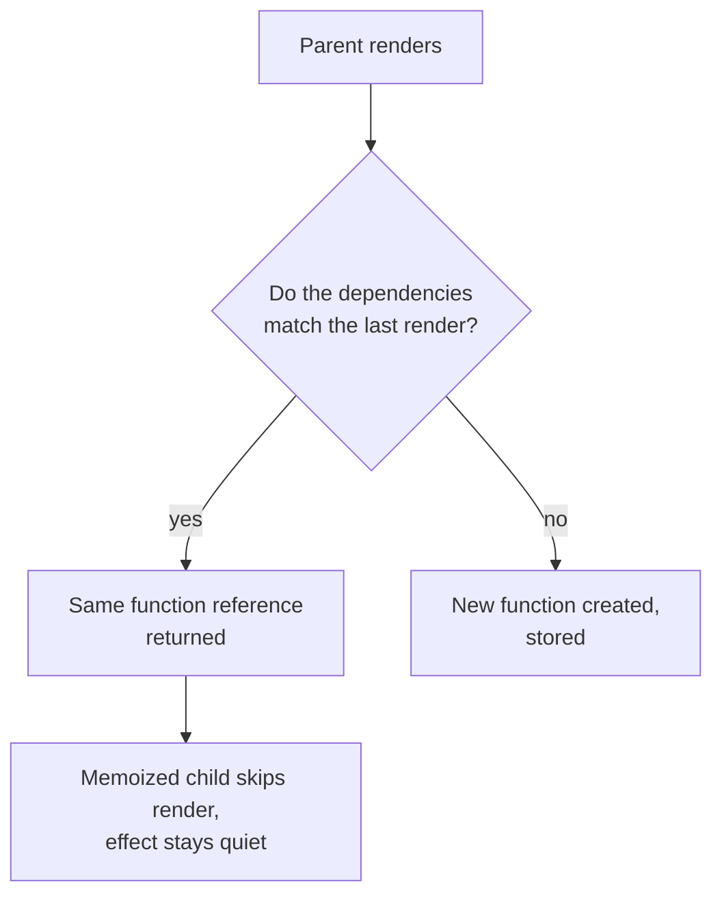
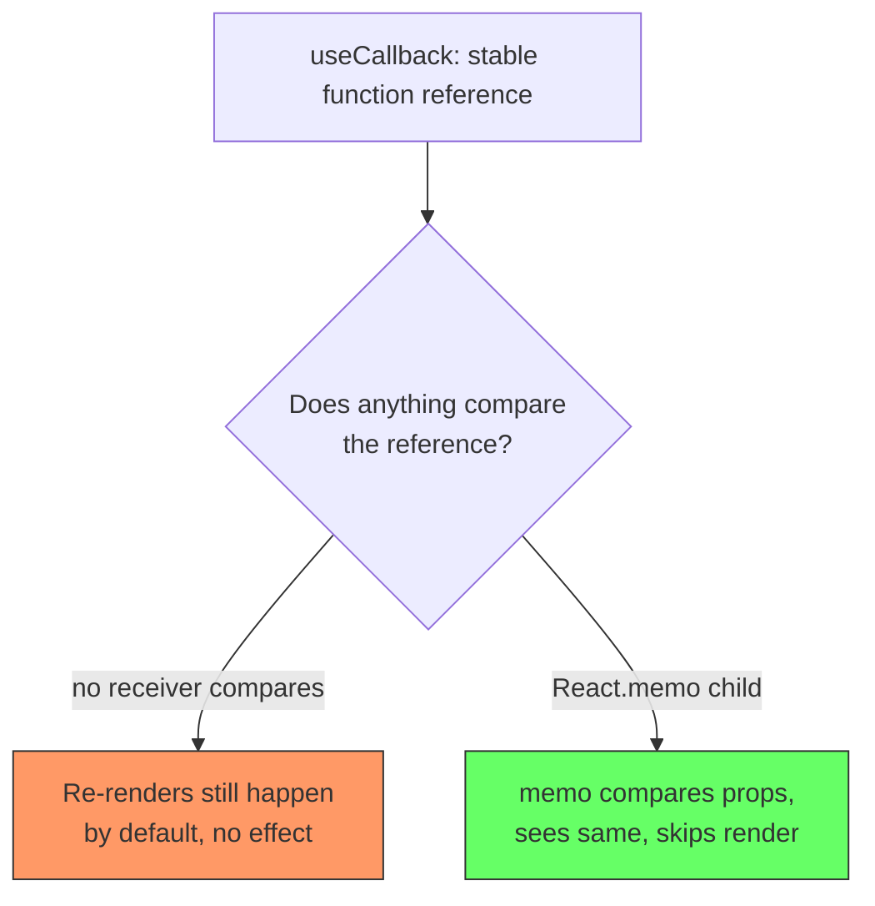
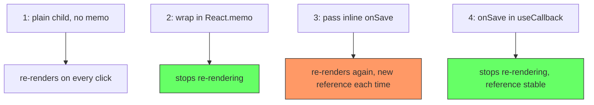
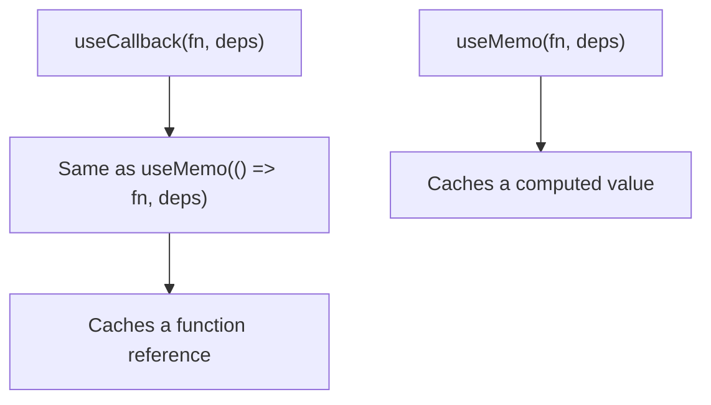
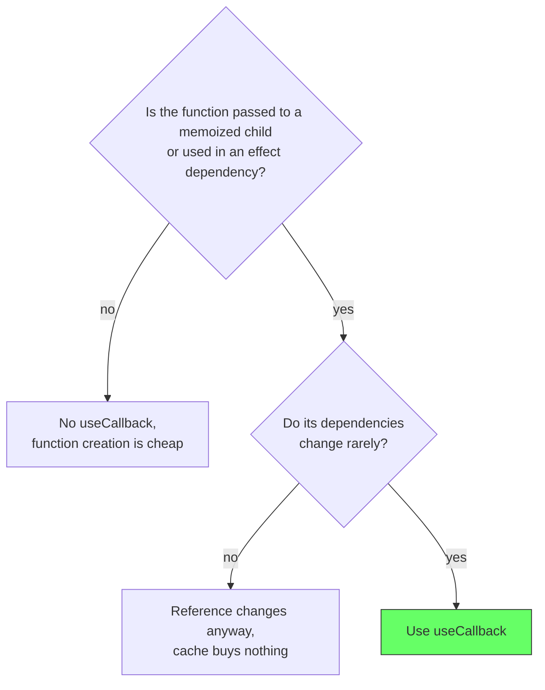

# React: useCallback

## The problem: functions change identity on every render

A function defined inside a component is recreated on every render. The code is identical, but the reference is new each time. This is invisible until the function is passed somewhere that cares about reference identity: as a prop to a memoized child, as a key, or as a dependency of an effect.

The React documentation is direct about the consequence: a function defined inside a component is a new function on every render. Any component or effect that receives it as a dependency sees a change, even when the behavior did not change at all.

```jsx
function Parent() {
  const handleSave = () => saveDraft();  // new reference every render
  return <Child onSave={handleSave} />;
}
```

Every time `Parent` renders, `handleSave` is a fresh reference. If `Child` is wrapped in `React.memo`, it compares the `onSave` prop with the previous render, sees a different function, and re-renders. The memo is defeated, and the child renders on every parent render.

<div style={{display: 'flex', justifyContent: 'center'}}>



</div>

## The solution: keep the reference stable until a dependency changes

`useCallback` returns the same function reference until one of its dependencies changes. When the dependencies stay the same, the memoized child skips its render and the effect does not rerun.

```jsx
import {useCallback} from 'react';

function Parent({saveDraft}) {
  const handleSave = useCallback(() => saveDraft(), [saveDraft]);
  return <Child onSave={handleSave} />;
}
```

Now `handleSave` keeps the same identity as long as `saveDraft` does. The memoized child renders only when its other props change, and any effect depending on `handleSave` stays quiet.

The React docs describe `useCallback` precisely: it returns a memoized callback, so the function is not recreated on every render. Combined with `React.memo`, this is the standard tool for avoiding child re-renders.

<div style={{display: 'flex', justifyContent: 'center'}}>



</div>

## The key fact: useCallback alone does not prevent re-renders

`useCallback` stabilizes a function's identity, but it does not stop anything from rendering on its own. Re-renders happen by default: when a parent renders, every child renders too, with no comparison. `useCallback` does not introduce a comparison. It only makes sure that, when a receiver does compare, the reference looks unchanged.

The skip only happens at a receiver that opts into comparison. For a child component that receiver is `React.memo`, which compares props against the previous render. Without `React.memo` on the child, passing a stable function changes nothing, the child still re-renders on every parent render. `useCallback` and `React.memo` are a pair: the memo does the comparison, and the callback keeps the prop stable so the comparison says "same".

<div style={{display: 'flex', justifyContent: 'center'}}>



</div>

The chain matters: default re-render cascade is what you are fighting, `React.memo` is what introduces the comparison, and `useCallback` is what makes that comparison pass. Missing any piece defeats the optimization.

## A worked example: build it up one step at a time

The clearest way to see the chain is to add one piece at a time and watch the child's render log. This exact example runs in the browser:

- **Step 1, plain child**: the child re-renders on every click. No comparison exists.
- **Step 2, wrap in `React.memo`**: the child stops re-rendering, because it has no props to compare and they never change.
- **Step 3, pass an inline `onSave`**: the child re-renders again. The inline function is a new reference on every render, so `memo` sees a changed prop.
- **Step 4, wrap `onSave` in `useCallback`**: the child stops re-rendering, because the reference is now stable and `memo` sees no change.

```jsx
import React, {memo, useState, useCallback} from 'react';

const ChildMemoized = memo(function Child({onSave}) {
  console.log('rendered');
  return (
    <div>
      <h1>Child</h1>
    </div>
  );
});

export default function App() {
  const [counter, setCounter] = useState(0);

  const increment = () => {
    setCounter((prev) => prev + 1);
  };

  const onSave = useCallback(() => {}, []);

  return (
    <div>
      <h1>Hello StackBlitz!</h1>
      {counter}
      <br />
      <button onClick={increment}>incr</button>
      <p>Start editing to see some magic happen :)</p>
      <ChildMemoized onSave={onSave} />
    </div>
  );
}
```

Step 3 is the one that surprises people. Adding a prop to a memoized child can make it *worse* than having no memo at all, because now the memo compares a prop that changes every render and always decides to render. The function is not expensive to create, but its changing reference defeats the skip. `useCallback` fixes exactly that: it stops the prop from changing, so the memo finally has something stable to compare.

Try it live: https://stackblitz.com/edit/react-vmcfaybb

<div style={{display: 'flex', justifyContent: 'center'}}>



</div>

## useCallback and useMemo are the same idea

`useCallback(fn, deps)` is equivalent to `useMemo(() => fn, deps)`. One caches a function value, the other caches a computed value. The rule for when it earns its place is the same: the reference has to actually be expensive to change.

The React docs are blunt about the wrong reason to use it: do not wrap a function in `useCallback` purely to avoid re-creating it. Creating a function is cheap. The cost is in the downstream effect, a memoized child that should not re-render, or a heavy effect that reruns.

<div style={{display: 'flex', justifyContent: 'center'}}>



</div>

## When it hurts

The same overuse trap as `useMemo` applies. React's own guidance on unnecessary effects warns against memoizing for its own sake: if nothing downstream reads the function identity, `useCallback` is pure overhead, one more dependency array to keep accurate and one more place for a stale reference to hide.

A common mistake is a stale dependency. A callback closed over an old value because the dependency array was left empty or incomplete. The function still works, but it reads stale state, and the bug is hard to spot because the code looks right.

The rule from the React docs: use `useCallback` when the function is passed to a memoized child, used in an effect dependency, or read by something else that should not restart on every render. Not just because the hook exists.

<div style={{display: 'flex', justifyContent: 'center'}}>



</div>

## The decision in one line

Use `useCallback` when a function reference is consumed as a dependency: by a memoized child, by an effect, or by a context consumer that should not restart. Skip it when the function is used inline and nothing tracks its identity. It caches a reference, exactly like `useMemo` caches a value, and it pays for itself only when that reference being stable actually saves work.

## References

- React Documentation. *useCallback*. https://react.dev/reference/react/useCallback. The definition of a memoized callback, the dependency contract, and the equivalence to `useMemo`.
- React Documentation. *You Might Not Need an Effect*. https://react.dev/learn/you-might-not-need-an-effect. The guidance on not memoizing for its own sake and on correct dependency handling.
- React Documentation. *useMemo*. https://react.dev/reference/react/useMemo. The companion hook that caches a value instead of a function reference.
- Knowledge base. *React: useMemo*. reactjs-use-memo.md. The same problem/solution shape for caching computed values.
