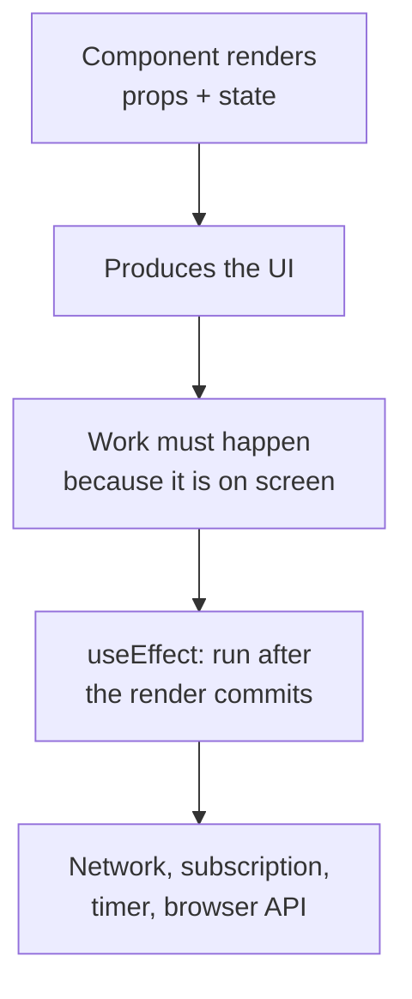
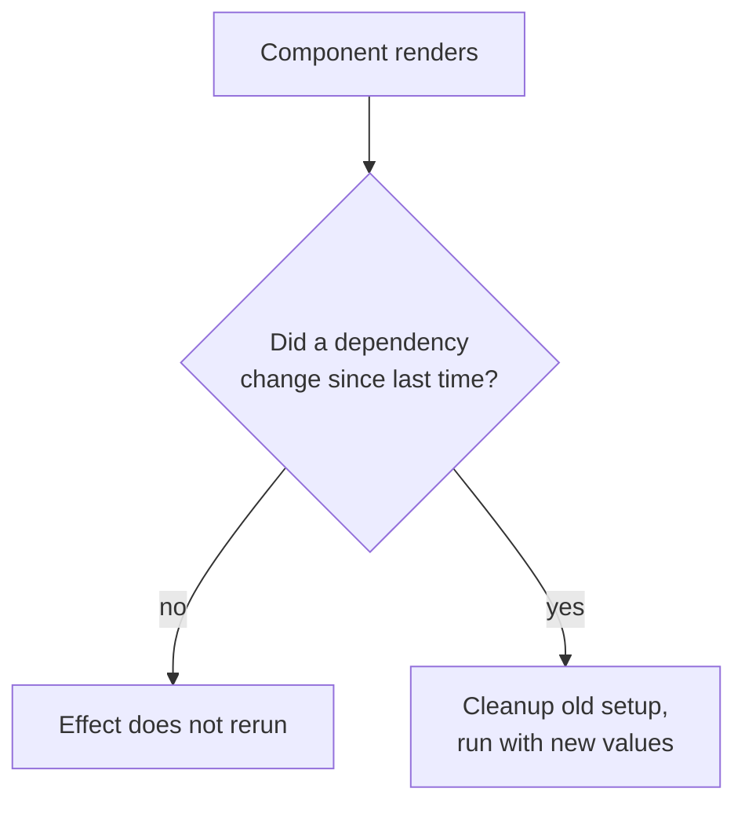
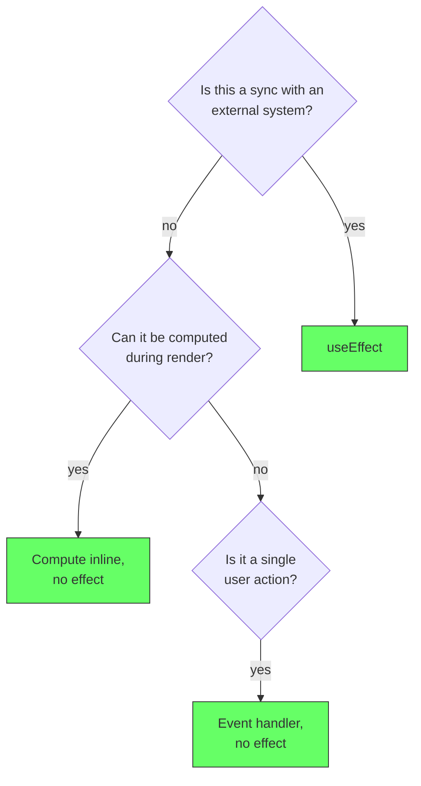

# React: useEffect

## The problem: components need to reach outside themselves

React components are built to render from props and state. But a component often needs to talk to the outside world: fetch data, subscribe to a channel, set up a timer, focus an input. That is a side effect, and it cannot live inside the render body, because a render must stay pure. The same props and state must produce the same output, with no external talk.

**What a side effect is.** In software engineering, a side effect is any observable change that happens outside a function's own computation. A pure function only takes inputs and returns an output; nothing else observable happens. The moment a function writes to the world, it has a side effect: a network request, a database write, a file, a console log, mutating a global or a DOM element directly, setting a timer, or reading the current time. Side effects matter because they make output depend on the world around the code, which makes behavior order-dependent and harder to test and reason about. React requires render functions to be pure for exactly this reason: it may call them many times and discard the results, so any side effect in the render body would fire many times for nothing.

The React docs state the purpose directly: `useEffect` lets you synchronize a component with an external system.

```jsx
function ChatRoom({roomId}) {
  const [messages, setMessages] = useState([]);

  useEffect(() => {
    const connection = createConnection(roomId);
    connection.connect();
    return () => connection.disconnect();
  }, [roomId]);
}
```

The render decides what the UI looks like. The effect handles everything that must happen because the component is on screen.

<div style={{display: 'flex', justifyContent: 'center'}}>



</div>

## How it works

`useEffect(fn, dependencies)` runs the function after React commits the render, never during it, and never blocking the paint. The dependency array decides when it reruns: if the dependencies are unchanged, the effect does not rerun.

The function can return a cleanup. React runs it before the next effect run and before unmount, which is where the connection, subscription, or timer gets torn down.

```jsx
useEffect(() => {
  const timer = setInterval(() => poll(roomId), 5000);
  return () => clearInterval(timer);
}, [roomId]);
```

The effect resets the timer only when `roomId` changes. That is the sync contract: the effect matches the current value of its dependencies.

<div style={{display: 'flex', justifyContent: 'center'}}>



</div>

## The common mistake: using it for what React already handles

Most effects are unnecessary. The React docs warn about two cases:

- **Derived state**: computing a value from props or state. Compute it inline, not through an effect, which causes an extra render.
- **Event handlers**: responding to a single user action. That belongs in the handler, not in an effect that reruns whenever dependencies change.

```jsx
// Wrong: derived state pushed through an effect
useEffect(() => {
  setFilteredItems(items.filter(...));
}, [items]);

// Right: compute during render
const filteredItems = items.filter(...);
```

<div style={{display: 'flex', justifyContent: 'center'}}>



</div>

## The decision in one line

Use `useEffect` when a component must synchronize with something outside React: a server, a channel, a timer, or the browser. Skip it when the value can be computed during render or the work is a single user action.

## References

- React Documentation. *useEffect*. https://react.dev/reference/react/useEffect. The definition, the dependency contract, and the cleanup function.
- React Documentation. *You Might Not Need an Effect*. https://react.dev/learn/you-might-not-need-an-effect. The guidance on derived state, event handlers, and unnecessary effects.
- React Documentation. *Synchronizing with Effects*. https://react.dev/learn/synchronizing-with-effects. Effects as synchronization with external systems.
