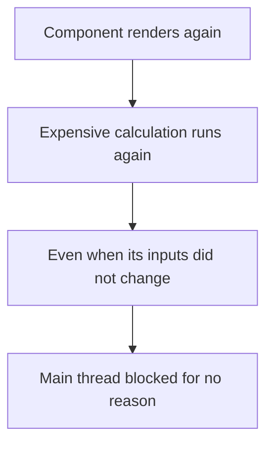
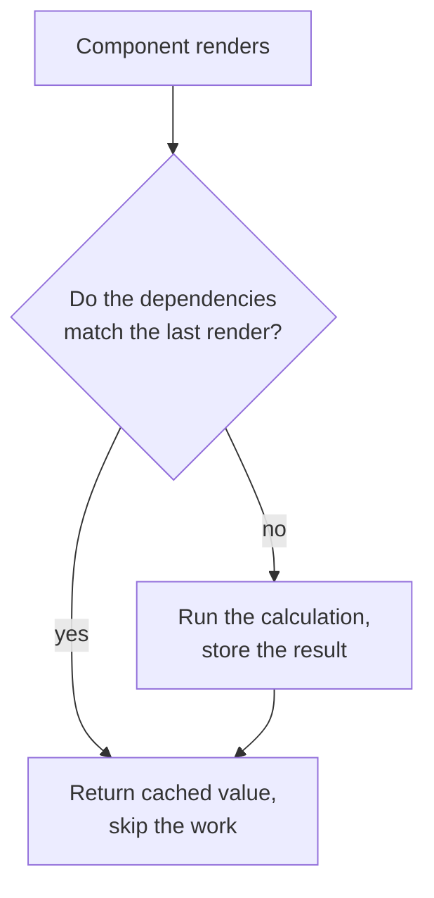
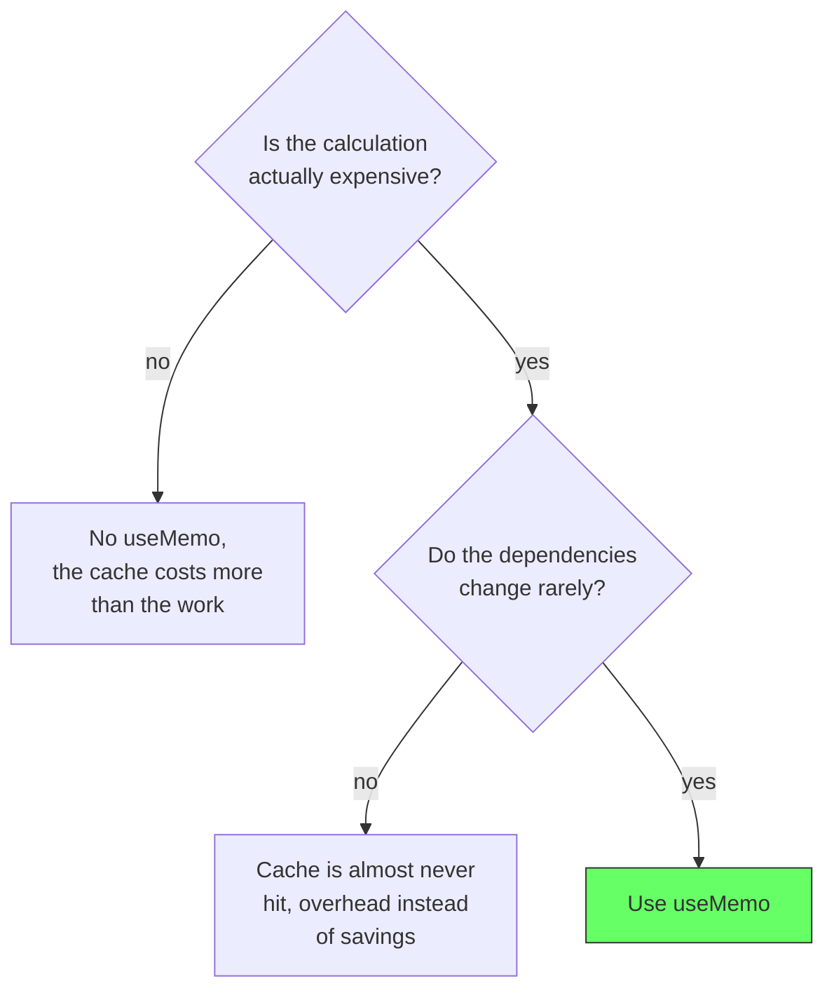

# React: useMemo

## The problem: work repeats on every render

A component function runs on every render, not just the first one. So does every expensive calculation inside it. If a component does heavy work, filtering a large list or formatting a big dataset, that work reruns on each render, even when nothing relevant changed.

The React documentation names the cost directly: if a value takes a long time to compute, the function runs it on every single render, and the cost is paid even when the inputs that feed the calculation did not change.

```jsx
function Dashboard({items}) {
  const total = items.reduce((sum, item) => sum + item.price, 0);
  return <h2>Total: {total}</h2>;
}
```

Every re-render, whether caused by a prop change, a state update, or a parent re-render, recomputes the total. For a small list that is invisible. For a list of thousands of rows with more work per item, it is wasted time on the main thread.

<div style={{display: 'flex', justifyContent: 'center'}}>



</div>

## The solution: cache the result, recompute only on change

`useMemo` caches the result of a calculation and only recomputes it when one of the values it depends on changes. The dependencies are passed as an array. When React sees the same dependency values on the next render, it skips the work and returns the cached value.

```jsx
import {useMemo} from 'react';

function Dashboard({items}) {
  const total = useMemo(
    () => items.reduce((sum, item) => sum + item.price, 0),
    [items],
  );
  return <h2>Total: {total}</h2>;
}
```

Now the reduce runs only when `items` changes. Every other render returns the stored total, and the main thread stays free.

The React docs are explicit that `useMemo` is a performance optimization, not a correctness guarantee: React may discard the cache at any time, for example during the initial mount or to free memory, so the calculation must still work correctly when it runs.

<div style={{display: 'flex', justifyContent: 'center'}}>



</div>

## Where it earns its place

`useMemo` is worth it when two things are true at once: the work is genuinely expensive, and the dependency changes rarely. The React docs give the concrete signal: count how often a value is recomputed and how often its dependencies change. If a calculation always runs the same way and its inputs almost never change, caching it is a clear win. If the inputs change on nearly every render, the cache is hit almost never and buys nothing but overhead.

The docs also warn against using it purely to avoid re-rendering a child component. Restructuring a component to wrap it in JSX is more reliable than memoizing a value and hoping a child skips its render. Memoizing one value does not automatically make every child that reads it skip work.

A second, cheaper use is stabilizing a value that is passed into a dependency array. An array or object created inside a render is a new reference every time, so an effect depending on it would rerun on every render. Memoizing the reference keeps the identity stable:

```jsx
const config = useMemo(() => ({format: 'long', locale}), [locale]);

useEffect(() => {
  fetch('/report', {body: JSON.stringify(config)});
}, [config]);
```

## When it hurts

The tool is overused. React's own guide on removing unnecessary effects is blunt: do not memoize values that are cheap to compute, and do not memoize to patch over a child that re-renders too often. `useMemo` has its own cost: the extra bookkeeping per render and the mental load of keeping the dependency array accurate. A stale dependency array produces a bug that is hard to see, because the code looks correct and the cache simply returns an outdated value.

The rule of thumb from the React documentation: use `useMemo` when the calculation is expensive and the dependencies change rarely, not because it is available.

<div style={{display: 'flex', justifyContent: 'center'}}>



</div>

## The decision in one line

Cache a calculation with `useMemo` when it is expensive and its inputs change rarely. Skip it when the work is cheap or the inputs change constantly. And remember the React docs' warning: this is a performance optimization, so treat any cached value as disposable and write the calculation so it still works when React recomputes it.

## References

- React Documentation. *useMemo*. https://react.dev/reference/react/useMemo. The definition, the dependency contract, and the warning that the cache may be discarded at any time.
- React Documentation. *You Might Not Need an Effect*. https://react.dev/learn/you-might-not-need-an-effect. The guidance on not memoizing cheap values and not memoizing to fix re-renders, plus the signal of counting recomputes versus dependency changes.
