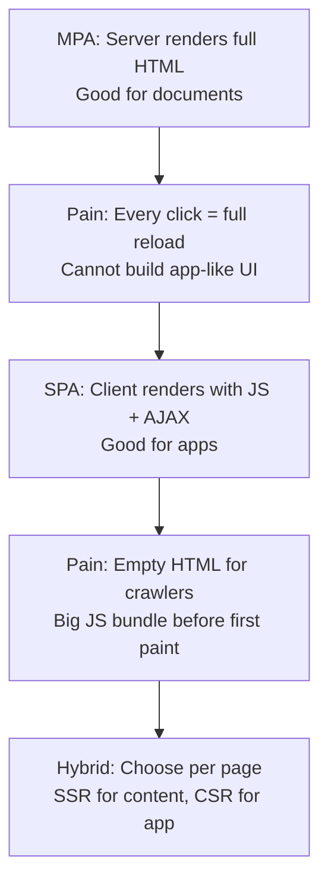
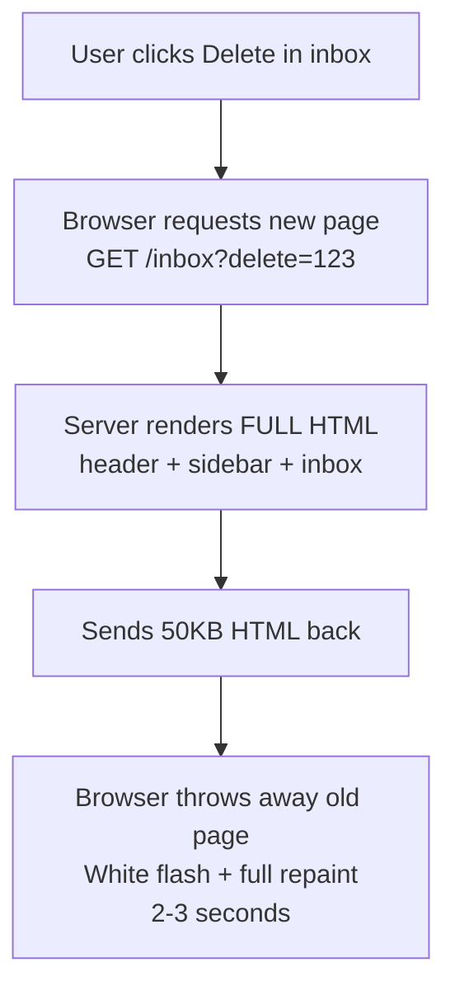
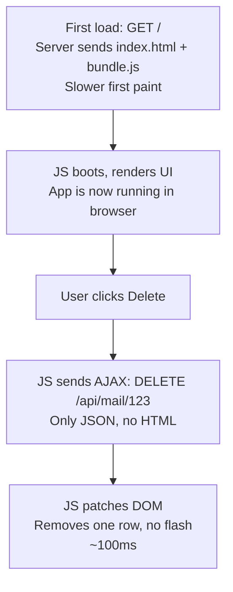
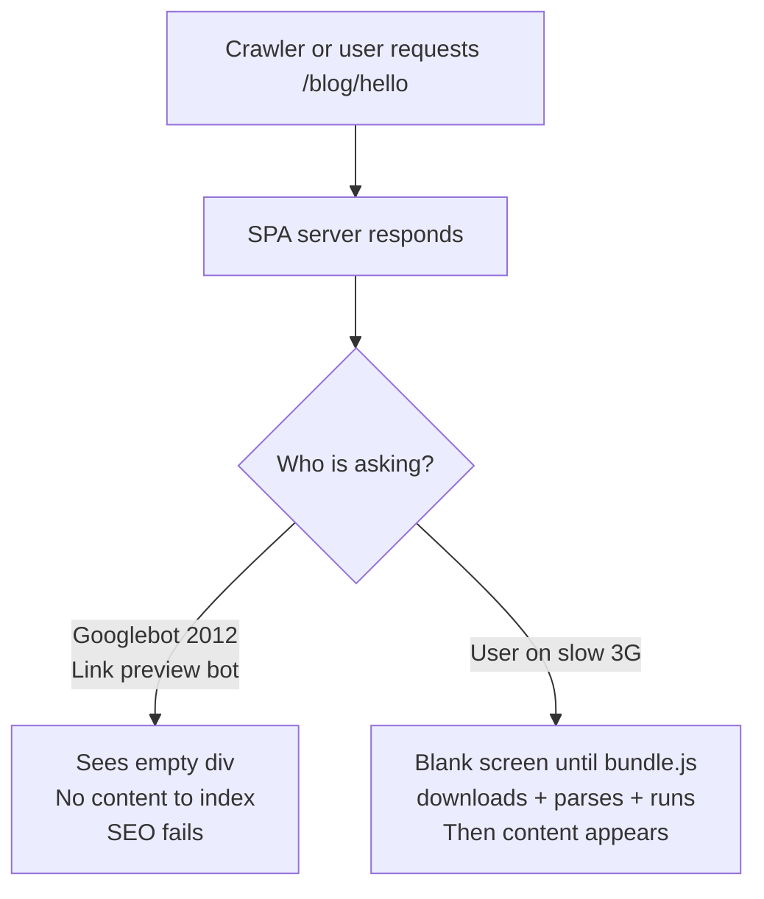
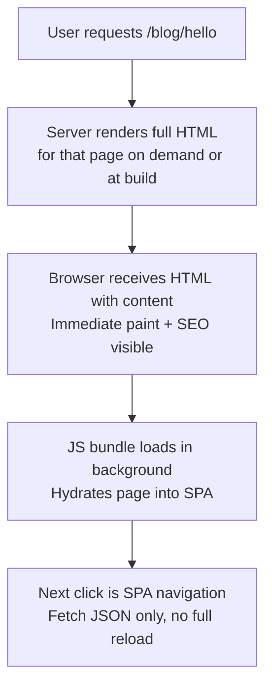
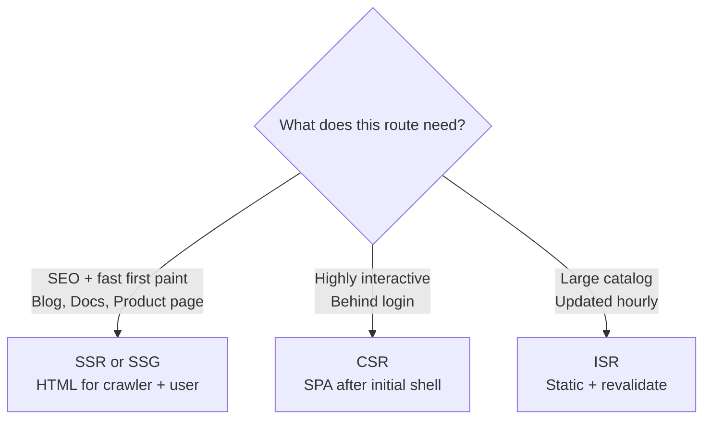
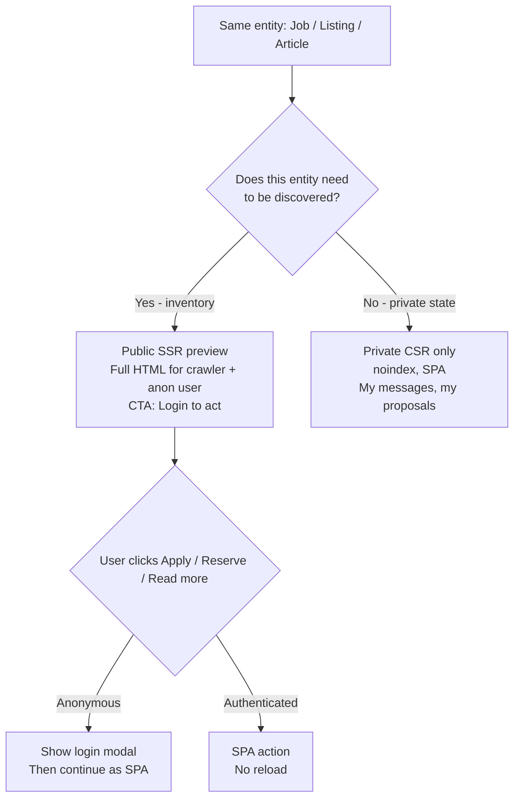
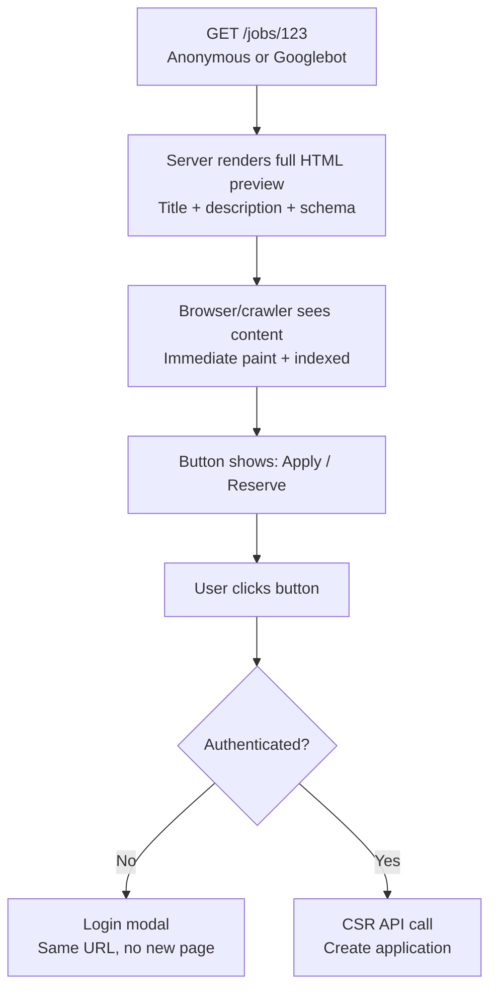

# From MPA to SPA to Hybrid: Why the Web Keeps Switching How It Renders

The web did not switch from MPA to SPA because SPA is better. It switched because MPA was too slow for interactions, then switched again because SPA broke SEO. Every rendering model is a response to the pain of the previous one.

If you remember the pain, you will remember when to use each model.

## The core idea in one line

MPA is fast for the first paint and great for SEO but slow for interactions. SPA is snappy for interactions but slow for the first paint and bad for SEO. Modern frameworks let you choose per page.

<div style={{display: 'flex', justifyContent: 'center'}}>



</div>

## 1. The problem: MPA was too slow for interactions

In the early web, every page was a Multi-Page Application by default. The server rendered a complete HTML document for every URL. PHP, JSP, ASP, Rails all worked the same way: browser asks for `/inbox`, server builds `inbox.html` with header, sidebar, footer, and list, and sends it back. Clicking anything meant throwing away the whole page and asking for a new one.

This was fine when the web was documents. It broke when the web tried to be software.

Think of Hotmail or Yahoo Mail in 2003. To delete one email you clicked Delete, the browser showed a white flash, waited 2 to 3 seconds on DSL, and re-rendered the entire inbox again. To open an email, another full reload. To go back, another reload. The server re-sent the same header and sidebar every time even though only the email list changed.

Building a desktop-like experience was impossible. Desktop apps like Outlook did not reload the whole window to delete a row.

<div style={{display: 'flex', justifyContent: 'center'}}>



</div>

The deeper pain was coupling. Frontend and backend were the same codebase. You could not reuse that server-rendered page for a mobile app. And the server did all the rendering work for every user on every click.

## 2. The solution: AJAX made it possible to load only parts

The technology to fix this already existed. Microsoft had created `XMLHttpRequest` in 1999 for Outlook Web Access so it could fetch mail without reloading. It was largely ignored for five years.

In 2004 Gmail launched and in 2005 Google Maps launched. Both used `XMLHttpRequest` heavily to fetch JSON in the background and patch the DOM. Jesse James Garrett coined the term AJAX in his essay in February 2005 and used Gmail and Maps as the two proof points. Steve Yen coined Single Page Application around the same time to describe this architecture.

AJAX let the browser ask for data, not pages. The first request still loads `index.html` plus a JavaScript bundle. After that, JavaScript takes over. Navigation does not ask for HTML. It asks for JSON and re-renders only the part that changed. The URL still changes via the History API so back and forward work, but there is no full reload.

<div style={{display: 'flex', justifyContent: 'center'}}>



</div>

**Example: Gmail vs Hotmail.**

*   Hotmail 2003 (MPA): Delete email = `GET /inbox` = full 50KB HTML + white flash.
*   Gmail 2004 (SPA): Delete email = `DELETE /api/emails/123` = 200 bytes JSON + row disappears instantly. Drafts auto-save every few seconds in the background with no reload at all. Search filters the list as you type.

SPA solved three problems at once: snappy interactions with no reloads, less wasted bandwidth because only data moves, and clean decoupling because the backend becomes a reusable JSON API for web and mobile.

**When this solution fits:** Dashboards, SaaS products, admin panels, social feeds, any stateful UI behind a login where fluidity matters more than SEO.

## 3. The new problem: SPA broke SEO and the first paint

Running everything in the browser created a new set of pains.

**Pain 1: SEO.** A classic SPA sends an almost empty HTML shell:

```html
<div id="root"></div>
<script src="bundle.js"></script>
```

A crawler that does not execute JavaScript sees nothing. In 2010 to 2015 Googlebot was inconsistent at rendering JavaScript, and other crawlers and social link previews still do not. Content was invisible.

**Pain 2: Slow first paint.** The browser must download, parse, and execute a large bundle before the user sees anything. On a slow phone this is a blank white screen for seconds. MPA had painted HTML immediately.

**Pain 3: Browser burden.** All rendering and templating moved from a powerful server to the user's device. Low-end phones suffered.

<div style={{display: 'flex', justifyContent: 'center'}}>



</div>

The practical answer for years was to split: use MPA for content where SEO matters (marketing site, docs, blog, e-commerce product pages) and use SPA for the app where interaction matters (the actual product behind login). Many companies ran WordPress for marketing and React SPA for the app for this exact reason.

## 4. The hybrid solution: Render each page the way that page needs

The modern answer is to stop choosing one model for the whole site and choose per page. Next.js, Nuxt, Remix, and Astro popularized this.

The same codebase can serve some pages as server-rendered and some as client-rendered:

*   **SSR (Server-Side Rendering):** Server renders full HTML on every request, then JS hydrates it into an SPA. Good for SEO and personalized content. Example: `/product/[id]` where price and stock change often.
*   **SSG (Static Site Generation):** Server renders HTML once at build time. Good for content that rarely changes. Example: `/blog/*` and `/docs/*`. Served from a CDN, extremely fast.
*   **CSR (Client-Side Rendering):** Classic SPA behavior. Good for highly interactive private UI. Example: `/dashboard`, `/editor`.
*   **ISR (Incremental Static Regeneration):** Hybrid. Statically generated but revalidated in the background after N seconds. Good for large catalogs where rebuilding everything is slow.

Hydration is the key trick. The server sends ready HTML so the user and crawler see content immediately, then the same JavaScript bundle is loaded and takes over so the next navigation is SPA-fast with no reload.

<div style={{display: 'flex', justifyContent: 'center'}}>



</div>

**Example with Next.js App Router:**

```tsx
// app/blog/[slug]/page.tsx - Server rendered, great for SEO
// This runs on the server, fetches data, renders HTML
export default async function BlogPost({params}) {
  const post = await db.getPost(params.slug);
  return <article><h1>{post.title}</h1><p>{post.body}</p></article>;
}

// app/dashboard/page.tsx - Client rendered, great for interactivity
'use client';
export default function Dashboard() {
  const [data, setData] = useState(null);
  useEffect(() => {
    fetch('/api/stats').then(r => r.json()).then(setData);
  }, []);
  return <Charts data={data} />;
}
```

Both pages live in the same app. No separate MPA and SPA codebases. The framework decides the rendering strategy per route.

<div style={{display: 'flex', justifyContent: 'center'}}>



</div>

## 5. How to decide: A simple checklist

Do not ask Is SPA better than MPA. Ask What does this page need.

| If the page needs... | Use... | Why |
| --- | --- | --- |
| SEO, link previews, fast first paint, works without JS | SSR or SSG (MPA-like) | HTML is ready for crawlers and users immediately |
| App-like fluidity, no reloads, real-time updates, complex state | CSR (SPA) | Patch DOM with JSON, keep state in browser |
| Both (most product sites) | Hybrid per route | Blog/docs as SSG/SSR, dashboard/editor as CSR |
| Content that is static but large (10k product pages) | ISR | Build once, update in background, CDN cache |

A useful rule of thumb: if the user arrived from Google, that page probably wants SSR or SSG. If the user is already inside your app clicking around, that interaction wants CSR.

## 6. The hidden case: SEO for content that looks like it is behind login

Most tutorials stop at Blog = SSR and Dashboard = SPA. Real marketplaces live in between. The same entity has two faces: as inventory it must be found on Google, as a transaction it must be gated behind login.

A common misconception is Upwork jobs are behind login so they cannot be SEO friendly. That mixes up view and action.

**The problem:** If you gate the view, crawler sees nothing and you get no traffic. If you make everything public, you lose spam protection, quality control, and conversion to sign up.

**The solution most large sites use:** Gate the action, not the view. Render a public SSR preview of the entity for anonymous users and crawlers, and require login only when the user tries to act. The URL is the same for both. This is not cloaking because Google and the user see the same preview.

<div style={{display: 'flex', justifyContent: 'center'}}>



</div>

<div style={{display: 'flex', justifyContent: 'center'}}>



</div>

This is why the same site uses SSR for one route and CSR for another on the same URL. Next.js handles this with middleware: anonymous gets SSR HTML, authenticated hydrates to SPA and enables the action.

### Verified examples live in production

All of these render full HTML without login for the view, and gate the action behind login. Checked without authentication:

**LinkedIn Jobs** - Public preview with SSR, action gated. The detail page `https://www.linkedin.com/jobs/view/4384671812` returns server-rendered HTML even as a guest, including `<title>The Home Depot hiring Cashier in Syosset, NY | LinkedIn</title>`, `<meta name="description" content="Posted 5:30:39 PM. 78092BRJob Description...">`, `<meta property="og:title">`, and `<link rel="canonical" href="https://www.linkedin.com/jobs/view/cashier-at-the-home-depot-4384671812">`. The list at `https://www.linkedin.com/jobs/search` renders 50+ jobs as plain anchor tags without JS. The Apply button is a `sign-up-modal__outlet` that opens `Join or sign in to find your next job` instead of posting an application. Browse: https://www.linkedin.com/jobs/search

**Airbnb** - Listing public for SEO, booking gated. Search at `https://www.airbnb.com/s/homes` and any listing at `https://www.airbnb.com/rooms/*` are SSR rendered so price, photos, and description are in the initial HTML and in the sitemap. The `Reserve` and `Contact host` actions require login and then run as CSR. Even the search page sends SSR HTML and only the map and filters need JS. Browse: https://www.airbnb.com/s/homes

**Upwork** - Job indexed, apply gated. All jobs at `https://www.upwork.com/freelance-jobs/` have a public SSR page with title, description, skills, and structured data, and appear in `https://www.upwork.com/sitemap.xml`. Opening a job in incognito shows the full description, the `Apply Now` button then triggers a login modal. The feed blocks bot fetches with 403, but the browser view is SSR for anonymous users. Browse: https://www.upwork.com/freelance-jobs/

**Medium** - Preview indexed, full read gated. Search at `https://medium.com/search?q=react` is SSR. Paywalled articles at `https://medium.com/@user/story` render the title and first paragraph plus paywall structured data with `isAccessibleForFree: false` and `hasPart` so Google indexes the preview, while the rest shows a login or subscribe prompt. Browse: https://medium.com/search?q=react

**Notion** - Private by default, public when shared. A Notion page is CSR and `noindex` inside the workspace. When the author clicks Share to web at `https://www.notion.so/help/public-pages-and-sharing`, Notion creates a distinct public SSR URL at `https://www.notion.site/*` that is indexable, while `Duplicate` or `Edit` still require login. Docs: https://www.notion.so/help/public-pages-and-sharing

| Site | Public URL (SSR for SEO) | Gated Action (CSR behind login) |
| --- | --- | --- |
| LinkedIn Jobs | `linkedin.com/jobs/view/*` full description indexed | Apply requires login modal |
| Airbnb | `airbnb.com/rooms/*` listing indexed with photos and price | Reserve and Contact host require login |
| Upwork | `upwork.com/freelance-jobs/*` job indexed with sitemap | Apply Now requires login |
| Medium | `medium.com/@user/story` preview indexed with paywall schema | Read more requires login or subscribe |
| Notion | `notion.site/*` public share indexed | Duplicate or Edit requires login |

If the view itself must stay fully private even for preview, the correct SEO move is not to fake it with cloaking. Add `noindex` and keep it CSR. Showing Google different HTML than the user is against Google Search Central guidelines for cloaking and will get penalized.

### When to use this pattern

Ask Does this entity need to be discovered? not Is this page behind login? If yes, create a public SSR preview URL even if the action is gated. If no, keep it pure SPA with `noindex`.

## 7. The easy way to remember

Think of the web as two jobs that kept trading the work:

1.  **MPA did the job of documents.** Server did all the work, browser just showed pages. Too slow when documents tried to be apps.
2.  **SPA did the job of apps.** Browser did all the work, server just sent data. Too slow to start and invisible to search.
3.  **Hybrid does both.** Server does the first paint for content, browser does the next paints for interactions. Pick the job per page.
4.  **Gated inventory does both on the same URL.** View is SSR for discovery, action is CSR behind login.

The one-line evolution: `Full reload for every click (MPA) -> No reload for any click (SPA) -> Reload only when it helps SEO or performance (Hybrid) -> Same URL, SSR for view and CSR for action (Gated preview).`

If you remember the pain each step solved, you will never need to memorize the table.

## References

*   Jesse James Garrett. *Ajax: A New Approach to Web Applications*. Adaptive Path, February 18, 2005. The essay that coined AJAX and used Gmail and Google Maps as the defining examples.
*   Paul Buchheit and Gmail team. *Gmail announcement and early technical overview*. Google, April 2004. The product that popularized background fetching with XMLHttpRequest for a desktop-like mail experience.
*   Microsoft Documentation. *XMLHttpRequest origins in Outlook Web Access*. 1999. The first browser implementation of background HTTP from JavaScript.
*   MDN Web Docs. *Client-side rendering vs Server-side rendering*. https://developer.mozilla.org/en-US/docs/Glossary/CSR and https://developer.mozilla.org/en-US/docs/Glossary/SSR.
*   Next.js Documentation. *Rendering: Server Components, Client Components, SSR, SSG, ISR*. https://nextjs.org/docs/app/building-your-application/rendering. How modern frameworks let you choose rendering per route.
*   Google Search Central. *Understand JavaScript SEO basics*. https://developers.google.com/search/docs/crawling-indexing/javascript/javascript-seo-basics. Why empty shell SPAs fail for crawlers and how SSR and hydration fix indexing.
