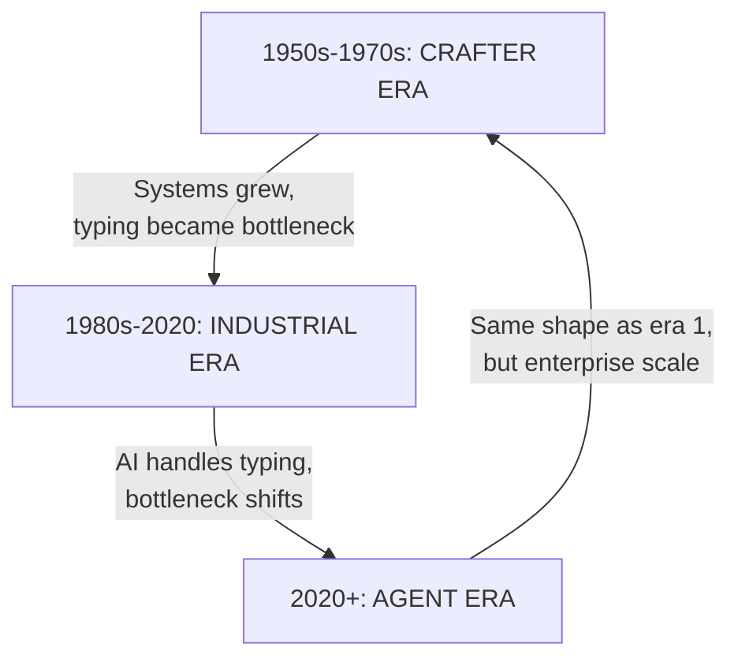

# The architect could always code - he just ran out of day

There is a feeling among developers right now that something fundamental is breaking. That the ground is shifting under their feet. And the feeling is correct - but not for the reason most people think. The ground is not moving because AI replaced developers. It is moving because the bottleneck moved, and we have been here before.

The unease comes from a confusion between skill and role. Your skill (coding) is still valuable. Your role (implementing tickets) is not viable anymore. These are different things. The same confusion happened when Visual Basic programmers refused to move to .NET. Their VB skill was real. The market moved on.

This article traces three eras to show why the shape is returning to something we had before - and why that should be reassuring, not threatening.

## The cycle in one picture

The three eras are not a linear progression. They are a loop. And understanding the loop explains the unease.

## Era 1: The crafter - one person owned the system

In the 1950s through 1970s, there was no "Solution Architect" title. There was `Systems Analyst` and `Programmer` and sometimes `Systems Programmer`. The same person who designed the system also coded it.

### Margaret Hamilton and Apollo

Margaret Hamilton directed the Software Engineering Division at the MIT Instrumentation Laboratory. She led development of the onboard flight software for NASA's Apollo Guidance Computer. She designed AND coded the software that landed humans on the moon.

She coined the term "software engineering" to give software the same legitimacy as hardware engineering. In her own words:

> "I began to use the term 'software engineering' to distinguish it from hardware and other kinds of engineering, yet treat each type of engineering as part of the overall systems engineering process."

There was no separate architect telling her what to build. She was the architect. She was the implementer. She was the person on call when the alarms went off during Apollo 11 descent.

Her work on priority alarm displays saved the Apollo 11 landing. When the computer was overloaded with interrupts, her error detection and recovery software recognized the problem, eliminated lower priority tasks, and re-established critical ones. She had designed this recovery approach years before the mission. She was architect AND debugger AND the person responsible at 2am when it broke.

### The chief programmer team

In 1971, Harlan Mills at IBM proposed the `Chief Programmer Team` in IBM Federal Systems Division Report FSC71-5108. Fred Brooks described it in detail in *The Mythical Man-Month* (1975), pp.32-35.

The model was surgical: one chief who understands the system's intentions the best, supported by a co-pilot, toolsmith, language lawyer, and program clerk. The chief did the design AND the coding. Everyone else supported him.

This was not a theory. It was how things actually worked when systems were small enough for one mind to hold.

### Unix at Bell Labs

Ken Thompson and Dennis Ritchie built Unix at Bell Labs starting in 1969. By 1975, Unix V6 was complete. A handful of people built an operating system that set the paradigm for everything that followed.

There was no Solution Architect layer. There was no separate design-then-implement handoff. Thompson and Ritchie were the architects AND the implementers. The system was small enough that one or two minds could own it entirely.

### The role titles tell the story

The Wikipedia article on Systems Analyst defines the role as someone who "liaises with end users, software vendors and programmers to design and implement information systems." Notice: design AND implement. Not "design and hand off to implementers."

The role of Software Architect did not exist yet. The analyst did both. The programmer did both. The chief programmer did both. The bottleneck was hardware cost and formal methods, not typing speed.

## Era 2: The industrial split - typing became the bottleneck

Systems grew. Enterprise distributed systems, web scale, microservices. One person could no longer type fast enough to implement what one mind could design. Typing became the bottleneck.

### TOGAF and the birth of the architect role

TOGAF - The Open Group Architecture Framework - was first published in 1995. Based on the US Department of Defense's TAFIM from the late 1980s, it formalized the role of Enterprise and Solution Architect as a distinct position.

TOGAF defines four architecture domains: Business, Application, Data, and Technology. As of 2016, 80% of Global 50 and 60% of Fortune 500 companies use it.

The key insight: TOGAF did not create a new skill. It created a new role for a skill that already existed. The architect was always someone who could code. But now there was so much code to type that the architect could not do it all in the day.

### The software architect title

The canonical book is Shaw and Garlan, *Software Architecture: Perspectives on an Emerging Discipline* (1996). The Software Engineering Institute at Carnegie Mellon formalized the discipline.

The Wikipedia article on Software Architect defines it as "a software engineer responsible for high-level design choices." The key word: "high-level." The architect was someone who could code but was now paid to NOT code, because the typing volume made it impossible to do both.

This is the split that created the anxiety pattern we see today. The architect stopped coding. The coder stopped designing. Each role optimized for its part of the bottleneck.

### No silver bullet

Fred Brooks wrote "No Silver Bullet" in 1986. He argued that no individual technology or practice would make a 10-fold improvement in productivity within 10 years.

But over 40 years, accumulated lightweight methods, libraries, and practices DID give an order of magnitude improvement. The software crisis of the 1960s-1980s drove this accumulation. Projects ran over budget. OS/360 had 1000 programmers and Brooks admitted he "made a multimillion-dollar mistake of not developing a coherent architecture before starting development."

The solution was to separate architecture from implementation. But the architect was always someone who could code. They just ran out of day.

## Era 3: The agent - bottleneck moves again

Matteo Collina describes the shift in his essay on the future of the software engineering career. The bottleneck moves from hardware cost (era 1) to code volume (era 2) to judgment and verification (era 3).

LLMs handle code volume. So the senior engineer who can review - because they can code - becomes the bottleneck owner. Not because they type faster, but because they can verify what the agent produced.

### The human in the loop

Collina's "Human in the Loop" post makes the same point from a different angle: "You should always own the decision." AI generates, human verifies.

This is exactly the chief programmer model. The chief owns the decision. The support team generates. The chief's value was not in typing speed. It was in judgment.

### Back to the crafter shape

We are returning to the shape of era 1. One experienced engineer can own a feature end to end again. Not because the system is small, but because the agent is the coder workforce.

But we are at scale of era 2. Enterprise systems are still enterprise. You still need bounded contexts, contracts, observability. You are on call at 2am for what the agent built. Without era 2 discipline, you get fast legacy.

## The VB analogy

This is why the VB6 parallel is exact.

Visual Basic 6 shipped in 1998. Extended support ended in 2008. Programmers who insisted on staying VB-only when the world moved to .NET and web were not wrong about their VB skill. The skill was real. The market moved.

Today's "ticket coder" is the VB programmer of 2008. The skill (implementing what someone else designs) is real. The market moved. The bottleneck that made "I only implement" viable no longer exists.

The crafter era proves one person could always build and design. The industrial era invented separate roles because typing was the bottleneck. Now the agent handles typing. The architect who can code - and verify - is the one who ships.

## Sources

1. [Margaret Hamilton](https://en.wikipedia.org/wiki/Margaret_Hamilton_(software_engineer)) - Wikipedia: coined "software engineering", directed Apollo Guidance Computer software, designed AND coded
2. [Harlan Mills](https://en.wikipedia.org/wiki/Harlan_Mills) - "Chief programmer teams, principles, and procedures", IBM Federal Systems Division Report FSC71-5108 (1971)
3. [Fred Brooks](https://en.wikipedia.org/wiki/Fred_Brooks) - *The Mythical Man-Month* (1975), Addison-Wesley, pp.32-35
4. [Fred Brooks](https://en.wikipedia.org/wiki/No_Silver_Bullet) - "No Silver Bullet" (1986), IEEE Computer, doi:10.1109/MC.1987.1663692
5. [TOGAF](https://en.wikipedia.org/wiki/TOGAF) - The Open Group Architecture Framework (1995), based on DoD TAFIM
6. [Shaw and Garlan](https://en.wikipedia.org/wiki/Software_architecture) - *Software Architecture: Perspectives on an Emerging Discipline* (1996), Morgan Kaufmann
7. [SEI, Carnegie Mellon](https://www.sei.cmu.edu/our-work/software-architecture/) - Software Engineering Institute, formalized software architecture discipline
8. [Hamilton, "Universal Systems Language"](https://doi.org/10.1109/mc.2008.541) - IEEE Computer, Vol.41 No.12 (2008), lessons from Apollo
9. [Matteo Collina](https://adventures.nodeland.dev/archive/the-future-of-the-software-engineering-career/) - "The Future of the Software Engineering Career", bottleneck moves from typing to judgment
10. [Matteo Collina](https://blog.platformatic.dev/the-human-in-the-loop) - "The Human in the Loop", "You should always own the decision"
11. [History of Software Engineering](https://en.wikipedia.org/wiki/History_of_software_engineering) - Wikipedia: 1945-1965 origins, 1965-1985 software crisis, 1985-1989 No Silver Bullet
12. [VB6 Support FAQ](https://learn.microsoft.com/en-us/dotnet/visual-basic/reference/vb6/vb6-support-faq) - Microsoft: VB6 extended support ended 2008
