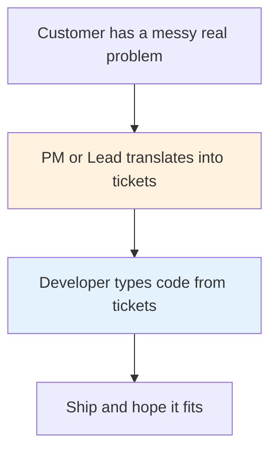
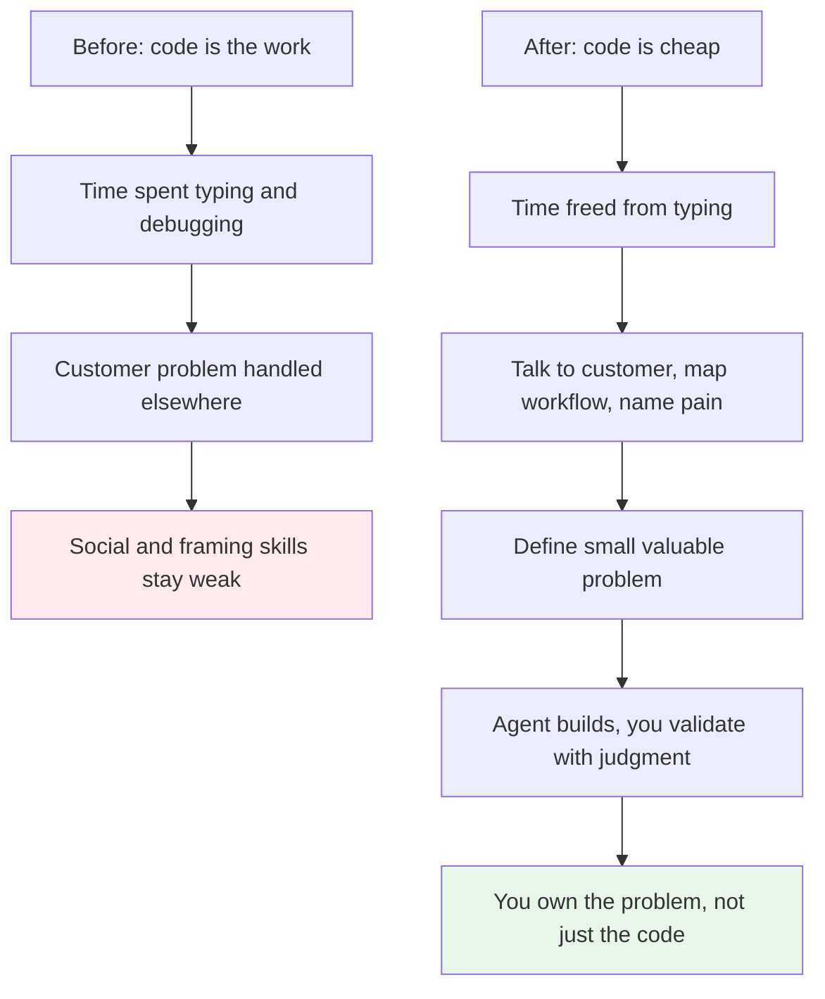
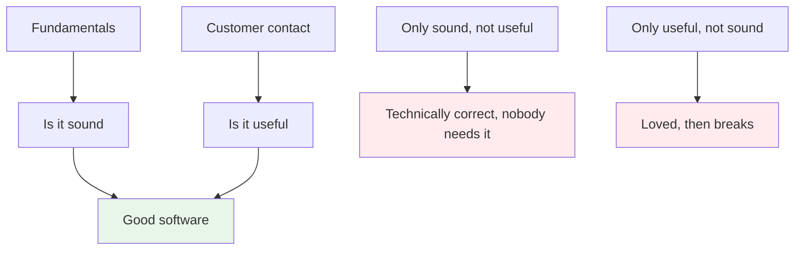
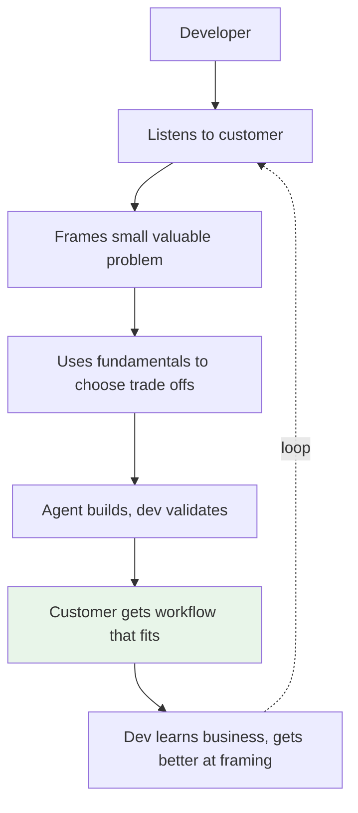

# Developers Will Move Closer to the Customer

> When coding gets cheap, what is left is understanding what to build. That forces a conversation.

This is a follow on to [The Bottleneck Moved](./the-bottleneck-moved.md). That piece argued the bottleneck shifted from writing code to judgment. This one is about a positive side effect I expect: developers will spend more time with customers, get better at human skills, and start to think like entrepreneurs.

## 1. The problem: the skill we fed was typing

For years the skill the industry fed was writing code. You got better by typing more, learning another framework, shipping tickets faster. Talking to customers, framing the real problem, mapping how a shop actually works — that was optional, or it was handled by a product manager or a team lead. You could focus on writing and avoid talking to people.

That hand off made sense when implementation was the bottleneck. Someone else owned the problem, you owned the code. But it also meant developers rarely practiced the part that decides whether the code is useful.

## 2. The shift: when the medium gets cheap, the problem owns you

Agents change where time goes. The coding part that used to take a day now takes an hour. If you do not have to think about the syntax and the boilerplate, your attention moves up. What should we build. For whom. What is worth automating and what is not.

That shift is not optional. When code is cheap, the only expensive thing is building the wrong thing. So you have to talk to the person who has the problem, watch how they work, name the pain, and decide on a small win that matters. The time you saved not hand writing code becomes time you spend turning a vague ask into a clear problem.

I think this is why the industry will push developers toward the customer even if they do not plan to. The work itself will demand it.

## 3. Social skills improve because the work forces them

Developer social skills atrophied partly because the work let them. If your value was typing speed, you could stay heads down. When your value is understanding a business, you cannot.

Listening well, asking the right follow up, running a short discovery, sketching a workflow with the owner, deciding what not to build — these become core skills. And they improve with reps, like any other skill. The more you do them, the better you get. I expect that curve to be wonderful to watch. People who were focused on writing will discover they enjoy the conversation that tells them what to write.

This also ties back to fundamentals, but in a different way. Fundamentals tell you if a solution is sound. Customer contact tells you if it is useful. You need both. One without the other ships either broken or irrelevant software.

## 4. The entrepreneur in the developer

When you focus on the consumer problem, the mindset changes. You start to notice the shape of a business, the value of a small workflow win, the reason a feature matters, and the price someone would pay to remove a daily annoyance. That is entrepreneurial thinking. It is not about starting a company. It is about caring about the outcome, not just the output.

Matteo Collina frames this as the plumber for software. A local developer who serves local businesses — the restaurant, the auto shop, the accountants office — succeeds because they can translate a real world problem into a working solution. That trade rewards people who can move from conversation to judgment to working software quickly, with agents handling the medium.

If you hold the problem well, you start to see many small problems worth solving that no big SaaS cares about. That is a whole market of useful work that was previously too expensive to do.

If that loop becomes normal, developers do not get narrower. They get broader, and the software gets closer to what people actually need.

### Sources

*   Matteo Collina — [The Future of the Software Engineering Career](https://adventures.nodeland.dev/archive/the-future-of-the-software-engineering-career/) (plumber for software, local agency idea)
*   Companion piece — [The Bottleneck Moved](./the-bottleneck-moved.md) (judgment as bottleneck, fundamentals and review)

### See also

*   ./the-bottleneck-moved.md — the bottleneck moved from writing to judgment
*   ../software-engineering/backend-master-roadmap.md — fundamentals that support judgment
