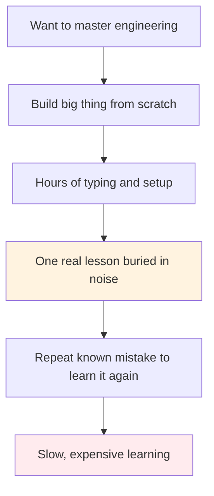
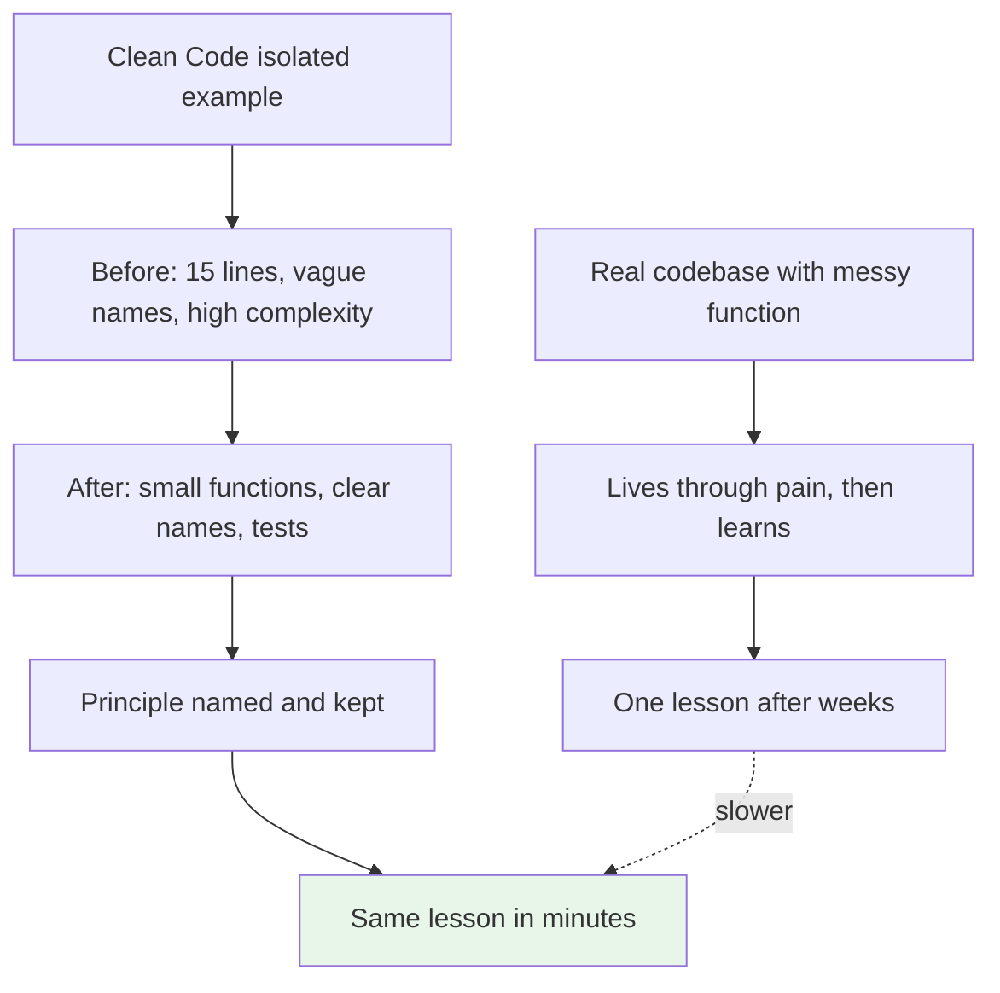
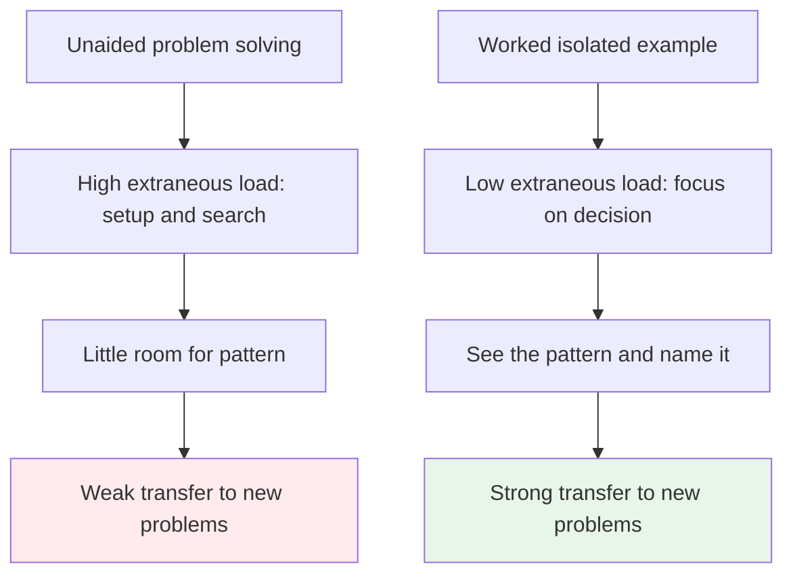
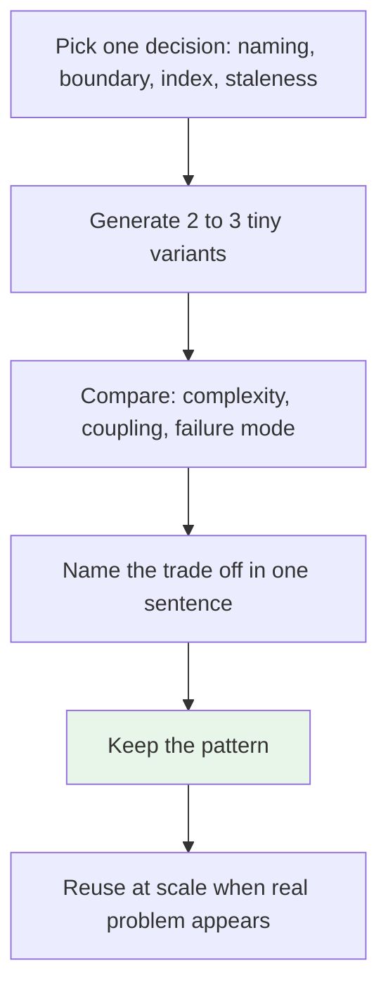
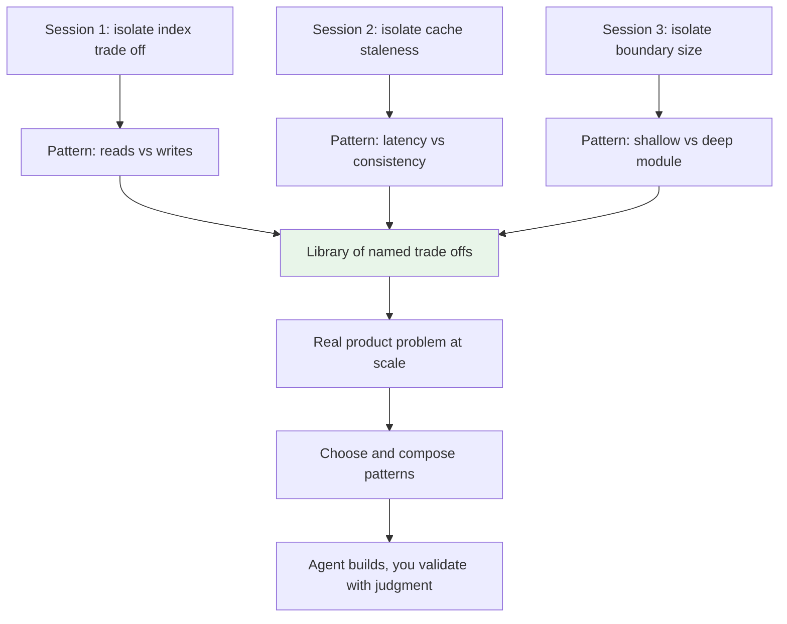

# Learning Without the Scar Tissue

> You do not have to live every bug to learn the lesson. Isolated examples are compressed experience.

This came from a simple epiphany: it is easier to master software engineering without having to do that much coding, if you study the right examples in isolation. We already know this works. We learned from `Clean Code` without having to make every mistake that book is about. The same idea applies to technologies. Generate small examples, extract the lesson, then apply it at scale when it counts.

## 1. The problem: we confuse doing a lot with learning a lot

The default path to mastery is to build a lot and hope the lessons appear. That path is slow because the signal is buried. You spend hours wiring things together, debugging setup, fighting tooling, and only then do you see the one decision that mattered. By the time you extract the pattern, you have paid the cost of the whole project.

Worse, you repeat known failures. Every messy function, every tangled dependency, every leaky abstraction has been seen before and documented. Redoing it from scratch to feel the pain is a waste of time. The pain is real but the lesson is already available. What you need is the lesson, not the scar tissue.

The problem is not practice. The problem is unfocused practice where the feedback is diluted and the pattern stays hidden.

## 2. The solution: isolated examples as compressed experience

The better way is to learn from examples in isolation. One concept, one small example, one clear before and after. You look at why the before hurts, what the after solves, and when to use it. That is how `Clean Code` teaches you.

**Technology in focus: Clean Code.** The problem it solved was maintaining large procedural and early object oriented codebases where functions were long, names were vague, dependencies were tangled, and every change was risky. Before it, teams learned maintainability only by living through that pain on their own codebase. Robert C. Martin collected those repeated failures into isolated examples — bad names, long methods, flag arguments, duplicated logic — and paired each with a refactored version and the principle behind it. The book was necessary because without that shared vocabulary, every team relearned the same lessons the hard way and left no way to talk about quality before the damage was done. You can read a ten line example, feel why `calculate` is worse than `calculateInvoiceTotalWithTax`, see the CRAP risk drop, and keep the rule without ever shipping the bad version yourself.

That compression is the point. The example is not the code. It is the lesson the code carries.

This is not a shortcut around fundamentals. It is a faster path through them. The example isolates the decision so your attention lands where judgment forms.

## 3. Why isolated examples work: the worked example effect

Learning science has a name for this. The worked example effect, studied by John Sweller and others in cognitive load theory, shows that novices learn more from studying a worked problem than from solving the same problem unaided. The reason is load. When you solve from scratch, much of your effort goes to search — what to try next, what the tool wants, how to set things up. That load leaves little room to see the structure. A worked example removes the search and lets you study the structure.

John Ousterhout makes a parallel point in `A Philosophy of Software Design` (2018). The problem that book solves is complexity that grows as systems grow. His method is to define complexity, show it in tiny isolated before and after designs, and name the trade off. Two modules, one with a shallow interface that hides behavior, one that exposes it. You see the choice, name it, and carry it. You do not need a 50k line codebase to feel it.

The same is true for a database index, a cache policy, or a queue. Small example, one trade off, name it, keep it.

That is why tiny sessions work. One pattern per session beats one project per pattern.

## 4. Generate, compare, keep the pattern

There is a new way to get those examples cheaply. Generate them. Ask an agent to produce three variants of the same thing: a function with poor boundaries and two refactored forms, an index that helps reads but hurts writes, a cache that serves stale vs waits on a lock. The generation is cheap. The learning is in the comparison.

This is different from asking an agent to build your app. You are using it as an example foundry. You prompt for the contrast, not the deliverable, and you do the review. That review is where the Spidey sense forms. You predict where it breaks, check, and keep the principle. The agent does not learn for you. It multiplies the examples you can study.

The technologies you study this way still need their context. For each, note what problem it solved and why it was necessary. Redis caching did not appear because caching was novel. It appeared because databases hit latency and load walls. Event sourcing did not appear for elegance. It appeared because audit and replay needed a history that CRUD overwrote. That context tells you when to reach for it. Without it, you just know the API, not the situation.

## 5. Small sessions now, productive at scale later

The payoff is time. In a short session you can meet a technology properly: the problem before it, the world without it, the after, the cost. You do not ship a system to learn it. You ship a lesson. Do that across a few technologies — pagination strategies, isolation levels, backpressure, stale while revalidate — and you have a library of named trade offs.

When a real problem comes, you are not learning the primitives. You are composing them. That is what productive at scale means. The implementation can be delegated to an agent because you can specify the shape, budget the complexity, and validate the output against the patterns you have kept. The work that used to be typing becomes choosing and checking.

This is the same abstraction shift described in [The Bottleneck Moved](./the-bottleneck-moved.md). Fundamentals move up one level. You operate above the medium and use the medium faster.

If you try to learn everything while building at scale, you pay the scale cost for every lesson. If you learn the lessons in isolation, you pay the isolation cost, which is small, and keep the benefit at scale.

## 6. What this means for how we write articles here

That epiphany is why the knowledge base is written the way it is: problem then solution, one diagram per concept, centered `graph TD` that stacks vertically, exhaustive but not verbose, each technology framed by the problem that made it necessary, sourced to people who lived it rather than generated summary. The format is not style. It is the method. Isolate, compare, name, keep.

If you want to use it deliberately, a light loop helps: pick one trade off, generate two tiny examples, write the one sentence rule, link it under `See also`. Consistency compounds. A few focused sessions will teach you more than weeks of undirected building, and when you need to ship, you will ship with the pattern already in your head.

### Sources

*   Robert C. Martin — `Clean Code: A Handbook of Agile Software Craftsmanship` (2008) — isolated before and after examples for names, functions, and dependencies that made maintainability teachable without reliving each failure
*   John Sweller et al. — cognitive load theory and the worked example effect (1988, 2006) — studying worked examples reduces extraneous load and improves transfer for novices versus unaided problem solving
*   John Ousterhout — `A Philosophy of Software Design` (2018) — problem it solved: complexity growth in large systems, taught through small isolated module designs and the deep versus shallow trade off
*   Companion pieces — [The Bottleneck Moved](./the-bottleneck-moved.md) and [Developers Will Move Closer to the Customer](./developers-closer-to-customer.md) — why judgment and customer framing are the scarce skills when coding becomes cheap

### See also

*   ./the-bottleneck-moved.md — why judgment moved to the center and how fundamentals budget complexity
*   ./developers-closer-to-customer.md — why cheap code pushes developers toward the customer problem
*   ../software-engineering/backend-master-roadmap.md — map for picking the next isolated lesson
*   ../production-insights/cache-stampede.md — one isolated trade off: staleness as practiced eventual consistency
