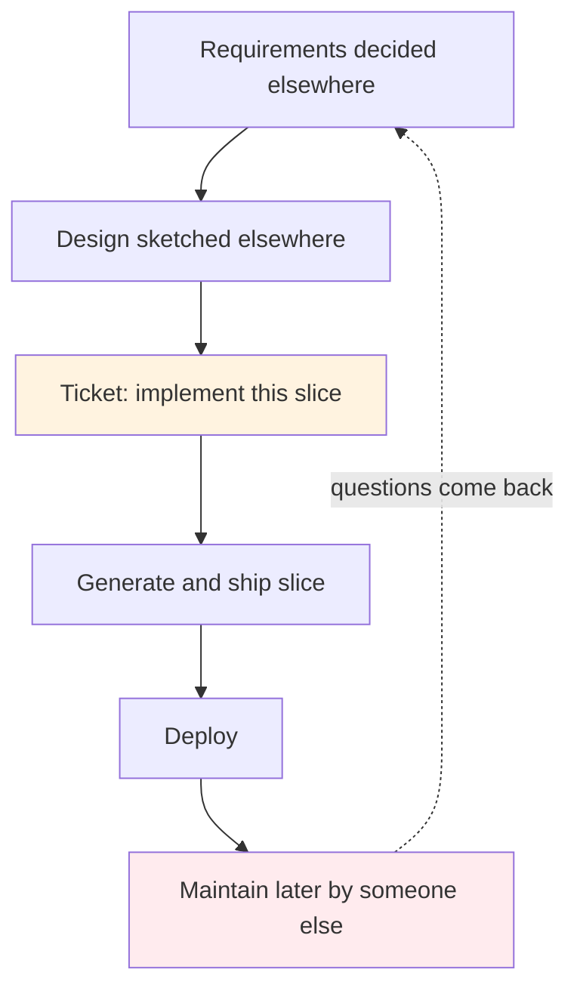
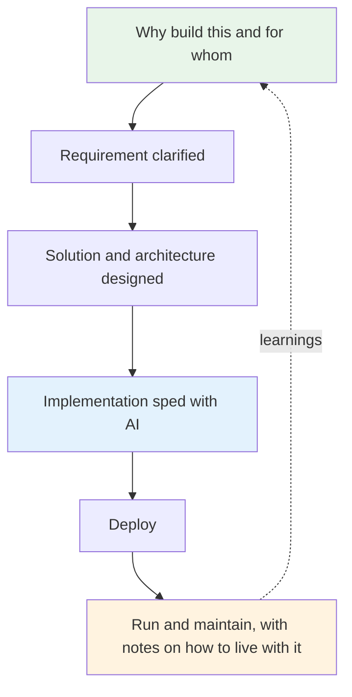
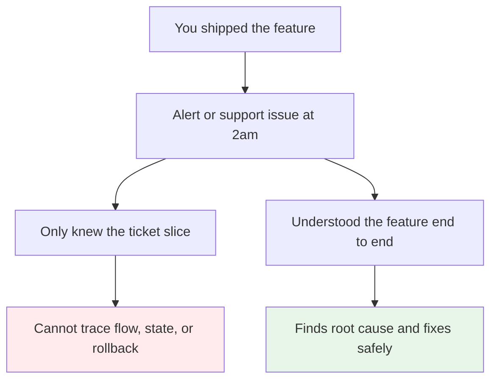
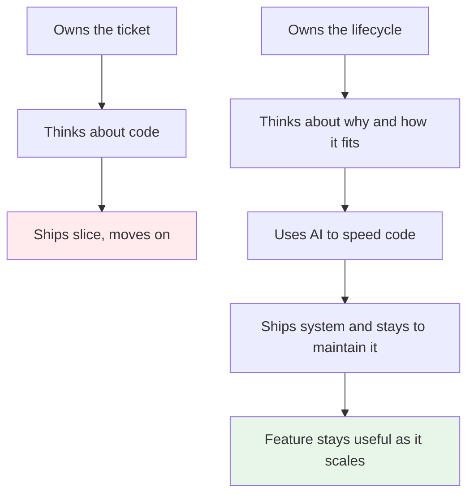

# Own the Lifecycle, Not the Ticket

> A ticket tells you what to type. A feature asks you to own the whole arc — why we build it, how it fits, how it runs, and how it will be lived with.

AI makes the middle part fast. Implementation that took days now takes hours. That speed tempts a narrow ownership: take the ticket, generate the code, ship. The problem is that a ticket never contains the parts that decide whether the feature lives well — the requirement behind it, the design and architecture that let it scale, the deployment and the months of maintenance after.

End to end ownership means you hold that bigger arc, and you use AI to speed the part it is good at.

## 1. The problem: when ownership stops at the ticket edge

When work is sliced into tickets, it is easy to treat the ticket as the job. Someone else wrote the requirement, someone else sketched the architecture, you implement what is described, and someone else will maintain it later.

No one then owns how the feature behaves as a whole. Requirements are interpreted in isolation. Architecture is assumed. Scaling is a later problem. Maintainability is notes for later that no one writes. Each hand off loses context and the feature works ticket by ticket but not as a system.

AI sharpens this. If implementation is cheap, you can close tickets faster while still not seeing the feature. Velocity looks good, ownership is actually narrower.

## 2. The solution: own the arc, speed the middle with AI

The same work looks different when one person or one small team owns the arc.

You take the requirement and clarify why we build this and how it benefits the customer and the business. You shape the solution and its place in the architecture — where the boundary is, what depends on what, where it will strain when it scales. You speed the implementation with AI tools as a productivity boost, then you deploy it and you stay responsible for running and maintaining it, including the small docs that let the next person keep it alive.

That does not mean you do everything alone. It means you do not restrict yourself to the ticket text. You move up to the requirement and out to the architecture before you go down to the code.

Two checks make this practical before you start typing:

*   **Benefit and fit:** why this feature, what problem it removes for the customer, and where it fits in the existing system. If that is vague, the implementation will be vague too, no matter how fast you generate it.
*   **How it will be lived with:** how it scales with load and data growth, what breaks first, how you will know, and how a new teammate will change it in six months. Name the maintenance shape, not just the launch shape.

You need this understanding because you are the one who will be on call for it. When the alert fires or the support ticket lands, there is no ticket author to hand it back to. You are the one who has to read the system, locate the failure, and fix it while the feature is live. If you only knew the slice you typed, you will not know where the feature stores state, what it assumed about retries, or what to roll back. Deep understanding is not extra credit. It is what makes on call survivable and support honest.

That is the maintainability and support side of the same ownership. Docs and diagrams are not bureaucracy. They are the map you will need when you are the one holding the pager.

## 3. What changes when you own this way

You plan differently. Instead of asking what the ticket wants, you ask what the feature needs to stay useful. You choose boundaries that are cheap to change later, not just cheap to demo now. You leave a short design note, a diagram, or a README that says the trade off and the rollback, because maintainability is part of building, not a follow up task.

You also use AI differently. Not to avoid thinking about architecture, but to buy time to do more of it. The hours you save not hand writing boilerplate become the hours you spend on the requirement, the design review, and the verification that the scaled and maintained version of the system still makes sense.

That is the lifecycle ownership that makes features last. Not ticket speed. Feature care.

### Sources

*   Martin Fowler — [Code Ownership](https://martinfowler.com/bliki/CodeOwnership.html) and [Continuous Integration](https://martinfowler.com/articles/continuousIntegration.html) — why ownership must cross module boundaries and stay green on the mainline
*   Basecamp Shape Up — owning the appetite and the shaped solution before the build, not just the build ticket

### See also

*   ./ownership-stays-with-you.md — the other side of ownership: you still review and answer for what you deploy
*   ./the-bottleneck-moved.md — why judgment now budgets complexity
*   ../software-engineering/backend-master-roadmap.md — the map for choosing boundaries that last
