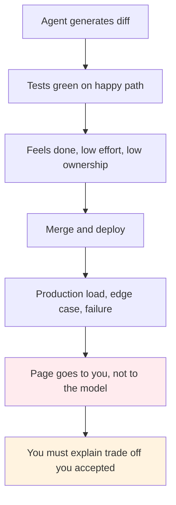
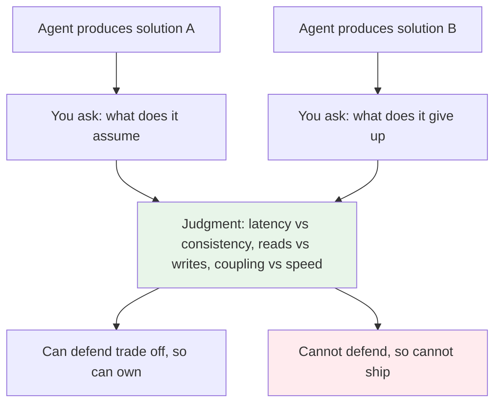
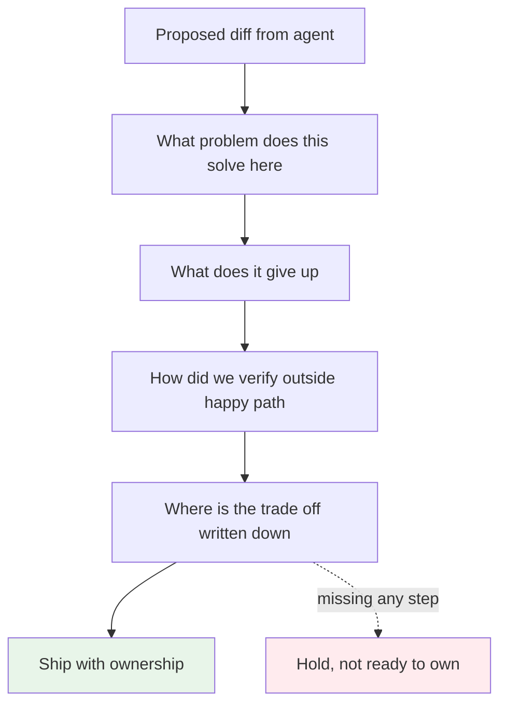
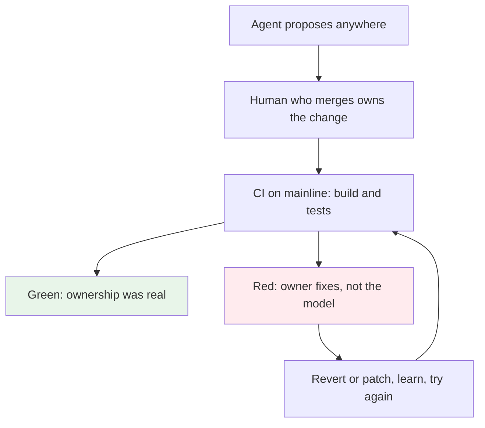

# Ownership Stays With You

> When an agent writes the code, you still own the system that ships. Ownership does not follow the keystrokes. It follows the deployment.

With AI tools you may not type the code, but you are still the person who proposes the change, merges it, and puts it in front of customers. When the feature breaks at 2am, no one pages the model. They page you. That is why telling a good solution from a bad one is not optional. It is the job.

## 1. The problem: the agent typed it so it feels like the agent owns it

The new workflow makes it easy to confuse generation with ownership. You describe a feature, the agent produces a diff, tests pass, you ship. It feels fast and the effort was low, so the sense of responsibility stays low too.

Production does not work that way. The commit has your name on it. The rollback asks for your judgment. The postmortem asks you to explain the trade off you accepted — why eventual consistency was okay, why the index was added, why the lock timeout was five seconds. If you cannot answer, you did not really review. You just moved the code along.

Bad solutions look good at this stage. They compile, they pass a narrow test, they hide coupling or a failure window you will only see under load. Without ownership, you have no reason to look for that window.

## 2. The solution: ownership means you can defend the trade off

Ownership is not about who typed the line. It is about who can stand behind the system that line creates.

Martin Fowler frames code ownership as a social choice. In [Code Ownership](https://martinfowler.com/bliki/CodeOwnership.html) (2006) he contrasts strong, weak, and collective ownership. Collective ownership works only when the team as a whole can change any module and take responsibility for it. The model assumes you understand what you change enough to own its effect. In an agent workflow that condition is sharper. The machine can touch any file, but only you can own the result.

The Pragmatic Programmer puts it as a habit: be responsible for your craft and do not leave code worse than you found it. Hunt and Thomas frame ownership not as title but as care — you may not have written every line you touch, but once you ship it, it is yours to explain and fix. That is the same test for generated code. If you cannot say why this solution fits this context and what it gives up, you are not ready to ship it.

That test is also why review is now the work. Matteo Collina calls this [The Human In The Loop](https://blog.platformatic.dev/the-human-in-the-loop) — AI implements, humans validate whether the implementation is correct for the problem. Validation is ownership.

## 3. What owning looks like before you deploy

Owning is a checklist you run before the code leaves your hands.

*   State the problem the change solves and why this technology fits. If you added a cache, name the load problem it solves. If you used a queue, name the failure it contains. No solution without a problem it was chosen for.
*   Name one thing it gives up. Stale reads, write cost of an index, retry load, blast radius. If you cannot name the cost, you have not looked.
*   Show how you verified it beyond the happy path. Concurrency, empty state, retry, cold start, bad input. The agent tested the path it imagined. You test the path production will actually take.
*   Leave a trace. A short design note or PR description that says the trade off and the rollback. Future you and your teammate inherit ownership, not just code.

This is where fundamentals pay. Algorithms, networking, database internals, and distributed systems are not trivia here. They are how you spot that a good looking solution is wrong for this data shape or this failure domain.

## 4. Ownership at team scale

Ownership does not stop at your branch. Teams that ship fast treat ownership as collective and make it practical.

Continuous integration, as Fowler describes it, keeps the mainline healthy by integrating daily and fixing broken builds immediately. The practice exists to keep ownership honest. If anyone can break the build, anyone must be able to fix it, and the team agrees that a red mainline stops the line. Generated code that merges without that discipline still creates the same long, unpredictable integration pain that CI was meant to cure, just faster.

Collective ownership plus CI gives you a simple rule for agents. The agent may propose anywhere, the human who merges owns the change, and the mainline proves whether that ownership was real. If the build stays green and the system behaves in production, ownership was exercised. If not, the owner, not the tool, cleans it up.

That loop is why responsibility does not shrink when code gets cheap. It grows. You touch more systems with less typing, so you must be able to say good from bad more often and more clearly.

### Sources

*   Martin Fowler — [Code Ownership](https://martinfowler.com/bliki/CodeOwnership.html) (2006) — strong vs weak vs collective ownership and why anyone who changes code must take responsibility for it
*   Martin Fowler — [Continuous Integration](https://martinfowler.com/articles/continuousIntegration.html) — daily integration, fixing broken builds immediately, and why ownership without a green mainline is just intent
*   Andrew Hunt and David Thomas — `The Pragmatic Programmer` (1999) — ownership as care for your craft, you own what you ship
*   Matteo Collina — [The Human In The Loop](https://blog.platformatic.dev/the-human-in-the-loop) — AI implements, humans validate correctness for the context
*   Companion piece — [The Bottleneck Moved](./the-bottleneck-moved.md) — why judgment and review are now the scarce skill

### See also

*   ./the-bottleneck-moved.md — the bottleneck moved from writing to judgment
*   ../production-insights/cache-stampede.md — an ownership check: what staleness window did you accept
*   ../software-engineering/backend-master-roadmap.md — the fundamentals that make good versus bad visible
