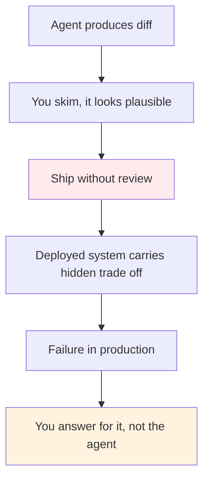
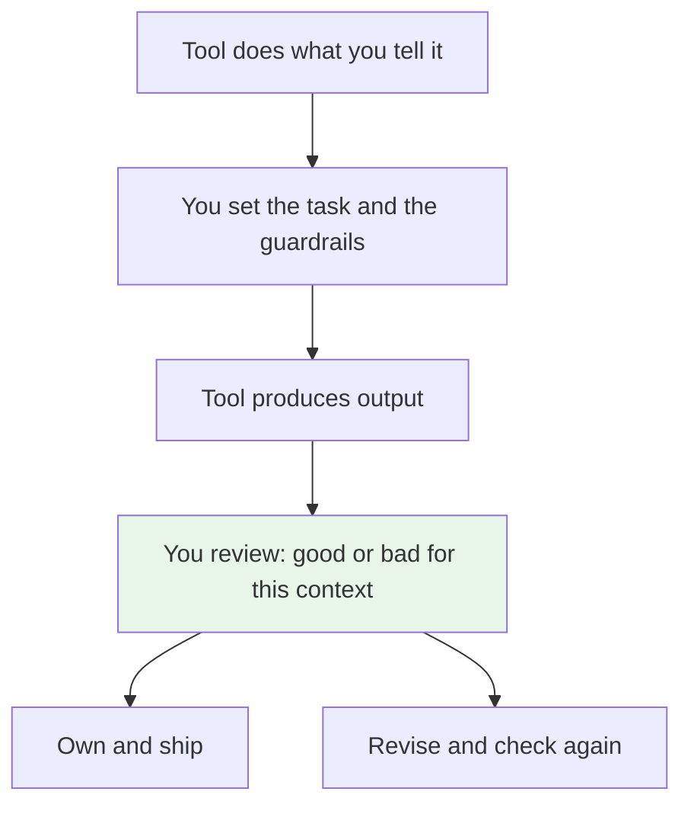

# Ownership Stays With You

> The agent is a productivity tool. It does what you tell it to do. You are the one who has to review it, ship it, and answer for it.

When you generate a feature with AI you may not type the code, but you still own the deployment. If it breaks in production, the page does not go to the agent. It goes to you. Ownership has not changed. Only the typing has.

## 1. The problem: it is tempting to ship without owning

The workflow now is: prompt, get a diff, tests look green, merge. It is fast and it feels done. That ease creates a gap. You did not write the lines, so you feel less responsible for them. You can tell yourself the agent produced it, so the agent is responsible.

That story does not hold where it matters. The commit history shows your name. The rollback asks for your call. The incident review asks why this solution was chosen and not another. If you cannot say what the code assumes and what it gives up, you did not review it. You just forwarded it.

An agent will not tell you it is unsure in a way you can rely on. It will produce a plausible solution and move on. The difference between a good and a bad solution here is often invisible in the diff — a missing lock, a stale window that is too long, an index that hurts writes. If you do not look, you ship the risk.

## 2. The solution: treat the agent like any power tool

A power tool does not remove responsibility. It increases it. A saw cuts faster when you guide it well and cuts the wrong place faster when you do not.

Agents are the same. They do what you tell them, with the context you give and the checks you set. That is their value. It also means every generated change needs the same review you would give to a human teammate, or more. Not because the agent is careless, but because you are the one deploying a feature or a system into the world and customers will hold you to how it behaves.

Ownership here is simple. If you cannot explain the change, you are not ready to own it. If you can — this is the problem it solves, this is what it gives up, this is how I verified it — then you can ship it, whether you typed it or not.

You do not need to be philosophical about this. Review is the ownership. Before you deploy, read the diff as if you wrote it and have to defend it tomorrow.

A short check helps: what does it assume, what does it cost, how did you test outside the happy path. If those three have answers, you own it. If not, you are not done.

### Sources

*   Martin Fowler — [Code Ownership](https://martinfowler.com/bliki/CodeOwnership.html) — collective ownership only works when anyone who changes code can take responsibility for it
*   Matteo Collina — [The Human In The Loop](https://blog.platformatic.dev/the-human-in-the-loop) — AI implements, humans validate whether it fits

### See also

*   ./the-bottleneck-moved.md — why review and judgment are now the bottleneck
*   ../production-insights/cache-stampede.md — an example where good versus bad is a stale window you must name before you ship
