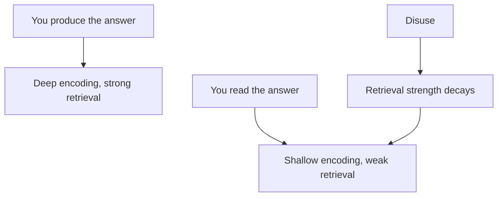
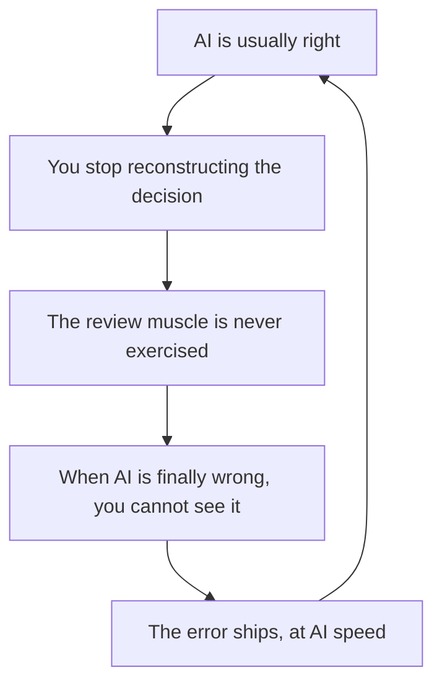

# The Review-Only Paradox

> When the AI writes the code and you only review it, you stop producing the knowledge that review runs on. Review is fed by production. Cut the production and the judgment slowly starves, even while you review all day.

**TLDR**

- **Reviewing is consumption, not practice.** Review more, write less, and your review gets worse.
- **Skill is built by producing an answer, not reading one** (the generation and testing effects). Retrieval strength decays with disuse even while the knowledge stays.
- **Good AI hides the decay.** When the model is usually right you reconstruct nothing, so the subtle nuances fade first.
- **Not new.** Bainbridge's Ironies of Automation (1983), pilot skill decay, and a 2023 mammography study all show the observer losing the producer's skill.
- **Code evidence.** Devs were 19% slower with AI while believing they were faster (METR 2025); LLM writing lowered ownership and recall (MIT 2025).
- **Fix.** Keep producing: write some code by hand, predict before you reveal, explain the code back.

## The problem

You read more code than ever and trust your review less. Writing was not just producing the artifact; it was the exercise that built the judgment you now apply all day. Delegate the writing and you keep the output flowing while you stop the training, drawing down a balance you no longer pay into.

## Why review cannot be fed by review

You remember what you generate far better than what you read. Jacoby (1978) named the distinction: *solving a problem versus remembering a solution*. Retrieval practice beats rereading, and Bjork's theory of disuse separates storage strength from retrieval strength: you may still know a nuance, but if you have not called it up in months it will not arrive in time to catch a bug.

<div style={{display: 'flex', justifyContent: 'center'}}>



</div>

## Why good AI makes it worse

Bad code forces reconstruction, the retrieval practice that keeps the skill alive. Good code does the opposite: it is smooth and plausible, so you skim, it reads correctly, and you approve without producing anything. The better the model, the weaker your training signal.

<div style={{display: 'flex', justifyContent: 'center'}}>



</div>

## This already happened without AI

Bainbridge's 1983 *Ironies of Automation*: automating the routine task leaves the human the residual job of monitoring and handling rare failures, and those residual skills decay fastest because the routine practice that kept them sharp is gone. Pilots lost manual flying as automation took control. In a 2023 mammography study, readers improved when AI suggestions were correct but performed worse than unaided when they were wrong, most of all the least experienced.

## The code evidence

METR's 2025 randomized trial found experienced developers 19% slower with AI, while they still believed it had sped them up 20%. MIT's 2025 study of LLM-assisted writing found lower engagement, ownership, and recall of one's own work, which the authors called cognitive debt.

## What it looks like

```go
a := []int{1, 2, 3, 4}
b := a[:2]
b = append(b, 99) // a becomes [1 2 99 4]
```

`b` shares `a`'s backing array and `append` has capacity, so it writes in place. The programmer who still writes Go sees the aliasing in a generated diff; the review-only programmer sees two plausible lines and moves on. The nuance did not vanish, but it no longer fires on its own. That is the failure mode: lost automatic retrieval, not ignorance.

## The fix

Keep a production surface. Write some code by hand; own one module you still implement. Predict the diff before you look, then compare. Explain the code back from memory; if you cannot say why each decision is as it is, you found the nuance that has gone quiet. The busy reviewer is drawing skill down; the one who still writes keeps their review sharp. This is the harder half of [You Cannot Catch What You Cannot Read](./you-cannot-catch-what-you-cannot-read.md): reading generated code is necessary, but the reading skill is fed by writing.

## Sources

- Bainbridge, *Ironies of Automation*, Automatica, 1983. https://doi.org/10.1016/0005-1098(83)90046-8
- Dratsch et al., *Automation Bias in Mammography*, Radiology, 2023. https://doi.org/10.1148/radiol.222176
- Kosmyna et al., *Your Brain on ChatGPT*, 2025. https://arxiv.org/abs/2506.08872
- Becker et al., *Early-2025 AI and Experienced Developer Productivity*, METR, 2025. https://metr.org/blog/2025-07-10-early-2025-ai-experienced-os-dev-study/
- Generation and testing effects, and the disuse theory: Slamecka & Graf 1978, Jacoby 1978, Roediger & Karpicke 2006, Bjork & Bjork 1992.

### See also

- [You Cannot Catch What You Cannot Read](./you-cannot-catch-what-you-cannot-read.md)
- [The Bottleneck Moved](./the-bottleneck-moved.md)
- [Go Slices](./../software-engineering/go/go-slices.md)
