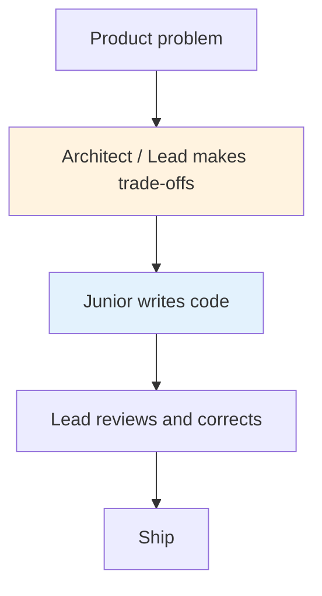
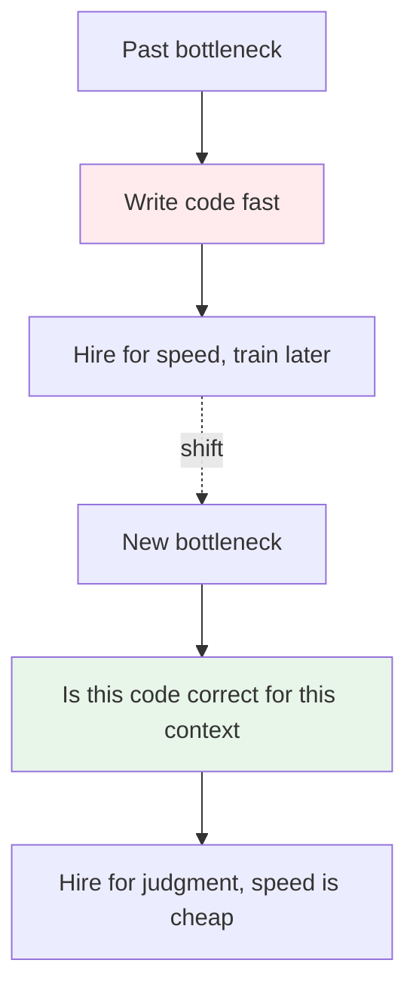
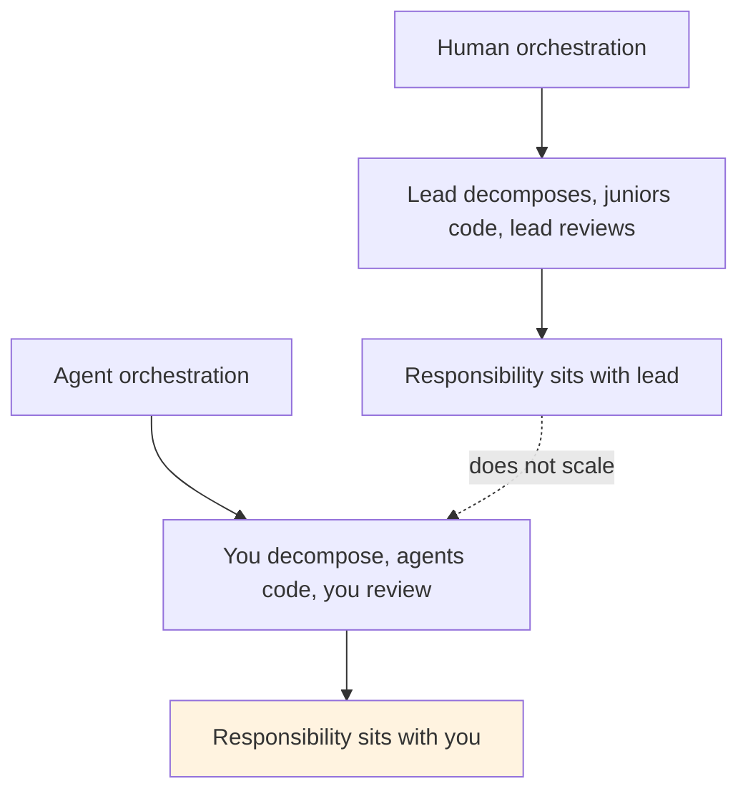
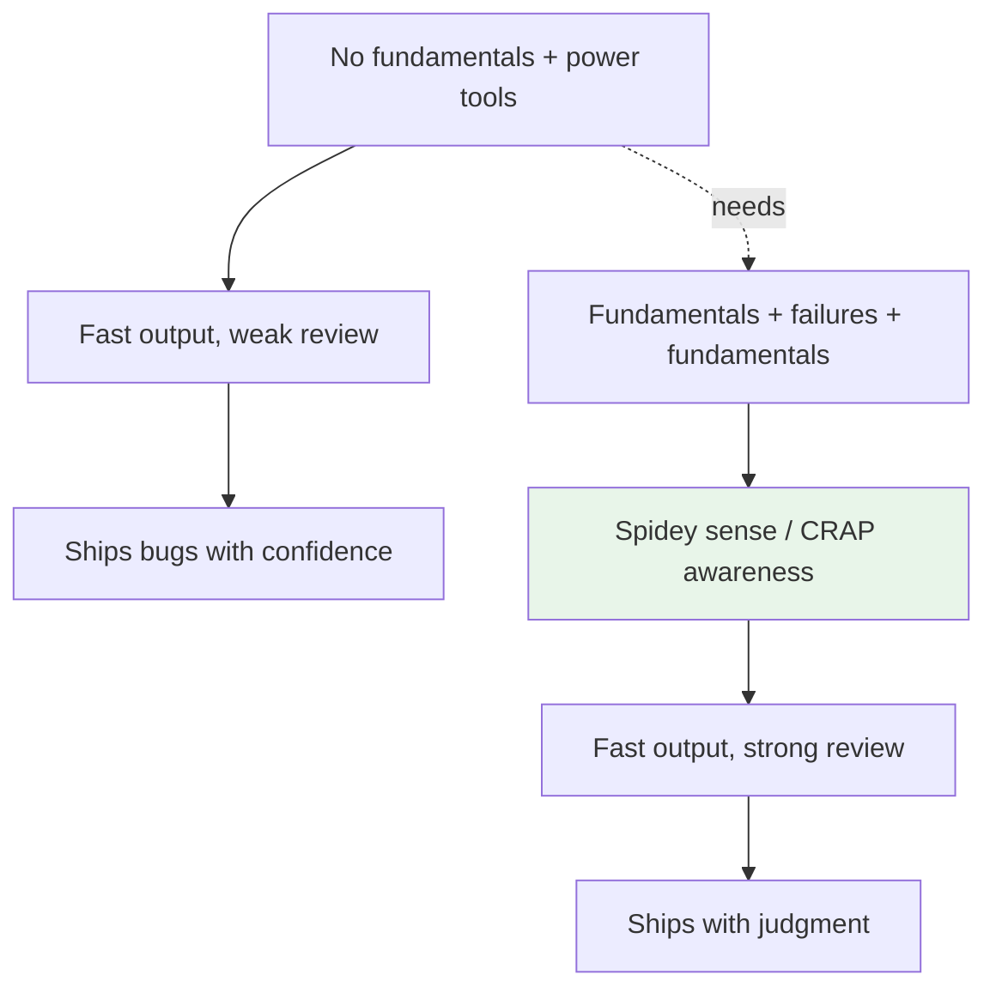
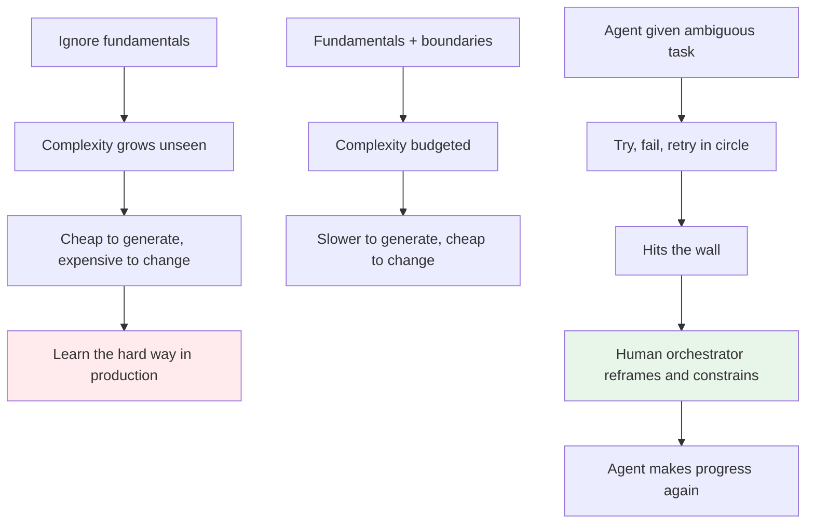
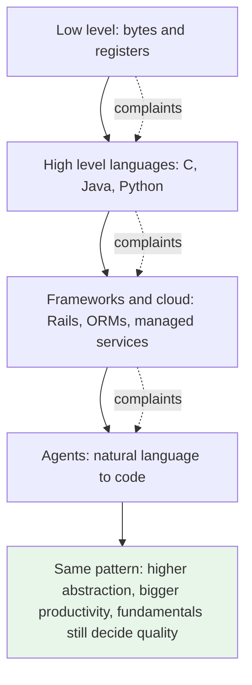

# The Bottleneck Moved — From Writing Code to Judgment

> Coding was the medium, not the work. When the medium gets cheap, what is left is responsibility.

This is my take after reading [Matteo Collina — The Future of the Software Engineering Career](https://adventures.nodeland.dev/archive/the-future-of-the-software-engineering-career/) (Node.js TSC, Fastify, Platformatic) and sitting with Uncle Bob's recent rants about code review, CRAP scores, and power tools. I am stitching their points with what I see on the ground.

## 1. The problem: we mistook the medium for the craft

For a decade the hiring model was simple. Companies needed people to type code fast. Learn React in twelve weeks, ship a portfolio, get hired, pick up the rest on the job. It worked because the bottleneck was implementation speed. If you could turn a ticket into code, you were useful.

In practice this created hand-holding. A solution architect or a team lead would decompose the problem, set the boundaries, make the trade-offs, and review everything. Juniors executed. That was not a bug. That was the economics. Companies invested in people and the guidance compensated for missing fundamentals.

The result is that many got attached to writing code as the job, not as a medium for problem solving. When you are guided long enough, you do not have to take responsibility for the design. Someone else holds it.

This is the loop Collina describes when he says companies no longer need bodies to type code. If the loop depended on cheap implementation, it breaks when implementation becomes cheap.

## 2. The shift: agents remove the bottleneck we built around

LLMs and agents can now do the work that used to be assigned to juniors. Bug fixes, simple features, routine maintenance. Not perfectly, but fast and cheap enough to change the economics. Collina is blunt about it: the bootcamp to junior pipeline that assumed years of on-the-job training is closing, and hiring data already shows entry level roles evaporating.

Even if OpenAI and Claude disappeared tomorrow, we are not going back. Open source models out of China and elsewhere can be deployed on premise and will keep writing code. The capability is out of the lab. That means the bottleneck is no longer writing. It is review. Collina's earlier piece called this [The Human In The Loop](https://blog.platformatic.dev/the-human-in-the-loop) — AI implements, humans validate whether the implementation is correct.

What becomes valuable is judgment. When an agent produces a sorting algorithm, can you tell if it fits your data properties. When it suggests a caching layer, do you understand consistency vs latency. When it generates a distributed design, can you spot the failure modes. That judgment needs algorithms, networking, database internals, hardware and cache behavior, distributed systems — the fundamentals that looked theoretical when code was the bottleneck.

The opportunity Collina is excited about follows from this: a competent developer with agents can build in hours what took weeks. That makes custom software affordable for the restaurant, the auto shop, the accountants office. He calls it the plumber for software, local agencies serving local businesses the way local web shops did. That market favors generalists who can talk to a client, understand the real problem, and deliver a working solution. It favors judgment over raw typing speed.

## 3. Why hand-holding no longer scales

In the old model you had human orchestration. The lead orchestrated people. Architecture was a guidance layer that let juniors contribute without owning trade-offs.

With agents the orchestration layer is still there, but it is now partly done by the orchestrator agent and partly by you writing the prompts, checks, and guardrails. The difference is that agents do not learn the fundamentals for you. They will produce an answer confidently and you have to decide if it is right. If you are used to being told where the boundary is, you will accept the first plausible output.

Taking responsibility now looks like this: choosing when to use strong consistency vs eventual, when to wait on a lock vs serve stale, when a queue needs exactly once, when an index helps writes vs hurts them. These are not coding tasks. They are trade-off decisions. Companies used to let leads make them for the team. With agents, every person operating an agent has to make them, or supervise an agent that makes them poorly.

This is why I say the expectation changed from following guidance to exercising independence. You are not hired to produce code under supervision. You are hired to own the decision and prove the code matches it.

## 4. Power tools and the Spidey sense

Uncle Bob made two points that stuck with me. First, he said he does not review or read code as much as people expect, which surprised listeners given his Clean Code work. Second, in a later video and a Twitter rant, he said new engineers should not reach for these power tools too early.

The thread connecting the two is what he calls the Spidey sense. After decades of seeing code break, you glance at a function and feel that something is off — complexity too high, change risk high, tests too low. He even built tooling around this idea, the CRAP score (Change Risk Analysis and Predictions), which combines complexity and test coverage to flag risky code. The sense is not magic. It is pattern recognition trained on fundamentals and failures.

His warning is that if new engineers start with agents doing the writing, they never train that sense. They get productivity without calibration. He sees agents as power tools. A power saw does not make you a carpenter. If you have the sense, it multiplies you. If you do not, it lets you cut faster in the wrong direction.

That is why I agree with both Collina and Uncle Bob: the tool is not the threat to juniors. Missing fundamentals is. Agents force you to review at a higher level, and review without fundamentals is guessing.

## 5. Fundamentals are how you manage complexity, and agents still hit the wall

Uncle Bob puts it simply: fundamentals are how you manage complexity. People who ignore that will learn the hard way. You can generate code quickly, but if you do not understand decomposition, dependencies, state, and failure modes, every new file adds hidden coupling. The code looks done until you try to change it, and then the cost appears.

This is also why agents hit the wall. Give an agent a task with enough ambiguity and it will loop. It tries a fix, runs, fails, tries a variant, fails again, and circles. It does not step back and reframe the problem because reframing needs the same judgment you use to decide a boundary or a trade-off. The agent is still inside the implementation medium. Someone has to orchestrate it from outside.

That orchestrator is a human. Not to type faster, but to interrupt the loop, name the real problem, set the constraint, and say this is where we stop abstracting or this is the consistency we can live with. Without that, the agent keeps polishing the wrong solution. With it, the agent is useful again. This is the same hand-holding to responsibility shift from section 3, but now the person being guided is the agent.

So fundamentals are not nostalgia. They are the way you keep an agent from burying you in complexity and the way you know when to step in and reframe.

## 6. This has happened before — the abstraction just moved again

Uncle Bob makes one more point that I think puts this in perspective. Every time the abstraction level rose, people at the lower level complained, and then productivity boomed. We went from writing low level code to high level languages. The assembly and C folks warned we would lose control. We went from manual memory to garbage collection, from bare metal to cloud, from hand written SQL to ORMs. Each step felt like we were giving up something essential, and each time the industry moved faster because the new layer let more people solve higher problems.

This is the same recurring pattern throughout computer science and the engineering profession. The industry has evolved so fast in so little time precisely because abstraction keeps compounding. Agents are the next level. They do not replace understanding. They raise the level at which you need it. You still need to know what is underneath, but now you operate one level higher, where the work is specifying the problem clearly, budgeting complexity, and validating the result.

If you see it this way, the panic makes less sense. The job was never to stay at the lower abstraction. The job was always to climb it and manage the trade offs the new layer reveals. Those who complained at each shift were right that skill at the lower level mattered, and wrong that staying there was the future. The productivity boost went to those who learned the fundamentals well enough to trust the new abstraction and to know when to drop below it.

That is why I do not frame agents as the end of engineering. They are the next abstraction. And like every abstraction before them, they reward those who understand the fundamentals enough to use them well.

## 7. What this means for you

This is not a prediction that coding goes away. Code is still the medium. Problem solving is still the work. What changes is who is expected to hold the trade-off in their head.

**If you are a student or early career:** invest where judgment comes from. Data structures and algorithms for choosing the right tool for your data properties. Networking and operating systems for understanding latency and failure. Database internals for indexing and transaction trade-offs. Distributed systems for consistency and partition behavior. Cache behavior for staleness windows. These are not academic exercises now. They are how you evaluate an agent's output.

**If you are used to hand-holding:** practice taking the decision end to end. Write the design note before you prompt. List the trade-offs you are accepting. Review the agent diff as if you wrote it and have to defend it in production. Build the Spidey sense on purpose — read code without running it, predict where it breaks, then check. Use CRAP-like signals. Keep complexity low and coverage where risk is high.

**If you are already senior:** the opportunity is real. Small businesses that could never afford custom software can now afford you with agents. That market values someone who can listen to a client, map the workflow, and ship something that fits, not the purest tech.

Collina frames internships as the new apprenticeship for this reason. Judgment is not learned from tutorials. It is learned from watching things break, shipping something that looked right and discovering why it was not, and working alongside people who have the models in their head. If you can, optimize for environments where you are close to senior judgment and real production pressure, not just tutorial work.

The industry has changed before and this is another shift. The open models mean we do not revert to hand-typing as the scarce skill. The scarce skill is now owning the problem, making the trade-off, and reviewing with care. That has always been the job. It is just visible again.

### Sources

*   Matteo Collina — [The Future of the Software Engineering Career](https://adventures.nodeland.dev/archive/the-future-of-the-software-engineering-career/) and [The Human In The Loop](https://blog.platformatic.dev/the-human-in-the-loop)
*   Uncle Bob (Robert C. Martin) — rants and videos on reading code, CRAP score, and power tools for new engineers (Clean Code, CRAP metric — Change Risk Analysis and Predictions)
*   Context from my own notes on the shift from human orchestration to agent orchestration in teams

### See also

*   ../caching/cache-stampede.md — judgment example: strong vs eventual, latency vs consistency
*   ../caching/stale-is-eventual.md — bounded staleness as practiced eventual consistency
*   ../software-engineering/backend-master-roadmap.md — where fundamentals sit
